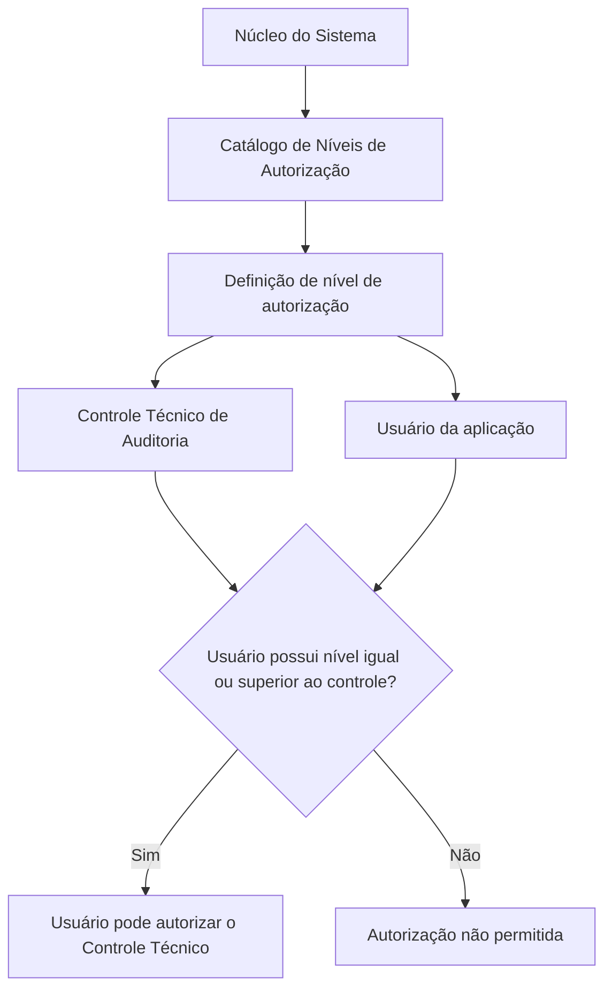

# Definição dos Níveis de Autorização dos Controles Técnicos

## 1. Metadados do Documento
- **Arquivo de Origem:** `Não identificado no conteúdo fornecido`
- **Tipo de Documento:** `Especificação Técnica`
- **Domínio / Sistema:** `Sistema de Controles Técnicos de Auditoria / Entidades MAPFRE`
- **Público-Alvo:** `Usuários da aplicação, auditores e equipes funcionais`
- **Data/Versão Identificada:** `Não identificada`

---

## 2. Resumo Executivo & Contexto de Negócio

O documento define o catálogo de níveis de autorização disponível no núcleo do sistema para associar níveis de autorização a Controles Técnicos e aos usuários da aplicação. O catálogo é entregue inicialmente sem conteúdo nas instalações.

Para os Controles Técnicos de Auditoria, é obrigatório atribuir um código de nível de autorização dentre os códigos existentes na aplicação. O código associado ao controle estabelece o requisito mínimo para que um usuário possa autorizá-lo.

A regra central determina que o usuário que pretende autorizar um Controle Técnico de Auditoria deve possuir nível de autorização igual ou superior ao nível configurado no próprio controle técnico.

O documento também descreve propriedades gerais do cadastro: companhia, nível de autorização, descrição do nível e descrição abreviada. Como referência operacional histórica, informa que entidades MAPFRE tradicionalmente definiram o intervalo de níveis entre `NIVEL0` e `NIVEL09`.

---

## 3. Arquitetura, Componentes & Tecnologias Envolvidas

Os componentes e conceitos explicitamente citados são:

- **Núcleo do Sistema:** componente funcional que permite codificar níveis de autorização.
- **Controles Técnicos:** elementos que podem ter níveis de autorização associados.
- **Controles Técnicos de Auditoria:** controles que exigem a atribuição de um código de nível de autorização.
- **Usuários da aplicação:** usuários que necessitam de autorização compatível para autorizar controles técnicos.
- **Catálogo de Níveis de Autorização:** repositório de informações entregue inicialmente vazio.
- **Companhia:** código da companhia sobre a qual é realizada a definição do nível de autorização.



**Nota de Análise:** o documento não detalha tecnologias de implementação, integrações, APIs, métodos HTTP, contratos JSON, banco de dados, ambientes técnicos ou mecanismos de autenticação.

---

## 4. Regras de Negócio, Especificações Funcionais & Processos

1. O núcleo do sistema permite codificar os possíveis níveis de autorização.
2. Os níveis de autorização podem ser associados aos próprios Controles Técnicos e aos usuários da aplicação.
3. Todo Controle Técnico de Auditoria deve receber um código de nível de autorização.
4. O código atribuído ao Controle Técnico de Auditoria deve pertencer aos códigos de níveis existentes na aplicação.
5. Um usuário somente pode autorizar um Controle Técnico de Auditoria quando possuir nível de autorização igual ou superior ao nível do controle técnico.
6. O repositório de informações de níveis de autorização é entregue inicialmente vazio nas instalações.
7. A propriedade **Companhia** identifica o código da companhia para a qual está sendo definida a configuração do nível de autorização.
8. A propriedade **Nível de Autorização** determina a chave do nível de autorização.
9. A propriedade **Descrição do Nível de Autorização** registra a descrição do nível de autorização.
10. A propriedade **Descrição Abreviada** registra a abreviatura do nível de autorização capturado no sistema.
11. Tradicionalmente, as entidades MAPFRE definiram o intervalo de níveis entre `NIVEL0` e `NIVEL09`.

---

## 5. Tabelas de Parâmetros, Ambientes e Estruturas de Dados

| Item / Parâmetro | Descrição / Função | Tipo / Valores / Formato | Ambiente / Observações |
| :--- | :--- | :--- | :--- |
| Companhia | Indica o código da companhia sobre a qual é realizada a definição do nível de autorização. | Código de companhia; formato não especificado. | Aplicável à definição do nível de autorização. |
| Nível de Autorização | Determina a chave do nível de autorização. | Chave; formato não especificado. | Deve corresponder a um nível existente na aplicação para associação a controles. |
| Descrição do Nível de Autorização | Indica a descrição do nível de autorização. | Texto; formato não especificado. | Propriedade geral do cadastro. |
| Descrição Abreviada | Contém a abreviatura do nível de autorização capturado no sistema. | Texto abreviado; formato não especificado. | Propriedade geral do cadastro. |
| Código de nível do Controle Técnico de Auditoria | Código de nível associado a um Controle Técnico de Auditoria. | Um dos possíveis códigos de níveis existentes na aplicação. | Requisito obrigatório para controles técnicos de auditoria. |
| Nível de autorização do usuário | Nível associado ao usuário da aplicação para fins de autorização. | Nível comparável ao nível do controle; formato não especificado. | Deve ser igual ou superior ao nível do Controle Técnico de Auditoria. |
| Faixa tradicional MAPFRE | Intervalo de níveis tradicionalmente definido pelas entidades MAPFRE. | `NIVEL0` a `NIVEL09`. | Informação histórica indicada na seção de perguntas frequentes. |
| Repositório de informações | Repositório que armazena a informação de níveis de autorização. | Conteúdo inicial vazio. | Entregue às instalações sem conteúdo. |

---

## 6. Bateria de Perguntas & Respostas para RAG (FAQ Sintético)

### P1: Qual é a finalidade dos níveis de autorização no sistema?
**R:** Os níveis de autorização permitem ao núcleo do sistema codificar níveis que podem ser associados aos Controles Técnicos e aos usuários da aplicação.

### P2: Um Controle Técnico de Auditoria precisa obrigatoriamente ter nível de autorização?
**R:** Sim. Para os Controles Técnicos de Auditoria, é necessário atribuir um código de nível de autorização dentre os códigos de níveis existentes na aplicação.

### P3: Qual condição um usuário deve cumprir para autorizar um Controle Técnico de Auditoria?
**R:** O usuário deve ter um nível de autorização igual ou superior ao nível de autorização associado ao Controle Técnico de Auditoria que pretende autorizar.

### P4: Um usuário com nível inferior ao nível de um Controle Técnico de Auditoria pode autorizá-lo?
**R:** Não. O documento estabelece que a autorização somente pode ser realizada quando o nível do usuário for igual ou superior ao nível atribuído ao controle técnico.

### P5: O catálogo ou repositório de níveis de autorização já possui conteúdo na entrega inicial?
**R:** Não. O repositório de informações é entregue inicialmente às instalações vazio de conteúdo.

### P6: O que representa a propriedade Companhia na definição de um nível de autorização?
**R:** A propriedade Companhia indica o código da companhia sobre a qual está sendo realizada a definição do nível de autorização.

### P7: Qual propriedade identifica a chave de um nível de autorização?
**R:** A propriedade **Nível de Autorização** determina a chave do nível de autorização.

### P8: Qual é a função da Descrição Abreviada?
**R:** A propriedade **Descrição Abreviada** contém a abreviatura do nível de autorização que está sendo capturado no sistema.

### P9: Quais níveis de autorização foram tradicionalmente definidos nas entidades MAPFRE?
**R:** O documento informa que, tradicionalmente, as entidades MAPFRE definiram o intervalo de níveis de `NIVEL0` até `NIVEL09`.

### P10: O documento descreve os formatos técnicos dos códigos de companhia e dos níveis de autorização?
**R:** Não. O documento identifica a função das propriedades Companhia e Nível de Autorização, mas não especifica formatos, tamanhos, tipos de dados ou regras técnicas de validação para esses campos.

---

## 7. Glossário de Termos, Siglas & Conceitos-Chave

- **Autorização:** ação permitida a um usuário quando o nível de autorização do usuário é igual ou superior ao nível associado ao Controle Técnico de Auditoria.
- **Catálogo de Níveis de Autorização:** repositório de informações destinado à definição dos níveis de autorização disponíveis no sistema.
- **Companhia:** código da companhia sobre a qual é realizada a definição do nível de autorização.
- **Controle Técnico:** elemento ao qual podem ser associados níveis de autorização.
- **Controle Técnico de Auditoria:** controle técnico que requer a atribuição de um código de nível de autorização.
- **MAPFRE:** entidade corporativa mencionada como referência histórica para a faixa de níveis `NIVEL0` a `NIVEL09`.
- **NIVEL0 a NIVEL09:** faixa de níveis tradicionalmente definida nas entidades MAPFRE.
- **Usuário da aplicação:** usuário que pode receber nível de autorização e autorizar controles conforme a regra de comparação de níveis.

---

## 8. Notas Críticas, Riscos & Limitações

- O repositório de níveis de autorização é entregue inicialmente vazio; a configuração inicial dos níveis é necessária para viabilizar a associação de níveis a controles e usuários.
- A autorização de Controles Técnicos de Auditoria depende da correta atribuição de níveis tanto ao controle quanto ao usuário.
- O documento não especifica o comportamento do sistema quando um Controle Técnico de Auditoria não possui código de nível de autorização.
- O documento não detalha os formatos técnicos, a persistência, APIs, telas, permissões administrativas ou trilhas de auditoria relacionadas aos níveis de autorização.
- A faixa `NIVEL0` a `NIVEL09` é apresentada como definição tradicional nas entidades MAPFRE, não como uma especificação universal ou obrigatória para todas as instalações.
- A referência a “Definición Controles Técnicos” e “Preguntas frecuentes” aparece como vínculo documental, sem conteúdo adicional fornecido nesta extração.

---

## 9. Conteúdo Bruto Estruturado (Referência Fiel)

```text
--- [PÁGINA 1 DE 2] ---

DEFINICIÓN de los NIVELES de
AUTORIZACIÓN de los Controles Técnicos
Funcionalmente, el núcleo del Sistema cuenta con la posibilidad de codificar los posibles niveles de
autorización que van a tener asociados los propios Controles Técnicos y los usuarios de la
aplicación.
En el caso de los controles técnicos de Auditoría es necesario asignarles un código de nivel de
autorización, dentro de los posibles códigos de niveles existentes en la aplicación, lo cual implica que
el Usuario que pretenda autorizarlo ha de tener asignado un nivel de autorización igual o superior al
del control técnico para poder realizarlo.
Este repositorio de información se entrega inicialmente a las instalaciones vacío de contenido.
Propiedades Generales
Propiedades Generales
Compañía
Esta propiedad le indica al sistema el código de la compañía sobre la que se está realizando la
definición del Nivel de Autorización.
Nivel de Autorización
Esta propiedad determina la clave del Nivel de Autorización.
Descripción del Nivel de Autorización
 /
 CF
Home Solutions APIs Documentation Zeus
EN


--- [PÁGINA 2 DE 2] ---

Esta propiedad indica la descripción del Nivel de Autorización.
Descripción Abreviada
Esta propiedad contiene la abreviatura del Nivel de Autorización que se está capturando en el
Sistema.
Vínculos
Relación de Directrices y Documentos funcionales cuya lectura recomendada para evitar que la
interpretación aislada del presente documento pueda conducir a error.
Definición Controles Técnicos
Preguntas frecuentes
(1) ¿Existe alguna circunstancia operativa que deba ser tomada en consideración sobre este
catálogo?
Tradicionalmente se han definido en las Entidades MAPFRE el rango de niveles: NIVEL0 al NIVEL09
```
