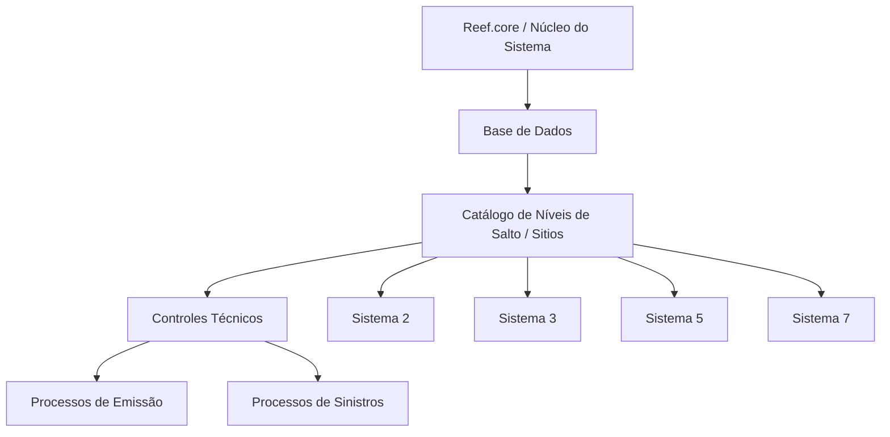

# Definição dos Níveis de Salto dos Controles Técnicos no Reef.core

## 1. Metadados do Documento
- **Arquivo de Origem:** `Não informado`
- **Tipo de Documento:** `Especificação Técnica`
- **Domínio / Sistema:** `Reef.core — Controles Técnicos para processos de Emissão e Sinistros`
- **Público-Alvo:** `Não identificado explicitamente`
- **Data/Versão Identificada:** `Não identificada`

---

## 2. Resumo Executivo & Contexto de Negócio

O documento define o catálogo de **Níveis de Salto** dos **Controles Técnicos** disponíveis no núcleo do sistema Reef.core. Os Níveis de Salto também são denominados “sitios” e representam os pontos concretos da operação em que regras de negócio associadas a Controles Técnicos podem ser executadas.

O núcleo do sistema armazena na Base de Dados os possíveis Níveis de Salto. Esse repositório é entregue inicialmente às instalações com conteúdo pré-configurado, estabelecendo uma lista de pontos operacionais disponíveis para execução de controles durante processos de **Emissão** e **Sinistros**.

Cada registro do catálogo possui três propriedades gerais: **Código do Sistema**, **Nível de Salto** e **Nome do Nível de Salto**. O Código do Sistema identifica o sistema ao qual o ponto de execução está associado; o Nível de Salto identifica o local concreto da operação; e o Nome do Nível de Salto descreve o ponto de execução do Controle Técnico.

O catálogo contém níveis associados aos sistemas identificados pelos códigos **2**, **3**, **5** e **7**. Os níveis abrangem informações de apólices, liquidações, recibos, sinistros, expedientes, faturação e planos de renda.

A principal restrição operacional explicitamente informada é que o conteúdo desse catálogo **não deve ser modificado**. O documento também recomenda a leitura de diretrizes e documentos funcionais relacionados, pois a interpretação isolada pode conduzir a erro.

---

## 3. Arquitetura, Componentes & Tecnologias Envolvidas

Os elementos técnicos explicitamente identificados são:

- **Reef.core:** sistema no qual os Níveis de Salto estão configurados.
- **Núcleo do Sistema:** componente que disponibiliza a capacidade de armazenar os possíveis Níveis de Salto.
- **Base de Dados:** repositório dos “sitios” ou Níveis de Salto.
- **Controles Técnicos:** controles executados em locais específicos da operação.
- **Processos de Emissão:** processos nos quais Controles Técnicos podem ser executados.
- **Processos de Sinistros:** processos nos quais Controles Técnicos podem ser executados.
- **Catálogo pré-configurado:** conteúdo inicial entregue às instalações.

O documento não detalha tecnologias de implementação, motores de Base de Dados, interfaces, APIs, contratos de integração, métodos HTTP, URLs, servidores, autenticação ou mecanismos específicos de execução dos Controles Técnicos.



**Nota de Análise:** o diagrama representa exclusivamente a relação declarada entre o núcleo do sistema, a Base de Dados, o catálogo de Níveis de Salto, os Controles Técnicos e os processos de Emissão e Sinistros. O documento não especifica a sequência de chamadas, os mecanismos de persistência nem os contratos de integração.

---

## 4. Regras de Negócio, Especificações Funcionais & Processos

### 4.1. Finalidade dos Níveis de Salto

1. O núcleo do sistema possui a capacidade de armazenar na Base de Dados os possíveis “sitios”.
2. Os “sitios” também são denominados **Níveis de Salto**.
3. Os Níveis de Salto identificam locais em que Controles Técnicos podem ser executados.
4. A execução dos Controles Técnicos ocorre durante processos de **Emissão** e **Sinistros**.
5. O repositório de Níveis de Salto é entregue inicialmente às instalações com conteúdo pré-configurado.

### 4.2. Propriedades gerais do catálogo

1. **Código do Sistema**
   - Indica o código do sistema no qual o local de execução do Controle Técnico está inscrito.

2. **Nível de Salto**
   - Determina o local concreto da operação em que a regra de negócio é executada.

3. **Nome do Nível de Salto**
   - Indica a descrição do Nível de Salto do Controle Técnico.

### 4.3. Restrição operacional obrigatória

- O conteúdo do catálogo de Níveis de Salto **não deve ser modificado**.

### 4.4. Dependências documentais

- O documento informa a existência de diretrizes e documentos funcionais relacionados.
- A leitura desses materiais é recomendada para evitar erros de interpretação decorrentes da análise isolada deste catálogo.
- São citadas as referências:
  - **Sistemas de la Aplicación**
  - **Preguntas frecuentes**

### 4.5. Limites de detalhamento

O documento não especifica:

- Como Controles Técnicos são vinculados a um Nível de Salto.
- Quais regras de negócio são executadas em cada Nível de Salto.
- Quais eventos disparam a execução dos Controles Técnicos.
- Quais são os resultados possíveis da execução de um Controle Técnico.
- Como os códigos de sistema 2, 3, 5 e 7 são nomeados ou classificados funcionalmente.
- Quais permissões são necessárias para consultar ou administrar o catálogo.
- Como a restrição de não modificação é tecnicamente aplicada.

---

## 5. Tabelas de Parâmetros, Ambientes e Estruturas de Dados

### 5.1. Estrutura conceitual do catálogo

| Item / Parâmetro | Descrição / Função | Tipo / Valores / Formato | Ambiente / Observações |
| :--- | :--- | :--- | :--- |
| Código do Sistema | Identifica o sistema ao qual o local de execução do Controle Técnico está associado. | Códigos identificados: `2`, `3`, `5`, `7`. | O nome funcional dos códigos de sistema não é detalhado. |
| Nível de Salto | Determina o local concreto da operação em que a regra de negócio é executada. | Valor numérico por sistema. | Também denominado “sitio”. |
| Nome do Nível de Salto | Descreve o Nível de Salto associado ao Controle Técnico. | Texto descritivo. | Corresponde à denominação funcional apresentada no catálogo. |
| Controles Técnicos | Controles que podem ser executados nos Níveis de Salto. | Não detalhado. | Aplicáveis durante processos de Emissão e Sinistros. |
| Base de Dados | Armazena os possíveis Níveis de Salto. | Não especificado. | O produto, tecnologia e modelo de dados não são informados. |
| Conteúdo do catálogo | Relação pré-configurada de Níveis de Salto entregue inicialmente às instalações. | Catálogo fixo segundo o documento. | Não deve ser modificado. |

### 5.2. Níveis de Salto — Sistema 2

| Item / Parâmetro | Descrição / Função | Tipo / Valores / Formato | Ambiente / Observações |
| :--- | :--- | :--- | :--- |
| Sistema | Código do sistema associado ao Nível de Salto. | `2` | Nome do sistema não informado. |
| Nível de Salto 1 | Dados fixos da apólice. | `DATOS FIJOS PÓLIZA` | Nível configurado no Reef.core. |
| Nível de Salto 2 | Dados variáveis da apólice. | `DATOS VARIABLES PÓLIZA` | Nível configurado no Reef.core. |
| Nível de Salto 3 | Terceiros. | `TERCEROS` | Nível configurado no Reef.core. |
| Nível de Salto 4 | Dados variáveis do risco. | `DATOS VARIABLES RIESGO` | Nível configurado no Reef.core. |
| Nível de Salto 5 | Dados variáveis agravantes. | `DATOS VARIABLES AGRAVANTES` | Nível configurado no Reef.core. |
| Nível de Salto 6 | Coberturas. | `COBERTURAS` | Nível configurado no Reef.core. |
| Nível de Salto 7 | Resseguro. | `REASEGURO` | Nível configurado no Reef.core. |
| Nível de Salto 8 | Opções do menu. | `OPCIONES DEL MENU` | Nível configurado no Reef.core. |
| Nível de Salto 9 | Validador de emissão. | `VALIDADOR DE EMISIÓN` | Nível configurado no Reef.core. |
| Nível de Salto 10 | Seleção de riscos de vida. | `SELECCIÓN RIESGOS VIDA` | Nível configurado no Reef.core. |
| Nível de Salto 11 | Inspeções. | `INSPECCIONES/INSPECTIONS` | Denominação apresentada em espanhol e inglês. |
| Nível de Salto 12 | Comissões. | `COMISIONES` | Nível configurado no Reef.core. |
| Nível de Salto 13 | Reabilitação de intervenções de risco. | `REHABILITACIÓN INTERVENCIONES RIESGO` | Nível configurado no Reef.core. |

### 5.3. Níveis de Salto — Sistema 3

| Item / Parâmetro | Descrição / Função | Tipo / Valores / Formato | Ambiente / Observações |
| :--- | :--- | :--- | :--- |
| Sistema | Código do sistema associado ao Nível de Salto. | `3` | Nome do sistema não informado. |
| Nível de Salto 1 | Dados fixos de liquidações. | `DAT.FIJOS LIQUIDACIONES` | Nível configurado no Reef.core. |
| Nível de Salto 2 | Coberturas de liquidações. | `COBERTURAS LIQUIDACIONES` | Nível configurado no Reef.core. |

### 5.4. Níveis de Salto — Sistema 5

| Item / Parâmetro | Descrição / Função | Tipo / Valores / Formato | Ambiente / Observações |
| :--- | :--- | :--- | :--- |
| Sistema | Código do sistema associado ao Nível de Salto. | `5` | Nome do sistema não informado. |
| Nível de Salto 1 | Dados do recibo. | `DATOS DEL RECIBO` | Nível configurado no Reef.core. |

### 5.5. Níveis de Salto — Sistema 7

| Item / Parâmetro | Descrição / Função | Tipo / Valores / Formato | Ambiente / Observações |
| :--- | :--- | :--- | :--- |
| Sistema | Código do sistema associado ao Nível de Salto. | `7` | Nome do sistema não informado. |
| Nível de Salto 1 | Identificação do sinistro. | `IDENTIFICACIÓN DEL SINIESTRO` | Nível configurado no Reef.core. |
| Nível de Salto 2 | Dados do sinistro. | `DATOS SINIESTRO` | Nível configurado no Reef.core. |
| Nível de Salto 3 | Causas e consequências do sinistro. | `CAUSAS CONSECUENCIAS SINIESTRO` | Nível configurado no Reef.core. |
| Nível de Salto 4 | Dados complementares do sinistro. | `DATOS COMPLEMENTARIOS SINIESTRO` | Nível configurado no Reef.core. |
| Nível de Salto 5 | Dados fixos do expediente. | `DATOS FIJOS DEL EXPEDIENTE` | Nível configurado no Reef.core. |
| Nível de Salto 6 | Coberturas do expediente. | `COBERTURAS DEL EXPEDIENTE` | Nível configurado no Reef.core. |
| Nível de Salto 7 | Encerramento de expedientes. | `TERMINACIÓN DE EXPEDIENTES` | Nível configurado no Reef.core. |
| Nível de Salto 8 | Reabilitação de sinistros. | `REHABILITACIÓN DE SINIESTROS` | Nível configurado no Reef.core. |
| Nível de Salto 9 | Reabilitação de expedientes. | `REHABILITACIÓN DE EXPEDIENTES` | Nível configurado no Reef.core. |
| Nível de Salto 10 | Inclusão de faturação. | `ALTA FACTURACIÓN` | Nível configurado no Reef.core. |
| Nível de Salto 11 | Alteração de avaliação na faturação. | `CAMBIO VALORACIÓN EN LA FACTURACIÓN` | Nível configurado no Reef.core. |
| Nível de Salto 12 | Planos de renda. | `PLANES DE RENTA` | Nível configurado no Reef.core. |

---

## 6. Bateria de Perguntas & Respostas para RAG (FAQ Sintético)

### P1: O que são os Níveis de Salto no Reef.core?
**R:** Os Níveis de Salto são os possíveis “sitios” ou locais concretos de operação armazenados na Base de Dados do núcleo do sistema Reef.core. Esses locais determinam onde Controles Técnicos e respectivas regras de negócio podem ser executados durante processos de Emissão e Sinistros.

### P2: Onde os Níveis de Salto dos Controles Técnicos são armazenados?
**R:** Os possíveis Níveis de Salto são armazenados na Base de Dados do núcleo do sistema. O documento não informa qual tecnologia de Base de Dados é utilizada, nem detalha o modelo físico ou lógico de armazenamento.

### P3: Quais propriedades gerais identificam um Nível de Salto?
**R:** O catálogo possui as propriedades Código do Sistema, Nível de Salto e Nome do Nível de Salto. O Código do Sistema identifica o sistema associado ao local de execução; o Nível de Salto determina o ponto concreto da operação; e o Nome do Nível de Salto fornece a descrição desse ponto.

### P4: O catálogo de Níveis de Salto pode ser alterado?
**R:** Não. A pergunta frequente apresentada no documento estabelece explicitamente que o conteúdo do catálogo não deve ser modificado.

### P5: Quais Níveis de Salto existem para o sistema 2?
**R:** O sistema 2 possui 13 níveis: Dados Fixos da Apólice, Dados Variáveis da Apólice, Terceiros, Dados Variáveis do Risco, Dados Variáveis Agravantes, Coberturas, Resseguro, Opções do Menu, Validador de Emissão, Seleção de Riscos Vida, Inspeções/Inspections, Comissões e Reabilitação de Intervenções de Risco.

### P6: Qual Nível de Salto do sistema 2 corresponde ao Validador de Emissão?
**R:** No sistema 2, o Nível de Salto `9` corresponde a `VALIDADOR DE EMISIÓN`. O documento não detalha as validações executadas nesse ponto nem os critérios técnicos do validador.

### P7: Qual Nível de Salto deve ser consultado para dados do recibo?
**R:** O documento associa `DATOS DEL RECIBO` ao sistema `5`, Nível de Salto `1`.

### P8: Quais Níveis de Salto do sistema 7 estão relacionados a sinistros?
**R:** O sistema 7 contém níveis para Identificação do Sinistro, Dados do Sinistro, Causas e Consequências do Sinistro, Dados Complementares do Sinistro, Dados Fixos do Expediente, Coberturas do Expediente, Encerramento de Expedientes, Reabilitação de Sinistros, Reabilitação de Expedientes, Inclusão de Faturação, Alteração de Avaliação na Faturação e Planos de Renda.

### P9: Qual Nível de Salto do sistema 7 trata da reabilitação de sinistros?
**R:** O sistema `7`, Nível de Salto `8`, possui a denominação `REHABILITACIÓN DE SINIESTROS`. O documento não detalha quais operações, validações ou condições compõem o processo de reabilitação.

### P10: Quais níveis são configurados para liquidações?
**R:** O sistema `3` possui dois níveis configurados para liquidações: Nível de Salto `1`, `DAT.FIJOS LIQUIDACIONES`, e Nível de Salto `2`, `COBERTURAS LIQUIDACIONES`.

### P11: O documento descreve APIs, URLs ou métodos HTTP para os Controles Técnicos?
**R:** Não. O documento apresenta a definição funcional do catálogo de Níveis de Salto e sua relação com Controles Técnicos, Emissão e Sinistros, mas não descreve APIs, URLs, métodos HTTP, contratos JSON, portas, servidores ou mecanismos de integração.

### P12: Por que é recomendada a leitura de documentos relacionados?
**R:** O documento informa que há diretrizes e documentos funcionais cuja leitura é recomendada para impedir que uma interpretação isolada do catálogo de Níveis de Salto conduza a erro. As referências citadas são “Sistemas de la Aplicación” e “Preguntas frecuentes”.

---

## 7. Glossário de Termos, Siglas & Conceitos-Chave

- **Base de Dados:** repositório no qual o núcleo do sistema armazena os possíveis Níveis de Salto.
- **Código do Sistema:** propriedade que indica o código do sistema ao qual o local de execução do Controle Técnico está associado.
- **Controle Técnico:** controle que pode ser executado em um Nível de Salto durante processos de Emissão e Sinistros.
- **Emissão:** processo citado como um dos contextos em que Controles Técnicos podem ser executados.
- **Expediente:** termo utilizado nas denominações de níveis do sistema 7, incluindo dados fixos, coberturas, encerramento e reabilitação de expedientes.
- **Nível de Salto:** atributo que determina o local concreto da operação em que uma regra de negócio é executada.
- **Nome do Nível de Salto:** propriedade que descreve o Nível de Salto de um Controle Técnico.
- **Reef.core:** sistema no qual os Níveis de Salto apresentados estão atualmente configurados.
- **Sinistro:** processo citado como contexto para execução de Controles Técnicos e como domínio de diversos Níveis de Salto do sistema 7.
- **Sitio:** denominação alternativa para Nível de Salto, utilizada pelo documento.

---

## 8. Notas Críticas, Riscos & Limitações

- **Imutabilidade operacional:** o documento determina que o conteúdo do catálogo não deve ser modificado. Alterações no catálogo podem contrariar uma regra operacional explicitamente estabelecida.
- **Dependência de documentos complementares:** a interpretação isolada do catálogo pode conduzir a erro; a leitura de diretrizes e documentos funcionais relacionados é recomendada.
- **Ausência de mapeamento funcional dos sistemas:** os códigos `2`, `3`, `5` e `7` possuem níveis associados, mas o documento não apresenta o nome ou a definição funcional de cada sistema.
- **Ausência de detalhamento de regras:** o documento não apresenta as regras de negócio executadas em cada Nível de Salto.
- **Ausência de implementação técnica:** não são descritos mecanismos de execução, tecnologias, APIs, persistência, segurança, autorização, logs, monitoramento ou tratamento de erros.
- **Ausência de contratos de integração:** não há contratos JSON, eventos, métodos HTTP, endpoints ou integrações externas especificadas.
- **Nota de Análise:** o documento lista pontos de execução de Controles Técnicos, mas não detalha os critérios, condições ou resultados das validações associadas a cada ponto.

---

## 9. Conteúdo Bruto Estruturado (Referência Fiel)

```text
--- [PÁGINA 1 DE 3] ---

DEFINICIÓN de los NIVELES de SALTO de los
Controles Técnicos
El núcleo del Sistema cuenta con la facilidad de tener almacenados en la Base de Datos los posibles
'sitios' (también denominados niveles de salto) en los que se pueden ejecutar los Controles
Técnicos durante la ejecución de los procesos de Emisión y Siniestros.
Este repositorio de información se entrega inicialmente a las instalaciones con su contenido pre
configurado.
Propiedades Generales
Propiedades Generales
Código del Sistema
Esta propiedad indica el código del Sistema en el que se inscribe el lugar de salto del control técnico.
Nivel de Salto
Este atributo determina el lugar concreto de la operación donde se ejecuta la regla de negocio.
Nombre del Nivel de Salto
Esta propiedad indica la descripción del Nivel de Salto del Control Técnico.
Los valores de los Niveles actualmente configurados en Reef.core y de acuerdo con el Sistema al
que están asociados son:
 /
 CF
Home Solutions APIs Documentation Zeus
EN


--- [PÁGINA 2 DE 3] ---

SISTEMA NIVEL DE SALTO DENOMINACIÓN NIVEL DE SALTO
2 1 DATOS FIJOS PÓLIZA
2 2 DATOS VARIABLES PÓLIZA
2 3 TERCEROS
2 4 DATOS VARIABLES RIESGO
2 5 DATOS VARIABLES AGRAVANTES
2 6 COBERTURAS
2 7 REASEGURO
2 8 OPCIONES DEL MENU
2 9 VALIDADOR DE EMISIÓN
2 10 SELECCIÓN RIESGOS VIDA
2 11 INSPECCIONES/INSPECTIONS
2 12 COMISIONES
2 13 REHABILITACIÓN INTERVENCIONES RIESGO
3 1 DAT.FIJOS LIQUIDACIONES
3 2 COBERTURAS LIQUIDACIONES
5 1 DATOS DEL RECIBO
7 1 IDENTIFICACIÓN DEL SINIESTRO
7 2 DATOS SINIESTRO


--- [PÁGINA 3 DE 3] ---

SISTEMA NIVEL DE SALTO DENOMINACIÓN NIVEL DE SALTO
7 3 CAUSAS CONSECUENCIAS SINIESTRO
7 4 DATOS COMPLEMENTARIOS SINIESTRO
7 5 DATOS FIJOS DEL EXPEDIENTE
7 6 COBERTURAS DEL EXPEDIENTE
7 7 TERMINACIÓN DE EXPEDIENTES
7 8 REHABILITACIÓN DE SINIESTROS
7 9 REHABILITACIÓN DE EXPEDIENTES
7 10 ALTA FACTURACIÓN
7 11 CAMBIO VALORACIÓN EN LA FACTURACIÓN
7 12 PLANES DE RENTA
Vínculos
Relación de Directrices y Documentos funcionales cuya lectura recomendada para evitar que la
interpretación aislada del presente documento pueda conducir a error.
Sistemas de la Aplicación
Preguntas frecuentes
(1) ¿Existe alguna circunstancia operativa que deba ser tomada en consideración sobre este
catálogo?
No debe modificarse su contenido.
```
