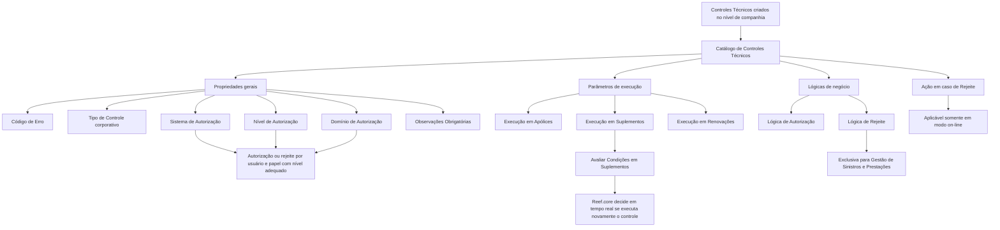

# Definição Operacional dos Controles Técnicos no Reef.core

## 1. Metadados do Documento
- **Arquivo de Origem:** `Não identificado — conteúdo bruto fornecido pelo usuário`
- **Tipo de Documento:** `Manual Operacional`
- **Domínio / Sistema:** `Reef.core — Controles Técnicos, Emissão de Apólices, Suplementos, Renovações, Sinistros e Prestações`
- **Público-Alvo:** `Tecnologia local, desenvolvedores, usuários autorizadores, operação de seguros e equipes funcionais`
- **Data/Versão Identificada:** `Não identificada`

---

## 2. Resumo Executivo & Contexto de Negócio

O documento descreve a definição operacional e a parametrização de **Controles Técnicos** criados no nível de companhia. Esses controles devem receber propriedades que os classificam e que modulam o seu comportamento operacional nos processos de emissão e de sinistros.

A configuração do catálogo de Controles Técnicos determina aspectos como o código do controle, a tipologia corporativa, o sistema e o domínio de autorização, o nível mínimo de autorização necessário e os processos nos quais o controle deverá ser executado. Entre os processos citados estão emissão de apólices, suplementos e suplementos de renovação.

O Reef.core utiliza parâmetros de execução para interpretar quando um Controle Técnico deve ser avaliado. Em suplementos, o atributo **Avaliar Condições em Suplementos** permite decidir em tempo real se um controle precisa ser executado novamente quando os dados e condições relevantes não tenham variado em relação à apólice previamente existente.

O documento também define propriedades relacionadas à autorização e ao rejeite de Controles Técnicos. A lógica de negócio de autorização pode avaliar se a autorização é permitida conforme critérios da entidade. A lógica de rejeite é exclusiva do processo de Gestão de Sinistros e Prestações e deve ser desenvolvida, implementada e nomeada pela equipe local de Tecnologia.

Por fim, o conteúdo alerta que a propriedade **Estrutura Detalhe** está descontinuada no núcleo do sistema e não deve ser utilizada ou reutilizada para fins locais. Como boa prática, recomenda-se codificar e agrupar os Controles Técnicos segundo os processos nos quais serão executados.

---

## 3. Arquitetura, Componentes & Tecnologias Envolvidas

Os componentes, conceitos e processos identificados no conteúdo são:

| Componente / Conceito | Papel descrito no documento |
| :--- | :--- |
| **Reef.core** | Sistema que interpreta a parametrização dos Controles Técnicos e decide sua execução em processos de emissão, suplementos e renovações. |
| **Catálogo de Controles Técnicos** | Local de configuração das propriedades que classificam e modulam o comportamento operacional dos controles. |
| **Controle Técnico** | Controle configurado no nível de companhia, sujeito a execução, autorização ou rejeite conforme propriedades e regras de negócio. |
| **Sistema de Autorização** | Propriedade que indica o código do sistema que poderá autorizar o Controle Técnico. |
| **Domínio de Autorização** | Propriedade que delimita o domínio do sistema em que o Controle Técnico está circunscrito para gestão correta da aprovação. |
| **Programa de Autorizações de Controles Técnicos** | Programa mencionado no contexto histórico da propriedade descontinuada Estrutura Detalhe. |
| **Equipe local de Tecnologia** | Responsável por considerar a funcionalidade de avaliação de condições em suplementos e por desenvolver, implementar e nomear determinadas lógicas de negócio. |
| **Processo de Gestão de Sinistros e Prestações** | Processo no qual a lógica de negócio de rejeite possui aplicação exclusiva. |
| **Processos de Emissão** | Processos nos quais os Controles Técnicos podem ser executados, incluindo emissão de apólices, suplementos e suplementos de renovação. |



**Nota de Análise:** O documento menciona o Reef.core, o catálogo de Controles Técnicos e o Programa de Autorizações de Controles Técnicos, mas não detalha interfaces, métodos HTTP, contratos de integração, persistência, tecnologias de implementação ou URLs de ambiente.

---

## 4. Regras de Negócio, Especificações Funcionais & Processos

### 4.1. Classificação e parametrização de Controles Técnicos

1. Após a criação de Controles Técnicos no nível de companhia, uma série de propriedades deve ser parametrizada.
2. Essas propriedades classificam os Controles Técnicos e modulam operacionalmente seu comportamento nos processos de Emissão e de Sinistros.
3. Cada Controle Técnico possui um **Código de Erro**, que indica o código do próprio controle.
4. Cada Controle Técnico deve possuir um **Tipo de Controle** para que o sistema o gerencie adequadamente.
5. O valor do Tipo de Controle deve ser um dos valores definidos corporativamente.
6. Os valores da propriedade Tipo de Controle não podem ser ampliados no sistema.
7. O **Domínio de Autorização** também deve utilizar um dos valores definidos corporativamente.
8. Os valores do Domínio de Autorização não podem ser ampliados no sistema.

### 4.2. Regras de autorização

1. O **Sistema de Autorização** informa o código do sistema que poderá autorizar o Controle Técnico.
2. Quando um Controle Técnico indicar Reaseguro como sistema ou departamento de autorização, somente um papel e usuário cujo nível de autorização assim determine poderá autorizá-lo ou rejeitá-lo.
3. Para Controles Técnicos de Auditoria, o **Nível de Autorização** identifica o nível mínimo que qualquer usuário deve possuir para poder autorizar o Controle Técnico.
4. A propriedade **Lógica de Negócio de Autorização** contém uma lógica para avaliar se é possível ou não autorizar o Controle Técnico, conforme os critérios determinados pela entidade.
5. Quando a propriedade **Observações Obrigatórias** estiver ativada na configuração detalhada do Controle Técnico, a operação de autorização deverá capturar obrigatoriamente o motivo ou os motivos pelos quais o usuário autoriza ou rejeita o Controle Técnico.

### 4.3. Regras de rejeite

1. A propriedade **Lógica de Negócio de Rejeite** contém uma lógica de negócio para avaliar se é possível ou não rejeitar o Controle Técnico conforme os critérios determinados.
2. A Lógica de Negócio de Rejeite aplica-se exclusivamente ao processo de Gestão de Sinistros e Prestações.
3. A equipe local de Tecnologia é responsável pelo desenvolvimento, implementação e nomenclatura da Lógica de Negócio de Rejeite.
4. A **Ação em caso de Rejeite** determina qual ação deve ser seguida apenas quando a operação estiver sendo executada em modo on-line.
5. Os valores possíveis da Ação em caso de Rejeite devem pertencer aos valores definidos corporativamente.

### 4.4. Regras de execução nos processos de emissão

1. Quando o parâmetro **Se executa em Apólices** estiver ativado na definição do Controle Técnico, o Reef.core interpreta que o controle deve ser executado na emissão da Apólice.
2. Quando o parâmetro **Se executa em Suplementos** estiver ativado no catálogo de definição, o Reef.core interpreta que o Controle Técnico deve ser executado especificamente nos suplementos da apólice.
3. Quando o parâmetro **Se executa em Renovações** estiver ativado na definição do Controle Técnico, o Reef.core interpreta que o controle deve ser executado na emissão dos Suplementos de Renovação.
4. O atributo **Avaliar Condições em Suplementos** é aplicável quando os dados e condições que provocam um Controle Técnico durante a emissão de um suplemento não variam em relação aos dados e condições anteriormente existentes na apólice.
5. Com Avaliar Condições em Suplementos, o Reef.core pode determinar em tempo real se deve executar novamente o Controle Técnico no suplemento.
6. A decisão de reexecução influencia se o resultado do Controle Técnico implica a retenção do movimento.
7. A equipe local de Tecnologia deve considerar essa funcionalidade na implementação da lógica de negócio ou do componente de software associado ao Controle Técnico, para que sejam gravadas as condições de sua execução.

### 4.5. Restrição de propriedade obsoleta

1. A funcionalidade da propriedade **Estrutura Detalhe** está descontinuada no núcleo do sistema.
2. Estrutura Detalhe não deve ser usada nem reutilizada para qualquer finalidade local, pois é uma propriedade obsoleta.
3. Originalmente, Estrutura Detalhe permitia que o Programa de Autorizações de Controles Técnicos chamasse uma estrutura de informação para detalhar e complementar o motivo pelo qual um usuário autorizava ou rejeitava o Controle Técnico.

### 4.6. Boa prática de codificação

1. Como boa prática, os Controles Técnicos devem ser identificados e agrupados de acordo com os processos nos quais serão executados.
2. O documento recomenda a leitura de diretrizes e documentos funcionais relacionados, pois a interpretação isolada do documento pode conduzir a erro.

---

## 5. Tabelas de Parâmetros, Ambientes e Estruturas de Dados

| Item / Parâmetro | Descrição / Função | Tipo / Valores / Formato | Ambiente / Observações |
| :--- | :--- | :--- | :--- |
| Código de Erro | Indica o código do Controle Técnico. | Código não detalhado no conteúdo. | Propriedade geral do catálogo. |
| Tipo de Controle | Identifica a tipologia do Controle Técnico para gestão adequada pelo sistema. | Um dos valores definidos corporativamente. | Não é possível ampliar os valores no sistema. |
| Sistema de Autorização | Indica o código do sistema que poderá autorizar o Controle Técnico. | Código de sistema não detalhado. | O exemplo citado é Reaseguro como sistema ou departamento de autorização. |
| Nível de Autorização | Identifica o nível mínimo que um usuário deve possuir para autorizar Controles Técnicos de Auditoria. | Nível não detalhado. | Aplicável especificamente a Controles Técnicos de Auditoria. |
| Se executa em Apólices | Determina a execução do Controle Técnico na emissão da Apólice. | Ativado / não ativado, formato não detalhado. | Interpretado pelo Reef.core. |
| Se executa em Suplementos | Determina a execução específica do Controle Técnico nos suplementos da apólice. | Ativado / não ativado, formato não detalhado. | Interpretado pelo Reef.core a partir do catálogo de definição. |
| Se executa em Renovações | Determina a execução do Controle Técnico na emissão dos Suplementos de Renovação. | Ativado / não ativado, formato não detalhado. | Interpretado pelo Reef.core. |
| Avaliar Condições em Suplementos | Permite ao Reef.core decidir em tempo real se o controle deve ser executado novamente em suplemento quando dados e condições não variaram. | Atributo de definição; valores não detalhados. | Requer gravação das condições de execução pela implementação local associada ao controle. |
| Lógica de Negócio de Autorização | Avalia se o Controle Técnico pode ou não ser autorizado conforme critérios da entidade. | Lógica de negócio; tecnologia e formato não detalhados. | Critérios definidos pela entidade. |
| Lógica de Negócio de Rejeite | Avalia se o Controle Técnico pode ou não ser rejeitado conforme critérios determinados. | Lógica de negócio; tecnologia e formato não detalhados. | Exclusiva da Gestão de Sinistros e Prestações; responsabilidade da equipe local de Tecnologia. |
| Ação em caso de Rejeite | Determina a ação a seguir quando houver rejeite. | Um dos valores definidos corporativamente. | Aplicável apenas se a operação estiver em modo on-line. |
| Domínio de Autorização | Determina o domínio do sistema no qual o Controle Técnico está circunscrito para gestão correta da aprovação. | Um dos valores definidos corporativamente. | Não é possível ampliar os valores no sistema. |
| Observações Obrigatórias | Torna obrigatória a captura dos motivos de autorização ou rejeite. | Ativada / não ativada, formato não detalhado. | Aplicável às operações de autorização de Controles Técnicos. |
| Estrutura Detalhe | Propriedade historicamente usada para chamar estrutura de informação complementar de motivos. | Propriedade obsoleta. | Descontinuada no núcleo; não deve ser usada ou reutilizada localmente. |
| Vínculos | Relação de diretrizes e documentos funcionais recomendados. | Lista não apresentada no conteúdo. | A leitura é recomendada para evitar interpretações isoladas equivocadas. |

---

## 6. Bateria de Perguntas & Respostas para RAG (FAQ Sintético)

### P1: Qual é o objetivo da parametrização de Controles Técnicos no nível de companhia?
**R:** A parametrização classifica os Controles Técnicos e modula seu comportamento operacional nos processos de Emissão e de Sinistros. O catálogo define propriedades como código, tipo, sistema de autorização, nível de autorização, domínio de autorização, execução em apólices, suplementos e renovações, além de lógicas de autorização e rejeite.

### P2: O que acontece quando o parâmetro “Se executa em Apólices” está ativado?
**R:** Quando a propriedade Se executa em Apólices está ativada na definição do Controle Técnico, o Reef.core interpreta que o Controle Técnico deve ser executado durante a emissão da Apólice.

### P3: Como o Reef.core trata um Controle Técnico configurado para suplementos?
**R:** Se a propriedade Se executa em Suplementos estiver ativada no catálogo de definição, o Reef.core interpreta que o Controle Técnico deve ser executado especificamente nos suplementos da apólice.

### P4: Para que serve o atributo “Avaliar Condições em Suplementos”?
**R:** Avaliar Condições em Suplementos permite que o Reef.core determine em tempo real se um Controle Técnico deve ser executado novamente em um suplemento quando os dados e condições que originaram o controle não tenham variado em relação aos dados e condições previamente existentes na apólice. Essa decisão pode afetar se o movimento ficará retido.

### P5: Qual responsabilidade a equipe local de Tecnologia possui em relação às condições de execução em suplementos?
**R:** A equipe local de Tecnologia deve considerar a funcionalidade Avaliar Condições em Suplementos na implementação da lógica de negócio ou do componente de software associado ao Controle Técnico. Essa implementação deve gravar as condições de execução do controle.

### P6: Quem pode autorizar ou rejeitar um Controle Técnico associado a Reaseguro?
**R:** Se o sistema ou departamento de autorização do Controle Técnico indicar Reaseguro, somente um papel e um usuário cujo nível de autorização assim determine podem autorizar ou rejeitar esse Controle Técnico.

### P7: Como o Nível de Autorização é aplicado em Controles Técnicos de Auditoria?
**R:** Para Controles Técnicos de Auditoria, o Nível de Autorização identifica o nível mínimo que qualquer usuário deve ter associado para poder autorizar o Controle Técnico.

### P8: A Lógica de Negócio de Rejeite pode ser usada em qualquer processo?
**R:** Não. A Lógica de Negócio de Rejeite tem aplicação exclusiva no processo de Gestão de Sinistros e Prestações. Ela avalia se o Controle Técnico pode ou não ser rejeitado conforme os critérios determinados.

### P9: Quando a Ação em caso de Rejeite é aplicada?
**R:** A Ação em caso de Rejeite é aplicada unicamente quando a operação estiver sendo executada em modo on-line. Essa característica determina a ação que deverá ser seguida e seus valores possíveis são definidos corporativamente.

### P10: É possível adicionar novos valores ao Tipo de Controle ou ao Domínio de Autorização?
**R:** Não. O documento informa explicitamente que os valores dessas duas propriedades são definidos corporativamente e não podem ser ampliados no sistema.

### P11: O que obriga a propriedade “Observações Obrigatórias”?
**R:** Quando Observações Obrigatórias é ativada na configuração detalhada do Controle Técnico, torna-se obrigatória a captura do motivo ou dos motivos pelos quais um usuário autoriza ou rejeita o Controle Técnico nas operações de autorização.

### P12: A propriedade “Estrutura Detalhe” deve ser utilizada em novas implementações locais?
**R:** Não. A funcionalidade de Estrutura Detalhe está descontinuada no núcleo do sistema, é considerada obsoleta e não deve ser usada nem reutilizada para qualquer propósito de âmbito local.

### P13: Qual boa prática é recomendada para a codificação de Controles Técnicos?
**R:** Recomenda-se identificar e agrupar os Controles Técnicos de acordo com os processos nos quais serão executados. Essa prática facilita a organização operacional do catálogo conforme os processos de negócio atendidos.

---

## 7. Glossário de Termos, Siglas & Conceitos-Chave

- **Reef.core:** Sistema que interpreta a parametrização de Controles Técnicos e determina sua execução em emissão de apólices, suplementos e suplementos de renovação.
- **Controle Técnico:** Controle criado no nível de companhia e parametrizado para classificar e modular seu comportamento em processos de emissão e sinistros.
- **Catálogo de Controles Técnicos:** Estrutura de configuração que contém as propriedades operacionais e classificatórias dos Controles Técnicos.
- **Apólice:** Entidade de emissão na qual um Controle Técnico pode ser executado quando a propriedade correspondente está ativada.
- **Suplemento:** Movimento de apólice no qual um Controle Técnico pode ser executado especificamente, conforme sua configuração.
- **Suplemento de Renovação:** Movimento de renovação cuja emissão pode executar um Controle Técnico quando a propriedade Se executa em Renovações estiver ativada.
- **Sistema de Autorização:** Propriedade que identifica o código do sistema autorizado a autorizar o Controle Técnico.
- **Domínio de Autorização:** Propriedade que delimita o domínio do sistema no qual o Controle Técnico está circunscrito para gestão de sua aprovação.
- **Nível de Autorização:** Nível mínimo exigido de um usuário para autorizar Controles Técnicos de Auditoria.
- **Lógica de Negócio de Autorização:** Lógica que avalia se o Controle Técnico pode ou não ser autorizado conforme critérios da entidade.
- **Lógica de Negócio de Rejeite:** Lógica exclusiva da Gestão de Sinistros e Prestações que avalia se um Controle Técnico pode ou não ser rejeitado.
- **Gestão de Sinistros e Prestações:** Processo ao qual se aplica exclusivamente a Lógica de Negócio de Rejeite.
- **Modo on-line:** Modo operacional no qual a propriedade Ação em caso de Rejeite determina a ação a seguir.
- **Reaseguro:** Sistema ou departamento citado como exemplo de autorização que restringe a autorização ou rejeite a usuários e papéis com nível apropriado.
- **Estrutura Detalhe:** Propriedade obsoleta e descontinuada no núcleo do sistema; historicamente permitia complementar o motivo de autorização ou rejeite.

---

## 8. Notas Críticas, Riscos & Limitações

- **Valores corporativos fechados:** Tipo de Controle e Domínio de Autorização utilizam valores definidos corporativamente e não podem ser ampliados no sistema.
- **Dependência de implementação local:** A equipe local de Tecnologia deve implementar a gravação das condições de execução relacionadas à avaliação de condições em suplementos.
- **Dependência de lógica local:** O desenvolvimento, a implementação e a nomenclatura da Lógica de Negócio de Rejeite são responsabilidade da equipe local de Tecnologia.
- **Escopo limitado da lógica de rejeite:** A Lógica de Negócio de Rejeite é aplicável exclusivamente ao processo de Gestão de Sinistros e Prestações.
- **Restrição de modo operacional:** Ação em caso de Rejeite só se aplica quando a operação é executada em modo on-line.
- **Propriedade obsoleta:** Estrutura Detalhe está descontinuada no núcleo do sistema e não deve ser reutilizada localmente.
- **Risco de interpretação isolada:** O documento recomenda a leitura de diretrizes e documentos funcionais vinculados, pois a interpretação isolada do conteúdo pode conduzir a erro.
- **Detalhamento técnico ausente:** O conteúdo não informa versões, endpoints, contratos de integração, formatos de persistência, estrutura dos valores corporativos, nem critérios concretos das lógicas de negócio.

---

## 9. Conteúdo Bruto Estruturado (Referência Fiel)

```text
--- [PÁGINA 1 DE 4] ---

DEFINICIÓN Operativa de los CONTROLES
TÉCNICOS
Una vez creados los Controles Técnicos a nivel de compañía, se tienen que parametrizar una serie
de propiedades que lo clasifican y operativamente modulan su comportamiento en los Procesos de
Emisión y de Siniestros.
Propiedades Generales
Propiedades Generales
Código de Error
Esta propiedad indica el código del Control Técnico.
Tipo de Control
Por cada control técnico se debe identificar su tipología para que el Sistema pueda gestionarlo
adecuadamente siendo su valor uno de los definidos corporativamente.
NOTA: No es posible ampliar en el sistema los valores de esta propiedad.
Sistema de Autorización
Esta propiedad indica el código del sistema que podrá autorizar el control técnico.
De esta manera un control técnico cuyo sistema o departamento de autorización indique que sea de
Reaseguro solamente podrá ser autorizado o rechazado por un rol y usuario cuyo nivel de
 / 
 CF
Home Solutions APIs Documentation Zeus
EN


--- [PÁGINA 2 DE 4] ---

autorización así lo determine.
Nivel de Autorización
En el caso de los controles técnicos de Auditoría, esta propiedad del catálogo identifica el nivel
mínimo que debe tener asociado cualquier usuario que pretenda Autorizar el Control Técnico para
poder realizarlo.
Se ejecuta en Pólizas
En el supuesto que este parámetro esté activado en la definición del control técnico, Reef.core
interpreta que el control técnico se ha de ejecutar en la emisión de la Póliza.
Se ejecuta en Suplementos
En el supuesto que esta propiedad esté activada en el catálogo de definición, Reef.core interpreta
que el Control Técnico se debe ejecutar específicamente en los suplementos de la póliza.
Se ejecuta en las Renovaciones
En el supuesto que este parámetro esté activado en la definición del control técnico, Reef.core
interpreta que el control técnico se ha de ejecutar en la emisión de los Suplementos de Renovación.
Evaluar Condiciones en Suplementos
Si los datos y condiciones que provocan la existencia de un control técnico en la emisión de un
suplemento no varían respecto de los datos y condiciones previamente existentes en la póliza, con
este atributo de la definición del control técnico se puede lograr que Reef.core determine en tiempo
real si se tiene o no que ejecutar nuevamente en el suplemento, es decir, si el resultado del control
técnico implique que el movimiento quede retenido.
Es necesario que el equipo local de Tecnología tenga presente la funcionalidad de este atributo en
la implementación de la lógica de negocio o componente software asociado al control técnico para
que se graben las condiciones de su ejecución.
Lógica de Negocio de Autorización
Esta propiedad contendrá una lógica de Negocio para a evaluar si se puede o no autorizar el Control
Técnico de acuerdo con los criterios que determine la entidad.
Lógica de Negocio de Rechazo
Consejo:


--- [PÁGINA 3 DE 4] ---

Esta propiedad contendrá una lógica de Negocio para evaluar si se puede o no rechazar el Control
Técnico de acuerdo con los criterios que se determinen.
Esta propiedad es de aplicación exclusiva en el proceso de Gestión de Siniestros y Prestaciones.
Al igual que con la lógica de negocio de autorización, es responsabilidad del equipo local de
Tecnología del desarrollo, implementación y nomenclatura de esta propiedad.
Acción en caso de Rechazo
Únicamente en el supuesto que la operación se esté ejecutando en modo on-line esta característica
de los controles técnicos determina qué acción se ha de seguir siendo sus posibles valores uno de
los definidos corporativamente.
Dominio de Autorización
Con esta propiedad del catálogo, se determina el dominio del Sistema en el que se circunscribe el
control técnico y poder así gestionar su aprobación correctamente siendo su valor uno de los
definidos corporativamente.
NOTA: No es posible ampliar en el sistema los valores de esta propiedad.
Observaciones Obligatorias
La activación de esta propiedad en la configuración detallada del Control Técnico implica la
obligatoriedad de capturar en las operaciones de Autorización de Controles Técnicos el motivo o los
motivos por los que un Usuario autoriza o rechaza el control técnico.
Estructura Detalle
La funcionalidad de esta propiedad está descontinuada en el núcleo del sistema por lo cual no debe
usarse o reutilizarse para ningún propósito de ámbito local al ser una propiedad obsoleta.
Originalmente la definición de esta propiedad permitía ejecutar desde el Programa de
Autorizaciones de Controles Técnicos la llamada a una estructura de información que posibilitaba
detallar y complementar el motivo por el que el Usuario autorizaba o rechazaba el control técnico.
Vínculos
Relación de Directrices y Documentos funcionales cuya lectura recomendada para evitar que la
interpretación aislada del presente documento pueda conducir a error.
Consejo:


--- [PÁGINA 4 DE 4] ---

Errores de Control Técnico
Niveles de Autorización
Preguntas frecuentes
(1) ¿Existe alguna circunstancia operativa que deba ser tomada en consideración sobre este
catálogo?
Puede considerarse como una buena práctica en la codificación de los Controles Técnicos en este
catálogo, el que se identifiquen y agrupen de acuerdo con los procesos sobre los que se van a
ejecutar.
```
