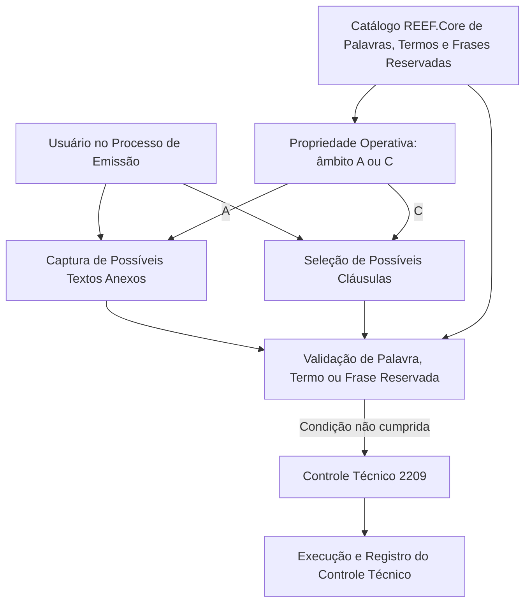

# Catálogo de Palavras, Termos e Frases Reservadas do REEF.Core para Caución e Crédito

## 1. Metadados do Documento
- **Arquivo de Origem:** Não identificado no conteúdo fornecido
- **Tipo de Documento:** Especificação Técnica / Documento Funcional
- **Domínio / Sistema:** REEF.Core; Processo de Emissão; Ramos Técnicos de Caución e Crédito; MAPFRE
- **Público-Alvo:** Desenvolvedores, Analistas Funcionais, Arquitetos, Operação e Administração/Finanças
- **Data/Versão Identificada:** Não identificada

---

## 2. Resumo Executivo & Contexto de Negócio

O documento define um catálogo do REEF.Core destinado à identificação de palavras, termos e expressões reservadas. O catálogo estabelece quais valores devem ser empregados obrigatoriamente em textos anexos e/ou cláusulas registrados ou selecionados por usuários durante o Processo de Emissão.

A aplicação da validação é restrita aos Ramos Técnicos pertencentes a Caución e Crédito. Quando a condição definida pelo catálogo não é cumprida, o REEF.Core executa e registra um controle técnico previamente definido no sistema.

O código do controle técnico utilizado pelo REEF.Core para realizar a validação é **2209**. O conteúdo fornecido não apresenta a descrição textual adicional desse controle, seus critérios internos de implementação, mensagens retornadas ou consequências operacionais posteriores ao registro.

A configuração inicial do catálogo é pré-configurada. A manutenção posterior dessa configuração deve ser realizada pela **Direção de Administração e Finanças da Entidade MAPFRE local**. O documento recomenda também a leitura de diretrizes e documentos funcionais vinculados, para evitar interpretações isoladas e incorretas.

---

## 3. Arquitetura, Componentes & Tecnologias Envolvidas

### Componentes e elementos identificados

| Componente / Elemento | Função identificada no documento |
| :--- | :--- |
| REEF.Core | Sistema que possui o catálogo de definição de palavras, termos e frases reservadas e executa/registra o controle técnico. |
| Catálogo de definição | Repositório de configuração que identifica palavras, termos ou expressões de uso obrigatório. |
| Processo de Emissão | Processo no qual usuários podem registrar textos anexos ou selecionar cláusulas. |
| Textos Anexos | Possível âmbito operacional da validação quando a propriedade operacional possui o valor `A`. |
| Cláusulas | Possível âmbito operacional da validação quando a propriedade operacional possui o valor `C`. |
| Controle Técnico 2209 | Controle técnico predefinido no REEF.Core para efetuar a validação. |
| Direção de Administração e Finanças da Entidade MAPFRE local | Área responsável pela manutenção posterior da configuração inicialmente pré-fixada. |
| Ramos Técnicos de Caución e Crédito | Escopo de negócio no qual o catálogo deve ser aplicado. |



**Nota de Análise:** O documento identifica o REEF.Core, o catálogo, o Processo de Emissão e o Controle Técnico 2209, mas não detalha arquitetura de infraestrutura, interfaces, métodos HTTP, contratos JSON, bancos de dados, filas, ambientes ou tecnologias de implementação.

---

## 4. Regras de Negócio, Especificações Funcionais & Processos

### Objetivo funcional do catálogo

1. O REEF.Core possui um catálogo de definição.
2. O catálogo identifica palavras, termos ou expressões que devem ser empregados obrigatoriamente.
3. A obrigatoriedade se aplica aos textos anexos e/ou cláusulas que os usuários possam registrar ou selecionar no Processo de Emissão.
4. A aplicação é exclusiva para os Ramos Técnicos pertencentes a Caución e Crédito.
5. Quando a condição exigida pelo catálogo não é cumprida, o REEF.Core executa e registra um controle técnico predefinido.
6. O controle técnico definido para realizar essa validação possui o código **2209**.

### Propriedade operacional: Textos Anexos ou Cláusulas

A propriedade operacional identifica o âmbito no qual será registrada a execução do controle sobre termos e frases reservadas.

Valores possíveis:

1. **`A`** — validação sobre os possíveis Textos Anexos capturados.
2. **`C`** — validação sobre as possíveis Cláusulas selecionadas.

### Código da Cláusula ou Texto Anexo

A propriedade “Código da Cláusula ou Texto Anexo” informa o código da cláusula ou do texto anexo sobre o qual a validação será realizada. A seleção desse alvo deve estar de acordo com o valor definido na propriedade operacional anterior.

### Palavra, Termo ou Frase Reservada

O dado “Palavra, Termo ou Frase Reservada” estabelece o valor do termo ou da frase que se deseja validar e controlar.

### Inabilitação

A propriedade “Inhabilitación” determina que a validação sobre uma palavra ou termo reservado está inabilitada para uso nos processos de verificação.

### Manutenção da configuração

1. A configuração inicial do catálogo vem previamente fixada.
2. A manutenção posterior deve ser realizada pela Direção de Administração e Finanças da Entidade MAPFRE local.

### Vínculos documentais

O documento indica a existência de diretrizes e documentos funcionais vinculados cuja leitura é recomendada. A finalidade dessa recomendação é evitar que a interpretação isolada do documento conduza a erro.

---

## 5. Tabelas de Parâmetros, Ambientes e Estruturas de Dados

| Item / Parâmetro | Descrição / Função | Tipo / Valores / Formato | Ambiente / Observações |
| :--- | :--- | :--- | :--- |
| Código do Controle Técnico | Código do controle técnico utilizado pelo REEF.Core para efetuar a validação. | `2209` | O documento não detalha mensagens, severidade ou ações posteriores do controle. |
| Propriedade Operativa: Textos Anexos ou Cláusulas | Identifica o âmbito operacional no qual será inscrita a execução do controle de termos/frases. | `A` ou `C` | `A`: possíveis Textos Anexos capturados. `C`: possíveis Cláusulas selecionadas. |
| Código da Cláusula ou Texto Anexo | Indica o código da cláusula ou texto anexo alvo da validação. | Código não especificado | Deve ser utilizado conforme o valor da propriedade operacional. |
| Palavra, Termo ou Frase Reservada | Define o valor do termo ou frase que será validado e controlado. | Texto; formato não especificado | O documento não informa regras de maiúsculas/minúsculas, normalização ou correspondência parcial. |
| Inhabilitación | Define que a validação de uma palavra ou termo reservado está inabilitada para processos de verificação. | Estado de inabilitação; valores não especificados | O documento não informa formato, valores possíveis ou responsável pela alteração. |
| Escopo de aplicação | Ramos técnicos nos quais o catálogo é aplicável. | Caución e Crédito | Aplicação exclusiva para esses Ramos Técnicos. |
| Responsável pela manutenção | Área que realiza a manutenção posterior da configuração inicial. | Direção de Administração e Finanças da Entidade MAPFRE local | A configuração inicial é previamente fixada. |
| Vínculos | Relação de diretrizes e documentos funcionais recomendados. | Não especificado | A leitura é recomendada para evitar interpretação isolada incorreta. |

---

## 6. Bateria de Perguntas & Respostas para RAG (FAQ Sintético)

### P1: Qual é o objetivo do catálogo de palavras, termos e frases reservadas do REEF.Core?
**R:** O catálogo do REEF.Core identifica palavras, termos e expressões que devem ser empregados obrigatoriamente nos textos anexos e/ou cláusulas registrados ou selecionados por usuários no Processo de Emissão, exclusivamente para os Ramos Técnicos de Caución e Crédito.

### P2: Em quais ramos técnicos o catálogo de palavras, termos e frases reservadas é aplicado?
**R:** O catálogo é aplicado exclusivamente aos Ramos Técnicos pertencentes a Caución e Crédito.

### P3: O que acontece quando uma condição definida pelo catálogo não é cumprida?
**R:** Quando a condição definida pelo catálogo não é cumprida, o REEF.Core executa e registra um controle técnico previamente definido no sistema.

### P4: Qual é o código do controle técnico usado pelo REEF.Core para validar termos e frases reservadas?
**R:** O código do controle técnico estabelecido pelo REEF.Core para efetuar a validação é **2209**.

### P5: O que significa o valor `A` na propriedade operativa “Textos Anexos ou Cláusulas”?
**R:** O valor `A` indica que o controle de termos ou frases reservadas é aplicado sobre os possíveis Textos Anexos capturados no Processo de Emissão.

### P6: O que significa o valor `C` na propriedade operativa “Textos Anexos ou Cláusulas”?
**R:** O valor `C` indica que o controle de termos ou frases reservadas é aplicado sobre as possíveis Cláusulas selecionadas no Processo de Emissão.

### P7: Para que serve o campo “Código da Cláusula ou Texto Anexo”?
**R:** O campo informa o código da cláusula ou do texto anexo sobre o qual se deseja realizar a validação. O alvo da validação deve ser compatível com o valor escolhido na propriedade operacional anterior.

### P8: O que representa o dado “Palavra, Termo ou Frase Reservada”?
**R:** Esse dado estabelece o valor do termo ou da frase que será validado e controlado pelo catálogo do REEF.Core.

### P9: Qual é o efeito da propriedade “Inhabilitación”?
**R:** A propriedade “Inhabilitación” estabelece que a validação sobre uma palavra ou termo reservado está inabilitada para poder ser utilizada nos processos de verificação.

### P10: Quem deve manter a configuração do catálogo após a configuração inicial?
**R:** A manutenção posterior da configuração deve ser realizada pela Direção de Administração e Finanças da Entidade MAPFRE local.

### P11: A configuração do catálogo é criada manualmente desde o início pela entidade local?
**R:** Não. O documento afirma que a configuração inicial vem previamente fixada. A entidade MAPFRE local, por meio da Direção de Administração e Finanças, é responsável pela manutenção posterior.

### P12: O documento fornece detalhes sobre métodos HTTP, contratos JSON ou interfaces do REEF.Core?
**R:** Não. O conteúdo fornecido descreve o objetivo funcional do catálogo, suas propriedades operacionais e o controle técnico 2209, mas não detalha métodos HTTP, contratos JSON, interfaces, tecnologias de implementação ou arquitetura de infraestrutura.

---

## 7. Glossário de Termos, Siglas & Conceitos-Chave

- **REEF.Core:** Sistema que contém o catálogo de palavras, termos e frases reservadas e executa/registra o controle técnico de validação.
- **Catálogo de definição:** Configuração que identifica palavras, termos ou expressões de uso obrigatório.
- **Processo de Emissão:** Processo no qual usuários podem registrar textos anexos ou selecionar cláusulas.
- **Texto Anexo:** Tipo de conteúdo capturado no Processo de Emissão e potencial alvo de validação quando o âmbito operativo é `A`.
- **Cláusula:** Elemento selecionável no Processo de Emissão e potencial alvo de validação quando o âmbito operativo é `C`.
- **Palavra, Termo ou Frase Reservada:** Valor definido no catálogo que deve ser validado e controlado.
- **Controle Técnico 2209:** Controle técnico predefinido pelo REEF.Core para realizar a validação descrita.
- **Inhabilitación:** Propriedade que torna inabilitada a validação de uma palavra ou termo reservado nos processos de verificação.
- **Caución:** Ramo Técnico citado como parte do escopo exclusivo de aplicação do catálogo.
- **Crédito:** Ramo Técnico citado como parte do escopo exclusivo de aplicação do catálogo.
- **MAPFRE local:** Entidade local cuja Direção de Administração e Finanças realiza a manutenção posterior da configuração.

---

## 8. Notas Críticas, Riscos & Limitações

- O documento não identifica o nome do arquivo de origem, data, versão, autor ou aprovação documental.
- O documento não detalha a implementação técnica do Controle Técnico 2209, incluindo condições exatas de disparo, mensagens de erro, severidade, bloqueio de operação ou persistência do registro.
- Não há especificação de interfaces, métodos HTTP, contratos JSON, endpoints, tecnologias, servidores, portas, bancos de dados ou mecanismos de integração.
- Não são apresentados valores permitidos, formato técnico ou regras de preenchimento para o campo “Código da Cláusula ou Texto Anexo”.
- Não são especificados os valores possíveis nem o comportamento operacional detalhado da propriedade “Inhabilitación”.
- O termo “configuração inicial previamente fixada” é informado, mas o documento não descreve sua origem, processo de carga, responsável pela definição inicial ou procedimento de reversão.
- A interpretação isolada do documento pode conduzir a erro; o próprio documento recomenda a leitura das diretrizes e documentos funcionais vinculados.
- **Nota de Análise:** O conteúdo cita itens de navegação aparentes, como “Consejo”, “CF”, “Home”, “Solutions”, “APIs”, “Documentation”, “Zeus” e “EN”, mas não fornece contexto suficiente para classificá-los como sistemas, ambientes ou componentes funcionais.

---

## 9. Conteúdo Bruto Estruturado (Referência Fiel)

```text
--- [PÁGINA 1 DE 2] ---

DEFINICIÓN de las 'PALABRAS, TÉRMINOS y
FRASES RESERVADAS' de REEF.CORE
Objetivo
Reef.core cuenta con un catálogo de definición en el que se identifican las 'palabras', 'términos' o
'expresiones' que se deben emplear obligatoriamente en los textos anexos y/o cláusulas que los
Usuarios puedan registrar o seleccionar en el Proceso de Emisión exclusivamente para los Ramos
Técnicos pertenecientes a Caución y Crédito, de tal manera que de no cumplirse la condición se
ejecuta y registra un control técnico que está predefinido en Reef.core.
El código del Control Técnico establecido por Reef.core para efectuar la validación es el 2209
Propiedades Operativas
Otras Operativas
Propiedades Operativas
Textos Anexos o Cláusulas
Esta propiedad identifica el ámbito operativo en el que se inscribirá la ejecución del control de los
términos/frases, siendo sus posibles valores:
"A" - Sobre los Posibles Textos Anexos capturados, ó bien
Consejo:
 / 
 CF
Home Solutions APIs Documentation Zeus
EN

--- [PÁGINA 2 DE 2] ---

"C" - Sobre las Posibles Cláusulas seleccionadas.
Código de la Cláusula o Texto Anexo
Esta propiedad indica el código de la Cláusula o del Texto Anexo sobre la/el que se quiere realizar la
validación de acuerdo con el valor de la anterior propiedad.
Palabra, Término o Frase Reservada
Este Dato establece el valor del Término o de la Frase que se quiere validar y controlar.
Otras Propiedades
Inhabilitación
Esta propiedad establece que la validación sobre la palabra o del término reservado, está inhabilitada
para poder ser empleada en los procesos de verificación.
Vínculos
Relación de Directrices y Documentos funcionales cuya lectura recomendada para evitar que la
interpretación aislada del presente documento pueda conducir a error.
Preguntas frecuentes
(1) ¿Existe alguna circunstancia operativa que deba ser tomada en consideración sobre este
catálogo?
La configuración inicial viene prefijada. Su posterior mantenimiento lo debe realizar la Dirección de
Administración y Finanzas de la Entidad MAPFRE local.
Ejemplo:
```
