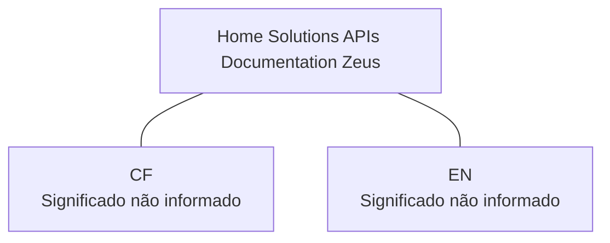

# Home Solutions APIs Documentation Zeus

## 1. Metadados do Documento
- **Arquivo de Origem:** Não identificado
- **Tipo de Documento:** Não identificado
- **Domínio / Sistema:** Home Solutions APIs Documentation Zeus
- **Público-Alvo:** Não identificado
- **Data/Versão Identificada:** Não identificada

---

## 2. Resumo Executivo & Contexto de Negócio

O conteúdo disponível identifica um contexto denominado **Home Solutions APIs Documentation Zeus**. A extração também apresenta os termos **CF** e **EN**, sem explicação adicional sobre seus significados ou funções.

Não há descrição funcional, objetivo de negócio, escopo de APIs, integrações, fluxos operacionais ou requisitos técnicos no conteúdo fornecido. Portanto, não é possível determinar quais problemas corporativos são resolvidos pela documentação Zeus ou quais benefícios são esperados.

A presença do termo “APIs Documentation” indica apenas que o material pode estar relacionado à documentação de interfaces de programação, mas o conteúdo extraído não detalha endpoints, contratos, autenticação, tecnologias, ambientes ou consumidores.

> **Nota de Análise:** O documento contém apenas identificadores e rótulos de navegação. Não há detalhamento suficiente para reconstruir arquitetura, regras de negócio ou especificações de integração.

---

## 3. Arquitetura, Componentes & Tecnologias Envolvidas

Os únicos componentes ou identificadores explicitamente mencionados são:

| Componente / Termo | Classificação inferível | Evidência no conteúdo | Detalhamento disponível |
| :--- | :--- | :--- | :--- |
| Home Solutions APIs Documentation Zeus | Título, sistema ou área documental | “Home Solutions APIs Documentation Zeus” | Não detalhado |
| CF | Sigla ou rótulo | “CF” | Significado não informado |
| EN | Sigla ou rótulo de idioma | “EN” | Não detalhado |

Não há informação suficiente para estabelecer relações arquiteturais, dependências, camadas, protocolos, APIs, microsserviços ou fluxos de dados.



> **Nota de Análise:** O diagrama representa somente a coocorrência dos termos no conteúdo extraído; ele não comprova integração técnica ou dependência entre os elementos.

---

## 4. Regras de Negócio, Especificações Funcionais & Processos

O conteúdo fornecido não apresenta regras de negócio, critérios de validação, cálculos, procedimentos, fluxos operacionais, contratos de API ou restrições técnicas.

Não foram identificados:

- Métodos HTTP;
- Endpoints ou URLs;
- Campos de requisição ou resposta;
- Regras de autenticação ou autorização;
- Parâmetros de entrada;
- Códigos de erro;
- Processos de negócio;
- Responsáveis operacionais;
- Critérios de aceite.

> **Nota de Análise:** A extração não permite derivar regras funcionais ou técnicas sem introduzir informações não sustentadas pelo documento.

---

## 5. Tabelas de Parâmetros, Ambientes e Estruturas de Dados

| Item / Parâmetro | Descrição / Função | Tipo / Valores / Formato | Ambiente / Observações |
| :--- | :--- | :--- | :--- |
| Home Solutions APIs Documentation Zeus | Identificador textual central da página ou documento | Texto | Não há ambiente informado |
| CF | Sigla ou rótulo apresentado no conteúdo | Texto | Significado não identificado |
| EN | Sigla ou rótulo apresentado no conteúdo | Texto | Pode representar idioma, mas o documento não confirma essa interpretação |

Não foram identificadas tabelas de servidores, variáveis de configuração, ambientes, estruturas de dados ou parâmetros técnicos.

---

## 6. Bateria de Perguntas & Respostas para RAG (FAQ Sintético)

### P1: Qual é o nome ou identificador principal apresentado no documento?
**R:** O identificador principal apresentado é **Home Solutions APIs Documentation Zeus**.

### P2: O documento descreve APIs específicas?
**R:** Não. Embora o texto inclua a expressão “APIs Documentation”, não há endpoints, métodos HTTP, contratos, exemplos de requisição ou respostas de APIs.

### P3: Quais sistemas ou componentes são citados no conteúdo?
**R:** O conteúdo cita **Home Solutions APIs Documentation Zeus**, **CF** e **EN**. Não há descrição técnica ou funcional adicional para esses termos.

### P4: O que significa a sigla CF no documento?
**R:** O significado de **CF** não é informado no conteúdo extraído. Qualquer expansão da sigla seria especulativa.

### P5: O que significa EN no contexto da documentação Zeus?
**R:** O conteúdo apresenta o termo **EN**, mas não define seu significado. Ele pode ser um rótulo de idioma ou navegação, porém essa hipótese não é confirmada pelo documento.

### P6: Quais tecnologias são utilizadas pela solução Zeus?
**R:** O documento não informa linguagens, frameworks, bancos de dados, protocolos, ferramentas de integração ou tecnologias de infraestrutura.

### P7: Existem informações de ambiente, URL ou servidor?
**R:** Não. Não foram identificadas URLs, nomes de servidores, portas, ambientes de desenvolvimento, homologação ou produção.

### P8: O documento define regras de negócio?
**R:** Não. A extração não contém regras de negócio, critérios de validação, cálculos, condições de processamento ou fluxos funcionais.

### P9: É possível identificar o público-alvo da documentação?
**R:** Não com segurança. O conteúdo não especifica se a documentação é destinada a desenvolvedores, arquitetos, operação, negócio ou outro público.

### P10: Há detalhes sobre autenticação ou segurança das APIs?
**R:** Não. O documento não menciona mecanismos de autenticação, autorização, credenciais, tokens, certificados ou políticas de segurança.

---

## 7. Glossário de Termos, Siglas & Conceitos-Chave

- **Home Solutions APIs Documentation Zeus:** Identificador textual apresentado no conteúdo; não há definição adicional.
- **API:** Sigla presente na expressão “APIs Documentation”. O documento não fornece uma definição específica nem descreve interfaces concretas.
- **CF:** Sigla ou rótulo sem significado definido na extração.
- **EN:** Sigla ou rótulo sem significado definido na extração.

---

## 8. Notas Críticas, Riscos & Limitações

- O conteúdo extraído é extremamente reduzido e não permite análise arquitetural, funcional ou operacional aprofundada.
- Não há identificação de arquivo, versão, data, autoria, organização responsável ou público-alvo.
- Não há especificações de API, contratos técnicos, processos de negócio, ambientes ou dependências.
- As relações apresentadas no diagrama Mermaid são apenas organizacionais e não representam integrações comprovadas.
- Qualquer detalhamento adicional sobre Zeus, CF, EN ou Home Solutions exigiria acesso ao conteúdo original completo, incluindo páginas, slides, notas do apresentador ou anexos não presentes na extração.

---

## 9. Conteúdo Bruto Estruturado (Referência Fiel)

```text
--- [PÁGINA 1 DE 1] ---

/
 CF
Home Solutions APIs Documentation Zeus
EN
```
