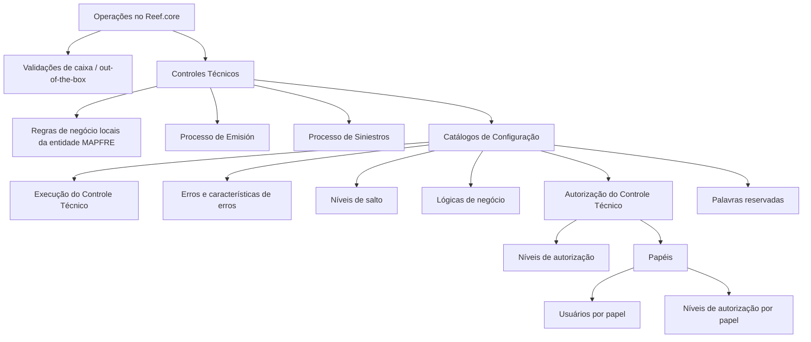

# Controles Técnicos no Reef.core: Configuração, Execução, Erros e Autorizações

## 1. Metadados do Documento
- **Arquivo de Origem:** Não identificado — texto bruto fornecido na solicitação
- **Tipo de Documento:** Manual Operacional
- **Domínio / Sistema:** Reef.core / entidades MAPFRE
- **Público-Alvo:** Desenvolvedores, Arquitetos, Operação e colaboradores envolvidos no desenvolvimento de produtos e serviços
- **Data/Versão Identificada:** Não identificada

---

## 2. Resumo Executivo & Contexto de Negócio

O documento apresenta o conceito de **Controles Técnicos** no sistema Reef.core, distinguindo-os das validações de caixa, também denominadas validações *out-of-the-box*. As validações de caixa são descritas como estáticas e inerentes às operações de uma companhia genérica de seguros.

Os Controles Técnicos representam um conjunto adicional de controles ou validações que pode ser executado dinamicamente em operações e pontos específicos dos processos. Esses controles são definidos segundo regras de negócio que uma entidade pode desejar ou necessitar estabelecer por motivos técnicos, comerciais ou administrativos.

No contexto apresentado, as entidades MAPFRE podem configurar voluntária e localmente regras de negócio para determinadas operações. Essas regras locais recebem a denominação de Controles Técnicos.

Os Controles Técnicos são executados nos processos de **Emisión** e **Siniestros**. O objetivo declarado é facilitar a compreensão das propriedades, características, tarefas e ações necessárias para parametrizar corretamente os controles no Reef.core.

O material também enumera catálogos relacionados à execução, aos erros e à autorização de Controles Técnicos. Entretanto, o texto extraído não detalha campos, valores, fluxos operacionais, regras de cálculo, telas ou contratos técnicos desses catálogos.

---

## 3. Arquitetura, Componentes & Tecnologias Envolvidas

### Componentes e conceitos identificados

| Componente / Conceito | Descrição fundamentada no documento |
| :--- | :--- |
| **Reef.core** | Sistema que contempla validações de caixa ou validações *out-of-the-box* nas operações dos usuários. |
| **Validações de caixa** | Validações estáticas, inerentes às operações de uma companhia genérica de seguros. |
| **Controles Técnicos** | Controles ou validações dinâmicas configuráveis conforme regras de negócio técnicas, comerciais ou administrativas locais. |
| **Entidades MAPFRE** | Entidades que podem estabelecer voluntária e localmente regras de negócio denominadas Controles Técnicos. |
| **Emisión** | Processo no qual os Controles Técnicos são executados. |
| **Siniestros** | Processo no qual os Controles Técnicos são executados. |
| **Catálogos de Configuração** | Grupo de catálogos relacionados a execução, erros, lógicas de negócio, autorização e palavras reservadas. |
| **Catálogos Ejecución Control Técnico** | Catálogo citado para execução de Controle Técnico; sem detalhamento adicional. |
| **Errores de Control Técnico** | Elemento de configuração relacionado a erros de Controle Técnico. |
| **Características de los Errores de Control Técnico** | Características de erros de Controle Técnico; sem atributos detalhados no texto. |
| **Niveles de Salto** | Elemento citado nos catálogos de configuração; sem definição adicional. |
| **Lógicas de Negocios de los Controles Técnicos** | Lógicas de negócio associadas aos Controles Técnicos; sem regras descritas. |
| **Catálogos Autorización Control Técnico** | Catálogo citado para autorização de Controle Técnico; sem detalhamento adicional. |
| **Niveles de Autorización** | Níveis de autorização associados ao Controle Técnico. |
| **Roles** | Papéis citados no contexto de autorização. |
| **Usuarios por Rol** | Usuários associados a cada papel. |
| **Niveles de Autorización por Rol** | Níveis de autorização associados por papel. |
| **Palabras Reservadas** | Elemento adicional listado nos catálogos; sem lista de palavras no texto extraído. |



**Nota de Análise:** O documento não descreve interfaces, APIs, bancos de dados, tecnologias de implementação, métodos HTTP, estruturas JSON, integrações ou ambientes de infraestrutura para o Reef.core e os Controles Técnicos.

---

## 4. Regras de Negócio, Especificações Funcionais & Processos

### 4.1. Diferenciação entre validações existentes e Controles Técnicos

1. O Reef.core contempla validações de caixa ou validações *out-of-the-box* nas operações que os usuários podem realizar.
2. São citados como exemplos de operações:
   - Gestão de Pólizas e Contratos.
   - Gestão de Siniestros e Prestaciones.
3. As validações de caixa são descritas como estáticas.
4. As validações de caixa são controles inerentes às operações de uma companhia genérica de seguros.
5. Em determinadas operações e locais específicos dessas operações, podem ser executados dinamicamente outros controles ou validações.
6. Os controles dinâmicos podem ser definidos de acordo com regras de negócio:
   - Técnicas.
   - Comerciais.
   - Administrativas.
7. As regras de negócio estabelecidas voluntária e localmente pelas entidades MAPFRE sobre determinadas operações são denominadas Controles Técnicos.

### 4.2. Processos de execução

| Processo | Regra identificada |
| :--- | :--- |
| **Emisión** | Os Controles Técnicos são executados neste processo. |
| **Siniestros** | Os Controles Técnicos são executados neste processo. |

### 4.3. Objetivo de parametrização

O documento estabelece que a parametrização de Controles Técnicos no Reef.core deve permitir a compreensão de:

- Propriedades dos Controles Técnicos.
- Características dos Controles Técnicos.
- Tarefas necessárias para a configuração.
- Ações necessárias para uma correta e adequada parametrização no sistema.
- Participação dos colaboradores dos grupos de interesse da entidade MAPFRE local.
- Processo de desenvolvimento de produtos e serviços.

### 4.4. Catálogos e elementos configuráveis citados

| Área | Elementos citados |
| :--- | :--- |
| Execução | Catálogos Ejecución Control Técnico |
| Erros | Errores de Control Técnico; Características de los Errores de Control Técnico |
| Fluxo | Niveles de Salto |
| Regras | Lógicas de Negocios de los Controles Técnicos |
| Autorização | Catálogos Autorización Control Técnico; Niveles de Autorización; Roles; Usuarios por Rol; Niveles de Autorización por Rol |
| Outros | Palabras Reservadas |

**Nota de Análise:** O documento enumera catálogos e conceitos de configuração, mas não descreve a sequência operacional para cadastrar, alterar, ativar, desativar, testar ou aprovar um Controle Técnico.

---

## 5. Tabelas de Parâmetros, Ambientes e Estruturas de Dados

| Item / Parâmetro | Descrição / Função | Tipo / Valores / Formato | Ambiente / Observações |
| :--- | :--- | :--- | :--- |
| Validações de caixa | Validações inerentes às operações de uma companhia genérica de seguros. | Estáticas; *out-of-the-box*. | Reef.core. |
| Controles Técnicos | Controles ou validações adicionais aplicados dinamicamente. | Regras de negócio técnicas, comerciais ou administrativas. | Definidos voluntária e localmente por entidades MAPFRE. |
| Processo de execução | Processos nos quais Controles Técnicos são executados. | Emisión; Siniestros. | Não são descritos gatilhos ou condições de execução. |
| Catálogos de execução | Catálogos relacionados à execução de Controle Técnico. | Catálogos Ejecución Control Técnico. | Campos e valores não detalhados. |
| Erros de Controle Técnico | Elementos relacionados a erros gerados ou configurados para os controles. | Errores de Control Técnico; características de erros. | Código, mensagem, severidade e tratamento não identificados. |
| Níveis de salto | Elemento de configuração citado. | Niveles de Salto. | Sem definição de comportamento ou valores. |
| Lógicas de negócio | Regras associadas aos Controles Técnicos. | Lógicas de Negocios de los Controles Técnicos. | Sem linguagem, expressão, motor ou estrutura especificados. |
| Catálogos de autorização | Elementos para autorização de Controle Técnico. | Catálogos Autorización Control Técnico. | Sem fluxo de aprovação descrito. |
| Níveis de autorização | Níveis citados para autorização. | Niveles de Autorización. | Valores não identificados. |
| Papéis | Papéis envolvidos na autorização. | Roles. | Papéis específicos não identificados. |
| Usuários por papel | Associação de usuários aos papéis. | Usuarios por Rol. | Usuários não identificados. |
| Níveis de autorização por papel | Associação entre papel e nível de autorização. | Niveles de Autorización por Rol. | Matriz não fornecida. |
| Palavras reservadas | Elemento adicional de configuração. | Palabras Reservadas. | Lista e finalidade não detalhadas. |
| URLs, servidores e logs | Não identificados no conteúdo extraído. | Não aplicável. | O documento não fornece URLs, hosts, portas, caminhos de log ou variáveis de ambiente. |

---

## 6. Bateria de Perguntas & Respostas para RAG (FAQ Sintético)

### P1: O que são Controles Técnicos no Reef.core?
**R:** Controles Técnicos são regras de negócio que podem ser estabelecidas voluntária e localmente por entidades MAPFRE sobre determinadas operações do Reef.core. Esses controles podem ser executados dinamicamente e podem atender necessidades técnicas, comerciais ou administrativas.

### P2: Qual é a diferença entre validações de caixa e Controles Técnicos?
**R:** As validações de caixa, ou validações *out-of-the-box*, são estáticas e inerentes às operações de uma companhia genérica de seguros. Os Controles Técnicos são controles ou validações adicionais que podem ser aplicados dinamicamente em operações e pontos específicos, conforme regras de negócio locais.

### P3: Em quais processos os Controles Técnicos são executados?
**R:** O documento informa que os Controles Técnicos são executados nos processos de Emisión e Siniestros.

### P4: Quais operações do Reef.core são citadas no contexto das validações existentes?
**R:** O documento cita Gestão de Pólizas e Contratos e Gestão de Siniestros e Prestaciones como operações nas quais os usuários podem realizar ações sujeitas a validações de caixa ou validações *out-of-the-box*.

### P5: Que tipos de regras podem fundamentar um Controle Técnico?
**R:** Um Controle Técnico pode ser fundamentado em regras de negócio técnicas, comerciais ou administrativas que a entidade queira ou necessite estabelecer.

### P6: Quais elementos de erro são citados para os Controles Técnicos?
**R:** O material cita “Errores de Control Técnico” e “Características de los Errores de Control Técnico”. O texto extraído não especifica códigos, mensagens, severidades, ações de tratamento ou estruturas de dados desses erros.

### P7: Como a autorização de Controles Técnicos é organizada no documento?
**R:** A autorização é apresentada por meio de Catálogos Autorización Control Técnico, Niveles de Autorización, Roles, Usuarios por Rol e Niveles de Autorización por Rol. Não há detalhamento dos valores possíveis nem da sequência de autorização.

### P8: O documento define quais são os níveis de salto de um Controle Técnico?
**R:** Não. O documento apenas lista “Niveles de Salto” entre os elementos dos catálogos de configuração, sem definir finalidade, comportamento, critérios ou valores.

### P9: O documento fornece detalhes sobre as lógicas de negócio dos Controles Técnicos?
**R:** Não. “Lógicas de Negocios de los Controles Técnicos” é citado como um tópico ou elemento de catálogo, mas o conteúdo extraído não informa regras concretas, sintaxe, mecanismo de configuração ou motor de execução.

### P10: Qual é o objetivo declarado do documento sobre Controles Técnicos?
**R:** O objetivo é facilitar a compreensão das propriedades e características dos Controles Técnicos, bem como das tarefas e ações que devem ser realizadas no Reef.core para obter uma parametrização correta e adequada desses controles.

### P11: Há URLs, APIs ou contratos de integração descritos para o Reef.core?
**R:** Não. O texto extraído não fornece URLs, métodos HTTP, APIs, contratos JSON, tecnologias de integração, nomes de servidores, portas ou caminhos de logs.

### P12: Quais públicos devem compreender a parametrização dos Controles Técnicos?
**R:** O documento indica que a abordagem deve ser compreensível para todos os colaboradores dos grupos de interesse da entidade MAPFRE local que sejam responsáveis ou participantes do processo de desenvolvimento de produtos e serviços.

---

## 7. Glossário de Termos, Siglas & Conceitos-Chave

- **Reef.core:** Sistema citado como responsável por contemplar validações de caixa ou validações *out-of-the-box* nas operações dos usuários.
- **Controles Técnicos:** Regras de negócio locais, voluntariamente estabelecidas por entidades MAPFRE, aplicadas dinamicamente a determinadas operações.
- **Validações de caixa:** Validações estáticas e inerentes às operações de uma companhia genérica de seguros.
- **Out-of-the-box:** Termo utilizado pelo documento para designar validações padrão já contempladas no sistema.
- **Emisión:** Processo no qual os Controles Técnicos são executados.
- **Siniestros:** Processo no qual os Controles Técnicos são executados.
- **Prestaciones:** Termo citado na operação “Gestión de Siniestros y Prestaciones”; sem definição adicional no texto.
- **Niveles de Salto:** Elemento citado como parte dos catálogos de configuração, sem detalhamento funcional.
- **Lógicas de Negocios:** Lógicas de negócio associadas aos Controles Técnicos; sem detalhamento técnico.
- **Roles:** Papéis utilizados no contexto de autorização de Controles Técnicos.
- **Usuarios por Rol:** Associação de usuários a um papel.
- **Niveles de Autorización por Rol:** Associação entre papel e nível de autorização.
- **Palabras Reservadas:** Elemento citado em “Otros”; sem lista ou finalidade descrita.
- **MAPFRE:** Entidade ou conjunto de entidades referido como responsável por estabelecer voluntária e localmente regras de negócio para Controles Técnicos.

---

## 8. Notas Críticas, Riscos & Limitações

- O documento não apresenta a estrutura de dados dos Catálogos de Configuração de Controles Técnicos.
- O documento não define campos obrigatórios, formatos, valores permitidos ou relacionamentos entre catálogos.
- Não há descrição de como um Controle Técnico é criado, alterado, ativado, desativado, testado, versionado ou removido.
- Não são detalhadas as regras de execução nos processos de Emisión e Siniestros.
- Não há definição de gatilhos, prioridades, condições de avaliação, retornos, mensagens ou mecanismos de tratamento para erros de Controle Técnico.
- Os Niveles de Salto são mencionados, mas não possuem explicação funcional ou técnica.
- Os níveis de autorização, papéis, usuários por papel e níveis de autorização por papel são listados sem matriz de permissões.
- Não foram identificadas informações sobre APIs, integrações, infraestrutura, banco de dados, logs, auditoria, segurança, URLs, servidores ou ambientes.
- **Nota de Análise:** O material possui caráter introdutório e de estruturação temática. A implementação técnica e operacional dos Controles Técnicos não pode ser inferida sem documentação complementar.

---

## 9. Conteúdo Bruto Estruturado (Referência Fiel)

```text
--- [PÁGINA 1 DE 2] ---

DEFINICIÓN de los CONTROLES TÉCNICOS
Contexto
¿Qué son los Controles Técnicos? ¿En qué se diferencian de las validaciones existentes en el
sistema?
Reef.core contempla ‘validaciones de caja' o ‘validaciones out-of-the-box’ en las operaciones que los
Usuarios pueden realizar sobre los procesos (Gestión de Pólizas y Contratos, Gestión de Siniestros y
Prestaciones,)
Estas validaciones son estáticas todas ellas son validaciones y controles inherentes a las
operaciones de una compañía genérica de seguros.
En algunas de estas operaciones y en lugares muy concretos de las mismas es posible que se
puedan efectuar dinámicamente otro conjunto de controles o validaciones de acuerdo a las reglas
de negocio que técnica, comercial o administrativamente la entidad quiera o necesite establecer
como por ejemplo:
Estas reglas de negocio que las entidades MAPFRE pueden establecer voluntaria y localmente sobre
determinadas operaciones, las denominaremos de aquí en adelante como Controles Técnicos.
Ejemplo:
Ejemplo:
 / 
 CF
Home Solutions APIs Documentation Zeus
EN


--- [PÁGINA 2 DE 2] ---

Los Controles Técnicos se ejecutan en los procesos de Emisión y Siniestros.
Objetivo
Facilitar la comprensión de las propiedades y características de los Controles Técnicos así como de
las tareas y acciones que han de realizarse en Reef.core para conseguir una correcta y adecuada
parametrización de los mismos en el sistema, siendo su enfoque comprensible por todos los
colaboradores de los grupos de interés de la entidad MAPFRE local responsables o participantes en
ejecutar el proceso de desarrollo de productos y servicios.
Catálogos de Configuración de los CONTROLES TÉCNICOS.
Catálogos Ejecución Control Técnico
Errores de Control Técnico
Características de los Errores de Control Técnico
Niveles de Salto
Lógicas de Negocios de los Controles Técnicos
Catálogos Autorización Control Técnico
Niveles de Autorización
Roles
Usuarios por Rol
Niveles de Autorización por Rol
Otros
Palabras 'Reservadas'
```
