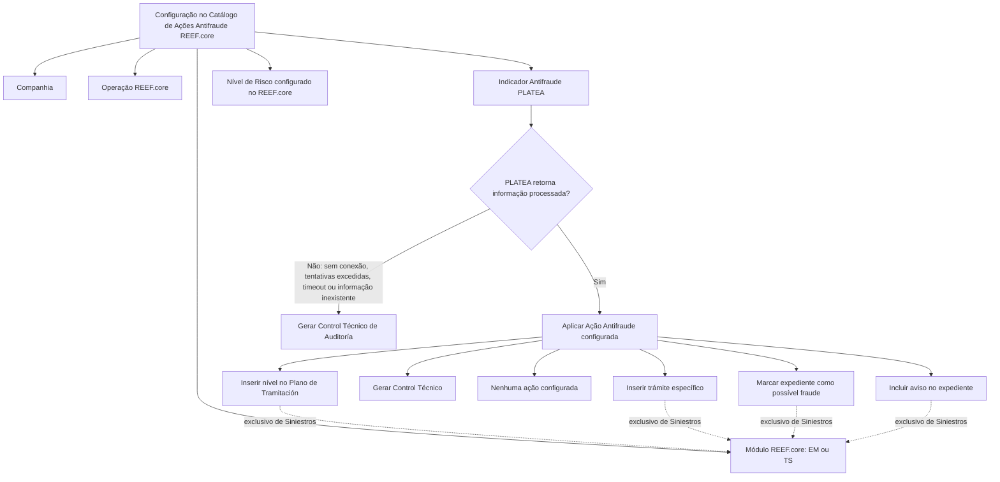

# Definição das Ações Antifraude no REEF.core Integradas aos Indicadores PLATEA

## 1. Metadados do Documento
- **Arquivo de Origem:** Não identificado no conteúdo fornecido
- **Tipo de Documento:** Especificação Técnica / Funcional
- **Domínio / Sistema:** REEF.core, PLATEA, Ações Antifraude
- **Público-Alvo:** Negócio, analistas funcionais, desenvolvedores, arquitetura e operação
- **Data/Versão Identificada:** Não identificada

---

## 2. Resumo Executivo & Contexto de Negócio

O documento define o catálogo de **Ações Antifraude** do REEF.core. Esse catálogo permite configurar uma matriz que determina quais ações devem ser consideradas pelo sistema de acordo com os níveis de risco atribuídos a um Indicador Antifraude.

A definição é associada a uma companhia, a um módulo do REEF.core, uma operação afetada, um Indicador Antifraude PLATEA, uma Ação Antifraude e um nível de risco. A partir dessa combinação, o REEF.core determina a ação operacional aplicável.

Inicialmente, a configuração cobre os módulos de **Emissão** e **Siniestros**, identificados respectivamente pelos valores `EM` e `TS`. O documento informa que a integração poderá futuramente alcançar o módulo de Tesouraria e os fornecedores do módulo de Terceros, sem detalhar regras, cronograma ou mecanismos para essa expansão.

As ações configuráveis incluem inserção de elementos no Plano de Tramitación, aplicável exclusivamente ao módulo de Siniestros, e geração de Controles Técnicos, disponível para os módulos de Emissão e Siniestros. Também é permitido não configurar uma ação para determinado nível de risco quando a entidade assim estabelecer.

Quando não for possível obter resposta do PLATEA — por falta de conexão, excesso de tentativas, timeout ou ausência de informação processada sobre o elemento avaliado — o REEF.core gera automaticamente um **Control Técnico de Auditoría**.

---

## 3. Arquitetura, Componentes & Tecnologias Envolvidas

| Componente / Conceito | Papel descrito no documento | Observações |
| :--- | :--- | :--- |
| REEF.core | Sistema que mantém o catálogo e aplica a matriz de Ações Antifraude. | Opera nos módulos de Emissão e Siniestros. |
| PLATEA | Fonte do código do Indicador Antifraude e da classificação de severidade do indicador. | O documento não detalha protocolo, interface, métodos HTTP ou contratos de integração. |
| Catálogo de Ações Antifraude | Estrutura de definição que relaciona risco, indicador e ação aplicável. | Inclui propriedades operacionais e outras propriedades. |
| Módulo de Emissão | Módulo REEF.core identificado pelo valor `EM`. | Pode receber Controles Técnicos. |
| Módulo de Siniestros | Módulo REEF.core identificado pelo valor `TS`. | Pode receber Controles Técnicos e inserções no Plano de Tramitación. |
| Plano de Tramitación | Plano local configurado no sistema para operações de Siniestros. | Pode receber um nível ou um trámite específico. |
| Control Técnico | Ação aplicável a Emissão e Siniestros, com severidades conhecidas e suportadas pelo sistema. | Também há geração automática de Control Técnico de Auditoría em falhas de resposta do PLATEA. |
| Expediente | Registro de Siniestros que pode ser marcado como possível fraude e receber aviso. | Aplicável exclusivamente ao módulo de Siniestros. |
| Tesorería | Possível módulo futuro de integração. | Não detalhado. |
| Terceros | Módulo cujos fornecedores podem participar de futura integração. | Não detalhado. |



> **Nota de Análise:** O documento menciona a integração entre REEF.core e PLATEA, mas não detalha protocolos, endpoints, autenticação, contratos JSON, frequência de consulta, retentativas configuráveis ou responsabilidades técnicas de cada sistema.

---

## 4. Regras de Negócio, Especificações Funcionais & Processos

### 4.1 Matriz de Ações Antifraude

O REEF.core permite formar, em um catálogo de definição, uma matriz de ações que devem ser consideradas no sistema conforme os níveis de risco de um Indicador Antifraude.

A matriz de definição considera, no mínimo:

1. Companhia sobre a qual a definição é realizada.
2. Módulo REEF.core afetado.
3. Operação REEF.core afetada.
4. Código do Indicador Antifraude PLATEA.
5. Código da Ação Antifraude.
6. Nível de risco do indicador.
7. Tipologia da ação.
8. Parâmetros complementares condicionais, como Controle Técnico, Plano de Tramitación, nível e trámite.

### 4.2 Módulos REEF.core

O atributo **Módulo REEF.core** identifica o módulo ao qual pertence a operação afetada.

- `EM`: módulo de Emissão.
- `TS`: módulo de Siniestros.

A integração poderá futuramente ser realizada também para:

- Módulo de Tesorería.
- Fornecedores do módulo de Terceros.

O documento não apresenta regras adicionais para Tesorería ou Terceros.

### 4.3 Nível de Risco do Indicador

O nível de risco contém a classificação pela qual o PLATEA determina o grau de severidade de um indicador. Os valores possíveis são aqueles configurados pelo REEF.core.

Quando o PLATEA não disponibilizar resposta por uma das seguintes condições, o REEF.core deve gerar automaticamente um **Control Técnico de Auditoría**:

1. Não existe conexão com o PLATEA.
2. O número de tentativas de conexão foi superado.
3. Ocorreu timeout.
4. O PLATEA ainda não possui informação processada sobre o elemento avaliado.

Os elementos avaliados citados incluem:

- Presupuesto.
- Póliza.
- Siniestro.
- Expediente.
- Outros elementos representados por “etcétera” no documento.

### 4.4 Tipologia da Ação

A tipologia da ação representa a classificação usada pelo REEF.core para determinar as ações que devem ser executadas no sistema conforme o cumprimento do indicador.

Inicialmente, o REEF.core suporta dois tipos de ação:

1. **Inserção de trámites no Plano de Tramitación**
   - Exclusiva do módulo de Siniestros.
   - Pode ocorrer pela inserção de um nível do Plano de Tramitación.
   - Pode ocorrer pela inserção de um trámite específico no Plano de Tramitación.

2. **Controles Técnicos**
   - Aplicáveis aos módulos de Emissão e Siniestros.
   - Podem possuir qualquer uma das severidades conhecidas e suportadas pelo sistema.

Também é possível não incluir qualquer ação para determinado nível de risco quando a entidade assim estabelecer.

### 4.5 Regras para Plano de Tramitación

As propriedades relacionadas ao Plano de Tramitación são aplicáveis somente quando:

1. A definição corresponde a uma operação própria do módulo de Siniestros.
2. O tipo de ação configurado exige a utilização dessas propriedades.

As propriedades são:

- **Plan de Tramitación:** código de um plano configurado localmente no sistema.
- **Nivel del Plan de Tramitación:** código de um nível associado ao Plano de Tramitación; o nível representa agrupamento de trámites da mesma natureza.
- **Trámite del Nivel:** código de um trámite associado simultaneamente ao nível e ao Plano de Tramitación.

### 4.6 Regras Exclusivas de Siniestros

As propriedades abaixo afetam exclusivamente indicadores definidos para o módulo de Siniestros:

- **Marca Expediente:** permite etiquetar o expediente como possível fraude.
- **Aviso del Plan de Tramitación:** permite indicar e incluir um aviso que aparecerá no expediente do Siniestro.

### 4.7 Validade e Inabilitação

- **Inhabilitación:** indica que o registro de Ação Antifraude configurado no catálogo está desativado ou inabilitado para utilização.
- **Fecha de Validez:** determina a data a partir da qual o registro configurado fica operacional no sistema. O uso correto dessa data permite manter histórico das alterações realizadas ao longo do tempo.

---

## 5. Tabelas de Parâmetros, Ambientes e Estruturas de Dados

| Item / Parâmetro | Descrição / Função | Tipo / Valores / Formato | Ambiente / Observações |
| :--- | :--- | :--- | :--- |
| Compañía | Código da companhia sobre a qual a definição das Ações Antifraude é realizada. | Código de companhia; formato não detalhado. | Propriedade operativa. |
| Módulo REEF.core | Determina o módulo ao qual pertence a operação REEF.core afetada. | `EM` para Emissão; `TS` para Siniestros. | Futuramente pode abranger Tesorería e fornecedores de Terceros. |
| Operación REEF.core | Determina o código da operação REEF.core afetada. | Código; formato não detalhado. | Propriedade operativa. |
| Código del Indicador Antifraude | Determina o código do Indicador Antifraude PLATEA. | Código; formato não detalhado. | Propriedade operativa. |
| Código de la Acción Antifraude | Determina o código da Ação Antifraude. | Código; formato não detalhado. | Propriedade operativa. |
| Nivel de Riesgo del Indicador | Contém a classificação da severidade de um indicador determinada pelo PLATEA. | Valores configurados pelo REEF.core. | A indisponibilidade de resposta PLATEA gera Control Técnico de Auditoría. |
| Tipología de la Acción | Classifica a ação a ser realizada pelo REEF.core conforme o cumprimento do indicador. | Inserção no Plano de Tramitación; Controles Técnicos; ausência de ação. | Inserção no plano é exclusiva de Siniestros. |
| Código del Control Técnico | Contém o código de erro do Controle Técnico quando a tipologia da ação assim determinar. | Código de erro; formato não detalhado. | Condicional ao tipo de ação. |
| Plan de Tramitación | Contém o código de um plano configurado localmente. | Código; formato não detalhado. | Somente para operações de Siniestros e quando exigido pela ação. |
| Nivel del Plan de Tramitación | Contém o código de um nível associado ao Plano de Tramitación. | Código; formato não detalhado. | Um nível agrupa trámites da mesma natureza. Exclusivo de Siniestros. |
| Trámite del Nivel | Pode conter o código de um trámite associado ao nível e ao Plano de Tramitación. | Código; formato não detalhado. | Exclusivo de Siniestros e condicional ao tipo de ação. |
| Marca Expediente | Permite etiquetar um expediente como possível fraude. | Marca; valores não detalhados. | Exclusivo de indicadores do módulo de Siniestros. |
| Aviso del Plan de Tramitación | Indica e inclui aviso exibido no expediente do Siniestro. | Texto ou código não detalhado. | Exclusivo de indicadores do módulo de Siniestros. |
| Inhabilitación | Informa que o registro configurado para a Ação Antifraude está desativado ou inabilitado. | Estado de inabilitação; formato não detalhado. | Outra propriedade. |
| Fecha de Validez | Indica a data a partir da qual o registro fica operacional. | Data; formato não detalhado. | Permite histórico das alterações ao longo do tempo. |
| Control Técnico de Auditoría | Controle gerado automaticamente quando o PLATEA não retorna resposta válida. | Controle Técnico; código e severidade não detalhados para esse cenário. | Aplicável em falha de conexão, tentativas excedidas, timeout ou ausência de informação processada. |

---

## 6. Bateria de Perguntas & Respostas para RAG (FAQ Sintético)

### P1: Qual é o objetivo do catálogo de Ações Antifraude do REEF.core?
**R:** O catálogo de Ações Antifraude permite configurar uma matriz de ações que o REEF.core deve considerar conforme os níveis de risco de um Indicador Antifraude. A matriz relaciona companhia, módulo, operação, indicador PLATEA, ação antifraude, nível de risco e propriedades condicionais da ação.

### P2: Quais módulos REEF.core são suportados inicialmente pelas Ações Antifraude?
**R:** Inicialmente, o catálogo de Ações Antifraude contempla o módulo de Emissão, identificado por `EM`, e o módulo de Siniestros, identificado por `TS`. O documento informa que Tesorería e fornecedores do módulo de Terceros poderão ser incluídos em integrações futuras, mas não apresenta detalhes funcionais ou técnicos dessa expansão.

### P3: O que acontece quando o PLATEA não retorna uma resposta para o elemento avaliado?
**R:** Quando o PLATEA não responde porque não há conexão, porque o número de tentativas de conexão foi excedido, porque ocorreu timeout ou porque ainda não existe informação processada sobre o elemento avaliado, o REEF.core gera automaticamente um Control Técnico de Auditoría.

### P4: Quais são os tipos de Ações Antifraude inicialmente suportados no REEF.core?
**R:** O REEF.core inicialmente suporta inserção de trámites no Plano de Tramitación e Controles Técnicos. A inserção no Plano de Tramitación é exclusiva do módulo de Siniestros. Os Controles Técnicos podem ser usados nos módulos de Emissão e Siniestros e podem possuir qualquer severidade conhecida e suportada pelo sistema.

### P5: Como funciona a inserção no Plano de Tramitación?
**R:** A inserção no Plano de Tramitación pode ocorrer de duas formas: pela inserção de um nível, que agrupa trámites da mesma natureza, ou pela inserção de um trámite específico. Essas operações são exclusivas do módulo de Siniestros.

### P6: Em quais situações os campos Plano de Tramitación, Nivel del Plan de Tramitación e Trámite del Nivel podem ser preenchidos?
**R:** Esses campos podem ser utilizados somente quando a definição corresponde a uma operação própria do módulo de Siniestros e quando o tipo de ação configurado assim determinar. O Plano de Tramitación identifica um plano local, o nível identifica um agrupamento de trámites e o trámite identifica um item associado ao nível e ao plano.

### P7: É possível não executar nenhuma ação para um determinado nível de risco?
**R:** Sim. O documento estabelece que pode não ser incluída nenhuma ação para um nível de risco quando a entidade assim definir.

### P8: O que faz a propriedade Marca Expediente?
**R:** A propriedade Marca Expediente afeta exclusivamente indicadores definidos para o módulo de Siniestros e permite etiquetar o expediente como possível fraude.

### P9: Qual é a finalidade da propriedade Aviso del Plan de Tramitación?
**R:** A propriedade Aviso del Plan de Tramitación afeta exclusivamente indicadores do módulo de Siniestros e permite indicar e incluir um aviso que será exibido no expediente do Siniestro.

### P10: Como o REEF.core controla a vigência de uma configuração de Ação Antifraude?
**R:** A propriedade Fecha de Validez informa a data a partir da qual o registro configurado fica operacional no sistema. O uso adequado dessa data permite manter o histórico das modificações realizadas ao longo do tempo.

### P11: Qual é a finalidade da propriedade Inhabilitación?
**R:** Inhabilitación estabelece que o registro configurado para uma Ação Antifraude no catálogo está desativado ou inabilitado para uso.

### P12: O documento detalha os contratos técnicos da integração entre REEF.core e PLATEA?
**R:** Não. O documento identifica o PLATEA como origem do código do Indicador Antifraude e da classificação de risco, além de descrever os cenários de indisponibilidade. Porém, não detalha endpoints, métodos HTTP, protocolos, autenticação, payloads ou contratos de integração.

---

## 7. Glossário de Termos, Siglas & Conceitos-Chave

- **REEF.core:** Sistema que contém o catálogo de definição e executa as Ações Antifraude conforme nível de risco e indicador.
- **PLATEA:** Sistema mencionado como origem do código do Indicador Antifraude e da classificação de severidade do indicador.
- **EM:** Valor do Módulo REEF.core correspondente ao módulo de Emissão.
- **TS:** Valor do Módulo REEF.core correspondente ao módulo de Siniestros.
- **Indicador Antifraude:** Indicador cujo código é determinado no PLATEA e cujo risco orienta a ação no REEF.core.
- **Ação Antifraude:** Ação configurada no catálogo para ser considerada pelo REEF.core.
- **Nivel de Riesgo del Indicador:** Classificação de severidade atribuída pelo PLATEA, com valores configurados pelo REEF.core.
- **Tipología de la Acción:** Classificação da ação que o REEF.core deve realizar conforme o indicador.
- **Control Técnico:** Tipo de ação aplicável aos módulos de Emissão e Siniestros.
- **Control Técnico de Auditoría:** Controle gerado automaticamente quando não há resposta adequada do PLATEA.
- **Plan de Tramitación:** Plano local configurado no sistema para operações de Siniestros.
- **Nivel del Plan de Tramitación:** Agrupamento de trámites da mesma natureza associado a um Plano de Tramitación.
- **Trámite:** Item específico que pode ser associado a um nível e a um Plano de Tramitación.
- **Expediente:** Registro associado ao módulo de Siniestros, que pode ser marcado como possível fraude e receber aviso.
- **Inhabilitación:** Propriedade que desativa ou inabilita um registro do catálogo.
- **Fecha de Validez:** Data a partir da qual uma configuração fica operacional.

---

## 8. Notas Críticas, Riscos & Limitações

- O documento não identifica arquivo de origem, autor, data, versão, ambiente ou responsáveis pela manutenção do catálogo.
- Não há detalhamento técnico da integração REEF.core–PLATEA, incluindo interfaces, protocolos, autenticação, timeouts, quantidade de tentativas ou contratos de dados.
- A geração de um Control Técnico de Auditoría é obrigatória quando o PLATEA não fornece resposta por indisponibilidade, timeout, excesso de tentativas ou falta de informação processada.
- Tesorería e fornecedores do módulo de Terceros são citados como possíveis alvos futuros de integração, mas não possuem regras funcionais detalhadas.
- O formato dos códigos, datas, severidades, estados de inabilitação e avisos não é especificado.
- O documento indica que Controles Técnicos podem usar severidades conhecidas e suportadas pelo sistema, mas não lista essas severidades.
- A seção de perguntas frequentes não oferece recomendação operacional local para codificação, uso ou definição da tabela de Ações Antifraude, pois responde `N/A`.

---

## 9. Conteúdo Bruto Estruturado (Referência Fiel)

```text
--- [PÁGINA 1 DE 4] ---

DEFINICIÓN de las ACCIONES ANTIFRAUDE
Objetivo
Funcionalmente, Reef.core cuenta con la posibilidad de conformar en un catálogo de definición la
matriz de acciones que se tienen que considerar en el sistema dependiendo de los niveles de riesgo
de un indicador.
De acuerdo con su naturaleza:
Propiedades Operativas
Otras Propiedades
Propiedades Operativas
Compañía
Este Atributo del catálogo contiene el código de la compañía sobre la que se está realizando la
definición de las Acciones Antifraude.
Módulo Reef.core
Esta Propiedad determina el Módulo de Reef.core al que pertenece la Operación Reef.core afectada
pudiendo ser sus valores Emisión o Siniestros ('EM'/'TS' Respectivamente)
NOTA: A futuro la integración también podrá realizarse para el Módulo de Tesorería y para los
Proveedores del Módulo de Terceros.
 / 
 CF
Home Solutions APIs Documentation Zeus
EN


--- [PÁGINA 2 DE 4] ---

Operación Reef.core
Esta Propiedad determina el código de la Operación de Reef.core afectada.
Código del Indicador Antifraude
Este Atributo determina el código del Indicador Antifraude de PLATEA.
Código de la Acción Antifraude
Este Atributo determina el código de la Acción Antifraude.
Nivel de Riesgo del Indicador
Esta Propiedad contiene la clasificación con la que PLATEA determina el grado de severidad de un
indicador siendo sus posibles valores aquellos configurados por Reef.core
NOTA: Si no se obtiene una respuesta de PLATEA, ya sea porque no haya conexión, se haya
superado el número de intentos de conexión, se haya producido un timeout o PLATEA no disponga
aún de información procesada sobre el elemento a evaluar: presupuesto, póliza, siniestro,
expediente, etcétera, se generará automáticamente un Control Técnico de Auditoría.
Tipología de la Acción
Esta Propiedad contiene la clasificación de la acción con la que Reef.core determina las acciones
debe realizarse en el sistema y de acuerdo con el cumplimiento del indicador.
Inicialmente las acciones que se pueden en Reef.core serán de dos tipos:
Inserción de trámites en el Plan de tramitación (Este tipo es exclusivo del módulo de Siniestros)
Controles técnicos (Este tipo sirve tanto para el módulo de Emisión como Siniestros)
La inserción de trámites se podrá realizar mediante:
Inserción de un Nivel en el plan de Tramitación, como agrupación de trámites de la misma
naturaleza.
Inserción de un Trámite específico en el plan de Tramitación.
Los Controles técnicos podrán ser de cualquiera de las severidades conocidas y soportadas en el
sistema.
Adicionalmente existirá la posibilidad de no incluir acción alguna en un nivel de riesgo cuando la
entidad asó lo establezca.
Código del Control Técnico


--- [PÁGINA 3 DE 4] ---

Esta Propiedad contendrá el Código de Error de Control Técnico siempre y cuando el tipo de acción
así lo determine.
Plan de Tramitación
Solamente en el caso que la definición se corresponda con alguna operación propia del Módulo de
siniestros, este Atributo contendrá el código de uno de los Planes de Tramitación configurados
localmente en el Sistema siempre y cuando el tipo de acción así lo determine.
Nivel del Plan de Tramitación
Solamente en el caso que la definición se corresponda con alguna operación propia del Módulo de
siniestros, este Atributo contendrá el código de uno de los Niveles, como agrupación de trámites de la
misma naturaleza, asociados al Plan de Tramitación siempre y cuando el tipo de acción así lo
determine.
Trámite del Nivel
Solamente en el caso que la definición se corresponda con alguna operación propia del Módulo de
siniestros, este Atributo podrá contener el código de uno de los Trámites asociados al Nivel y al Plan
de Tramitación siempre y cuando el tipo de acción así lo determine.
Marca Expediente
Esta Propiedad afecta exclusivamente a los indicadores definidos para el módulo de siniestros y
permite etiquetar como posible fraude el expediente.
Aviso del Plan de Tramitación
Esta Propiedad afecta exclusivamente a los indicadores definidos para el módulo de siniestros y
permite indicar e incluir un aviso que aparecerá en el expediente del Siniestro.
Otras Propiedades
Inhabilitación
Esta propiedad establece que el Registro configurado para la Acción Antifraude en el Catálogo está
desactivado o inhabilitado para ser utilizado.
Fecha de Validez
Esta propiedad le indica al Sistema la fecha a partir de la cual el registro configurado de la Acción
Antifraude está operativo en el sistema por lo que su correcto uso permite tener un histórico de los
cambios efectuados a lo largo del tiempo.


--- [PÁGINA 4 DE 4] ---

Vínculos
Relación de Directrices y Documentos funcionales cuya lectura recomendada para evitar que la
interpretación aislada del presente documento pueda conducir a error.
Indicadores Antifraude
Ámbito Indicadores Antifraude
Controles técnicos
Preguntas frecuentes
(1) ¿Existe alguna recomendación operativa que deba ser tomada en consideración localmente en la
codificación, uso y definición de la tabla de Acciones Antifraude de Reef.core?
N/A
```
