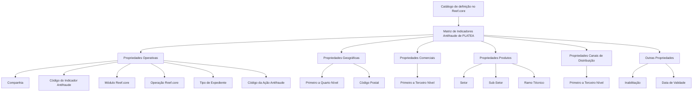

# Definição do Âmbito dos Indicadores Antifraude de PLATEA no Reef.core

## 1. Metadados do Documento
- **Arquivo de Origem:** Não identificado no conteúdo fornecido
- **Tipo de Documento:** Especificação Técnica / Funcional
- **Domínio / Sistema:** PLATEA; Reef.core; Indicadores Antifraude
- **Público-Alvo:** Desenvolvedores, Arquitetos, Operação e Negócio
- **Data/Versão Identificada:** Não identificada

---

## 2. Resumo Executivo & Contexto de Negócio

O documento define o âmbito de configuração da matriz de indicadores antifraude de PLATEA no sistema Reef.core. Funcionalmente, Reef.core possibilita criar, em um catálogo de definição, o conjunto de propriedades que delimitam os indicadores antifraude cujo cumprimento será avaliado pelo sistema.

A definição de uma ação ou indicador antifraude pode ser segmentada por propriedades operacionais, geográficas, comerciais, de produtos, de canais de distribuição e outras propriedades de controle. Essas propriedades permitem associar o indicador a elementos específicos das estruturas corporativas, como companhia, módulo, operação, geografia, produto, estrutura comercial e canal de distribuição.

No âmbito operacional, o catálogo relaciona o código da companhia, o indicador antifraude, o módulo Reef.core, a operação afetada, o tipo de expediente — quando a definição se refere ao módulo de Siniestros — e o código da ação antifraude. O documento indica que, futuramente, a integração também poderá ser realizada para o módulo de Tesouraria e para os fornecedores do módulo de Terceros.

O modelo permite usar valores genéricos nas propriedades das estruturas geográfica, comercial, de produtos e de canais de distribuição. Os valores `9999`, para campos numéricos, e `ZZZZ`, para campos alfanuméricos, facilitam a manutenção do catálogo e permitem especializar ações antifraude para qualquer combinação dos valores dessas propriedades.

A configuração também possui controles de ciclo de vida. A propriedade de inabilitação desativa um registro para uso, enquanto a data de validade estabelece a data a partir da qual o registro configurado se torna operacional. Esse mecanismo suporta o histórico de alterações efetuadas ao longo do tempo.

---

## 3. Arquitetura, Componentes & Tecnologias Envolvidas

### Sistemas e componentes identificados

| Componente / Elemento | Papel identificado no documento |
| :--- | :--- |
| **PLATEA** | Contexto dos indicadores antifraude definidos no catálogo. |
| **Reef.core** | Sistema que mantém o catálogo de definição e avalia o cumprimento da matriz de indicadores antifraude. |
| **Catálogo de definição** | Estrutura de configuração do âmbito da matriz de indicadores antifraude. |
| **Indicador Antifraude** | Indicador cujo código ou chave é determinado na definição. |
| **Ação Antifraude** | Ação associada ao indicador antifraude, identificada por código ou chave. |
| **Módulo Reef.core** | Módulo ao qual pertence a operação Reef.core afetada. |
| **Módulo de Siniestros** | Módulo para o qual o tipo de expediente é relevante na definição. |
| **Módulo de Tesouraria** | Módulo mencionado como possível âmbito futuro de integração. |
| **Módulo de Terceros** | Módulo cujos fornecedores são mencionados como possível âmbito futuro de integração. |
| **Estrutura Geográfica** | Estrutura segmentada em quatro níveis e código postal. |
| **Estrutura Comercial** | Estrutura segmentada em três níveis. |
| **Estrutura de Produtos** | Estrutura composta por setor, sub-setor e ramo técnico. |
| **Estrutura de Canais de Distribuição** | Estrutura segmentada em três níveis: tipos de clientes distribuidores, agrupações e fontes de produção. |



> **Nota de Análise:** O documento não descreve métodos HTTP, contratos JSON, banco de dados, protocolos de integração, infraestrutura, URLs, servidores, tecnologias de implementação ou mecanismos técnicos de persistência.

---

## 4. Regras de Negócio, Especificações Funcionais & Processos

### 4.1. Objetivo funcional

1. Reef.core permite conformar, em um catálogo de definição, o âmbito da matriz de indicadores antifraude.
2. O sistema avalia o cumprimento dos indicadores antifraude definidos na matriz.
3. O âmbito da matriz é definido por propriedades classificadas conforme sua natureza:
   - Propriedades operativas.
   - Propriedades geográficas.
   - Propriedades comerciais.
   - Propriedades de produtos.
   - Propriedades de canais de distribuição.
   - Outras propriedades.

### 4.2. Regras para propriedades operativas

1. A propriedade **Companhia** contém o código da companhia sobre a qual está sendo realizada a definição das ações antifraude.
2. A propriedade **Código do Indicador Antifraude** determina o código ou a chave do indicador antifraude de PLATEA.
3. A propriedade **Módulo Reef.core** determina o módulo Reef.core ao qual pertence a operação Reef.core afetada.
4. A propriedade **Operação Reef.core** determina o código da operação Reef.core afetada.
5. A propriedade **Tipo de Expediente** determina o código ou a chave do tipo de expediente afetado pela ação definida quando o módulo da definição corresponde ao módulo de Siniestros.
6. A propriedade **Código da Ação Antifraude** determina o código ou a chave da ação antifraude.
7. A integração poderá futuramente ser realizada também para:
   - Módulo de Tesouraria.
   - Fornecedores do módulo de Terceros.

### 4.3. Regras para propriedades geográficas

1. O **Código do Primeiro Nível** contém a chave que identifica o primeiro nível da estrutura geográfica.
2. O **Código do Segundo Nível** identifica a chave do segundo nível da estrutura geográfica.
3. O **Código do Terceiro Nível** identifica a chave do terceiro nível da estrutura geográfica.
4. O **Código do Quarto Nível** identifica a chave do quarto nível da estrutura geográfica.
5. O **Código Postal** contém a chave que identifica o código postal associado aos cinco níveis da estrutura geográfica.

### 4.4. Regras para propriedades comerciais

1. A **Chave do Primeiro Nível** contém o código que identifica o primeiro nível da estrutura comercial no sistema.
2. A **Chave do Segundo Nível** contém o código que identifica o segundo nível da estrutura comercial no sistema.
3. A **Chave do Terceiro Nível** contém o código que identifica o terceiro nível da estrutura comercial no sistema.

### 4.5. Regras para propriedades de produtos

1. A propriedade **Setor** identifica a chave do setor.
2. A propriedade **Sub-Setor** identifica a chave do sub-setor no sistema.
3. A propriedade **Ramo Técnico** identifica a chave do ramo técnico da estrutura de produtos da companhia.

### 4.6. Regras para propriedades de canais de distribuição

1. O **Código do Primeiro Nível** identifica a chave do primeiro nível da estrutura de canais ou dos tipos de clientes distribuidores no sistema.
2. O **Código do Segundo Nível** identifica a chave do segundo nível da estrutura de canais ou das agrupações no sistema.
3. O **Código do Terceiro Nível** identifica a chave do terceiro nível da estrutura de canais ou das fontes de produção no sistema.

### 4.7. Regras de vigência e disponibilidade

1. A propriedade **Inabilitação** estabelece que o registro configurado para o indicador antifraude no catálogo está desativado ou inabilitado para uso.
2. A propriedade **Data de Validade** informa ao sistema a data a partir da qual o registro configurado para o indicador antifraude está operacional.
3. O uso correto da data de validade permite manter um histórico das alterações efetuadas ao longo do tempo.

### 4.8. Uso de valores genéricos

1. Nas propriedades das estruturas geográfica, comercial, de produtos e de canais de distribuição podem ser utilizados valores genéricos.
2. O valor genérico `9999` pode ser empregado em campos numéricos.
3. O valor genérico `ZZZZ` pode ser empregado em campos alfanuméricos.
4. Os valores genéricos facilitam a manutenção do catálogo de definição.
5. Os valores genéricos permitem especializar ações antifraude para qualquer combinação dos valores das propriedades aplicáveis.

---

## 5. Tabelas de Parâmetros, Ambientes e Estruturas de Dados

| Item / Parâmetro | Descrição / Função | Tipo / Valores / Formato | Ambiente / Observações |
| :--- | :--- | :--- | :--- |
| Companhia | Código da companhia sobre a qual é realizada a definição das ações antifraude. | Código; formato não detalhado. | Propriedades Operativas. |
| Código do Indicador Antifraude | Código ou chave do indicador antifraude de PLATEA. | Código ou chave; formato não detalhado. | Propriedades Operativas. |
| Módulo Reef.core | Módulo Reef.core ao qual pertence a operação afetada. | Módulo; valores não detalhados. | Propriedades Operativas. |
| Operação Reef.core | Código da operação Reef.core afetada. | Código; formato não detalhado. | Propriedades Operativas. |
| Tipo de Expediente | Código ou chave do tipo de expediente afetado pela ação definida. | Código ou chave; formato não detalhado. | Aplicável quando o módulo da definição corresponde ao módulo de Siniestros. |
| Código da Ação Antifraude | Código ou chave da ação antifraude. | Código ou chave; formato não detalhado. | Propriedades Operativas. |
| Código do Primeiro Nível Geográfico | Chave identificadora do primeiro nível da estrutura geográfica. | Chave; formato não detalhado. | Propriedades Geográficas. |
| Código do Segundo Nível Geográfico | Chave identificadora do segundo nível da estrutura geográfica. | Chave; formato não detalhado. | Propriedades Geográficas. |
| Código do Terceiro Nível Geográfico | Chave identificadora do terceiro nível da estrutura geográfica. | Chave; formato não detalhado. | Propriedades Geográficas. |
| Código do Quarto Nível Geográfico | Chave identificadora do quarto nível da estrutura geográfica. | Chave; formato não detalhado. | Propriedades Geográficas. |
| Código Postal | Chave que identifica o código postal associado aos cinco níveis da estrutura geográfica. | Chave; formato não detalhado. | Propriedades Geográficas. |
| Chave do Primeiro Nível Comercial | Código que identifica o primeiro nível da estrutura comercial no sistema. | Código; formato não detalhado. | Propriedades Comerciais. |
| Chave do Segundo Nível Comercial | Código que identifica o segundo nível da estrutura comercial no sistema. | Código; formato não detalhado. | Propriedades Comerciais. |
| Chave do Terceiro Nível Comercial | Código que identifica o terceiro nível da estrutura comercial no sistema. | Código; formato não detalhado. | Propriedades Comerciais. |
| Setor | Chave identificadora do setor. | Chave; formato não detalhado. | Propriedades Produtos. |
| Sub-Setor | Chave identificadora do sub-setor no sistema. | Chave; formato não detalhado. | Propriedades Produtos. |
| Ramo Técnico | Chave do ramo técnico da estrutura de produtos da companhia. | Chave; formato não detalhado. | Propriedades Produtos. |
| Código do Primeiro Nível de Canais | Chave do primeiro nível da estrutura de canais ou dos tipos de clientes distribuidores. | Chave; formato não detalhado. | Propriedades Canais. |
| Código do Segundo Nível de Canais | Chave do segundo nível da estrutura de canais ou das agrupações. | Chave; formato não detalhado. | Propriedades Canais. |
| Código do Terceiro Nível de Canais | Chave do terceiro nível da estrutura de canais ou das fontes de produção. | Chave; formato não detalhado. | Propriedades Canais. |
| Inabilitação | Indica que o registro configurado para o indicador antifraude está desativado ou inabilitado para uso. | Estado de habilitação; valores não detalhados. | Outras Propriedades. |
| Data de Validade | Define a data a partir da qual o registro configurado está operacional. | Data; formato não detalhado. | Permite manter histórico de alterações. |
| Valor genérico numérico | Valor genérico para propriedades aplicáveis. | `9999`. | Estruturas geográfica, comercial, de produtos e de canais de distribuição. |
| Valor genérico alfanumérico | Valor genérico para propriedades aplicáveis. | `ZZZZ`. | Estruturas geográfica, comercial, de produtos e de canais de distribuição. |

---

## 6. Bateria de Perguntas & Respostas para RAG (FAQ Sintético)

### P1: Qual é o objetivo do catálogo de definição de indicadores antifraude no Reef.core?
**R:** O catálogo de definição no Reef.core permite conformar o âmbito da matriz de indicadores antifraude de PLATEA. O cumprimento desses indicadores configurados será avaliado pelo sistema Reef.core.

### P2: Quais categorias de propriedades definem o âmbito da matriz de indicadores antifraude?
**R:** O documento define seis categorias: propriedades operativas, propriedades geográficas, propriedades comerciais, propriedades de produtos, propriedades de canais de distribuição e outras propriedades.

### P3: O que a propriedade Companhia representa na definição de uma ação antifraude?
**R:** A propriedade Companhia contém o código da companhia sobre a qual está sendo realizada a definição das ações antifraude.

### P4: Quando o Tipo de Expediente deve ser utilizado na configuração do indicador antifraude?
**R:** O Tipo de Expediente determina o código ou a chave do tipo de expediente afetado pela ação definida quando o módulo da definição corresponde ao módulo de Siniestros.

### P5: Quais módulos futuros de integração são mencionados pelo documento?
**R:** O documento informa que, futuramente, a integração também poderá ser realizada para o módulo de Tesouraria e para os fornecedores do módulo de Terceros.

### P6: Como a estrutura geográfica é representada na definição dos indicadores antifraude?
**R:** A estrutura geográfica possui código de primeiro, segundo, terceiro e quarto nível. Também possui código postal, associado aos cinco níveis da estrutura geográfica conforme descrito no documento.

### P7: O que representam os três níveis da estrutura de canais de distribuição?
**R:** O primeiro nível representa a estrutura de canais ou os tipos de clientes distribuidores. O segundo nível representa a estrutura de canais ou as agrupações. O terceiro nível representa a estrutura de canais ou as fontes de produção.

### P8: Qual é a finalidade da propriedade Inabilitação?
**R:** A propriedade Inabilitação estabelece que o registro configurado para o indicador antifraude no catálogo está desativado ou inabilitado para ser utilizado.

### P9: Como a Data de Validade afeta um registro de indicador antifraude?
**R:** A Data de Validade informa ao sistema a data a partir da qual o registro configurado para o indicador antifraude fica operacional. O uso correto dessa propriedade permite manter um histórico das alterações efetuadas ao longo do tempo.

### P10: Quais valores genéricos podem ser utilizados nas propriedades do catálogo?
**R:** O documento permite o uso de `9999` em campos numéricos e `ZZZZ` em campos alfanuméricos das estruturas geográfica, comercial, de produtos e de canais de distribuição.

### P11: Qual é o benefício operacional dos valores genéricos `9999` e `ZZZZ`?
**R:** Os valores genéricos facilitam a manutenção do catálogo de definição e permitem especializar ações antifraude para qualquer combinação dos valores das propriedades das estruturas geográfica, comercial, de produtos e de canais de distribuição.

### P12: Quais documentos relacionados devem ser consultados para evitar interpretação isolada incorreta?
**R:** O documento recomenda a leitura de: Definição de Indicadores Antifraude, Estrutura Geográfica, Estrutura Comercial, Estrutura de Produtos e Estrutura de Canais de Distribuição.

---

## 7. Glossário de Termos, Siglas & Conceitos-Chave

- **PLATEA:** Contexto no qual são definidos os indicadores antifraude mencionados no documento.
- **Reef.core:** Sistema que possibilita configurar, em um catálogo de definição, o âmbito da matriz de indicadores antifraude e avaliar seu cumprimento.
- **Indicador Antifraude:** Indicador de PLATEA identificado por código ou chave e avaliado pelo sistema.
- **Ação Antifraude:** Ação identificada por código ou chave, configurada no catálogo em associação ao indicador antifraude.
- **Catálogo de definição:** Estrutura no Reef.core usada para configurar o âmbito dos indicadores e ações antifraude.
- **Módulo Reef.core:** Módulo do Reef.core ao qual pertence a operação afetada.
- **Operação Reef.core:** Operação do Reef.core afetada, identificada por código.
- **Siniestros:** Módulo para o qual é aplicável o tipo de expediente na definição da ação antifraude.
- **Tesouraria:** Módulo mencionado como possível integração futura.
- **Terceros:** Módulo cujos fornecedores são mencionados como possível integração futura.
- **Estrutura Geográfica:** Estrutura composta por níveis geográficos e código postal.
- **Estrutura Comercial:** Estrutura comercial composta por três níveis identificados por códigos.
- **Estrutura de Produtos:** Estrutura composta por setor, sub-setor e ramo técnico.
- **Estrutura de Canais de Distribuição:** Estrutura composta por tipos de clientes distribuidores, agrupações e fontes de produção.
- **Inabilitação:** Estado que indica que o registro configurado está desativado ou indisponível para uso.
- **Data de Validade:** Data a partir da qual um registro configurado torna-se operacional.
- **`9999`:** Valor genérico aplicável a campos numéricos das estruturas indicadas.
- **`ZZZZ`:** Valor genérico aplicável a campos alfanuméricos das estruturas indicadas.

---

## 8. Notas Críticas, Riscos & Limitações

- O documento não especifica formatos, tamanhos, obrigatoriedade, domínios de valores ou regras de validação técnica para os códigos e chaves descritos.
- O documento não detalha como Reef.core avalia o cumprimento dos indicadores antifraude após a configuração do catálogo.
- Não há descrição de métodos de integração, APIs, contratos de mensagens, URLs, credenciais, ambientes, logs ou mecanismos de tratamento de erro.
- A referência a integrações futuras com Tesouraria e fornecedores do módulo de Terceros não apresenta cronograma, escopo funcional, requisitos ou desenho técnico.
- O código postal é descrito como associado aos cinco níveis da estrutura geográfica, mas o documento detalha explicitamente apenas quatro códigos de nível geográfico.
- A semântica operacional de `9999` e `ZZZZ` é descrita como valor genérico; o documento não informa precedência, comportamento de conflito ou regras de combinação entre registros genéricos e específicos.
- A interpretação isolada do documento pode conduzir a erro. O próprio documento recomenda consultar os materiais relacionados sobre indicadores antifraude e as estruturas geográfica, comercial, de produtos e de canais de distribuição.

---

## 9. Conteúdo Bruto Estruturado (Referência Fiel)

```text
--- [PÁGINA 1 DE 4] ---

DEFINICIÓN del ÁMBITO de los INDICADORES
ANTIFRAUDE de PLATEA
Objetivo
Funcionalmente, Reef.core cuenta con la posibilidad de conformar en un catálogo de definición el
ámbito de la matriz de indicadores Antifraude cuyo cumplimiento va a ser evaluado en el sistema.
De acuerdo con su naturaleza:
Propiedades Operativas
Propiedades Geográficas
Propiedades Comerciales
Propiedades Productos
Propiedades Canales de Distribución
Otras Propiedades
Propiedades Operativas
Compañía
Este Atributo del catálogo contiene el código de la compañía sobre la que se está realizando la
definición de las Acciones Antifraude.
Código del Indicador Antifraude
 / 
 CF
Home Solutions APIs Documentation Zeus
EN


--- [PÁGINA 2 DE 4] ---

Este Atributo determina el código o clave del Indicador Antifraude de PLATEA.
Módulo Reef.core
Esta Propiedad determina el Módulo de Reef.core al que pertenece la Operación Reef.core afectada.
NOTA: A futuro la integración también podrá realizarse para el Módulo de Tesorería y para los
Proveedores del Módulo de Terceros.
Operación Reef.core
Esta Propiedad determina el código de la Operación de Reef.core afectada.
Tipo de Expediente
Este Atributo determina el código o clave del Tipo de Expediente afecto a la acción definida en el
caso que el módulo de la definición corresponda al módulo de Siniestros.
Código de la Acción Antifraude
Este Atributo determina el código o clave de la Acción Antifraude.
Propiedades Geográficas
Código del Primer Nivel
Este atributo contiene la clave que identificará al Primer Nivel de la estructura Geográfica.
Código del Segundo Nivel
Este atributo identifica específicamente la clave que identificará al Segundo Nivel de la estructura
Geográfica.
Código del Tercer Nivel
Este atributo identifica específicamente la clave que identificará al Tercer Nivel de la estructura
Geográfica.
Código del Cuarto Nivel
Este atributo identifica específicamente la clave que identificará al Cuarto Nivel de la estructura
Geográfica.
Código Postal


--- [PÁGINA 3 DE 4] ---

Esta Propiedad contiene la clave que identifica el Código Postal asociado a los cinco niveles de la
estructura geográfica.
Propiedades Comerciales
Clave del Primer Nivel
Este atributo contiene el código por el que se identifica el Primer Nivel de la Estructura Comercial en
el Sistema.
Clave del Segundo Nivel
Este atributo contiene el código por el que se identifica el Segundo Nivel de la Estructura Comercial
en el Sistema.
Clave del Tercer Nivel
Este atributo contiene el código por el que se identifica el Tercer Nivel de la Estructura Comercial en
el Sistema.
Propiedades Productos
Sector
Esta propiedad identifica la clave del Sector.
Sub-Sector
Este atributo identifica en el sistema la clave del Sub-Sector.
Ramo Técnico
Esta propiedad identifica la clave del Ramo Técnico de la Estructura de Productos de la Compañía.
Propiedades Canales
Código del Primer Nivel
Este atributo identifica la clave del Primer Nivel de la estructura de canales o Tipos de Clientes
Distribuidores en el Sistema.
Código del Segundo Nivel
Este atributo identifica la clave del Segundo Nivel de la estructura de canales o Agrupaciones en el
Sistema:


--- [PÁGINA 4 DE 4] ---

Código del Tercer Nivel
Este atributo identificará la clave del Tercer Nivel de la estructura de canales o Fuentes de
Producción en el Sistema.
Otras Propiedades
Inhabilitación
Esta propiedad establece que el Registro configurado para el Indicador Antifraude en el Catálogo
está desactivado o inhabilitado para ser utilizado.
Fecha de Validez
Esta propiedad le indica al Sistema la fecha a partir de la cual el registro configurado para el
Indicador Antifraude está operativo en el sistema por lo que su correcto uso permite tener un histórico
de los cambios efectuados a lo largo del tiempo.
Vínculos
Relación de Directrices y Documentos funcionales cuya lectura recomendada para evitar que la
interpretación aislada del presente documento pueda conducir a error.
Definición de Indicadores Antifraude
Estructura Geográfica
Estructura Comercial
Estructura de Productos
Estructura de Canales de Distribución
Preguntas frecuentes
(1) ¿Existe alguna consideración operativa que deba ser tomada en consideración localmente en la
codificación, uso y definición de la tabla de Acciones Antifraude en Reef.core?
En los valores de las diferentes Propiedades de las estructuras Geográfica, Comercial, Productos y
Canales de Distribución se pueden emplear los valores genéricos (9999 ó ZZZZ en campos
numéricos o alfanuméricos respectivamente) que facilitan el mantenimiento del catálogo de definición
y permiten a su vez especializar las acciones Antifraude para cualquier combinación de sus valores.
```
