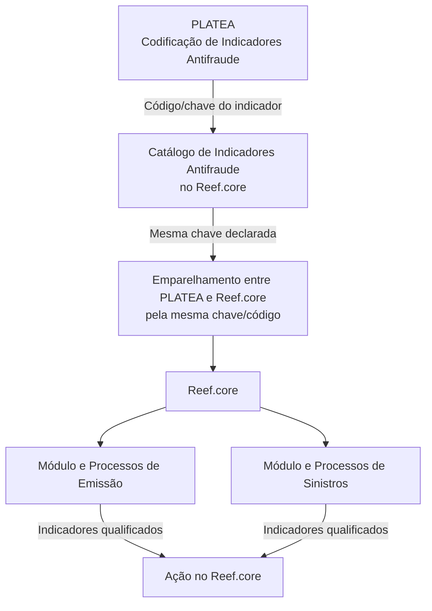

# Definição dos Indicadores Antifraude de PLATEA no Reef.core

## 1. Metadados do Documento
- **Arquivo de Origem:** `Não identificado`
- **Tipo de Documento:** Especificação Técnica
- **Domínio / Sistema:** PLATEA, Reef.core, Indicadores Antifraude
- **Público-Alvo:** Desenvolvedores, Arquitetos, Operação e Negócio
- **Data/Versão Identificada:** Não identificada

---

## 2. Resumo Executivo & Contexto de Negócio

O documento define a configuração da matriz de Indicadores Antifraude no sistema Reef.core, utilizando a codificação previamente estabelecida pela plataforma PLATEA em um catálogo de informação específico. O objetivo funcional é permitir que Reef.core reconheça e empregue indicadores antifraude que tenham relevância operacional dentro dos seus módulos e processos.

A integração conceitual entre PLATEA e Reef.core depende da preservação exata da chave de cada indicador. A chave atribuída em PLATEA deve ser declarada sem alteração em Reef.core, pois funciona como identificador de emparelhamento entre ambas as plataformas.

O catálogo de Indicadores Antifraude contém propriedades operacionais, como companhia, idioma, código e descrição do indicador, além de qualificações de uso nos módulos de Emissão e de Sinistros do Reef.core. O catálogo também prevê propriedades para inabilitação do registro e vigência temporal.

O documento estabelece que não é necessário cadastrar todos os indicadores existentes em PLATEA. Somente devem ser definidos no Reef.core os indicadores capazes de gerar algum tipo de ação no sistema. A configuração deve ainda respeitar a codificação de PLATEA para evitar divergências entre as plataformas.

---

## 3. Arquitetura, Componentes & Tecnologias Envolvidas

### Componentes identificados

| Componente | Papel identificado no documento |
| :--- | :--- |
| **PLATEA** | Plataforma que realiza a codificação dos Indicadores Antifraude. |
| **Reef.core** | Sistema que configura uma matriz/catálogo de Indicadores Antifraude e utiliza os indicadores nos módulos de Emissão e Sinistros. |
| **Catálogo de Indicadores Antifraude** | Estrutura de informação específica no Reef.core para configurar os indicadores codificados no PLATEA. |
| **Módulo de Emissão** | Módulo e conjunto de processos do Reef.core que pode utilizar Indicadores Antifraude qualificados para emissão. |
| **Módulo de Sinistros** | Módulo e conjunto de processos do Reef.core que pode utilizar Indicadores Antifraude qualificados para sinistros. |

### Fluxo lógico de configuração e utilização



**Nota de Análise:** O documento descreve uma relação de codificação e emparelhamento entre PLATEA e Reef.core, mas não detalha interfaces, métodos HTTP, contratos JSON, mecanismos de integração, bancos de dados ou fluxos técnicos de sincronização.

---

## 4. Regras de Negócio, Especificações Funcionais & Processos

### 4.1 Configuração da matriz de Indicadores Antifraude

1. O Reef.core permite conformar a matriz de Indicadores Antifraude.
2. A configuração da matriz deve seguir a codificação realizada no PLATEA.
3. Os Indicadores Antifraude são configurados em um catálogo de informação específico.
4. Não é obrigatório definir no Reef.core 100% dos indicadores existentes no PLATEA.
5. Devem ser definidos apenas os indicadores que possam gerar algum tipo de ação no Reef.core.

### 4.2 Regra de integridade de código entre plataformas

1. A chave atribuída por PLATEA a um Indicador Antifraude deve ser a mesma chave declarada no Reef.core.
2. A chave comum é utilizada para emparelhar PLATEA e Reef.core.
3. A codificação realizada por PLATEA deve ser respeitada na configuração dos indicadores no Reef.core.
4. A recomendação operacional explicitamente apresentada para codificação, uso e definição local da tabela é respeitar a codificação de PLATEA.

### 4.3 Propriedades operacionais do catálogo

#### Companhia

O atributo **Companhia** contém o código da companhia para a qual está sendo realizada a definição dos Indicadores Antifraude.

#### Idioma

O atributo **Idioma** contém a chave do idioma utilizada na configuração da Categoria do Provedor. O documento apresenta como exemplos de idioma: espanhol, inglês e turco.

#### Código do Indicador Antifraude

O atributo **Código do Indicador Antifraude** determina o código ou chave do Indicador Antifraude do PLATEA.

#### Descrição do Indicador Antifraude

A propriedade **Descrição do Indicador Antifraude** contém a denominação ou descrição do Indicador Antifraude do PLATEA conforme o idioma usado na definição.

Exemplos apresentados para idioma espanhol:

| Indicador | Descrição |
| :--- | :--- |
| `IND-1` | Robo de las Ruedas del Vehículo sin Utilización de Grúa |
| `IND-7` | Matrícula Asegurada con Anomalías Anteriores |
| `IND-9` | Vehículo Asegurado con Siniestro Total y sin Perjudicados |

### 4.4 Qualificação de uso por módulo

| Propriedade | Regra funcional |
| :--- | :--- |
| **Empleo en el Módulo de Emisión** | Qualifica o Indicador Antifraude para utilização no Módulo e nos Processos de Emissão do Reef.core. |
| **Empleo en el Módulo de Siniestros** | Qualifica o Indicador Antifraude para utilização no Módulo e nos Processos de Sinistros do Reef.core. |

### 4.5 Outras propriedades

#### Inabilitação

A propriedade **Inhabilitación** estabelece que o registro configurado para o Indicador Antifraude no catálogo está desativado ou inabilitado para uso.

#### Data de validade

A propriedade **Fecha de Validez** informa ao sistema a data a partir da qual o registro configurado fica operativo. O uso correto dessa data permite manter um histórico das mudanças efetuadas ao longo do tempo.

### 4.6 Documentos e diretrizes relacionados

O documento recomenda a leitura de diretrizes e documentos funcionais relacionados para evitar interpretações isoladas que possam levar a erro:

- Âmbito Indicadores Antifraude.
- Acciones Antifraude.
- Preguntas frecuentes.

---

## 5. Tabelas de Parâmetros, Ambientes e Estruturas de Dados

| Item / Parâmetro | Descrição / Função | Tipo / Valores / Formato | Ambiente / Observações |
| :--- | :--- | :--- | :--- |
| Companhia | Contém o código da companhia sobre a qual é realizada a definição dos Indicadores Antifraude. | Código de companhia; formato não detalhado. | Catálogo de Indicadores Antifraude no Reef.core. |
| Idioma | Contém a chave do idioma empregada na configuração da Categoria do Provedor. | Chave de idioma; exemplos: espanhol, inglês, turco. | Catálogo de Indicadores Antifraude no Reef.core. |
| Código do Indicador Antifraude | Determina o código ou chave do Indicador Antifraude do PLATEA. | Código/chave; exemplos: `IND-1`, `IND-7`, `IND-9`. | Deve ser idêntico no PLATEA e no Reef.core para permitir o emparelhamento. |
| Descrição do Indicador Antifraude | Contém a denominação ou descrição do Indicador Antifraude conforme o idioma definido. | Texto descritivo localizado por idioma. | Catálogo de Indicadores Antifraude no Reef.core. |
| Empleo en el Módulo de Emisión | Qualifica o indicador para emprego no módulo e processos de Emissão. | Qualificação; valores não detalhados. | Reef.core — Emissão. |
| Empleo en el Módulo de Siniestros | Qualifica o indicador para emprego no módulo e processos de Sinistros. | Qualificação; valores não detalhados. | Reef.core — Sinistros. |
| Inhabilitación | Define que o registro do indicador está desativado ou inabilitado para uso. | Estado de inabilitação; formato não detalhado. | Catálogo de Indicadores Antifraude no Reef.core. |
| Fecha de Validez | Indica a data a partir da qual o registro configurado está operativo no sistema. | Data; formato não detalhado. | Permite histórico de mudanças ao longo do tempo. |
| Indicadores configuráveis | Delimita os indicadores que devem ser cadastrados no Reef.core. | Somente indicadores capazes de gerar ação no Reef.core. | Não é necessário cadastrar 100% dos indicadores existentes no PLATEA. |

---

## 6. Bateria de Perguntas & Respostas para RAG (FAQ Sintético)

### P1: Qual é o objetivo da configuração de Indicadores Antifraude no Reef.core?
**R:** O objetivo é permitir que o Reef.core conforme uma matriz de Indicadores Antifraude a partir da codificação realizada no PLATEA, utilizando um catálogo de informação específico para registrar os indicadores relevantes ao funcionamento do Reef.core.

### P2: O Reef.core precisa cadastrar todos os Indicadores Antifraude existentes no PLATEA?
**R:** Não. O documento informa que provavelmente não será necessário definir 100% dos indicadores existentes no PLATEA. Devem ser configurados no Reef.core somente os indicadores capazes de gerar algum tipo de ação no sistema.

### P3: A chave do Indicador Antifraude pode ser diferente no PLATEA e no Reef.core?
**R:** Não. A chave atribuída pelo PLATEA a um Indicador Antifraude deve ser exatamente a mesma declarada no Reef.core, pois essa chave é usada para emparelhar as duas plataformas.

### P4: Para que serve o atributo Companhia no catálogo de Indicadores Antifraude?
**R:** O atributo Companhia contém o código da companhia para a qual está sendo realizada a definição dos Indicadores Antifraude.

### P5: Como a propriedade Idioma é utilizada na configuração de indicadores?
**R:** A propriedade Idioma contém a chave do idioma empregada na configuração da Categoria do Provedor. O documento cita espanhol, inglês e turco como exemplos. A descrição do indicador é apresentada de acordo com o idioma definido.

### P6: Qual é a finalidade da propriedade Descrição do Indicador Antifraude?
**R:** A propriedade Descrição do Indicador Antifraude armazena a denominação ou descrição do Indicador Antifraude do PLATEA conforme o idioma utilizado na definição.

### P7: O que significa Empleo en el Módulo de Emisión?
**R:** Empleo en el Módulo de Emisión é a propriedade que qualifica um Indicador Antifraude para utilização no Módulo e nos Processos de Emissão do Reef.core.

### P8: O que significa Empleo en el Módulo de Siniestros?
**R:** Empleo en el Módulo de Siniestros é a propriedade que qualifica um Indicador Antifraude para utilização no Módulo e nos Processos de Sinistros do Reef.core.

### P9: O que ocorre quando um indicador possui Inhabilitación?
**R:** A propriedade Inhabilitación estabelece que o registro configurado para aquele Indicador Antifraude no catálogo está desativado ou inabilitado para ser utilizado.

### P10: Qual é a finalidade da Fecha de Validez?
**R:** A Fecha de Validez informa a data a partir da qual o registro configurado para o Indicador Antifraude está operativo no sistema. Seu uso correto permite manter um histórico das alterações realizadas ao longo do tempo.

### P11: Quais exemplos de códigos de Indicadores Antifraude são apresentados?
**R:** O documento apresenta os códigos `IND-1`, `IND-7` e `IND-9`. As descrições exemplificadas são, respectivamente, “Robo de las Ruedas del Vehículo sin Utilización de Grúa”, “Matrícula Asegurada con Anomalías Anteriores” e “Vehículo Asegurado con Siniestro Total y sin Perjudicados”.

### P12: Qual recomendação operacional deve ser observada localmente ao definir a tabela de Indicadores Antifraude?
**R:** A recomendação é respeitar a codificação realizada pelo PLATEA durante a configuração dos indicadores no Reef.core.

---

## 7. Glossário de Termos, Siglas & Conceitos-Chave

- **PLATEA:** Plataforma responsável pela codificação dos Indicadores Antifraude que serão configurados no Reef.core.
- **Reef.core:** Sistema que permite configurar a matriz de Indicadores Antifraude em um catálogo específico e qualificá-los para uso em Emissão e Sinistros.
- **Indicador Antifraude:** Registro codificado no PLATEA e configurável no Reef.core quando puder gerar alguma ação no sistema.
- **Catálogo de Indicadores Antifraude:** Catálogo de informação específico usado no Reef.core para configurar os indicadores.
- **Emparelhamento:** Correspondência entre PLATEA e Reef.core obtida pela manutenção da mesma chave do Indicador Antifraude nas duas plataformas.
- **Módulo de Emissão:** Módulo e processos do Reef.core para os quais um Indicador Antifraude pode ser qualificado.
- **Módulo de Sinistros:** Módulo e processos do Reef.core para os quais um Indicador Antifraude pode ser qualificado.
- **Inhabilitación:** Propriedade que indica que o registro do Indicador Antifraude está desativado ou inabilitado para uso.
- **Fecha de Validez:** Data a partir da qual o registro configurado está operativo no sistema.
- **Categoria do Provedor:** Elemento de configuração mencionado no contexto da chave de idioma; o documento não fornece detalhamento adicional.

---

## 8. Notas Críticas, Riscos & Limitações

- A integridade da configuração depende da manutenção do mesmo código/chave do Indicador Antifraude no PLATEA e no Reef.core.
- Alterar, substituir ou divergir da codificação do PLATEA pode impedir o emparelhamento entre as plataformas.
- A seleção de indicadores deve ser restrita aos que possam gerar ação no Reef.core; o documento não define o catálogo completo de ações possíveis.
- O documento não detalha valores permitidos, tipos técnicos, obrigatoriedade, formatos ou validações para as propriedades Companhia, Idioma, Inhabilitación e Fecha de Validez.
- O documento não detalha como são implementadas as qualificações para Emissão e Sinistros.
- O documento recomenda a leitura complementar de “Ámbito Indicadores Antifraude”, “Acciones Antifraude” e “Preguntas frecuentes” para evitar interpretações isoladas incorretas.
- **Nota de Análise:** Embora o documento mencione a Categoria do Provedor no campo Idioma, não apresenta definição funcional adicional desse conceito.

---

## 9. Conteúdo Bruto Estruturado (Referência Fiel)

```text
--- [PÁGINA 1 DE 3] ---

DEFINICIÓN de los INDICADORES
ANTIFRAUDE de PLATEA
Objetivo
Funcionalmente, Reef.core cuenta con la posibilidad de conformar la matriz de los Indicadores
Antifraude de acuerdo con la codificación de los mismos realizada en PLATEA en un catálogo de
información específico.
Propiedades Operativas
Otras Propiedades
Propiedades Operativas
Compañía
Este Atributo del catálogo contiene el código de la compañía sobre la que se está realizando la
definición de los indicadores Antifraude.
Idioma
Este Atributo contiene la clave del Idioma empleado en la configuración de la Categoría del
Proveedor como por ejemplo: español, inglés, turco, ...
Código del Indicador Antifraude
Este Atributo determina el código o clave del Código del Indicador Antifraude de PLATEA.
 /
 CF
Home Solutions APIs Documentation Zeus
EN


--- [PÁGINA 2 DE 3] ---

A destacar que solamente se deben definir aquellos indicadores que puedan generar algún tipo de
acción en Reef.core, es decir, probablemente no haya que definir el 100% de los indicadores que
existen en PLATEA.
También es importante resaltar que la clave dada en PLATEA para un indicador, deberá ser la misma
que la que se declare en Reef.core, ya que esta clave será la utilizada para emparejar ambas
Plataformas.
Descripción del Indicador Antifraude
Esta propiedad contiene la denominación o descripción del Indicador Antifraude de PLATEA de
acuerdo con el idioma utilizado en la definición.
A modo de ejemplo y si el idioma de la definición es el español...
INDICADOR DESCRIPCIÓN
IND-1 Robo de las Ruedas del Vehículo sin Utilización de Grúa
IND-7 Matrícula Asegurada con Anomalías Anteriores
IND-9 Vehículo Asegurado con Siniestro Total y sin Perjudicados
... ...
Empleo en el Módulo de Emisión
Esta propiedad del catálogo califica al Indicador Antifraude para su empleo en el Módulo y Procesos
de Emisión de Reef.core.
Empleo en el Módulo de Siniestros
Esta propiedad del catálogo califica al Indicador Antifraude para su empleo en el Módulo y Procesos
de Siniestros de Reef.core.
Otras Propiedades
Inhabilitación
Esta propiedad establece que el Registro configurado para el Indicador Antifraude en el Catálogo
está desactivado o inhabilitado para ser utilizado.
Fecha de Validez


--- [PÁGINA 3 DE 3] ---

Esta propiedad le indica al Sistema la fecha a partir de la cual el registro configurado está operativo
en el sistema por lo que su correcto uso permite tener un histórico de los cambios efectuados a lo
largo del tiempo.
Vínculos
Relación de Directrices y Documentos funcionales cuya lectura recomendada para evitar que la
interpretación aislada del presente documento pueda conducir a error.
Ámbito Indicadores Antifraude
Acciones Antifraude
Preguntas frecuentes
(1) ¿Existe alguna recomendación operativa que deba ser tomada en consideración localmente en la
codificación, uso y definición de la tabla de Indicadores Antifraude de PLATEA?
Se debe respetar la codificación realizada por PLATEA en la configuración de los indicadores de
Reef.core.
```
