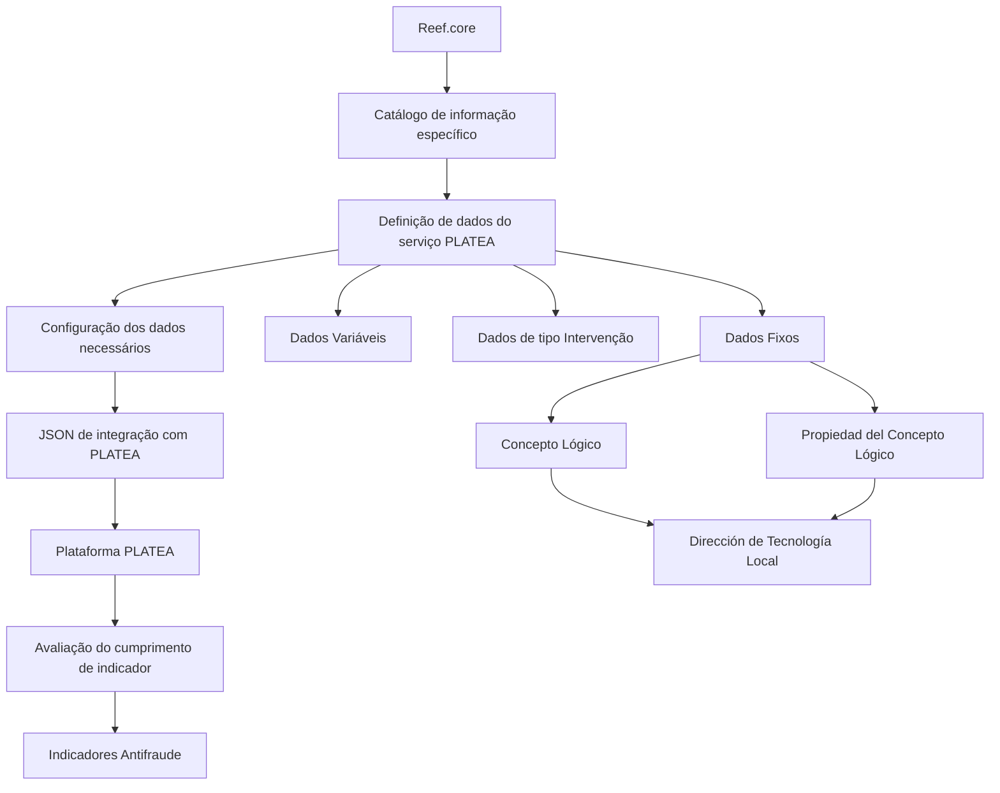

# Definição dos Dados do Serviço PLATEA — Processo de Emissão no Reef.core

## 1. Metadados do Documento
- **Arquivo de Origem:** `Não identificado no conteúdo fornecido`
- **Tipo de Documento:** `Especificação Técnica`
- **Domínio / Sistema:** `Reef.core, Plataforma PLATEA, Indicadores Antifraude`
- **Público-Alvo:** `Não explicitamente identificado; conteúdo direcionado à definição e configuração de dados técnicos`
- **Data/Versão Identificada:** `Não identificada`

---

## 2. Resumo Executivo & Contexto de Negócio

O documento define os dados do serviço PLATEA aplicáveis ao processo de emissão no sistema Reef.core. O objetivo funcional declarado é permitir que Reef.core configure, em um catálogo de informação específico, os dados necessários para integração com a Plataforma PLATEA.

A integração com PLATEA tem como finalidade avaliar o cumprimento de determinado indicador. O documento relaciona essa configuração ao contexto de Indicadores Antifraude, incluindo atributos para identificação de companhia, ramo técnico, identificadores e dados associados a intervenções.

O catálogo de definição contempla dados de naturezas distintas, incluindo dados variáveis, dados de tipo intervenção e dados fixos. Para cada natureza, o documento estabelece propriedades específicas que devem identificar a origem, o papel ou a característica do dado utilizado na integração.

O resultado de consultas configuradas pode ser classificado como detalhe ou acumulado. Resultados de detalhe retornam cada linha quando existe mais de uma linha; resultados acumulados retornam a soma quando a consulta produz várias linhas.

O documento também determina que a atribuição de valores para `Concepto Lógico` e `Propiedad del Concepto Lógico` é responsabilidade e competência da Dirección de Tecnología Local.

---

## 3. Arquitetura, Componentes & Tecnologias Envolvidas

Os componentes e contextos identificados são:

- **Reef.core:** sistema que permite configurar, em catálogo específico, dados necessários para integração.
- **Plataforma PLATEA:** plataforma integrada pelo Reef.core para avaliação do cumprimento de indicadores.
- **Catálogo de Definição:** catálogo que armazena atributos utilizados na configuração dos dados de integração.
- **Processo de Emissão:** contexto funcional da tabela de Serviços de PLATEA.
- **Indicadores Antifraude:** domínio citado para a definição de indicadores e documentos relacionados.
- **Dirección de Tecnología Local:** área responsável pela atribuição de determinados valores de dados fixos.
- **JSON de integração:** estrutura mencionada como resultado da tipologia definida para o dado no Reef.core.



**Nota de Análise:** o documento não detalha métodos HTTP, endpoints, contratos JSON, mecanismos de autenticação, tecnologias de implementação, versões, ambientes, portas ou rotas de logs da integração entre Reef.core e PLATEA.

---

## 4. Regras de Negócio, Especificações Funcionais & Processos

### Objetivo funcional

1. O Reef.core deve permitir a configuração dos dados necessários para integração com a Plataforma PLATEA.
2. A configuração deve ocorrer em um catálogo de informação específico.
3. A integração deve permitir avaliar o cumprimento de determinado indicador.

### Propriedades operativas do catálogo

1. **Compañía**
   - Contém o código da companhia sobre a qual está sendo realizada a definição dos Indicadores Antifraude.

2. **Ramo Técnico**
   - Identifica a chave do Ramo Técnico da Estrutura de Produtos da Companhia.

3. **Secuencia**
   - É um número sequencial consecutivo.

4. **Identificador**
   - Contém a chave do identificador do atributo definido em PLATEA.
   - O documento apresenta `ID-Contratante` como exemplo para identificar o dado do tomador do seguro.

5. **Continente del Dato**
   - Determina a tipologia do dado do Reef.core utilizada para compor o JSON de integração com PLATEA.
   - Os valores possíveis são aqueles configurados corporativamente.

6. **Dato Variable**
   - Aplicável quando o valor do tipo de conteúdo for um dado variável.
   - Identifica o nome do dado variável.

7. **Intervención**
   - Aplicável quando o dado for do tipo `intervención`.
   - Deve detalhar a figura associada, como Tomador, Beneficiario ou Conductor.

8. **Intervención Principal**
   - Aplicável exclusivamente quando o dado for do tipo `intervención`.
   - Indica se a intervenção é ou não a intervenção principal.

9. **Intervención Cálculo**
   - Aplicável exclusivamente quando o dado for do tipo `intervención`.
   - Indica se a intervenção é aquela pela qual são calculados os prêmios das coberturas.

10. **Concepto Lógico**
    - Aplicável quando o dado for do tipo `Dato Fijo`.
    - Detalha a procedência do conceito lógico no qual a informação reside.
    - A responsabilidade e a competência para atribuição desse valor pertencem à Dirección de Tecnología Local.

11. **Propiedad del Concepto Lógico**
    - Aplicável quando o dado for do tipo `Dato Fijo`.
    - Detalha a propriedade específica do conceito lógico no qual a informação reside.
    - A responsabilidade e a competência para atribuição desse valor pertencem à Dirección de Tecnología Local.

### Regra de resultado da consulta

| Tipo de resultado | Condição | Comportamento de saída |
| :--- | :--- | :--- |
| Detalle | A consulta retorna mais de uma linha | A saída contém cada uma das linhas retornadas. |
| Acumulado | A consulta retorna várias linhas | A saída retorna a soma dos resultados. |

### Referências funcionais recomendadas

A interpretação isolada do documento pode conduzir a erro. O documento recomenda a leitura dos seguintes materiais vinculados:

- Indicadores Antifraude.
- Ámbito Indicadores Antifraude.
- Acciones Antifraude.
- Preguntas frecuentes.

### Pergunta frequente registrada

| Pergunta | Resposta registrada |
| :--- | :--- |
| Existe alguma recomendação operativa que deva ser considerada localmente na codificação, uso e definição da tabela de Serviços de PLATEA para o Processo de Emissão no Sistema? | `N/A` |

---

## 5. Tabelas de Parâmetros, Ambientes e Estruturas de Dados

| Item / Parâmetro | Descrição / Função | Tipo / Valores / Formato | Ambiente / Observações |
| :--- | :--- | :--- | :--- |
| Compañía | Contém o código da companhia sobre a qual é realizada a definição dos Indicadores Antifraude. | Código de companhia; formato não informado. | Aplicável à definição de indicadores Antifraude. |
| Ramo Técnico | Identifica a chave do Ramo Técnico da Estrutura de Produtos da Companhia. | Chave; formato não informado. | Associado à estrutura de produtos da companhia. |
| Secuencia | Representa uma numeração sequencial consecutiva. | Número sequencial. | Não há regra adicional documentada. |
| Identificador | Contém a chave do identificador do atributo definido em PLATEA. | Chave de identificador; exemplo: `ID-Contratante`. | O exemplo identifica o dado do tomador do seguro. |
| Continente del Dato | Determina a tipologia do dado do Reef.core para compor o JSON de integração com PLATEA. | Valores configurados corporativamente. | Os valores possíveis não foram enumerados no documento. |
| Dato Variable | Identifica o nome do dado variável. | Nome de dado variável. | Aplicável quando o tipo do conteúdo for dado variável. |
| Intervención | Detalha a figura da intervenção. | Exemplos: `Tomador`, `Beneficiario`, `Conductor`. | Aplicável quando o dado for do tipo `intervención`. |
| Intervención Principal | Indica se a intervenção é a principal. | Valor booleano ou formato não informado. | Aplicável apenas a dados do tipo `intervención`. |
| Intervención Cálculo | Indica se a intervenção é utilizada para cálculo dos prêmios das coberturas. | Valor booleano ou formato não informado. | Aplicável apenas a dados do tipo `intervención`. |
| Concepto Lógico | Detalha a procedência do conceito lógico em que reside a informação. | Conceito lógico; formato não informado. | Aplicável a `Dato Fijo`; atribuição sob responsabilidade da Dirección de Tecnología Local. |
| Propiedad del Concepto Lógico | Detalha a propriedade específica do conceito lógico em que reside a informação. | Propriedade de conceito lógico; formato não informado. | Aplicável a `Dato Fijo`; atribuição sob responsabilidade da Dirección de Tecnología Local. |
| Tipo de Resultado | Determina se o resultado da consulta é detalhado ou acumulado. | `Detalle` ou `Acumulado`. | Para múltiplas linhas: detalhe retorna cada linha; acumulado retorna a soma. |

| Sistema / Elemento | Papel documentado | URLs / Ambientes / Infraestrutura |
| :--- | :--- | :--- |
| Reef.core | Configura dados em catálogo específico para integração com PLATEA. | Não informado. |
| Plataforma PLATEA | Recebe dados para avaliação do cumprimento de indicador. | Não informado. |
| Home Solutions APIs Documentation Zeus | Texto presente na extração. | Não há função, URL ou detalhamento documentado. |

---

## 6. Bateria de Perguntas & Respostas para RAG (FAQ Sintético)

### P1: Qual é o objetivo da definição de dados do serviço PLATEA no Reef.core?
**R:** O objetivo é permitir que o Reef.core configure, em um catálogo de informação específico, todos os dados necessários para integração com a Plataforma PLATEA e, assim, avaliar o cumprimento de determinado indicador.

### P2: Qual atributo identifica a companhia relacionada à definição de Indicadores Antifraude?
**R:** O atributo `Compañía` contém o código da companhia sobre a qual está sendo realizada a definição dos Indicadores Antifraude.

### P3: O que representa o atributo Ramo Técnico?
**R:** `Ramo Técnico` identifica a chave do Ramo Técnico da Estrutura de Produtos da Companhia.

### P4: Como é definido o campo Secuencia no catálogo de definição?
**R:** O atributo `Secuencia` é definido como um número sequencial consecutivo. O documento não informa formato adicional, faixa numérica ou regra de reinicialização da sequência.

### P5: Para que serve o atributo Identificador na integração com PLATEA?
**R:** `Identificador` contém a chave do identificador do atributo definido em PLATEA. O documento apresenta `ID-Contratante` como exemplo de identificador para o dado do tomador do seguro.

### P6: O que determina o campo Continente del Dato?
**R:** `Continente del Dato` determina a tipologia do dado do Reef.core utilizada para formar o JSON de integração com a Plataforma PLATEA. Os valores possíveis são configurados corporativamente, mas não são listados no documento.

### P7: Quando o atributo Dato Variable deve ser preenchido?
**R:** `Dato Variable` deve ser utilizado quando o valor do tipo do conteúdo for um dado variável. Nesse caso, o atributo identifica o nome do dado variável.

### P8: Quais propriedades são aplicáveis a dados do tipo intervención?
**R:** Para dados do tipo `intervención`, o catálogo pode detalhar a figura em `Intervención`, como Tomador, Beneficiario ou Conductor. Também pode indicar, por meio de `Intervención Principal`, se a intervenção é a principal, e por meio de `Intervención Cálculo`, se a intervenção é utilizada no cálculo dos prêmios das coberturas.

### P9: Quem é responsável pela atribuição de Concepto Lógico e Propiedad del Concepto Lógico?
**R:** A responsabilidade e a competência pela atribuição dos valores de `Concepto Lógico` e `Propiedad del Concepto Lógico` pertencem à Dirección de Tecnología Local. Ambos os atributos são aplicáveis quando o dado é do tipo `Dato Fijo`.

### P10: Como o sistema trata resultados do tipo detalle?
**R:** Quando o tipo de resultado é `detalle` e a consulta devolve mais de uma linha, a saída deve conter cada uma das linhas retornadas.

### P11: Como o sistema trata resultados do tipo acumulado?
**R:** Quando o tipo de resultado é `acumulado` e a consulta devolve várias linhas, a saída deve devolver a soma dos resultados.

### P12: Existem recomendações operativas locais documentadas para codificação, uso e definição da tabela de Serviços de PLATEA no processo de emissão?
**R:** Não. A seção de perguntas frequentes registra a resposta `N/A` para essa questão.

---

## 7. Glossário de Termos, Siglas & Conceitos-Chave

- **Reef.core:** sistema que permite configurar, em catálogo de informação específico, os dados necessários para integração com a Plataforma PLATEA.
- **PLATEA:** plataforma com a qual o Reef.core se integra para avaliar o cumprimento de determinado indicador.
- **Indicadores Antifraude:** contexto de indicadores citado nas propriedades do catálogo e nos documentos vinculados.
- **Compañía:** atributo que contém o código da companhia relacionada à definição de Indicadores Antifraude.
- **Ramo Técnico:** chave do ramo técnico da Estrutura de Produtos da Companhia.
- **Secuencia:** número sequencial consecutivo.
- **Identificador:** chave do atributo definido em PLATEA.
- **ID-Contratante:** exemplo de identificador usado para identificar o dado do tomador do seguro.
- **Continente del Dato:** propriedade que determina a tipologia de um dado do Reef.core para composição do JSON de integração.
- **Dato Variable:** dado cujo nome é identificado quando o tipo de conteúdo for variável.
- **Intervención:** tipo de dado que detalha uma figura, como Tomador, Beneficiario ou Conductor.
- **Intervención Principal:** propriedade que indica se uma intervenção é principal.
- **Intervención Cálculo:** propriedade que indica se uma intervenção é aquela usada para cálculo dos prêmios das coberturas.
- **Dato Fijo:** tipo de dado para o qual podem ser definidos `Concepto Lógico` e `Propiedad del Concepto Lógico`.
- **Concepto Lógico:** procedência do conceito lógico no qual a informação reside.
- **Propiedad del Concepto Lógico:** propriedade específica do conceito lógico em que a informação reside.
- **Dirección de Tecnología Local:** área responsável e competente para atribuir `Concepto Lógico` e `Propiedad del Concepto Lógico`.
- **Detalle:** tipo de resultado que devolve cada linha quando a consulta retorna mais de uma linha.
- **Acumulado:** tipo de resultado que devolve a soma quando a consulta retorna várias linhas.
- **JSON:** formato mencionado como estrutura de integração com PLATEA; o documento não detalha o contrato ou esquema JSON.

---

## 8. Notas Críticas, Riscos & Limitações

- O documento não informa nome do arquivo, autor, versão, data, ambiente ou ciclo de vida da especificação.
- O documento não especifica endpoints, métodos HTTP, autenticação, protocolos, schemas JSON, exemplos de payload, códigos de erro ou contratos técnicos da integração Reef.core–PLATEA.
- Os valores corporativamente configuráveis de `Continente del Dato` não são enumerados.
- O tipo técnico dos campos `Intervención Principal` e `Intervención Cálculo` não é explicitado, embora sua descrição indique comportamento de indicação condicional.
- A interpretação isolada do conteúdo pode conduzir a erro; o documento recomenda a leitura de materiais sobre Indicadores Antifraude, âmbito, ações e perguntas frequentes.
- A atribuição de `Concepto Lógico` e `Propiedad del Concepto Lógico` depende da Dirección de Tecnología Local, caracterizando dependência operacional dessa área.
- A pergunta frequente sobre recomendações operativas locais apresenta resposta `N/A`; portanto, não há orientação adicional registrada para codificação, uso ou definição da tabela de Serviços de PLATEA no Processo de Emissão.

---

## 9. Conteúdo Bruto Estruturado (Referência Fiel)

```text
--- [PÁGINA 1 DE 3] ---

DEFINICIÓN de los DATOS del SERVICIO
PLATEA PROCESO de EMISIÓN
Objetivo
Funcionalmente, Reef.core cuenta con la posibilidad de configurar en un catálogo de información
específico todos aquellos datos que son necesarios para integrarse con la Plataforma PLATEA y
poder evaluar así el cumplimiento de un determinado indicador.
Propiedades Operativas
Otras Propiedades
Propiedades Operativas
Compañía
Este Atributo del catálogo contiene el código de la compañía sobre la que se está realizando la
definición de los indicadores Antifraude.
Ramo Técnico
Esta propiedad identifica la clave del Ramo Técnico de la Estructura de Productos de la Compañía.
Secuencia
Este Atributo es un número secuencial consecutivo.
 /
 CF
Home Solutions APIs Documentation Zeus
EN


--- [PÁGINA 2 DE 3] ---

Identificador
Esta propiedad del Catálogo contiene la clave del Identificador del atributo definido en PLATEA como
por ejemplo 'ID-Contratante' para identificar el dato del Tomador del Seguro.
Continente del Dato
Esta Propiedad determina la tipología del dato de Reef.core para conformar el json de integración
con PLATEA, siendo sus posibles valores aquellos que hayan sido configurados corporativamente.
Dato Variable
Este Atributo del Catálogo de Definición, en el supuesto que el valor del tipo del contenido sea un
dato variable, identificará el nombre del Dato Variable.
Intervención
Este Atributo del Catálogo de Definición, en el supuesto que el dato sea del tipo "intervención"
detallará su figura: Tomador, Beneficiario, Conductor,...
Intervención Principal
Únicamente en el caso que el dato sea del tipo "intervención", esta propiedad indicará si la
intervención es o no la intervención principal.
Intervención Cálculo
Únicamente en el caso que el dato sea del tipo "intervención", esta propiedad indicará si la
intervención es la intervención por la cual se calculan las primas de las Coberturas.
Concepto Lógico
Este Atributo del Catálogo de Definición, en el supuesto que el dato sea del tipo "Dato Fijo" detallará
la procedencia del concepto lógico en el que reside la información.
NOTA: La Responsabilidad y competencia en la asignación de este valor es de la Dirección de
Tecnología Local.
Propiedad del Concepto Lógico
Este Atributo del Catálogo de Definición, en el supuesto que el dato sea del tipo "Dato Fijo" detallará
la propiedad del concepto lógico en el que reside específicamente la información.
NOTA: La Responsabilidad y competencia en la asignación de este valor es de la Dirección de
Tecnología Local.
Tipo de Resultado


--- [PÁGINA 3 DE 3] ---

Esta Propiedad establece si el resultado es el detalle o el acumulado de la consulta.
Si el resultado es de tipo detalle, si se devuelve más de una fila, la salida serán cada una de las
filas.
Si el tipo de resultado es acumulado, en caso de devolver varias filas, se devuelve la suma
Vínculos
Relación de Directrices y Documentos funcionales cuya lectura recomendada para evitar que la
interpretación aislada del presente documento pueda conducir a error.
Indicadores Antifraude
Ámbito Indicadores Antifraude
Acciones Antifraude
Preguntas frecuentes
(1) ¿Existe alguna recomendación operativa que deba ser tomada en consideración localmente en la
codificación, uso y definición de la tabla de Servicios de PLATEA para el Proceso de Emisión en el
Sistema?
N/A
```
