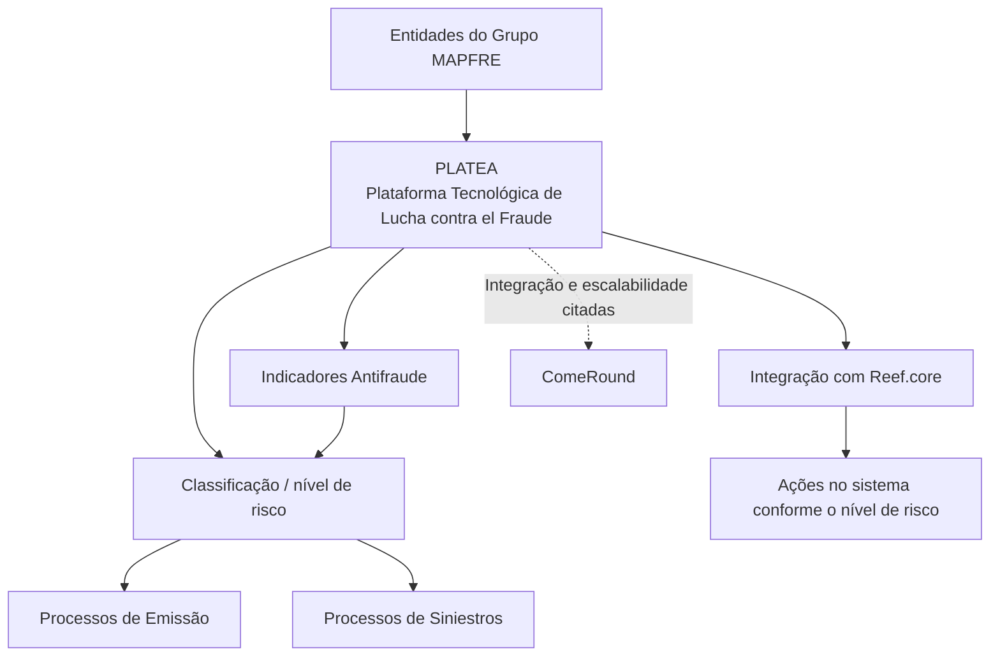
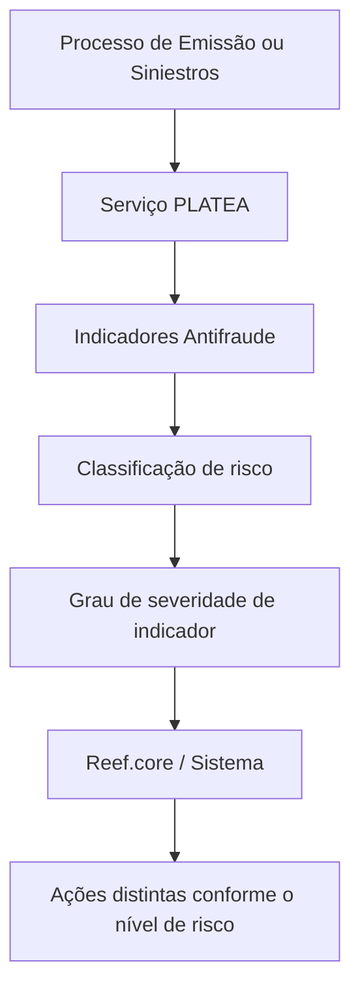

# PLATEA — Definição de Seleção Digital de Risco e Integração com Reef.core

## 1. Metadados do Documento
- **Arquivo de Origem:** Não identificado no conteúdo fornecido
- **Tipo de Documento:** Apresentação Executiva
- **Domínio / Sistema:** PLATEA, Grupo MAPFRE, Reef.core, emissão digital, fraude
- **Público-Alvo:** Desenvolvedores, Arquitetos, Operação, Negócio
- **Data/Versão Identificada:** Não identificada

---

## 2. Resumo Executivo & Contexto de Negócio

PLATEA é apresentada como a materialização da Plataforma Tecnológica de Lucha contra el Fraude, desenvolvida internamente para as entidades do Grupo MAPFRE. A plataforma tem como objetivo fornecer tecnologias avançadas para uma gestão integral, eficaz e eficiente de fraude em diferentes processos de negócio.

O escopo funcional de PLATEA abrange prevenção, detecção precoce, investigação, medição e controle das operações relacionadas a fraude. O documento informa que a plataforma pode ser aplicada a diferentes canais, ramos e momentos dos processos de cotação e contratação.

No contexto de emissão digital, PLATEA busca sofisticar os critérios de subscrição. Essa sofisticação permite orientar decisões de negócio para crescimento rentável, utilizando a classificação de risco e a severidade dos indicadores retornados pela plataforma.

O objetivo técnico declarado é integrar Reef.core e PLATEA. A integração deve permitir que o sistema execute ações distintas conforme o nível de risco retornado por PLATEA durante os processos de Emissão e Siniestros.

PLATEA também é associada ao aproveitamento do conhecimento e das informações de cada entidade do Grupo MAPFRE, à redução do risco reputacional e ao uso de mecanismos sofisticados de detecção de fraude baseados em anomalias e modelos preditivos.

---

## 3. Arquitetura, Componentes & Tecnologias Envolvidas

| Componente / Tecnologia | Papel identificado no documento |
| :--- | :--- |
| **PLATEA** | Plataforma Tecnológica de Lucha contra el Fraude para gestão integral de fraude. |
| **Reef.core** | Sistema a ser integrado com PLATEA para executar ações conforme o nível de risco retornado. |
| **Grupo MAPFRE** | Grupo corporativo cujas entidades utilizam PLATEA. |
| **ComeRound** | Plataforma corporativa citada como exemplo de possível integração e escalabilidade. |
| **Processo de Emissão** | Processo no qual o serviço PLATEA deve atuar. |
| **Siniestros** | Processo citado como consumidor da classificação de risco de PLATEA. |
| **Indicadores Antifraude** | Indicadores cuja severidade compõe a classificação de risco retornada por PLATEA. |
| **Ações Antifraude** | Ações configuráveis a serem executadas pelo sistema conforme o risco. |
| **Catálogos de Configuração de PLATEA** | Elementos de configuração mencionados sem detalhamento de campos, valores ou estrutura. |
| **Parâmetros Ramos Técnicos relacionados com PLATEA** | Parâmetros relacionados a ramos técnicos; o documento não apresenta nomes, tipos ou valores. |



**Nota de Análise:** O documento cita PLATEA, Reef.core, ComeRound, processos de Emissão e Siniestros, mas não detalha protocolos, métodos HTTP, contratos JSON, infraestrutura, bancos de dados, topologia de rede ou mecanismos de autenticação.

---

## 4. Regras de Negócio, Especificações Funcionais & Processos

### 4.1 Objetivo da integração Reef.core e PLATEA

A integração entre Reef.core e PLATEA tem o objetivo de permitir diferentes ações no sistema de acordo com o nível de risco retornado por PLATEA.

O nível de risco é definido no documento como uma **classificação com a qual PLATEA determina o grau de severidade de um indicador**. Essa classificação deve ser utilizada nos processos de:

1. **Emissão**
2. **Siniestros**

### 4.2 Capacidades de gestão de fraude atribuídas a PLATEA

PLATEA é descrita como uma plataforma capaz de apoiar:

1. **Prevenção de fraude**
2. **Detecção precoce de fraude**
3. **Investigação de fraude**
4. **Medição de operações**
5. **Controle de operações**
6. **Compreensão do fraude em cada mercado**
7. **Compreensão do comportamento de perfis fraudulentos**
8. **Aplicação em diferentes canais**
9. **Aplicação em diferentes ramos**
10. **Aplicação em diferentes momentos do processo de cotação e contratação**
11. **Integração com outras plataformas corporativas**
12. **Escalabilidade com outras plataformas corporativas**
13. **Aproveitamento do conhecimento e da informação de cada entidade do Grupo MAPFRE**
14. **Redução de risco reputacional**
15. **Uso de mecanismos baseados em anomalias**
16. **Uso de modelos preditivos**

### 4.3 Fluxo funcional inferido estritamente do documento



**Nota de Análise:** O documento não informa quais ações antifraude existem, quais níveis de risco são possíveis, quais limiares determinam cada ação, nem quais indicadores antifraude são avaliados.

### 4.4 Itens de configuração citados

O documento lista os seguintes temas de configuração relacionados a PLATEA:

- Configuração de Produtos e Processos
- Parâmetros de Ramos Técnicos relacionados com PLATEA
- Catálogos de Configuração de PLATEA
- Indicadores Antifraude
- Âmbito dos Indicadores Antifraude
- Ações Antifraude
- Serviço PLATEA no Processo de Emissão

**Nota de Análise:** Não foram fornecidos detalhes adicionais sobre a estrutura, governança, campos, valores permitidos ou responsáveis por esses itens de configuração.

---

## 5. Tabelas de Parâmetros, Ambientes e Estruturas de Dados

| Item / Parâmetro | Descrição / Função | Tipo / Valores / Formato | Ambiente / Observações |
| :--- | :--- | :--- | :--- |
| Configuração de Produtos e Processos | Tema de configuração mencionado para PLATEA. | Não detalhado. | Não há ambientes identificados. |
| Parâmetros de Ramos Técnicos relacionados com PLATEA | Parâmetros associados a ramos técnicos. | Não detalhado. | Não há nomes, valores ou formatos apresentados. |
| Catálogos de Configuração de PLATEA | Catálogos de configuração relacionados a PLATEA. | Não detalhado. | Estrutura não apresentada. |
| Indicadores Antifraude | Indicadores usados na avaliação de risco e severidade. | Não detalhado. | O documento não lista indicadores específicos. |
| Âmbito dos Indicadores Antifraude | Escopo de aplicação dos indicadores antifraude. | Não detalhado. | Regras de escopo não apresentadas. |
| Ações Antifraude | Ações que o sistema pode executar conforme o nível de risco. | Não detalhado. | Não há matriz risco-versus-ação. |
| Serviço PLATEA no Processo de Emissão | Serviço PLATEA aplicado ao processo de Emissão. | Não detalhado. | Não há URL, método, contrato ou protocolo. |
| Nível de risco | Classificação retornada por PLATEA para determinar ações no sistema. | Não detalhado. | Aplicável aos processos de Emissão e Siniestros. |
| Grau de severidade | Severidade de um indicador determinada pela classificação de PLATEA. | Não detalhado. | Critérios de cálculo não apresentados. |
| ComeRound | Exemplo de plataforma corporativa para integração e escalabilidade. | Não aplicável. | Não há detalhes técnicos de integração. |

---

## 6. Bateria de Perguntas & Respostas para RAG (FAQ Sintético)

### P1: O que é PLATEA no contexto do Grupo MAPFRE?
**R:** PLATEA é a materialização da Plataforma Tecnológica de Lucha contra el Fraude desenvolvida internamente para as entidades do Grupo MAPFRE. A plataforma busca fornecer tecnologias avançadas para gestão integral, eficaz e eficiente de fraude em diferentes processos de negócio.

### P2: Qual é o objetivo central da integração entre Reef.core e PLATEA?
**R:** O objetivo é integrar Reef.core e PLATEA para que o sistema execute diferentes ações de acordo com o nível de risco retornado por PLATEA nos processos de Emissão e Siniestros.

### P3: Como o documento define o nível de risco retornado por PLATEA?
**R:** O nível de risco é definido como a classificação pela qual PLATEA determina o grau de severidade de um indicador.

### P4: Quais processos são explicitamente citados como consumidores da classificação de risco de PLATEA?
**R:** O documento cita os processos de Emissão e Siniestros como os processos nos quais diferentes ações devem ocorrer dependendo do nível de risco retornado por PLATEA.

### P5: Quais capacidades de fraude PLATEA oferece além da detecção?
**R:** Além da prevenção e detecção precoce de fraude, PLATEA oferece capacidades de investigação, medição e controle das operações. O documento também associa PLATEA à compreensão do fraude por mercado e ao entendimento do comportamento de perfis fraudulentos.

### P6: Como PLATEA contribui para a emissão digital?
**R:** PLATEA melhora e facilita a subscrição na emissão digital ao sofisticar os critérios de subscrição do negócio digital. Segundo o documento, esse aprimoramento permite orientar decisões de negócio para crescimento rentável.

### P7: Que mecanismos de detecção de fraude são mencionados para PLATEA?
**R:** O documento menciona mecanismos sofisticados de detecção de fraude baseados em anomalias e modelos preditivos. Não há detalhamento dos algoritmos, modelos, fontes de dados ou critérios de decisão utilizados.

### P8: Em quais contextos de negócio PLATEA pode ser aplicada?
**R:** PLATEA pode ser aplicada a diferentes canais, ramos e momentos do processo de cotação e contratação.

### P9: Que itens de configuração PLATEA são citados no documento?
**R:** São citados Configuração de Produtos e Processos, Parâmetros de Ramos Técnicos relacionados com PLATEA, Catálogos de Configuração de PLATEA, Indicadores Antifraude, Âmbito dos Indicadores Antifraude, Ações Antifraude e o Serviço PLATEA no Processo de Emissão.

### P10: O documento especifica quais ações antifraude são executadas para cada nível de risco?
**R:** Não. O documento afirma que diferentes ações devem ser realizadas conforme o nível de risco retornado por PLATEA, mas não apresenta uma matriz de ações, níveis de risco, limiares ou regras de decisão.

### P11: ComeRound faz parte da arquitetura obrigatória da integração Reef.core e PLATEA?
**R:** Não é possível afirmar isso. ComeRound é citado apenas como exemplo de outra plataforma corporativa com a qual PLATEA pode permitir integração e escalabilidade.

### P12: O documento informa APIs, URLs ou contratos de integração para o serviço PLATEA?
**R:** Não. O conteúdo menciona o Serviço PLATEA no Processo de Emissão, porém não informa URLs, protocolos, métodos HTTP, payloads, contratos JSON, autenticação ou tratamento de erros.

---

## 7. Glossário de Termos, Siglas & Conceitos-Chave

- **PLATEA:** Plataforma Tecnológica de Lucha contra el Fraude desenvolvida internamente para as entidades do Grupo MAPFRE.
- **Reef.core:** Sistema citado como alvo de integração com PLATEA para executar ações conforme o risco.
- **Grupo MAPFRE:** Grupo corporativo cujas entidades são destinatárias da plataforma PLATEA.
- **Fraude:** Domínio de negócio atendido por PLATEA por meio de prevenção, detecção, investigação, medição e controle.
- **Indicadores Antifraude:** Indicadores associados à classificação de risco e ao grau de severidade determinado por PLATEA.
- **Nível de risco:** Classificação retornada por PLATEA que determina ações no sistema.
- **Grau de severidade:** Grau atribuído a um indicador pela classificação de risco de PLATEA.
- **Emissão:** Processo citado como destinatário do serviço PLATEA e da classificação de risco.
- **Siniestros:** Processo citado como destinatário da classificação de risco de PLATEA.
- **Cotação e contratação:** Processo de negócio em cujos diferentes momentos PLATEA pode ser aplicada.
- **Subscrição:** Critérios de negócio sofisticados por PLATEA no contexto de emissão digital.
- **Ramos:** Domínios ou ramos de aplicação da plataforma, sem detalhamento adicional no documento.
- **Canais:** Canais nos quais PLATEA pode ser aplicada, sem detalhamento adicional no documento.
- **ComeRound:** Plataforma corporativa citada como exemplo de integração e escalabilidade.
- **Modelos preditivos:** Mecanismos mencionados para detecção sofisticada de fraude, sem especificação técnica.
- **Anomalias:** Base mencionada para mecanismos sofisticados de detecção de fraude, sem especificação técnica.

---

## 8. Notas Críticas, Riscos & Limitações

- O documento não identifica arquivo de origem, autor, data, versão, responsável técnico ou responsável de negócio.
- Não há definição dos níveis de risco, critérios de classificação, limiares, pesos ou algoritmo que PLATEA utiliza para determinar severidade.
- Não existe matriz que associe níveis de risco a ações antifraude específicas em Reef.core.
- Não são detalhados os Indicadores Antifraude, o âmbito dos indicadores, os catálogos de configuração ou os parâmetros de Ramos Técnicos.
- O serviço PLATEA no Processo de Emissão é citado, mas não possui especificação de API, URL, contrato, protocolo, segurança, autenticação, timeout, disponibilidade ou tratamento de falhas.
- ComeRound é mencionado somente como exemplo de integração e escalabilidade; a natureza da integração não é descrita.
- O documento declara uso de anomalias e modelos preditivos, mas não especifica dados de entrada, governança, explicabilidade, monitoramento, métricas de qualidade ou ciclo de vida dos modelos.
- A apresentação não detalha implicações operacionais, processos de investigação, responsabilidades entre equipes, SLAs ou procedimentos de contingência.

---

## 9. Conteúdo Bruto Estruturado (Referência Fiel)

```text
--- [PÁGINA 1 DE 2] ---

DEFINICIÓN SELECCIÓN DIGITAL del RIESGO
(PLATEA)
Contexto
PLATEA es la materialización de la Plataforma Tecnológica de Lucha contra el Fraude desarrollada
internamente por y para las entidades del Grupo MAPFRE.
Su principal objetivo es el de dotar a las entidades del grupo MAPFRE de tecnologías avanzadas con
las que realizar una gestión integral, eficaz y eficiente del fraude en diferentes procesos de negocio,
incluyendo no solo la prevención y detección temprana, sino también capacidades de investigación,
medición y control de las operaciones.
E+n este documento veremos qué es PLATEA, sus principales características, su escalabilidad y
profundizaremos en cómo PLATEA mejora y facilita la suscripción en la emisión digital al sofisticar los
criterios de suscripción en la emisión de negocio digital, lo que permite orientar las decisiones de
negocio hacia un crecimiento rentable.
PLATEA permite mejorar competencias como:
Comprensión del fraude: Entender y conocer el fraude en cada mercado y comprender el
comportamiento de los perfiles fraudulentos.
Gestión integral del fraude: PLATEA es aplicable a diferentes Canales, Ramos y distintos
momentos del Proceso de cotización y contratación.
Desarrollo interno: Permitir la Integración y la Escalabilidad con otras plataformas corporativas
(por ejemplo, ComeRound).
 / 
 CF
Home Solutions APIs Documentation Zeus
EN


--- [PÁGINA 2 DE 2] ---

Gestión a medida: Aprovechar el conocimiento e información de cada entidad del GRUPO
MAPFRE y reducir el riesgo reputacional.
Mecanismos sofisticados de detección de fraude: Utilizar mecanismos basados en anomalías y
modelos predictivos.
Objetivo
Integrar Reef.core y PLATEA para poder realizar distintas acciones en el Sistema dependiendo del
nivel de riesgo (Clasificación con la que PLATEA determina el grado de severidad de un indicador)
devuelto por PLATEA en los procesos de Emisión y Siniestros.
Configuración Productos y Procesos
Parámetros Ramos Técnicos relacionados con PLATEA
Catálogos de Configuración de PLATEA
Indicadores Antifraude
Ámbito Indicadores Antifraude
Acciones Antifraude
Servicio PLATEA en Proceso de Emisión
```
