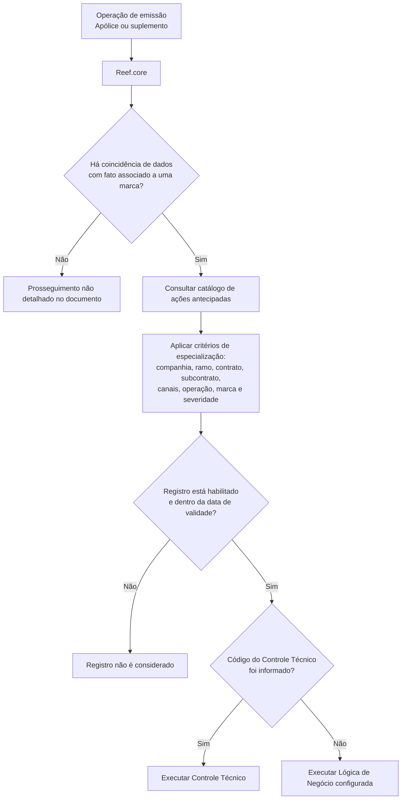

# Catálogo de Ações Antecipadas de Marcas no Reef.core

## 1. Metadados do Documento
- **Arquivo de Origem:** Não identificado no conteúdo fornecido
- **Tipo de Documento:** Especificação Técnica / Procedimento Funcional
- **Domínio / Sistema:** Reef.core — módulo de emissão e tratamento de marcas
- **Público-Alvo:** Desenvolvedores, Arquitetos, Operação e Analistas Funcionais
- **Data/Versão Identificada:** Não identificada

---

## 2. Resumo Executivo & Contexto de Negócio

O documento descreve a configuração de **ações antecipadas associadas a marcas** no sistema **Reef.core**. O objetivo da configuração é determinar quais ações devem ser executadas durante operações funcionais do módulo de emissão, considerando um ramo técnico específico, uma marca e a severidade ou gravidade associada a essa marca.

O tratamento antecipado permite que o Reef.core identifique, durante a emissão de uma apólice ou suplemento, coincidências entre dados informados na operação atual e fatos previamente associados a uma marca. O exemplo apresentado é a identificação de um terceiro, durante a emissão de uma nova apólice, que possua um resultado positivo prévio de alcoolemia.

A configuração pode ser especializada por múltiplas dimensões: companhia, ramo técnico, contrato, subcontrato, níveis da estrutura de canais, operação funcional, marca e severidade. A combinação desses atributos permite definir ações específicas para determinados contextos contratuais, comerciais ou operacionais, em contraposição a regras aplicáveis genericamente.

A única tipologia de ação explicitamente implementada no documento é a execução de **controles técnicos**. A execução pode ocorrer por meio de um código de controle técnico definido; quando esse código não é informado, a configuração pode indicar o nome de uma lógica de negócio alternativa a ser executada.

O catálogo também possui mecanismos de governança temporal e operacional. A propriedade de inabilitação desativa um registro para que ele não seja considerado nos processos da entidade seguradora. A data de validade determina a partir de quando o registro passa a operar, permitindo manter histórico das alterações realizadas nas definições.

---

## 3. Arquitetura, Componentes & Tecnologias Envolvidas

| Componente / Conceito | Papel identificado no documento |
| :--- | :--- |
| **Reef.core** | Sistema que executa o tratamento antecipado de marcas durante operações de emissão. |
| **Módulo de emissão** | Contexto funcional no qual a apólice ou suplemento é processado e no qual podem ser identificadas coincidências com marcas previamente associadas. |
| **Catálogo de marcas** | Catálogo que contém atributos de configuração, incluindo companhia, marca e parâmetros associados à ação antecipada. |
| **Catálogo de ações a realizar** | Configuração que determina severidade/gravidada da marca, tipo de ação, controle técnico ou lógica de negócio. |
| **Operação Funcional** | Operação identificada por código, usada para especializar as ações a executar. |
| **Controle Técnico** | Única tipologia de ação explicitamente implementada; pode ser executada a partir de uma chave configurada. |
| **Lógica de Negócio** | Nome de lógica executada quando não for informada a chave do controle técnico. |
| **Estrutura de canais** | Estrutura organizada em clientes distribuidores, agrupações e fontes de produção. |



**Nota de Análise:** O documento não especifica tecnologias de implementação, métodos HTTP, contratos JSON, banco de dados, interfaces, URLs, servidores, mecanismos de persistência ou detalhes internos de execução do Reef.core.

---

## 4. Regras de Negócio, Especificações Funcionais & Processos

### 4.1 Objetivo da configuração

A configuração define quais ações devem ser executadas nas operações funcionais do módulo de emissão para uma combinação particular de:

- Ramo técnico;
- Tipologia e severidade da marca;
- Companhia;
- Contrato;
- Subcontrato;
- Níveis da estrutura de canais;
- Operação funcional;
- Marca;
- Controle técnico ou lógica de negócio.

O Reef.core pode atuar antecipadamente quando uma operação de emissão de apólice ou suplemento encontrar coincidências entre os dados da operação e fatos previamente associados a uma marca.

### 4.2 Especialização por ramo técnico

O atributo **Ramo Técnico** define o código do ramo técnico habilitado para que suas operações contemplem ações a realizar.

A participação do ramo técnico no processo de tratamento de marcas depende de que a configuração dos parâmetros do ramo tenha determinado previamente que esse ramo entrará no processo de tratamento de marcas.

O Reef.core permite a utilização do ramo técnico genérico de código **999**. As combinações entre ramo técnico genérico, ramo técnico específico e demais atributos permitem configurar ações diferentes para um ou mais contratos em particular em relação aos demais contratos configurados.

### 4.3 Especialização por contrato e subcontrato

O atributo **Contrato** identifica o código de um contrato e permite especializar as ações para um contrato específico em relação a outros contratos. O Reef.core permite utilizar o contrato genérico de código **99999**.

O atributo **Subcontrato** identifica a chave de um subcontrato e permite especializar ações para um subcontrato específico em relação a outros subcontratos associados ao mesmo contrato.

Para essa propriedade, o documento declara que o Reef.core permite o uso de um valor genérico de código **99999**, referido no texto como “sector genérico”. A combinação com o valor do contrato permite configurar ações diferentes para um ou vários subcontratos em particular em comparação com os demais subcontratos configurados.

### 4.4 Especialização por estrutura de canais

A estrutura de canais possui três níveis de especialização:

1. **Primeiro Nível da Estrutura de Canais:** identifica clientes distribuidores.
2. **Segundo Nível da Estrutura de Canais:** identifica agrupações.
3. **Terceiro Nível da Estrutura de Canais:** identifica fontes de produção.

Para cada um dos três níveis, o documento informa o uso de código genérico **9999**. O texto se refere a esse valor como “Contrato genérico”, embora o atributo esteja associado à estrutura de canais.

As combinações entre os níveis de canal e os demais atributos permitem aplicar ações distintas a:

- Um cliente distribuidor específico, em comparação aos demais clientes distribuidores;
- Uma agrupação específica, em comparação às demais agrupações;
- Uma fonte de produção específica, em comparação às demais fontes de produção configuradas.

### 4.5 Operação, marca e severidade

O atributo **Operação** contém o código identificador da operação funcional e permite especializar a ação para uma operação em particular em relação a outras operações.

O atributo **Marca** identifica a marca sobre a qual a ação antecipada será executada.

O atributo **Severidad/Gravedad** determina o tipo de severidade ou gravidade da marca na parametrização do catálogo de ações a realizar.

### 4.6 Tipo de ação, controle técnico e lógica de negócio

A propriedade **Tipo de ação a realizar** define o tipo de ação que será executada.

O documento estabelece que, no momento descrito, a única tipologia implementada é a ação que possibilita a execução de **controles técnicos**.

A propriedade **Código del Control Técnico** define a chave do controle técnico que deve ser executado.

Quando a chave do controle técnico não for informada, a propriedade **Lógica de Negocio** permite determinar o nome da lógica de negócio que será executada em substituição.

### 4.7 Inabilitação e validade temporal

A propriedade **Inhabilitación** define que um registro do catálogo está desativado ou inabilitado e, portanto, não deve ser considerado nos processos da entidade seguradora.

A propriedade **Fecha de Validez** define a data a partir da qual o registro fica operacional no sistema. O uso correto dessa propriedade permite manter um histórico das alterações realizadas nas definições ao longo do tempo.

### 4.8 Documentos relacionados

O documento recomenda a leitura dos seguintes materiais para evitar interpretação isolada:

- Definición de Marcas;
- Controles Técnicos.

---

## 5. Tabelas de Parâmetros, Ambientes e Estruturas de Dados

| Item / Parâmetro | Descrição / Função | Tipo / Valores / Formato | Ambiente / Observações |
| :--- | :--- | :--- | :--- |
| Companhia | Código da companhia sobre a qual a configuração da ação é realizada. | Código não detalhado. | Pertence aos dados identificativos do catálogo de marcas. |
| Ramo Técnico | Código do ramo técnico cujas operações podem contemplar ações. | Código genérico permitido: `999`. | O ramo deve estar configurado para participar do processo de tratamento de marcas. |
| Contrato | Código que identifica um contrato e permite especializar ações. | Código genérico permitido: `99999`. | Pode ser combinado com outros atributos para diferenciar contratos específicos. |
| Subcontrato | Chave que identifica um subcontrato associado a um contrato. | Código genérico permitido: `99999`, referido no texto como “sector genérico”. | A especialização considera também o valor do contrato. |
| Primeiro Nível da Estrutura de Canais | Chave do primeiro nível de canais: clientes distribuidores. | Código genérico permitido: `9999`. | O documento o denomina “Contrato genérico”. |
| Segundo Nível da Estrutura de Canais | Chave do segundo nível de canais: agrupações. | Código genérico permitido: `9999`. | O documento o denomina “Contrato genérico”. |
| Terceiro Nível da Estrutura de Canais | Chave do terceiro nível de canais: fontes de produção. | Código genérico permitido: `9999`. | O documento o denomina “Contrato genérico”. |
| Operação | Código identificador da operação funcional. | Código não detalhado. | Permite especializar ações por operação. |
| Marca | Marca sobre a qual será executada a ação antecipada. | Identificador não detalhado. | Propriedade do catálogo de marcas. |
| Severidade / Gravidade | Tipo de severidade ou gravidade da marca. | Valores não detalhados. | Determinada na parametrização do catálogo de ações. |
| Tipo de ação a realizar | Define o tipo de ação a ser executada. | Tipologia implementada: execução de controles técnicos. | Nenhuma outra tipologia é descrita. |
| Código do Controle Técnico | Chave do controle técnico a executar. | Chave não detalhada. | Quando ausente, pode ser usada a lógica de negócio. |
| Lógica de Negócio | Nome da lógica de negócio a executar na ausência do código do controle técnico. | Nome não detalhado. | Alternativa ao controle técnico configurado. |
| Inabilitação | Indica que o registro está desativado. | Estado lógico não detalhado. | Registro inabilitado não é considerado nos processos da entidade seguradora. |
| Data de Validade | Define a data a partir da qual o registro torna-se operacional. | Data; formato não detalhado. | Permite histórico de alterações nas definições. |
| Ambiente | Ambientes técnicos do sistema. | Não informado. | O documento não apresenta URLs, servidores, portas ou nomes de ambientes. |

---

## 6. Bateria de Perguntas & Respostas para RAG (FAQ Sintético)

### P1: Qual é o objetivo do catálogo de ações antecipadas de marcas no Reef.core?
**R:** O catálogo determina quais ações devem ser executadas nas operações funcionais do módulo de emissão para uma combinação de ramo técnico, marca, severidade ou gravidade e outros critérios de especialização, como contrato, subcontrato, canais e operação funcional.

### P2: Em que situação o Reef.core pode executar uma ação antecipada associada a uma marca?
**R:** O Reef.core pode atuar antecipadamente durante uma operação de emissão de apólice ou suplemento quando identifica coincidências entre dados da operação em andamento e fatos previamente associados a uma marca.

### P3: Qual exemplo de coincidência com marca é apresentado no documento?
**R:** O documento exemplifica a identificação, durante a emissão de uma apólice de nova produção, de um terceiro para o qual foi detectado previamente um positivo de alcoolemia.

### P4: Qual código genérico pode ser utilizado para o ramo técnico?
**R:** O Reef.core permite utilizar o código genérico `999` para o atributo Ramo Técnico. O ramo técnico precisa estar configurado para entrar no processo de tratamento de marcas.

### P5: Como uma ação pode ser especializada para um contrato específico?
**R:** A especialização é realizada pelo atributo Contrato, que identifica o código do contrato. O Reef.core também aceita o código genérico `99999`, permitindo combinar configurações genéricas e específicas para diferenciar contratos.

### P6: Qual é o código genérico aceito para subcontrato?
**R:** O documento informa que o Reef.core permite o código `99999` para a propriedade Subcontrato, referido no texto como “sector genérico”. Essa configuração pode ser combinada com o valor do contrato para diferenciar subcontratos específicos.

### P7: Quais níveis da estrutura de canais podem influenciar a ação antecipada?
**R:** A configuração pode considerar três níveis: primeiro nível, correspondente a clientes distribuidores; segundo nível, correspondente a agrupações; e terceiro nível, correspondente a fontes de produção. Para cada nível, o documento informa o código genérico `9999`.

### P8: Qual tipo de ação está implementado no catálogo?
**R:** A única tipologia explicitamente descrita como implementada é a ação que possibilita a execução de controles técnicos.

### P9: O que ocorre se o Código do Controle Técnico não for informado?
**R:** Quando a chave do controle técnico não é indicada, a propriedade Lógica de Negócio pode determinar o nome da lógica de negócio a ser executada em seu lugar.

### P10: O que significa inabilitar um registro do catálogo?
**R:** A inabilitação estabelece que o registro do catálogo está desativado ou inabilitado para ser considerado nos processos da entidade seguradora.

### P11: Para que serve a Data de Validade na configuração?
**R:** A Data de Validade informa a partir de qual data o registro se torna operacional no sistema. O documento afirma que o uso correto desse atributo permite manter histórico das mudanças efetuadas nas definições.

### P12: Quais documentos relacionados devem ser consultados para interpretação correta?
**R:** O documento recomenda consultar “Definición de Marcas” e “Controles Técnicos”, pois a leitura isolada da presente especificação pode conduzir a interpretações incorretas.

---

## 7. Glossário de Termos, Siglas & Conceitos-Chave

- **Reef.core:** Sistema mencionado como responsável por atuar antecipadamente durante operações de emissão quando identifica coincidências relacionadas a marcas.
- **Marca:** Elemento do catálogo sobre o qual será executada uma ação antecipada.
- **Ação antecipada:** Ação determinada para ser executada durante uma operação de emissão quando existem coincidências de dados com fatos associados previamente a uma marca.
- **Ramo Técnico:** Código do ramo habilitado para que suas operações participem do processo de tratamento de marcas.
- **Contrato:** Código que permite especializar as ações a realizar para um contrato específico.
- **Subcontrato:** Chave que permite especializar ações para um subcontrato específico associado a um contrato.
- **Estrutura de Canais:** Estrutura composta por clientes distribuidores, agrupações e fontes de produção.
- **Clientes Distribuidores:** Primeiro nível da estrutura de canais.
- **Agrupações:** Segundo nível da estrutura de canais.
- **Fontes de Produção:** Terceiro nível da estrutura de canais.
- **Operação Funcional:** Operação identificada por código e usada para especializar ações.
- **Severidade / Gravidade:** Classificação da marca usada na parametrização das ações.
- **Controle Técnico:** Tipo de ação implementado para execução conforme uma chave configurada.
- **Lógica de Negócio:** Nome de lógica executada quando não há código de controle técnico informado.
- **Inabilitação:** Estado que desativa um registro do catálogo para que ele não seja considerado nos processos.
- **Data de Validade:** Data a partir da qual um registro torna-se operacional.

---

## 8. Notas Críticas, Riscos & Limitações

- O documento não detalha métodos de integração, APIs, serviços, contratos de dados, formatos de payload, persistência ou tecnologias utilizadas pelo Reef.core.
- Não há detalhamento dos códigos válidos para companhia, operação, marca, severidade, controles técnicos ou lógicas de negócio.
- O documento não informa como o sistema resolve conflitos entre registros genéricos e específicos, nem estabelece precedência explícita entre ramo, contrato, subcontrato e níveis de canais.
- A única tipologia de ação explicitamente implementada é a execução de controles técnicos. Não há descrição de outras ações possíveis.
- O texto utiliza a expressão “Contrato genérico” para os três níveis da estrutura de canais e “sector genérico” para Subcontrato; essas nomenclaturas são preservadas por fidelidade ao conteúdo, mas podem demandar validação funcional.
- A seção de perguntas frequentes declara que não existe circunstância operativa adicional a considerar: `N/A`.
- A interpretação isolada pode gerar erro; o próprio documento recomenda leitura complementar de “Definición de Marcas” e “Controles Técnicos”.

---

## 9. Conteúdo Bruto Estruturado (Referência Fiel)

```text
--- [PÁGINA 1 DE 5] ---

DEFINIR ACCIONES Anticipadas de las
MARCAS
Objetivo
En el tratamiento de las marcas es necesario determinar qué acciones se quieren ejecutar en las
operaciones funcionales del módulo de emisión para un Ramo Técnico y para una tipología y
severidad de la marca en particular.
De esta manera Reef.core puede actuar de manera anticipada en el caso de estar realizando una
operación de emisión sobre una póliza o suplemento en los que existan coincidencias de datos con
hechos asociados previamente para una marca, e.g: El que se identifique un Tercero en la emisión
de una póliza de nueva producción al que se le haya detectado un positivo por alcoholemia.
Datos Identificativos
Otras Propiedades
Datos Identificativos
Compañía
Este Atributo del catálogo de marcas contiene el código de la compañía sobre la que se está
realizando la configuración de la acción a realizar.
Ramo Técnico
 / 
 CF
Home Solutions APIs Documentation Zeus
EN


--- [PÁGINA 2 DE 5] ---

Este Atributo del catálogo determina el código del Ramo Técnico que se habilita para que sobre sus
operaciones se contemplen las acciones a realizar.
Siempre y cuando se haya determinado en la configuración de los parámetros del Ramo el que
éste vaya a entrar en el proceso de tratamiento de marcas.
Reef.core permite el uso del ramo técnico genérico (código 999) en la configuración de este
atributo.
De esta manera y realizando las combinaciones adecuadas, se pueden ejecutar acciones
diferentes para uno o varios contratos en particular frente a todos los demás contratos
configurados.
Contrato
Esta propiedad identifica el código de un Contrato, código que permite a Reef.core 'especializar' las
acciones a realizar para un contrato en particular respecto a otros.
Reef.core permite el uso del Contrato genérico (código 99999) en la configuración de este
atributo.
De esta manera y realizando las combinaciones adecuadas, se pueden ejecutar acciones
diferentes para uno o varios contratos en particular frente a todos los demás contratos
configurados.
Subcontrato
Esta propiedad identifica la clave de un Subcontrato, código que permite a Reef.core 'especializar' las
acciones a realizar para un sub contrato en particular respecto a otros sub contratos asociados al
mismo contrato.
Consejo:
Consejo:


--- [PÁGINA 3 DE 5] ---

Reef.core permite el uso del sector genérico (código 99999) en la configuración de esta
propiedad.
De esta manera y realizando las combinaciones adecuadas, se pueden ejecutar acciones
diferentes para uno o varios sub contratos en particular frente a todos los demás sub contratos
configurados (contemplando además el valor del Contrato)
Primer Nivel de la Estructura de Canales
Este atributo identifica la clave que identificará al Primer Nivel de la estructura de canales (Clientes
Distribuidores) en el Sistema, clave que permite 'especializar' las acciones a realizar de acuerdo con
el nivel de la estructura.
Reef.core permite el uso del Contrato genérico (código 9999) en la configuración de este atributo.
De esta manera y realizando las combinaciones adecuadas, se pueden ejecutar acciones
diferentes para un cliente distribuidor de la estructura de canales en particular frente al resto de
clientes distribuidores.
Segundo Nivel de la Estructura de Canales
Este atributo identifica la clave que identificará al Segundo Nivel de la estructura de canales
(Agrupaciones) en el Sistema, clave que permite 'especializar' las acciones a realizar de acuerdo con
el nivel de la estructura.
Reef.core permite el uso del Contrato genérico (código 9999) en la configuración de esta
propiedad.
De esta manera y realizando las combinaciones adecuadas, se pueden ejecutar acciones
diferentes para una agrupación de la estructura de canales en particular frente al resto de
agrupaciones.
Tercer Nivel de la Estructura de Canales
Este atributo identificará la clave del Tercer Nivel de la estructura de canales o Fuentes de
Producción en el Sistema, clave que permite 'especializar' las acciones a realizar de acuerdo con
el nivel de la estructura.
Consejo:
Consejo:
Consejo:


--- [PÁGINA 4 DE 5] ---

Reef.core permite el uso del Contrato genérico (código 9999) en la configuración de este atributo.
De esta manera y realizando las combinaciones adecuadas, se pueden ejecutar acciones
diferentes para una fuente de producción de la estructura de canales en particular frente al resto
de fuentes de producción configuradas.
Operación
Esta propiedad contiene el código identificador de la Operación Funcional, código que permite
'especializar' las acciones a realizar para una Operación en particular respecto de otras.
Marca
Esta propiedad del catálogo de marcas identifica la marca sobre la que se va a ejecutar la acción
anticipada.
Severidad/Gravedad
Este atributo en la parametrización del catálogo de acciones a realizar determina tipo de severidad o
gravedad de la marca.
Tipo de acción a realizar
Esta propiedad determina el tipo de acción que se va a realizar
Actualmente la única tipología que se ha implementado es el tipo de acción que posibilita la
ejecución de controles técnicos.
Código del Control Técnico
Esta propiedad determina la clave del Control Técnico definido que se va a ejecutar.
Lógica de Negocio
En el supuesto que no se haya indicado el atributo anterior (la clave del control técnico), esta
propiedad permite determinar el nombre de la lógica de Negocio que se va a ejecutar en su lugar.
Otras Propiedades
Inhabilitación
Consejo:


--- [PÁGINA 5 DE 5] ---

Esta propiedad establece que el registro del catálogo está desactivado o inhabilitado para ser
considerado en los procesos de la entidad aseguradora.
Fecha de Validez
Esta propiedad le indica al sistema la fecha a partir de la cual el registro está operativo en el sistema,
por lo que su correcto uso permite tener un histórico de los cambios efectuados en sus definiciones a
lo largo del tiempo.
Vínculos
Relación de Directrices y Documentos funcionales cuya lectura recomendada para evitar que la
interpretación aislada del presente documento pueda conducir a error.
Definición de Marcas
Controles Técnicos
Preguntas frecuentes
(1) ¿Existe alguna circunstancia operativa que deba ser tomada en consideración sobre este
catálogo?
N/A
```
