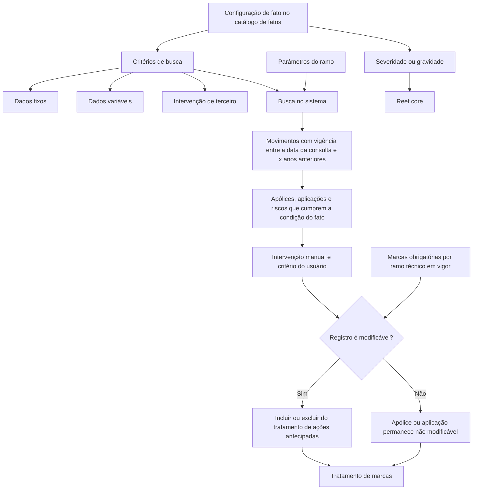

# Catálogo de Detalhe de Fatos de Marcas — Políticas, Estados e Tratamento de Ações Antecipadas

## 1. Metadados do Documento
- **Arquivo de Origem:** Não identificado no conteúdo extraído
- **Tipo de Documento:** Especificação Funcional
- **Domínio / Sistema:** Definição de Marcas; catálogo de fatos; Reef.core; MAPFRE
- **Público-Alvo:** Negócio, analistas funcionais, operação e equipes técnicas responsáveis pela parametrização de marcas
- **Data/Versão Identificada:** Não identificada

---

## 2. Resumo Executivo & Contexto de Negócio

O documento descreve o detalhe das informações armazenadas para cada apólice associada a um fato configurado no catálogo de marcas. A configuração de um fato permite realizar uma busca no sistema para localizar apólices que atendam aos critérios definidos por dados fixos, dados variáveis e intervenções.

A busca de apólices tem como objetivo apoiar a execução do processo de ações antecipadas para tratamento de marcas. Após a consulta, a inclusão ou exclusão de uma apólice no tratamento depende de intervenção manual e do critério do usuário, respeitando as regras de modificabilidade estabelecidas para o ramo técnico.

O escopo temporal da busca considera movimentos cuja vigência esteja compreendida entre a data da consulta e uma quantidade de anos anteriores, conforme os parâmetros do ramo. O documento não informa o valor de `x` anos nem detalha onde ou como os parâmetros do ramo são administrados.

A especificação apresenta atributos identificativos do fato, da apólice, de aplicação, risco e terceiros envolvidos. Também define estados possíveis de apólices ou aplicações, regras de seleção para tratamento e propriedades de validade e inabilitação do fato.

O documento recomenda a leitura conjunta das diretrizes e documentos funcionais relacionados, especialmente “Definição de Marcas” e “Perguntas frequentes”, para evitar interpretações isoladas. Também orienta a entidade MAPFRE a avaliar uma codificação transversal que diferencie marcas próprias das áreas técnicas de marcas compartilhadas entre áreas.

---

## 3. Arquitetura, Componentes & Tecnologias Envolvidas

Os componentes e conceitos explicitamente citados são:

| Componente / Conceito | Papel descrito no documento |
| :--- | :--- |
| Sistema | Executa a busca de apólices que atendem aos critérios configurados para um fato. |
| Catálogo de fatos | Armazena atributos identificativos e de parametrização do fato. |
| Catálogo de detalhe | Armazena dados de apólices, aplicações e riscos que cumprem a condição do fato. |
| Reef.core | Recebe da parametrização do fato o tipo de severidade ou gravidade da marca. |
| Processo de ações antecipadas | Processo no qual apólices ou aplicações podem ser incluídas ou excluídas para tratamento de marcas. |
| Parâmetros do ramo | Determinam a janela histórica, em anos, considerada na busca de movimentos. |
| Tabela de marcas obrigatórias por ramo técnico | Sua existência em vigor impede a alteração do valor de modificabilidade da apólice ou aplicação. |
| MAPFRE | Entidade mencionada como responsável por analisar a conveniência de uma codificação transversal do catálogo. |
| Home Solutions APIs Documentation Zeus | Texto presente no conteúdo extraído, sem explicação de função ou integração. |



**Nota de Análise:** O documento cita Reef.core, porém não detalha interfaces, métodos, protocolos, contratos de dados, URLs, ambientes, bancos de dados ou mecanismos de integração entre Reef.core e os demais componentes.

---

## 4. Regras de Negócio, Especificações Funcionais & Processos

### 4.1. Busca de apólices associadas a um fato

1. Cada fato configurado possibilita uma busca no sistema.
2. A busca localiza apólices que cumpram os critérios configurados para o fato.
3. Os critérios podem estar baseados em:
   - Dados fixos;
   - Dados variáveis;
   - Intervenções.
4. A busca considera movimentos cuja vigência esteja entre:
   - A data da consulta; e
   - `x` anos anteriores no tempo, conforme definido nos parâmetros do ramo.
5. O documento não especifica o valor de `x`, nem detalha os campos dos parâmetros do ramo que definem esse período.

### 4.2. Inclusão e exclusão no tratamento de ações antecipadas

1. As apólices retornadas pela busca podem ser analisadas por intervenção manual.
2. A decisão de incluir ou excluir uma apólice ou aplicação do processo de ações antecipadas depende do critério do usuário.
3. A alteração da seleção está condicionada à propriedade **Modificable**.
4. Quando não existirem registros em vigor na tabela de marcas obrigatórias por ramo técnico, a propriedade **Modificable** determina se a apólice ou aplicação pode ser excluída do tratamento.
5. Quando existirem registros na criação do fato, o valor não poderá ser modificado e a apólice permanecerá não modificável.
6. A propriedade **Seleccionada para su Tratamiento** determina se a apólice ou aplicação será incluída no tratamento de ações antecipadas, desde que a modificação seja permitida.

### 4.3. Estados de situação da apólice ou aplicação

A propriedade **Situación de la Póliza/Aplicación** identifica o estado da apólice ou aplicação quando o fato é cumprido. Os valores admitidos são:

- Expirada;
- Vigente;
- Anulada;
- Rehabilitada;
- Suspendida.

O documento não define transições entre esses estados, eventos que provocam mudança de estado ou regras de prioridade entre estados.

### 4.4. Identificação de terceiros

As propriedades relacionadas a terceiros são aplicáveis quando a tipologia do objeto do fato for `Intervención`.

1. **Intervención del Tercero** identifica o tipo de terceiro ou sua forma de intervenção.
2. Exemplos apresentados no documento:
   - Tomador;
   - Tomador alterno;
   - Beneficiario;
   - Asegurado.
3. Quando o contexto se referir ao tipo e código do documento identificador do terceiro:
   - **Tipo Documento Identificador** define o tipo de documento usado para identificar uma pessoa física ou jurídica;
   - **Clave del Documento Identificador** define o valor do documento utilizado para identificação.

### 4.5. Vigência, validade e inabilitação

1. A **Fecha de Efecto del Movimiento** corresponde à data de efeito do último suplemento da apólice que cumpre o fato.
2. A **Fecha de Vencimiento del Movimiento** corresponde à data de vencimento do último suplemento da apólice que cumpre o fato.
3. A **Fecha de Validez** determina a data a partir da qual o registro configurado do fato está plenamente operacional no sistema.
4. O uso correto da data de validade permite manter histórico das alterações realizadas ao longo do tempo.
5. A propriedade **Inhabilitación** estabelece que o fato está desativado ou inabilitado para uso no tratamento de marcas.

### 4.6. Codificação do catálogo de marcas

1. Não existe preferência ou recomendação estabelecida para padronizar a codificação desse catálogo no sistema.
2. A entidade MAPFRE deve analisar a conveniência de usar transversalmente o catálogo de informação nos processos da companhia.
3. Como exemplo de exploração posterior, o documento sugere agrupar e diferenciar:
   - Marcas próprias de cada área técnica da companhia;
   - Marcas que possam ser consideradas transversais entre áreas técnicas.

---

## 5. Tabelas de Parâmetros, Ambientes e Estruturas de Dados

### 5.1. Atributos do catálogo de fatos e do catálogo de detalhe

| Item / Parâmetro | Descrição / Função | Tipo / Valores / Formato | Ambiente / Observações |
| :--- | :--- | :--- | :--- |
| Compañía / CF | Contém o código da companhia do fato configurado. | Código de companhia; formato não detalhado. | Catálogo de fatos. |
| Ramo Técnico | Determina o ramo técnico associado à apólice do fato configurado. | Valor de ramo técnico; domínio não detalhado. | Catálogo de fatos. |
| Marca | Identifica a marca do fato definido. | Identificador de marca; formato não detalhado. | Catálogo de fatos. |
| Severidad/Gravedad | Indica ao Reef.core o tipo de severidade ou gravidade da marca para o fato configurado. | Tipo de severidade ou gravidade; valores não detalhados. | Parametrização do fato. |
| Identificador del Hecho | Identifica o fato em si. | Identificador; formato não detalhado. | Catálogo de fatos. |
| Secuencia/Orden | Contém o número de sequência da condição de busca por dado fixo, dado variável ou intervenção de terceiro. | Número de sequência. | Condição de busca do fato. |
| Póliza | Identifica o número da apólice que cumpre a condição do fato. | Número de apólice. | Catálogo de detalhe. |
| Aplicación | Identifica o número da aplicação que cumpre a condição do fato. | Número de aplicação. | Aplicável a apólices cujo tratamento de emissão é de Transportes. |
| Riesgo | Identifica o número de risco que cumpre a condição do fato. | Número de risco. | Aplicável a apólices com mais de um objeto assegurado. |
| Intervención del Tercero | Determina o tipo de terceiro ou a forma de intervenção. | Exemplos: Tomador, Tomador alterno, Beneficiario, Asegurado. | Aplicável quando a tipologia do objeto do fato é `Intervención`. |
| Tipo Documento Identificador | Determina o tipo de documento utilizado para identificar pessoa física ou jurídica. | Tipo de documento; valores não detalhados. | Aplicável quando o contexto da intervenção se refere ao tipo e código de documento do terceiro. |
| Clave del Documento Identificador | Determina o valor do documento usado na identificação. | Valor do documento; formato não detalhado. | Aplicável quando o contexto da intervenção se refere ao tipo e código de documento do terceiro. |
| Situación de la Póliza/Aplicación | Determina o estado da apólice ou aplicação quando o fato é cumprido. | Expirada, Vigente, Anulada, Rehabilitada ou Suspendida. | Catálogo de detalhe. |
| Fecha de Efecto del Movimiento | Determina a data de efeito do último suplemento da apólice que cumpre o fato. | Data; formato não detalhado. | Movimento da apólice. |
| Fecha de Vencimiento del Movimiento | Determina a data de vencimento do último suplemento da apólice que cumpre o fato. | Data; formato não detalhado. | Movimento da apólice. |
| Modificable | Determina se a apólice ou aplicação pode ser excluída do tratamento de ações antecipadas. | Condição lógica; valores não explicitados. | Não pode ser alterado se houver registros em vigor na tabela de marcas obrigatórias por ramo técnico. |
| Seleccionada para su Tratamiento | Determina se a apólice ou aplicação está incluída no tratamento de ações antecipadas. | Condição lógica; valores não explicitados. | Só pode ser alterada quando a modificação for permitida. |
| Inhabilitación | Estabelece que o fato está desativado ou inabilitado para o tratamento de marcas. | Estado de inabilitação; valores não detalhados. | Outras propriedades. |
| Fecha de Validez | Indica a data a partir da qual o registro configurado do fato está plenamente operacional. | Data; formato não detalhado. | Permite manter histórico de alterações. |

### 5.2. Janela temporal de consulta

| Item / Parâmetro | Descrição / Função | Tipo / Valores / Formato | Ambiente / Observações |
| :--- | :--- | :--- | :--- |
| Data da consulta | Limite mais recente da vigência dos movimentos considerados na busca. | Data; formato não detalhado. | Busca de apólices por fato. |
| `x` anos anteriores | Limite histórico da vigência de movimentos considerados na busca. | Quantidade de anos; valor não informado. | Determinado pelos parâmetros do ramo. |
| Parâmetros do ramo | Definem a quantidade de anos retroativos usada na busca. | Estrutura não detalhada. | O documento não informa local de configuração nem regras de manutenção. |

### 5.3. Estados explicitamente permitidos

| Item / Parâmetro | Descrição / Função | Tipo / Valores / Formato | Ambiente / Observações |
| :--- | :--- | :--- | :--- |
| Situação da apólice/aplicação | Estado no momento do cumprimento do fato. | Expirada | Não há regra adicional detalhada. |
| Situação da apólice/aplicação | Estado no momento do cumprimento do fato. | Vigente | Não há regra adicional detalhada. |
| Situação da apólice/aplicação | Estado no momento do cumprimento do fato. | Anulada | Não há regra adicional detalhada. |
| Situação da apólice/aplicação | Estado no momento do cumprimento do fato. | Rehabilitada | Não há regra adicional detalhada. |
| Situação da apólice/aplicação | Estado no momento do cumprimento do fato. | Suspendida | Não há regra adicional detalhada. |

---

## 6. Bateria de Perguntas & Respostas para RAG (FAQ Sintético)

### P1: Qual é o objetivo da busca associada a um fato configurado no catálogo de marcas?
**R:** A busca tem como objetivo localizar no sistema as apólices que cumprem os critérios configurados para um fato, incluindo dados fixos, dados variáveis e intervenções. As apólices localizadas podem então ser avaliadas manualmente para inclusão ou exclusão no processo de ações antecipadas de tratamento de marcas.

### P2: Qual período de vigência dos movimentos é considerado na busca de apólices?
**R:** A busca considera movimentos cuja vigência esteja entre a data da consulta e `x` anos anteriores. A quantidade de anos é definida pelos parâmetros do ramo. O documento não informa o valor de `x` nem detalha a configuração desses parâmetros.

### P3: Quais critérios podem compor uma condição de busca de um fato?
**R:** Uma condição de busca pode ser composta por dados fixos, dados variáveis ou intervenção de terceiro. O atributo **Secuencia/Orden** registra o número de sequência da condição de busca conforme esse tipo de critério.

### P4: O que impede a exclusão de uma apólice ou aplicação do tratamento de ações antecipadas?
**R:** A exclusão depende da propriedade **Modificable**. Quando existem registros em vigor na tabela de marcas obrigatórias por ramo técnico no momento da criação do fato, o valor não pode ser alterado e a apólice permanece não modificável.

### P5: Qual é a finalidade da propriedade “Seleccionada para su Tratamiento”?
**R:** A propriedade determina se a apólice ou aplicação está incluída no tratamento de ações antecipadas. Essa seleção somente pode ser modificada quando a modificação for permitida pela regra de modificabilidade.

### P6: Quais estados podem ser atribuídos à situação da apólice ou aplicação?
**R:** A propriedade **Situación de la Póliza/Aplicación** pode ter os valores Expirada, Vigente, Anulada, Rehabilitada ou Suspendida. O documento não descreve transições ou condições específicas para cada estado.

### P7: Quando os atributos de intervenção de terceiro devem ser utilizados?
**R:** Os atributos relacionados a terceiro devem ser utilizados quando a tipologia do objeto do fato for `Intervención`. Nessa situação, é possível identificar o tipo ou forma de participação do terceiro, como Tomador, Tomador alterno, Beneficiario ou Asegurado.

### P8: Como uma pessoa física ou jurídica é identificada no contexto de intervenção de terceiro?
**R:** Quando o contexto se refere ao tipo e código do documento identificador do terceiro, a propriedade **Tipo Documento Identificador** define o tipo de documento usado para identificar a pessoa física ou jurídica, e a propriedade **Clave del Documento Identificador** define o valor desse documento.

### P9: O que representa o campo “Aplicación” no catálogo de detalhe?
**R:** O campo **Aplicación** identifica o número de aplicação que cumpre a condição do fato. Ele é aplicável ao caso de apólices cujo tratamento de emissão é de Transportes.

### P10: O que representa o campo “Riesgo” no catálogo de detalhe?
**R:** O campo **Riesgo** identifica o número de risco que cumpre a condição do fato. Ele é aplicável a apólices que tenham mais de um objeto assegurado.

### P11: Como Reef.core participa da parametrização dos fatos?
**R:** O atributo **Severidad/Gravedad** da parametrização do fato informa ao Reef.core o tipo de severidade ou gravidade da marca associada ao fato configurado. O documento não descreve como Reef.core consome essa informação.

### P12: Qual é a finalidade da data de validade de um fato configurado?
**R:** A **Fecha de Validez** indica a data a partir da qual o registro configurado do fato está plenamente operacional no sistema. Seu uso correto permite manter histórico das alterações feitas nesse registro ao longo do tempo.

### P13: O que significa inabilitar um fato?
**R:** A propriedade **Inhabilitación** estabelece que o fato está desativado ou inabilitado para ser utilizado no tratamento de marcas.

### P14: Existe uma convenção obrigatória para codificação de marcas no catálogo?
**R:** Não. O documento afirma que não existe preferência ou recomendação para estabelecer ou padronizar a codificação no sistema. Contudo, recomenda que a MAPFRE avalie o uso transversal do catálogo, distinguindo marcas próprias das áreas técnicas de marcas transversais entre áreas.

---

## 7. Glossário de Termos, Siglas & Conceitos-Chave

- **Acciones anticipadas:** Processo de tratamento no qual apólices ou aplicações podem ser incluídas ou excluídas conforme critérios de busca, intervenção manual e regras de modificabilidade.
- **Aplicación:** Número de aplicação associado à apólice que cumpre a condição do fato, aplicável a apólices cujo tratamento de emissão é de Transportes.
- **Catálogo de detalle:** Catálogo que identifica, entre outros dados, apólice, aplicação e risco que cumprem a condição de um fato.
- **Catálogo de hechos:** Catálogo que armazena atributos do fato configurado, como companhia, ramo técnico, marca, severidade e identificador.
- **CF:** Sigla presente no atributo “Compañía / CF”; o documento não explicita seu significado.
- **Dato fijo:** Tipo de critério de busca mencionado para configuração de um fato; não detalhado adicionalmente.
- **Dato variable:** Tipo de critério de busca mencionado para configuração de um fato; não detalhado adicionalmente.
- **Fecha de Efecto del Movimiento:** Data de efeito do último suplemento da apólice que cumpre o fato.
- **Fecha de Validez:** Data a partir da qual o registro configurado do fato está plenamente operacional.
- **Fecha de Vencimiento del Movimiento:** Data de vencimento do último suplemento da apólice que cumpre o fato.
- **Hecho:** Fato configurado no catálogo, associado a critérios de busca e a uma marca.
- **Inhabilitación:** Propriedade que desativa ou inabilita o fato para uso no tratamento de marcas.
- **Intervención:** Tipologia de objeto do fato que envolve terceiro ou forma de intervenção.
- **MAPFRE:** Entidade citada como responsável por analisar a conveniência de uma codificação transversal do catálogo.
- **Modificable:** Propriedade que determina se uma apólice ou aplicação pode ser excluída do tratamento de ações antecipadas.
- **Póliza:** Número da apólice que cumpre a condição de um fato.
- **Ramo Técnico:** Ramo técnico associado à apólice do fato configurado.
- **Reef.core:** Sistema citado como destinatário da informação de severidade ou gravidade da marca; demais detalhes não informados.
- **Riesgo:** Número de risco aplicável a apólices com mais de um objeto assegurado.
- **Seleccionada para su Tratamiento:** Propriedade que define a inclusão ou não da apólice ou aplicação no tratamento de ações antecipadas.
- **Severidad/Gravedad:** Tipo de severidade ou gravidade da marca associado a um fato configurado.
- **Suplemento:** Referência usada para identificar o último movimento da apólice quanto às datas de efeito e vencimento.

---

## 8. Notas Críticas, Riscos & Limitações

- O documento não informa o nome do arquivo de origem, data, versão, autoria ou responsável pela manutenção.
- O valor de `x` anos usado na janela histórica de consulta não foi especificado.
- Os parâmetros do ramo são citados, mas sua estrutura, localização, responsáveis e processo de alteração não são detalhados.
- Não foram fornecidos métodos HTTP, contratos JSON, URLs, servidores, credenciais, portas, ambientes ou protocolos de integração.
- Reef.core é citado somente como destinatário da informação de severidade ou gravidade; o mecanismo de integração não foi documentado.
- Não há definição dos valores permitidos para severidade, gravidade, modificabilidade, inabilitação, companhia, ramo técnico ou identificação de marcas.
- O documento não informa as regras de transição para os estados Expirada, Vigente, Anulada, Rehabilitada e Suspendida.
- Não há detalhamento sobre permissões de usuário, trilha de auditoria, retenção de histórico ou responsáveis pela decisão manual de inclusão e exclusão.
- A existência de registros em vigor na tabela de marcas obrigatórias por ramo técnico cria uma dependência crítica: a apólice ou aplicação fica não modificável na criação do fato.
- O documento recomenda leitura conjunta de “Definição de Marcas” e “Perguntas frequentes”; a interpretação isolada da presente especificação pode levar a erro.
- O texto “Home Solutions APIs Documentation Zeus” aparece no conteúdo bruto, mas não há contexto suficiente para definir sua relação com o catálogo de fatos ou com Reef.core.

---

## 9. Conteúdo Bruto Estruturado (Referência Fiel)

```text
--- [PÁGINA 1 DE 4] ---

DEFINIR DETALLE de los HECHOS de las
MARCAS
Contexto
Cada vez que se configura un hecho existe la posibilidad de realizar una búsqueda en el Sistema
para obtener las pólizas que cumplan con los criterios configurados (datos fijos, datos variables e
Intervenciones) para determinar, mediante la intervención manual y el criterio del Usuario, si se
incluyen o excluyen de la ejecución del proceso de acciones anticipadas del tratamiento de marcas.
La búsqueda en el sistema toma en consideración los movimientos cuya vigencia se encuentre
entre la fecha de la consulta y x años hacia atrás en el tiempo según lo indicado en los parámetros
del Ramo.
Objetivo
Conocer el detalle de la información que se almacena en el sistema por cada póliza asociada al
hecho así como los estados en los que se pueden encontrar.
Datos Identificativos
Otras Propiedades
Datos Identificativos
Compañía
 / 
 CF
Home Solutions APIs Documentation Zeus
EN


--- [PÁGINA 2 DE 4] ---

Este Atributo del catálogo de hechos contiene el código de la compañía del hecho configurado.
Ramo Técnico
Esta propiedad determina el ramo técnico asociado a la póliza del hecho configurado.
Marca
Esta propiedad del catálogo de hechos identifica la marca del hecho definido.
Severidad/Gravedad
Este atributo en la parametrización del hecho le indica a Reef.core el tipo de severidad o gravedad de
la marca para el hecho configurado.
Identificador del Hecho
Esta propiedad del catálogo identifica el hecho en sí.
Secuencia/Orden
Este dato contiene el Número de Secuencia de la condición de búsqueda (por dato fijo, dato variable
o intervención del Tercero) en el Hecho.
Póliza
Esta propiedad del catálogo de detalle identifica el número de póliza que cumple con la condición del
hecho.
Aplicación
Esta propiedad del catálogo de detalle identifica el número de aplicación (en el caso de las pólizas
cuyo tratamiento de Emisión es de Transportes) que cumple con la condición del hecho.
Riesgo
Esta propiedad del catálogo de detalle identifica el número de riesgo (en el caso de las pólizas que
tengan más de un objeto asegurado) que cumple con la condición del hecho.
Intervención del Tercero
Esta propiedad determina el tipo de Tercero o su forma de intervención (Tomador, Tomador alterno,
Beneficiario, Asegurado,...) en el caso que la tipología del Objeto del Hecho fuera del tipo
'Intervención'.
Tipo Documento Identificador


--- [PÁGINA 3 DE 4] ---

En el caso que la tipología del Objeto del Hecho fuera del tipo 'Intervención' y el valor del atributo
indicara que el contexto se refiere al Tipo y Código de Documento identificador del Tercero, esta
propiedad determina el tipo de documento con el que se va a identificar a la persona física o jurídica.
Clave del Documento Identificador
En el caso que la tipología del Objeto fuera del tipo 'Intervención' y el valor del atributo indicara que
el contexto se refiere al Tipo y Código de Documento identificador del Tercero, esta propiedad
determina el valor del documento con el que se van a identificar.
Situación de la Póliza/Aplicación
Este atributo determina el estado en el que se encuentra la póliza o la aplicación al momento del
cumplimiento del hecho. Sus valores pueden ser: Expirada, Vigente, Anulada, Rehabilitada o
Suspendida.
Fecha de Efecto del Movimiento
Esta propiedad determina la fecha de efecto del último suplemento de la póliza que cumple con el
hecho.
Fecha de Vencimiento del Movimiento
Esta propiedad determina la fecha de vencimiento del último suplemento de la póliza que cumple con
el hecho.
Modificable
Esta propiedad, siempre y cuando no existan registros en vigor en la tabla de marcas obligatorias por
ramo técnico, determina si la póliza o aplicación se puede o no excluir del tratamiento de acciones
anticipadas.
En caso de existir registros en el momento de la creación del hecho no se podría modificar su valor,
quedando la póliza como no modificable.
Seleccionada para su Tratamiento
Esta propiedad, siempre y cuando se permita su modificación, determina si la póliza o aplicación se
incluye o no en el tratamiento de acciones anticipadas.
Otras Propiedades
Inhabilitación
Esta propiedad establece que el hecho está desactivado o inhabilitado para ser empleado en el
tratamiento de las marcas.


--- [PÁGINA 4 DE 4] ---

Fecha de Validez
Esta propiedad le indica al sistema la fecha a partir de la cual el registro configurado del hecho está
plenamente operativo en el sistema, por lo que su correcto uso permite tener un histórico de los
cambios efectuados sobre ella a lo largo del tiempo.
Vínculos
Relación de Directrices y Documentos funcionales cuya lectura recomendada para evitar que la
interpretación aislada del presente documento pueda conducir a error.
Definición de Marcas
Preguntas frecuentes
(1) ¿Existe alguna circunstancia operativa que deba ser tomada en consideración sobre este
catálogo?
No existe una preferencia ni recomendación para establecer o estandarizar en el sistema su
codificación, si bien la entidad MAPFRE debe analizar la conveniencia de utilizar transversalmente en
los procesos de la compañía este catálogo de información para su correcta y posterior explotación,
e.g:
Agrupando y distinguiendo la codificación de las marcas propias de cada una de las áreas técnicas
de la compañía, de aquellas marcas que se puedan considerar transversales entre ellas.
```
