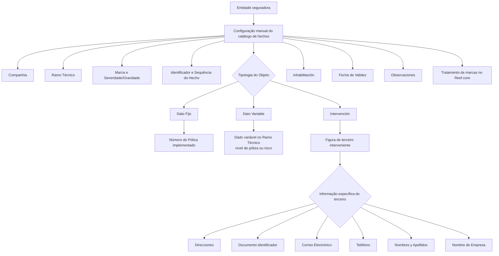

# Catálogo de Definição de Hechos/Marcas no Reef.core

## 1. Metadados do Documento
- **Arquivo de Origem:** Não identificado no conteúdo fornecido
- **Tipo de Documento:** Manual Operacional / Especificação Funcional
- **Domínio / Sistema:** Reef.core — catálogo de hechos, marcas e severidades
- **Público-Alvo:** Analistas funcionais, equipes de parametrização, operação e negócio
- **Data/Versão Identificada:** Não identificada

---

## 2. Resumo Executivo & Contexto de Negócio

O documento descreve a configuração manual do catálogo de **hechos** no sistema Reef.core. Um hecho representa o cumprimento veraz de uma marca e de uma severidade configuradas pela entidade seguradora para realizar verificações sobre terceiros envolvidos em uma apólice e/ou sobre objetos segurados.

A parametrização de um hecho associa informações de identificação organizacional e técnica, incluindo companhia, ramo técnico, marca, severidade, identificador e sequência. A configuração também define o objeto ou âmbito de atuação da marca, que pode ser um dado fixo, dado variável ou uma intervenção de terceiro.

Quando o objeto é uma intervenção, o catálogo permite detalhar dados de terceiros, como documentos identificadores, dados de contato, nomes e endereços. A estrutura geográfica de endereços utiliza níveis de país, estado, província, cidade e código postal, conforme catálogos existentes no sistema.

O documento também estabelece controles operacionais para inabilitar hechos e definir datas de validade, permitindo manter histórico de mudanças na configuração. Não existe recomendação ou padronização obrigatória de codificação, embora a entidade MAPFRE possa optar por agrupar e codificar hechos conforme a tipologia dos objetos.

---

## 3. Arquitetura, Componentes & Tecnologias Envolvidas

O conteúdo menciona os seguintes elementos funcionais:

- **Reef.core:** sistema no qual o catálogo de hechos é configurado e utilizado no tratamento de marcas.
- **Catálogo de hechos:** cadastro manual que relaciona marcas, severidades, objetos, atributos e valores de identificação.
- **Entidade seguradora:** organização responsável por configurar marcas e severidades para verificações.
- **Apólice:** contexto no qual terceiros intervenientes e objetos segurados podem ser submetidos a verificações.
- **Ramo Técnico:** define o ramo técnico aplicável à configuração do hecho.
- **Terceiros:** pessoas ou entidades que podem intervir nas operações de emissão do Reef.core.
- **Catálogos geográficos do sistema:** catálogos de países, estados, províncias e localidades utilizados para endereços.
- **MAPFRE:** entidade citada como possível responsável por agrupar e codificar hechos segundo a tipologia dos objetos.



> **Nota de Análise:** O documento não descreve interfaces técnicas, APIs, métodos HTTP, contratos JSON, banco de dados, URLs, ambientes, tecnologias de implementação ou mecanismos de integração do Reef.core.

---

## 4. Regras de Negócio, Especificações Funcionais & Processos

### 4.1. Conceito de hecho

Um hecho é uma ação, obra ou acontecimento considerado ocorrido. No contexto do Reef.core, um hecho corresponde ao cumprimento veraz de alguma marca e severidade configuradas pela entidade seguradora para verificar:

- Informações dos terceiros intervenientes em uma apólice.
- Informações dos objetos segurados em uma apólice.

A configuração dos valores do catálogo de hechos é realizada manualmente.

### 4.2. Identificação da configuração

A configuração de um hecho contém os seguintes elementos principais:

1. **Compañía:** código da companhia para a qual a configuração está sendo realizada.
2. **Ramo Técnico:** ramo técnico considerado na configuração do hecho.
3. **Marca:** marca que está sendo configurada.
4. **Severidad/Gravedad:** tipo de severidade ou gravidade atribuído à marca.
5. **Identificador del Hecho:** identificador do hecho.
6. **Secuencia/Orden:** número de sequência do hecho, atribuído automaticamente pelo Reef.core.

### 4.3. Tipologia do objeto

A propriedade **Tipología del Objeto** determina o objeto ou âmbito de atuação da marca no hecho. Os valores indicados são:

- **Dato Fijo**
- **Dato Variable**
- **Intervención**

Regras por tipologia:

- Para **Dato Fijo**, o único campo atualmente implementado é **Número de Póliza**.
- Para **Dato Variable**, é possível associar ao hecho qualquer dado variável configurado no Ramo Técnico, tanto em nível de apólice quanto em nível de risco.
- Para **Intervención**, é possível associar qualquer figura de terceiro que possa intervir em operações de emissão do Reef.core.

### 4.4. Regras para intervenções de terceiros

Quando a tipologia do objeto for **Intervención**, a propriedade **Intervención del Tercero** determina o tipo de terceiro ou sua forma de intervenção. Os exemplos apresentados são:

- Tomador
- Tomador alterno
- Beneficiario
- Asegurado

Para intervenções, o catálogo pode aprofundar a definição do hecho usando informações específicas sobre:

- Direções.
- Tipo e código do documento identificador do terceiro.
- Correio eletrônico.
- Telefone.
- Nomes e sobrenomes de pessoas físicas.
- Nome da empresa de pessoas jurídicas.

### 4.5. Regras para atributos e valores

A propriedade **Atributo** identifica o atributo considerado quando a tipologia do objeto for:

- Dato Fijo.
- Dato Variable.

O atributo **Valor del Dato Fijo/Dato Variable** determina o valor considerado para o atributo selecionado, de acordo com a definição da propriedade anterior.

### 4.6. Regras para identificação documental de terceiros

Quando a tipologia for **Intervención** e o atributo indicar o contexto de tipo e código do documento identificador do terceiro:

- **Tipo Documento Identificador** define o tipo de documento usado para identificar uma pessoa física ou jurídica.
- **Clave del Documento Identificador** define o valor do documento de identificação.

### 4.7. Regras para identificação nominal de terceiros

Quando a tipologia for **Intervención** e o atributo indicar nome e sobrenomes de pessoa física ou nome de pessoa jurídica:

- **Nombre del Tercero** define o nome de identificação.
- **Segundo Nombre del Tercero** identifica o segundo nome para pessoas físicas.
- **Primer Apellido del Tercero** identifica o primeiro sobrenome para pessoas físicas.
- **Segundo Apellido del Tercero** identifica o segundo sobrenome para pessoas físicas.

### 4.8. Regras para endereços de terceiros

Quando a tipologia for **Intervención** e o atributo se referir a uma direção do terceiro, podem ser configurados:

1. **País:** código do primeiro nível da estrutura geográfica, conforme catálogo de países do sistema.
2. **Estado:** código do segundo nível da estrutura geográfica, conforme catálogo de estados do sistema.
3. **Provincia:** código do terceiro nível da estrutura geográfica, conforme catálogo de províncias do sistema.
4. **Ciudad:** código do quarto nível da estrutura geográfica, conforme catálogo de localidades do sistema.
5. **Código Postal:** chave que identifica o código postal associado aos cinco níveis da estrutura geográfica.
6. **Tipo de Domicilio:** tipo de via associado ao endereço, como calle, avenida, plaza, carretera ou camino.
7. **Dirección:** endereço específico do terceiro.
8. **Número:** número do endereço do terceiro.
9. **Complemento Dirección:** informação complementar do endereço, incluindo urbanização, ponto quilométrico ou andar do edifício para endereço comercial.
10. **Complemento País:** informação complementar do endereço quando a direção registrada não for do país da entidade seguradora.

A captura de informação no campo **Complemento Dirección** é mutuamente exclusiva em relação à captura de informação no campo **Complemento País**.

### 4.9. Controles operacionais e histórico

- **Observaciones:** permite registrar texto esclarecedor sobre a configuração do hecho, seu propósito, resultado pretendido, área beneficiada e outras informações relevantes.
- **Inhabilitación:** define que o hecho está desativado ou inabilitado para uso no tratamento das marcas.
- **Fecha de Validez:** define a data a partir da qual a configuração do hecho passa a estar plenamente operacional no sistema. O uso correto permite manter histórico das mudanças realizadas ao longo do tempo.

### 4.10. Diretriz de codificação

Não existe preferência ou recomendação para estabelecer ou padronizar a codificação dos hechos no sistema. A entidade MAPFRE pode considerar conveniente agrupar os hechos e codificá-los de acordo com a tipologia dos objetos.

---

## 5. Tabelas de Parâmetros, Ambientes e Estruturas de Dados

| Item / Parâmetro | Descrição / Função | Tipo / Valores / Formato | Ambiente / Observações |
| :--- | :--- | :--- | :--- |
| Compañía | Código da companhia para a qual a configuração é realizada | Código de companhia | Configuração do catálogo de hechos |
| Ramo Técnico | Determina o ramo técnico considerado na configuração | Ramo técnico | Aplicável ao hecho |
| Marca | Identifica a marca configurada | Marca | Associada ao hecho |
| Severidad/Gravedad | Indica a severidade ou gravidade da marca | Severidade / gravidade | Associada à marca |
| Identificador del Hecho | Identifica o hecho | Identificador | Catálogo de hechos |
| Secuencia/Orden | Número de sequência do hecho | Atribuído automaticamente | Gerado pelo Reef.core |
| Tipología del Objeto | Define o objeto ou âmbito de atuação da marca | Dato Fijo; Dato Variable; Intervención | Condiciona os demais campos aplicáveis |
| Dato Fijo | Tipologia de objeto baseada em dado fixo | Campo implementado: Número de Póliza | Único dado fixo implementado segundo o documento |
| Dato Variable | Tipologia de objeto baseada em dado variável | Dados variáveis do Ramo Técnico | Pode estar no nível de póliza ou de risco |
| Intervención | Tipologia baseada em terceiro interveniente | Figuras de terceiros | Aplicável às operações de emissão do Reef.core |
| Intervención del Tercero | Define o tipo ou forma de intervenção do terceiro | Tomador; Tomador alterno; Beneficiario; Asegurado; outros não detalhados | Aplicável quando a tipologia for Intervención |
| Atributo | Define o nome do atributo a considerar | Atributo de Dato Fijo ou Dato Variable | Aplicável às tipologias Dato Fijo e Dato Variable |
| Valor del Dato Fijo/Dato Variable | Define o valor do atributo considerado | Valor do atributo | Aplicável às tipologias Dato Fijo e Dato Variable |
| Tipo Documento Identificador | Define o tipo de documento para identificar pessoa física ou jurídica | Tipo de documento | Aplicável à Intervención com contexto documental |
| Clave del Documento Identificador | Define o valor do documento identificador | Valor do documento | Aplicável à Intervención com contexto documental |
| Nombre del Tercero | Define o nome de identificação do terceiro | Nome | Pessoa física ou pessoa jurídica, conforme contexto |
| Segundo Nombre del Tercero | Define o segundo nome do terceiro | Segundo nome | Aplicável a pessoas físicas |
| Primer Apellido del Tercero | Define o primeiro sobrenome | Primeiro sobrenome | Aplicável a pessoas físicas |
| Segundo Apellido del Tercero | Define o segundo sobrenome | Segundo sobrenome | Aplicável a pessoas físicas |
| País | Identifica o primeiro nível geográfico da direção | Código de país | Conforme catálogo de países do sistema |
| Estado | Identifica o segundo nível geográfico da direção | Código de estado | Conforme catálogo de estados do sistema |
| Provincia | Identifica o terceiro nível geográfico da direção | Código de província | Conforme catálogo de províncias do sistema |
| Ciudad | Identifica o quarto nível geográfico da direção | Código de localidade | Conforme catálogo de localidades do sistema |
| Código Postal | Identifica o código postal associado à estrutura geográfica | Chave de código postal | Associado aos cinco níveis da estrutura geográfica |
| Tipo de Domicilio | Define o tipo de via do endereço | Calle, avenida, plaza, carretera, camino, entre outros exemplos | Aplicável a direção de terceiro |
| Dirección | Define o endereço específico do terceiro | Direção | Aplicável a Intervención com contexto de direção |
| Número | Define o número do endereço | Número | Aplicável a direção de terceiro |
| Complemento Dirección | Armazena informação complementar do endereço | Urbanização, ponto quilométrico, andar de edifício comercial | Exclusivo em relação ao Complemento País |
| Complemento País | Armazena informação complementar quando o endereço não é do país da seguradora | Informação complementar | Exclusivo em relação ao Complemento Dirección |
| Observaciones | Registra texto explicativo sobre a configuração do hecho | Texto livre | Pode incluir propósito, benefício e área beneficiada |
| Inhabilitación | Define que o hecho está desativado | Estado de inabilitação | Impede uso no tratamento de marcas |
| Fecha de Validez | Define quando a configuração passa a operar plenamente | Data | Suporta histórico de mudanças |

> **Nota de Análise:** O documento não informa tipos técnicos de dados, tamanhos, obrigatoriedade, valores padrão, servidores, URLs, variáveis de log ou ambientes de execução.

---

## 6. Bateria de Perguntas & Respostas para RAG (FAQ Sintético)

### P1: O que é um hecho no contexto do Reef.core?
**R:** No Reef.core, um hecho é o cumprimento veraz de uma marca e de uma severidade configuradas pela entidade seguradora para realizar comprovações sobre informações de terceiros intervenientes em uma apólice e/ou sobre objetos segurados nessa apólice.

### P2: Como os valores do catálogo de hechos são configurados no Reef.core?
**R:** Os valores do catálogo de hechos são configurados manualmente. O documento não descreve mecanismos automáticos, APIs ou interfaces técnicas para essa configuração.

### P3: Quais são as tipologias possíveis para o objeto de um hecho?
**R:** A propriedade Tipología del Objeto admite três valores: Dato Fijo, Dato Variable e Intervención. Cada tipologia define quais informações podem ser associadas ao hecho.

### P4: Qual dado fixo está implementado atualmente no catálogo de hechos?
**R:** Segundo o documento, quando a tipologia do objeto é Dato Fijo, o único campo atualmente implementado é Número de Póliza.

### P5: Onde um dado variável pode estar configurado para ser associado a um hecho?
**R:** Quando a tipologia do objeto é Dato Variable, o hecho pode ser associado a qualquer dado variável configurado no Ramo Técnico, independentemente de o dado estar no nível de póliza ou no nível de risco.

### P6: Quais terceiros podem ser associados a um hecho do tipo Intervención?
**R:** Um hecho do tipo Intervención pode ser associado a qualquer figura de terceiro que intervenha nas operações de emissão do Reef.core. O documento cita Tomador, Tomador alterno, Beneficiario e Asegurado como exemplos.

### P7: Que tipos de dados específicos de terceiros podem aprofundar a configuração de um hecho?
**R:** Para a tipologia Intervención, a configuração pode usar direções, tipo e código de documento identificador, correio eletrônico, telefone, nomes e sobrenomes de pessoas físicas e nome de empresas para pessoas jurídicas.

### P8: Como são usados os campos Tipo Documento Identificador e Clave del Documento Identificador?
**R:** Esses campos são usados quando a tipologia é Intervención e o atributo indica o contexto de tipo e código do documento identificador do terceiro. O primeiro define o tipo de documento e o segundo define o valor do documento que identifica a pessoa física ou jurídica.

### P9: Quais níveis geográficos são usados para configurar a direção de um terceiro?
**R:** A direção de um terceiro pode incluir País, Estado, Provincia, Ciudad e Código Postal. País representa o primeiro nível geográfico, Estado o segundo, Provincia o terceiro e Ciudad o quarto; o Código Postal é associado aos cinco níveis da estrutura geográfica.

### P10: É possível preencher Complemento Dirección e Complemento País ao mesmo tempo?
**R:** Não. A captura de informação no campo Complemento Dirección é excluinte em relação à captura de informação no campo Complemento País.

### P11: Para que serve a propriedade Inhabilitación?
**R:** A propriedade Inhabilitación estabelece que o hecho está desativado ou inabilitado para ser empregado no tratamento das marcas.

### P12: Como a Fecha de Validez contribui para o histórico da configuração?
**R:** A Fecha de Validez informa a data a partir da qual o registro configurado do hecho passa a estar plenamente operacional no sistema. Seu uso correto permite manter histórico das mudanças realizadas sobre a configuração ao longo do tempo.

### P13: Existe uma regra obrigatória de codificação para os hechos?
**R:** Não. O documento afirma que não há preferência nem recomendação para estabelecer ou padronizar a codificação dos hechos. A MAPFRE pode, entretanto, considerar conveniente agrupá-los e codificá-los de acordo com a tipologia dos objetos.

---

## 7. Glossário de Termos, Siglas & Conceitos-Chave

- **Reef.core:** Sistema no qual o catálogo de hechos é configurado e utilizado para o tratamento de marcas.
- **Hecho:** Ação, obra ou acontecimento considerado ocorrido; no Reef.core, representa o cumprimento veraz de uma marca e severidade configuradas.
- **Marca:** Elemento configurado no catálogo de hechos e associado a uma severidade ou gravidade.
- **Severidad/Gravedad:** Tipo de severidade ou gravidade atribuído a uma marca.
- **Ramo Técnico:** Propriedade que determina o ramo técnico considerado na configuração do hecho.
- **Dato Fijo:** Tipologia de objeto baseada em dado fixo; o documento informa que Número de Póliza é o único campo implementado.
- **Dato Variable:** Tipologia de objeto que pode usar qualquer dado variável configurado no Ramo Técnico no nível de apólice ou risco.
- **Intervención:** Tipologia de objeto relacionada à participação de terceiros nas operações de emissão do Reef.core.
- **Tomador:** Exemplo de forma de intervenção de um terceiro citado no documento.
- **Tomador alterno:** Exemplo de forma de intervenção de um terceiro citado no documento.
- **Beneficiario:** Exemplo de forma de intervenção de um terceiro citado no documento.
- **Asegurado:** Exemplo de forma de intervenção de um terceiro citado no documento.
- **Número de Póliza:** Campo de dado fixo atualmente implementado segundo o documento.
- **Fecha de Validez:** Data a partir da qual a configuração de um hecho se torna plenamente operacional.
- **Inhabilitación:** Propriedade que desativa ou inabilita um hecho para o tratamento de marcas.
- **MAPFRE:** Entidade citada como possível responsável por agrupar e codificar hechos conforme a tipologia dos objetos.

---

## 8. Notas Críticas, Riscos & Limitações

- O documento não informa versão, data, autoria ou nome do arquivo de origem.
- O documento não detalha telas, serviços, APIs, contratos de integração, estruturas de banco de dados, URLs ou ambientes técnicos.
- Não são definidos tipos de dados técnicos, formatos, tamanhos máximos, campos obrigatórios, regras de preenchimento ou valores padrão.
- O único dado fixo explicitamente indicado como implementado é **Número de Póliza**.
- A codificação dos hechos não possui padrão obrigatório; essa ausência pode resultar em classificações heterogêneas caso a entidade não estabeleça convenções internas.
- A utilização de **Fecha de Validez** é relevante para preservar o histórico de alterações de configuração.
- Os campos **Complemento Dirección** e **Complemento País** possuem exclusão mútua e devem ser tratados como regra de validação operacional.
- A interpretação isolada do documento pode levar a erro; são recomendados os materiais vinculados **Definición de Marcas** e **Preguntas frecuentes**.

---

## 9. Conteúdo Bruto Estruturado (Referência Fiel)

```text
--- [PÁGINA 1 DE 6] ---

DEFINIR HECHOS de las MARCAS
Objetivo
Un hecho es, en términos generales, una acción, obra o acontecimiento, algo que se da por ocurrido.
Se trata de un término empleado en muchos contextos, derivado del verbo latino facere (“hacer”).
Un hecho en el ámbito de Reef.core es el cumplimiento veraz de alguna marca y severidad que la
entidad aseguradora haya configurado en el sistema para realizar alguna comprobación sobre la
información de los Terceros intervinientes en una póliza y/o sobre los objetos asegurados en la
misma.
La configuración de valores en este catálogo se realiza manualmente.
Datos Identificativos
Otras Propiedades
Datos Identificativos
Compañía
Este Atributo del catálogo de hechos contiene el código de la compañía sobre la que se está
realizando la configuración.
Ramo Técnico
Esta propiedad determina el ramo técnico que se ha de tomar en consideración en la configuración
del hecho.
 / 
 CF
Home Solutions APIs Documentation Zeus
EN


--- [PÁGINA 2 DE 6] ---

Marca
Esta propiedad del catálogo de hechos identifica la marca que se está configurando.
Severidad/Gravedad
Este atributo en la parametrización del hecho le indica a Reef.core el tipo de severidad o gravedad de
la marca.
Identificador del Hecho
Esta propiedad del catálogo identifica el hecho.
Secuencia/Orden
Este dato contiene el Número de Secuencia del Hecho. Es un valor que se asigna en Reef.core
automáticamente.
Tipología del Objeto
Esta propiedad determina el objeto o el ámbito de actuación de la marca en el hecho. Sus valores
pueden ser:
Dato Fijo.
Dato Variable.
Intervención.
Actualmente la única tipología que se ha implementado si el tipo es un 'Dato Fijo' es el campo
Número de Póliza.
En el caso que la tipología del objeto fuera un dato variable se podrá asociar al hecho cualquier
dato variable configurado en el Ramo Técnico a nivel de póliza o a nivel de riesgo indistintamente.
En el caso que la tipología del objeto fuera una Intervención, se podrá asociar cualquiera de las
figuras de los Terceros que pueden intervenir en las operaciones de emisión de Reef.core.
Intervención del Tercero
Esta propiedad determina el tipo de Tercero o su forma de intervención (Tomador, Tomador alterno,
Beneficiario, Asegurado,...) en el caso que la tipología del Objeto fuera del tipo 'Intervención'.
Atributo
Esta propiedad determina el nombre del atributo que se ha de tomar en consideración en el caso
que la tipología del Objeto fuera del tipo 'Dato Fijo o Dato Variable'.


--- [PÁGINA 3 DE 6] ---

En el caso que la tipología del objeto correspondiera a una 'Intervención' esta propiedad permite
profundizar en la definición admitiendo asociar al hecho información específica:
Direcciones.
Tipo y Código del Documento Identificador del Tercero.
Correo Electrónico.
Teléfono.
Nombres y Apellidos en Personas Físicas.
Nombre de la Empresa en Personas Jurídicas.
Valor del Dato Fijo/Dato Variable
Este atributo determina el valor del atributo que se ha de tomar en consideración en el caso que la
tipología del Objeto fuera del tipo 'Dato Fijo o Dato Variable' y de acuerdo a su vez con la definición
de la propiedad anterior.
Tipo Documento Identificador
En el caso que la tipología del Objeto fuera del tipo 'Intervención' y el valor del atributo indicara que
el contexto se refiere al Tipo y Código de Documento identificador del Tercero, esta propiedad
determina el tipo de documento con el que se va a identificar a la persona física o jurídica.
Clave del Documento Identificador
En el caso que la tipología del Objeto fuera del tipo 'Intervención' y el valor del atributo indicara que
el contexto se refiere al Tipo y Código de Documento identificador del Tercero, esta propiedad
determina el valor del documento con el que se van a identificar.
Nombre del Tercero
En el caso que la tipología del Objeto fuera del tipo 'Intervención' y el valor del atributo indicara que
el contexto se refiere al Nombre y Apellidos de Personas Físicas o al Nombre en Personas Jurídicas,
esta propiedad determina el nombre con el que se van a identificar.
Segundo Nombre del Tercero
En el caso que la tipología del Objeto fuera del tipo 'Intervención' y el valor del atributo indicara que
el contexto se refiere al Nombre y Apellidos de Personas Físicas, esta propiedad permite identificar el
segundo nombre con el que se va a identificar el hecho.
Primer Apellido del Tercero
En el caso que la tipología del Objeto fuera del tipo 'Intervención' y el valor del atributo indicara que
el contexto se refiere al Nombre y Apellidos de Personas Físicas, esta propiedad permite identificar el


--- [PÁGINA 4 DE 6] ---

primer apellido con el que se va a identificar el hecho.
Segundo Apellido del Tercero
En el caso que la tipología del Objeto fuera del tipo 'Intervención' y el valor del atributo indicara que
el contexto se refiere al Nombre y Apellidos de Personas Físicas, esta propiedad permite identificar el
segundo apellido con el que se va a identificar el hecho.
País
En el caso que la tipología del Objeto fuera del tipo 'Intervención' y el valor del atributo indicara que
el contexto se refiere a una Dirección del Tercero, esta propiedad permite identificar el código del
primer nivel de la estructura Geográfica en la que se encuentra ubicada la Dirección del Tercero de
acuerdo con la relación de posibles valores existentes en el catálogo de países existente en el
Sistema.
Estado
En el caso que la tipología del Objeto fuera del tipo 'Intervención' y el valor del atributo indicara que
el contexto se refiere a una Dirección del Tercero, esta propiedad permite identificar el código del
segundo nivel de la estructura Geográfica en la que se encuentra ubicada la Dirección del Tercero de
acuerdo con la relación de posibles valores existentes en el catálogo de estados existente en el
Sistema.
Provincia
En el caso que la tipología del Objeto fuera del tipo 'Intervención' y el valor del atributo indicara que
el contexto se refiere a una Dirección del Tercero, esta propiedad permite identificar el código del
tercer nivel de la estructura Geográfica en la que se encuentra ubicada la Dirección del Tercero de
acuerdo con la relación de posibles valores existentes en el catálogo de provincias existente en el
Sistema.
Ciudad
En el caso que la tipología del Objeto fuera del tipo 'Intervención' y el valor del atributo indicara que
el contexto se refiere a una Dirección del Tercero, esta propiedad permite identificar el código del
cuarto nivel de la estructura Geográfica en la que se encuentra ubicada la Dirección del Tercero de
acuerdo con la relación de posibles valores existentes en el catálogo de localidades existente en el
Sistema.
Código Postal
En el caso que la tipología del Objeto fuera del tipo 'Intervención' y el valor del atributo indicara que
el contexto se refiere a una Dirección del Tercero, esta propiedad permite identificar la clave que


--- [PÁGINA 5 DE 6] ---

identifica el Código Postal asociado a los cinco niveles de la estructura geográfica en la que está
ubicada la Dirección del Tercero.
Tipo de Domicilio
En el caso que la tipología del Objeto fuera del tipo 'Intervención' y el valor del atributo indicara que
el contexto se refiere a una Dirección del Tercero, esta propiedad permite identificar el tipo de vía
asociada a la dirección del Tercero (calle, avenida, plaza, carretera, camino,...)
Dirección
En el caso que la tipología del Objeto fuera del tipo 'Intervención' y el valor del atributo indicara que
el contexto se refiere a una Dirección del Tercero, esta propiedad permite identificar la dirección
específica del Tercero.
Número
En el caso que la tipología del Objeto fuera del tipo 'Intervención' y el valor del atributo indicara que
el contexto se refiere a una Dirección del Tercero, esta propiedad permite identificar el número de la
dirección del Tercero.
Complemento Dirección
En el caso que la tipología del Objeto fuera del tipo 'Intervención' y el valor del atributo indicara que
el contexto se refiere a una Dirección del Tercero, esta propiedad permite identificar información
complementaria de la Dirección del Tercero como por ejemplo:
1. Para indicar la Urbanización del Domicilio.
2. Para indicar algún punto kilométrico que facilite la ubicación del Domicilio.
3. Para indicar la Planta del Edificio en la que se encuentra la ubicación del Tercero en una
Dirección tipificada como Dirección Comercial,
Complemento País
En el caso que la tipología del Objeto fuera del tipo 'Intervención' y el valor del atributo indicara que
el contexto se refiere a una Dirección del Tercero, esta propiedad permite identificar información
complementaria de la Dirección del Tercero siempre y cuando la dirección que se esté capturando en
el sistema no sea del país de la entidad aseguradora.
La captura de información en el Campo Complemento Dirección es excluyente de la captura de
información del Campo Complemento País
Consejo:


--- [PÁGINA 6 DE 6] ---

Observaciones
Esta propiedad permite registrar un texto aclaratorio sobre la configuración del Hecho: para qué se
configure, qué se pretende con ella, qué área se beneficia de su definición,... es decir, cualquier
información relevante sobre el mismo.
Otras Propiedades
Inhabilitación
Esta propiedad establece que el hecho está desactivado o inhabilitado para ser empleado en el
tratamiento de las marcas.
Fecha de Validez
Esta propiedad le indica al sistema la fecha a partir de la cual el registro configurado del hecho está
plenamente operativo en el sistema, por lo que su correcto uso permite tener un histórico de los
cambios efectuados sobre ella a lo largo del tiempo.
Vínculos
Relación de Directrices y Documentos funcionales cuya lectura recomendada para evitar que la
interpretación aislada del presente documento pueda conducir a error.
Definición de Marcas
Preguntas frecuentes
(1) ¿Existe alguna circunstancia operativa que deba ser tomada en consideración sobre este
catálogo?
No existe una preferencia ni recomendación para establecer o estandarizar en el sistema su
codificación, si bien la entidad MAPFRE puede estimar conveniente agrupar los hechos y codificarlos
en consecuencia de acuerdo con la tipología de los objetos.
```
