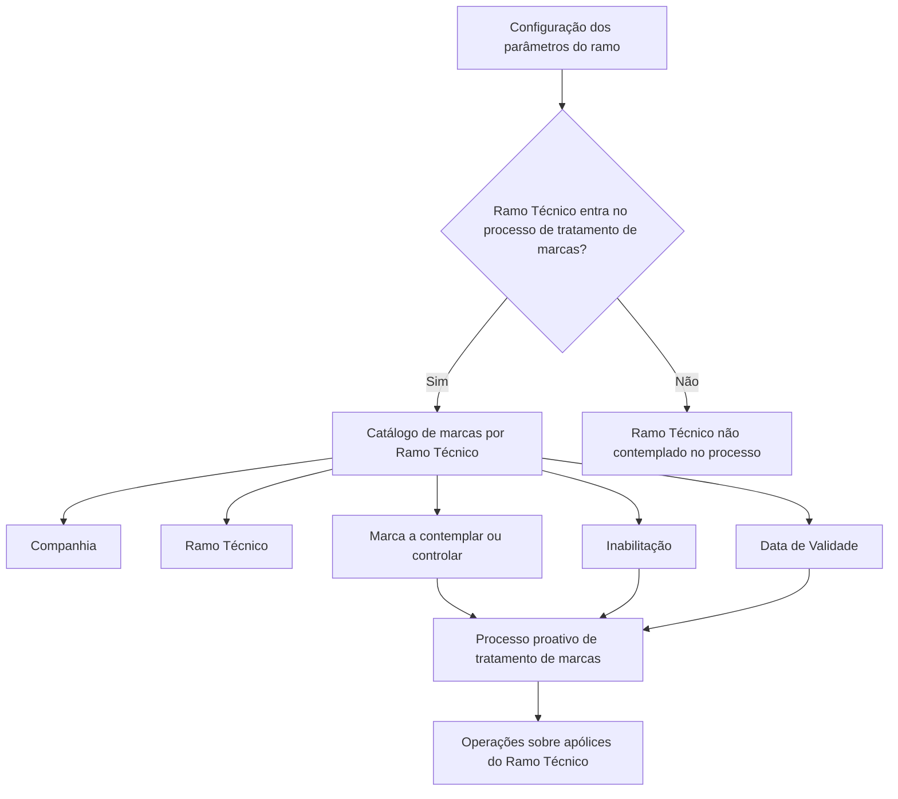

# Definir Marcas por Ramo Técnico para Tratamento Proativo de Marcas

## 1. Metadados do Documento
- **Arquivo de Origem:** `Não identificado no conteúdo fornecido`
- **Tipo de Documento:** `Especificação Funcional`
- **Domínio / Sistema:** `Reef.core — tratamento de marcas`
- **Público-Alvo:** `Negócio, analistas funcionais, desenvolvedores e operação`
- **Data/Versão Identificada:** `Não identificada`

---

## 2. Resumo Executivo & Contexto de Negócio

O documento descreve o catálogo funcional utilizado pelo núcleo do sistema **Reef.core** para definir marcas obrigatórias por **Ramo Técnico**. A finalidade é identificar quais marcas devem ser consideradas quando uma apólice pertencente a determinado ramo técnico participa do processo proativo de tratamento de marcas.

A configuração é associada a uma companhia e a um ramo técnico. A habilitação do ramo técnico no catálogo de marcas não é suficiente de forma isolada: o texto estabelece que o ramo também deve estar configurado, nos parâmetros do próprio ramo, para participar do processo de tratamento de marcas.

Cada registro de configuração identifica uma marca a ser controlada e inclui propriedades para inabilitação e vigência. A propriedade de inabilitação permite desativar uma marca configurada para um ramo técnico; a data de validade determina a partir de quando o registro passa a estar operacional no sistema.

O uso da data de validade é apresentado como mecanismo para manutenção de histórico das alterações realizadas na configuração de marcas ao longo do tempo. O documento não especifica métodos de API, contratos JSON, telas, regras de precedência entre registros, formatos de códigos ou procedimentos operacionais adicionais.

---

## 3. Arquitetura, Componentes & Tecnologias Envolvidas

### Componentes e conceitos identificados

- **Reef.core:** núcleo do sistema que possui a funcionalidade de identificar marcas obrigatórias por ramo técnico.
- **Catálogo de marcas:** estrutura de configuração que associa companhia, ramo técnico e marca.
- **Parâmetros do ramo:** configuração adicional que determina se o ramo técnico participa do processo de tratamento de marcas.
- **Processo proativo de tratamento de marcas:** processo no qual são consideradas as marcas obrigatórias configuradas para ramos técnicos.
- **Apólices:** operações sobre apólices do ramo técnico habilitado podem ser contempladas no processo de tratamento de marcas.
- **Ramos Técnicos:** documento funcional relacionado, recomendado para leitura complementar.
- **Definição de Marcas:** documento funcional relacionado, recomendado para leitura complementar.



> **Nota de Análise:** O documento menciona o Reef.core e o processo proativo de tratamento de marcas, mas não detalha arquitetura de implantação, integrações, APIs, bases de dados, interfaces de usuário, métodos HTTP ou contratos JSON.

---

## 4. Regras de Negócio, Especificações Funcionais & Processos

### 4.1 Objetivo funcional

1. O núcleo do **Reef.core** deve possibilitar a identificação das marcas obrigatórias por **Ramo Técnico**.
2. As marcas identificadas são utilizadas no processo proativo de tratamento de marcas.
3. O catálogo deve determinar quais marcas são contempladas ou controladas para cada configuração de ramo técnico.

### 4.2 Condição de participação do ramo técnico

1. O catálogo de marcas contém o código do ramo técnico cuja operação sobre apólices pode ser contemplada no processo de tratamento de marcas.
2. A inclusão do ramo técnico no catálogo depende de uma condição adicional: o ramo deve estar configurado, nos parâmetros do ramo, para entrar no processo de tratamento de marcas.
3. O documento não detalha o nome, formato, localização ou valores possíveis do parâmetro que habilita o ramo técnico.

### 4.3 Regras de configuração do catálogo

1. Cada configuração contém o código da companhia sobre a qual a configuração é realizada.
2. Cada configuração contém o código do ramo técnico habilitado para consideração no processo de tratamento de marcas.
3. Cada configuração identifica uma marca que deve ser contemplada ou controlada.
4. Uma marca pode ser configurada como inabilitada para impedir a sua utilização nos procedimentos ou processos aplicáveis.
5. A data de validade informa a data a partir da qual o registro de marca configurado para o ramo técnico torna-se operacional no sistema.
6. A data de validade deve permitir a manutenção de histórico das mudanças realizadas na configuração ao longo do tempo.

### 4.4 Processo funcional reconstruído

1. Configurar, nos parâmetros do ramo, que o ramo técnico participa do processo de tratamento de marcas.
2. Criar ou manter um registro no catálogo de marcas com companhia, ramo técnico e marca.
3. Definir se a marca está inabilitada.
4. Informar a data de validade a partir da qual o registro estará operacional.
5. Durante os procedimentos ou processos aplicáveis, considerar a marca configurada para o ramo técnico quando o ramo estiver habilitado para o processo de tratamento de marcas.
6. Utilizar a data de validade para preservar o histórico das alterações de configuração.

> **Nota de Análise:** O documento não especifica como o sistema resolve múltiplos registros para a mesma companhia, ramo técnico e marca, nem define validações de duplicidade, regras de expiração, ordem de prioridade ou comportamento para registros inabilitados.

---

## 5. Tabelas de Parâmetros, Ambientes e Estruturas de Dados

| Item / Parâmetro | Descrição / Função | Tipo / Valores / Formato | Ambiente / Observações |
| :--- | :--- | :--- | :--- |
| Companhia | Código da companhia sobre a qual a configuração do catálogo de marcas é realizada. | Código; formato não detalhado. | Associado ao registro configurado. |
| Ramo Técnico | Código do ramo técnico habilitado para que operações sobre suas apólices sejam contempladas no processo de tratamento de marcas. | Código; formato não detalhado. | Requer configuração adicional nos parâmetros do ramo para entrar no processo. |
| Marca | Marca que deve ser contemplada ou controlada pelo catálogo de marcas. | Valor de marca; formato não detalhado. | Aplicável ao ramo técnico configurado. |
| Inabilitação | Indica que a marca configurada para o ramo técnico está desativada ou inabilitada para uso em procedimentos ou processos aplicáveis. | Estado de inabilitação; valores não detalhados. | O documento não define o comportamento técnico de persistência ou consulta. |
| Data de Validade | Data a partir da qual o registro de marca configurado para o ramo técnico torna-se operacional no sistema. | Data; formato não detalhado. | Permite manter histórico de alterações da configuração ao longo do tempo. |
| Parâmetros do ramo | Configuração que determina se o ramo técnico entrará no processo de tratamento de marcas. | Parâmetros não detalhados. | Pré-condição para contemplar operações sobre apólices do ramo técnico. |
| Processo proativo de tratamento de marcas | Processo que utiliza marcas obrigatórias identificadas por ramo técnico. | Processo funcional; detalhes não fornecidos. | Não há detalhamento de etapas, responsáveis ou integrações. |

### Documentos e vínculos relacionados

| Documento / Referência | Relação com o catálogo de marcas | Observação |
| :--- | :--- | :--- |
| Definição de Marcas | Documento funcional recomendado para evitar interpretação isolada incorreta. | Conteúdo não fornecido. |
| Ramos Técnicos | Documento funcional recomendado para evitar interpretação isolada incorreta. | Conteúdo não fornecido. |

---

## 6. Bateria de Perguntas & Respostas para RAG (FAQ Sintético)

### P1: Qual é o objetivo do catálogo de marcas por Ramo Técnico no Reef.core?
**R:** O catálogo permite que o núcleo do Reef.core identifique as marcas obrigatórias por Ramo Técnico para aplicação no processo proativo de tratamento de marcas.

### P2: Quais dados identificam uma configuração do catálogo de marcas?
**R:** A configuração contém, no mínimo, o código da companhia, o código do Ramo Técnico e a marca que deve ser contemplada ou controlada. O documento também descreve as propriedades de inabilitação e data de validade.

### P3: Um Ramo Técnico é automaticamente incluído no processo de tratamento de marcas ao ser cadastrado no catálogo?
**R:** Não. O documento estabelece que, além de constar no catálogo de marcas, o Ramo Técnico deve estar configurado nos parâmetros do ramo para entrar no processo de tratamento de marcas.

### P4: Qual é a função do atributo Companhia no catálogo de marcas?
**R:** O atributo Companhia contém o código da companhia sobre a qual a configuração do catálogo de marcas está sendo realizada.

### P5: O que representa o atributo Ramo Técnico?
**R:** O atributo Ramo Técnico determina o código do ramo técnico habilitado para que operações sobre suas apólices sejam contempladas no processo de tratamento de marcas, desde que o ramo também esteja configurado para participar desse processo.

### P6: Para que serve a propriedade Marca?
**R:** A propriedade Marca identifica a marca que deve ser contemplada ou controlada pela configuração associada ao Ramo Técnico.

### P7: O que ocorre quando uma marca está inabilitada?
**R:** A propriedade Inabilitação estabelece que a marca configurada para o Ramo Técnico está desativada ou inabilitada para ser utilizada nos procedimentos ou processos aos quais seja aplicável.

### P8: Como a Data de Validade é utilizada no catálogo de marcas?
**R:** A Data de Validade informa a partir de quando o registro de marca configurado para o Ramo Técnico está operacional no sistema. Seu uso correto permite manter um histórico das alterações realizadas na configuração ao longo do tempo.

### P9: O documento define o formato dos códigos de companhia, Ramo Técnico e marca?
**R:** Não. O documento informa que os atributos contêm ou identificam códigos e marcas, mas não especifica formato, tamanho, domínio de valores ou regras de validação.

### P10: O documento descreve APIs, métodos HTTP ou contratos JSON do catálogo de marcas?
**R:** Não. O conteúdo é funcional e não detalha APIs, métodos HTTP, endpoints, contratos JSON, persistência de dados ou mecanismos técnicos de integração.

### P11: Quais documentos devem ser consultados para reduzir o risco de interpretação isolada?
**R:** O documento recomenda a leitura dos materiais funcionais **Definição de Marcas** e **Ramos Técnicos**.

### P12: Existe alguma circunstância operacional adicional a considerar sobre o catálogo?
**R:** A seção de perguntas frequentes informa “N/A” para a pergunta sobre circunstâncias operacionais adicionais a serem consideradas.

---

## 7. Glossário de Termos, Siglas & Conceitos-Chave

- **Reef.core:** Núcleo do sistema mencionado como responsável por possibilitar a identificação de marcas obrigatórias por Ramo Técnico.
- **Ramo Técnico:** Código de ramo utilizado para determinar quais operações sobre apólices podem ser contempladas no processo de tratamento de marcas.
- **Marca:** Propriedade do catálogo que identifica a marca a ser contemplada ou controlada.
- **Catálogo de marcas:** Estrutura de configuração que relaciona companhia, ramo técnico, marca, inabilitação e data de validade.
- **Tratamento de marcas:** Processo no qual são utilizadas as marcas obrigatórias identificadas por ramo técnico.
- **Processo proativo de tratamento de marcas:** Processo citado como destinatário da configuração de marcas; etapas internas não detalhadas.
- **Inabilitação:** Propriedade que desativa ou impede o uso de uma marca configurada para um ramo técnico.
- **Data de Validade:** Data a partir da qual um registro de marca para um ramo técnico torna-se operacional e pode contribuir para o histórico de alterações.
- **Apólice:** Elemento mencionado no contexto de operações vinculadas a um Ramo Técnico.

---

## 8. Notas Críticas, Riscos & Limitações

- O documento é uma especificação funcional resumida e não contém detalhes de implementação técnica.
- Não são informados endpoints, métodos HTTP, contratos JSON, mecanismos de autenticação, bases de dados, logs, URLs, ambientes ou servidores.
- Não há definição de formato para códigos de companhia, Ramo Técnico, marcas ou datas.
- Não são descritas regras para conflitos entre múltiplos registros, duplicidades, sobreposição de vigências ou expiração de configurações.
- Não há detalhamento sobre o comportamento exato de uma marca inabilitada durante a execução dos processos aplicáveis.
- A interpretação isolada do documento pode conduzir a erro; o próprio texto recomenda consultar os documentos **Definição de Marcas** e **Ramos Técnicos**.
- A seção de perguntas frequentes não apresenta circunstâncias operacionais adicionais, registrando apenas `N/A`.

---

## 9. Conteúdo Bruto Estruturado (Referência Fiel)

```text
--- [PÁGINA 1 DE 2] ---

DEFINIR MARCAS por Ramo
Objetivo
Funcionalmente, el núcleo de Reef.core cuenta con la posibilidad de identificar las marcas que son
obligatorias por Ramo Técnico sobre los que se busca aplicar el proceso proactivo del tratamiento
de marcas.
Datos Identificativos
Otras Propiedades
Datos Identificativos
Compañía
Este Atributo del catálogo de marcas contiene el código de la compañía sobre la que se está
realizando la configuración.
Ramo Técnico
Este Atributo del catálogo determina el código del Ramo Técnico que se habilita para que las
operaciones sobre sus pólizas estén contempladas en el proceso de tratamiento de marcas.
Siempre y cuando se haya determinado en la configuración de los parámetros del ramo el que
éste vaya a entrar en el proceso de tratamiento de marcas.
 / 
 CF
Home Solutions APIs Documentation Zeus
EN


--- [PÁGINA 2 DE 2] ---

Marca
Esta propiedad del catálogo de marcas identifica la marca que se debe contemplar/controlar.
Otras Propiedades
Inhabilitación
Esta propiedad establece que la marca configurada para el ramo técnico está desactivada o
inhabilitada para ser utilizada en los procedimientos o procesos que sean de aplicación.
Fecha de Validez
Esta propiedad le indica al sistema la fecha a partir de la cual el registro configurado de la marca
para el ramo técnico está operativo en el sistema, por lo que su correcto uso permite tener un
histórico de los cambios efectuados sobre ella a lo largo del tiempo.
Vínculos
Relación de Directrices y Documentos funcionales cuya lectura recomendada para evitar que la
interpretación aislada del presente documento pueda conducir a error.
Definición de Marcas
Ramos Técnicos
Preguntas frecuentes
(1) ¿Existe alguna circunstancia operativa que deba ser tomada en consideración sobre este
catálogo?
N/A
```
