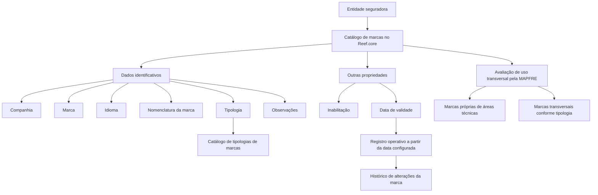

# Definição de Marcas no Catálogo Reef.core

## 1. Metadados do Documento
- **Arquivo de Origem:** Não identificado
- **Tipo de Documento:** Especificação Técnica / Funcional
- **Domínio / Sistema:** Reef.core; entidade MAPFRE; catálogo de marcas
- **Público-Alvo:** Negócio, parametrização funcional e operação
- **Data/Versão Identificada:** Não identificada

---

## 2. Resumo Executivo & Contexto de Negócio

O documento descreve a funcionalidade de **Definição de Marcas** no sistema **Reef.core**. A funcionalidade permite que a entidade seguradora reúna em um catálogo específico as marcas que pretende configurar.

O catálogo de marcas contém dados identificativos e propriedades complementares. Os dados identificativos incluem companhia, marca, idioma, nomenclatura da marca, tipologia e observações. As propriedades adicionais incluem inabilitação e data de validade.

A configuração de idioma permite registrar a nomenclatura de uma marca de acordo com o idioma selecionado. A tipologia de marca é determinada por valores possíveis configurados em um catálogo de tipologias de marcas.

A data de validade determina a partir de qual data um registro de marca fica operativo no sistema. Esse atributo é indicado como mecanismo para manter histórico das alterações realizadas na marca ao longo do tempo.

O documento informa que não existe preferência ou recomendação para padronizar a codificação das marcas. Contudo, a entidade MAPFRE deve avaliar a conveniência de utilizar transversalmente o catálogo de marcas nos processos da companhia, distinguindo marcas próprias de áreas técnicas de marcas transversais conforme sua tipologia.

---

## 3. Arquitetura, Componentes & Tecnologias Envolvidas

### Componentes e conceitos identificados

| Componente / Conceito | Descrição sustentada pelo documento |
| :--- | :--- |
| **Reef.core** | Sistema que possibilita recopilar/configurar marcas em um catálogo específico. |
| **Catálogo de marcas** | Catálogo utilizado para registrar as marcas que a entidade seguradora pretende configurar. |
| **Catálogo de tipologias de marcas** | Catálogo que contém os possíveis valores empregados para definir a tipologia da marca. |
| **Entidade seguradora** | Entidade que configura as marcas no catálogo específico. |
| **MAPFRE** | Entidade mencionada como responsável por analisar a conveniência de utilização transversal do catálogo nos processos da companhia. |
| **Áreas técnicas da companhia** | Áreas cujas marcas próprias podem ser agrupadas e distinguidas de marcas transversais. |

### Fluxo funcional de parametrização de marcas



> **Nota de Análise:** O documento não detalha arquitetura de software, métodos HTTP, contratos JSON, persistência de dados, integrações, ambientes, URLs ou tecnologias adicionais associadas ao Reef.core.

---

## 4. Regras de Negócio, Especificações Funcionais & Processos

### Objetivo funcional

1. O Reef.core permite recopilar, em um catálogo específico, as marcas que a entidade seguradora pretende configurar.
2. O catálogo é composto por dados identificativos e outras propriedades.
3. A configuração de marca deve indicar companhia, chave de marca, idioma, nomenclatura, tipologia e informações adicionais quando aplicável.

### Dados identificativos

1. **Companhia**
   - Contém o código da companhia sobre a qual a configuração está sendo realizada.

2. **Marca**
   - Identifica a chave da marca.

3. **Idioma**
   - Contém a chave do idioma utilizada na nomenclatura da marca.
   - O documento apresenta como exemplos de idiomas: espanhol, inglês e turco.

4. **Nomenclatura da Marca**
   - Contém o nome da marca de acordo com o idioma selecionado para a configuração.

5. **Tipologia**
   - Indica ao Reef.core a tipologia da marca.
   - A tipologia deve corresponder a um dos possíveis valores configurados no catálogo de tipologias de marcas.

6. **Observações**
   - Permite registrar texto explicativo sobre a definição da marca.
   - Pode conter informação sobre a finalidade da configuração, o objetivo pretendido, a área beneficiada ou qualquer outra informação relevante.

### Outras propriedades

1. **Inabilitação**
   - Estabelece que a marca está desativada ou inabilitada.
   - Uma marca inabilitada não deve ser empregada, contemplada ou utilizada nos processos da companhia.

2. **Data de Validade**
   - Indica a data a partir da qual o registro configurado de marca está operativo no sistema.
   - O uso correto da data de validade permite manter histórico das alterações efetuadas na marca ao longo do tempo.

### Considerações operacionais sobre codificação

1. Não existe preferência ou recomendação documentada para estabelecer ou padronizar a codificação das marcas no sistema.
2. A entidade MAPFRE deve analisar a conveniência de utilizar o catálogo de marcas de maneira transversal nos processos da companhia.
3. A análise pode considerar:
   - Agrupamento e distinção da codificação das marcas próprias de cada área técnica.
   - Identificação de marcas que possam ser consideradas transversais entre áreas técnicas.
   - Uso da tipologia como critério de distinção.

---

## 5. Tabelas de Parâmetros, Ambientes e Estruturas de Dados

| Item / Parâmetro | Descrição / Função | Tipo / Valores / Formato | Ambiente / Observações |
| :--- | :--- | :--- | :--- |
| Companhia | Código da companhia sobre a qual é realizada a configuração da marca. | Código da companhia; formato não detalhado. | Dado identificativo. |
| Marca | Identifica a chave da marca. | Chave; formato não detalhado. | Dado identificativo. |
| Idioma | Chave do idioma empregada na nomenclatura da marca. | Chave de idioma; exemplos: espanhol, inglês, turco. | Dado identificativo. |
| Nomenclatura da Marca | Nome da marca conforme o idioma selecionado. | Nome/texto; formato não detalhado. | Dado identificativo. |
| Tipologia | Define a tipologia da marca para o Reef.core. | Um dos possíveis valores configurados no catálogo de tipologias de marcas. | Dado identificativo. |
| Observações | Registra informações relevantes sobre a definição da marca. | Texto. | Pode incluir finalidade, objetivo, área beneficiada ou informação relevante. |
| Inabilitação | Define que a marca está desativada ou inabilitada. | Estado de inabilitação; valores não detalhados. | A marca não deve ser empregada, contemplada ou utilizada nos processos da companhia. |
| Data de Validade | Determina a data a partir da qual o registro de marca fica operativo. | Data; formato não detalhado. | Permite manter histórico de alterações ao longo do tempo. |
| Catálogo de tipologias de marcas | Fonte dos valores possíveis para a tipologia da marca. | Valores configurados; valores específicos não detalhados. | Dependência funcional do catálogo de marcas. |
| Codificação de marcas | Codificação associada às marcas configuradas. | Não padronizada pelo documento. | MAPFRE deve analisar a conveniência de uso transversal. |
| Áreas técnicas | Áreas da companhia associadas a marcas próprias. | Não detalhado. | Podem ser distinguidas de marcas transversais. |

> **Nota de Análise:** O documento não apresenta servidores, URLs, ambientes de desenvolvimento/homologação/produção, rotas de log, nomes de tabelas físicas, tipos de dados técnicos ou restrições de tamanho dos campos.

---

## 6. Bateria de Perguntas & Respostas para RAG (FAQ Sintético)

### P1: Qual é o objetivo do catálogo de marcas no Reef.core?
**R:** O catálogo de marcas no Reef.core permite recopilar as marcas que a entidade seguradora pretende configurar em um catálogo específico.

### P2: Quais são os dados identificativos configurados para uma marca?
**R:** Os dados identificativos apresentados são companhia, marca, idioma, nomenclatura da marca, tipologia e observações.

### P3: O que representa o atributo Companhia no catálogo de marcas?
**R:** O atributo Companhia contém o código da companhia sobre a qual a configuração da marca está sendo realizada.

### P4: Qual é a finalidade do campo Marca?
**R:** O campo Marca identifica a chave da marca configurada no catálogo de marcas.

### P5: Como o atributo Idioma é utilizado na definição de uma marca?
**R:** O atributo Idioma contém a chave do idioma empregada na nomenclatura da marca. O documento cita espanhol, inglês e turco como exemplos de idiomas.

### P6: Como a nomenclatura de uma marca é definida?
**R:** A nomenclatura da marca contém o nome da marca de acordo com o idioma selecionado para sua configuração.

### P7: De onde vêm os valores aceitos para a tipologia da marca?
**R:** A tipologia deve corresponder a um dos possíveis valores configurados no catálogo de tipologias de marcas. O documento não lista quais são esses valores.

### P8: Para que servem as observações no catálogo de marcas?
**R:** As observações permitem registrar texto explicativo sobre a definição da marca, incluindo sua finalidade, o que se pretende com a configuração, a área beneficiada ou qualquer outra informação relevante.

### P9: Qual é o efeito da propriedade Inabilitação?
**R:** A propriedade Inabilitação estabelece que a marca está desativada ou inabilitada para ser empregada, contemplada ou utilizada nos processos da companhia.

### P10: Como a Data de Validade afeta uma marca configurada?
**R:** A Data de Validade indica a data a partir da qual o registro da marca fica operativo no sistema. Seu uso correto permite manter histórico das alterações realizadas na marca ao longo do tempo.

### P11: O documento recomenda um padrão de codificação para as marcas?
**R:** Não. O documento afirma que não existe preferência nem recomendação para estabelecer ou padronizar a codificação das marcas no sistema.

### P12: Qual análise é esperada da MAPFRE sobre o catálogo de marcas?
**R:** A MAPFRE deve analisar a conveniência de utilizar transversalmente o catálogo de marcas nos processos da companhia, agrupando e distinguindo marcas próprias de áreas técnicas e marcas transversais, inclusive conforme sua tipologia.

---

## 7. Glossário de Termos, Siglas & Conceitos-Chave

- **Reef.core:** Sistema que permite recopilar as marcas que a entidade seguradora pretende configurar em um catálogo específico.
- **MAPFRE:** Entidade citada no documento como responsável por avaliar a conveniência de utilização transversal do catálogo de marcas nos processos da companhia.
- **Catálogo de marcas:** Repositório funcional para configuração das marcas da entidade seguradora.
- **Catálogo de tipologias de marcas:** Catálogo que disponibiliza os possíveis valores utilizados para classificar a tipologia de uma marca.
- **Companhia:** Código da companhia sobre a qual a configuração de marca está sendo realizada.
- **Marca:** Chave que identifica uma marca no catálogo.
- **Idioma:** Chave do idioma utilizada para definir a nomenclatura da marca.
- **Nomenclatura da Marca:** Nome da marca conforme o idioma selecionado.
- **Tipologia:** Classificação da marca conforme valores configurados no catálogo de tipologias de marcas.
- **Inabilitação:** Propriedade que define uma marca como desativada ou não utilizável nos processos da companhia.
- **Data de Validade:** Data a partir da qual o registro configurado de uma marca passa a estar operativo no sistema.
- **Marca transversal:** Marca que pode ser considerada comum entre diferentes áreas técnicas da companhia, conforme análise mencionada no documento.

---

## 8. Notas Críticas, Riscos & Limitações

- O documento não especifica um padrão obrigatório de codificação de marcas.
- A ausência de padronização pode demandar análise da MAPFRE para avaliar o uso transversal do catálogo nos processos da companhia.
- O documento não detalha os possíveis valores do catálogo de tipologias de marcas.
- O documento não define formatos, obrigatoriedade, cardinalidade ou validações técnicas dos atributos.
- O documento não especifica como a inabilitação é tecnicamente representada.
- O documento não informa como alterações históricas são armazenadas; apenas declara que o uso correto da data de validade permite manter histórico.
- O documento não apresenta integrações, contratos de API, métodos HTTP, estruturas JSON, persistência, URLs, ambientes ou procedimentos operacionais detalhados.
- A seção de vínculos menciona diretrizes e documentos funcionais cuja leitura é recomendada para evitar interpretação isolada incorreta, mas não disponibiliza os respectivos conteúdos ou referências detalhadas.

---

## 9. Conteúdo Bruto Estruturado (Referência Fiel)

```text
--- [PÁGINA 1 DE 3] ---

DEFINIR MARCAS
Objetivo
Funcionalmente Reef.core cuenta con la posibilidad de recopilar en un catálogo específico las
'marcas' que la entidad aseguradora pretende configurar.
Datos Identificativos
Otras Propiedades
Datos Identificativos
Compañía
Este Atributo del catálogo de marcas contiene el código de la compañía sobre la que se está
realizando la configuración.
Marca
Esta propiedad del catálogo de marcas identifica la clave de la marca.
Idioma
Este Atributo contiene la clave del idioma empleado en la nomenclatura de la marca como por
ejemplo: español, inglés, turco, ...
Nomenclatura de la Marca
 / 
 CF
Home Solutions APIs Documentation Zeus
EN


--- [PÁGINA 2 DE 3] ---

Este Atributo contiene el nombre de la marca de acuerdo con el idioma seleccionado para su
configuración.
Tipología
Este atributo en la parametrización de la marca le indica a Reef.core su tipología de acuerdo con uno
de los [posibles valores] configurados en el catálogo de tipologías de marcas.
Observaciones
Esta propiedad permite registrar un texto aclaratorio sobre la definición de la marca: para qué se
configure, qué se pretende con ella, qué área se beneficia de su definición,... es decir, cualquier
información relevante sobre la marca.
Otras Propiedades
Inhabilitación
Esta propiedad establece que la marca está desactivada o inhabilitada para ser empleada,
contemplada o utilizada en los procesos de la compañía.
Fecha de Validez
Esta propiedad le indica al sistema la fecha a partir de la cual el registro configurado de la marca está
operativo en el sistema, por lo que su correcto uso permite tener un histórico de los cambios
efectuados sobre ella a lo largo del tiempo.
Vínculos
Relación de Directrices y Documentos funcionales cuya lectura recomendada para evitar que la
interpretación aislada del presente documento pueda conducir a error.
Definición de Marcas
Preguntas frecuentes
(1) ¿Existe alguna circunstancia operativa que deba ser tomada en consideración sobre este
catálogo?
No existe una preferencia ni recomendación para establecer o estandarizar en el sistema su
codificación, si bien la entidad MAPFRE debe analizar la conveniencia de utilizar transversalmente en
los procesos de la compañía este catálogo de información para su correcta y posterior explotación,
e.g:


--- [PÁGINA 3 DE 3] ---

Agrupando y distinguiendo la codificación de las marcas propias de cada una de las áreas técnicas
de la compañía, de aquellas marcas que se puedan considerar transversales entre ellas, por su
tipología, ...
```
