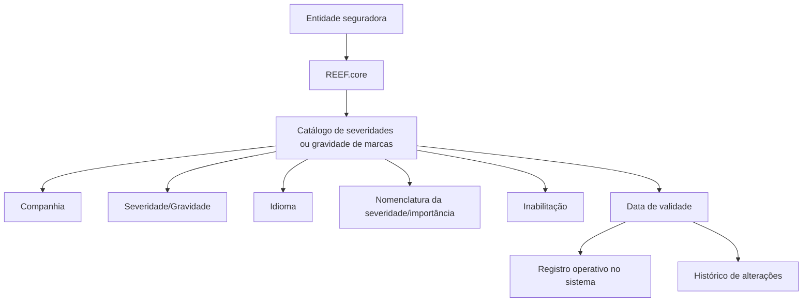

# Catálogo de Severidades/Gravidade de Marcas no REEF.core

## 1. Metadados do Documento
- **Arquivo de Origem:** Não informado; conteúdo bruto fornecido na solicitação.
- **Tipo de Documento:** Especificação Funcional.
- **Domínio / Sistema:** REEF.core; catálogo de marcas; entidade seguradora MAPFRE.
- **Público-Alvo:** Analistas funcionais, configuradores, equipes de negócio e operação.
- **Data/Versão Identificada:** Não identificada.

---

## 2. Resumo Executivo & Contexto de Negócio

O documento descreve a definição de severidades ou gravidade para marcas no sistema REEF.core. Funcionalmente, o REEF.core permite que a entidade seguradora mantenha um catálogo específico para registrar e configurar a severidade ou gravidade atribuída às marcas.

A configuração da severidade de uma marca é identificada, entre outros dados, pela companhia, pela severidade ou gravidade e pelo idioma usado para a nomenclatura. A denominação da severidade é vinculada ao idioma selecionado, permitindo representar o nome da importância ou gravidade da marca em idiomas como espanhol, inglês ou turco.

O catálogo também prevê propriedades operacionais para inabilitação e data de validade. A inabilitação indica que determinado código de severidade está desativado para uso. A data de validade determina o início da operação do registro no sistema e permite manter um histórico das mudanças realizadas ao longo do tempo.

O documento não estabelece uma codificação obrigatória nem uma recomendação de padronização para as severidades. Contudo, indica que a entidade MAPFRE deve avaliar a conveniência de utilizar esse catálogo de maneira transversal nos processos corporativos, visando sua exploração posterior. Como exemplo não obrigatório, cita-se a possibilidade de usar códigos numéricos menores para graus de gravidade menores.

---

## 3. Arquitetura, Componentes & Tecnologias Envolvidas

Os elementos explicitamente citados são:

- **REEF.core:** sistema que disponibiliza o catálogo específico para configurar severidades ou gravidades das marcas.
- **Catálogo de marcas:** estrutura de parametrização que contém os atributos de severidade ou gravidade.
- **Entidade seguradora:** organização que pretende configurar as severidades ou gravidades das marcas.
- **MAPFRE:** entidade mencionada na recomendação de avaliar o uso transversal do catálogo nos processos da companhia.
- **Definición de Marcas:** documento funcional relacionado e recomendado para leitura complementar.
- **Home Solutions APIs Documentation Zeus:** referência textual presente no conteúdo bruto, sem detalhamento adicional sobre sua função ou integração.

O documento não apresenta microsserviços, URLs, ambientes, métodos HTTP, contratos JSON, bancos de dados, tecnologias de implementação ou fluxos de integração entre sistemas.



> **Nota de Análise:** O diagrama representa exclusivamente os atributos e relações funcionais descritos no documento. O conteúdo não detalha arquitetura física, integrações técnicas ou mecanismos de persistência.

---

## 4. Regras de Negócio, Especificações Funcionais & Processos

### 4.1 Objetivo funcional

1. O REEF.core possui a capacidade de reunir severidades ou gravidades de marcas em um catálogo específico.
2. O catálogo atende à necessidade de a entidade seguradora configurar a importância ou gravidade das marcas.
3. A severidade ou gravidade é tratada como atributo da parametrização de uma marca.

### 4.2 Dados identificativos

1. **Companhia**
   - Contém o código da companhia para a qual a configuração está sendo realizada.
   - O documento não especifica o formato, domínio de valores ou mecanismo de validação do código da companhia.

2. **Severidade/Gravidade**
   - Indica ao REEF.core o tipo de severidade ou gravidade atribuída à marca.
   - O documento não lista categorias, escalas, códigos permitidos ou regras de cálculo para a severidade.

3. **Idioma**
   - Contém a chave do idioma usada na nomenclatura da severidade da marca.
   - O documento cita como exemplos espanhol, inglês e turco.
   - O documento não determina o padrão técnico da chave de idioma.

4. **Nomenclatura da Severidade/Importância da Marca**
   - Contém o nome da importância ou severidade da marca.
   - O nome deve corresponder ao idioma selecionado durante a configuração.

### 4.3 Propriedades operacionais

1. **Inabilitação**
   - Determina que um código de severidade de marca esteja desativado ou inabilitado para uso.
   - O documento não define se a inabilitação é representada por valor booleano, status, data ou outro formato.

2. **Data de Validade**
   - Define a data a partir da qual o registro configurado de importância da marca passa a estar operativo no sistema.
   - Permite manter histórico das alterações realizadas sobre a importância ou severidade da marca ao longo do tempo.
   - O documento não apresenta regras para data final de vigência, conflitos entre vigências ou comportamento retroativo.

### 4.4 Codificação e exploração corporativa

1. Não existe preferência ou recomendação para estabelecer ou padronizar a codificação no sistema.
2. A entidade MAPFRE deve analisar a conveniência de usar o catálogo transversalmente nos processos da companhia.
3. A finalidade desse uso transversal é favorecer a correta exploração posterior das informações.
4. Como exemplo de organização possível, o documento sugere agrupar e distinguir as codificações das severidades de acordo com seu grau de importância.
5. O exemplo apresentado indica que menor gravidade pode corresponder a menor numeração de código.
6. A relação entre menor gravidade e menor numeração é apresentada como exemplo, não como regra mandatória.

### 4.5 Documentação relacionada

- O documento recomenda a leitura de diretrizes e documentos funcionais relacionados para evitar interpretações isoladas que possam conduzir a erro.
- A referência explicitamente identificada é **Definición de Marcas**.

---

## 5. Tabelas de Parâmetros, Ambientes e Estruturas de Dados

| Item / Parâmetro | Descrição / Função | Tipo / Valores / Formato | Ambiente / Observações |
| :--- | :--- | :--- | :--- |
| REEF.core | Sistema que permite recopilar/configurar severidades ou gravidades de marcas em catálogo específico. | Sistema corporativo. | Não há versão, URL, ambiente ou tecnologia informados. |
| Catálogo de severidades/gravid​​ade de marcas | Catálogo específico onde são configuradas as severidades ou gravidades das marcas. | Catálogo funcional. | Destinado à entidade seguradora. |
| Companhia | Código da companhia sobre a qual a configuração é realizada. | Código; formato não especificado. | Dado identificativo. |
| Severidade/Gravidade | Indica o tipo de severidade ou gravidade da marca para o REEF.core. | Valor de classificação; domínio não especificado. | Dado identificativo da parametrização da marca. |
| Idioma | Chave do idioma usada na nomenclatura da severidade da marca. | Chave de idioma; exemplos: espanhol, inglês, turco. | O padrão da chave não foi especificado. |
| Nomenclatura da Severidade/Importância | Nome da importância ou severidade da marca conforme o idioma selecionado. | Texto; idioma dependente. | Não há limite de tamanho nem convenção de nomenclatura informados. |
| Inabilitação | Indica que o código de severidade da marca está desativado ou inabilitado para uso. | Propriedade; formato não especificado. | Não há regra de reativação descrita. |
| Data de Validade | Informa a data a partir da qual o registro configurado torna-se operativo no sistema. | Data; formato não especificado. | Permite histórico de mudanças ao longo do tempo. |
| Codificação de severidade | Possível código usado para distinguir níveis de severidade. | Não padronizado. | Não há preferência ou recomendação de padronização. |
| Menor gravidade / menor numeração | Exemplo de possível ordenação de códigos por importância. | Exemplo conceitual. | Não é uma regra obrigatória. |
| Definición de Marcas | Documento funcional relacionado recomendado para leitura complementar. | Referência documental. | Visa reduzir risco de interpretação isolada. |
| MAPFRE | Entidade que deve avaliar o uso transversal do catálogo nos processos corporativos. | Entidade seguradora mencionada. | O documento não detalha equipes responsáveis nem processo decisório. |
| Home Solutions APIs Documentation Zeus | Texto de referência presente no conteúdo original. | Referência não detalhada. | Não há descrição de relação técnica com o catálogo. |

> **Nota de Análise:** O documento não contém mapeamento de servidores, URLs, rotas de log, variáveis de ambiente, APIs, credenciais, ambientes de implantação ou estruturas JSON/XML.

---

## 6. Bateria de Perguntas & Respostas para RAG (FAQ Sintético)

### P1: Qual é o objetivo do catálogo de severidades ou gravidade de marcas no REEF.core?
**R:** O catálogo permite que a entidade seguradora configure, em uma estrutura específica do REEF.core, a severidade ou gravidade aplicável às marcas. A finalidade é registrar e parametrizar o grau de importância dessas marcas.

### P2: Quais são os dados identificativos citados para a configuração de severidade de uma marca?
**R:** O documento identifica os atributos Companhia, Severidade/Gravidade e Idioma. A Companhia contém o código da companhia configurada; a Severidade/Gravidade informa o tipo de gravidade da marca; e o Idioma contém a chave usada para a nomenclatura da severidade.

### P3: Qual é a função do atributo Companhia no catálogo de marcas?
**R:** O atributo Companhia contém o código da companhia sobre a qual está sendo realizada a configuração da severidade ou gravidade da marca. O documento não especifica o formato ou os valores válidos desse código.

### P4: Como o atributo Severidade/Gravidade é utilizado pelo REEF.core?
**R:** O atributo Severidade/Gravidade informa ao REEF.core o tipo de severidade ou gravidade associado à marca na sua parametrização. O documento não detalha categorias, escala, códigos ou regras de validação para esse atributo.

### P5: Para que serve o atributo Idioma na configuração da severidade de uma marca?
**R:** O atributo Idioma contém a chave do idioma empregado na nomenclatura da severidade da marca. O documento cita espanhol, inglês e turco como exemplos de idiomas, mas não define o padrão técnico da chave utilizada.

### P6: O que representa a nomenclatura da severidade ou importância de uma marca?
**R:** A nomenclatura contém o nome da importância ou severidade atribuída à marca. Esse nome deve corresponder ao idioma escolhido para a configuração.

### P7: Qual é o efeito da propriedade de inabilitação?
**R:** A propriedade de inabilitação estabelece que o código da severidade da marca está desativado ou inabilitado para utilização. O documento não informa como esse estado é tecnicamente representado nem como ocorre uma eventual reativação.

### P8: Como a Data de Validade afeta uma configuração de severidade?
**R:** A Data de Validade indica a partir de qual data o registro configurado de importância ou severidade da marca fica operativo no sistema. O uso correto dessa propriedade permite manter histórico das alterações realizadas ao longo do tempo.

### P9: O documento exige um padrão de codificação para as severidades de marcas?
**R:** Não. O documento afirma que não existe preferência nem recomendação para estabelecer ou padronizar a codificação no sistema. A decisão sobre o uso e organização dos códigos deve ser analisada pela entidade MAPFRE.

### P10: Qual exemplo de codificação é apresentado para representar a importância da severidade?
**R:** O documento apresenta, como exemplo, a possibilidade de agrupar e distinguir códigos de severidade pelo grau de importância, usando menor numeração de código para menor gravidade. Essa orientação é apenas ilustrativa e não constitui uma regra obrigatória.

### P11: Por que o catálogo deve ser analisado para uso transversal pela MAPFRE?
**R:** A MAPFRE deve avaliar a conveniência de usar o catálogo transversalmente nos processos da companhia para permitir uma exploração correta e posterior das informações de severidade ou gravidade das marcas.

### P12: Qual documentação complementar é recomendada?
**R:** O documento recomenda a leitura da documentação funcional relacionada, especialmente a referência intitulada **Definición de Marcas**, para evitar que uma interpretação isolada do documento leve a conclusões incorretas.

---

## 7. Glossário de Termos, Siglas & Conceitos-Chave

- **REEF.core:** Sistema que possui a capacidade de recopilar/configurar severidades ou gravidades de marcas em um catálogo específico.
- **Marca:** Entidade cuja parametrização inclui a atribuição de uma severidade ou gravidade.
- **Severidade/Gravidade:** Tipo de importância atribuído a uma marca no catálogo do REEF.core.
- **Catálogo de marcas:** Estrutura funcional usada para configurar informações associadas às marcas, incluindo severidade ou gravidade.
- **Companhia:** Código da companhia para a qual a configuração é realizada.
- **Idioma:** Chave usada para definir o idioma da nomenclatura da severidade da marca.
- **Nomenclatura:** Nome da importância ou severidade da marca conforme o idioma escolhido.
- **Inabilitação:** Propriedade que informa que um código de severidade está desativado ou inabilitado para uso.
- **Data de Validade:** Data a partir da qual um registro configurado torna-se operativo no sistema.
- **MAPFRE:** Entidade mencionada como responsável por analisar a conveniência de explorar transversalmente o catálogo nos processos da companhia.
- **Definición de Marcas:** Documento funcional relacionado, recomendado para leitura complementar.
- **Home Solutions APIs Documentation Zeus:** Referência textual presente no conteúdo bruto, sem explicação adicional no documento.

---

## 8. Notas Críticas, Riscos & Limitações

- O documento não define o formato, comprimento, domínio de valores ou validações para Companhia, Severidade/Gravidade, Idioma, Nomenclatura, Inabilitação e Data de Validade.
- Não há descrição de telas, APIs, contratos de integração, modelo de persistência, permissões, auditoria, logs ou fluxos de aprovação.
- Não são informados ambientes, URLs, servidores, versões, portas, tecnologias de implementação ou dependências de infraestrutura.
- A codificação das severidades não é padronizada pelo documento; diferentes áreas podem adotar convenções inconsistentes se a MAPFRE não definir uma abordagem transversal.
- A relação entre gravidade e numeração de código é somente um exemplo; tratá-la como regra poderia produzir comportamento não sustentado pelo documento.
- Embora a Data de Validade seja indicada como mecanismo para manter histórico, não há regras para sobreposição de vigências, encerramento de vigência, exclusão ou correção de registros históricos.
- A leitura de **Definición de Marcas** é recomendada explicitamente, pois a interpretação isolada deste documento pode conduzir a erro.
- **Nota de Análise:** O documento menciona “Home Solutions APIs Documentation Zeus”, mas não detalha seu propósito, conteúdo ou relação com o catálogo de severidades.

---

## 9. Conteúdo Bruto Estruturado (Referência Fiel)

```text
--- [PÁGINA 1 DE 2] ---

DEFINIR SEVERIDADES de las MARCAS
Objetivo
Funcionalmente Reef.core cuenta con la posibilidad de recopilar en un catálogo específico las
severidades o gravedad de las 'marcas' que la entidad aseguradora pretende configurar.
Datos Identificativos
Otras Propiedades
Datos Identificativos
Compañía
Este Atributo del catálogo de marcas contiene el código de la compañía sobre la que se está
realizando la configuración.
Severidad/Gravedad
Este atributo en la parametrización de la marca le indica a Reef.core el tipo de severidad o gravedad
de la misma.
Idioma
Este Atributo contiene la clave del idioma empleado en la nomenclatura de la severidad de la marca
como por ejemplo: español, inglés, turco, ...
 / 
 CF
Home Solutions APIs Documentation Zeus
EN


--- [PÁGINA 2 DE 2] ---

Nomenclatura de la Severidad/Importancia de la marca
Este Atributo contiene el nombre de la importancia o severidad de la marca de acuerdo con el idioma
seleccionado para su configuración.
Otras Propiedades
Inhabilitación
Esta propiedad establece que el código de la severidad de la marca está desactivada o inhabilitada
para ser empleada.
Fecha de Validez
Esta propiedad le indica al sistema la fecha a partir de la cual el registro configurado de la
importancia de la marca está operativo en el sistema, por lo que su correcto uso permite tener un
histórico de los cambios efectuados sobre ella a lo largo del tiempo.
Vínculos
Relación de Directrices y Documentos funcionales cuya lectura recomendada para evitar que la
interpretación aislada del presente documento pueda conducir a error.
Definición de Marcas
Preguntas frecuentes
(1) ¿Existe alguna circunstancia operativa que deba ser tomada en consideración sobre este
catálogo?
No existe una preferencia ni recomendación para establecer o estandarizar en el sistema su
codificación, si bien la entidad MAPFRE debe analizar la conveniencia de utilizar transversalmente en
los procesos de la compañía este catálogo de información para su correcta y posterior explotación,
e.g:
Agrupando y distinguiendo la codificación de las diferentes severidades de las marcas de acuerdo
con su grado de importancia como por ejemplo: a menor gravedad menor numeración del código.
```
