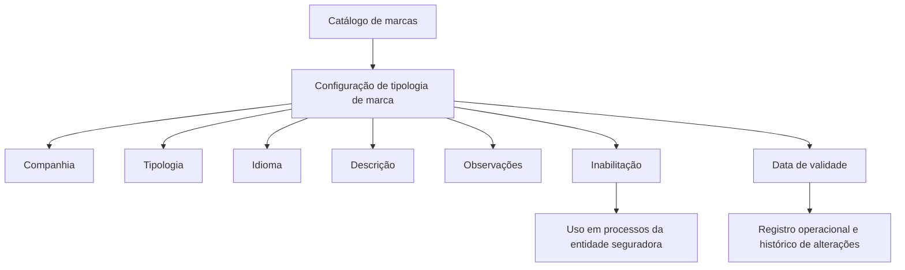

# Definição de Tipos de Marcas no REEF.core

## 1. Metadados do Documento
- **Arquivo de Origem:** Não identificado
- **Tipo de Documento:** Especificação Funcional
- **Domínio / Sistema:** REEF.core; catálogo de marcas; entidade seguradora MAPFRE
- **Público-Alvo:** Negócio, configuração funcional e operação
- **Data/Versão Identificada:** Não identificada

---

## 2. Resumo Executivo & Contexto de Negócio

O documento descreve a configuração das diferentes tipologias de marcas em um catálogo específico do sistema REEF.core. A funcionalidade permite classificar marcas segundo critérios definidos pela entidade seguradora, incluindo companhia, tipologia, idioma, descrição e observações.

A configuração de uma tipologia de marca pode ser desativada para impedir seu uso nos processos da entidade seguradora. Também pode possuir uma data de validade, que determina a partir de quando o registro fica operacional no sistema.

A data de validade é apresentada como mecanismo para manter histórico das alterações realizadas nas tipologias de marcas ao longo do tempo. O documento não detalha processos automáticos, integrações, contratos técnicos, permissões, APIs ou regras de cálculo associadas ao catálogo.

A MAPFRE deve avaliar a conveniência de utilizar transversalmente esse catálogo nos processos da companhia. Não há preferência ou recomendação para padronizar a codificação, mas o documento recomenda avaliar agrupamentos e distinções de codificação e nomenclatura conforme o que se pretende controlar.

---

## 3. Arquitetura, Componentes & Tecnologias Envolvidas

| Componente / Termo | Papel descrito |
| :--- | :--- |
| REEF.core | Sistema no qual são definidas as tipologias de marcas. |
| Catálogo de marcas | Catálogo específico que contém as diferentes tipologias de marcas. |
| Entidade seguradora | Organização cujos processos podem utilizar ou deixar de utilizar uma tipologia de marca. |
| MAPFRE | Entidade mencionada como responsável por analisar o uso transversal do catálogo de informações. |
| Companhia | Atributo que contém o código da companhia para a qual a configuração é realizada. |
| Idioma | Chave do idioma usada na nomenclatura da tipologia de marca. |



**Nota de Análise:** o documento não descreve arquitetura de infraestrutura, ambientes, microsserviços, métodos HTTP, contratos JSON, banco de dados ou rotas de log.

---

## 4. Regras de Negócio, Especificações Funcionais & Processos

1. O REEF.core permite determinar diferentes tipologias de marcas dentro de um catálogo específico.
2. O atributo **Companhia** armazena o código da companhia sobre a qual a configuração é realizada.
3. O atributo **Tipologia** determina, no REEF.core, o tipo da marca.
4. O atributo **Idioma** contém a chave do idioma usada na nomenclatura da tipologia de marca. O documento cita como exemplos espanhol, inglês e turco.
5. O atributo **Descrição** identifica o nome da tipologia conforme o idioma selecionado em sua configuração.
6. A propriedade **Observações** permite registrar texto explicativo sobre:
   - a finalidade da configuração da tipologia;
   - o que se pretende controlar;
   - a área beneficiada pela definição;
   - qualquer informação relevante sobre a marca.
7. A propriedade **Inabilitação** determina que a tipologia de marca está desativada ou inabilitada para uso nos processos da entidade seguradora.
8. A propriedade **Data de Validade** determina a data a partir da qual o registro de tipo está operacional no sistema.
9. O uso correto da **Data de Validade** permite manter histórico das alterações efetuadas nas tipologias de marcas ao longo do tempo.
10. Não existe preferência ou recomendação documentada para estabelecer ou padronizar a codificação desse catálogo.
11. A entidade MAPFRE deve analisar a conveniência de utilizar o catálogo transversalmente nos processos da companhia, visando exploração posterior adequada.
12. Como exemplo de exploração, o documento recomenda considerar o agrupamento e a distinção da codificação e da nomenclatura das tipologias de marcas de acordo com o que se pretende controlar.
13. O documento recomenda a leitura da diretriz ou documento funcional relacionado denominado **Definición de Marcas**, para evitar interpretação isolada e potencialmente incorreta.

---

## 5. Tabelas de Parâmetros, Ambientes e Estruturas de Dados

| Item / Parâmetro | Descrição / Função | Tipo / Valores / Formato | Ambiente / Observações |
| :--- | :--- | :--- | :--- |
| Companhia | Contém o código da companhia para a qual a configuração é realizada. | Código de companhia; formato não detalhado. | Aplicável ao catálogo de marcas. |
| Tipologia | Determina o tipo da marca no REEF.core. | Valor de tipologia; domínio de valores não detalhado. | Campo funcional do catálogo de marcas. |
| Idioma | Contém a chave do idioma usada na nomenclatura da tipologia. | Chave de idioma; exemplos: espanhol, inglês e turco. | Usado para configurar a descrição. |
| Descrição | Identifica o nome da tipologia de acordo com o idioma selecionado. | Texto; tamanho e formato não detalhados. | Dependente do idioma selecionado. |
| Observações | Registra texto explicativo e informações relevantes sobre a tipologia ou marca. | Texto livre; formato não detalhado. | Pode informar finalidade, controle pretendido e área beneficiada. |
| Inabilitação | Indica que a tipologia de marca está desativada ou inabilitada para uso. | Estado de inabilitação; valores técnicos não detalhados. | Afeta o uso nos processos da entidade seguradora. |
| Data de Validade | Define a data a partir da qual o registro de tipo está operacional. | Data; formato não detalhado. | Permite histórico de alterações nas tipologias. |
| Definición de Marcas | Documento funcional recomendado como leitura vinculada. | Documento relacionado. | Deve ser consultado para evitar interpretação isolada. |
| Codificação do catálogo | Identificação das tipologias de marcas. | Não padronizada pelo documento. | MAPFRE deve analisar uso transversal e exploração posterior. |

---

## 6. Bateria de Perguntas & Respostas para RAG (FAQ Sintético)

### P1: Qual é o objetivo do catálogo de tipos de marcas no REEF.core?
**R:** O catálogo permite determinar e configurar diferentes tipologias de marcas em um catálogo específico no REEF.core.

### P2: Para que serve o atributo Companhia na configuração da tipologia de marca?
**R:** O atributo Companhia contém o código da companhia sobre a qual a configuração da tipologia de marca está sendo realizada.

### P3: Como o idioma influencia a descrição de uma tipologia de marca?
**R:** O atributo Idioma armazena a chave do idioma utilizada na nomenclatura da tipologia. A Descrição identifica o nome da tipologia conforme o idioma selecionado na configuração. O documento cita espanhol, inglês e turco como exemplos de idiomas.

### P4: Qual é a finalidade do campo Observações no catálogo de marcas?
**R:** Observações permite registrar texto esclarecedor sobre a definição da tipologia, incluindo a finalidade da configuração, o que se pretende controlar, a área beneficiada e outras informações relevantes sobre a marca.

### P5: O que ocorre quando uma tipologia de marca é inabilitada?
**R:** A propriedade Inabilitação estabelece que a tipologia de marca está desativada ou inabilitada para ser utilizada nos processos da entidade seguradora.

### P6: Quando um registro de tipo de marca passa a estar operacional?
**R:** O registro passa a estar operacional a partir da data definida na propriedade Data de Validade.

### P7: Como o sistema mantém histórico de alterações nas tipologias de marcas?
**R:** O documento informa que o uso correto da Data de Validade permite manter histórico das alterações efetuadas sobre as tipologias de marcas ao longo do tempo.

### P8: Existe uma codificação obrigatória ou padrão para o catálogo de tipos de marcas?
**R:** Não. O documento declara que não existe preferência nem recomendação para estabelecer ou padronizar a codificação no sistema.

### P9: Qual análise a MAPFRE deve realizar sobre o catálogo de marcas?
**R:** A MAPFRE deve analisar a conveniência de utilizar o catálogo de informação de maneira transversal nos processos da companhia, para permitir sua correta exploração posterior.

### P10: Como a codificação e a nomenclatura das tipologias podem ser organizadas?
**R:** O documento apresenta como exemplo o agrupamento e a distinção da codificação e da nomenclatura das tipologias de marcas conforme o que se pretende controlar com elas.

### P11: Há documentação relacionada que deve ser consultada?
**R:** Sim. O documento indica a leitura recomendada de **Definición de Marcas**, para evitar que a interpretação isolada deste conteúdo conduza a erro.

### P12: O documento especifica APIs, integrações ou contratos técnicos para o catálogo?
**R:** Não. O conteúdo fornecido não detalha APIs, métodos HTTP, contratos JSON, integrações, infraestrutura, banco de dados ou ambientes técnicos.

---

## 7. Glossário de Termos, Siglas & Conceitos-Chave

- **REEF.core:** Sistema mencionado como responsável por permitir a determinação das tipologias de marcas em um catálogo específico.
- **Catálogo de marcas:** Estrutura de informação usada para registrar e organizar tipologias de marcas.
- **Tipologia:** Tipo atribuído a uma marca no REEF.core.
- **Companhia:** Código da companhia para a qual a configuração é realizada.
- **Inabilitação:** Propriedade que indica que uma tipologia está desativada ou não pode ser usada nos processos da entidade seguradora.
- **Data de Validade:** Data a partir da qual o registro de tipo se torna operacional no sistema.
- **MAPFRE:** Entidade citada no documento como responsável por analisar a utilização transversal do catálogo em seus processos.
- **Definición de Marcas:** Diretriz ou documento funcional relacionado, recomendado para leitura complementar.

---

## 8. Notas Críticas, Riscos & Limitações

- O documento não estabelece uma recomendação ou padronização para a codificação do catálogo de marcas.
- A falta de padronização pode exigir análise da MAPFRE antes de utilizar transversalmente a codificação e nomenclatura nos processos corporativos.
- A interpretação isolada do documento pode conduzir a erro; a leitura de **Definición de Marcas** é recomendada.
- Não são detalhados valores permitidos, obrigatoriedade de campos, regras de unicidade, formato de datas, perfis de acesso ou procedimentos de manutenção.
- Não há detalhamento técnico sobre APIs, integrações, infraestrutura, bancos de dados, logs, ambientes ou mecanismos de auditoria.
- **Nota de Análise:** o documento descreve propriedades funcionais do catálogo, mas não explica como a inabilitação é aplicada tecnicamente nos processos da entidade seguradora.

---

## 9. Conteúdo Bruto Estruturado (Referência Fiel)

```text
--- [PÁGINA 1 DE 2] ---

DEFINIR TIPOS de MARCAS
Objetivo
Funcionalmente Reef.core cuenta con la posibilidad de determinar sobre un catálogo específico las
diferentes tipologías de las marcas.
Datos Identificativos
Otras Propiedades
Datos Identificativos
Compañía
Este Atributo del catálogo de marcas contiene el código de la compañía sobre la que se está
realizando la configuración.
Tipología
Este atributo determina en Reef.core el tipo de la misma.
Idioma
Este Atributo contiene la clave del idioma empleado en la nomenclatura de la tipología de la marca
como por ejemplo: español, inglés, turco, ...
Descripción
 / 
 CF
Home Solutions APIs Documentation Zeus
EN


--- [PÁGINA 2 DE 2] ---

Este Atributo identifica el nombre de la tipología de acuerdo con el idioma seleccionado para su
configuración.
Observaciones
Esta propiedad permite registrar un texto aclaratorio sobre la definición de la tipología: para qué se
configura, qué se pretende controlar con ella, qué área se beneficia de su definición,... es decir,
cualquier información relevante sobre la marca.
Otras Propiedades
Inhabilitación
Esta propiedad establece que la tipología de la marca está desactivada o inhabilitada para ser
empleada en los procesos de la entidad aseguradora.
Fecha de Validez
Esta propiedad le indica al sistema la fecha a partir de la cual el registro del tipo está operativo en el
sistema, por lo que su correcto uso permite tener un histórico de los cambios efectuados sobre la
tipología de las marcas a lo largo del tiempo.
Vínculos
Relación de Directrices y Documentos funcionales cuya lectura recomendada para evitar que la
interpretación aislada del presente documento pueda conducir a error.
Definición de Marcas
Preguntas frecuentes
(1) ¿Existe alguna circunstancia operativa que deba ser tomada en consideración sobre este
catálogo?
No existe una preferencia ni recomendación para establecer o estandarizar en el sistema su
codificación, si bien la entidad MAPFRE debe analizar la conveniencia de utilizar transversalmente y
en los procesos de la compañía este catálogo de información para su correcta y posterior
explotación, e.g:
Agrupando y distinguiendo la codificación y nomenclatura de las tipologías de las marcas de acuerdo
con lo que se pretenda controlar con ellas.
```
