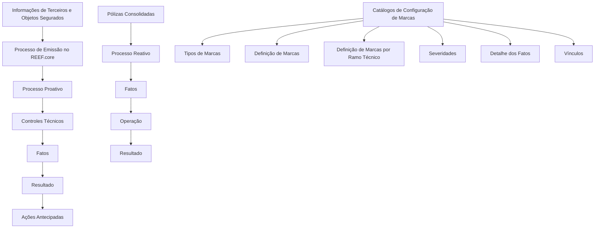

# Definição de Marcas no REEF.core — Catálogos e Processos Proativo e Reativo

## 1. Metadados do Documento
- **Arquivo de Origem:** `Não identificado no conteúdo fornecido`
- **Tipo de Documento:** `Procedimento / Guia funcional`
- **Domínio / Sistema:** `REEF.core — Processo de Emissão`
- **Público-Alvo:** `Não identificado explicitamente`
- **Data/Versão Identificada:** `Não identificada`

---

## 2. Resumo Executivo & Contexto de Negócio

O documento apresenta a funcionalidade de **Marcas** no sistema REEF.core. Segundo o contexto informado, uma marca é uma sinalização aplicada para distinguir, denotar qualidade ou indicar pertença, em alinhamento com a definição do dicionário da Real Academia Española.

No REEF.core, as Marcas permitem controlar, durante processos de emissão das entidades seguradoras, o cumprimento de condições relacionadas às informações de **Terceiros**, **objetos segurados** e **pólizas consolidadas**. Os controles podem ocorrer antes ou durante a contratação, de forma proativa e antecipada, ou após a consolidação da apólice, de forma reativa e diferida.

A funcionalidade admite diferentes tipos e níveis de severidade de Marcas. Essa classificação permite determinar ações distintas sobre os fatos associados às Marcas e sobre o resultado da verificação das condições de controle.

O documento informa que a funcionalidade está atualmente implementada apenas no **Processo de Emissão**. A Área Corporativa de Operações considera a possibilidade de estender o uso das Marcas para outros processos no futuro, sem detalhar quais processos seriam incluídos.

O objetivo declarado é conhecer a relação de catálogos que devem ser configurados e a ordem de execução necessária para tornar a funcionalidade de Marcas plenamente operacional como ferramenta corporativa.

---

## 3. Arquitetura, Componentes & Tecnologias Envolvidas

Os elementos identificados no conteúdo são:

| Componente / Conceito | Papel identificado no documento |
| :--- | :--- |
| REEF.core | Sistema no qual a funcionalidade de Marcas está implementada. |
| Processo de Emissão | Processo atualmente suportado pela funcionalidade de Marcas. |
| Entidades seguradoras | Entidades cujos processos de emissão são controlados por Marcas. |
| Terceiros | Fonte de informações sujeitas a condições de controle. |
| Objetos segurados | Elementos a contratar cujas informações podem ser verificadas. |
| Pólizas consolidadas | Pólizas que podem ser avaliadas de forma reativa e diferida. |
| Tipos de Marcas | Catálogo de configuração citado no documento. |
| Definição de Marcas | Catálogo de configuração citado no documento. |
| Definição de Marcas por Ramo Técnico | Catálogo de configuração citado no documento. |
| Severidades | Catálogo que classifica a criticidade das Marcas. |
| Hechos / Fatos | Elementos avaliados nos processos proativo e reativo. |
| Detalhe dos Fatos | Catálogo de configuração citado no documento. |
| Ações Antecipadas | Catálogo de configuração relacionado ao processo proativo. |
| Vínculos | Catálogo de configuração citado no documento. |
| Controles Técnicos | Controles associados ao processo proativo e mencionados como referência. |



> **Nota de Análise:** O conteúdo não detalha tecnologias de implementação, interfaces, serviços, métodos HTTP, contratos JSON, bases de dados, URLs, ambientes ou mecanismos concretos de integração.

---

## 4. Regras de Negócio, Especificações Funcionais & Processos

### 4.1 Finalidade das Marcas

1. As Marcas permitem controlar o cumprimento de condições sobre informações usadas nos processos de emissão das entidades seguradoras.
2. As condições podem incidir sobre:
   - Informações de Terceiros.
   - Informações de objetos segurados que se pretendem contratar.
   - Pólizas já consolidadas no sistema.
3. As Marcas podem possuir diferentes tipologias e severidades.
4. A tipologia e a severidade permitem estabelecer ações distintas sobre fatos vinculados às Marcas ou sobre o resultado da avaliação das condições de controle.

### 4.2 Processo Proativo

O Processo Proativo é caracterizado como um processo de avaliação **antecipada**, aplicado às informações de Terceiros e dos objetos segurados que se pretendem contratar.

Fluxo explicitamente apresentado:

1. Operação.
2. Fatos.
3. Controles técnicos.
4. Resultados.

O documento também cita **Ações Antecipadas** como catálogo de configuração relacionado à funcionalidade de Marcas.

### 4.3 Processo Reativo

O Processo Reativo é caracterizado como um processo de avaliação **diferida**, aplicável a pólizas já consolidadas no sistema.

Fluxo explicitamente apresentado:

1. Fatos.
2. Operação.
3. Resultado.

### 4.4 Configuração da Funcionalidade

Para tornar a funcionalidade corporativa de Marcas plenamente operacional, o documento indica a necessidade de configurar uma relação de catálogos e respeitar sua ordem de execução. Os catálogos listados são:

1. Tipos de Marcas.
2. Definição de Marcas.
3. Definição de Marcas por Ramo Técnico.
4. Severidades.
5. Fatos.
6. Detalhe dos Fatos.
7. Ações Antecipadas.
8. Vínculos.

> **Nota de Análise:** O documento afirma que os catálogos devem ser configurados em determinada ordem, mas o trecho fornecido não apresenta a sequência explícita de configuração nem as dependências entre cada catálogo.

### 4.5 Escopo Atual e Evolução Prevista

- A funcionalidade de Marcas está implementada, no momento descrito pelo documento, apenas no Processo de Emissão.
- A Área Corporativa de Operações considera a possibilidade de incluir futuramente a funcionalidade de Marcas em outros processos.
- O documento não identifica quais processos futuros poderão adotar a funcionalidade.

---

## 5. Tabelas de Parâmetros, Ambientes e Estruturas de Dados

| Item / Parâmetro | Descrição / Função | Tipo / Valores / Formato | Ambiente / Observações |
| :--- | :--- | :--- | :--- |
| Marca | Sinalização usada para distinguir, denotar qualidade ou pertença e controlar o cumprimento de condições. | Diferentes tipologias e severidades. | REEF.core. |
| Tipo de Marca | Catálogo de configuração de Marcas. | Não detalhado. | Ordem de execução não apresentada. |
| Definição de Marcas | Catálogo de configuração de Marcas. | Não detalhado. | Ordem de execução não apresentada. |
| Definição de Marcas por Ramo Técnico | Catálogo de configuração de Marcas por ramo técnico. | Não detalhado. | O documento não lista ramos técnicos. |
| Severidade | Classificação que permite estabelecer diferentes ações sobre fatos ou condições controladas. | Não detalhado. | Não há níveis de severidade especificados. |
| Fatos | Elementos presentes nos processos proativo e reativo. | Não detalhado. | Também existe o catálogo Detalhe dos Fatos. |
| Detalhe dos Fatos | Catálogo de configuração relacionado a Fatos. | Não detalhado. | Não há campos ou estrutura apresentada. |
| Ações Antecipadas | Catálogo de configuração citado para a funcionalidade de Marcas. | Não detalhado. | Associado nominalmente ao fluxo proativo. |
| Vínculos | Catálogo de configuração de Marcas. | Não detalhado. | Relações e cardinalidades não apresentadas. |
| Controles Técnicos | Controles executados no Processo Proativo. | Não detalhado. | Também citados como documentação funcional recomendada. |
| Processo Proativo | Avaliação antecipada de condições sobre Terceiros e objetos segurados em contratação. | Operação → Fatos → Controles Técnicos → Resultantes. | Processo de Emissão. |
| Processo Reativo | Avaliação diferida de condições sobre pólizas consolidadas. | Fatos → Operação → Resultante. | Processo de Emissão. |
| Terceiros | Fonte de informações sujeitas a condições de controle. | Não detalhado. | Aplicável ao processo proativo. |
| Objetos segurados | Objetos em contratação cujas informações podem ser controladas. | Não detalhado. | Aplicável ao processo proativo. |
| Pólizas consolidadas | Pólizas sujeitas a controles reativos e diferidos. | Não detalhado. | Aplicável ao processo reativo. |

---

## 6. Bateria de Perguntas & Respostas para RAG (FAQ Sintético)

### P1: Qual é a finalidade das Marcas no REEF.core?
**R:** As Marcas no REEF.core permitem controlar se determinadas condições são cumpridas durante processos de emissão das entidades seguradoras. Os controles incidem sobre informações de Terceiros, objetos segurados que se pretendem contratar e pólizas já consolidadas no sistema.

### P2: Em qual processo a funcionalidade de Marcas está implementada atualmente?
**R:** De acordo com o documento, a funcionalidade de Marcas está atualmente implementada apenas no Processo de Emissão.

### P3: Qual é a diferença entre o Processo Proativo e o Processo Reativo de Marcas?
**R:** O Processo Proativo avalia antecipadamente informações de Terceiros e objetos segurados que se pretendem contratar. O Processo Reativo avalia de forma diferida informações relacionadas a pólizas já consolidadas no sistema.

### P4: Qual é o fluxo apresentado para o Processo Proativo?
**R:** O fluxo apresentado para o Processo Proativo é: Operação, Fatos, Controles Técnicos e Resultantes. O documento também lista Ações Antecipadas entre os catálogos de configuração da funcionalidade.

### P5: Qual é o fluxo apresentado para o Processo Reativo?
**R:** O fluxo apresentado para o Processo Reativo é: Fatos, Operação e Resultante. O documento não detalha regras adicionais, critérios de avaliação ou ações decorrentes desse resultado.

### P6: Quais catálogos devem ser configurados para operar a funcionalidade de Marcas?
**R:** O documento lista os seguintes catálogos: Tipos de Marcas, Definição de Marcas, Definição de Marcas por Ramo Técnico, Severidades, Fatos, Detalhe dos Fatos, Ações Antecipadas e Vínculos.

### P7: As Marcas possuem níveis de classificação?
**R:** Sim. O documento informa que as Marcas podem ter diferentes tipologias e severidades. Essas classificações permitem definir diferentes ações sobre os fatos vinculados às Marcas ou sobre o cumprimento das condições de controle.

### P8: O documento define os valores possíveis de severidade das Marcas?
**R:** Não. O documento menciona o catálogo de Severidades, mas não especifica níveis, códigos, critérios de classificação ou ações associadas a cada severidade.

### P9: A funcionalidade de Marcas poderá ser usada em outros processos?
**R:** Sim, existe a possibilidade futura de incluir a funcionalidade de Marcas em outros processos, conforme indicado pela Área Corporativa de Operações. Contudo, o documento informa que, no momento descrito, a implementação existe apenas no Processo de Emissão e não identifica os processos futuros.

### P10: O documento apresenta a ordem de execução dos catálogos de configuração?
**R:** Não. O objetivo menciona que é necessário conhecer a relação dos catálogos e a ordem de execução para operar a funcionalidade, mas o trecho fornecido apenas lista os catálogos, sem informar a sequência de configuração.

---

## 7. Glossário de Termos, Siglas & Conceitos-Chave

- **REEF.core:** Sistema no qual a funcionalidade de Marcas está implementada, conforme o conteúdo fornecido.
- **Marca:** Sinalização usada para distinguir, denotar qualidade ou pertença e, no REEF.core, controlar condições relacionadas a processos de emissão.
- **Processo de Emissão:** Processo das entidades seguradoras no qual a funcionalidade de Marcas está atualmente implementada.
- **Processo Proativo:** Processo antecipado de controle sobre informações de Terceiros e objetos segurados em contratação.
- **Processo Reativo:** Processo diferido de controle aplicável a pólizas já consolidadas no sistema.
- **Terceiros:** Entidades ou pessoas cujas informações podem ser submetidas às condições de controle das Marcas.
- **Objetos segurados:** Objetos que se pretendem contratar e cujas informações podem ser controladas.
- **Pólizas consolidadas:** Pólizas já consolidadas no sistema, sujeitas ao processo reativo.
- **Fatos / Hechos:** Elementos avaliados nos processos proativo e reativo.
- **Controles Técnicos:** Controles presentes no processo proativo e também citados como documentação funcional recomendada.
- **Ramo Técnico:** Contexto de segmentação citado no catálogo “Definição de Marcas por Ramo Técnico”.
- **Severidade:** Classificação de uma Marca que permite estabelecer ações distintas.

---

## 8. Notas Críticas, Riscos & Limitações

- O documento recomenda a leitura de diretrizes e documentos funcionais relacionados, pois uma interpretação isolada pode conduzir a erro.
- Não são detalhados os critérios concretos que definem cada condição de controle.
- Não são apresentados valores, códigos, níveis ou regras operacionais para Tipos de Marcas, Severidades, Fatos, Vínculos ou Ações Antecipadas.
- Não é apresentada a ordem efetiva de configuração dos catálogos, embora o objetivo mencione essa necessidade.
- Não há detalhamento sobre tecnologias, serviços, integrações, contratos de dados, URLs, ambientes, permissões ou rotas de logs.
- A ampliação da funcionalidade de Marcas para outros processos é apresentada apenas como possibilidade futura, sem escopo, cronograma ou processos-alvo definidos.
- A funcionalidade está limitada, no estado descrito, ao Processo de Emissão.

---

## 9. Conteúdo Bruto Estruturado (Referência Fiel)

```text
--- [PÁGINA 1 DE 2] ---

DEFINICIÓN MARCAS
Contexto
Atendiendo a la definición de marca del diccionario de la Real Academia Española, una marca es
una 'señal que se hace o se pone en alguien o algo, para distinguirlos, o para denotar calidad o
pertenencia'.
Las Marcas en Reef.core permiten controlar en los procesos de emisión de las entidades
aseguradoras si se cumplen o no determinadas condiciones sobre la información de los Terceros
y de los objetos asegurados que se pretenden contratar o sobre pólizas ya consolidadas en el
sistema (de manera proactiva y anticipada o reactiva y diferida respectivamente).
Estas marcas pueden ser de diferente tipología y severidad lo que permite establecer distintas
acciones sobre los hechos vinculados a ellas o dicho de otra forma, sobre el cumplimiento de las
condiciones de control.
El Área Corporativa de Operaciones ha planteado la posibilidad de incluir a futuro en otros
procesos la funcionalidad de las marcas si bien hoy por hoy únicamente está implementada en el
Proceso de Emisión.
Objetivo
Conocer la relación de Catálogos que se deben configurar y el orden en su ejecución para definir y
tener plenamente operativa esta funcionalidad de las herramienta Corporativa.
 /
 CF
Home Solutions APIs Documentation Zeus
EN


--- [PÁGINA 2 DE 2] ---

Proceso PROACTIVO
Operación Hechos CONTROLES TÉCNICOS
Resultantes
Proceso REACTIVO
Hechos OPERACIÓN Resultante
Catálogos de Configuración de MARCAS
Tipos de Marcas
Definición de Marcas
Definición de Marcas por Ramo Técnico
Severidades
Hechos
Detalle de los Hechos
Acciones Anticipadas
Vínculos
Relación de Directrices y Documentos funcionales cuya lectura recomendada para evitar que la
interpretación aislada del presente documento pueda conducir a error.
Controles TÉCNICOS
```
