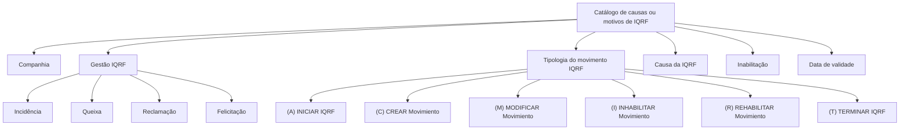

# Definição das Causas de IQRF por Tipo de Gestão

## 1. Metadados do Documento
- **Arquivo de Origem:** Não identificado
- **Tipo de Documento:** Especificação Técnica
- **Domínio / Sistema:** Catálogo de motivos de Incidências, Queixas, Reclamações e Felicitações (IQRF)
- **Público-Alvo:** Negócio, configuração funcional e operação
- **Data/Versão Identificada:** Não identificada

---

## 2. Resumo Executivo & Contexto de Negócio

O documento define um catálogo destinado a classificar as causas ou motivos pelos quais podem ser comunicadas Incidências, Queixas, Reclamações e Felicitações, denominadas IQRF. A classificação é realizada conforme o tipo de gestão IQRF e o momento em que a ocorrência é identificada.

A configuração de cada motivo contempla a companhia à qual a definição se aplica, o tipo de gestão IQRF, a tipologia do movimento IQRF e a causa da IQRF. O catálogo também possui propriedades de inabilitação e data de validade, permitindo controlar a disponibilidade operacional de um motivo e manter histórico das alterações nas definições ao longo do tempo.

O documento define valores corporativos para a tipologia de movimento IQRF: iniciar uma IQRF, criar, modificar, inabilitar ou reabilitar um movimento, e terminar uma IQRF. Para o tipo de gestão IQRF, são previstos os valores Incidência, Queixa, Reclamação e Felicitação.

Como recomendação operacional, o documento orienta que os registros do catálogo sejam agrupados e codificados ordenadamente conforme sua natureza, como gravidade e impacto departamental. Não há detalhamento de estrutura técnica, APIs, contratos HTTP, persistência de dados, permissões ou fluxos de integração.

---

## 3. Arquitetura, Componentes & Tecnologias Envolvidas

O conteúdo apresenta uma configuração funcional de catálogo no Sistema, sem descrever arquitetura de software, componentes técnicos, microsserviços, bancos de dados ou tecnologias de implementação.

Os elementos funcionais identificados são:

- **Catálogo de motivos de IQRF por tipologia de gestão:** estrutura para configurar e classificar causas ou motivos de IQRF.
- **Companhia:** código da companhia sobre a qual a configuração é realizada.
- **Gestão IQRF:** classificação da ocorrência como Incidência, Queixa, Reclamação ou Felicitação.
- **Tipologia do movimento IQRF:** momento ou ação do ciclo de vida sobre o qual o motivo é configurado.
- **Causa da IQRF:** classificação do motivo.
- **Inabilitação:** indicador que impede o uso operacional de um motivo configurado.
- **Data de validade:** data a partir da qual uma classificação de motivo passa a estar plenamente operativa.



> **Nota de Análise:** O documento menciona o “Sistema”, mas não identifica seu nome, tecnologia, interfaces, métodos HTTP, contratos JSON ou mecanismos de integração.

---

## 4. Regras de Negócio, Especificações Funcionais & Processos

### 4.1 Objetivo do catálogo

O catálogo deve ser utilizado para catalogar causas ou motivos pelos quais podem ser comunicadas:

- Incidências;
- Queixas;
- Reclamações;
- Felicitações.

A catalogação deve considerar:

1. O tipo de gestão IQRF.
2. O momento em que a IQRF é identificada.
3. A tipologia do movimento IQRF associada à configuração do motivo.

### 4.2 Associação da configuração à companhia

Cada configuração de motivo deve conter o código da companhia sobre a qual a configuração está sendo realizada. O documento não descreve o formato, tamanho, domínio de valores ou mecanismo de validação do código de companhia.

### 4.3 Gestão IQRF

A propriedade **Gestão IQRF** determina o tipo de gestão IQRF ao qual pertence o motivo configurado. Os valores previstos são:

- Incidência;
- Queixa;
- Reclamação;
- Felicitação.

### 4.4 Tipologia do movimento IQRF

A propriedade **Tipologia do movimento IQRF** determina a tipologia do movimento sobre a qual a configuração do motivo está sendo realizada.

Os valores considerados corporativamente são:

1. **(A) INICIAR IQRF**
2. **(C) CREAR Movimiento**
3. **(M) MODIFICAR Movimiento**
4. **(I) INHABILITAR Movimiento**
5. **(R) REHABILITAR Movimiento**
6. **(T) TERMINAR IQRF**

### 4.5 Causa da IQRF

A propriedade **Causa da IQRF** determina a classificação do motivo. O documento não fornece uma lista de causas, códigos de causa, regras de obrigatoriedade ou relacionamento entre causas e tipos de gestão IQRF.

### 4.6 Inabilitação

A propriedade **Inabilitação** estabelece que a informação do motivo configurado está inabilitada para ser empregada nos processos operacionais da entidade.

Assim, um motivo marcado como inabilitado não deve ser utilizado pelos processos operacionais da entidade, conforme a definição funcional apresentada.

### 4.7 Data de validade

A propriedade **Data de Validade** informa ao Sistema a data a partir da qual a classificação de motivo por tipologia de gestão de uma IQRF registrada estará plenamente operativa.

O uso correto da data de validade permite manter um histórico das alterações efetuadas nas definições do catálogo ao longo do tempo.

### 4.8 Recomendação de codificação e organização

Como boa prática, os registros do catálogo devem ser:

- agrupados;
- codificados de forma ordenada;
- organizados de acordo com sua natureza.

Os critérios de natureza citados como exemplos são:

- gravidade;
- impacto departamental.

> **Nota de Análise:** O documento não especifica convenções obrigatórias de codificação, formatos de identificadores, níveis de gravidade, departamentos ou regras de precedência entre registros.

---

## 5. Tabelas de Parâmetros, Ambientes e Estruturas de Dados

| Item / Parâmetro | Descrição / Função | Tipo / Valores / Formato | Ambiente / Observações |
| :--- | :--- | :--- | :--- |
| Catálogo de motivos de IQRF | Cataloga causas ou motivos para comunicação de Incidências, Queixas, Reclamações e Felicitações. | Não detalhado. | Configurado de acordo com tipo de gestão e momento de identificação. |
| Companhia | Contém o código da companhia sobre a qual a configuração é realizada. | Código de companhia; formato não informado. | Propriedade geral do catálogo. |
| Gestão IQRF | Determina o tipo de gestão IQRF ao qual pertence o motivo configurado. | Incidência; Queixa; Reclamação; Felicitação. | Propriedade geral do catálogo. |
| Tipologia do movimento IQRF | Determina a tipologia do movimento sobre a qual é realizada a configuração do motivo. | (A) INICIAR IQRF; (C) CREAR Movimiento; (M) MODIFICAR Movimiento; (I) INHABILITAR Movimiento; (R) REHABILITAR Movimiento; (T) TERMINAR IQRF. | Valores considerados corporativamente. |
| Causa da IQRF | Determina a classificação do motivo. | Não detalhado. | O documento não fornece catálogo de causas. |
| Inabilitação | Indica que a informação do motivo configurado está inabilitada para uso operacional. | Indicador; formato não informado. | Impede o emprego do motivo nos processos operacionais da entidade. |
| Data de Validade | Indica a data a partir da qual uma classificação de motivo estará plenamente operativa no Sistema. | Data; formato não informado. | Permite manter histórico das alterações nas definições. |
| Critérios de agrupamento e codificação | Referências para organizar registros do catálogo. | Gravidade; impacto departamental; outros critérios de natureza não especificados. | Apresentado como boa prática local. |

### Relação de documentos vinculados

| Documento / Referência | Finalidade indicada |
| :--- | :--- |
| Definición Incidencias, Quejas, Reclamaciones y Felicitaciones | Documento funcional recomendado para evitar interpretação isolada incorreta desta entrada. |
| Preguntas frecuentes | Referência vinculada; conteúdo não apresentado no material fornecido. |

---

## 6. Bateria de Perguntas & Respostas para RAG (FAQ Sintético)

### P1: Qual é o objetivo do catálogo de causas de IQRF por tipo de gestão?
**R:** O catálogo tem o objetivo de catalogar as causas ou motivos pelos quais podem ser comunicadas Incidências, Queixas, Reclamações e Felicitações. A catalogação deve ocorrer de acordo com o tipo de gestão IQRF e com o momento em que a ocorrência é identificada.

### P2: Quais tipos de gestão IQRF podem ser associados a um motivo configurado?
**R:** A propriedade Gestão IQRF pode assumir os valores Incidência, Queixa, Reclamação e Felicitação. Essa propriedade determina a qual tipo de gestão IQRF pertence o motivo que está sendo configurado.

### P3: Para que serve o atributo Companhia no catálogo de motivos de IQRF?
**R:** O atributo Companhia contém o código da companhia sobre a qual a configuração do catálogo está sendo realizada. O texto não define o formato nem os valores possíveis desse código.

### P4: Quais são as tipologias corporativas de movimento IQRF?
**R:** As tipologias corporativas de movimento IQRF são: (A) INICIAR IQRF, (C) CREAR Movimiento, (M) MODIFICAR Movimiento, (I) INHABILITAR Movimiento, (R) REHABILITAR Movimiento e (T) TERMINAR IQRF.

### P5: O que a propriedade Tipologia do movimento IQRF determina?
**R:** A propriedade Tipologia do movimento IQRF determina a tipologia do movimento sobre a qual a configuração do motivo está sendo realizada. Ela vincula o motivo configurado a uma das seis ações corporativas previstas para o ciclo de vida da IQRF.

### P6: Qual é a finalidade da propriedade Causa da IQRF?
**R:** A propriedade Causa da IQRF determina a classificação do motivo. O documento não apresenta uma relação de causas, códigos, regras de preenchimento ou critérios de associação entre causas e tipos de gestão IQRF.

### P7: O que acontece quando um motivo é marcado como inabilitado?
**R:** Quando a propriedade Inabilitação estabelece que a informação do motivo configurado está inabilitada, esse motivo não pode ser empregado nos processos operacionais da entidade.

### P8: Como a Data de Validade é utilizada na configuração de motivos de IQRF?
**R:** A Data de Validade informa ao Sistema a data a partir da qual a classificação de motivo por tipologia de gestão de uma IQRF registrada estará plenamente operativa. Seu uso correto permite manter histórico das alterações realizadas nas definições do catálogo ao longo do tempo.

### P9: Existe uma recomendação para codificação local dos registros do catálogo?
**R:** Sim. O documento recomenda, como boa prática, agrupar e codificar ordenadamente os registros do catálogo de acordo com sua natureza, citando gravidade e impacto departamental como exemplos de critérios.

### P10: O documento define APIs, tecnologias ou contratos de integração para o catálogo IQRF?
**R:** Não. O conteúdo fornecido não detalha APIs, métodos HTTP, contratos JSON, tecnologias, persistência, ambientes ou componentes técnicos de integração. O material concentra-se nas propriedades funcionais do catálogo.

---

## 7. Glossário de Termos, Siglas & Conceitos-Chave

- **IQRF:** Incidências, Queixas, Reclamações e Felicitações.
- **Gestão IQRF:** Tipo de gestão ao qual pertence um motivo configurado: Incidência, Queixa, Reclamação ou Felicitação.
- **Tipologia do movimento IQRF:** Classificação do movimento ou ação sobre a qual o motivo é configurado.
- **Causa da IQRF:** Propriedade que determina a classificação do motivo.
- **Inabilitação:** Propriedade que torna a informação de um motivo indisponível para os processos operacionais da entidade.
- **Data de Validade:** Data a partir da qual uma classificação de motivo por tipologia de gestão está plenamente operativa no Sistema.
- **(A) INICIAR IQRF:** Tipologia corporativa de movimento para iniciar uma IQRF.
- **(C) CREAR Movimiento:** Tipologia corporativa de movimento para criar um movimento.
- **(M) MODIFICAR Movimiento:** Tipologia corporativa de movimento para modificar um movimento.
- **(I) INHABILITAR Movimiento:** Tipologia corporativa de movimento para inabilitar um movimento.
- **(R) REHABILITAR Movimiento:** Tipologia corporativa de movimento para reabilitar um movimento.
- **(T) TERMINAR IQRF:** Tipologia corporativa de movimento para terminar uma IQRF.

---

## 8. Notas Críticas, Riscos & Limitações

- O arquivo de origem, a data, a versão e o sistema específico não foram identificados no texto fornecido.
- O documento não apresenta lista de causas de IQRF, códigos de motivos, modelos de dados, regras de obrigatoriedade ou critérios de validação.
- Não há descrição de APIs, tecnologias, arquitetura de infraestrutura, integrações, permissões, perfis de acesso ou ambientes.
- O documento recomenda a leitura de “Definición Incidencias, Quejas, Reclamaciones y Felicitaciones” para evitar interpretações isoladas incorretas.
- A referência “Preguntas frecuentes” é citada, porém seu conteúdo não está incluído.
- A recomendação de organização por gravidade e impacto departamental é apresentada como boa prática, sem detalhar uma taxonomia ou padrão obrigatório.
- A data de validade é relevante para histórico de alterações; configurações incorretas dessa data podem afetar o momento em que uma classificação se torna operativa.

---

## 9. Conteúdo Bruto Estruturado (Referência Fiel)

```text
--- [PÁGINA 1 DE 3] ---

DEFINICIÓN de las CAUSAS de las IQRF's por
Tipo de Gestión
Objetivo
Catalogar las causas o motivos por las que se pueden comunicar las Incidencias, Quejas,
Reclamaciones (así como de las Felicitaciones) de acuerdo al tipo de gestión y al momento en el que
se identifican.
Propiedades Generales
Otras Propiedades
Propiedades Generales
Compañía
Este Atributo del catálogo de definición de los motivos de las IQRF's por tipología de su gestión
contiene el código de la compañía sobre la cual se está realizando la configuración.
Gestión IQRF
Esta propiedad determina el tipo de gestión IQRF a la que pertenece el motivo que se esté
configurando pudiendo ser sus valores:
Incidencia.
Queja.
Reclamación, y
 / 
 CF
Home Solutions APIs Documentation Zeus
EN


--- [PÁGINA 2 DE 3] ---

Felicitación.
Tipología del movimiento IQRF
Esta propiedad determina la tipología del movimiento sobre la que se está realizando la configuración
del Motivo.
Los valores que se han considerado corporativamente son:
(A) INICIAR IQRF
(C) CREAR Movimiento
(M) MODIFICAR Movimiento
(I) INHABILITAR Movimiento
(R) REHABILITAR Movimiento
(T) TERMINAR IQRF
Causa de la IQRF
Esta propiedad determina la clasificación del motivo.
Otras Propiedades
Inhabilitación
Esta propiedad establece que el la información del motivo configurado está inhabilitada para poder
ser empleada en los procesos operativos de la entidad.
Fecha de Validez
Esta propiedad le indica al Sistema la fecha a partir de la cual la clasificación de motivo por tipología
de gestión de una IQRF registrada estará plenamente operativa en el sistema por lo que su correcto
uso permite tener un histórico de los cambios efectuados en sus definiciones a lo largo del tiempo.
Vínculos
Relación de Directrices y Documentos funcionales cuya lectura recomendada para evitar que la
interpretación aislada de la presente entrada pueda conducir a error.
Definición Incidencias, Quejas, Reclamaciones y Felicitaciones
Preguntas frecuentes


--- [PÁGINA 3 DE 3] ---

(1) ¿Existe alguna recomendación que pueda o deba ser tomada en cuenta localmente en la
codificación, uso y definición del catálogo de motivos de las IQRF's por tipología de gestión en el
Sistema?
Es una buena práctica agrupar y codificar ordenadamente los registros de este catálogo de acuerdo
con su naturaleza: gravedad, impacto departamental, ...
```
