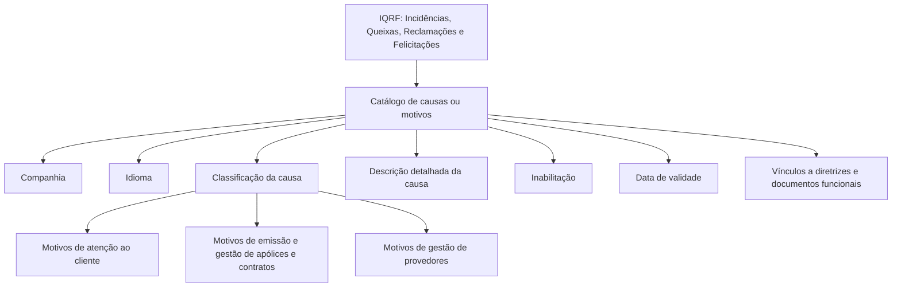

# Catálogo de Causas ou Motivos de IQRF — Definição, Propriedades e Exemplos de Classificação

## 1. Metadados do Documento
- **Arquivo de Origem:** `Não identificado no conteúdo extraído`
- **Tipo de Documento:** Procedimento / Especificação Funcional
- **Domínio / Sistema:** Gestão de Incidências, Queixas, Reclamações e Felicitações (IQRF)
- **Público-Alvo:** Negócio, operação, configuração funcional e gestão de catálogos
- **Data/Versão Identificada:** Não identificada

---

## 2. Resumo Executivo & Contexto de Negócio

O documento define o catálogo de causas ou motivos associados às IQRF — Incidências, Queixas, Reclamações e Felicitações. O objetivo declarado é homogeneizar a informação utilizada na gestão dessas comunicações, por meio da catalogação das causas originárias ou precursoras das IQRF.

A classificação de motivos permite registrar o motivo pelo qual uma IQRF foi comunicada e detalhar a causa associada. O documento estabelece propriedades de configuração, incluindo companhia, idioma, causa da IQRF, descrição da causa, inabilitação e data de validade.

A classificação pode ser desagregada e ter seu nível de detalhe ampliado conforme o nível de maturidade da entidade. O conteúdo apresenta exemplos de causas ligadas à atenção ao cliente, ao processo de emissão e gestão de apólices e contratos, e ao processo de gestão de provedores.

A data de validade permite preservar um histórico das mudanças efetuadas nas definições do catálogo ao longo do tempo. O documento também recomenda a leitura de diretrizes e documentos funcionais relacionados, para evitar interpretações isoladas incorretas.

---

## 3. Arquitetura, Componentes & Tecnologias Envolvidas

O conteúdo não descreve arquitetura de software, integrações, tecnologias, APIs, ambientes técnicos, URLs ou contratos de serviço. A estrutura funcional identificada é um catálogo de configuração empregado nos processos operativos da entidade para classificar IQRF.



**Nota de Análise:** O texto menciona “Home Solutions APIs Documentation Zeus” e “CF”, porém não explica o significado, a função, a arquitetura, os métodos HTTP, os contratos JSON ou a relação desses termos com o catálogo de IQRF.

---

## 4. Regras de Negócio, Especificações Funcionais & Processos

### Objetivo do catálogo

- Catalogar as causas ou motivos que podem provocar a existência de Incidências, Queixas, Reclamações ou Felicitações.
- Homogeneizar a informação utilizada na gestão de IQRF.
- Registrar causas originárias ou precursoras das IQRF.

### Classificação da causa da IQRF

A propriedade **Causa da IQRF** determina a classificação do motivo. Conforme o nível de maturidade da entidade, o detalhe dessa classificação pode ser desagregado e ampliado.

### Motivos relacionados à atenção ao cliente

- Trato ou atenção inadequada.
- Informação insuficiente ou deficiente.

### Motivos relacionados ao processo de emissão — gestão de apólices e contratos

- Discordância com o orçamento.
- Discordância com a documentação.
- Atraso na emissão da apólice.
- Atraso no recebimento da documentação.
- Discordância com o prêmio da renovação.
- Incidência na modificação dos dados da apólice.
- Incidência na gestão do recibo.
- Incidência na gestão do cancelamento da apólice.
- Incidência na gestão da anulação da apólice.

### Motivos relacionados ao processo de gestão de provedores

- Discordância pelos tempos de espera dos atendimentos médicos.
- Discordância com o resultado da prestação.
- Descumprimento de compromissos no agendamento.
- Descumprimento de compromissos nos prazos de contato.
- Descumprimento de compromissos na resolução.
- Falta de consentimento informado.
- Falta de organização do centro médico.
- Trato pessoal inadequado.
- Valores incorretos, com prestação cobrada ao cliente.
- Inclusões com erros e faturas sem facilidades de pagamento.

### Descrição da causa

A propriedade **Descrição da Causa** contém a descrição detalhada da causa ou do motivo pelo qual a IQRF é comunicada.

### Inabilitação

A propriedade **Inabilitação** estabelece que a informação do motivo configurado está inabilitada para emprego nos processos operativos da entidade.

### Data de validade

A propriedade **Data de Validade** indica ao sistema a data a partir da qual a classificação de motivo de uma IQRF registrada estará plenamente operativa. O uso correto dessa propriedade permite manter histórico das alterações realizadas nas definições do catálogo ao longo do tempo.

### Vínculos documentais

O catálogo possui vínculos para diretrizes e documentos funcionais cuja leitura é recomendada. A finalidade é evitar que a interpretação isolada da entrada do catálogo conduza a erro.

### Recomendação local de codificação

O documento indica como boa prática agrupar e codificar ordenadamente os registros do catálogo de acordo com sua natureza, incluindo exemplos como:

- Gravidade.
- Impacto departamental.

---

## 5. Tabelas de Parâmetros, Ambientes e Estruturas de Dados

| Item / Parâmetro | Descrição / Função | Tipo / Valores / Formato | Ambiente / Observações |
| :--- | :--- | :--- | :--- |
| Companhia | Contém o código da companhia sobre a qual está sendo realizada a configuração. | Código de companhia | Propriedade geral do catálogo. |
| Idioma | Determina a chave do idioma empregado na definição da classificação do motivo. | Exemplos: espanhol, inglês, português | Propriedade geral do catálogo. |
| Causa da IQRF | Determina a classificação do motivo. | Classificação de causa ou motivo | Pode ser desagregada e ampliada conforme a maturidade da entidade. |
| Descrição da Causa | Contém a descrição detalhada da causa ou motivo pelo qual a IQRF é comunicada. | Texto descritivo | Associada à causa ou ao motivo configurado. |
| Inabilitação | Define que a informação do motivo configurado não poderá ser usada nos processos operativos da entidade. | Estado de inabilitação | O documento não informa os valores técnicos possíveis. |
| Data de Validade | Indica a data a partir da qual a classificação de motivo estará plenamente operativa no sistema. | Data | Permite manter histórico das mudanças nas definições. |
| Vínculos | Relaciona diretrizes e documentos funcionais recomendados para leitura. | Relação documental | Evita erro por interpretação isolada da entrada. |
| Atenção ao Cliente | Grupo de motivos relacionados ao atendimento ao cliente. | Categoria de causa | Inclui trato inadequado e informação insuficiente ou deficiente. |
| Emissão — Gestão de Apólices e Contratos | Grupo de motivos relacionados ao processo de emissão, apólices e contratos. | Categoria de causa | Inclui orçamento, documentação, emissão, renovação, recibo, cancelamento e anulação. |
| Gestão de Provedores | Grupo de motivos relacionados aos provedores e atendimentos médicos. | Categoria de causa | Inclui espera, resultado da prestação, agendamento, contato, resolução, consentimento, organização, trato pessoal e cobranças. |

| Categoria de Motivo | Motivo ou Causa Apresentada | Observação |
| :--- | :--- | :--- |
| Atenção ao Cliente | Trato ou atenção inadequada | Exemplo de motivo. |
| Atenção ao Cliente | Informação insuficiente ou deficiente | Exemplo de motivo. |
| Emissão — Gestão de Apólices e Contratos | Discordância com o orçamento | Exemplo de motivo. |
| Emissão — Gestão de Apólices e Contratos | Discordância com a documentação | Exemplo de motivo. |
| Emissão — Gestão de Apólices e Contratos | Atraso na emissão da apólice | Exemplo de motivo. |
| Emissão — Gestão de Apólices e Contratos | Atraso no recebimento da documentação | Exemplo de motivo. |
| Emissão — Gestão de Apólices e Contratos | Discordância com o prêmio da renovação | Exemplo de motivo. |
| Emissão — Gestão de Apólices e Contratos | Incidência na modificação dos dados da apólice | Exemplo de motivo. |
| Emissão — Gestão de Apólices e Contratos | Incidência na gestão do recibo | Exemplo de motivo. |
| Emissão — Gestão de Apólices e Contratos | Incidência na gestão do cancelamento da apólice | Exemplo de motivo. |
| Emissão — Gestão de Apólices e Contratos | Incidência na gestão da anulação da apólice | Exemplo de motivo. |
| Gestão de Provedores | Discordância pelos tempos de espera dos atendimentos médicos | Exemplo de motivo. |
| Gestão de Provedores | Discordância com o resultado da prestação | Exemplo de motivo. |
| Gestão de Provedores | Descumprimento de compromissos no agendamento | Exemplo de motivo. |
| Gestão de Provedores | Descumprimento de compromissos nos prazos de contato | Exemplo de motivo. |
| Gestão de Provedores | Descumprimento de compromissos na resolução | Exemplo de motivo. |
| Gestão de Provedores | Falta de consentimento informado | Exemplo de motivo. |
| Gestão de Provedores | Falta de organização do centro médico | Exemplo de motivo. |
| Gestão de Provedores | Trato pessoal inadequado | Exemplo de motivo. |
| Gestão de Provedores | Valores incorretos, com prestação cobrada ao cliente | Exemplo de motivo. |
| Gestão de Provedores | Inclusões com erros e faturas sem facilidades de pagamento | Exemplo de motivo. |

---

## 6. Bateria de Perguntas & Respostas para RAG (FAQ Sintético)

### P1: Qual é o objetivo do catálogo de causas ou motivos das IQRF?
**R:** O catálogo tem o objetivo de catalogar as causas ou motivos que podem provocar Incidências, Queixas, Reclamações ou Felicitações, homogeneizando a informação utilizada na gestão de IQRF.

### P2: O que significa IQRF no contexto do documento?
**R:** IQRF significa Incidências, Queixas, Reclamações e Felicitações. O catálogo classifica as causas ou motivos originários ou precursores dessas comunicações.

### P3: Qual é a função da propriedade Companhia no catálogo de motivos de IQRF?
**R:** A propriedade Companhia contém o código da companhia sobre a qual a configuração do catálogo de definição do motivo de IQRF está sendo realizada.

### P4: Como o idioma é usado na definição de um motivo de IQRF?
**R:** A propriedade Idioma determina a chave do idioma utilizada na definição da classificação do motivo. O documento cita espanhol, inglês e português como exemplos.

### P5: O que a propriedade Causa da IQRF determina?
**R:** A propriedade Causa da IQRF determina a classificação do motivo. O detalhe dessa classificação pode ser desagregado e ampliado conforme o nível de maturidade da entidade.

### P6: Quais causas de IQRF estão relacionadas à atenção ao cliente?
**R:** O documento apresenta trato ou atenção inadequada e informação insuficiente ou deficiente como motivos relacionados à atenção ao cliente.

### P7: Quais exemplos de motivos estão associados à emissão e gestão de apólices e contratos?
**R:** Entre os exemplos estão discordância com orçamento ou documentação, atraso na emissão da apólice, atraso no recebimento da documentação, discordância com o prêmio da renovação e incidências na modificação de dados da apólice, gestão de recibo, cancelamento ou anulação da apólice.

### P8: Quais motivos de IQRF são apresentados para a gestão de provedores?
**R:** O documento cita discordância com tempos de espera de atendimentos médicos ou com o resultado da prestação, descumprimentos de compromissos em agendamento, contato ou resolução, falta de consentimento informado, falta de organização do centro médico, trato pessoal inadequado, valores incorretos cobrados ao cliente e inclusões com erros ou faturas sem facilidades de pagamento.

### P9: O que representa a Descrição da Causa?
**R:** A Descrição da Causa contém a descrição detalhada da causa ou do motivo pelo qual a IQRF é comunicada.

### P10: Qual é o efeito da propriedade Inabilitação?
**R:** A propriedade Inabilitação estabelece que a informação do motivo configurado está inabilitada para ser empregada nos processos operativos da entidade.

### P11: Por que a Data de Validade é importante para uma classificação de motivo?
**R:** A Data de Validade informa ao sistema a data a partir da qual a classificação de motivo de uma IQRF registrada estará plenamente operativa. O uso correto da data permite manter histórico das mudanças realizadas nas definições do catálogo.

### P12: Qual recomendação o documento apresenta para a codificação local do catálogo?
**R:** O documento indica como boa prática agrupar e codificar ordenadamente os registros do catálogo conforme sua natureza, usando exemplos como gravidade e impacto departamental.

---

## 7. Glossário de Termos, Siglas & Conceitos-Chave

- **IQRF:** Incidências, Queixas, Reclamações e Felicitações.
- **Catálogo de causas ou motivos:** Estrutura de configuração destinada a classificar causas originárias ou precursoras de IQRF.
- **Causa da IQRF:** Propriedade que determina a classificação do motivo.
- **Descrição da Causa:** Propriedade que registra a descrição detalhada do motivo pelo qual a IQRF é comunicada.
- **Inabilitação:** Propriedade que impede o uso da informação de um motivo configurado nos processos operativos da entidade.
- **Data de Validade:** Data a partir da qual uma classificação de motivo estará plenamente operativa no sistema.
- **Companhia:** Código da companhia sobre a qual está sendo realizada a configuração.
- **Idioma:** Chave do idioma usada na definição da classificação de motivo.
- **Vínculos:** Relação de diretrizes e documentos funcionais cuja leitura é recomendada.
- **CF:** Sigla apresentada no conteúdo bruto sem expansão ou definição.
- **Home Solutions APIs Documentation Zeus:** Texto apresentado no conteúdo bruto sem explicação adicional sobre função ou relação com o catálogo de IQRF.

---

## 8. Notas Críticas, Riscos & Limitações

- O documento não identifica nome de arquivo, data, versão, proprietário, sistema técnico ou ambiente de execução.
- O conteúdo não descreve arquitetura de software, banco de dados, APIs, endpoints, autenticação, integrações, URLs, logs ou procedimentos de implantação.
- A lista de causas da gestão de provedores termina com “...”, indicando que os exemplos apresentados não constituem necessariamente uma lista completa.
- O documento não informa valores técnicos, formato, obrigatoriedade, regras de atualização ou mecanismo de persistência para Companhia, Idioma, Inabilitação e Data de Validade.
- A classificação da causa pode ser desagregada conforme a maturidade da entidade, mas o documento não define níveis de maturidade nem critérios para essa desagregação.
- A leitura de diretrizes e documentos funcionais vinculados é recomendada para reduzir o risco de interpretação isolada e incorreta da entrada do catálogo.
- **Nota de Análise:** O documento lista “Home Solutions APIs Documentation Zeus” e “CF”, porém não detalha seus significados, integrações ou responsabilidades.

---

## 9. Conteúdo Bruto Estruturado (Referência Fiel)

```text
--- [PÁGINA 1 DE 3] ---

DEFINICIÓN de las CAUSAS o MOTIVOS de las
IQRF's
Contexto
Al efecto de homogeneizar la información en la Gestión de las Incidencias, Quejas, Reclamaciones y
Felicitaciones se deben catalogar las causas originarias o precursoras de las IQRF's.
Objetivo
Catalogar las causas o motivos que pueden provocar la existencia de las Incidencias, Quejas,
Reclamaciones o Felicitaciones.
Propiedades Generales
Otras Propiedades
Propiedades Generales
Compañía
Este Atributo del catálogo de definición del motivo de las IQRF's contiene el código de la compañía
sobre la cual se está realizando la configuración.
Idioma.
Esta propiedad de la clasificación del motivo determina la clave del idioma empleado en su definición
como por ejemplo: español, inglés, portugués, ...
 /
 CF
Home Solutions APIs Documentation Zeus
EN


--- [PÁGINA 2 DE 3] ---

Causa de la IQRF
Esta propiedad determina la clasificación del motivo.
Dependiendo del nivel de madurez de la entidad, se podrá desagregar y ampliar el detalle de
este elemento de configuración.
Motivos relacionados con la Atención al Cliente:
Trato o atención inadecuada.
Información insuficiente o deficiente.
Motivos relacionados con el Proceso de Emisión - Gestión de Pólizas y Contratos:
Disconformidad con el Presupuesto.
Disconformidad con la documentación.
Retraso en la emisión de la póliza.
Retraso en la recepción de la documentación.
Disconformidad con la prima de la renovación.
Incidencia en la modificación de los datos póliza.
Incidencia en la gestión del recibo.
Incidencia en la gestión de la Cancelación de la póliza.
Incidencia en la gestión de la Anulación de la póliza.
Motivos relacionados con el Proceso de Gestión de Proveedores:
Disconformidad por los tiempos de espera de las atenciones médicas.
Disconformidad con el resultado de la prestación.
Incumplimiento de compromisos en la cita.
Incumplimiento de compromisos en los plazos de contacto.
Incumplimiento de compromisos en la de resolución.
Falta de consentimiento informado.
Falta de organización del centro médico.
Trato personal inadecuado.
Importes erróneos (prestación con cargo al cliente).
Altas con errores y facturas sin facilidades de pago.
...
Consejo:


--- [PÁGINA 3 DE 3] ---

Descripción de la Causa
Este atributo contiene la descripción detallada de la causa o motivo por el que se comunica la IQRF.
Otras Propiedades
Inhabilitación
Esta propiedad establece que el la información del motivo configurado está inhabilitada para poder
ser empleada en los procesos operativos de la entidad.
Fecha de Validez
Esta propiedad le indica al Sistema la fecha a partir de la cual la clasificación de motivo de una IQRF
registrada estará plenamente operativa en el sistema por lo que su correcto uso permite tener un
histórico de los cambios efectuados en sus definiciones a lo largo del tiempo.
Vínculos
Relación de Directrices y Documentos funcionales cuya lectura recomendada para evitar que la
interpretación aislada de la presente entrada pueda conducir a error.
Definición Incidencias, Quejas, Reclamaciones y Felicitaciones
Preguntas frecuentes
(1) ¿Existe alguna recomendación que pueda o deba ser tomada en cuenta localmente en la
codificación, uso y definición del catálogo de motivos de las IQRF's en el Sistema?
Puede ser una buena práctica agrupar y codificar ordenadamente los registros de este catálogo de
acuerdo con su naturaleza: gravedad, impacto departamental, ...
```
