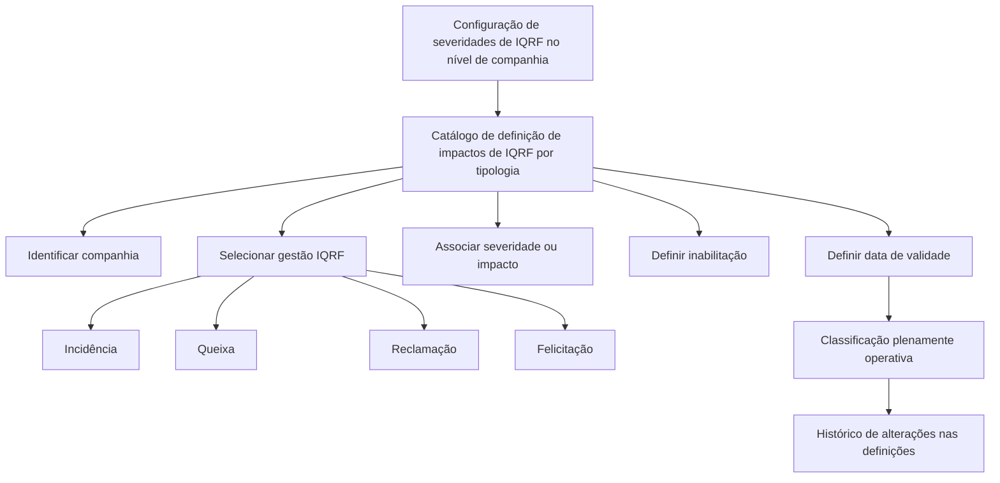

# Definição da Severidade das IQRF por Tipo de Gestão

## 1. Metadados do Documento
- **Arquivo de Origem:** Não identificado no conteúdo fornecido
- **Tipo de Documento:** Especificação Técnica / Funcional
- **Domínio / Sistema:** Catálogo de definição de impactos e severidades de IQRF
- **Público-Alvo:** Negócio, analistas funcionais, operação e equipes responsáveis pela configuração de catálogos
- **Data/Versão Identificada:** Não identificada

---

## 2. Resumo Executivo & Contexto de Negócio

O documento descreve a configuração da severidade, também denominada impacto, das IQRF de acordo com o tipo de gestão. A configuração ocorre após a definição das severidades de IQRF no nível de companhia e permite catalogar impactos associados às tipologias de Incidência, Queixa, Reclamação e Felicitação.

O objetivo funcional é associar uma classificação de severidade ou impacto a cada configuração de IQRF, considerando a companhia e o tipo de gestão IQRF aplicável. O documento indica que o grau de detalhamento da severidade pode ser ampliado conforme o nível de maturidade da entidade.

A entrada de catálogo possui propriedades gerais para identificar a companhia, o tipo de gestão IQRF e a severidade correspondente. Também possui propriedades adicionais para controlar a disponibilidade operacional do registro e a data a partir da qual a classificação de impacto se torna plenamente operativa.

A propriedade de inabilitação permite impedir que um impacto configurado seja usado na operação. A data de validade suporta a manutenção de histórico das mudanças feitas nas definições de impacto ao longo do tempo.

O documento recomenda a leitura do material funcional relacionado sobre a definição de Incidências, Queixas, Reclamações e Felicitações, pois a interpretação isolada desta entrada pode conduzir a erro. Não há recomendação operacional local adicional registrada para a codificação, uso ou definição da tabela de anotações do sistema; a resposta fornecida é `N/A`.

---

## 3. Arquitetura, Componentes & Tecnologias Envolvidas

O conteúdo fornecido não descreve arquitetura de software, integrações, métodos HTTP, contratos JSON, bancos de dados, servidores, ambientes ou tecnologias de implementação.

O fluxo funcional explicitamente descrito corresponde à configuração de impactos/severidades de IQRF por companhia e tipo de gestão, com controles de inabilitação e data de validade.



### Componentes funcionais identificados

| Componente / Conceito | Função descrita no documento | Detalhamento disponível |
| :--- | :--- | :--- |
| Catálogo de definição de impactos de IQRF | Mantém a configuração de impactos ou severidades das IQRF conforme a tipologia. | O documento descreve propriedades funcionais do catálogo, mas não informa implementação técnica. |
| Companhia | Identifica o código da companhia para a qual a configuração está sendo realizada. | Não são apresentados códigos, lista de companhias ou regras de validação. |
| Gestão IQRF | Determina o tipo de gestão ao qual pertence o motivo configurado. | Valores informados: Incidência, Queixa, Reclamação e Felicitação. |
| Severidade da IQRF | Determina a classificação de severidade ou impacto associada à IQRF. | O nível de detalhamento pode ser expandido de acordo com a maturidade da entidade. |
| Inabilitação | Indica que o registro de impacto configurado não pode ser utilizado operacionalmente. | Não são detalhados valores, mecanismo de ativação ou comportamento técnico. |
| Data de Validade | Define a data a partir da qual a classificação de impacto registrada está plenamente operativa. | Permite preservar histórico de alterações nas definições. |
| Documento funcional relacionado | Material recomendado para evitar interpretação isolada incorreta. | Referência: “Definición Incidencias, Quejas, Reclamaciones y Felicitaciones”. |

> **Nota de Análise:** O texto contém os termos “Home Solutions APIs Documentation”, “Zeus”, “EN” e “CF” como fragmentos aparentes de navegação ou extração. O conteúdo não descreve a relação desses termos com o catálogo de severidades de IQRF; portanto, não é possível afirmar que sejam sistemas, APIs, ambientes ou componentes da solução.

---

## 4. Regras de Negócio, Especificações Funcionais & Processos

### 4.1. Pré-condição de configuração

1. As severidades de IQRF devem ter sido configuradas no nível de companhia.
2. Após a configuração em nível de companhia, as severidades ou impactos devem ser catalogados de acordo com a tipologia de IQRF.

### 4.2. Classificação por tipo de gestão IQRF

A propriedade **Gestão IQRF** determina o tipo de gestão ao qual pertence o motivo que está sendo configurado. Os valores apresentados no documento são:

1. Incidência.
2. Queixa.
3. Reclamação.
4. Felicitação.

### 4.3. Associação de severidade ou impacto

A propriedade **Severidade da IQRF** determina a classificação de severidade ou impacto associada à IQRF. O documento estabelece que:

- A severidade está vinculada à IQRF configurada.
- A classificação pode ser desagregada.
- O detalhamento da classificação pode ser ampliado.
- A ampliação do detalhe depende do nível de maturidade da entidade.

O documento não fornece níveis concretos de severidade, escalas, códigos, critérios de priorização, fórmulas de cálculo ou regras de associação entre uma tipologia IQRF e uma severidade específica.

### 4.4. Controle de uso operacional

A propriedade **Inabilitação** estabelece que um registro de impacto configurado fica inabilitado para utilização operacional. Portanto:

- Um impacto marcado como inabilitado não deve ser utilizado na operação.
- O documento não especifica se a inabilitação é temporária, reversível, automática ou sujeita a autorização.

### 4.5. Vigência e histórico

A propriedade **Data de Validade** define a data a partir da qual a classificação de impacto de uma IQRF registrada estará plenamente operativa no sistema.

O uso correto da data de validade permite:

1. Controlar a entrada em vigor de uma classificação de impacto.
2. Manter histórico das alterações realizadas nas definições.
3. Consultar mudanças ocorridas ao longo do tempo.

O documento não especifica comportamento para datas futuras, datas vencidas, sobreposição de vigências, fuso horário, formato de data ou tratamento de registros sem data de validade.

### 4.6. Dependência documental

O documento indica vínculo com diretrizes e documentos funcionais cuja leitura é recomendada. A finalidade dessa dependência é evitar que a interpretação isolada desta entrada leve a conclusões incorretas.

Documento relacionado identificado:

- **Definición Incidencias, Quejas, Reclamaciones y Felicitaciones**

### 4.7. Recomendação operacional local

A pergunta frequente apresentada é:

> “¿Existe alguna recomendación operativa que deba ser tomada en consideración localmente en la codificación, uso y definición de la tabla de Anotaciones del Sistema?”

A resposta fornecida pelo documento é:

- `N/A`

Não há recomendação operacional local adicional detalhada.

---

## 5. Tabelas de Parâmetros, Ambientes e Estruturas de Dados

| Item / Parâmetro | Descrição / Função | Tipo / Valores / Formato | Ambiente / Observações |
| :--- | :--- | :--- | :--- |
| Companhia | Contém o código da companhia sobre a qual a configuração está sendo realizada. | Código de companhia; formato não informado. | Propriedade geral do catálogo de definição de impactos de IQRF. |
| Gestão IQRF | Determina o tipo de gestão IQRF a que pertence o motivo configurado. | Incidência; Queixa; Reclamação; Felicitação. | Propriedade geral. |
| Severidade da IQRF | Determina a classificação de severidade ou impacto associada à IQRF. | Valores e escala não informados. | O detalhe pode ser desagregado e ampliado conforme a maturidade da entidade. |
| Inabilitação | Indica que o registro do impacto configurado está inabilitado para uso operacional. | Valor ou formato não informado. | Propriedade adicional. |
| Data de Validade | Indica a data a partir da qual a classificação de impacto registrada estará plenamente operativa. | Data; formato não informado. | Permite manter histórico de alterações nas definições ao longo do tempo. |
| Tipologia IQRF | Categoria usada para catalogar severidades ou impactos de IQRF. | Incidência; Queixa; Reclamação; Felicitação. | A categorização ocorre após a configuração das severidades no nível de companhia. |
| Documento funcional vinculado | Material de leitura recomendada para interpretação adequada da entrada. | “Definición Incidencias, Quejas, Reclamaciones y Felicitaciones”. | A leitura é recomendada para evitar interpretação isolada incorreta. |
| Recomendação local para tabela de Anotações do Sistema | Orientação adicional sobre codificação, uso e definição local da tabela. | `N/A`. | O documento não fornece recomendação adicional. |

### Ambientes, servidores e URLs

| Item / Parâmetro | Descrição / Função | Tipo / Valores / Formato | Ambiente / Observações |
| :--- | :--- | :--- | :--- |
| Ambientes técnicos | Não identificados. | Não aplicável. | O documento não informa ambientes de desenvolvimento, homologação ou produção. |
| Servidores | Não identificados. | Não aplicável. | O documento não informa hosts, endereços ou rotas de infraestrutura. |
| URLs | Não identificadas. | Não aplicável. | Não há URL operacional, técnica ou de serviço descrita. |
| Logs | Não identificados. | Não aplicável. | Não há caminhos, níveis ou parâmetros de logging descritos. |

---

## 6. Bateria de Perguntas & Respostas para RAG (FAQ Sintético)

### P1: Qual é o objetivo da definição de severidade das IQRF por tipo de gestão?
**R:** O objetivo é catalogar as severidades ou impactos de Incidências, Queixas, Reclamações e Felicitações de acordo com a respetiva tipologia, depois que as severidades de IQRF forem configuradas no nível de companhia.

### P2: Quais tipos de gestão IQRF podem ser configurados no catálogo?
**R:** A propriedade Gestão IQRF pode assumir os valores Incidência, Queixa, Reclamação e Felicitação. Essa propriedade determina o tipo de gestão a que pertence o motivo que está sendo configurado.

### P3: Qual é a função da propriedade Companhia no catálogo de impactos de IQRF?
**R:** A propriedade Companhia contém o código da companhia sobre a qual a configuração de impactos de IQRF está sendo realizada. O documento não informa o formato do código nem apresenta uma lista de companhias disponíveis.

### P4: O que determina a propriedade Severidade da IQRF?
**R:** A propriedade Severidade da IQRF determina a classificação de severidade ou impacto associada a uma IQRF. O documento informa que essa classificação pode ser desagregada e ampliada conforme o nível de maturidade da entidade, mas não apresenta níveis concretos de severidade.

### P5: O que ocorre quando um impacto configurado está inabilitado?
**R:** Quando a propriedade Inabilitação estabelece que o registro de impacto está inabilitado, esse impacto não pode ser utilizado na operação. O documento não detalha como a inabilitação é configurada nem o processo para reabilitar um registro.

### P6: Para que serve a Data de Validade da classificação de impacto?
**R:** A Data de Validade indica a data a partir da qual a classificação de impacto de uma IQRF registrada estará plenamente operativa no sistema. O uso correto dessa propriedade também permite manter histórico das alterações feitas nas definições ao longo do tempo.

### P7: O documento informa como tratar sobreposição de datas de validade entre classificações de impacto?
**R:** Não. O documento informa apenas que a Data de Validade determina o início da plena operação da classificação e que favorece o histórico de mudanças. Não há regra descrita para sobreposição, expiração, datas futuras ou conflitos de vigência.

### P8: Existe uma recomendação local para a codificação, uso e definição da tabela de Anotações do Sistema?
**R:** Não. A seção de perguntas frequentes responde `N/A` à pergunta sobre recomendações operacionais que devam ser consideradas localmente na codificação, uso e definição da tabela de Anotações do Sistema.

### P9: Qual documento funcional deve ser consultado para complementar esta definição?
**R:** O documento recomenda a leitura de “Definición Incidencias, Quejas, Reclamaciones y Felicitaciones”. Essa leitura é recomendada para evitar que a interpretação isolada da definição de severidades de IQRF conduza a erro.

### P10: O documento descreve APIs, métodos HTTP ou contratos de integração para o catálogo de IQRF?
**R:** Não. O documento não detalha APIs, métodos HTTP, contratos JSON, integrações, tecnologias de implementação ou mecanismos técnicos para manutenção do catálogo de impactos de IQRF.

### P11: É possível afirmar quais níveis de severidade devem ser usados para Incidências, Queixas, Reclamações ou Felicitações?
**R:** Não. O conteúdo afirma que a severidade ou impacto é associado à IQRF e que o detalhamento pode ser ampliado conforme a maturidade da entidade, mas não define escala, códigos ou critérios para os níveis de severidade.

### P12: Qual é a sequência funcional mínima descrita para configurar impactos de IQRF?
**R:** A sequência descrita é: configurar severidades de IQRF no nível de companhia; catalogar a severidade ou impacto segundo a tipologia; identificar a companhia; definir o tipo de Gestão IQRF; associar a Severidade da IQRF; e, quando aplicável, controlar a inabilitação e a Data de Validade.

---

## 7. Glossário de Termos, Siglas & Conceitos-Chave

- **IQRF:** Sigla usada no documento para agrupar Incidências, Queixas, Reclamações e Felicitações.
- **Incidência:** Um dos valores possíveis para a propriedade Gestão IQRF.
- **Queixa:** Um dos valores possíveis para a propriedade Gestão IQRF.
- **Reclamação:** Um dos valores possíveis para a propriedade Gestão IQRF.
- **Felicitação:** Um dos valores possíveis para a propriedade Gestão IQRF.
- **Gestão IQRF:** Propriedade que determina o tipo de gestão IQRF ao qual pertence o motivo configurado.
- **Severidade da IQRF:** Classificação de severidade ou impacto associada à IQRF.
- **Impacto:** Termo usado como equivalente ou associado à classificação de severidade da IQRF.
- **Inabilitação:** Propriedade que determina que o registro de impacto configurado não pode ser utilizado na operação.
- **Data de Validade:** Data a partir da qual uma classificação de impacto de IQRF registrada se torna plenamente operativa no sistema.
- **Companhia:** Entidade identificada por código para a qual a configuração está sendo realizada.
- **Catálogo de definição de impactos:** Catálogo que contém a configuração de impactos/severidades das IQRF segundo tipologia.
- **N/A:** Resposta apresentada pelo documento para indicar ausência de recomendação operacional local adicional na pergunta frequente.

---

## 8. Notas Críticas, Riscos & Limitações

- O documento não define os valores, códigos, níveis ou escala da propriedade **Severidade da IQRF**.
- O documento não especifica critérios objetivos para selecionar uma severidade para Incidência, Queixa, Reclamação ou Felicitação.
- Não há detalhamento do formato do código de companhia.
- Não há definição de formato, timezone, comportamento de expiração ou resolução de conflitos para a **Data de Validade**.
- Não há informação sobre permissões, perfis de acesso, trilha de auditoria, workflow de aprovação ou responsáveis pela manutenção do catálogo.
- Não são descritas APIs, integrações, contratos de dados, bancos de dados, ambientes, servidores, URLs, logs ou tecnologias.
- A interpretação isolada desta entrada pode conduzir a erro; o próprio documento recomenda a leitura de “Definición Incidencias, Quejas, Reclamaciones y Felicitaciones”.
- Os termos “CF”, “Home Solutions APIs Documentation”, “Zeus” e “EN” aparecem no conteúdo bruto, mas sem contexto funcional ou técnico suficiente para classificá-los com segurança.
- A recomendação operacional local relacionada à tabela de Anotações do Sistema é `N/A`; portanto, não há orientação adicional utilizável a partir do material fornecido.

---

## 9. Conteúdo Bruto Estruturado (Referência Fiel)

```text
--- [PÁGINA 1 DE 2] ---

DEFINICIÓN de la SEVERIDAD de las IQRF's
por Tipo de Gestión
Objetivo
Una vez se hayan configurado las severidades de las IQRF a nivel de compañía, se deben catalogar
las severidades o impacto de las Incidencias, Quejas, Reclamaciones (así como de las
Felicitaciones) de acuerdo con su tipología.
Propiedades Generales
Otras Propiedades
Propiedades Generales
Compañía
Este Atributo del catálogo de definición de los impactos de las IQRF's (de acuerdo con su tipología)
contiene el código de la compañía sobre la cual se está realizando la configuración.
Gestión IQRF
Esta propiedad determina el tipo de gestión IQRF a la que pertenece el motivo que se esté
configurando pudiendo ser sus valores:
Incidencia.
Queja.
Reclamación, o
 /
 CF
Home Solutions APIs Documentation Zeus
EN


--- [PÁGINA 2 DE 2] ---

Felicitación.
Severidad de la IQRF
Esta propiedad determina la clasificación de la [severidad] o impacto asociada a la IQRF.
Dependiendo del nivel de madurez de la entidad, se podrá desagregar y ampliar el detalle de este
elemento de configuración.
Otras Propiedades
Inhabilitación
Esta propiedad establece que el registro del impacto configurado está inhabilitado para poder ser
utilizado en su utilización operativa.
Fecha de Validez
Esta propiedad le indica al Sistema la fecha a partir de la cual la clasificación de impacto de una
IQRF registrada estará plenamente operativa en el sistema por lo que su correcto uso permite tener
un histórico de los cambios efectuados en sus definiciones a lo largo del tiempo.
Vínculos
Relación de Directrices y Documentos funcionales cuya lectura recomendada para evitar que la
interpretación aislada de la presente entrada pueda conducir a error.
Definición Incidencias, Quejas, Reclamaciones y Felicitaciones
Preguntas frecuentes
(1) ¿Existe alguna recomendación operativa que deba ser tomada en consideración localmente en la
codificación, uso y definición de la tabla de Anotaciones del Sistema?
N/A
Consejo:
```
