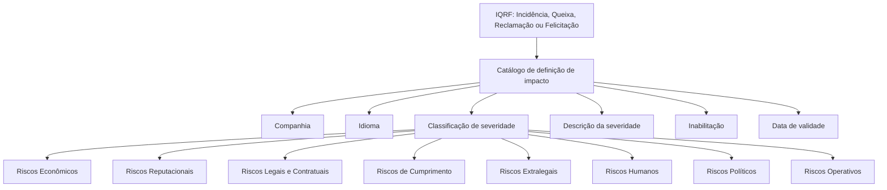

# Definição do Impacto ou Severidade de uma IQRF

## 1. Metadados do Documento
- **Arquivo de Origem:** Não identificado
- **Tipo de Documento:** Especificação Funcional
- **Domínio / Sistema:** Gestão de Incidências, Quejas, Reclamaciones y Felicitaciones (IQRF)
- **Público-Alvo:** Negócio, Operação, Configuração Funcional
- **Data/Versão Identificada:** Não identificada

---

## 2. Resumo Executivo & Contexto de Negócio

O documento define a catalogação de impacto ou severidade para **Incidências, Queixas, Reclamações e Felicitações (IQRF)** em uma entidade seguradora. O objetivo central é homogeneizar as informações usadas na gestão desses registros.

A classificação de severidade permite categorizar IQRFs conforme o impacto que podem ter sobre a atividade da companhia seguradora. A definição pode ser detalhada ou ampliada de acordo com o nível de maturidade da entidade.

A configuração do catálogo inclui a companhia, o idioma, a classificação de severidade, a descrição detalhada, o estado de inabilitação e a data de validade. A data de validade permite manter histórico das alterações realizadas nas definições ao longo do tempo.

O documento recomenda agrupar e codificar ordenadamente os registros do catálogo conforme a natureza de suas gravidades. Também indica a leitura recomendada da diretriz funcional sobre definição de Incidências, Quejas, Reclamaciones y Felicitaciones para evitar interpretações isoladas.

---

## 3. Arquitetura, Componentes & Tecnologias Envolvidas

O documento não descreve arquitetura técnica, microsserviços, integrações, métodos HTTP, contratos JSON, bancos de dados ou ambientes de implantação. O conteúdo descreve um catálogo funcional de classificação de impacto para IQRFs em uma entidade seguradora.

Os elementos funcionais identificados são:

- Catálogo de definição de impacto das IQRFs.
- Companhia associada à configuração.
- Idioma da definição.
- Classificação de severidade.
- Descrição da severidade.
- Estado de inabilitação.
- Data de validade.
- Diretriz funcional relacionada à definição de IQRF.



> **Nota de Análise:** Os textos “CF”, “Home Solutions APIs Documentation” e “Zeus” aparecem na extração bruta, mas o documento não explica sua função, relação com o catálogo de IQRF ou significado no contexto apresentado.

---

## 4. Regras de Negócio, Especificações Funcionais & Processos

1. A gestão de IQRF deve utilizar uma classificação de impactos ou severidades para homogeneizar as informações registradas.
2. O catálogo deve permitir catalogar as severidades ou impactos decorrentes da existência de Incidências, Quejas, Reclamaciones ou Felicitaciones.
3. A classificação deve categorizar IQRFs segundo sua severidade ou impacto.
4. Cada configuração do catálogo deve identificar o código da companhia à qual a configuração se aplica.
5. Cada classificação de impacto deve possuir uma chave de idioma utilizada em sua definição, com exemplos como espanhol, inglês e português.
6. A propriedade “Severidad de la IQRF” determina a classificação de severidade da IQRF.
7. O detalhamento da classificação de severidade pode ser desagregado e ampliado conforme o nível de maturidade da entidade.
8. O documento lista como naturezas de risco: econômico, reputacional, legal e contratual, de cumprimento, extralegal, humano, político e operativo.
9. A descrição da severidade deve registrar o detalhamento do impacto ou severidade da IQRF sobre a atividade da companhia seguradora.
10. A propriedade de inabilitação determina que um registro configurado não pode ser usado operacionalmente.
11. A data de validade determina a data a partir da qual uma classificação de impacto registrada estará plenamente operativa no sistema.
12. O uso correto da data de validade permite manter histórico das mudanças realizadas nas definições de impacto ao longo do tempo.
13. É recomendada a organização e codificação ordenada dos registros do catálogo conforme a natureza de suas gravidades.
14. A leitura da definição funcional de IQRF é recomendada para evitar interpretações incorretas resultantes da consulta isolada deste documento.

---

## 5. Tabelas de Parâmetros, Ambientes e Estruturas de Dados

| Item / Parâmetro | Descrição / Função | Tipo / Valores / Formato | Ambiente / Observações |
| :--- | :--- | :--- | :--- |
| Companhia | Contém o código da companhia sobre a qual a configuração está sendo realizada. | Código de companhia | Aplicável ao catálogo de definição de impacto das IQRFs. |
| Idioma | Determina a chave do idioma empregado na definição da classificação de impacto. | Exemplos: espanhol, inglês, português | O documento não informa formato técnico da chave. |
| Severidade da IQRF | Determina a classificação da severidade da IQRF. | Classificação de severidade | Pode ser desagregada e ampliada conforme a maturidade da entidade. |
| Riscos Econômicos | Natureza de risco listada para classificação de severidade. | Categoria de risco | Sem detalhamento adicional. |
| Riscos Reputacionais | Natureza de risco listada para classificação de severidade. | Categoria de risco | Sem detalhamento adicional. |
| Riscos Legais e Contratuais | Natureza de risco listada para classificação de severidade. | Categoria de risco | Sem detalhamento adicional. |
| Riscos de Cumprimento | Natureza de risco listada para classificação de severidade. | Categoria de risco | Sem detalhamento adicional. |
| Riscos Extralegais | Natureza de risco listada para classificação de severidade. | Categoria de risco | Sem detalhamento adicional. |
| Riscos Humanos | Natureza de risco listada para classificação de severidade. | Categoria de risco | Sem detalhamento adicional. |
| Riscos Políticos | Natureza de risco listada para classificação de severidade. | Categoria de risco | Sem detalhamento adicional. |
| Riscos Operativos | Natureza de risco listada para classificação de severidade. | Categoria de risco | Sem detalhamento adicional. |
| Descrição da Severidade | Contém a descrição detalhada da severidade ou do impacto da IQRF na atividade da companhia seguradora. | Texto descritivo | Sem formato ou limite informado. |
| Inabilitação | Indica que o registro configurado está inabilitado para uso operacional. | Estado de inabilitação | Impede a utilização operativa do registro. |
| Data de Validade | Indica a data a partir da qual a classificação de impacto estará plenamente operativa. | Data | Permite manter histórico de alterações das definições. |

---

## 6. Bateria de Perguntas & Respostas para RAG (FAQ Sintético)

### P1: Qual é o objetivo do catálogo de impacto ou severidade das IQRFs?
**R:** O catálogo tem o objetivo de homogeneizar as informações na gestão de Incidências, Quejas, Reclamaciones y Felicitaciones, catalogando essas ocorrências conforme a severidade ou o impacto que podem provocar na entidade seguradora.

### P2: O que significa IQRF no documento?
**R:** IQRF refere-se a Incidências, Quejas, Reclamaciones y Felicitaciones. O documento trata da classificação de impacto ou severidade aplicável a esses tipos de registros.

### P3: Qual informação de companhia deve existir na configuração do catálogo de impacto?
**R:** A configuração deve conter o código da companhia sobre a qual está sendo realizada a configuração do catálogo de definição de impacto das IQRFs.

### P4: Qual é a finalidade do atributo de idioma?
**R:** O atributo de idioma determina a chave do idioma utilizada na definição da classificação de impacto. O documento apresenta espanhol, inglês e português como exemplos.

### P5: A classificação de severidade pode ser ampliada?
**R:** Sim. Dependendo do nível de maturidade da entidade, o detalhamento da classificação de severidade pode ser desagregado e ampliado.

### P6: Quais naturezas de risco são citadas para classificação da severidade?
**R:** O documento cita riscos econômicos, reputacionais, legais e contratuais, de cumprimento, extralegais, humanos, políticos e operativos, além de indicar que pode haver outras classificações.

### P7: O que deve ser informado na descrição da severidade?
**R:** A descrição da severidade deve conter o detalhamento do impacto ou da severidade da IQRF sobre a atividade da companhia seguradora.

### P8: O que ocorre quando um registro possui a propriedade de inabilitação?
**R:** Um registro configurado como inabilitado não pode ser utilizado em sua utilização operativa.

### P9: Qual é a função da data de validade na classificação de impacto?
**R:** A data de validade indica a partir de quando uma classificação de impacto registrada estará plenamente operativa no sistema. Seu uso correto permite manter histórico das alterações feitas ao longo do tempo.

### P10: Qual recomendação existe para codificação dos registros de impacto?
**R:** O documento recomenda agrupar e codificar ordenadamente os registros do catálogo de acordo com a natureza de suas gravidades.

### P11: Há detalhes sobre APIs, métodos HTTP ou contratos de integração?
**R:** Não. Embora a extração contenha a expressão “Home Solutions APIs Documentation”, o documento não detalha APIs, métodos HTTP, contratos JSON, endpoints ou integrações técnicas.

---

## 7. Glossário de Termos, Siglas & Conceitos-Chave

- **IQRF:** Incidencias, Quejas, Reclamaciones y Felicitaciones.
- **Impacto:** Consequência ou efeito que uma IQRF pode ter sobre a entidade seguradora.
- **Severidade:** Classificação do impacto de uma IQRF.
- **Catálogo de Impactos:** Estrutura de configuração usada para definir e organizar classificações de impacto ou severidade de IQRFs.
- **Inabilitação:** Propriedade que impede o uso operacional de um registro configurado.
- **Data de Validade:** Data a partir da qual uma classificação registrada está plenamente operativa no sistema.
- **Riscos de Cumprimento:** Categoria de risco citada no documento; não há definição adicional no conteúdo.
- **CF:** Termo presente na extração bruta sem explicação contextual.
- **Zeus:** Termo presente na extração bruta sem explicação contextual.

---

## 8. Notas Críticas, Riscos & Limitações

- O documento não apresenta modelo de dados técnico, obrigatoriedade de campos, formatos de código, regras de validação ou valores permitidos para os atributos.
- O documento não define níveis concretos de severidade, critérios de cálculo, limiares ou priorização entre categorias de risco.
- Não há detalhamento sobre permissões, responsáveis pela manutenção do catálogo ou processo de aprovação das alterações.
- Não são descritos endpoints, APIs, integrações, tecnologias, bancos de dados, URLs, ambientes ou rotas de logs.
- A lista de naturezas de risco termina com “...”, indicando que podem existir categorias adicionais não detalhadas.
- A referência a “Definición Incidencias, Quejas, Reclamaciones y Felicitaciones” é indicada como leitura recomendada, mas seu conteúdo não foi fornecido.

---

## 9. Conteúdo Bruto Estruturado (Referência Fiel)

```text
--- [PÁGINA 1 DE 3] ---

DEFINICIÓN del IMPACTO o SEVERIDAD de
una IQRF
Contexto
Al efecto de homogeneizar la información en la Gestión de las Incidencias, Quejas, Reclamaciones y
Felicitaciones se deben catalogar los impactos o severidades que las IQRF's pudieran tener sobre la
entidad aseguradora.
Objetivo
Catalogar las severidades o impactos que pueden provocar la existencia de las Incidencias,
Quejas, Reclamaciones o Felicitaciones.
Catalogar las Incidencias, Quejas, Reclamaciones o Felicitaciones. incidencias, quejas o
reclamaciones en función de su severidad o impacto.
Propiedades Generales
Otras Propiedades
Propiedades Generales
Compañía
Este Atributo del catálogo de definición del impacto de las IQRF's contiene el código de la compañía
sobre la cual se está realizando la configuración.
 /
 CF
Home Solutions APIs Documentation Zeus
EN

--- [PÁGINA 2 DE 3] ---

Idioma.
Esta propiedad de la clasificación del impacto determina la clave del Idioma empleado en su
definición como por ejemplo: español, inglés, portugués, ...
Severidad de la IQRF
Esta propiedad determina la clasificación de la severidad de la IQRF.
Dependiendo del nivel de madurez de la entidad, se podrá desagregar y ampliar el detalle de
este elemento de configuración.
Riesgos Económico.
Riesgos Reputacionales.
Riesgos Legales y Contractuales.
Riesgos de Cumplimiento.
Riesgos Extralegales.
Riesgos Humanos.
Riesgos Políticos.
Riesgos Operativos.
...
Descripción de la Severidad
Este atributo contiene la descripción detallada de la severidad o impacto de la IQRF en la actividad
de la compañía aseguradora.
Otras Propiedades
Inhabilitación
Esta propiedad establece que el registro configurado está inhabilitado para poder ser utilizado en su
utilización operativa.
Fecha de Validez
Esta propiedad le indica al Sistema la fecha a partir de la cual la clasificación de impacto de una
IQRF registrada estará plenamente operativa en el sistema por lo que su correcto uso permite tener
un histórico de los cambios efectuados en sus definiciones a lo largo del tiempo.
Consejo:

--- [PÁGINA 3 DE 3] ---

Vínculos
Relación de Directrices y Documentos funcionales cuya lectura recomendada para evitar que la
interpretación aislada de la presente entrada pueda conducir a error.
Definición Incidencias, Quejas, Reclamaciones y Felicitaciones
Preguntas frecuentes
(1) ¿Existe alguna recomendación que pueda o deba ser tomada en cuenta localmente en la
codificación, uso y definición de la tabla de Impactos de las IQRF's en el Sistema?
Es una buena práctica agrupar y codificar ordenadamente los registros de este catálogo de acuerdo
con la naturaleza de sus gravedades.
```
