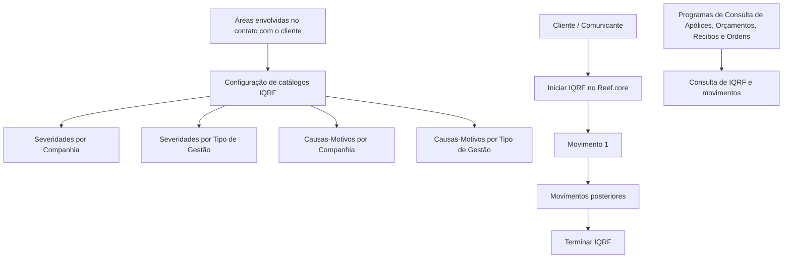
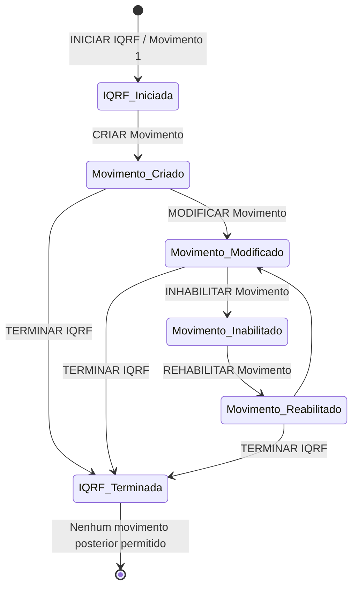

# Gestão de Incidências, Queixas, Reclamações e Felicitações (IQRF) no Reef.core

## 1. Metadados do Documento
- **Arquivo de Origem:** Não identificado no conteúdo fornecido
- **Tipo de Documento:** Manual Operacional / Especificação Funcional
- **Domínio / Sistema:** Reef.core — Processo de Gestão da Qualidade
- **Público-Alvo:** Operação, Qualidade, Negócio, Configuração Funcional e Áreas de Atendimento ao Cliente
- **Data/Versão Identificada:** Não identificada

---

## 2. Resumo Executivo & Contexto de Negócio

O documento descreve a funcionalidade de gestão de **Incidências, Queixas, Reclamações e Felicitações (IQRF)** nos processos do sistema Reef.core. A funcionalidade atua como facilitadora para registrar manifestações relacionadas à gestão operacional de apólices, sinistros e serviços, permitindo sua medição quantitativa e qualitativa dentro do Processo de Gestão da Qualidade.

O conteúdo associa o processo IQRF aos modelos operativos da Área Corporativa de Operações e enfatiza a necessidade de uma atitude proativa na prestação de serviços. Ainda que as áreas devam identificar e evitar preventivamente situações que possam causar insatisfação, o documento reconhece que nem sempre as expectativas dos clientes são atendidas.

As IQRF são tratadas como indicadores claros de qualidade. Por isso, a companhia deve contabilizar e auditar todos os casos. O documento também recomenda, sempre que possível, a existência da figura do gestor de qualidade como responsável pelo processo e promotor de ações de melhoria.

A classificação das manifestações depende de dois eixos: **formalidade da comunicação** e **pretensão de ressarcimento**. Incidências, queixas e reclamações são manifestações de desconformidade, enquanto felicitações representam manifestações de gratidão por serviços satisfatórios.

A operacionalização local exige a configuração ordenada de catálogos, incluindo severidades e causas-motivos por companhia e por tipo de gestão. O documento não detalha telas, contratos de API, métodos HTTP, modelos de dados físicos ou regras técnicas de integração do Reef.core.

---

## 3. Arquitetura, Componentes & Tecnologias Envolvidas

### Componentes, domínios e áreas mencionadas

| Componente / Entidade | Papel descrito |
| :--- | :--- |
| **Reef.core** | Sistema cujos processos registram e tratam IQRF. |
| **Processo de Gestão da Qualidade** | Processo corporativo no qual as IQRF são registradas, medidas e auditadas. |
| **IQRF** | Conjunto de Incidências, Queixas, Reclamações e Felicitações. |
| **Catálogos de Configuração** | Conjunto de entidades configuráveis necessárias para operacionalizar a funcionalidade IQRF localmente. |
| **Movimentos de IQRF** | Registros de evolução operacional de uma IQRF; toda IQRF nasce com o movimento 1. |
| **Programas de Consulta** | Programas de consulta de Apólices, Orçamentos, Recibos e Ordens de Cobrança/Pagamento, a partir dos quais podem ser consultadas IQRF e movimentos. |
| **Autoserviço** | Canal citado para apresentação de incidências, queixas e reclamações. |
| **Redes sociais** | Canal citado para apresentação de incidências. |
| **Áreas de Emissão** | Área envolvida no contato com clientes e sujeita à normativa de incidências, queixas, reclamações e felicitações. |
| **Áreas de Sinistros** | Área envolvida no contato com clientes e sujeita à normativa de IQRF. |
| **Prestaciones / Serviços** | Área ou contexto de serviços relacionados ao cliente. |
| **Provedores** | Área e possíveis demandados em uma IQRF. |
| **Qualidade** | Área envolvida na configuração e gestão do processo. |
| **Área técnica** | Área citada como colaboradora na configuração das entidades do processo. |

### Relação funcional entre configuração, registro e consulta



### Fluxo de movimentos da IQRF



> **Nota de Análise:** O documento apresenta os fluxos de criação, modificação, inabilitação, reabilitação e término como diagramas textuais. O critério exato para os ramos “Sim” e “Não” relacionados ao estado **Inhabilitado** não é detalhado além da sequência exibida.

---

## 4. Regras de Negócio, Especificações Funcionais & Processos

### 4.1 Finalidade da gestão IQRF

A funcionalidade IQRF deve registrar, nos processos de Reef.core, incidências, queixas, reclamações e felicitações que possam ocorrer. A gestão deve possibilitar medição quantitativa e qualitativa no Processo de Gestão da Qualidade.

A correta operação local requer conhecimento dos catálogos considerados e da ordem de configuração desses catálogos. O documento cita os seguintes temas funcionais:

- Tipos de Gestão IQRF.
- Elementos sobre os quais se apresentam os Tipos de Gestão.
- Intervenientes.
- Movimentos das IQRF.
- Procedência ou improcedência das IQRF.
- Catálogos de Configuração.
- Outras Propriedades.

### 4.2 Critérios de classificação das IQRF

A diferenciação entre incidência, queixa, reclamação e felicitação está associada aos eixos de:

1. **Formalidade da comunicação**.
2. **Pretensão de ressarcimento**.

| Tipo de gestão | Natureza | Formalidade | Pretensão de ressarcimento | Canal ou característica citada |
| :--- | :--- | :--- | :--- | :--- |
| **Incidência** | Desconformidade com a gestão operativa da apólice, sinistro ou serviço. | Não formal; não acompanhada por assinatura do cliente. | Não existe. | Geralmente verbal; pode ocorrer por autosserviço ou redes sociais. |
| **Queixa** | Desconformidade relativa ao funcionamento de serviços que a seguradora deve prestar. | Formal; cliente apresenta por escrito, mediante formulário ou autosserviço. | Não existe. | Pode decorrer de demora, desatenção ou funcionamento análogo considerado incorreto pelo cliente. |
| **Reclamação** | Desconformidade relativa a aspectos específicos, usualmente vinculada a direitos ou interesses derivados de contratos. | Formal; apresentada por escrito, mediante formulário ou autosserviço. | Existe. | Pode exigir modelo obrigatório em que o cliente exponha os motivos. |
| **Felicitação** | Manifestação de gratidão por serviço satisfatório. | Pode ser escrita, verbal ou por meio digital. | Não aplicável no texto. | Não é uma desconformidade. |

### 4.3 Regras específicas para incidências

Uma incidência é uma desconformidade com a gestão operativa de apólice, sinistro ou serviço, manifestada por cliente ao emissor, tramitador, provedor ou outra figura da companhia.

As incidências normalmente podem ser verbais, mas também podem ser comunicadas por autosserviço ou redes sociais. Podem referir-se aos principais processos nos quais o cliente interage com a companhia.

Uma incidência não precisa representar um problema real nas operações associadas. O documento exemplifica como incidência:

- O preço informado ao cliente durante a cotação de um produto.
- A não realização de uma prestação ou serviço que o cliente não havia contratado.

Mesmo quando não representam falhas reais, as incidências podem fornecer pistas para melhorias nos processos de interação com clientes e até para melhoria de produtos. Por essa razão, devem ser armazenadas e tratadas adequadamente no sistema.

### 4.4 Regras específicas para queixas

Uma queixa é uma desconformidade apresentada formalmente por escrito por clientes. A queixa refere-se ao funcionamento dos serviços que a seguradora está obrigada a prestar.

A queixa pode ser motivada por tardança, desatenção ou funcionamento análogo que o cliente considere inadequado. A diferença principal em relação à incidência é a formalidade: o cliente apresenta a queixa por escrito, mediante formulário ou autosserviço.

A queixa não possui intenção de ressarcimento por parte do cliente.

### 4.5 Regras específicas para reclamações

Uma reclamação é uma desconformidade apresentada formalmente e por escrito mediante formulário ou autosserviço. Diferentemente da queixa, a reclamação refere-se a aspectos específicos e geralmente a motivos concretos.

A reclamação envolve pretensão de restituição de interesses ou direitos derivados de contratos que o cliente considera lesionados ou vulnerados. Portanto, é uma manifestação formal com pretensão de ressarcimento.

Devido ao formalismo da reclamação, normalmente pode existir um modelo obrigatório em que o cliente deve expor o motivo ou os motivos pelos quais se considera prejudicado. Quando esse modelo for exigido, os clientes devem ser informados sobre o requisito e o formulário ou modelo deve ser disponibilizado.

### 4.6 Regras específicas para felicitações

Uma felicitação é uma manifestação de gratidão por um serviço satisfatório. Pode ser apresentada por escrito, verbalmente ou por meio digital.

Embora faça parte da gestão IQRF, a felicitação não é uma desconformidade.

### 4.7 Elementos sobre os quais podem ser registradas gestões

Os tipos de gestão podem ser apresentados sobre os seguintes conceitos de Reef.core:

- Orçamento.
- Apólice.
- Aplicação.
- Recibo.
- Ordem de pagamento.
- Ordem de cobrança.

### 4.8 Intervenientes e papéis

Os intervenientes são pessoas físicas ou jurídicas que participam da abertura dos tipos de gestão, de acordo com a atividade ou atividades associadas no novo modelo de informação de Terceiros.

| Papel | Definição |
| :--- | :--- |
| **Comunicante** | Pessoa que atua em nome do Demandante para comunicar a IQRF. |
| **Demandante** | Pessoa que estabelece sua desconformidade ou manifestação positiva sobre os serviços prestados direta ou indiretamente pela entidade seguradora. |
| **Demandado** | Pessoa, companhia, oficina, agente, hospital, tramitador, empregado ou outra entidade sobre a qual recai a IQRF. |

Normalmente, Comunicante e Demandante coincidem.

A identificação de qualquer interveniente é obrigatória e deve ser feita por meio de:

1. Registro de sua atividade.
2. Tipo de documento identificador.
3. Chave do interveniente.

### 4.9 Movimentos e ciclo de vida

Toda IQRF nasce com o **movimento 1**. O número do movimento é incrementado a cada movimento realizado sobre a IQRF.

O documento apresenta as seguintes operações:

| Operação | Efeito descrito |
| :--- | :--- |
| **INICIAR IQRF** | Inicia uma IQRF. |
| **CRIAR Movimento** | Cria movimento e permite modificar a IQRF sem arrastar severidade e procedência. |
| **MODIFICAR Movimento** | Modifica movimento e permite modificar a IQRF arrastando severidade e procedência. |
| **INHABILITAR Movimento** | Inabilita um movimento. |
| **REHABILITAR Movimento** | Reabilita um movimento inabilitado. |
| **TERMINAR IQRF** | Finaliza a IQRF. |

Após a IQRF ser terminada, não é possível realizar qualquer movimento posterior.

### 4.10 Procedência e improcedência

Qualquer Tipo de Gestão IQR deve iniciar como **Procedente** até sua terminação. No momento da terminação, é determinado finalmente se a gestão é procedente ou improcedente.

As felicitações devem iniciar e finalizar como **Procedentes**.

O documento caracteriza uma IQRF improcedente como aquela que:

- Não considera os fatos.
- Não cumpre os requisitos ou especificações.
- É apresentada perante órgão não competente.

### 4.11 Configuração de catálogos

Após estabelecer as definições das IQRF como tipologias de gestão, e em colaboração com as áreas envolvidas no contato com clientes — emissão, sinistros, provedores, qualidade, área técnica e outras — deve-se configurar entidades relacionadas ao Processo de Gestão.

Os catálogos explicitamente citados são:

- Severidades das IQRF por Companhia.
- Severidades das IQRF por Tipo de Gestão.
- Causas-Motivos das IQRF por Companhia.
- Causas-Motivos das IQRF por Tipo de Gestão.

### 4.12 Consultas

O documento prevê a possibilidade de executar consultas de IQRF e seus movimentos a partir dos Programas de Consulta de:

- Apólices.
- Orçamentos.
- Recibos.
- Ordens de Cobrança.
- Ordens de Pagamento.

---

## 5. Tabelas de Parâmetros, Ambientes e Estruturas de Dados

| Item / Parâmetro | Descrição / Função | Tipo / Valores / Formato | Ambiente / Observações |
| :--- | :--- | :--- | :--- |
| Tipo de Gestão | Classifica a manifestação registrada. | Incidência, Queixa, Reclamação ou Felicitação. | Aplicável ao processo IQRF no Reef.core. |
| Formalidade da comunicação | Eixo de diferenciação entre tipos de gestão. | Formal ou não formal. | Incidência é não formal; queixa e reclamação são formais. |
| Pretensão de ressarcimento | Eixo de diferenciação entre tipos de gestão. | Com ou sem pretensão de ressarcimento. | Reclamação possui pretensão; incidência e queixa não possuem. |
| Elemento de gestão | Conceito de Reef.core sobre o qual pode ser registrada uma gestão. | Orçamento, Apólice, Aplicação, Recibo, Ordem de Pagamento, Ordem de Cobrança. | Lista fornecida pelo documento. |
| Comunicante | Pessoa que comunica IQRF em nome do Demandante. | Pessoa física ou jurídica, conforme modelo de Terceiros. | Normalmente coincide com o Demandante. |
| Demandante | Pessoa que expressa desconformidade ou manifestação positiva. | Pessoa física ou jurídica, conforme modelo de Terceiros. | Relacionado aos serviços prestados pela entidade seguradora. |
| Demandado | Pessoa ou entidade sobre a qual recai a IQRF. | Companhia, Oficina, Agente, Hospital, Tramitador, Empregado, entre outros. | Exemplos apresentados no documento. |
| Atividade do interveniente | Dado obrigatório para identificação do interveniente. | Registro da atividade. | Obrigatório. |
| Tipo de documento identificador | Dado obrigatório para identificação do interveniente. | Tipo de documento. | Obrigatório. |
| Chave do interveniente | Dado obrigatório para identificação do interveniente. | Chave do interveniente. | Obrigatório. |
| Número do movimento | Identifica a sequência de movimentos de uma IQRF. | Inicia em 1 e é incrementado a cada movimento. | Toda IQRF nasce com o movimento 1. |
| Estado inabilitado | Estado considerado nos processos de movimentos. | Inhabilitado / não inabilitado. | Critérios detalhados dos ramos do fluxo não foram apresentados. |
| Procedência da IQR | Status de procedência da Incidência, Queixa ou Reclamação. | Procedente ou Improcedente. | IQR inicia como procedente; definição final ocorre na terminação. |
| Procedência da Felicitação | Status de procedência da Felicitação. | Procedente. | Deve iniciar e terminar como procedente. |
| Severidades por Companhia | Catálogo de severidade configurável por companhia. | Não detalhado. | Catálogo de configuração IQRF. |
| Severidades por Tipo de Gestão | Catálogo de severidade configurável por tipo de gestão. | Não detalhado. | Catálogo de configuração IQRF. |
| Causas-Motivos por Companhia | Catálogo de causas e motivos configurável por companhia. | Não detalhado. | Catálogo de configuração IQRF. |
| Causas-Motivos por Tipo de Gestão | Catálogo de causas e motivos configurável por tipo de gestão. | Não detalhado. | Catálogo de configuração IQRF. |
| Consulta de IQRF | Consulta de IQRF e respectivos movimentos. | Programas de consulta. | Apólices, Orçamentos, Recibos e Ordens de Cobrança/Pagamento. |

---

## 6. Bateria de Perguntas & Respostas para RAG (FAQ Sintético)

### P1: Qual é o objetivo da funcionalidade IQRF no Reef.core?
**R:** A funcionalidade IQRF visa facilitar o registro de incidências, queixas, reclamações e felicitações nos processos do Reef.core, permitindo sua medição quantitativa e qualitativa no Processo de Gestão da Qualidade.

### P2: Quais são os dois critérios usados para diferenciar incidência, queixa, reclamação e felicitação?
**R:** O documento informa que a diferenciação gira em torno da formalidade da comunicação e da pretensão de ressarcimento. Incidências são não formais e sem ressarcimento; queixas são formais e sem ressarcimento; reclamações são formais e possuem pretensão de ressarcimento; felicitações são manifestações de gratidão.

### P3: O que caracteriza uma incidência no processo IQRF?
**R:** Uma incidência é uma desconformidade com a gestão operativa de uma apólice, sinistro ou serviço, comunicada por cliente ao emissor, tramitador, provedor ou outra figura da companhia. Sua pretensão não é formal, não possui assinatura do cliente e não envolve ressarcimento.

### P4: Uma incidência precisa corresponder a um erro real da companhia?
**R:** Não. O documento afirma que incidências não precisam implicar problemas reais nas operações associadas. Como exemplos, cita o preço apresentado na cotação de um produto ou a não realização de um serviço que o cliente não possuía contratado. Ainda assim, devem ser registradas e tratadas, pois podem apontar oportunidades de melhoria.

### P5: Qual é a diferença entre uma queixa e uma reclamação?
**R:** A queixa é uma desconformidade formal apresentada por escrito, relacionada ao funcionamento de serviços que a seguradora deve prestar, mas não possui intenção de ressarcimento. A reclamação também é formal e escrita, porém envolve pretensão de restituição de interesses ou direitos derivados de contratos que o cliente entende terem sido lesionados ou vulnerados.

### P6: Como uma felicitação deve ser classificada quanto à procedência?
**R:** As felicitações devem iniciar e finalizar como procedentes. O documento diferencia felicitações das IQR porque felicitações não são desconformidades, mas manifestações de gratidão por serviço satisfatório.

### P7: Quais elementos do Reef.core podem receber uma gestão IQRF?
**R:** Os tipos de gestão podem ser apresentados sobre Orçamento, Apólice, Aplicação, Recibo, Ordem de Pagamento e Ordem de Cobrança.

### P8: Quem são os intervenientes de uma IQRF?
**R:** Os intervenientes são Comunicante, Demandante e Demandado. O Comunicante atua em nome do Demandante para comunicar a IQRF. O Demandante é quem manifesta a desconformidade ou manifestação positiva. O Demandado é a pessoa ou entidade sobre a qual recai a IQRF, como companhia, oficina, agente, hospital, tramitador ou empregado.

### P9: Quais informações são obrigatórias para identificar um interveniente?
**R:** A identificação de qualquer interveniente deve obrigatoriamente registrar sua atividade, o tipo de documento identificador e a chave do interveniente.

### P10: Como funciona a numeração de movimentos de uma IQRF?
**R:** Toda IQRF nasce com o movimento 1. O número do movimento é incrementado sempre que qualquer movimento é realizado sobre a IQRF.

### P11: É possível criar movimentos depois de terminar uma IQRF?
**R:** Não. Após a IQRF ser terminada, não é possível realizar qualquer movimento posterior sobre ela.

### P12: Quando uma IQR pode ser considerada improcedente?
**R:** Uma IQR pode ser considerada improcedente quando não considera os fatos, não cumpre requisitos ou especificações, ou é apresentada perante órgão não competente. As IQR devem iniciar como procedentes e a decisão final sobre procedência é feita na terminação.

### P13: Quais catálogos precisam ser configurados para operar a funcionalidade IQRF?
**R:** O documento cita severidades das IQRF por companhia, severidades das IQRF por tipo de gestão, causas-motivos das IQRF por companhia e causas-motivos das IQRF por tipo de gestão.

### P14: De onde podem ser consultadas as IQRF e seus movimentos?
**R:** As IQRF e seus movimentos podem ser consultados a partir dos Programas de Consulta de Apólices, Orçamentos, Recibos e Ordens de Cobrança/Pagamento.

---

## 7. Glossário de Termos, Siglas & Conceitos-Chave

- **IQRF:** Conjunto de Incidências, Queixas, Reclamações e Felicitações.
- **IQR:** Referência usada no documento para Incidências, Queixas e Reclamações.
- **Incidência:** Desconformidade não formal, sem pretensão de ressarcimento, relacionada à gestão operativa de apólice, sinistro ou serviço.
- **Queixa:** Desconformidade formal, escrita e sem pretensão de ressarcimento, relacionada ao funcionamento de serviços que a seguradora deve prestar.
- **Reclamação:** Desconformidade formal, escrita e com pretensão de ressarcimento por interesses ou direitos contratuais considerados lesionados ou vulnerados.
- **Felicitação:** Manifestação de gratidão por serviço satisfatório, comunicável por meio escrito, verbal ou digital.
- **Comunicante:** Pessoa que comunica a IQRF em nome do Demandante.
- **Demandante:** Pessoa que manifesta desconformidade ou manifestação positiva sobre serviços prestados.
- **Demandado:** Pessoa ou entidade sobre a qual recai a IQRF.
- **Procedente:** Estado inicial de qualquer IQR e estado obrigatório de início e fim para felicitações.
- **Improcedente:** Condição de uma IQRF que não considera os fatos, não cumpre requisitos ou especificações, ou é apresentada perante órgão não competente.
- **Movimento:** Registro de evolução de uma IQRF; a numeração inicia em 1 e cresce a cada novo movimento.
- **Inhabilitado:** Estado de movimento citado nos fluxos operacionais de criação, modificação, inabilitação, reabilitação e término.
- **Autoserviço:** Canal citado para apresentação de incidências, queixas e reclamações.
- **Reef.core:** Sistema no qual a funcionalidade de gestão IQRF é registrada e operada.

---

## 8. Notas Críticas, Riscos & Limitações

- O documento não identifica arquivo de origem, autor, data, versão, companhia específica, ambiente, URL, servidor, porta ou tecnologia de implementação.
- Não há detalhamento de APIs, métodos HTTP, contratos JSON, eventos, tabelas físicas, campos de banco de dados, permissões, perfis de acesso ou regras de auditoria técnica.
- Os diagramas de processo usam decisões relacionadas ao estado **Inhabilitado**, mas não especificam integralmente o significado operacional dos caminhos “Sim” e “Não”.
- O documento cita “ordem” de configuração dos catálogos, mas não apresenta a sequência detalhada entre Severidades, Causas-Motivos e demais entidades.
- Não há lista de valores, escalas ou critérios de cálculo para severidades.
- Não há detalhamento dos valores possíveis para causas e motivos.
- Não há definição de prazos, SLA, responsáveis por tratamento, critérios de encerramento ou regras de notificação.
- Companhias que já tenham regulação legal ou interna devem segui-la, adaptando procedimentos locais sem confronto com exigências de prazos, formatos ou demais condições dessa regulação.
- Recomenda-se, sempre que possível, a figura do gestor de qualidade como garante do processo e promotor de ações de melhoria, mas o documento não especifica suas permissões, atribuições operacionais ou fluxos de aprovação.

---

## 9. Conteúdo Bruto Estruturado (Referência Fiel)

```text
--- [PÁGINA 1 DE 7] ---

DEFINICIÓN I.Q.R.F.
Contexto
De acuerdo con los Modelos Operativos del Área Corporativa de Operaciones en relación al Proceso
de Gestión de la Calidad
"Aunque en todo momento se debe tener una actitud proactiva sobre la prestación del servicio,
identificando y evitando situaciones que a priori pudieran desembocar en cualquier tipo de
disconformidad por parte de los clientes, sabemos que ken ocasiones no se cubren las expectativas
que estos tienen depositadas en MAPFRE.
Las áreas de Emisión, Siniestros y Prestaciones, Proveedores y en general cualquier otra área
implicada en el contacto con el cliente se mantendrán en este apartado bajo la normativa de
incidencias, quejas, reclamaciones y felicitaciones que se establezca localmente.
Las compañías que dispongan de esa regulación (legal o interna) deberán seguirla, adaptándose a
ella todas las Áreas y estableciendo procedimientos de resolución de las Incidencias, Quejas,
Reclamaciones y Felicitaciones que no entren en confrontación con las mismas en cuanto a plazos,
formatos, etc.
Las IQR son un claro indicador de calidad y por ello es importante contar con una herramienta que
las contabilice y soporte por lo que debe ser una obligación de la compañía el computar todos los
casos y auditarlos.
Además, siempre y cuando sea posible, es recomendable la existencia de la figura del gestor de
calidad como garante del proceso y promotor de las acciones de mejora."
 / 
 CF
Home Solutions APIs Documentation Zeus
EN


--- [PÁGINA 2 DE 7] ---

Objetivo
Ser un facilitador para registrar en los procesos de Reef.core las incidencias, quejas, reclamaciones
y/o felicitaciones que se puedan producir y para su medición cuantitativa y cualitativa dentro del
Proceso de Gestión de la Calidad.
Para ello, es necesario conocer la relación de Catálogos que se deben considerar así como el orden
en su configuración para tener local y plenamente operativa esta funcionalidad de las herramienta
Corporativa.
Tipos de Gestión (IQRF's)
Elementos sobre los que se interponen los Tipos de Gestión
Intervinientes
Movimientos de las IQRF's
Procedencia o Improcedencia de las IQRF's
Catálogos de Configuración
Otras Propiedades
Tipos de Gestión
El primer paso que hay que tomar para una correcta gestión de las IQRF's es definir claramente a
qué nos referimos a la hora de hablar de una incidencia, de una queja, de una reclamación o de una
felicitación.
En el caso de las IQR's dicha diferenciación siempre gira en torno a dos ejes, la formalidad de la
comunicación y la pretensión de resarcimiento:


--- [PÁGINA 3 DE 7] ---

Es aquella disconformidad con la gestión operativa de la póliza, del siniestro o del servicio
manifestada por el cliente al emisor, tramitador, proveedor o a cualquier otra figura de la
compañía. Lo más habitual es que sea realizada de forma verbal, pero puede hacerse a través del
autoservicio o en redes sociales.
Por lo general, pueden hacer referencia incidencias a los principales procesos en los que el cliente
puede interactuar con la compañía y no tiene por qué implicar problemas reales en las operativas
asociadas a estos, por ejemplo, una incidencia puede ser el precio que se le ha dado al cliente a
la hora de cotizar un producto o el que no se le realice una prestación o servicio que realmente no
tenía contratado, no obstante pueden eventualmente dar a la compañía pistas sobre mejoras en
los procesos en los que ésta interactúa con el cliente o incluso para mejorar productos, por lo que
deberán ser convenientemente guardadas y tratadas en el sistema.
Las características que catalogan una comunicación como Incidencia son la no formalidad en la
pretensión (en el sentido de que no viene acompañada de una firma del cliente) y que no existe
pretensión de resarcimiento alguna.
Es la disconformidad formulada por los clientes de forma escrita y referida al funcionamiento
de los servicios que está obligada a prestar la aseguradora, motivada por la tardanza,
desatenciones o cualquier funcionamiento análogo que el cliente considere que no se lleva a cabo
de la manera correcta.
La principal diferencia frente a la incidencia es que es una pretensión formal (el cliente la
presenta por escrito mediante formulario o a través del Autoservicio). No obstante, al igual que en
el caso de las incidencias, no existe intención de resarcimiento por parte del cliente.
Este concepto es utilizado para definir aquella disconformidad formulada por los clientes de
forma escrita mediante formulario o a través de Autoservicio, pero a diferencia de la queja, se
utiliza para solo algunos aspectos y suele concretarse en solo algunos motivos, como la
restitución en su interés o derechos derivados de los contratos suscritos por considerar que han
sido lesionados o vulnerados en alguno de sus aspectos. En otras palabras, son pretensiones
formales y con pretensión de resarcimiento.
Dado el formalismo de una reclamación, por lo general suele existir un modelo de formato en el
que, de forma obligatoria, el cliente debe exponer el/los motivo(s) por los que se considera
agraviado. De ser así, deberá informarse a los clientes de este requisito, y poner a su disposición
este formulario o modelo.
Incidencia
Queja
Reclamación


--- [PÁGINA 4 DE 7] ---

Por otro lado y pese a no ser una disconformidad debemos hacer también referencia a las
felicitaciones:
Manifestación de gratitud por un servicio satisfactorio, ya sea de manera escrita, verbal o medio
digital.
Elementos sobre los que se interponen las Gestiones
La relación de conceptos de Reef.core sobre los que se pueden interponer los tipos de gestión:
Presupuesto.
Póliza.
Aplicación.
Recibo.
Orden de pago.
Orden de cobro.
Intervinientes
Son las personas de naturaleza física o jurídica que intervienen en la apertura de los tipos de gestión
de acuerdo con la actividad o actividades que tengan asociadas en el nuevo modelo de información
de Terceros, siendo sus posibles papeles:
Aquella Persona que actúa en nombre del Demandante para comunicar la IQRF.
Aquella Persona que establece su disconformidad (o parabienes) sobre los Servicios prestados
directa o indirectamente por la entidad aseguradora.
Normalmente las figuras del Demandante y Comunicante serán coincidentes.
Felicitación
Comunicante
Demandante


--- [PÁGINA 5 DE 7] ---

Aquella Persona (Compañía, Taller, Agente, Hospital, Tramitador, Empleado, ... ) sobre la que
recae la IQRF.
La identificación de cualquiera de los Intervinientes se realizará obligatoriamente mediante el
registro de su actividad, el tipo de documento identificador y la clave del interviniente.
Procesos
INICIO **INICIAR IQRF** FIN
NO
SI
INICIO ¿Movimiento en estado
**Inhabilitado**?
**CREAR Movimiento**
Modificar IQRF
**sin arrastrar**
Severidad y Procedencia
FIN
NO
SI
INICIO ¿Movimiento en estado
**Inhabilitado**?
**MODIFICAR Movimiento**
Modificar IQRF
**arrastrando**
Severidad y Procedencia
FIN
NO
SI
INICIO ¿Movimiento en estado
**Inhabilitado**?
**INHABILITAR Movimiento**
FIN
Demandado
Ejemplos:


--- [PÁGINA 6 DE 7] ---

SI
NO
INICIO ¿Movimiento en estado
**Inhabilitado**?
**REHABILITAR Movimiento**
FIN
NO
SI
INICIO ¿Movimiento en estado
**Inhabilitado**?
**TERMINAR IQRF**
FIN
Toda IQRF nace con el movimiento 1 incrementándose este número con cualquier movimiento
que se realice sobre ella.
Una vez que la IQRF esté Terminada, no será posible realizar ningún movimiento posterior sobre
ella.
Improcedencia de las IQRF's
Cualquier Tipo de Gestión IQR se debe iniciar como Procedente hasta su Terminación en donde
se determinará finalmente si lo es o no a diferencia de las Felicitaciones que deberían iniciar y
finalizar siendo Procedentes.
Dicho de una IQRF: que no tiene en consideración los hechos, no cumple con los requisitos o
especificaciones o que se plantea ante un órgano no competente.
Catálogos de Configuración de IQRF's


--- [PÁGINA 7 DE 7] ---

Una vez establecidas las definiciones de las IQRF's como tipologías de gestión y en colaboración
con las áreas implicadas en el contacto con el cliente (emisión, siniestros, proveedores, calidad, área
técnica, etcétera), el siguiente paso que se debe abordar es la configuración de determinadas
entidades afectas al Proceso de Gestión.
Severidades de las IQRF por Compañía
Severidades de las IQRF por Tipo de Gestión
Causas-Motivos de las IQRF por Compañía
Causas-Motivos de las IQRF por Tipo de Gestión
Otras Propiedades
Posibilidad de ejecutar Consultas de las IQRF's y sus movimientos desde los Programas de Consulta
de Pólizas, Presupuestos, Recibos y Órdenes de Cobro/Pago.
```
