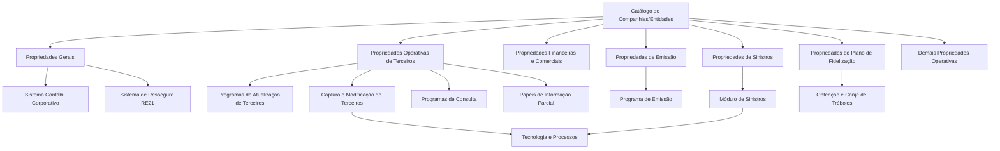

# Definição de Companhias/Entidades do Sistema — Propriedades Gerais e Operativas

## 1. Metadados do Documento
- **Arquivo de Origem:** Não identificado; conteúdo bruto fornecido pelo usuário.
- **Tipo de Documento:** Especificação Funcional.
- **Domínio / Sistema:** Catálogo de Companhias/Entidades MAPFRE.
- **Público-Alvo:** Negócio, Arquitetos, Desenvolvedores, Operação e Tecnologia e Processos.
- **Data/Versão Identificada:** Não identificada.

---

## 2. Resumo Executivo & Contexto de Negócio

O documento descreve a definição e parametrização de companhias ou entidades no núcleo do sistema. O núcleo é entregue às instalações com um repositório de informações parcialmente vazio e permite codificar múltiplas companhias, com limite máximo de **99 entidades**. Cada entidade pode possuir denominação descritiva, abreviatura e nome curto.

A definição de cada companhia está organizada por grupos de propriedades: propriedades gerais; propriedades operativas de terceiros; propriedades operativas financeiras e comerciais; propriedades operativas de emissão; propriedades operativas de sinistros; propriedades do plano de fidelização; e demais propriedades operativas.

As propriedades gerais identificam juridicamente, contabilmente, geograficamente e operacionalmente a entidade, incluindo identificação tributária, chave patronal, chave societária, razão social, estrutura geográfica, contatos, responsável máximo, moeda nacional, integração com resseguro externo, calendário laborável e atividade identificadora.

As propriedades operativas adaptam o comportamento dos programas do núcleo às necessidades locais da entidade. Essas configurações abrangem captura e validação de dados de terceiros, prevenção de duplicidades, privacidade, exportação de terceiros, meios de cobrança/pagamento, dados bancários, IVA, emissão de apólices, prevenção à lavagem de dinheiro, textos e cláusulas, abertura de sinistros, fidelização e identificação de usuários.

O documento também define responsabilidades explícitas para a entidade e para o departamento de Tecnologia e Processos. Entre elas estão a parametrização de ferramentas de proteção de dados, a implementação de um componente para atribuição de ID único de terceiros quando aplicável, a nomenclatura de programas de abertura de sinistros e expedientes, e a definição de procedimentos para exploração de alertas ligados a limites de prêmios.

---

## 3. Arquitetura, Componentes & Tecnologias Envolvidas

O conteúdo descreve uma arquitetura funcional baseada em um **Catálogo de Companhias/Entidades**, que centraliza propriedades parametrizáveis e influencia o comportamento de programas e módulos do núcleo do sistema.

| Componente / Conceito | Papel identificado |
| :--- | :--- |
| Núcleo do Sistema | Permite definir e codificar até 99 entidades em repositórios específicos de informação. |
| Catálogo de Companhias/Entidades | Repositório de atributos gerais e operativos que parametrizam a entidade. |
| Programas de atualização de terceiros | Capturam e atualizam dados de pessoas físicas e jurídicas conforme propriedades da entidade. |
| Programa de Captura e Modificação de Terceiros | Pode replicar terceiros entre entidades, verificar duplicidade e atribuir ID único interno. |
| Programas de Consulta | Podem apresentar informações totais ou parciais conforme configuração e papéis. |
| Programa de Emissão | Usa atividade padrão de terceiros, controla comprimento de textos e cláusulas e valida termos obrigatórios. |
| Módulo de Sinistros | Usa programas configurados para abertura de sinistros e expedientes; pode exigir número do sinistro no registro de faturas. |
| Sistema Contábil Corporativo | Referência para a chave de identificação societária. |
| Sistema de Resseguro RE21 | Referência para o código de entidade de resseguro externo. |
| Plano de Fidelização | Configura moeda, mínimo e máximo de Tréboles para obtenção/canje. |
| Papéis de Informação Parcial | Restringem a visualização de dados de terceiros, apólices e outros conceitos lógicos. |
| Tecnologia e Processos | Responsável por certas codificações, componentes e nomenclaturas operacionais. |



> **Nota de Análise:** O documento não detalha tecnologias de implementação, interfaces, contratos HTTP, bancos de dados, URLs, portas, modelos de dados físicos ou fluxos de integração técnica entre os componentes citados.

---

## 4. Regras de Negócio, Especificações Funcionais & Processos

### 4.1 Definição de entidades

1. O sistema permite codificar até **99 entidades**.
2. Cada entidade pode ser identificada individualmente por:
   - Denominação ou texto descritivo;
   - Abreviatura;
   - Nome curto.
3. As propriedades de uma companhia são agrupadas em propriedades gerais e propriedades operativas por domínio funcional.

### 4.2 Identificação e dados gerais

1. A chave e o código de identificação definem a forma local de identificação tributária utilizada no país da entidade.
2. Como exemplos de identificação tributária na Espanha, o documento cita:
   - **NIF**;
   - **DNI**, para pessoas físicas;
   - **NIE**, para estrangeiros designados pelo Ministério do Interior;
   - **CIF**, como antecedente para pessoas jurídicas.
3. A chave de identificação patronal identifica a companhia conforme a legislação do país onde a entidade está localizada.
4. A chave de identificação societária deve estar alinhada ao identificador da sociedade no Sistema Contábil Corporativo.
5. A razão social representa o nome pelo qual a entidade ou sociedade mercantil MAPFRE está registrada local e legalmente.
6. Após a definição da estrutura geográfica da entidade, o catálogo deve ser atualizado para associar a estrutura correspondente à razão social.
7. O catálogo permite identificar endereço postal, apartado postal, prefixo telefônico nacional, código de área, telefone e fax.
8. A definição de código de área não é necessária em todos os países para conexões telefônicas.
9. Nome e sobrenome do CEO representam o responsável máximo da companhia.
10. A moeda do país deve ser identificada pelo código ISO da moeda nacional.
11. A companhia de resseguro externo deve ser identificada pelo código da entidade no sistema de resseguro RE21.
12. Dois atributos determinam se sábados e domingos são dias festivos.
13. O código de atividade identificador da entidade possui valor constante **`39`**.

### 4.3 Tratamento de terceiros

1. As propriedades **Tratamento** e **Posposto** determinam se programas que atualizam terceiros podem capturar prefixos e sufixos para intervenientes pessoas físicas.
2. Exemplos de prefixos: Ilustrísimo/Ilmo., Excelentísimo/Excmo., Doña, Sr., Sra. e Srta.
3. Exemplos de sufixos: Junior/Jr., Senior/Sr., II e Segundo.
4. Dois atributos modulam a obrigatoriedade de captura do primeiro e do segundo sobrenome de pessoas físicas.
5. A propriedade **Nome Composto** permite capturar o nome de uma pessoa física em dois campos separados.
6. A propriedade **Muestra Segundo Apellido** determina se o segundo sobrenome será exibido e capturado para pessoas físicas.
7. A configuração de exibição/captura do segundo sobrenome deve ser coerente com a configuração que obriga ou não a sua captura.
8. O documento cita os Estados Unidos da América do Norte como exemplo de contexto no qual não é comum indicar segundo sobrenome.
9. A propriedade de RGPD determina se o Regulamento Geral de Proteção de Dados é aplicável ao tratamento, gestão e livre circulação de dados pessoais de pessoas físicas.
10. Quando RGPD estiver ativo, deve ser informada a ferramenta de proteção de dados usada pela companhia.
11. Exemplos citados de ferramenta RGPD:
    - Sem ferramenta externa;
    - OneTrust;
    - Lei Orgânica de Proteção de Dados Europeia;
    - Agência Espanhola de Proteção de Dados.
12. A Tecnologia e Processos é responsável por codificar adequadamente os possíveis valores das ferramentas RGPD.
13. A propriedade de captura de código postal ou endereço postal define a ordem de entrada:
    - Primeiro código postal, preenchendo automaticamente dados do endereço postal;
    - Primeiro endereço postal, obtendo o código postal a partir dessas informações.
14. A extensão postal habilita ou desabilita a captura da extensão do código postal.

### 4.4 Duplicidade, privacidade e exportação de terceiros

1. A propriedade **Terceros Duplicados Inter compañías** define se a informação de um terceiro deve ser replicada automaticamente em todas as entidades cadastradas.
2. A propriedade **Identificación de Terceros Duplicados** habilita ou desabilita a verificação interna automática para identificar terceiros existentes com outro tipo e chave de documento identificativo.
3. O objetivo da identificação de duplicados é reduzir, na medida do possível, a informação duplicada de terceiros.
4. A propriedade **ID único de Terceros** define se o sistema atribui automaticamente uma chave única de uso interno ao terceiro capturado.
5. Quando o ID único estiver ativo, Tecnologia e Processos deve implementar e desenvolver um componente de software para codificação e atribuição da chave.
6. Os critérios do componente de ID único devem ser definidos pelas Direções de Negócio da entidade MAPFRE local.
7. A propriedade **Información Parcial** permite que programas de consulta exibam total ou parcialmente a informação de um conceito lógico.
8. Quando Informação Parcial está ativa, os papéis de informação parcial podem restringir a visualização de terceiros, apólices e outros dados pelos usuários.
9. O número máximo de registros para exportar terceiros limita a quantidade de registros considerada em exportações por arquivos.
10. A propriedade de criação de cartões determina se usuários podem cadastrar cartões como meios de cobrança/pagamento.

### 4.5 Propriedades financeiras, comerciais e de emissão

1. A propriedade **Empleados de Intermediarios** habilita ou desabilita a identificação de empregados de agentes intermediários das apólices.
2. A propriedade **Formato de Cuenta Corriente** informa o formato da conta corrente para captura de dados bancários de pessoas físicas ou jurídicas.
3. A propriedade **Tipo de I.V.A** determina se o tipo de IVA deve ser capturado no cadastro e alteração de terceiros.
4. Os valores possíveis de Tipo de IVA são:
   - Exento;
   - Normal;
   - Reducido.
5. A propriedade **Actividad por Defecto** informa o código de atividade do terceiro utilizado pelo sistema ao coletar dados no cadastro de segurados.
6. Dois atributos limitam o comprimento das linhas dos textos anexos e cláusulas no Programa de Emissão.
7. Três atributos limitam o valor de prêmios emitidos e em vigor para prevenção à lavagem de dinheiro.
8. Os limites de prêmios são aplicáveis a pessoas físicas e jurídicas e são expressos na mesma moeda.
9. Os limites se aplicam não apenas ao tomador, mas também a beneficiários, segurados, pagadores, tomadores alternativos e demais figuras intervenientes na apólice.
10. A entidade é responsável por definir e implementar procedimentos para gestão e exploração adequadas dessas informações.
11. Para os ramos técnicos de Caução e Crédito, a propriedade de termos/frases obrigatórios exige que textos anexos e cláusulas contenham palavras, termos ou frases obrigatórias definidos pela entidade seguradora.
12. A entidade deve manter um catálogo específico com palavras ou frases a serem controladas expressamente.

### 4.6 Propriedades de sinistros

1. **Programa Apertura Siniestros** identifica o código do programa usado para abertura de sinistros.
2. **Programa Apertura de Expedientes** identifica o código do programa usado para abertura de expedientes.
3. Tecnologia e Processos é responsável por definir a nomenclatura dos dois programas.
4. A propriedade de oficina no controle técnico de sinistros define a estrutura comercial considerada nos controles técnicos de gestão de sinistros e prestações:
   - Oficina emissora;
   - Oficina tramitadora.
5. A propriedade de captura do número de sinistro no registro de faturas define se o número do sinistro será obrigatório no Programa de Registro de Faturas do módulo de sinistros.

### 4.7 Plano de fidelização e usuários

1. A moeda do plano identifica o código ISO da moeda utilizada para obtenção e canje de Tréboles, conforme configuração operacional local.
2. O número mínimo de Tréboles define a quantidade mínima necessária para que o cliente realize o canje.
3. O número máximo de Tréboles define o limite máximo que um cliente pode canjear no pagamento de recibos.
4. O intervalo de máximo de Tréboles pode permanecer aberto quando não informado.
5. A propriedade de identificação de usuários define se os programas de cadastro e alteração de usuários exigem a captura de tipo e chave do documento identificativo.

---

## 5. Tabelas de Parâmetros, Ambientes e Estruturas de Dados

| Item / Parâmetro | Descrição / Função | Tipo / Valores / Formato | Ambiente / Observações |
| :--- | :--- | :--- | :--- |
| Número máximo de entidades | Limita a quantidade de entidades codificáveis. | Máximo de 99 entidades. | Núcleo do sistema. |
| Denominação, abreviatura e nome curto | Identificam individualmente uma entidade. | Texto. | Uso das duas abreviaturas é puramente local; não há obrigação corporativa. |
| Chave e código de identificação | Define identificação tributária local. | NIF, DNI, NIE, CIF são exemplos citados. | Depende do país. |
| Chave de identificação patronal | Identifica a entidade conforme legislação local. | Não detalhado. | País em que a companhia se localiza. |
| Chave de identificação societária | Identifica contabilmente a sociedade. | Exemplos: `0002`, `0233`, `0378`. | Deve corresponder ao Sistema Contábil Corporativo. |
| Razão social | Nome legal da entidade MAPFRE. | Texto. | Registro local e legal. |
| Estrutura geográfica | Estrutura associada à razão social. | Não detalhado. | Atualizar o catálogo após sua definição. |
| Endereço e apartado postal | Identificam a sede social e apartado postal. | Endereço postal. | Catálogo de definição. |
| Telefone e fax | Identificam contatos telefônicos da entidade. | Prefixo do país, código de área, telefone e fax. | Código de área não é obrigatório em todos os países. |
| Nome e sobrenome do CEO | Identificam o responsável máximo. | Texto. | Catálogo de companhias. |
| Moeda do país | Identifica moeda nacional. | Código ISO. | Catálogo de entidades. |
| Companhia de resseguro externo | Identifica entidade de resseguro externo. | Código de entidade. | Sistema RE21. |
| Festivos laboráveis | Define se sábado e domingo são festivos. | Dois atributos booleanos não detalhados. | Tabela de configuração do catálogo. |
| Código de atividade | Identifica a atividade da entidade. | Valor constante `39`. | Catálogo de entidades. |
| Tratamento e posposto | Permitem capturar prefixos e sufixos para pessoas físicas. | Habilitado/desabilitado. | Programas de atualização de terceiros. |
| Captura de sobrenomes | Força ou não captura do primeiro e segundo sobrenome. | Dois atributos não detalhados. | Pessoas físicas. |
| Nome composto | Permite nome em dois campos separados. | Habilitado/desabilitado. | Pessoas físicas. |
| Exibição do segundo sobrenome | Mostra e permite capturar segundo sobrenome. | Habilitado/desabilitado. | Deve ser coerente com a obrigatoriedade de captura. |
| RGPD | Define aplicabilidade do regulamento de proteção de dados. | Habilitado/desabilitado. | Pessoas físicas. |
| Ferramenta RGPD | Identifica ferramenta de proteção de dados. | Sem ferramenta externa, OneTrust e outros exemplos. | Valores codificados por Tecnologia e Processos. |
| Ordem de captura postal | Define a sequência de captura de endereço. | Código postal primeiro ou endereço primeiro. | Programas de atualização de terceiros. |
| Extensão postal | Permite captura da extensão do código postal. | Habilitado/desabilitado. | Programas de terceiros. |
| Duplicados intercompanhias | Replica terceiro nas entidades existentes. | Habilitado/desabilitado. | Captura e Modificação de Terceiros. |
| Identificação de duplicados | Verifica automaticamente terceiros existentes. | Habilitado/desabilitado. | Avalia outro tipo e chave de documento. |
| ID único de terceiros | Atribui chave única interna. | Habilitado/desabilitado. | Requer componente de software quando ativo. |
| Informação parcial | Controla exibição total ou parcial de conceitos lógicos. | Habilitado/desabilitado. | Associada a papéis de informação parcial. |
| Máximo de registros para exportação | Limita registros em exportação de terceiros por arquivos. | Número máximo. | Não detalha formato ou valor. |
| Criação de cartões | Permite criar cartões como meios de cobrança/pagamento. | Habilitado/desabilitado. | Bloco de informação correspondente. |
| Empregados de intermediários | Habilita identificação de empregados de agentes intermediários. | Habilitado/desabilitado. | Apólices. |
| Formato de conta corrente | Define formato para dados bancários. | Não detalhado. | Pessoas físicas e jurídicas. |
| Tipo de IVA | Habilita captura do tipo de IVA. | Exento, Normal, Reducido. | Cadastro e alteração de terceiros. |
| Atividade padrão | Código de atividade aplicado ao cadastrar segurados. | Código de atividade. | Programa de emissão. |
| Comprimento de anexos e cláusulas | Limita comprimento das linhas de textos. | Dois atributos numéricos não detalhados. | Programa de Emissão. |
| Limites de prêmios | Limita prêmios para prevenção à lavagem de dinheiro. | Três atributos; valores não detalhados. | Pessoas físicas e jurídicas; mesma moeda. |
| Termos/frases obrigatórios | Controla presença de termos em textos e cláusulas. | Catálogo específico de palavras/frases. | Ramos técnicos de Caução e Crédito. |
| Programa de abertura de sinistros | Define programa para abertura de sinistros. | Código de programa. | Nomenclatura definida por Tecnologia e Processos. |
| Programa de abertura de expedientes | Define programa para abertura de expedientes. | Código de programa. | Nomenclatura definida por Tecnologia e Processos. |
| Oficina no controle técnico | Define estrutura considerada em controles técnicos. | Oficina emissora ou oficina tramitadora. | Gestão de sinistros e prestações. |
| Número de sinistro em faturas | Define obrigatoriedade de captura do número do sinistro. | Habilitado/desabilitado. | Registro de Faturas do módulo de sinistros. |
| Moeda do plano | Moeda usada para obtenção/canje de Tréboles. | Código ISO. | Plano de Fidelização. |
| Mínimo de Tréboles | Define mínimo para canje. | Número. | Plano de Fidelização. |
| Máximo de Tréboles | Define máximo para canje em recibos. | Número ou não informado. | Intervalo pode ficar aberto. |
| Identificação de usuários | Obriga ou não captura de tipo e chave de documento. | Habilitado/desabilitado. | Programas de cadastro e alteração de usuários. |

---

## 6. Bateria de Perguntas & Respostas para RAG (FAQ Sintético)

### P1: Quantas companhias ou entidades o núcleo do sistema permite cadastrar?
**R:** O núcleo do sistema permite definir e codificar até um máximo de **99 entidades**. Cada entidade pode ter denominação descritiva, abreviatura e nome curto.

### P2: Qual regra deve ser aplicada à chave de identificação societária?
**R:** A chave de identificação societária deve corresponder ao identificador da sociedade no Sistema Contábil Corporativo. O documento cita como exemplos `0002` para Mapfre España, `0233` para Mapfre Paraguay Seguros e `0378` para Mapfre Dominicana, S.A.

### P3: O código de atividade que identifica a entidade pode ser alterado?
**R:** Não. O documento informa que o atributo de atividade que identifica a entidade possui valor constante de **`39`**.

### P4: Como funciona a configuração de tratamento e posposto para terceiros?
**R:** Os atributos Tratamento e Posposto determinam se programas que atualizam terceiros podem capturar prefixos e sufixos para pessoas físicas. Exemplos incluem prefixos como Sr., Sra. e Doña, e sufixos como Jr., Sr. e II.

### P5: O que acontece quando a funcionalidade de ID único de terceiros está ativada?
**R:** O Programa de Captura e Modificação de Terceiros deve atribuir automaticamente uma chave única de uso interno ao terceiro capturado. Além disso, Tecnologia e Processos deve implementar um componente de software para codificar e atribuir essa chave segundo critérios definidos pelas Direções de Negócio locais.

### P6: Para que serve a configuração de Informação Parcial?
**R:** Informação Parcial controla se os programas de consulta exibem integralmente ou parcialmente um conceito lógico. Quando ativada, os papéis de informação parcial podem restringir a visualização de dados de terceiros, apólices e outras informações por usuários do sistema.

### P7: Quais são os valores permitidos para o tipo de IVA?
**R:** Quando a captura do tipo de IVA estiver habilitada, os valores possíveis são **Exento**, **Normal** ou **Reducido**.

### P8: A quais participantes da apólice se aplicam os limites de prêmios relacionados à prevenção à lavagem de dinheiro?
**R:** Os limites se aplicam a pessoas físicas e jurídicas e não apenas ao tomador. O documento cita beneficiários, segurados, pagadores e tomadores alternativos como exemplos de figuras intervenientes alcançadas pela regra.

### P9: Como o sistema valida textos anexos e cláusulas nos ramos técnicos de Caução e Crédito?
**R:** A propriedade de termos/frases obrigatórios faz o sistema controlar e validar que textos anexos e cláusulas contenham palavras, termos ou frases obrigatórias definidos pela entidade seguradora em um catálogo específico.

### P10: Quem define a nomenclatura dos programas de abertura de sinistros e de expedientes?
**R:** O departamento de **Tecnologia e Processos** é responsável por indicar a nomenclatura dos programas de abertura de sinistros e de abertura de expedientes.

### P11: Qual é a diferença entre oficina emissora e oficina tramitadora na configuração de sinistros?
**R:** A propriedade de oficina no controle técnico de sinistros identifica qual estrutura comercial será considerada nos controles técnicos do processo de gestão de sinistros e prestações: a oficina emissora ou a oficina tramitadora. O documento não descreve critérios adicionais de seleção entre as duas opções.

### P12: Como é definido o intervalo de Tréboles para canje no plano de fidelização?
**R:** A entidade define um número mínimo de Tréboles para habilitar o canje e um número máximo de Tréboles para pagamento de recibos. O intervalo pode permanecer aberto quando o valor máximo não for informado.

---

## 7. Glossário de Termos, Siglas & Conceitos-Chave

- **CIF:** Antecedente de identificação tributária para pessoas jurídicas na Espanha, conforme citado no documento.
- **DNI:** Documento Nacional de Identidad; citado como identificação de pessoas físicas na Espanha.
- **IVA:** Imposto sobre Valor Agregado; pode ser Exento, Normal ou Reducido.
- **MAPFRE:** Organização mencionada como referência para entidades, sociedade mercantil e direções de negócio locais.
- **NIE:** Número de Identificación de Extranjero, atribuído pelo Ministério do Interior na Espanha.
- **NIF:** Número de Identificación Fiscal, utilizado como forma de identificação tributária na Espanha.
- **RE21:** Sistema de resseguro no qual é identificado o código da entidade de resseguro externo.
- **RGPD:** Regulamento Geral de Proteção de Dados aplicável ao tratamento, gestão e livre circulação de dados pessoais de pessoas físicas.
- **Tréboles:** Unidade usada no Plano de Fidelização para obtenção e canje, de acordo com a configuração operacional local.
- **Tomador:** Figura interveniente da apólice mencionada no contexto de limites de prêmios.
- **Oficina Emisora:** Estrutura comercial que pode ser usada nos controles técnicos de sinistros.
- **Oficina Tramitadora:** Estrutura comercial alternativa que pode ser usada nos controles técnicos de sinistros.

---

## 8. Notas Críticas, Riscos & Limitações

- O documento não identifica o nome do arquivo de origem, versão, data, autor ou histórico de alterações.
- Não há detalhamento de banco de dados, interfaces, APIs, métodos HTTP, contratos JSON, autenticação, tecnologias de desenvolvimento ou infraestrutura.
- Não são fornecidos valores concretos para limites de prêmios, limites de exportação, comprimento de textos, mínimos ou máximos de Tréboles.
- A criação de um ID único de terceiros depende de componente de software adicional sob responsabilidade de Tecnologia e Processos.
- A consistência entre a obrigatoriedade de captura e a exibição do segundo sobrenome é explicitamente exigida.
- A entidade é responsável por definir procedimentos de gestão e exploração das informações relacionadas à prevenção à lavagem de dinheiro.
- A entidade também deve manter catálogo específico de termos e frases obrigatórios para ramos de Caução e Crédito.
- Tecnologia e Processos deve codificar valores possíveis para ferramentas RGPD e indicar a nomenclatura dos programas de abertura de sinistros e expedientes.
- O uso das duas abreviaturas na definição da entidade é puramente local e não possui obrigação corporativa.

---

## 9. Conteúdo Bruto Estruturado (Referência Fiel)

```text
--- [PÁGINA 1 DE 8] ---

DEFINICIÓN de las Compañías/Entidades del Sistema

Objetivo

Funcionalmente, el núcleo del Sistema cuenta con la posibilidad de codificar múltiples compañías en un repositorio de información específico que se entrega inicialmente a las instalaciones parcialmente vacío de contenido.

El sistema permite definir y codificar hasta un máximo de 99 diferentes entidades pudiendo denominar e identificar individualmente cada una de ellas mediante una denominación o texto descriptivo además de una abreviatura y un nombre corto.

En la definición de una compañía, las Propiedades y funcionalidades existentes en el sistema se agrupan en:
- Propiedades Generales
- Propiedades Operativas de Terceros
- Propiedades Operativas Financieras y Comerciales
- Propiedades Operativas de Emisión
- Propiedades Operativas de Siniestros
- Propiedades Plan de Fidelización
- Resto Propiedades Operativas

Propiedades Generales

--- [PÁGINA 2 DE 8] ---

Clave y Código de Identificación

Estos dos atributos del catálogo de compañías indicarán la manera de identificación tributaria utilizada localmente en cada unos de los países.

Por ejemplo: El Número de Identificación Fiscal o NIF es la manera de identificación tributaria utilizada en España para:
- Las personas físicas con documento nacional de identidad DNI o con número de identificación de extranjero NIE asignados por el Ministerio del Interior.
- Las personas jurídicas, cuyo antecedente fue el CIF.

Clave de Identificación Patronal

Este atributo sirve para identificar en el catálogo de compañías la clave de identificación patronal de acuerdo con la legislación del país en el que se ubica la compañía.

Clave de Identificación Societaria

Este atributo sirve para identificar en el catálogo de compañías la clave de identificación contable de acuerdo con las directrices Corporativas de MAPFRE.

NOTA: Debe corresponder con el identificador de la sociedad en el sistema Contable Corporativo:
0002 (Mapfre España), 0233 (Mapfre Paraguay Seguros), 0378 (Mapfre Dominicana, S.A.), ...

Razón Social

Este Atributo del catálogo de compañías indicará el nombre con que la entidad o sociedad mercantil MAPFRE está registrada local y legalmente.

Estructura Geográfica

Una vez definida la Estructura Geográfica que va a usarse en la entidad se debe actualizar el catálogo de entidades y asignar la estructura correspondiente a la Razón Social.

Dirección y Apartado Postal

Varios Atributos del Catálogo de definición permiten codificar e identificar la dirección postal de la Sede Social de la entidad y su apartado postal.

Teléfono y Fax

Varios Atributos del Catálogo de definición permiten identificar el prefijo telefónico del País, la clave del área y el teléfono de la entidad así como su número de Fax.

NOTA: No es necesario en todos los países definir una clave de área para efectuar las conexiones telefónicas.

--- [PÁGINA 3 DE 8] ---

Nombre y Apellidos del CEO

Estos dos atributos del catálogo de compañías indicarán el Nombre y Apellidos del máximo Responsable de la compañía.

Moneda del País

Este atributo del catálogo de definición de las entidades, identifica en el sistema el código ISO de moneda del país.

Compañía Reaseguro Externo

Este atributo del catálogo de definición de las entidades, identifica en el sistema el código de la entidad en el sistema de Reaseguro RE21.

Festivos Laborables

Existen dos atributos en la Tabla de configuración del catálogo de entidades que permiten identificar si los sábados y domingos son o no días festivos.

Actividad que identifica la entidad

Este atributo del catálogo de definición de las entidades, identifica el código de actividad que identificará la entidad en el sistema.

Este dato tiene un valor constante de '39'

Propiedades Operativas de Terceros

Tratamiento y Pospuesto

Estos dos atributos le indican al sistema si se va a permitir o no, en los programas que actualizan la información de los terceros, capturar el Tratamiento y/o el Pospuesto en aquellas intervenciones identificadas como personas físicas.

A modo de ejemplo, la activación de ambas marcas permitirían:
- Ingresar como prefijos: [Ilustrísimo /Ilmo. - Excelentísimo/Excmo. - Doña - Sr. - Sra. - Srta. ,...]
- Ingresar como sufijos [Junior / Jr. - Senior / Sr. - II - Segundo -, ...]

Captura Apellidos en Personas Físicas

Existen dos atributos en el catálogo de definición de entidades que modulan el comportamiento de los programas que actualizan la información de los terceros, forzando o no la captura del primer y

Código de la Actividad

--- [PÁGINA 4 DE 8] ---

del segundo apellido en aquellas intervenciones identificadas como personas físicas.

Nombre Compuesto

Este atributo del catálogo de entidades modula el comportamiento de los programas que actualizan la información de los terceros, permitiendo la captura del nombre en dos campos separados cuando el nombre de la persona Física es un nombre compuesto.

Muestra Segundo Apellido

Este atributo del catálogo de entidades modula el comportamiento de los programas de captura de los datos de los Terceros, mostrando y permitiendo o no la captura del segundo Apellido siempre y cuando la información corresponda a una Persona Física.

En Estados Unidos de Norteamérica, por ejemplo, no suele ser común indicar un segundo apellido como en los países latinos.

NOTA: Este dato debe estar en consonancia con el atributo que obliga o no a la captura del segundo apellido.

R.G.P.D. & Herramienta R.G.P.D

Este atributo del catálogo de entidades le indica al sistema si aplica o no el Reglamento General de Protección de Datos para personas físicas tanto en el tratamiento y gestión de sus datos personales como en su libre circulación.

Caso que esté activado se debe indicar el nombre de la Herramienta de Protección de Datos utilizada por la compañía como por ejemplo:
- 'Sin herramienta Externa'
- 'OneTrust'
- 'Ley Orgánica de Protección de Datos Europea'
- 'Agencia Española de Protección de Datos'

NOTA: Es responsabilidad del departamento de Tecnología y Procesos codificar adecuadamente en el sistema los posibles valores de las Herramientas.

Captura del Código Postal o de la Dirección Postal

Este atributo del catálogo de entidades modula el comportamiento de los programas que actualizan la información de los terceros haciendo que el orden de la captura se efectúe:
- Primero el Código Postal, y a partir del mismo se rellenan automáticamente los datos de la Dirección Postal.
- Primero la Dirección Postal, y a partir de su información se obtiene el Código Postal.

Extensión Postal

Este atributo del catálogo de entidades habilita o no en los programas que actualizan la información de los terceros la captura de la extensión del Código Postal.

--- [PÁGINA 5 DE 8] ---

Terceros Duplicados Inter compañías

Este atributo en el catálogo modula el comportamiento del sistema haciendo que el programa de Captura y Modificación de Terceros automáticamente replique o no la información del Tercero en todas y cada una de las entidades definidas en el sistema.

Identificación de Terceros Duplicados

Este atributo en el catálogo de definición de compañías hace que el programa de Captura y Modificación de Terceros ejecute o no automática e internamente la tarea de comprobar si el Tercero ya existe en el sistema con otro Tipo y Clave de Documento identificativo al objeto de evitar, en la medida de lo posible, información de Terceros duplicados.

ID único de Terceros

Este atributo en el catálogo de definición de compañías hace que el programa de Captura y Modificación de Terceros asigne o no automáticamente una clave única y de uso interno en la información del Tercero Capturado.

NOTA: Caso que este atributo esté activado, el departamento de Tecnología y Procesos tendrá que implementar y desarrollar un componente software que se encargue de realizar la codificación y asignación de la clave única de acuerdo a los criterios que determinen y consideren adecuado las Direcciones de Negocio de la entidad MAPFRE local.

Información Parcial

Este atributo en el catálogo de definición de las entidades modula el comportamiento de los Programas de Consulta en el sistema para controlar el que se muestre total o parcialmente la información de un concepto lógico.

Activando este atributo y mediante la configuración de los Roles de Información Parcial se podrán establecer restricciones a los Usuarios del Sistema en la visualización de la información de los Terceros, Pólizas, ...

Número Máximo de Registros para exportar Terceros

Este atributo en el catálogo de definición de las entidades contiene el número máximo de registros que se puede considerar para ejecutar la exportación de los Terceros mediante ficheros.

Permitir Creación Tarjetas en Medios de Cobro/Pago

Esta propiedad determina si los Usuarios pueden o no dar de alta tarjetas como medios de cobro/pago en el bloque de Información correspondiente.

Consejo:

--- [PÁGINA 6 DE 8] ---

Propiedades Operativas Financieras y Comerciales

Empleados de Intermediarios

Este atributo del catálogo de entidades habilita o no la funcionalidad del núcleo existente para la identificación de los empleados de los Agentes Intermediarios de las pólizas.

Formato de Cuenta Corriente

Este atributo del catálogo de entidades le indica al sistema el formato de la cuenta corriente en la captura de información bancaria de la persona Física o Jurídica.

Tipo de I.V.A

Este atributo del catálogo le indica al sistema si se ha de contemplar o no la captura del Tipo de IVA en el alta y modificación de los Terceros siendo sus posibles valores: Exento, Normal o Reducido.

Propiedades Operativas de Emisión

Actividad por Defecto

Este atributo del catálogo permite indicar el código de actividad del Tercero que por defecto el Sistema tomará en consideración para recoger sus datos al dar de altar Asegurados.

Longitud de los Textos Anexos y Clausulas

Existen dos atributos en el catálogo de definición de entidades que limitan la longitud de las líneas de texto en los textos anexos y en las clausulas en el Programa de Emisión.

Límite de Primas

Para el Control en la Prevención del Lavado de Dinero existen tres atributos del catálogo de entidades que permiten al sistema limitar el importe de las primas emitidas y en vigor tanto para personas físicas como para personas jurídicas, en ambos casos expresadas en la misma moneda.

Los límites aplican no sólo al Tomador sino a cualquiera de las figuras intervinientes en la Póliza tal y como posibles Beneficiarios, Asegurados, Pagadores, Tomadores Alternos, ...

Es responsabilidad de la Entidad definir e implementar los procedimientos de actuación a efectos de gestionar y explotar adecuadamente la información.

Términos/Frases Obligatorios

--- [PÁGINA 7 DE 8] ---

En el caso de los Ramos Técnicos de Caución & Crédito, este atributo en el catálogo de definición adapta el comportamiento del sistema haciendo que este controle y valide que tanto los textos anexos como las cláusulas de las pólizas de estos Ramos Técnicos contengan aquellas palabras, términos o frases que la entidad aseguradora obligatoriamente haya considerado que tengan que reflejarse en su texto.

Es responsabilidad de la Entidad definir en un catálogo específico, las palabras o frases que se quieran controlar expresamente.

Propiedades Operativas de Siniestros

Programa Apertura Siniestros

Este atributo del catálogo de definición de las entidades, identifica el código del Programa con el que se va a realizar la apertura de siniestros.

Programa Apertura de Expedientes

Este atributo del catálogo de definición de las entidades, identifica el código del Programa con el que se va a realizar la apertura de expedientes en el sistema.

NOTA: Es responsabilidad del departamento de Tecnología y Procesos indicar la nomenclatura de ambos programas.

Oficina en Control Técnico de Siniestros

Este atributo del catálogo de definición de las entidades, identifica el código de la estructura comercial de la compañía que se ha de tomar en consideración para la ejecución de los controles técnicos en el proceso de gestión de siniestros y prestaciones: o bien la Oficina Emisora o bien la Oficina Tramitadora.

Captura Número de Siniestro en Registro de Facturas

Este atributo del catálogo de definición de las entidades, modula el comportamiento del sistema forzando la captura o no del número de Siniestro en el Programa de Registro de Facturas del módulo de Siniestros del núcleo.

Propiedades Plan de Fidelización

Moneda del Plan

Este atributo del catálogo de definición de las entidades, identifica en el sistema el código ISO de moneda usada para obtener/canjear Tréboles de acuerdo con la configuración operativa realizada localmente en el Plan de Fidelización.

--- [PÁGINA 8 DE 8] ---

Número Mínimo de Tréboles

Este atributo en el catálogo de definición de compañías le indica al Sistema el número mínimo de tréboles que la entidad establece ha de tener un Cliente para que éste pueda realizar el canje de los mismos.

Número Máximo de Tréboles

Este atributo en el catálogo de definición de compañías le indica al Sistema el número máximo de tréboles que la entidad establece para que un Cliente pueda canjearlos en el pago de sus recibos, pudiendo quedar abierto este rango si no se informa.

Resto Propiedades Operativas

Identificación Usuarios

Este atributo en el catálogo de definición de las entidades, modula el comportamiento del sistema afectando los Programas de Alta y Modificación de Usuarios para forzar a que la identificación de los Usuarios del sistema obligue o no a capturar tanto el Tipo de documento como la Clave del Documento.

Vínculos

Relación de Directrices y Documentos funcionales cuya lectura recomendada para evitar que la interpretación aislada del presente documento pueda conducir a error.

Actividades de Terceros

Preguntas frecuentes

(1) ¿Por qué existen dos abreviaturas en la definición de la entidad?

El ámbito en el uso de estos dos campos es puramente local no existiendo ninguna obligación a nivel corporativo para su utilización. Por ejemplo y en el caso de MAPFRE Filipinas en una de estas abreviaturas podría identificarse el tipo de entidad empresarial de MAPFRE Insular colocando el Corp. en uno de ambos atributos, ...
```
