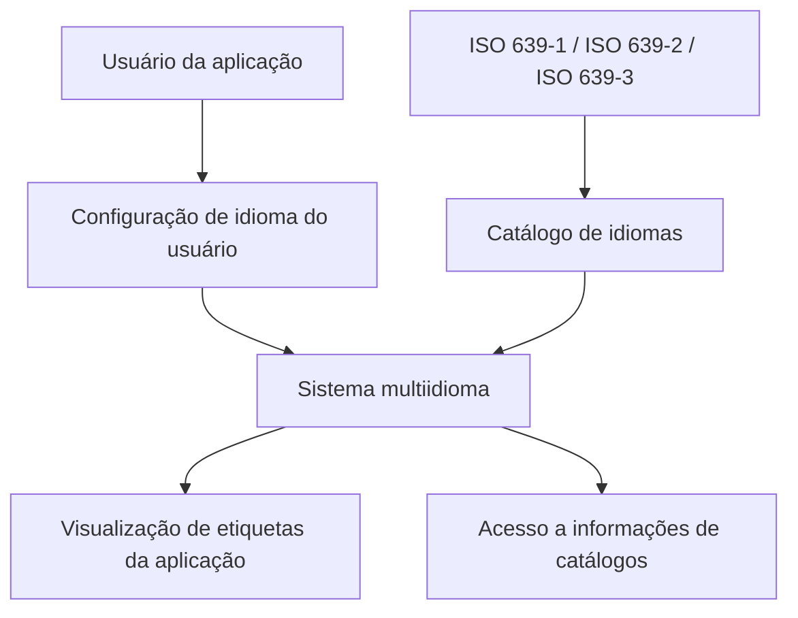

# Definição dos Idiomas Suportados pelo Sistema Multiidioma

## 1. Metadados do Documento
- **Arquivo de Origem:** Não identificado
- **Tipo de Documento:** Especificação Técnica / Funcional
- **Domínio / Sistema:** Sistema multiidioma — catálogo de idiomas
- **Público-Alvo:** Desenvolvedores, analistas funcionais e equipes de configuração
- **Data/Versão Identificada:** Não identificada

---

## 2. Resumo Executivo & Contexto de Negócio

O documento define o catálogo de idiomas suportados por um sistema multiidioma. O objetivo do catálogo é permitir que a aplicação apresente etiquetas e informações de catálogos conforme a configuração de idioma associada ao usuário que utiliza o sistema.

Cada idioma possui uma chave de identificação, uma descrição completa e uma descrição abreviada. Esses atributos permitem cadastrar e distinguir os idiomas que estarão disponíveis para visualização de conteúdo e acesso a informações catalogadas.

A codificação dos idiomas deve seguir as normas ISO 639-1 ou ISO 639-2, utilizando códigos de duas letras. O sistema também está preparado para identificar idiomas por meio da ISO 639-3, que utiliza códigos de três letras.

O documento recomenda a leitura de materiais relacionados, especificamente “Definición de Usuarios” e “Preguntas frecuentes”, para evitar interpretações isoladas ou incorretas sobre a definição da tabela de idiomas.

---

## 3. Arquitetura, Componentes & Tecnologias Envolvidas

Os elementos identificados são:

| Componente | Função identificada |
| :--- | :--- |
| Sistema multiidioma | Permite configurar idiomas para visualização de etiquetas da aplicação e consulta de catálogos. |
| Configuração de idioma do usuário | Determina o idioma utilizado para visualizar etiquetas e acessar informações de catálogos. |
| Catálogo de idiomas | Armazena a relação de idiomas/línguas permitidos no sistema. |
| Etiquetas da aplicação | Elementos visualizados conforme o idioma configurado para o usuário. |
| Catálogos | Fonte de informações acessada conforme a configuração de idioma do usuário. |
| Norma ISO 639-1 | Norma recomendada para codificar e representar idiomas com códigos de duas letras. |
| Norma ISO 639-2 | Norma recomendada para codificar e representar idiomas com códigos de duas letras. |
| Norma ISO 639-3 | Norma suportada para identificar idiomas com códigos de três letras. |



**Nota de Análise:** O documento não descreve tecnologias de implementação, APIs, banco de dados, interfaces, métodos HTTP, contratos JSON, ambientes ou integrações externas.

---

## 4. Regras de Negócio, Especificações Funcionais & Processos

1. O sistema possui comportamento multiidioma.
2. O sistema permite codificar uma relação de idiomas ou linguagens disponíveis.
3. Os idiomas cadastrados determinam os idiomas em que as etiquetas da aplicação poderão ser visualizadas.
4. Os idiomas cadastrados também permitem acessar catálogos para obter informações.
5. A visualização de etiquetas e o acesso a catálogos ocorrem de acordo com a configuração de idioma do usuário que utiliza a aplicação.
6. Cada idioma definido deve possuir uma chave ou código de idioma.
7. Cada idioma definido deve possuir uma descrição de idioma.
8. Cada idioma definido deve possuir uma descrição abreviada.
9. A chave de idioma representa o idioma ou linguagem que está sendo definido.
10. A descrição de idioma representa o nome ou a descrição da chave de idioma.
11. A descrição abreviada representa a denominação ou descrição abreviada da chave de idioma.
12. A codificação e representação dos idiomas do catálogo devem respeitar a norma ISO 639-1 ou ISO 639-2 para códigos de duas letras.
13. O sistema também está preparado para utilizar a ISO 639-3 para identificar idiomas por meio de códigos de três letras.
14. A leitura de “Definición de Usuarios” e “Preguntas frecuentes” é recomendada para evitar que a interpretação isolada do documento leve a erro.

---

## 5. Tabelas de Parâmetros, Ambientes e Estruturas de Dados

| Item / Parâmetro | Descrição / Função | Tipo / Valores / Formato | Ambiente / Observações |
| :--- | :--- | :--- | :--- |
| Código de Idioma | Chave do idioma ou linguagem que está sendo definido. | Código de duas letras conforme ISO 639-1 ou ISO 639-2; o sistema também suporta código de três letras conforme ISO 639-3. | O documento não especifica validação técnica, obrigatoriedade ou persistência. |
| Descrição do Idioma | Nome ou descrição da chave de idioma. | Texto. | O documento não informa tamanho máximo ou idioma da descrição. |
| Descrição Abreviada do Idioma | Denominação ou descrição abreviada da chave de idioma. | Texto abreviado. | O documento não informa formato ou tamanho máximo. |
| ES | Español (o Castellano). | Abreviatura: `Esp.` | Exemplo apresentado no catálogo. |
| TR | Türkçe. | Abreviatura: `Turk.` | Exemplo apresentado no catálogo. |
| EN | English. | Abreviatura: `Eng.` | Exemplo apresentado no catálogo. |
| ISO 639-1 | Norma para codificar e representar idiomas. | Código de duas letras. | Deve ser respeitada na codificação do catálogo. |
| ISO 639-2 | Norma para codificar e representar idiomas. | Código de duas letras. | Deve ser respeitada na codificação do catálogo. |
| ISO 639-3 | Norma alternativa suportada pelo sistema para identificar idiomas. | Código de três letras. | O documento informa suporte, mas não detalha condições de uso. |

---

## 6. Bateria de Perguntas & Respostas para RAG (FAQ Sintético)

### P1: Qual é a finalidade do catálogo de idiomas do sistema?
**R:** O catálogo de idiomas define a relação de linguagens que podem ser utilizadas pelo sistema multiidioma para visualizar etiquetas da aplicação e acessar informações de catálogos, de acordo com a configuração de idioma do usuário.

### P2: O que determina o idioma usado para visualizar etiquetas na aplicação?
**R:** A visualização das etiquetas da aplicação ocorre conforme a configuração de idioma do usuário que utiliza a aplicação.

### P3: Quais propriedades devem ser definidas para cada idioma do catálogo?
**R:** Cada idioma deve possuir Código de Idioma, Descrição do Idioma e Descrição Abreviada do Idioma.

### P4: O que representa o Código de Idioma?
**R:** O Código de Idioma é a chave que identifica o idioma ou a linguagem que está sendo definida no catálogo de idiomas do sistema.

### P5: Qual é a função da Descrição do Idioma?
**R:** A Descrição do Idioma contém o nome ou a descrição da chave de idioma cadastrada.

### P6: Para que serve a Descrição Abreviada do Idioma?
**R:** A Descrição Abreviada do Idioma informa a denominação ou descrição abreviada da chave de idioma definida.

### P7: Quais normas devem ser respeitadas para codificar idiomas no sistema?
**R:** A codificação e a representação dos idiomas do catálogo devem respeitar a ISO 639-1 ou a ISO 639-2 para códigos de duas letras. O sistema também suporta a ISO 639-3 para identificação por códigos de três letras.

### P8: O sistema aceita códigos de idioma de três letras?
**R:** Sim. O documento informa que o sistema está preparado para utilizar a ISO 639-3, que identifica idiomas por meio de um código de três letras.

### P9: Quais exemplos de idiomas são apresentados no documento?
**R:** O documento apresenta `ES` para Español (o Castellano), com abreviatura `Esp.`; `TR` para Türkçe, com abreviatura `Turk.`; e `EN` para English, com abreviatura `Eng.`

### P10: Quais documentos relacionados devem ser consultados?
**R:** O documento recomenda a leitura de “Definición de Usuarios” e “Preguntas frecuentes”, pois a interpretação isolada da definição de idiomas pode conduzir a erro.

---

## 7. Glossário de Termos, Siglas & Conceitos-Chave

- **Sistema multiidioma:** Sistema que permite configurar idiomas para visualização de etiquetas da aplicação e acesso a informações de catálogos.
- **Catálogo de idiomas:** Relação de idiomas ou linguagens que podem ser codificados e utilizados no sistema.
- **Código de Idioma:** Chave que identifica o idioma ou a linguagem definida.
- **Descrição do Idioma:** Nome ou descrição da chave de idioma.
- **Descrição Abreviada do Idioma:** Denominação ou descrição curta da chave de idioma.
- **ISO 639-1:** Norma citada para codificação e representação de idiomas com códigos de duas letras.
- **ISO 639-2:** Norma citada para codificação e representação de idiomas com códigos de duas letras.
- **ISO 639-3:** Norma citada para identificação de idiomas com códigos de três letras.
- **ES:** Código apresentado para Español (o Castellano).
- **TR:** Código apresentado para Türkçe.
- **EN:** Código apresentado para English.

---

## 8. Notas Críticas, Riscos & Limitações

- O documento recomenda consultar documentos funcionais relacionados para evitar interpretações erradas decorrentes da leitura isolada.
- Não são detalhados critérios técnicos para validação, obrigatoriedade, unicidade ou persistência dos códigos de idioma.
- Não são fornecidos métodos de manutenção do catálogo, permissões de alteração, fluxos de aprovação ou auditoria.
- Não há detalhamento de tecnologias, integrações, APIs, banco de dados, ambientes, URLs, logs ou contratos de interface.
- O trecho contém referências aparentes a “CF”, “Home Solutions APIs Documentation Zeus” e uma ocorrência isolada de `EN`; o conteúdo fornecido não explica a relação dessas referências com a tabela de idiomas.

---

## 9. Conteúdo Bruto Estruturado (Referência Fiel)

```text
--- [PÁGINA 1 DE 2] ---

DEFINICIÓN de los IDIOMAS soportados por el
Sistema
Propiedades Generales
El sistema por ser multiidioma, permite codificar la relación de Lenguajes en los que se podrán
visualizar las etiquetas de la Aplicación o acceder a los catálogos para obtener información todo ello
de acuerdo a la configuración del Idioma del Usuario que utiliza la aplicación.
Código de Idioma
Esta propiedad contiene la clave del Idioma o Lenguaje que se está definiendo.
Descripción del Idioma
Esta propiedad contiene el nombre o descripción de la clave del Idioma.
Descripción Abreviada del Idioma
Este Atributo indica cual es la denominación o descripción abreviada de la clave de Idioma que se
está definiendo.
IDIOMA DESCRIPCIÓN ABREVIATURA
ES Español (o Castellano) Esp.
 /
 CF
Home Solutions APIs Documentation Zeus
EN


--- [PÁGINA 2 DE 2] ---

IDIOMA DESCRIPCIÓN ABREVIATURA
TR Türkçe Turk.
EN English Eng.
... ... ...
Vínculos
Relación de Directrices y Documentos funcionales cuya lectura recomendada para evitar que la
interpretación aislada del presente documento pueda conducir a error.
Definición de Usuarios
Preguntas frecuentes
(1) ¿Existe alguna recomendación operativa que deba ser tomada en consideración localmente en la
codificación, uso y definición de la tabla de Idiomas del Sistema?
Se debe respetar la Norma ISO 639-1 o ISO 639-2 para codificar y representar en el sistema los
lenguaje o idiomas del Catálogo con códigos de dos letras, si bien también está preparado para
utilizar la versión ISO 639-3 para identificar los Idiomas con un código de tres letras.
```
