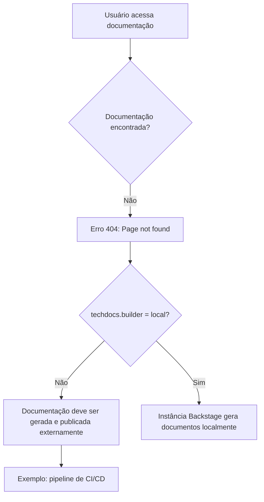

# Página de Erro 404 do TechDocs / Backstage

## 1. Metadados do Documento
- **Arquivo de Origem:** `Não informado`
- **Tipo de Documento:** `Não identificado — conteúdo corresponde a uma página de erro`
- **Domínio / Sistema:** `TechDocs, Backstage, Zeus`
- **Público-Alvo:** `Usuários da documentação, suporte e equipes responsáveis pela publicação de documentos`
- **Data/Versão Identificada:** `Não identificada`

---

## 2. Resumo Executivo & Contexto de Negócio

O conteúdo original registra uma página de erro **404** para documentação técnica. A interface informa que a página solicitada não foi encontrada e apresenta a mensagem visual “Looks like someone dropped the mic!”.

A causa indicada está relacionada à configuração do TechDocs no Backstage: `techdocs.builder` não está definido como `local`. Nessa configuração, a instância do Backstage não gera documentação localmente quando os documentos não são encontrados.

O texto estabelece que a documentação do projeto deve ser gerada e publicada por um processo externo, com o pipeline de **CI/CD** citado como exemplo. Como alternativa, o valor de `techdocs.builder` pode ser alterado para `local`, permitindo a geração de documentos pela própria instância Backstage.

A página também disponibiliza opções de navegação e suporte, incluindo retorno à página anterior, contato com o suporte, além de referências de navegação para `Home`, `Solutions`, `APIs`, `Documentation`, `Zeus`, idioma `EN` e `CF`.

---

## 3. Arquitetura, Componentes & Tecnologias Envolvidas

Os componentes explicitamente citados são:

| Componente / Tecnologia | Papel identificado no conteúdo |
| :--- | :--- |
| Backstage | Instância que apresenta a página de erro e pode gerar documentação quando configurada para isso. |
| TechDocs | Mecanismo de documentação citado pela configuração `techdocs.builder`. |
| `techdocs.builder` | Configuração que define a estratégia de geração de documentação. |
| `local` | Valor alternativo para `techdocs.builder`, permitindo que a instância Backstage gere documentos localmente. |
| Processo externo | Processo responsável por gerar e publicar a documentação quando `techdocs.builder` não está configurado como `local`. |
| CI/CD pipeline | Exemplo de processo externo que pode gerar e publicar a documentação. |
| Zeus | Item presente na navegação da página. Não há detalhamento funcional adicional. |
| CF | Item presente na navegação da página. Não há detalhamento adicional. |



> *Nota de Análise: O conteúdo não informa a URL solicitada, a configuração atual completa do Backstage, o repositório do projeto, nem o mecanismo específico de publicação da documentação.*

---

## 4. Regras de Negócio, Especificações Funcionais & Processos

1. A página apresentada corresponde a uma condição de erro **404**, indicando que a página de documentação não foi encontrada.
2. A configuração `techdocs.builder` não está definida como `local`.
3. Quando `techdocs.builder` não está configurado como `local`, a instância Backstage não gera documentos se eles não forem encontrados.
4. Nessa situação, os documentos do projeto devem ser gerados e publicados por algum processo externo.
5. O conteúdo cita um pipeline de CI/CD como exemplo de processo externo de geração e publicação.
6. Como alternativa à publicação externa, a configuração `techdocs.builder` pode ser alterada para `local`.
7. Com `techdocs.builder` configurado como `local`, a instância Backstage pode gerar a documentação.
8. A página orienta o usuário a voltar à tela anterior ou contatar o suporte caso considere a situação um defeito.

---

## 5. Tabelas de Parâmetros, Ambientes e Estruturas de Dados

| Item / Parâmetro | Descrição / Função | Tipo / Valores / Formato | Ambiente / Observações |
| :--- | :--- | :--- | :--- |
| `ERROR 404` | Indica que a página solicitada não foi encontrada. | Código de erro HTTP exibido na página. | Nenhuma URL ou recurso específico foi identificado. |
| `techdocs.builder` | Configuração associada à geração de documentação no TechDocs. | Valor mencionado: `local`. | O texto informa que o parâmetro não está definido como `local`. |
| `local` | Alternativa de configuração para permitir geração de documentos pela instância Backstage. | Valor de configuração. | Deve ser usado em `techdocs.builder`, conforme orientação do conteúdo. |
| Processo externo | Responsável por gerar e publicar documentos quando a geração local não ocorre. | Processo operacional. | O pipeline de CI/CD é apresentado apenas como exemplo. |
| CI/CD pipeline | Exemplo de processo externo para geração e publicação da documentação. | Pipeline de integração e entrega contínuas. | Não há ferramenta, repositório ou pipeline específico identificado. |
| `Zeus` | Item de navegação exibido na página. | Nome próprio / menu. | Não detalhado no conteúdo. |
| `CF` | Item de navegação exibido na página. | Sigla / menu. | Não detalhado no conteúdo. |
| `EN` | Idioma exibido na interface. | Código de idioma. | Indica interface em inglês. |

---

## 6. Bateria de Perguntas & Respostas para RAG (FAQ Sintético)

### P1: O que significa o erro exibido na página de documentação?
**R:** O erro exibido é `ERROR 404: Page not found`, indicando que a página de documentação solicitada não foi encontrada.

### P2: Por que a instância Backstage não gera a documentação ausente?
**R:** O texto informa que `techdocs.builder` não está definido como `local`. Nessa configuração, a instância Backstage não gera documentos quando eles não são encontrados.

### P3: Qual configuração permite que o Backstage gere documentos localmente?
**R:** A configuração indicada é definir `techdocs.builder` como `local`. O conteúdo afirma que essa alteração permite a geração de documentos pela própria instância Backstage.

### P4: Como a documentação deve ser disponibilizada quando `techdocs.builder` não está configurado como `local`?
**R:** A documentação do projeto deve ser gerada e publicada por algum processo externo.

### P5: Qual exemplo de processo externo é citado para publicar a documentação?
**R:** O conteúdo cita um pipeline de CI/CD como exemplo de processo externo capaz de gerar e publicar a documentação.

### P6: O documento informa qual pipeline de CI/CD deve ser utilizado?
**R:** Não. O conteúdo menciona um pipeline de CI/CD apenas como exemplo e não identifica ferramenta, nome de pipeline, repositório ou processo de publicação específico.

### P7: O que o usuário pode fazer ao encontrar a página de erro?
**R:** A página orienta o usuário a voltar ou contatar o suporte caso considere que o erro seja um defeito.

### P8: O conteúdo detalha qual página ou URL retornou o erro 404?
**R:** Não. O conteúdo informa apenas que uma página não foi encontrada; nenhuma URL, rota ou recurso específico é apresentado.

### P9: O que é citado na navegação da página de erro?
**R:** A navegação exibida contém `Home`, `Solutions`, `APIs`, `Documentation`, `Zeus`, o idioma `EN` e `CF`.

### P10: O texto explica a função de Zeus?
**R:** Não. `Zeus` aparece como item de navegação, sem explicação adicional de sua função ou relação com o erro.

---

## 7. Glossário de Termos, Siglas & Conceitos-Chave

- **404:** Código de erro exibido para indicar que uma página não foi encontrada.
- **Backstage:** Plataforma citada como a instância que pode gerar documentação quando configurada para isso.
- **TechDocs:** Componente de documentação relacionado à configuração `techdocs.builder`.
- **`techdocs.builder`:** Parâmetro de configuração mencionado para controlar a geração de documentação.
- **`local`:** Valor de configuração que permite à instância Backstage gerar documentos localmente.
- **CI/CD:** Sigla apresentada no conteúdo como exemplo de pipeline externo para gerar e publicar documentação.
- **Zeus:** Item de navegação exibido na página; não detalhado.
- **CF:** Item de navegação exibido na página; não detalhado.
- **EN:** Código de idioma exibido na interface.

---

## 8. Notas Críticas, Riscos & Limitações

- A documentação solicitada não foi encontrada, resultando em erro 404.
- A instância Backstage não gerará a documentação ausente enquanto `techdocs.builder` não estiver configurado como `local`.
- A disponibilidade da documentação depende de geração e publicação por processo externo quando a geração local não é utilizada.
- O pipeline de CI/CD é citado somente como exemplo; o documento não identifica responsáveis, ferramentas, gatilhos, repositórios ou artefatos publicados.
- Não há detalhamento sobre a página ausente, URL, projeto, logs, permissões, versões ou procedimentos de correção.
- `Zeus` e `CF` são apresentados sem definição funcional adicional.

---

## 9. Conteúdo Bruto Estruturado (Referência Fiel)

```text
--- [PÁGINA 1 DE 1] ---

ERROR 404: j: Page not found.
Note that techdocs.builder is not set to 'local' in
your config, which means this Backstage app will
not generate docs if they are not found. Make sure
the project's docs are generated and published by
some external process (e.g. CI/CD pipeline). Or
change techdocs.builder to 'local' to generate docs
from this Backstage instance.
Looks like someone
dropped the mic!
Go back... or please  if you
think this is a bug.
contact support
 / 
 CF
Home Solutions APIs Documentation Zeus
EN
```
