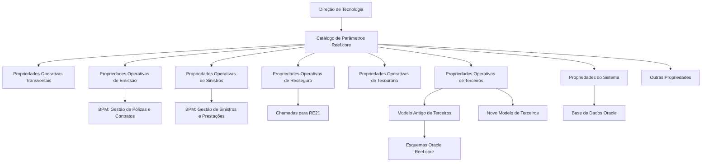

# Catálogo de Parâmetros Iniciais da Instalação Reef.core

## 1. Metadados do Documento
- **Arquivo de Origem:** Não identificado no conteúdo fornecido
- **Tipo de Documento:** Especificação Técnica
- **Domínio / Sistema:** Reef.core / NewTron / MAPFRE
- **Público-Alvo:** Desenvolvedores, Arquitetos, Operação e Administração Tecnológica
- **Data/Versão Identificada:** Não identificada

---

## 2. Resumo Executivo & Contexto de Negócio

O documento descreve o catálogo de parâmetros iniciais de instalação do sistema Reef.core. Esses parâmetros identificam, codificam e modulam o comportamento e a funcionalidade dos módulos da solução. O catálogo é entregue inicialmente às entidades com conteúdo pré-carregado.

A configuração é organizada por agrupamentos operacionais e tecnológicos: propriedades operacionais transversais, de emissão, de sinistros, de resseguro, de tesouraria, relacionadas a terceiros ou pessoas físicas e jurídicas, propriedades tecnológicas do sistema e outras propriedades. A Direção de Tecnologia é responsável pela identificação e definição de todos esses parâmetros.

Os parâmetros operacionais controlam decisões funcionais como o dia inicial da semana, o acesso de usuários às operações do Reef.core, a ativação de processos via Business Process Management (BPM), limites de riscos em chamadas ao RE21 e a possibilidade de realizar cobranças de múltiplas companhias em uma única caixa.

O documento também detalha a coexistência de modelos de dados de terceiros. Uma instalação utiliza exclusivamente o Modelo Antigo ou o Novo Modelo de Informação de Terceiros. O Novo Modelo foi evoluído para atender ao Modelo de Referência de Clientes corporativo da MAPFRE e ampliar funcionalidade e flexibilidade. Alguns parâmetros têm comportamento condicionado ao uso do modelo antigo, como contas bancárias múltiplas e cartões múltiplos.

No âmbito tecnológico, o catálogo determina características como banco de dados Oracle, formato de datas sem separadores, constantes de compatibilidade entre idiomas, conjunto de caracteres, chave local da instalação, idioma padrão e limites máximos de registros em consultas. Por ser um catálogo relativamente dinâmico, o documento recomenda a consulta recorrente de seu conteúdo.

---

## 3. Arquitetura, Componentes & Tecnologias Envolvidas

### Componentes, domínios e tecnologias identificados

| Componente / Termo | Papel descrito no documento |
| :--- | :--- |
| **Reef.core** | Sistema cuja instalação, módulos e comportamento são configurados pelo catálogo de parâmetros. |
| **NewTron** | Referenciado no parâmetro de acesso de usuário às operações de Reef.core. |
| **Catálogo de Parâmetros** | Repositório de informações usado para codificar parâmetros que modulam comportamento e funcionalidade dos módulos da solução. |
| **Direção de Tecnologia** | Área responsável pela identificação e definição dos parâmetros da instalação. |
| **Business Process Management (BPM)** | Mecanismo cuja ativação pode controlar a execução dos processos de Gestão de Pólizas e Contratos e de Gestão de Sinistros e Prestações. |
| **RE21** | Destino das chamadas realizadas para gravar uma proposta; possui limite máximo de riscos por chamada. |
| **Modelo Antigo de Dados de Terceiros** | Modelo exclusivo alternativo ao Novo Modelo; exige esquemas Oracle Reef.core para determinados processos massivos. |
| **Novo Modelo de Dados de Terceiros** | Modelo evoluído para atender ao Modelo de Referência de Clientes da MAPFRE e fornecer maior funcionalidade e flexibilidade. |
| **Oracle** | Banco de dados identificado como suporte da informação do sistema; também é citado em esquemas Reef.core necessários quando o modelo antigo de terceiros é usado. |
| **Gerador de Produtos** | Área cujos catálogos possuem limite específico de registros retornados em consultas. |
| **MAPFRE** | Organização cujo Modelo de Referência de Clientes é mencionado como motivação para a evolução do modelo de dados de terceiros. |



> **Nota de Análise:** O documento não apresenta métodos HTTP, contratos JSON, topologia de infraestrutura, portas, URLs, interfaces de integração nem detalhes de implementação dos componentes citados.

---

## 4. Regras de Negócio, Especificações Funcionais & Processos

### 4.1 Governança do catálogo

- O Reef.core permite identificar e codificar parâmetros que intervêm e modulam o comportamento e a funcionalidade dos módulos da solução.
- O catálogo é entregue inicialmente às entidades com conteúdo pré-carregado.
- A Direção de Tecnologia é responsável pela identificação e definição de todos os parâmetros do catálogo.
- O catálogo é relativamente dinâmico; por isso, recomenda-se consultar seu conteúdo de forma recorrente.

### 4.2 Propriedades operativas transversais

- **Dia de início semanal:** identifica o dia em que a semana começa.
- **Acesso de usuário às operações Reef.core:** determina se a instalação contempla ou não o acesso por usuário às operações de Reef.core, referenciado como NewTron.
- **Formato para data de registro:** determina se o atributo `FEC_ACTU`, que contém a data de registro dos catálogos, é truncado ou possui formato `HH:MI:SS`.

### 4.3 Propriedades operativas de emissão

- **Hora/minutos padrão em suplementos:** para ramos que tenham obrigatoriedade de captura configurada, identifica a hora e os minutos apresentados como parte da data de efeito da apólice ou da data de efeito do suplemento no Processo de Emissão.
- **BPM em Gestão de Pólizas e Contratos:** identifica se o processo de Gestão de Pólizas e Contratos possui ou não execução ativada por BPM.

### 4.4 Propriedades operativas de sinistros

- **BPM em Gestão de Sinistros e Prestações:** identifica se o processo de Gestão de Sinistros e Prestações possui ou não execução ativada por BPM.

### 4.5 Propriedades operativas de resseguro

- **Registros a tratar em chamada ao RE21:** determina o número máximo de riscos permitido pelo sistema nas chamadas realizadas para gravar uma proposta no RE21.

### 4.6 Propriedades operativas de tesouraria

- **Cobrança de recibos em uma única caixa:** determina se é permitido realizar cobranças de recibos de várias companhias em uma única caixa.
- **Modificação de escritório em meios de cobrança/pagamento:** determina se é permitido modificar o escritório da conta quando o tipo de conta é `2 (ABA number)`.

### 4.7 Propriedades operativas de terceiros

- **Exclusividade de modelos:** os dois Modelos de Informação de Terceiros são mutuamente excludentes em uma instalação. A instalação usa o Modelo Antigo ou o Novo Modelo.
- **Novo Modelo de Dados de Terceiros:** foi evoluído para cumprir o Modelo de Referência de Clientes estabelecido corporativamente na MAPFRE e prover maior funcionalidade e flexibilidade.
- **Buzones de processos massivos:** os buzones utilizados nos Processos Massivos de Terceiros servem aos dois modelos, antigo e novo.
- **Dependência Oracle do modelo antigo:** quando o Modelo Antigo de Dados de Terceiros é usado, é necessário ter instalados os esquemas Oracle Reef.core.
- **Tipo de Documento Identificador Terceros Genérico:** identifica o tipo de documento que o sistema atribuirá por padrão na captura de terceiros pertencentes às novas atividades.
- **Código Identificador Terceros Genérico:** identifica o código genérico de terceiros, `999999`, necessário para determinados acessos à base de dados da aplicação.
- **Contas bancárias múltiplas:**
  - Quando a instalação usa o Modelo Antigo, a ativação do parâmetro determina se é possível capturar uma ou múltiplas contas bancárias.
  - Quando a instalação usa o Novo Modelo, é permitida a captura de `1` ou `n` contas bancárias.
- **Cartões múltiplos:**
  - Quando a instalação usa o Modelo Antigo, a ativação do parâmetro determina se é possível capturar um ou múltiplos cartões.
  - Quando a instalação usa o Novo Modelo, é permitida a captura de `1` ou `n` cartões nos meios de cobrança/pagamento.
- **Consulta de atividade estendida:** o documento registra o status `== Pendiente ==`; não há detalhamento funcional adicional.
- **Consulta de segurado limitada:** determina se um empregado de agência pode ou não realizar consultas sobre toda a carteira do agente ao qual está vinculado.

### 4.8 Propriedades do sistema

- **Base de Dados do Sistema:** identifica se a base de dados que suporta as informações do sistema é Oracle.
- **Formato de data sem separadores:** identifica o formato de campos de data sem separadores entre dia, mês e ano: `DDMMYYYY`.
- **Constante YES:** utilizada por compatibilidade entre os idiomas Inglês e Espanhol.
- **Constante NO:** utilizada por compatibilidade entre os idiomas Inglês e Espanhol.
- **Conjunto de caracteres do sistema:** identifica o código do conjunto de caracteres usado na aplicação, como o exemplo `iso-8859-1`.
- **Chave da instalação:** identifica localmente a instalação ou o país no qual a aplicação é executada. Permite distinguir, em determinados catálogos, se os registros pertencem ao núcleo da aplicação ou representam extensões particularizadas pela entidade.
- **Número máximo de registros em consultas:** limita a quantidade de registros retornados em uma consulta à base de dados da aplicação, reduzindo o impacto global da consulta no desempenho do sistema.
- **Número máximo de registros em consultas do Gerador de Produtos:** limita a quantidade de registros retornados especificamente em consultas aos catálogos do Gerador de Produtos, reduzindo o impacto global no desempenho.
- **Idioma da instalação:** identifica o idioma padrão de apresentação das etiquetas no conjunto de programas da aplicação.

### 4.9 Outras propriedades

O catálogo inclui outros parâmetros para:

- Formatos de campos de data no back-end e no frontal da aplicação.
- Diretórios nos quais são deixados arquivos ou listagens geradas.
- Separadores de milhares e de decimais em campos numéricos.

> **Nota de Análise:** O documento não identifica os valores concretos, caminhos de diretórios, formatos adicionais de data ou separadores numéricos associados às outras propriedades.

---

## 5. Tabelas de Parâmetros, Ambientes e Estruturas de Dados

| Item / Parâmetro | Descrição / Função | Tipo / Valores / Formato | Ambiente / Observações |
| :--- | :--- | :--- | :--- |
| Dia de início semanal | Identifica o dia de começo da semana. | Não detalhado | Propriedades Operativas Transversais |
| Acesso Usuário Operações Reef.core | Determina se a instalação contempla acesso por usuário às operações Reef.core. | Sim / Não não explicitamente detalhado | Referência a NewTron |
| Formato para Data de Registro | Determina o tratamento da data de registro dos catálogos. | `FEC_ACTU` truncada ou com formato `HH:MI:SS` | Propriedades Operativas Transversais |
| Hora/Minutos padrão em Suplementos | Define hora e minutos mostrados na data de efeito da apólice ou suplemento. | Hora e minutos; valor não detalhado | Aplicável aos ramos com obrigatoriedade de captura configurada |
| BPM em Gestão de Pólizas e Contratos | Indica ativação da execução via BPM. | Ativado / não ativado | Processo de Gestão de Pólizas e Contratos |
| BPM em Gestão de Sinistros e Prestações | Indica ativação da execução via BPM. | Ativado / não ativado | Processo de Gestão de Sinistros e Prestações |
| Registros a tratar em chamada ao RE21 | Define máximo de riscos permitidos nas chamadas para gravar uma proposta. | Número máximo; valor não detalhado | RE21 / Resseguro |
| Cobrança de recibos em uma única caixa | Define se recibos de várias companhias podem ser cobrados em uma única caixa. | Permitido / não permitido | Tesouraria |
| Modifica escritório em meios de cobrança/pagamento | Define se o escritório da conta pode ser alterado. | Permitido / não permitido | Aplicável quando tipo de conta é `2 (ABA number)` |
| O Sistema utiliza o novo Modelo de Terceiros | Indica se o país usa o Novo Modelo de Dados de Terceiros. | Novo Modelo ou Modelo Antigo | Os modelos são excludentes |
| Tipo Documento Identificador Terceros Genérico | Define o tipo de documento atribuído por padrão na captura de terceiros das novas atividades. | Não detalhado | Novo Modelo de Dados de Terceiros |
| Código Identificador Terceros Genérico | Identifica o código genérico necessário a determinados acessos à base de dados. | `999999` | Terceiros |
| Contas Bancárias Múltiplas | Controla se é possível capturar uma ou múltiplas contas bancárias. | Uma ou múltiplas | No Modelo Antigo depende da ativação; no Novo Modelo permite `1` ou `n` contas |
| Cartões Múltiplos | Controla se é possível capturar um ou múltiplos cartões. | Um ou múltiplos | No Modelo Antigo depende da ativação; no Novo Modelo permite `1` ou `n` cartões |
| Consulta Atividade Estendida | Parâmetro listado sem detalhamento funcional. | `== Pendiente ==` | Detalhamento não fornecido |
| Consulta Segurado Limitada | Define se um empregado de agência consulta toda a carteira do agente vinculado. | Permitido / não permitido | Terceiros / agência |
| Base de Dados do Sistema | Identifica a base de dados que suporta a informação do sistema. | Oracle | Propriedades do Sistema |
| Formato Data sem Separadores | Identifica formato de campos de data sem separadores. | `DDMMYYYY` | Propriedades do Sistema |
| Constante YES | Suporta compatibilidade entre Inglês e Espanhol. | `YES` | Propriedades do Sistema |
| Constante NO | Suporta compatibilidade entre Inglês e Espanhol. | `NO` | Propriedades do Sistema |
| Conjunto de Caracteres do Sistema | Identifica código do conjunto de caracteres usado na aplicação. | Exemplo: `iso-8859-1` | Propriedades do Sistema |
| Chave da Instalação | Identifica localmente a instalação ou país de execução. | Não detalhado | Distingue registros do núcleo de extensões particularizadas pela entidade |
| Número Máximo de Registros em Consultas | Limita registros retornados por consulta à base de dados. | Número máximo; valor não detalhado | Minimiza impacto no desempenho global |
| Número Máximo de Registros em Consultas do Gerador de Produtos | Limita registros retornados em consultas aos catálogos do Gerador de Produtos. | Número máximo; valor não detalhado | Minimiza impacto no desempenho global |
| Idioma da Instalação | Define idioma padrão das etiquetas dos programas da aplicação. | Não detalhado | Propriedades do Sistema |
| Formatos adicionais de data | Define formatos para campos data. | Não detalhado | Back-end e frontal da aplicação |
| Diretórios de arquivos/listagens | Define diretórios onde arquivos ou listagens geradas são deixados. | Caminhos não detalhados | Outras Propriedades |
| Separadores numéricos | Define separadores de milhares ou decimais. | Não detalhado | Campos numéricos |

---

## 6. Bateria de Perguntas & Respostas para RAG (FAQ Sintético)

### P1: Qual área é responsável por identificar e definir os parâmetros do catálogo Reef.core?
**R:** A Direção de Tecnologia é responsável pela identificação e definição de todos os parâmetros do catálogo de parâmetros da instalação Reef.core.

### P2: O que o parâmetro “Formato para Data de Registro” controla no Reef.core?
**R:** O parâmetro determina se o atributo `FEC_ACTU`, que contém a data de registro dos catálogos, é truncado ou possui o formato `HH:MI:SS`.

### P3: Como o BPM é aplicado aos processos de negócio descritos?
**R:** O catálogo contém um parâmetro para indicar se a Gestão de Pólizas e Contratos é executada via BPM e outro parâmetro para indicar se a Gestão de Sinistros e Prestações é executada via BPM. O documento não detalha a implementação nem os fluxos internos do BPM.

### P4: Qual é a finalidade do parâmetro “Registros a tratar em chamada ao RE21”?
**R:** O parâmetro determina o número máximo de riscos que o sistema permite nas chamadas realizadas para gravar uma proposta no RE21. O valor numérico desse limite não é apresentado no documento.

### P5: Os Modelos Antigo e Novo de Informação de Terceiros podem coexistir na mesma instalação?
**R:** Não. O documento estabelece que os dois Modelos de Informação de Terceiros são excludentes: uma instalação utiliza o Modelo Antigo ou utiliza o Novo Modelo.

### P6: Qual dependência existe ao usar o Modelo Antigo de Dados de Terceiros?
**R:** Os buzones usados nos Processos Massivos de Terceiros servem tanto ao Novo Modelo quanto ao Modelo Antigo. Porém, quando o Modelo Antigo é utilizado, é necessário ter instalados os esquemas Oracle Reef.core.

### P7: Como funcionam contas bancárias múltiplas nos dois modelos de terceiros?
**R:** No Modelo Antigo de Dados de Terceiros, a ativação do parâmetro Contas Bancárias Múltiplas determina se é permitida a captura de uma ou de múltiplas contas bancárias. No Novo Modelo de Dados de Terceiros, a captura de `1` ou `n` contas bancárias é permitida indistintamente.

### P8: Qual é o código genérico de terceiros mencionado para acessos à base de dados?
**R:** O Código Identificador Terceros Genérico é `999999`. O documento informa que esse código é necessário para realizar determinados acessos à base de dados da aplicação.

### P9: Em qual condição é possível modificar o escritório da conta em meios de cobrança ou pagamento?
**R:** O atributo Modifica Oficina en Medios de Cobro/Pago determina se o escritório da conta pode ou não ser modificado quando o tipo de conta é `2 (ABA number)`.

### P10: Qual formato de data sem separadores é identificado pelo catálogo?
**R:** O parâmetro Formato Fecha sin Separadores identifica o formato `DDMMYYYY`, sem separador entre dia, mês e ano.

### P11: Para que serve a Chave da Instalação?
**R:** A Chave da Instalação identifica localmente a instalação ou o país em que a aplicação é executada. Ela permite distinguir, em determinados catálogos, se os registros pertencem ao núcleo da aplicação ou se são extensões particularizadas pela entidade.

### P12: Como o catálogo protege o desempenho das consultas?
**R:** O catálogo possui um parâmetro de Número Máximo de Registros em Consultas e outro específico para consultas aos Catálogos do Gerador de Produtos. Ambos limitam a quantidade de registros retornados para minimizar o impacto global das consultas sobre o desempenho do sistema.

---

## 7. Glossário de Termos, Siglas & Conceitos-Chave

- **ABA number:** Tipo de conta identificado no documento como valor `2`, para o qual a modificação de escritório pode ser controlada.
- **BPM:** Business Process Management; mecanismo de execução que pode ser ativado nos processos de Gestão de Pólizas e Contratos e de Gestão de Sinistros e Prestações.
- **Catálogo de Parâmetros:** Catálogo de informação que reúne parâmetros capazes de modular o comportamento e a funcionalidade dos módulos da solução Reef.core.
- **FEC_ACTU:** Atributo que contém a data de registro dos catálogos.
- **Gerador de Produtos:** Componente ou domínio cujos catálogos possuem limite específico de registros retornados em consultas.
- **MAPFRE:** Organização mencionada em relação ao Modelo de Referência de Clientes corporativo.
- **NewTron:** Nome referenciado no parâmetro que determina acesso por usuário às operações de Reef.core.
- **Novo Modelo de Dados de Terceiros:** Modelo evoluído para atender ao Modelo de Referência de Clientes da MAPFRE e oferecer maior funcionalidade e flexibilidade.
- **Oracle:** Banco de dados identificado como suporte das informações do sistema e tecnologia dos esquemas Reef.core requeridos pelo Modelo Antigo de Terceiros.
- **RE21:** Destino das chamadas para gravar uma proposta; possui limite configurável de riscos por chamada.
- **Reef.core:** Solução e aplicação cujo comportamento é configurado pelo catálogo de parâmetros.
- **Terceros:** Termo usado no documento para terceiros, pessoas físicas e/ou jurídicas, e seus respectivos modelos de dados.

---

## 8. Notas Críticas, Riscos & Limitações

- O documento não informa valores configurados para a maior parte dos parâmetros; ele descreve as finalidades dos parâmetros.
- Não são fornecidos caminhos concretos de diretórios, URLs, servidores, credenciais, portas, contratos de integração ou detalhes de infraestrutura.
- O parâmetro **Consulta Actividad Extendida** está explicitamente marcado como `== Pendiente ==`, sem especificação funcional adicional.
- A utilização do Modelo Antigo de Dados de Terceiros possui dependência dos esquemas Oracle Reef.core para Processos Massivos de Terceiros.
- Os modelos Antigo e Novo de Informação de Terceiros são excludentes, o que representa uma restrição arquitetural e funcional por instalação.
- Limites máximos de registros em consultas devem ser tratados como controles de desempenho; valores excessivos podem contrariar o objetivo declarado de minimizar impacto global no sistema.
- O catálogo é relativamente dinâmico. A consulta recorrente do seu conteúdo é recomendada para evitar decisões baseadas em configurações desatualizadas.
- A leitura isolada do documento pode levar a interpretações incorretas. O próprio documento recomenda consultar diretrizes e documentos funcionais relacionados, incluindo Companhias da Instalação, Idiomas da Instalação e Perguntas Frequentes.

---

## 9. Conteúdo Bruto Estruturado (Referência Fiel)

```text
--- [PÁGINA 1 DE 6] ---

DEFINICIÓN de Los Parámetros Iniciales de la
Instalación
Reef.core permite identificar y codificar ciertos Parámetros, que intervienen y modulan el
comportamiento y funcionalidad de los distintos módulos de la Solución, en un catálogo de
información que se entrega a las entidades inicialmente con contenido pre cargado.
En el catálogo se configuran los diferentes parámetros de acuerdo con las siguientes agrupaciones:
Propiedades Operativas Transversales
Propiedades Operativas de Emisión
Propiedades Operativas de Siniestros
Propiedades Operativas de Reaseguro
Propiedades Operativas de Tesorería
Propiedades Operativas Relacionadas con las Personas Físicas y/o Jurídicas
Propiedades Tecnológicas del Sistema
Otras Propiedades
Es competencia de la Dirección de Tecnología la identificación y definición de todos estos
parámetros.
Propiedades Operativas Transversales
 /
 CF
Home Solutions APIs Documentation Zeus
EN


--- [PÁGINA 2 DE 6] ---

Día de inicio semanal
Este Parámetro identifica el día en el que empieza la semana.
Acceso Usuario Operaciones Reef.core?
Este Parámetro determina si la instalación contempla o no el acceso por usuario a las operaciones
de Reef.core (NewTron).
Formato para Fecha de Registro
Este Parámetro de la instalación determina si el atributo que contiene la fecha de registro de los
catálogos (FEC_ACTU) está truncada o tiene el formato HH:MI:SS.
Propiedades Operativas de Emisión
Hora/Minutos por defecto en Suplementos
Este Parámetro identifica, en aquellos Ramos que tengan configurada la obligatoriedad de su
captura, la Hora y minutos que se mostrarán como parte de la Fecha de Efecto de la póliza o de la
fecha de efecto del suplemento en el Proceso de Emisión.
BPM en Proceso de Gestión de Pólizas y Contratos
Este Parámetro identifica si el proceso de Gestión de Pólizas y Contratos tiene o no activada su
ejecución vía Business Process Management (BPM).
Propiedades Operativas de Siniestros
BPM en Proceso de Gestión de Siniestros y Prestaciones
Este Parámetro identifica si el proceso de Gestión de Siniestros y Prestaciones tiene o no activada su
ejecución vía Business Process Management (BPM).
Propiedades Operativas del Reaseguro
Registros a tratar en Llamada a RE21
Este Parámetro determina el número máximo de riesgos que el Sistema permite en las llamadas que
se realizan para GRABAR una propuesta en RE21.
Propiedades Operativas de Tesorería
Ejemplo:


--- [PÁGINA 3 DE 6] ---

Cobro de Recibos en una única Caja
Este Parámetro determina si se permite o no realizar cobros de recibos de varias compañías en una
única caja.
Modifica Oficina en Medios de Cobro/Pago
Este atributo determina si se puede o no modificar la oficina de la cuenta cuando el tipo de cuenta es
2 (ABA number).
Propiedades Operativas de Terceros
El Sistema emplea el nuevo Modelo de Terceros
El modelo de datos de Terceros se ha evolucionado, para por un lado cumplir el Modelo de
Referencia de Clientes establecido en MAPFRE a nivel corporativo y por otro para dotarle de mayor
funcionalidad y flexibilidad.
Es por ello por lo que se han definido este parámetro para distinguir e indicar si los países están
utilizando o no el nuevo modelo de datos de Terceros.
Los buzones utilizados en los Procesos Masivos de Terceros sirven para ambos modelos: Tanto
para el nuevo como para el antiguo pero es necesario tener instalados los esquemas ORACLE
Reef.core si se utiliza el modelo antiguo.
Tipo Documento Identificador Terceros Genérico
Como consecuencia de la evolución del Nuevo Modelo de Datos de Terceros este Parámetro
identifica el tipo de Documento que el sistema asignará por defecto en la captura de los Terceros
pertenecientes a las nuevas actividades.
Código Identificador Terceros Genérico
Como consecuencia de la evolución del Nuevo Modelo de Datos de Terceros y de las nuevas
Actividades de Terceros creadas, es necesario identificar cual es el código genérico de los Terceros
(999999) para realizar determinados accesos a la Base de Datos de la Aplicación.
Cuentas Bancarias Múltiples
Siempre y cuando la instalación utilice el Modelo de Datos de Terceros antiguo, la activación de este
parámetro modula la funcionalidad del sistema permitiendo la posibilidad de capturar múltiples
cuentas bancarias o solamente una (a diferencia de si la instalación emplea el Nuevo Modelo de
Datos en el que se permite indistintamente la captura de 1 o n cuentas bancarias).
Consejo:


--- [PÁGINA 4 DE 6] ---

Tarjetas Múltiples
Siempre y cuando la instalación utilice el Modelo de Datos de Terceros antiguo, la activación de este
parámetro modula la funcionalidad del sistema permitiendo la posibilidad de capturar múltiples
Tarjetas o solamente una (a diferencia de si la instalación emplea el Nuevo Modelo de Datos en el
que se permite indistintamente la captura de 1 o n Tarjetas en los medios de cobro/pago).
Consulta Actividad Extendida
== Pendiente ==
Consulta Asegurado Limitada
Este parámetro determina si un Empleado de Agencia puede o no realizar consultas sobre toda la
cartera del Agente al que están adscritos.
Propiedades del Sistema
Base de Datos del Sistema
Este Parámetro del Catálogo identifica si la Base de Datos que soporta la información del Sistema es
ORACLE.
Formato Fecha sin Separadores
Este Parámetro del Catálogo identifica el Formato de los campos fecha sin utilizar separador alguno
entre los días, los meses y el año (DDMMYYYY)
Constante YES
Por compatibilidad entre los idiomas Inglés y Español.
Constante NO
Por compatibilidad entre los idiomas Inglés y Español.
Conjunto de Caracteres del Sistema
Un conjunto de caracteres es un sistema de codificación para que las computadoras sepan cómo
reconocer un carácter, incluidas letras, números, signos de puntuación y espacios en blanco.
Este Parámetro del Catálogo identifica el Código del Conjunto de Caracteres, alfabéticos o no, que
cuentan con unas características comunes en su estructura y en su estilo y que se emplean en la
aplicación, como por ejemplo el Código 'iso-8859-1'
Clave de la Instalación


--- [PÁGINA 5 DE 6] ---

Este Parámetro identifica localmente la instalación o país en el que se ejecuta la aplicación,
permitiendo distinguir en ciertos catálogos de la aplicación si los registros que contienen pertenecen
al núcleo o son extensiones del mismo particularizadas por la Entidad.
Número Máximo de Registros en Consultas
Este Parámetro del Catálogo identifica el número máximo de registros que se pueden obtener en una
consulta a la Base de Datos de la Aplicación minimizando así el impacto global de la consulta sobre
el rendimiento del sistema.
Número Máximo de Registros en Consultas del Generador de Productos
Este Parámetro del Catálogo identifica el número máximo de registros que se pueden obtener en una
consulta específicamente sobre los Catálogos del Generador de Productos minimizando así el
impacto global de la consulta sobre el rendimiento del sistema.
Idioma de la Instalación
Este Parámetro identifica el idioma por defecto con el que se mostrarán las etiquetas en el conjunto
de Programas de la Aplicación.
Otras Propiedades
En el catálogo existen otros parámetros que establecen formatos para los campos Fecha (tanto en el
Back-end como en el Frontal de la Aplicación), para determinar cuales serán los directorios en los
que se dejan los archivos o listados generados, para determinar los separadores de miles o
decimales en los campos numéricos, étc.
Vínculos
Relación de Directrices y Documentos funcionales cuya lectura recomendada para evitar que la
interpretación aislada del presente documento pueda conducir a error.
Compañías de la Instalación
Idiomas de la Instalación
Preguntas frecuentes
(1) ¿Son excluyentes los dos Modelos de Información de Terceros en una instalación?
Sí, o bien se utiliza el Modelo Antiguo o bien se emplea el Nuevo Modelo.
Ejemplo:


--- [PÁGINA 6 DE 6] ---

(2) ¿Existe alguna recomendación que tenga que ser tomada en cuenta en el uso y definición del
Catálogo de Parámetros de Reef.core?
Por ser un catálogo relativamente dinámico, es recomendable consultar su contenido de manera
recurrente.
```
