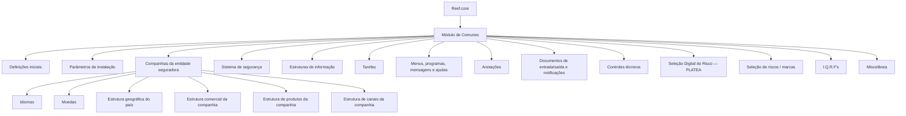

# Elementos Comuns Transversais dos Módulos Reef.core

## 1. Metadados do Documento
- **Arquivo de Origem:** Não identificado
- **Tipo de Documento:** Apresentação Executiva
- **Domínio / Sistema:** Reef.core / Comunes
- **Público-Alvo:** Negócio, Configuração, Operação e Administradores Funcionais
- **Data/Versão Identificada:** Não identificada

---

## 2. Resumo Executivo & Contexto de Negócio

O documento apresenta a definição de elementos comuns ou transversais aos módulos da plataforma Reef.core. O foco é organizar, por funcionalidade específica, os catálogos e definições que sustentam configurações compartilhadas entre os módulos do sistema.

As definições iniciais são descritas como grupos de catálogos necessários para iniciar a definição dos demais catálogos dos módulos do sistema. O documento também informa que os asteriscos exibidos nos cartões indicam a obrigatoriedade da definição do respectivo elemento.

O conteúdo destaca configurações corporativas da entidade seguradora, incluindo companhias, idiomas, moedas, estruturas geográfica, comercial, de produtos e de canais. Também cobre catálogos relacionados à segurança, estruturas de informação, tarefas, menus, programas, mensagens e ajudas da plataforma.

Por fim, o documento relaciona catálogos transversais para anotações, documentos de entrada e saída, notificações, controles técnicos, seleção digital de risco PLATEA, seleção de riscos por marcas, I.Q.R.F's e miscelânea. Para diversos tópicos, há referências textuais a documentação e vídeos, mas não são fornecidos URLs, contratos técnicos, procedimentos detalhados ou conteúdos desses materiais.

---

## 3. Arquitetura, Componentes & Tecnologias Envolvidas

O documento identifica o sistema **Reef.core** e o módulo de **Comunes** como contexto funcional. A estrutura apresentada é uma organização de catálogos transversais, utilizada pelas companhias da entidade seguradora e pelos módulos da plataforma.

Componentes e áreas funcionais citados:

- Definições iniciais.
- Parâmetros de instalação.
- Companhias da entidade seguradora.
- Idiomas e moedas.
- Estruturas geográfica, comercial, de produtos e de canais.
- Sistema de segurança.
- Estruturas de informação.
- Tarefas.
- Menus, programas, mensagens e ajudas.
- Anotações.
- Documentos de entrada/saída e notificações.
- Controles técnicos.
- Seleção Digital do Risco — PLATEA.
- Seleção de riscos por marcas.
- I.Q.R.F's.
- Miscelânea.



> **Nota de Análise:** O documento não descreve arquitetura técnica de infraestrutura, microsserviços, APIs, bancos de dados, protocolos, ambientes, URLs ou contratos de integração. O diagrama representa somente a relação funcional explícita entre Reef.core, o módulo de Comunes e os catálogos mencionados.

---

## 4. Regras de Negócio, Especificações Funcionais & Processos

1. Os elementos definidos no documento possuem caráter **comum ou transversal** aos módulos de Reef.core.
2. Os elementos são agrupados de acordo com sua funcionalidade específica.
3. As **definições iniciais** correspondem a grupos de catálogos que permitem iniciar as definições dos demais catálogos dos módulos do sistema.
4. Os asteriscos apresentados nos cartões indicam a obrigatoriedade da definição de um elemento.
5. Os **parâmetros de instalação** configuram parâmetros que afetam transversalmente o comportamento da aplicação.
6. As **companhias da entidade seguradora** são configuradas como parte dos catálogos comuns.
7. Os **idiomas** empregados nas companhias da entidade seguradora devem ser configurados.
8. As **moedas** utilizadas nas companhias da entidade seguradora devem ser configuradas.
9. A **estrutura geográfica do país** define seus níveis de estrutura geográfica.
10. A **estrutura comercial da companhia** define seus níveis de estrutura comercial.
11. A **estrutura de produtos da companhia** define seus níveis de estrutura de produtos.
12. A **estrutura de canais da companhia** é descrita como configuração de níveis de estrutura de produtos da companhia; essa é a descrição literal disponível no material.
13. O **sistema de segurança** configura os catálogos de segurança da companhia.
14. As **estruturas de informação** configuram os catálogos que compõem as estruturas de informação utilizadas pela companhia.
15. As **tarefas** configuram os catálogos que compõem as tarefas da companhia.
16. **Menus, programas, mensagens e ajudas** configuram catálogos desses elementos da plataforma.
17. As **anotações** configuram catálogos que compõem as anotações da companhia.
18. Os **documentos de entrada/saída — notificações** configuram os catálogos de notificações, também denominados documentos de entrada e saída, das operações dos módulos na companhia.
19. Os **controles técnicos** configuram os catálogos que compõem os controles técnicos da companhia.
20. A **Seleção Digital do Risco (PLATEA)** configura catálogos utilizados na seleção digital do risco nos módulos de emissão e sinistros da companhia.
21. A **seleção de riscos / marcas** configura catálogos para controle da subscrição de riscos por meio do uso de “Marcas” na companhia.
22. As **I.Q.R.F's** configuram catálogos para incidências, queixas, reclamações e felicitações na companhia.
23. A **miscelânea** configura os demais catálogos transversais da companhia existentes no módulo de Comunes.

> **Nota de Análise:** O documento não detalha campos obrigatórios, sequência operacional, responsáveis, regras de validação, cálculos, permissões ou critérios técnicos para cada catálogo listado.

---

## 5. Tabelas de Parâmetros, Ambientes e Estruturas de Dados

| Item / Parâmetro | Descrição / Função | Tipo / Valores / Formato | Ambiente / Observações |
| :--- | :--- | :--- | :--- |
| Definições iniciais | Grupos de catálogos que permitem iniciar a definição dos demais catálogos dos módulos do sistema. | Grupo de catálogos | Aplicável aos módulos do sistema. |
| Asteriscos dos cartões | Indicam a obrigatoriedade da definição do elemento. | Indicador visual de obrigatoriedade | Não há detalhamento sobre quais elementos possuem asterisco. |
| Parâmetros de instalação | Configuração de parâmetros que afetam transversalmente o comportamento da aplicação. | Parâmetros de configuração | Não são informados nomes, valores ou formatos. |
| Companhias da entidade seguradora | Configuração das companhias da entidade seguradora. | Catálogo de companhias | Não são informados campos ou identificadores. |
| Idiomas da entidade seguradora | Configuração dos idiomas empregados nas companhias da entidade seguradora. | Catálogo de idiomas | Associado às companhias. |
| Moedas | Configuração das moedas utilizadas nas companhias da entidade seguradora. | Catálogo de moedas | Associado às companhias. |
| Estrutura geográfica do país | Configuração dos níveis da estrutura geográfica do país. | Estrutura hierárquica | Não são informados níveis ou localidades. |
| Estrutura comercial da companhia | Configuração dos níveis da estrutura comercial da companhia. | Estrutura hierárquica | Não são informados níveis comerciais. |
| Estrutura de produtos da companhia | Configuração dos níveis da estrutura de produtos da companhia. | Estrutura hierárquica | Não são informados produtos ou níveis. |
| Estrutura de canais da companhia | Configuração dos níveis da estrutura de produtos da companhia, conforme descrição textual do documento. | Estrutura hierárquica | A descrição disponível aparenta referir-se a produtos; não há esclarecimento adicional. |
| Sistema de segurança | Configuração dos catálogos do sistema de segurança da companhia. | Catálogos de segurança | Sem matriz de permissões ou detalhes de autenticação. |
| Estruturas de informação | Configuração de catálogos que compõem as estruturas de informação utilizadas na companhia. | Catálogos de informação | Sem definição de estruturas ou campos. |
| Tarefas | Configuração dos catálogos que compõem as tarefas da companhia. | Catálogos de tarefas | Sem detalhamento de execução ou agendamento. |
| Menus, programas, mensagens e ajudas | Configuração dos catálogos desses elementos da plataforma. | Catálogos da plataforma | Sem nomes de menus, programas ou mensagens. |
| Anotações | Configuração dos catálogos que compõem as anotações da companhia. | Catálogos de anotações | Sem formato ou fluxo de registro. |
| Documentos de entrada/saída — notificações | Configuração dos catálogos de notificações ou documentos de entrada e saída das operações dos módulos. | Catálogos de notificações | Associado às operações dos módulos na companhia. |
| Controles técnicos | Configuração dos catálogos que compõem os controles técnicos da companhia. | Catálogos técnicos | Não são detalhados controles específicos. |
| Seleção Digital do Risco (PLATEA) | Configuração de catálogos para seleção digital do risco nos módulos de emissão e sinistros. | Catálogos de seleção de risco | O documento vincula PLATEA a emissão e sinistros. |
| Seleção de riscos / marcas | Configuração de catálogos para controle da subscrição de riscos pelo uso de marcas. | Catálogos de subscrição | Não há regras de classificação ou uso das marcas. |
| I.Q.R.F's | Configuração de catálogos de Incidências, Queixas, Reclamações e Felicitações. | Catálogos de atendimento/incidências | Acrônimo explicitamente expandido no documento. |
| Miscelânea | Configuração dos demais catálogos transversais da companhia presentes no módulo de Comunes. | Catálogos transversais residuais | Não há lista dos catálogos incluídos. |
| Documentação e vídeo | Referências disponíveis para diversos tópicos. | Recursos de apoio | Não são fornecidos links, URLs ou conteúdo dos recursos. |
| Home Solutions APIs Documentation Zeus | Texto exibido no conteúdo bruto. | Referência textual | O documento não explica a função, relação ou endereço desse item. |

---

## 6. Bateria de Perguntas & Respostas para RAG (FAQ Sintético)

### P1: Qual é o objetivo dos elementos comuns no Reef.core?
**R:** Os elementos comuns no Reef.core organizam definições e catálogos cujo uso é comum ou transversal aos módulos da plataforma. Esses elementos são agrupados segundo sua funcionalidade específica.

### P2: O que são as definições iniciais no contexto do módulo de Comunes?
**R:** As definições iniciais são grupos de catálogos do sistema que permitem iniciar as definições dos demais catálogos existentes nos módulos do sistema.

### P3: O que significam os asteriscos exibidos nos cartões do documento?
**R:** Os asteriscos exibidos nos cartões indicam que a definição do respectivo elemento é obrigatória.

### P4: Qual é a função dos parâmetros de instalação?
**R:** Os parâmetros de instalação configuram parâmetros que afetam transversalmente o comportamento da aplicação. O documento não informa os nomes, valores, formatos ou regras específicas desses parâmetros.

### P5: Quais estruturas organizacionais da companhia são configuradas pelos catálogos comuns?
**R:** O documento cita a configuração das companhias da entidade seguradora, dos idiomas, das moedas, da estrutura geográfica do país, da estrutura comercial da companhia, da estrutura de produtos da companhia e da estrutura de canais da companhia.

### P6: O que é configurado no Sistema de Segurança?
**R:** O Sistema de Segurança configura os catálogos do sistema de segurança da companhia. O material não detalha perfis, permissões, autenticação, autorização ou mecanismos técnicos associados.

### P7: Como o documento descreve documentos de entrada/saída e notificações?
**R:** Documentos de entrada/saída — notificações correspondem à configuração dos catálogos de notificações, também chamados de documentos de entrada e saída, relacionados às operações dos módulos na companhia.

### P8: Qual é o papel da Seleção Digital do Risco (PLATEA)?
**R:** A Seleção Digital do Risco, identificada como PLATEA, configura os catálogos que compõem a seleção digital do risco nos módulos de emissão e sinistros da companhia.

### P9: Como funciona a seleção de riscos por marcas segundo o documento?
**R:** A seleção de riscos por marcas configura catálogos destinados ao controle da subscrição de riscos mediante o uso de “Marcas” na companhia. O documento não apresenta critérios, tipos de marca ou regras de decisão.

### P10: O que significa I.Q.R.F's?
**R:** I.Q.R.F's significa Incidências, Queixas, Reclamações e Felicitações. O documento informa que existem catálogos para configurar esses elementos na companhia.

### P11: O que está incluído em Miscelânea?
**R:** Miscelânea corresponde à configuração do restante dos catálogos do módulo de Comunes que são transversais na companhia. O documento não lista quais catálogos específicos fazem parte dessa categoria.

### P12: O documento fornece URLs ou procedimentos para acessar a documentação e os vídeos?
**R:** Não. O documento contém indicações textuais como “accede a la documentación” e “accede al vídeo”, mas não fornece URLs, procedimentos de acesso ou o conteúdo dos materiais referenciados.

---

## 7. Glossário de Termos, Siglas & Conceitos-Chave

- **Reef.core:** Plataforma ou sistema citado como contexto dos módulos que utilizam elementos comuns ou transversais.
- **Comunes:** Módulo de elementos comuns, contendo catálogos transversais na companhia.
- **Catálogos:** Conjuntos de configurações ou definições utilizados pela companhia e pelos módulos do sistema.
- **Entidade seguradora:** Organização seguradora cujas companhias, idiomas, moedas e estruturas são configuradas.
- **PLATEA:** Denominação associada à Seleção Digital do Risco nos módulos de emissão e sinistros.
- **I.Q.R.F's:** Incidências, Queixas, Reclamações e Felicitações.
- **Emissão:** Módulo citado em associação à Seleção Digital do Risco.
- **Sinistros:** Módulo citado em associação à Seleção Digital do Risco.
- **Marcas:** Elementos utilizados no controle da subscrição de riscos.
- **Subscrição de riscos:** Processo de controle de riscos mencionado no contexto do uso de marcas.
- **Documentos de entrada/saída:** Denominação alternativa para notificações das operações dos módulos.
- **Controles técnicos:** Catálogos que compõem controles técnicos da companhia.

---

## 8. Notas Críticas, Riscos & Limitações

- O documento é predominantemente uma apresentação resumida de categorias de catálogos; não disponibiliza especificações técnicas detalhadas.
- Não são identificados arquivo de origem, autoria, data, versão, ambiente ou responsável pelo documento.
- Não são fornecidos URLs, nomes de servidores, credenciais, rotas de log, APIs, contratos JSON, métodos HTTP, bancos de dados ou integrações.
- O texto “Home Solutions APIs Documentation Zeus” aparece no conteúdo bruto, mas não há contexto suficiente para definir sua função, vínculo com Reef.core ou URL.
- A descrição de **Estrutura de Canais da Companhia** informa “Configuração dos Níveis da Estrutura de Produtos da Companhia”, o que pode representar uma inconsistência textual ou uma descrição incompleta no material fonte.
- Embora vários tópicos indiquem acesso à documentação e a vídeos, esses recursos não estão presentes no conteúdo fornecido.
- Não há detalhamento de regras operacionais, campos de catálogo, critérios de validação, permissões, fluxos de aprovação ou dependências entre os elementos.
- **Nota de Análise:** O documento lista categorias funcionais, mas não detalha como os catálogos são criados, mantidos, integrados ou consumidos pelos módulos de Reef.core.

---

## 9. Conteúdo Bruto Estruturado (Referência Fiel)

```text
--- [PÁGINA 1 DE 3] ---

DEFINICIÓN de ELEMENTOS COMUNES
Se muestran de manera agrupada de acuerdo con su funcionalidad específica las definiciones de
aquellos elementos cuyo empleo es Común o Transversal a los módulos de Reef.core.
DEFINICIONES Iniciales
Grupos de catálogos del Sistema que permiten iniciar con las
definiciones del resto de Catálogos en los módulos del Sistema.
Los Asteriscos de las Tarjetas muestran la obligatoriedad de la definición del elemento.
PARÁMETROS INSTALACIÓN 
Configuración de los Parámetros que afectan
transversalmente el comportamiento de la
Aplicación.
 accede a la documentación
COMPAÑÍAS DE LA ENTIDAD
ASEGURADORA 
Configuración de las Compañías de la entidad
aseguradora.
 accede a la documentación
 accede al vídeo
 / 
 CF
Home Solutions APIs Documentation Zeus
EN


--- [PÁGINA 2 DE 3] ---

IDIOMAS DE LA ENTIDAD ASEGURADORA
Configuración de los Idiomas empleados en
las Compañías de la entidad aseguradora.
 accede a la documentación
 accede al vídeo
MONEDAS 
Configuración de las Monedas utilizadas en
las Compañías de la entidad aseguradora.
 accede a la documentación
 accede al vídeo
ESTRUCTURA GEOGRÁFICA DEL PAÍS 
Configuración de los Niveles de la Estructura
Geográfica del País.
 accede a la documentación
 accede al vídeo
ESTRUCTURA COMERCIAL DE LA
COMPAÑÍA 
Configuración de los Niveles de la Estructura
Comercial de la Compañía.
 accede a la documentación
 accede al vídeo
ESTRUCTURA PRODUCTOS DE LA
COMPAÑÍA 
Configuración de los Niveles de la Estructura
de Productos de la Compañía.
 accede a la documentación
 accede al vídeo
ESTRUCTURA CANALES DE LA
COMPAÑÍA 
Configuración de los Niveles de la Estructura
de Productos de la Compañía.
 accede a la documentación
 accede al vídeo
SISTEMA DE SEGURIDAD 
Configuración de los Catálogos del Sistema
de Seguridad de la Compañía.
 accede a la documentación
 accede al vídeo
ESTRUCTURAS DE INFORMACIÓN 
Configuración de los Catálogos que
conforman las Estructuras de Información
empleadas en la Compañía.
 accede a la documentación
 accede al vídeo
TAREAS 
Configuración de los Catálogos que
conforman las Tareas de la Compañía.
 accede a la documentación
 accede al vídeo
MENÚS, PROGRAMAS, MENSAJES Y
AYUDAS 
Configuración de los Catálogos que
conforman los Menús, Programas, Mensajes y
Ayudas de la Plataforma.


--- [PÁGINA 3 DE 3] ---

accede a la documentación
ANOTACIONES
Configuración de los Catálogos que
conforman las Anotaciones de la Compañía.
 accede a la documentación
 accede al vídeo
DOCUMENTOS ENTRADA/SALIDA -
NOTIFICACIONES
Configuración de los Catálogos de
Notificaciones (o Documentos de Entrada y
Salida) de las Operaciones de los Módulos en
la Compañía.
 accede a la documentación
 accede al vídeo
CONTROLES TÉCNICOS
Configuración de los Catálogos que
conforman los Controles Técnicos de la
Compañía.
 accede a la documentación
 accede al vídeo
SELECCIÓN DIGITAL DEL RIESGO
(PLATEA)
Configuración de los Catálogos que
conforman la Selección Digital del Riesgo en
los Módulos de Emisión y Siniestros de la
Compañía (PLATEA)
 accede a la documentación
 accede al vídeo
SELECCIÓN DE RIESGOS / MARCAS
Configuración de los Catálogos que
conforman el Control de la Suscripción de
Riesgos mediante el uso de las 'Marcas' en la
Compañía.
 accede a la documentación
 accede al vídeo
I.Q.R.F's
Configuración de los Catálogos que
conforman las I.Q.R.F's (o Incidencias,
Quejas, Reclamaciones y Felicitaciones) en la
Compañía.
 accede a la documentación
 accede al vídeo
MISCELÁNEA 
Configuración del Resto de Catálogos del
Módulo de Comunes que son Transversales
en la Compañía.
 accede a la documentación
```
