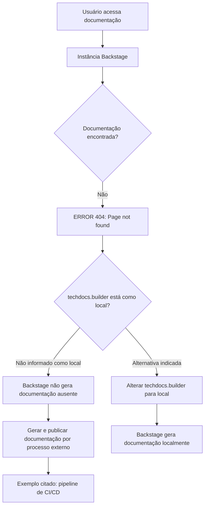

# Erro 404 no TechDocs Backstage — Documentação Não Encontrada

## 1. Metadados do Documento
- **Arquivo de Origem:** Não identificado
- **Tipo de Documento:** Procedimento
- **Domínio / Sistema:** Backstage TechDocs / documentação de APIs e soluções
- **Público-Alvo:** Desenvolvedores, Arquitetos e Operação
- **Data/Versão Identificada:** Não identificada

---

## 2. Resumo Executivo & Contexto de Negócio

O conteúdo apresenta uma página de erro `ERROR 404: Page not found` em uma instância Backstage. A falha ocorre no contexto de acesso a documentação técnica, indicada pela navegação que contém os itens “Home”, “Solutions”, “APIs”, “Documentation” e “Zeus”.

A mensagem informa que `techdocs.builder` não está configurado como `local`. Consequentemente, a instância Backstage não gera documentação quando os documentos não são encontrados.

O texto orienta que a documentação do projeto seja gerada e publicada por um processo externo, com o exemplo de um pipeline de CI/CD. Como alternativa, o texto recomenda alterar `techdocs.builder` para `local`, permitindo que a própria instância Backstage gere a documentação.

Não há detalhes sobre o projeto afetado, configuração atual, repositório de origem, pipeline específico, mecanismo de publicação ou procedimento de correção. O conteúdo é restrito à mensagem de indisponibilidade e às alternativas explicitamente indicadas pela página.

---

## 3. Arquitetura, Componentes & Tecnologias Envolvidas

Os componentes e termos identificados são:

- **Backstage:** aplicação que exibe a página de erro e referencia a configuração `techdocs.builder`.
- **TechDocs:** recurso de documentação mencionado pela configuração `techdocs.builder`.
- **Documentação do projeto:** conteúdo esperado pela aplicação, mas não encontrado.
- **Processo externo:** mecanismo sugerido para gerar e publicar a documentação.
- **Pipeline de CI/CD:** exemplo de processo externo citado para geração e publicação documental.
- **Configuração `techdocs.builder`:** parâmetro citado como não configurado para `local`.
- **Navegação corporativa:** itens “Home”, “Solutions”, “APIs”, “Documentation” e “Zeus”.
- **CF:** sigla exibida na interface, sem explicação adicional no conteúdo.
- **Idioma `EN`:** indicador de idioma exibido na interface.



**Nota de Análise:** O conteúdo não detalha a arquitetura interna do Backstage, a localização da configuração `techdocs.builder`, os comandos de geração de documentação, nem a implementação do pipeline de CI/CD.

---

## 4. Regras de Negócio, Especificações Funcionais & Processos

1. A página indica erro `404` quando a documentação solicitada não é encontrada.
2. A instância Backstage não gera documentação ausente quando `techdocs.builder` não está configurado como `local`.
3. A documentação deve ser gerada e publicada por um processo externo caso o builder local não seja utilizado.
4. O documento cita um pipeline de CI/CD como exemplo de processo externo capaz de gerar e publicar documentação.
5. Como alternativa ao processo externo, a configuração `techdocs.builder` pode ser alterada para `local`.
6. O texto oferece ações de interface para retornar à página anterior (“Go back”) ou entrar em contato com suporte caso o usuário considere a situação um defeito (“contact support”).

**Nota de Análise:** Não foram fornecidos critérios de autorização, contratos de API, regras funcionais de negócio, endereços de ambientes, comandos operacionais ou etapas detalhadas para alterar a configuração.

---

## 5. Tabelas de Parâmetros, Ambientes e Estruturas de Dados

| Item / Parâmetro | Descrição / Função | Tipo / Valores / Formato | Ambiente / Observações |
| :--- | :--- | :--- | :--- |
| `ERROR 404` | Indica que a página não foi encontrada. | Código de erro exibido na página. | Associado à indisponibilidade da documentação solicitada. |
| `techdocs.builder` | Configuração citada para controlar a geração de documentação pelo Backstage. | Valor mencionado: `local`. | O texto afirma que o parâmetro não está definido como `local`. |
| `local` | Valor alternativo para `techdocs.builder`. | Valor de configuração. | Permite, segundo o texto, que a instância Backstage gere documentação. |
| Processo externo | Alternativa para gerar e publicar documentação. | Processo não especificado. | O texto cita CI/CD como exemplo. |
| CI/CD pipeline | Exemplo de processo externo de geração e publicação documental. | Pipeline. | Não há ferramenta, repositório, etapas ou configuração especificados. |
| Backstage | Aplicação que apresenta a página de erro. | Aplicação / plataforma. | A mensagem informa comportamento relacionado ao TechDocs. |
| TechDocs | Recurso associado à documentação e à configuração `techdocs.builder`. | Recurso de documentação. | Detalhamento técnico não fornecido. |
| Home | Item de navegação exibido. | Rótulo de interface. | Sem detalhamento adicional. |
| Solutions | Item de navegação exibido. | Rótulo de interface. | Sem detalhamento adicional. |
| APIs | Item de navegação exibido. | Rótulo de interface. | Sem detalhamento adicional. |
| Documentation | Item de navegação exibido. | Rótulo de interface. | Sem detalhamento adicional. |
| Zeus | Item de navegação exibido. | Rótulo de interface. | Não há definição do termo. |
| CF | Sigla exibida na interface. | Sigla. | Significado não informado. |
| EN | Indicador de idioma exibido. | Código/rótulo de idioma. | Não há detalhamento adicional. |
| Go back | Ação de navegação sugerida. | Rótulo de interface. | Retorno à página anterior. |
| contact support | Ação sugerida se o usuário considerar a ocorrência um defeito. | Rótulo de interface. | O canal de suporte não é informado. |

---

## 6. Bateria de Perguntas & Respostas para RAG (FAQ Sintético)

### P1: Por que a página de documentação apresenta `ERROR 404`?
**R:** A página apresenta `ERROR 404: Page not found`, indicando que a documentação ou página solicitada não foi encontrada pela instância Backstage.

### P2: O que a mensagem informa sobre `techdocs.builder`?
**R:** A mensagem informa que `techdocs.builder` não está configurado como `local`. Nessa condição, a instância Backstage não gera documentação quando os documentos não são encontrados.

### P3: Como a documentação pode ser disponibilizada quando `techdocs.builder` não é `local`?
**R:** O texto orienta que a documentação do projeto seja gerada e publicada por algum processo externo. Um pipeline de CI/CD é citado como exemplo desse processo.

### P4: Qual alternativa permite que a própria instância Backstage gere documentação?
**R:** A alternativa indicada é alterar `techdocs.builder` para `local`. Segundo a mensagem, essa alteração permite gerar a documentação a partir da instância Backstage.

### P5: O documento informa qual pipeline de CI/CD deve ser utilizado?
**R:** Não. O conteúdo apenas cita um pipeline de CI/CD como exemplo de processo externo para gerar e publicar documentação; não identifica ferramenta, repositório, comandos ou etapas.

### P6: O documento especifica onde alterar a configuração `techdocs.builder`?
**R:** Não. A mensagem recomenda alterar `techdocs.builder` para `local`, mas não informa arquivo de configuração, variável de ambiente, interface administrativa ou procedimento técnico para aplicar a alteração.

### P7: Quais áreas de navegação aparecem na página de erro?
**R:** A interface exibida contém os itens “Home”, “Solutions”, “APIs”, “Documentation” e “Zeus”. Também são exibidos “CF” e o indicador de idioma “EN”.

### P8: O que o usuário pode fazer ao encontrar a página de erro?
**R:** A página sugere retornar usando “Go back”. Também orienta o usuário a entrar em contato com o suporte caso considere que o erro seja um defeito.

### P9: A mensagem confirma que há um problema na aplicação Backstage?
**R:** Não. A página informa que a documentação não foi encontrada e explica alternativas de geração e publicação. Ela apenas sugere contatar o suporte se o usuário considerar a situação um defeito.

### P10: Quais informações técnicas não estão disponíveis no conteúdo?
**R:** O conteúdo não fornece URL, nome do projeto, ambiente, versão do Backstage, local da documentação, configuração completa do TechDocs, comandos de geração, detalhes do pipeline de CI/CD ou canal de suporte.

---

## 7. Glossário de Termos, Siglas & Conceitos-Chave

- **404:** Código de erro exibido com a mensagem “Page not found”.
- **APIs:** Item de navegação exibido na interface; o conteúdo não fornece detalhamento adicional.
- **Backstage:** Aplicação que apresenta a página de erro e referencia a configuração `techdocs.builder`.
- **CF:** Sigla exibida na interface; significado não identificado no conteúdo.
- **CI/CD:** Processo citado como exemplo de mecanismo externo para gerar e publicar documentação; a expansão da sigla não é apresentada no texto.
- **Documentation:** Item de navegação exibido na interface.
- **EN:** Indicador de idioma exibido na interface.
- **Home:** Item de navegação exibido na interface.
- **Solutions:** Item de navegação exibido na interface.
- **TechDocs:** Recurso de documentação associado à configuração `techdocs.builder`.
- **`techdocs.builder`:** Configuração mencionada pela mensagem de erro.
- **Zeus:** Item de navegação exibido; significado não identificado no conteúdo.

---

## 8. Notas Críticas, Riscos & Limitações

- A documentação solicitada não foi encontrada, causando indisponibilidade de conteúdo técnico para usuários da plataforma.
- A instância Backstage não gera documentação ausente enquanto `techdocs.builder` não estiver configurado como `local`.
- A dependência de geração e publicação por processo externo pode impedir a disponibilidade da documentação se esse processo não for executado ou não publicar o conteúdo corretamente.
- O conteúdo não identifica responsável, equipe proprietária, projeto, repositório, ambiente, URL, canal de suporte ou prazo de resolução.
- Não há evidência no texto de que a ocorrência seja defeito da aplicação; a própria página condiciona o contato com suporte à percepção do usuário de que existe um bug.
- **Nota de Análise:** O documento não detalha o estado desejado da configuração, o processo de publicação externo existente nem as ações operacionais necessárias para restaurar a página.

---

## 9. Conteúdo Bruto Estruturado (Referência Fiel)

```text
--- [PÁGINA 1 DE 1] ---

ERROR 404: j: Page not found.
Note that techdocs.builder is not set to 'local' in
your config, which means this Backstage app will
not generate docs if they are not found. Make sure
the project's docs are generated and published by
some external process (e.g. CI/CD pipeline). Or
change techdocs.builder to 'local' to generate docs
from this Backstage instance.
Looks like someone
dropped the mic!
Go back... or please  if you
think this is a bug.
contact support
 / 
 CF
Home Solutions APIs Documentation Zeus
EN
```
