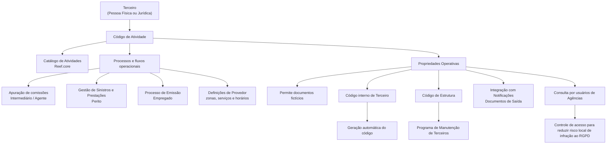

# Reef.core — Definição, Codificação e Propriedades das Atividades de Terceiros

## 1. Metadados do Documento
- **Arquivo de Origem:** Não identificado no conteúdo fornecido
- **Tipo de Documento:** Especificação Funcional
- **Domínio / Sistema:** Reef.core — gestão de Terceiros
- **Público-Alvo:** Desenvolvedores, Arquitetos, Operação, Administração Funcional e Direção de Tecnologia local
- **Data/Versão Identificada:** Não identificada

---

## 2. Resumo Executivo & Contexto de Negócio

O documento define o conceito de **Atividade de Terceiro** no sistema **Reef.core**. Uma atividade é uma qualidade associada a Terceiros — pessoas físicas ou jurídicas — que estabelece a capacidade de esses Terceiros desempenharem determinada função dentro do sistema.

Os códigos de atividade associados aos Terceiros identificam inequivocamente os processos, procedimentos e fluxos operacionais nos quais cada Terceiro participa ou pode participar. Portanto, a classificação de atividade tem efeito operacional direto sobre o acesso a processos e funcionalidades corporativas.

Como exemplo, uma pessoa física identificada com a atividade de **Intermediário ou Agente** pode ingressar automaticamente no processo de apuração de comissões da entidade MAPFRE. A remuneração pode consistir, entre outros conceitos, em uma parcela proporcional dos prêmios obtidos pela atividade comercial direta, intervenção ou colaboração.

A mesma pessoa, quando identificada com atividades diferentes — como **Perito** ou **Empregado** — pode participar de processos distintos. Um Perito pode estar envolvido em tarefas de atribuição e perícia no processo de Gestão de Sinistros e Prestações; um Empregado pode beneficiar-se automaticamente de desconto comercial na contratação de apólices durante o processo de Emissão.

O núcleo do Reef.core disponibiliza um catálogo específico para identificar e codificar atividades de Terceiros. Os códigos de atividade de **1 a 99**, além do código **999**, são reservados para uso exclusivo pelo núcleo do sistema.

---

## 3. Arquitetura, Componentes & Tecnologias Envolvidas

O documento descreve uma estrutura funcional centrada no catálogo de Atividades de Terceiros do Reef.core. A atividade atribuída a um Terceiro direciona regras de operação, manutenção, acesso à informação, integração documental e participação em processos corporativos.

Os componentes e domínios explicitamente citados são:

| Componente / Domínio | Papel descrito |
| :--- | :--- |
| **Reef.core** | Núcleo do sistema que identifica, codifica e administra atividades de Terceiros. |
| **Catálogo de Atividades** | Catálogo específico fornecido às entidades para codificar atividades de pessoas físicas e jurídicas. |
| **Rotina de Terceiros** | Rotina na qual é controlada a possibilidade de acesso à informação por usuários de Agências, conforme atributo de consulta da atividade. |
| **Programa de Manutenção de Terceiros** | Programa que realiza captura, manutenção e consulta de informações de Terceiros conforme o Código de Estrutura associado à atividade. |
| **Módulo de Notificações — Documentos de Saída** | Módulo com o qual uma atividade pode ou não integrar para geração de documentação. |
| **Gestão de Sinistros e Prestações** | Processo no qual Terceiros classificados como Peritos podem executar tarefas específicas de atribuição e perícia. |
| **Processo de Emissão** | Processo no qual Empregados podem receber automaticamente desconto comercial na contratação de apólices. |
| **Processo de apuração de comissões MAPFRE** | Processo em que Intermediários ou Agentes podem entrar automaticamente, conforme a atividade associada. |
| **Direção de Tecnologia local** | Responsável por definir e identificar o nome da estrutura e o agrupamento de estruturas atribuídos à Atividade de Terceiro. |



> **Nota de Análise:** O documento não detalha tecnologias de implementação, métodos HTTP, contratos de integração, bases de dados, ambientes, URLs, servidores ou interfaces técnicas do Reef.core.

---

## 4. Regras de Negócio, Especificações Funcionais & Processos

### 4.1 Conceito de Atividade de Terceiro

1. A Atividade de Terceiro é uma qualidade associada a Terceiros no Reef.core.
2. O Terceiro pode ser uma pessoa física ou jurídica.
3. A atividade permite relacionar o Terceiro à capacidade de realizar determinada função no sistema.
4. As atividades identificam os processos, procedimentos e fluxos operacionais nos quais o Terceiro intervém ou pode intervir.
5. A atividade atribuída pode alterar os processos corporativos nos quais o Terceiro é incluído automaticamente.

### 4.2 Reserva e uso dos códigos de atividade

1. Os códigos de atividade de **1 a 99** são reservados para uso exclusivo pelo núcleo do sistema.
2. O código **999** também é reservado para uso exclusivo pelo núcleo do sistema.
3. A codificação e o uso das atividades devem respeitar obrigatoriamente os códigos próprios do núcleo da aplicação.

### 4.3 Efeitos operacionais por tipo de atividade

| Atividade / Classificação | Efeito operacional descrito |
| :--- | :--- |
| Intermediário ou Agente | Permite entrada automática no processo de apuração de comissões da entidade MAPFRE. |
| Perito | Pode permitir envolvimento em tarefas específicas de atribuição e perícia no processo de Gestão de Sinistros e Prestações. |
| Empregado | Pode permitir benefício automático de desconto comercial na contratação de apólices no processo de Emissão. |
| Provedor | Quando o atributo correspondente está habilitado, a atividade possui definições próprias de Provedores, incluindo zonas de atuação, serviços permitidos e horários. |

### 4.4 Propriedades gerais

#### Código de Atividade do Terceiro
Indica no sistema o código da Atividade do Terceiro.

#### Descrição da Atividade do Terceiro
Indica ao sistema a denominação ou descrição da Atividade do Terceiro.

### 4.5 Propriedades operativas

#### A Atividade Permite Documentos Fictícios
Indica se o código de atividade permite ou não associação a Terceiros identificados por tipos de documentos definidos como não reais ou fictícios.

#### A Atividade corresponde a um Provedor?
Indica se a atividade associada a um Terceiro identifica ou não Provedores no sistema.

Quando essa marca está habilitada, a atividade possui definições próprias de Provedores, tais como:

- Zonas de atuação;
- Serviços permitidos;
- Horários.

O documento indica como exemplos de atividades que normalmente possuem essa propriedade habilitada:

- Atividade 17 — Talleres Concertados;
- Atividade 20 — Cristaleros;
- Atividade 21 — Cerrajeros.

#### Código de Terceiro
Determina se, para determinada atividade, será obrigatório possuir um código interno que permita identificar o Terceiro.

#### Geração Automática
Quando o atributo de Código de Terceiro está ativado, o sistema permite definir se o código interno será gerado automaticamente.

#### Código de Estrutura
Indica o Código da Estrutura ou Programa do Sistema que permite realizar captura, manutenção e consulta das informações dos Terceiros associados ao código de atividade.

#### Agrupação de Estruturas
Indica a agrupação de estruturas à qual pertence o Código da Estrutura de manutenção.

A Direção de Tecnologia local é responsável pela definição e identificação:

- do nome da estrutura;
- da agrupação de estruturas;
- da atribuição desses elementos à Atividade do Terceiro.

#### A Atividade Permite a Geração de Documentação
Indica se o código de atividade permite ou não integração com o Módulo de Notificações — Documentos de Saída a partir do Programa de Manutenção de Terceiros.

#### A Atividade Permite a Consulta aos Usuários de Agências
Indica se o Reef.core permitirá ou não a consulta de informações por usuários identificados como usuários de Agências para o código de atividade afetado.

O atributo de consulta da atividade controla, na Rotina de Terceiros e para usuários assim distinguidos, a possibilidade de acesso à informação. O objetivo informado é evitar risco local de infração ao Regulamento Geral de Proteção de Dados.

---

## 5. Tabelas de Parâmetros, Ambientes e Estruturas de Dados

### 5.1 Catálogo de atividades de Terceiros

| Código de Atividade | Descrição |
| :--- | :--- |
| 1 | Tomadores/Asegurados |
| 2 | Agentes |
| 3 | Peritos |
| 4 | Inspectores |
| 5 | Médicos |
| 6 | Abogados |
| 7 | Procuradores |
| 8 | Supervisores |
| 9 | Tramitadores |
| 10 | Proveedores |
| 11 | Ejecutivos de Cta. |
| 12 | Cobradores |
| 13 | Aseguradoras |
| 14 | Reaseguradoras |
| 15 | Empleados |
| 16 | Brokers |
| 17 | Talleres |
| 18 | Clínicas |
| 19 | Juzgados |
| 20 | Cristaleros |
| 21 | Cerrajeros |
| 22 | Plomeros |
| 23 | Electricistas |
| 24 | Grúas |
| 25 | Investigadores |
| 26 | Recuperadores |
| 27 | Ajustadores |
| 28 | Herreros |
| 29 | Tribunales |
| 30 | Terceros Seg. MOTOR |
| 31 | Terceros Seg. SALUD |
| 32 | Terceros Seg. PATRIMONIALES |
| 33 | Depósitos |
| 34 | Notarías |
| 35 | Centros de Peritación |
| 36 | Comisarías |
| 37 | Empleados de Agentes |
| 38 | Filial |
| 39 | Compañías |
| 40 | Entidades Bancarias |
| 41 | Oficinas Bancarias |
| 42 | Primer Nivel Est. Comercial |
| 43 | Segundo Nivel Est. Comercial |
| 44 | Tercer Nivel Est. Comercial |
| 45 | Representantes Legales |
| 99 | Otros Beneficiarios |
| 999 | Reservado para uso exclusivo por el núcleo del sistema; sem descrição funcional adicional no conteúdo fornecido. |

### 5.2 Propriedades da Atividade de Terceiro

| Item / Parâmetro | Descrição / Função | Tipo / Valores / Formato | Ambiente / Observações |
| :--- | :--- | :--- | :--- |
| Código de Atividade do Terceiro | Identifica o código da Atividade do Terceiro no sistema. | Código numérico. | Códigos 1 a 99 e 999 reservados ao núcleo. |
| Descrição da Atividade do Terceiro | Define a denominação ou descrição da atividade. | Texto. | Sem formato adicional especificado. |
| A Atividade Permite Documentos Fictícios | Controla se a atividade pode ser associada a Terceiros com documentos não reais ou fictícios. | Permite / Não permite. | Não são definidos valores técnicos no documento. |
| A Atividade corresponde a um Provedor? | Define se a atividade identifica Provedores no sistema. | Habilitada / Não habilitada. | Quando habilitada, ativa definições de zonas, serviços e horários. |
| Código de Terceiro | Define se a atividade exige código interno para identificação do Terceiro. | Obrigatório / Não obrigatório. | A habilitação permite avaliar geração automática. |
| Geração Automática | Define se o código interno de Terceiro será gerado automaticamente. | Automática / Não automática. | Disponível somente se o atributo Código de Terceiro estiver ativado. |
| Código de Estrutura | Define a estrutura ou programa utilizado para captura, manutenção e consulta dos Terceiros. | Código de estrutura ou programa. | Sem nomenclatura ou formato fornecido. |
| Agrupação de Estruturas | Define o agrupamento a que pertence a estrutura de manutenção. | Agrupamento de estruturas. | Definição sob responsabilidade da Direção de Tecnologia local. |
| A Atividade Permite a Geração de Documentação | Define integração com o Módulo de Notificações — Documentos de Saída. | Permite / Não permite. | Integração originada no Programa de Manutenção de Terceiros. |
| A Atividade Permite a Consulta aos Usuários de Agências | Controla se usuários de Agências podem consultar informações associadas à atividade. | Permite / Não permite. | Controle relacionado à mitigação de risco de infração local ao RGPD. |

### 5.3 Exemplos de atividades normalmente marcadas como Provedor

| Código de Atividade | Nome de Provedor no documento | Provedor |
| :--- | :--- | :--- |
| 17 | Talleres Concertados | S |
| 20 | Cristaleros | S |
| 21 | Cerrajeros | S |
| ... | ... | ... |

### 5.4 Documentos e diretrizes vinculados

| Documento / Diretriz Vinculada | Relação com o documento |
| :--- | :--- |
| Estructuras | Leitura recomendada para evitar interpretação isolada incorreta. |
| Documentos Identificativos | Leitura recomendada para entendimento das atividades e documentos de identificação. |
| Módulo de Notificaciones | Leitura recomendada para entendimento da geração de documentação. |

---

## 6. Bateria de Perguntas & Respostas para RAG (FAQ Sintético)

### P1: O que é uma Atividade de Terceiro no Reef.core?
**R:** Uma Atividade de Terceiro é uma qualidade associada a um Terceiro, pessoa física ou jurídica, que permite relacioná-lo à capacidade de desempenhar determinada função no sistema Reef.core. Os códigos de atividade identificam os processos, procedimentos e fluxos operacionais nos quais esse Terceiro intervém ou pode intervir.

### P2: Quais códigos de atividade são reservados exclusivamente ao núcleo do Reef.core?
**R:** Os códigos de atividade de 1 a 99, além do código 999, são reservados e de uso exclusivo pelo núcleo do sistema. O documento estabelece que a codificação e o emprego das atividades devem obrigatoriamente respeitar os códigos próprios do núcleo da aplicação.

### P3: Qual é o impacto de classificar um Terceiro como Intermediário ou Agente?
**R:** A classificação como Intermediário ou Agente permite que o Terceiro entre automaticamente no processo de apuração de comissões da entidade MAPFRE. A retribuição econômica pode incluir, entre outros conceitos, uma parte proporcional dos prêmios obtidos pela atuação comercial direta, intervenção ou colaboração.

### P4: Qual é o efeito de classificar uma pessoa como Perito no Reef.core?
**R:** Uma pessoa identificada com atividade de Perito pode estar envolvida em tarefas específicas de atribuição e perícia dentro do processo de Gestão de Sinistros e Prestações. O documento não detalha as tarefas, telas, regras de distribuição ou procedimentos desse processo.

### P5: O que ocorre quando uma atividade é marcada como correspondente a um Provedor?
**R:** Quando o atributo “A Atividade corresponde a um Provedor?” está habilitado, a atividade identifica Provedores no sistema e passa a ter definições próprias de Provedores, como zonas de atuação, serviços permitidos e horários. Os códigos 17, 20 e 21 são apresentados como exemplos de atividades que normalmente possuem essa propriedade habilitada.

### P6: Qual é a relação entre Código de Terceiro e Geração Automática?
**R:** O Código de Terceiro determina se será obrigatório possuir um código interno para identificar o Terceiro. Somente quando esse atributo estiver ativado, o sistema permite definir se o código interno será gerado automaticamente.

### P7: Para que serve o Código de Estrutura de uma Atividade de Terceiro?
**R:** O Código de Estrutura indica a estrutura ou programa do sistema que permite realizar a captura, a manutenção e a consulta das informações dos Terceiros associados ao código de atividade. O documento não informa os códigos concretos de estrutura nem os programas específicos.

### P8: Quem é responsável por definir a estrutura e a agrupação de estruturas de uma atividade?
**R:** A Direção de Tecnologia local é responsável por definir e identificar o nome da estrutura e a agrupação de estruturas que serão atribuídos à Atividade do Terceiro.

### P9: Como uma atividade controla a geração de documentação?
**R:** A propriedade “A Atividade Permite a Geração de Documentação” informa se o código da atividade permite ou não a integração, a partir do Programa de Manutenção de Terceiros, com o Módulo de Notificações — Documentos de Saída.

### P10: Como o acesso de usuários de Agências é controlado?
**R:** A propriedade “A Atividade Permite a Consulta aos Usuários de Agências” define se o Reef.core permitirá a consulta de informações para usuários identificados como usuários de Agências, conforme o código de atividade afetado. Na Rotina de Terceiros, esse atributo controla o acesso para usuários assim distinguidos, com o objetivo de evitar risco local de infração ao Regulamento Geral de Proteção de Dados.

### P11: A atividade pode ser associada a documentos fictícios?
**R:** Sim, desde que a propriedade “A Atividade Permite Documentos Fictícios” permita essa associação. Essa propriedade determina se o código da atividade pode ou não associar-se a Terceiros identificados com tipos de documentos definidos como não reais ou fictícios.

### P12: Quais atividades do catálogo estão relacionadas a Terceiros de seguros?
**R:** O catálogo apresenta as atividades 30 — “Terceros Seg. MOTOR”, 31 — “Terceros Seg. SALUD” e 32 — “Terceros Seg. PATRIMONIALES”. O documento não detalha regras operacionais específicas para essas três atividades.

---

## 7. Glossário de Termos, Siglas & Conceitos-Chave

- **Reef.core:** Núcleo do sistema citado no documento, responsável por identificar e codificar as atividades de Terceiros.
- **Atividade de Terceiro:** Qualidade associada a pessoa física ou jurídica que define sua capacidade de exercer determinada função no sistema.
- **Terceiro:** Pessoa física ou jurídica registrada no sistema e associada a uma ou mais atividades.
- **Código de Atividade:** Código que identifica a atividade do Terceiro e sua relação com processos, procedimentos e fluxos operacionais.
- **Código de Terceiro:** Código interno usado para identificar um Terceiro quando exigido pela atividade.
- **Código de Estrutura:** Código da estrutura ou programa que permite captura, manutenção e consulta de dados de Terceiros vinculados a uma atividade.
- **Agrupação de Estruturas:** Agrupamento ao qual pertence o Código de Estrutura de manutenção.
- **Provedor:** Terceiro cuja atividade possui a marca correspondente habilitada e, consequentemente, definições como zonas de atuação, serviços permitidos e horários.
- **Módulo de Notificações — Documentos de Saída:** Módulo integrado ao Programa de Manutenção de Terceiros quando a atividade permite geração de documentação.
- **RGPD:** Regulamento Geral de Proteção de Dados, mencionado como risco local a ser mitigado mediante controle de consulta por usuários de Agências.
- **MAPFRE:** Entidade citada no processo de apuração de comissões para Intermediários ou Agentes.
- **Gestão de Sinistros e Prestações:** Processo no qual Peritos podem participar de tarefas de atribuição e perícia.
- **Processo de Emissão:** Processo no qual Empregados podem beneficiar-se automaticamente de desconto comercial na contratação de apólices.

---

## 8. Notas Críticas, Riscos & Limitações

- O documento estabelece que os códigos de atividade de 1 a 99 e o código 999 são exclusivos do núcleo do sistema. A utilização local deve respeitar obrigatoriamente essa reserva.
- A Direção de Tecnologia local possui dependência explícita na definição do nome da estrutura e da agrupação de estruturas atribuídas às Atividades de Terceiros.
- O atributo de consulta por usuários de Agências é um controle relevante para reduzir risco local de infração ao Regulamento Geral de Proteção de Dados.
- O documento recomenda a leitura conjunta de **Estructuras**, **Documentos Identificativos** e **Módulo de Notificaciones**, pois a interpretação isolada pode conduzir a erro.
- O conteúdo não informa versões de software, tecnologias de implementação, APIs, contratos JSON, métodos HTTP, URLs, ambientes, credenciais, servidores ou rotas de log.
- O documento não detalha os critérios concretos para atribuição de zonas de atuação, serviços permitidos, horários, códigos de estrutura ou agrupações de estruturas.
- O código 999 é mencionado como reservado pelo núcleo, mas não possui descrição funcional adicional no conteúdo fornecido.

---

## 9. Conteúdo Bruto Estruturado (Referência Fiel)

```text
--- [PÁGINA 1 DE 6] ---

DEFINICIÓN de las Actividades de los Terceros
Contexto
Una Actividad en Reef.core es una cualidad asociada a los Terceros que permite relacionarlos con
su capacidad para realizar una función determinada en el Sistema.
Las actividades que los Terceros en Reef.core tienen asociadas van a identificar inequívocamente los
procesos, procedimientos y flujos operativos en los que éstos intervienen o pueden intervenir. Por
ejemplo:
Si capturamos en el sistema la información de una persona física y la identificamos en el sistema con
la actividad asociada a un Intermediario o Agente, este código de actividad le permitirá entrar de
manera automática en el proceso de devengo de comisiones de la entidad MAPFRE, proceso por el
que percibirá una retribución económica consistente, entre otros conceptos, de una parte
proporcional de las primas conseguidas en su labor comercial directa o a través de su intervención o
colaboración.
En cambio si a la misma persona la hubiéramos identificado en el sistema como un Perito o como un
Empleado, por lo que tendría asignados códigos diferentes de actividad al código de actividad de
Intermediario del ejemplo anterior, esta persona podría respectivamente estar involucrada en tareas
específicas de asignación y peritaje dentro del proceso de Gestión de Siniestros y Prestaciones o
beneficiarse automáticamente de un descuento comercial en la contratación de sus pólizas en el
proceso de Emisión.
Propiedades Generales
 / 
 CF
Home Solutions APIs Documentation Zeus
EN


--- [PÁGINA 2 DE 6] ---

Funcionalmente, el núcleo del Sistema cuenta con la posibilidad de identificar y codificar las
diferentes Actividades de los Terceros, sean estos personas Físicas o Jurídicas, en un catálogo de
información específico que se entrega a las entidades con contenido:
Los códigos de actividad del 1 al 99 (además del código 999) están reservados y son de uso
exclusivo por el núcleo del sistema.
Código de Actividad del Tercero
Esta propiedad indica en el sistema el código de la Actividad del Tercero.
La relación de Actividades que provee el núcleo es la que se indica en la siguiente tabla:
ACTIVIDAD DESCRIPCIÓN
1 Tomadores/Asegurados
2 Agentes
3 Peritos
4 Inspectores
5 Médicos
6 Abogados
7 Procuradores
8 Supervisores
9 Tramitadores
10 Proveedores
11 Ejecutivos de Cta.
12 Cobradores


--- [PÁGINA 3 DE 6] ---

ACTIVIDAD DESCRIPCIÓN
13 Aseguradoras
14 Reaseguradoras
15 Empleados
16 Brokers
17 Talleres
18 Clínicas
19 Juzgados
20 Cristaleros
21 Cerrajeros
22 Plomeros
23 Electricistas
24 Grúas
25 Investigadores
26 Recuperadores
27 Ajustadores
28 Herreros
29 Tribunales
30 Terceros Seg. MOTOR


--- [PÁGINA 4 DE 6] ---

ACTIVIDAD DESCRIPCIÓN
31 Terceros Seg. SALUD
32 Terceros Seg. PATRIMONIALES
33 Depósitos
34 Notarías
35 Centros de Peritación
36 Comisarías
37 Empleados de Agentes
38 Filial
39 Compañías
40 Entidades Bancarias
41 Oficinas Bancarias
42 Primer Nivel Est. Comercial
43 Segundo Nivel Est. Comercial
44 Tercer Nivel Est. Comercial
45 Representantes Legales
99 Otros Beneficiarios
Descripción de la Actividad del Tercero
Esta propiedad le indica al sistema cual es la denominación o descripción de la Actividad del Tercero.


--- [PÁGINA 5 DE 6] ---

Propiedades Operativas
La Actividad Permite Documentos Ficticios
Esta propiedad le indica al sistema si el código de la actividad permite o no asociarse a Terceros
identificados con tipos de documentos definidos como documentos no reales o ficticios.
¿La Actividad corresponde a un Proveedor?
Este atributo le indica al sistema si la Actividad asociada a un Tercero va a identificar o no a los
Proveedores en el sistema. Si esta marca está habilitada tendrá todas las definiciones propias de los
Proveedores como por ejemplo sus Zonas de actuación, Servicios permitidos, Horarios... etc
Por ejemplo, los siguientes códigos de Actividad suelen tener habilitada esta propiedad:
ACTIVIDAD NOMBRE PROVEEDOR
17 Talleres Concertados S
20 Cristaleros S
21 Cerrajeros S
... ... ...
Código de Tercero
Esta propiedad determina si en la actividad va a ser o no obligatorio contar con un código interno que
permita identificar al Tercero.
Generación Automática
Siempre y cuando el atributo del código del tercero esté activado el sistema permite definir si el
código interno se va o no a generar automáticamente.
Código de Estructura
Esta propiedad le indica al sistema el Código de la Estructura o Programa del Sistema que permite
realizar la captura, el mantenimiento y la consulta de la información de los Terceros que tengan
asociado el código de actividad.
Ejemplo:


--- [PÁGINA 6 DE 6] ---

Agrupación de Estructuras
Este atributo le indica al sistema la agrupación de estructuras a la que pertenece el Código de la
estructura de mantenimiento.
NOTA: Es responsabilidad de la Dirección de Tecnología local la definición e identificación del
nombre de la estructura y de la agrupación de estructuras que se vayan a asignar a la Actividad del
Tercero.
La Actividad Permite la Generación de Documentación
Esta propiedad le indica al sistema si el código de la actividad permite o no la integración con el
Módulo de Notificaciones - Documentos de Salida desde el Programa de Mantenimiento de
Terceros.
La Actividad Permite la Consulta a los Usuarios de Agencias
Esta propiedad indica si Reef.core va a permitir o no la Consulta de información a los usuarios
identificados como usuarios de Agencias para el código de la actividad afectada.
Vínculos
Relación de Directrices y Documentos funcionales cuya lectura recomendada para evitar que la
interpretación aislada del presente documento pueda conducir a error.
Estructuras
Documentos Identificativos
Módulo de Notificaciones
Preguntas frecuentes
1 ¿Existe alguna recomendación operativa que deba ser tomada en consideración localmente en la
codificación y uso de las Actividades de Terceros en el Sistema?
Como recomendaciones operativas en la codificación y empleo de las actividades de los Terceros
debemos considerar
Se ha de respetar obligatoriamente los códigos de actividades propios del núcleo de la
aplicación.
Con el Atributo de consulta de la Actividad para los empleados de las agencias se controla, en la
Rutina de Terceros y para aquellos *usuarios así distinguidos*, la posibilidad de acceso a la
información evitando el riesgo de infracción del Reglamento General de Protección de Datos que
pudiera existir localmente.
```
