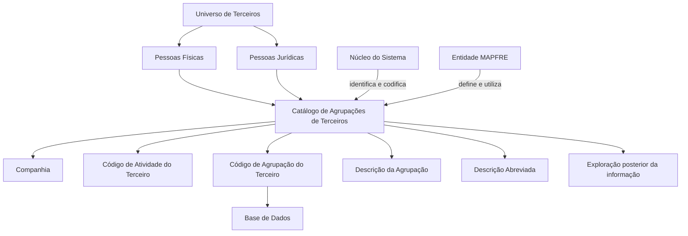

# Definição de Agrupações de Terceiros no Sistema

## 1. Metadados do Documento
- **Arquivo de Origem:** Não identificado no conteúdo fornecido
- **Tipo de Documento:** Especificação Funcional
- **Domínio / Sistema:** Catálogo de Agrupações de Terceiros
- **Público-Alvo:** Entidades MAPFRE, usuários funcionais e responsáveis pela definição de catálogos
- **Data/Versão Identificada:** Não identificada

---

## 2. Resumo Executivo & Contexto de Negócio

O documento define o conceito de **Agrupações de Terceiros**, entendido como subconjuntos do Universo de Terceiros que compartilham pelo menos uma característica. Os terceiros abrangem Pessoas Físicas e Pessoas Jurídicas.

Funcionalmente, o núcleo do Sistema permite identificar e codificar possíveis Agrupações de Terceiros em um catálogo de informações. O catálogo é entregue inicialmente vazio às entidades, que devem realizar sua própria definição e codificação.

A definição de uma Agrupação de Terceiros é composta pelas propriedades Companhia, Código de Atividade do Terceiro, Código de Agrupação do Terceiro, Descrição da Agrupação do Terceiro e Descrição Abreviada da Agrupação do Terceiro.

O documento não estabelece uma codificação obrigatória ou padronizada para as Agrupações de Terceiros. Entretanto, recomenda que a entidade MAPFRE avalie a conveniência de utilizar o catálogo transversalmente nos processos da companhia, permitindo exploração posterior das informações.

---

## 3. Arquitetura, Componentes & Tecnologias Envolvidas

O documento descreve um catálogo funcional disponível no núcleo do Sistema. Não há detalhamento sobre arquitetura técnica, tecnologias, microsserviços, APIs, banco de dados físico, métodos HTTP, integrações ou contratos de dados.

Os componentes funcionais explicitamente identificados são:

- **Núcleo do Sistema:** Componente que possibilita identificar e codificar Agrupações de Terceiros.
- **Catálogo de Agrupações de Terceiros:** Repositório de informação inicialmente vazio, disponibilizado às entidades.
- **Entidade MAPFRE:** Responsável por analisar a conveniência de adoção transversal do catálogo nos processos corporativos.
- **Universo de Terceiros:** Conjunto que inclui Pessoas Físicas e Pessoas Jurídicas.
- **Atividade do Terceiro:** Classificação associada à Agrupação de Terceiros.
- **Base de Dados:** Destino no qual o tipo de dado do Código de Agrupação do Terceiro sustenta a informação.



> **Nota de Análise:** O documento menciona “Base de Dados”, mas não informa tecnologia, modelo físico, esquema, tabelas, campos, tipos técnicos ou regras de persistência.

> **Nota de Análise:** O trecho “Home Solutions APIs Documentation Zeus” aparece no conteúdo bruto fornecido, mas não possui explicação funcional ou arquitetural no documento. Portanto, não é possível estabelecer uma relação comprovada com o catálogo de Agrupações de Terceiros.

---

## 4. Regras de Negócio, Especificações Funcionais & Processos

### 4.1 Definição de Agrupação de Terceiros

Uma Agrupação de Terceiros corresponde a um subconjunto do Universo de Terceiros. Para que terceiros pertençam à mesma agrupação, os terceiros devem compartilhar pelo menos uma característica.

O documento declara que uma Agrupação de Terceiros pode abranger:

- Pessoas Físicas.
- Pessoas Jurídicas.

### 4.2 Disponibilização do Catálogo

O núcleo do Sistema possui a capacidade de identificar e codificar possíveis Agrupações de Terceiros.

As Agrupações de Terceiros são registradas em um catálogo de informações. Esse catálogo é entregue inicialmente vazio de conteúdo às entidades.

A entidade que utilizar o catálogo deve definir as Agrupações de Terceiros que serão relevantes para seus processos.

### 4.3 Propriedades para Definição de Agrupações

A definição de uma Agrupação de Terceiros utiliza as seguintes propriedades:

1. **Companhia:** indica o código da companhia sobre a qual está sendo realizada a definição da Agrupação do Terceiro.
2. **Código de Atividade do Terceiro:** indica o código da atividade do Terceiro associado à Agrupação de Terceiros em definição.
3. **Código de Agrupação do Terceiro:** indica o código da Agrupação do Terceiro de acordo com o tipo de dado que sustentará a informação na Base de Dados.
4. **Descrição da Agrupação do Terceiro:** indica a denominação ou descrição da Agrupação do Terceiro.
5. **Descrição Abreviada da Agrupação do Terceiro:** indica a denominação ou descrição abreviada da Agrupação do Terceiro.

### 4.4 Regras de Codificação

O documento estabelece que não existe preferência ou recomendação para estabelecer ou padronizar a codificação das Agrupações de Terceiros no Sistema.

A ausência de padronização não elimina a necessidade de análise organizacional. A entidade MAPFRE deve avaliar a conveniência de utilizar transversalmente o catálogo de Agrupações de Terceiros nos processos da companhia.

O uso transversal do catálogo tem como finalidade permitir a correta definição das Agrupações de Terceiros e sua exploração posterior.

### 4.5 Exemplo Apresentado

Para a atividade **“1 - Asegurados”**, o documento apresenta os seguintes exemplos de Agrupações de Terceiros:

- Código `01`: Clientes Banco SANTANDER; abreviatura `BAN.SAN.`
- Código `02`: Clientes BancaSeguros; abreviatura `BAN.SEG.`
- Código `03`: Clientes Mutualidad Médica; abreviatura `MUT.MED.`

### 4.6 Documentos Relacionados

O documento recomenda a leitura de diretrizes e documentos funcionais relacionados para evitar que uma interpretação isolada conduza a erro:

- Actividades de Terceros.
- Categorías de Terceros.
- Clasificación de Terceros.

---

## 5. Tabelas de Parâmetros, Ambientes e Estruturas de Dados

### 5.1 Propriedades da Agrupação de Terceiros

| Item / Parâmetro | Descrição / Função | Tipo / Valores / Formato | Ambiente / Observações |
| :--- | :--- | :--- | :--- |
| Companhia | Informa o código da companhia sobre a qual é realizada a definição da Agrupação do Terceiro. | Código de companhia; formato não especificado. | Aplicável à definição da Agrupação de Terceiros. |
| Código de Atividade do Terceiro | Informa o código da atividade do Terceiro associada à Agrupação de Terceiros. | Código de atividade; formato não especificado. | O exemplo utiliza a atividade `1 - Asegurados`. |
| Código de Agrupação do Terceiro | Informa o código da Agrupação do Terceiro. | Tipo de dado que sustentará a informação na Base de Dados; tipo técnico não especificado. | Não existe recomendação ou preferência de padronização de codificação. |
| Descrição da Agrupação do Terceiro | Informa a denominação ou descrição da Agrupação do Terceiro. | Texto; tamanho e formato não especificados. | Exemplo: `Clientes Banco SANTANDER`. |
| Descrição Abreviada da Agrupação do Terceiro | Informa a denominação ou descrição abreviada da Agrupação do Terceiro. | Texto abreviado; tamanho e formato não especificados. | Exemplo: `BAN.SAN.`. |

### 5.2 Exemplo de Agrupações para a Atividade “1 - Asegurados”

| Código de Agrupação | Descrição | Abreviatura | Atividade Associada |
| :--- | :--- | :--- | :--- |
| 01 | Clientes Banco SANTANDER | BAN.SAN. | 1 - Asegurados |
| 02 | Clientes BancaSeguros | BAN.SEG. | 1 - Asegurados |
| 03 | Clientes Mutualidad Médica | MUT.MED. | 1 - Asegurados |

### 5.3 Informações Não Especificadas

| Item / Parâmetro | Descrição / Função | Tipo / Valores / Formato | Ambiente / Observações |
| :--- | :--- | :--- | :--- |
| Formato dos códigos | O documento não define quantidade de caracteres, regra alfanumérica ou máscara para códigos. | Não especificado. | Aplicável a códigos de companhia, atividade e agrupação. |
| Operações de manutenção | O documento não descreve criação, alteração, exclusão ou consulta de agrupações. | Não especificado. | Não há fluxos de interface ou API. |
| Validações | O documento não apresenta regras de obrigatoriedade, unicidade ou integridade. | Não especificado. | Não há mensagens de erro documentadas. |
| Ambientes | O documento não lista ambientes de desenvolvimento, homologação ou produção. | Não especificado. | Não há URLs, servidores ou portas. |
| Logs e monitoramento | O documento não descreve rotas de logs, eventos auditáveis ou monitoramento. | Não especificado. | Sem detalhamento operacional. |

---

## 6. Bateria de Perguntas & Respostas para RAG (FAQ Sintético)

### P1: O que é uma Agrupação de Terceiros no Sistema?
**R:** Uma Agrupação de Terceiros é um subconjunto do Universo de Terceiros cujos integrantes compartilham pelo menos uma característica. O documento indica que os terceiros podem ser Pessoas Físicas ou Pessoas Jurídicas.

### P2: Qual componente permite identificar e codificar Agrupações de Terceiros?
**R:** O núcleo do Sistema possui a possibilidade de identificar e codificar as possíveis Agrupações de Terceiros em um catálogo de informações.

### P3: O catálogo de Agrupações de Terceiros já vem preenchido para as entidades?
**R:** Não. O catálogo de informações é entregue às entidades inicialmente vazio de conteúdo. Cada entidade deve definir as Agrupações de Terceiros aplicáveis ao seu contexto.

### P4: Quais propriedades compõem a definição de uma Agrupação de Terceiros?
**R:** A definição inclui Companhia, Código de Atividade do Terceiro, Código de Agrupação do Terceiro, Descrição da Agrupação do Terceiro e Descrição Abreviada da Agrupação do Terceiro.

### P5: Qual é a finalidade do campo Companhia na definição de uma Agrupação de Terceiros?
**R:** A propriedade Companhia indica o código da companhia sobre a qual está sendo realizada a definição da Agrupação do Terceiro.

### P6: Como o Código de Atividade do Terceiro é utilizado?
**R:** O Código de Atividade do Terceiro identifica a atividade do Terceiro associada à Agrupação de Terceiros que está sendo definida. O documento apresenta como exemplo a atividade `1 - Asegurados`.

### P7: Existe um padrão obrigatório para o Código de Agrupação do Terceiro?
**R:** Não. O documento informa que não existe preferência nem recomendação para estabelecer ou padronizar a codificação das Agrupações de Terceiros no Sistema. O código deve estar de acordo com o tipo de dado que sustentará a informação na Base de Dados.

### P8: Qual é a diferença entre Descrição da Agrupação e Descrição Abreviada da Agrupação?
**R:** A Descrição da Agrupação do Terceiro representa a denominação ou descrição completa da Agrupação do Terceiro. A Descrição Abreviada representa a denominação ou descrição resumida da mesma Agrupação. No exemplo, `Clientes Banco SANTANDER` possui a abreviatura `BAN.SAN.`.

### P9: Quais Agrupações de Terceiros são exemplificadas para a atividade “1 - Asegurados”?
**R:** O documento apresenta três exemplos: código `01` para Clientes Banco SANTANDER, com abreviatura `BAN.SAN.`; código `02` para Clientes BancaSeguros, com abreviatura `BAN.SEG.`; e código `03` para Clientes Mutualidad Médica, com abreviatura `MUT.MED.`.

### P10: Qual orientação o documento fornece para a entidade MAPFRE sobre o uso do catálogo?
**R:** A entidade MAPFRE deve analisar a conveniência de utilizar transversalmente o catálogo de Agrupações de Terceiros nos processos da companhia. Esse uso transversal busca assegurar a correta definição das informações e possibilitar sua posterior exploração.

### P11: Quais documentos devem ser consultados para evitar interpretação isolada incorreta?
**R:** O documento recomenda a leitura das diretrizes e documentos funcionais intitulados `Actividades de Terceros`, `Categorías de Terceros` e `Clasificación de Terceros`.

### P12: O documento define APIs, tecnologias ou operações de banco de dados para o catálogo?
**R:** Não. O documento menciona que o Código de Agrupação do Terceiro deve ser compatível com o tipo de dado que sustentará a informação na Base de Dados, mas não detalha tecnologias, estruturas físicas, APIs, operações CRUD, métodos HTTP ou contratos de integração.

---

## 7. Glossário de Termos, Siglas & Conceitos-Chave

- **Agrupación de Terceros / Agrupação de Terceiros:** Subconjunto do Universo de Terceiros que compartilha pelo menos uma característica.
- **Universo de Terceros / Universo de Terceiros:** Conjunto de terceiros que pode incluir Pessoas Físicas e Pessoas Jurídicas.
- **Tercero / Terceiro:** Entidade classificada no Sistema como Pessoa Física ou Pessoa Jurídica.
- **Compañía / Companhia:** Propriedade que informa o código da companhia sobre a qual a Agrupação do Terceiro está sendo definida.
- **Código de Actividad del Tercero / Código de Atividade do Terceiro:** Código da atividade associada à Agrupação de Terceiros.
- **Código de Agrupación del Tercero / Código de Agrupação do Terceiro:** Código da Agrupação do Terceiro, definido conforme o tipo de dado que sustentará a informação na Base de Dados.
- **Descripción de la Agrupación del Tercero / Descrição da Agrupação do Terceiro:** Denominação ou descrição da Agrupação do Terceiro.
- **Descripción Abreviada de la Agrupación del Tercero / Descrição Abreviada da Agrupação do Terceiro:** Denominação ou descrição abreviada da Agrupação do Terceiro.
- **MAPFRE:** Entidade mencionada como responsável por analisar a conveniência do uso transversal do catálogo nos processos da companhia.
- **Base de Datos / Base de Dados:** Repositório mencionado como sustentação da informação associada ao Código de Agrupação do Terceiro.
- **Asegurados:** Atividade de Terceiros apresentada no exemplo como `1 - Asegurados`.

---

## 8. Notas Críticas, Riscos & Limitações

- O catálogo de Agrupações de Terceiros é entregue inicialmente vazio; a qualidade e consistência do conteúdo dependem da definição realizada por cada entidade.
- Não existe recomendação ou preferência documentada para padronização da codificação das Agrupações de Terceiros.
- A ausência de padronização pode dificultar a utilização transversal e a exploração posterior do catálogo caso cada processo adote critérios diferentes.
- O documento recomenda que a entidade MAPFRE avalie o uso transversal do catálogo nos processos corporativos.
- A interpretação isolada do documento pode conduzir a erro; é recomendada a leitura dos documentos relacionados sobre atividades, categorias e classificação de terceiros.
- O documento não especifica formatos técnicos, tamanhos de campos, regras de obrigatoriedade, validações, unicidade, integrações, APIs, ambientes, servidores, URLs, logs ou mecanismos de auditoria.
- O documento não detalha como os códigos ou descrições são criados, atualizados, removidos ou consultados.
- O texto “Home Solutions APIs Documentation Zeus” não possui contextualização suficiente para ser relacionado tecnicamente ao catálogo descrito.

---

## 9. Conteúdo Bruto Estruturado (Referência Fiel)

```text
--- [PÁGINA 1 DE 2] ---

DEFINICIÓN de las Agrupaciones de Terceros
Propiedades Generales
Se entiende por Agrupación de Terceros a los Subconjuntos del Universo de Terceros que comparten
al menos una característica entre ellos.
Funcionalmente, el núcleo del Sistema cuenta con la posibilidad de identificar y codificar las posibles
Agrupaciones de los Terceros, sean estos Personas Físicas o Jurídicas, en un catálogo de
información que se entrega a las entidades inicialmente vacío de contenido.
Compañía
Esta propiedad le indica al sistema el código de la compañía sobre la que se está realizando la
definición de la Agrupación del Tercero.
Código de Actividad del Tercero
Esta propiedad indica en el sistema el código de la Actividad del Tercero asociada a la Agrupación de
Terceros que se está definiendo.
Código de Agrupación del Tercero
Esta propiedad indicará en el sistema el código de la Agrupación del Tercero de acuerdo al tipo de
dato que sustentará la información en la Base de Datos.
Descripción de la Agrupación del Tercero
 / 
 CF
Home Solutions APIs Documentation Zeus
EN


--- [PÁGINA 2 DE 2] ---

Esta propiedad le indica al sistema cual es la denominación o descripción de la Agrupación del
Tercero.
Descripción Abreviada de la Agrupación del Tercero
Esta propiedad le indica al sistema cual es la denominación o descripción abreviada de la
Agrupación del Tercero.
A modo de ejemplo y para la actividad '1 - Asegurados
AGRUPACIÓN DESCRIPCIÓN ABREVIATURA
01 Clientes Banco SANTANDER BAN.SAN.
02 Clientes BancaSeguros BAN.SEG.
03 Clientes Mutualidad Médica MUT.MED.
Vínculos
Relación de Directrices y Documentos funcionales cuya lectura recomendada para evitar que la
interpretación aislada del presente documento pueda conducir a error.
Actividades de Terceros
Categorías de Terceros
Clasificación de Terceros
Preguntas frecuentes
(1) ¿Existe alguna recomendación operativa que deba ser tomada en consideración localmente en la
codificación, uso y definición de la tabla de Agrupamientos de Terceros en el Sistema?
No existe una preferencia ni recomendación para establecer o estandarizar la codificación de las
Agrupaciones de los Terceros en el sistema, si bien la entidad MAPFRE debe analizar la
conveniencia de utilizar transversalmente en los procesos de la compañía este catálogo de
información para su correcta definición permitiendo así su posterior explotación.
```
