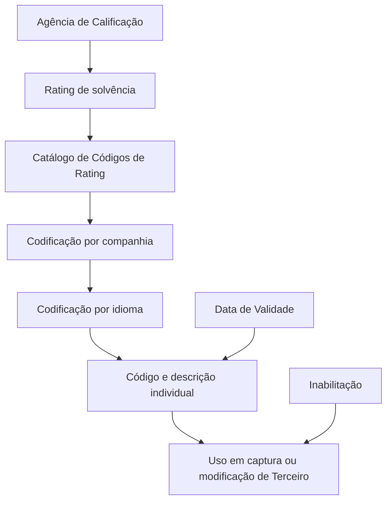

# Definição e Gestão de Códigos de Calificação (Ratings) no Sistema

## 1. Metadados do Documento
- **Arquivo de Origem:** Não identificado no conteúdo fornecido
- **Tipo de Documento:** Especificação Funcional
- **Domínio / Sistema:** Catálogo de Códigos de Rating / Atividades de Terceiros / MAPFRE
- **Público-Alvo:** Negócio, Operação, Analistas Funcionais e Desenvolvedores
- **Data/Versão Identificada:** Não identificada

---

## 2. Resumo Executivo & Contexto de Negócio

O documento define os Códigos de Calificação, também denominados *Ratings*, como classificações de solvência de uma empresa ou país para cumprir obrigações financeiras. Essas classificações são atribuídas por agências especializadas, incluindo Moody's, Fitch e Standard & Poor's.

O núcleo do Sistema disponibiliza às entidades um catálogo específico para Códigos de Rating. Esse catálogo é inicialmente entregue sem conteúdo e permite que cada companhia cadastre e identifique individualmente os códigos utilizados.

A gestão dos Códigos de Rating é realizada por companhia e por idioma, como Espanhol ou Inglês. Cada código possui uma identificação e uma denominação ou texto descritivo, como os exemplos `001 — Grado Inversión Baa2`, `002 — Grado Inversión Baa3` e `003 — Grado Especulativo Ba1`.

O documento também descreve propriedades operacionais relevantes: inabilitação do código para uso em operações de captura ou modificação de Terceiros e data de validade para determinar quando um código se torna plenamente operativo no sistema. A data de validade contribui para a manutenção do histórico de mudanças nas definições de cargos.

Não existe uma recomendação obrigatória de padronização da codificação. Contudo, a entidade MAPFRE deve analisar a conveniência de usar transversalmente o catálogo nos processos da companhia, inclusive agrupando códigos por agência de rating ou por faixas numéricas.

---

## 3. Arquitetura, Componentes & Tecnologias Envolvidas

| Componente / Conceito | Descrição sustentada pelo documento |
| :--- | :--- |
| Núcleo do Sistema | Possui funcionalidade para identificar e codificar Códigos de Rating em catálogo específico. |
| Catálogo de Códigos de Rating | Catálogo inicialmente vazio entregue às entidades para codificação dos ratings. |
| Companhia | Nível organizacional no qual os códigos podem ser definidos. |
| Idioma | Dimensão de cadastro dos códigos; o documento cita Espanhol e Inglês. |
| Terceiro | Pessoa Física ou Pessoa Jurídica sujeita a operações de captura e/ou modificação. |
| Agências de Calificação | Entidades especializadas que atribuem ratings; o documento cita Moody's, Fitch e Standard & Poor's. |
| MAPFRE | Entidade que deve analisar a conveniência de utilização transversal do catálogo nos processos corporativos. |



**Nota de Análise:** O documento não detalha tecnologias de implementação, interfaces, métodos HTTP, contratos JSON, bases de dados, ambientes técnicos ou integrações entre sistemas.

---

## 4. Regras de Negócio, Especificações Funcionais & Processos

1. Um Rating representa a classificação de solvência de uma empresa ou país perante suas obrigações financeiras.
2. Uma agência especializada de calificação atribui a nota de Rating. O documento cita Moody's, Fitch e Standard & Poor's como exemplos.
3. O núcleo do Sistema permite identificar e codificar Códigos de Rating em um catálogo específico.
4. O catálogo de Códigos de Rating é entregue inicialmente vazio às entidades.
5. A codificação do catálogo é realizada no nível de companhia.
6. A codificação dos Códigos de Rating também é realizada por idioma. O documento menciona Espanhol e Inglês como exemplos.
7. Cada Código de Rating deve ser denominado e identificado individualmente por meio de uma denominação ou texto descritivo.
8. A propriedade **Inabilitação** informa ao Sistema se determinado Código de Rating está impedido de ser utilizado em operações de captura e/ou modificação de Terceiro.
9. A restrição de inabilitação aplica-se a Terceiros que sejam Pessoas Físicas ou Pessoas Jurídicas.
10. A propriedade **Data de Validade** indica a data a partir da qual o Código de Rating está plenamente operativo no Sistema.
11. O uso correto da Data de Validade permite manter histórico das alterações realizadas nas definições de cargos.
12. O uso de Ratings é mais usual para Pessoas Jurídicas do que para Pessoas Físicas.
13. O Sistema não exclui a utilização de Ratings para Pessoas Físicas.
14. O documento cita Trabalhadores Autónomos como caso usual de utilização de Ratings para Pessoas Físicas.
15. Não existe preferência ou recomendação obrigatória para estabelecer ou padronizar a codificação dos Códigos de Rating no Sistema.
16. A entidade MAPFRE deve analisar a conveniência de utilizar transversalmente o catálogo de Códigos de Rating nos processos da companhia.
17. Uma possibilidade de organização é agrupar e codificar os códigos das diferentes Agências de Rating utilizadas nos processos da entidade.
18. Outra possibilidade é agrupar e codificar códigos por faixas numéricas, como `000` a `99` para Moody's e `200` a `299` para Fitch.

---

## 5. Tabelas de Parâmetros, Ambientes e Estruturas de Dados

| Item / Parâmetro | Descrição / Função | Tipo / Valores / Formato | Ambiente / Observações |
| :--- | :--- | :--- | :--- |
| Código de Rating | Identificador individual do rating no catálogo. | Exemplos: `001`, `002`, `003`. | Codificado por companhia e idioma. |
| Descrição do Rating | Denominação ou texto descritivo associado ao código. | Exemplos: `Grado Inversión Baa2`, `Grado Inversión Baa3`, `Grado Especulativo Ba1`. | Cada código é identificado individualmente. |
| Companhia | Nível organizacional de definição dos Códigos de Rating. | Companhia. | O Sistema permite codificação em nível de companhia. |
| Idioma | Dimensão linguística para codificação dos Códigos de Rating. | Exemplos: Espanhol, Inglês. | O documento indica “Español, Inglés,...”. |
| Inabilitação | Indica se o código está inabilitado para uso em operações sobre Terceiros. | Estado de inabilitação; valores específicos não detalhados. | Afeta captura e/ou modificação de Pessoa Física ou Jurídica. |
| Data de Validade | Define a partir de quando o Código de Rating está plenamente operativo. | Data; formato não detalhado. | Permite histórico de alterações nas definições de cargos. |
| Agência de Calificação | Agência especializada que atribui a classificação de solvência. | Moody's, Fitch, Standard & Poor's, entre outras. | Pode ser usada como critério de agrupamento e codificação. |
| Faixa de códigos Moody's | Exemplo de faixa para agrupamento de códigos. | `000` a `99`. | Exemplo não obrigatório apresentado pelo documento. |
| Faixa de códigos Fitch | Exemplo de faixa para agrupamento de códigos. | `200` a `299`. | Exemplo não obrigatório apresentado pelo documento. |
| Terceiro | Entidade sujeita às operações de captura e/ou modificação. | Pessoa Física ou Pessoa Jurídica. | Ratings são mais usuais para Pessoas Jurídicas, mas podem ser usados para Pessoas Físicas. |

---

## 6. Bateria de Perguntas & Respostas para RAG (FAQ Sintético)

### P1: O que são Códigos de Calificação ou Ratings no contexto do Sistema?
**R:** Ratings são classificações de solvência de uma empresa ou país para cumprir suas obrigações financeiras. A nota é atribuída por uma agência especializada de calificação, como Moody's, Fitch ou Standard & Poor's.

### P2: Como o Sistema disponibiliza o catálogo de Códigos de Rating para as entidades?
**R:** O núcleo do Sistema possui a capacidade de identificar e codificar Códigos de Rating em um catálogo de informação específico. Esse catálogo é entregue inicialmente vazio às entidades.

### P3: Em quais dimensões os Códigos de Rating podem ser codificados?
**R:** Os Códigos de Rating podem ser codificados no nível de companhia e por idioma. O documento cita Espanhol e Inglês como exemplos de idiomas.

### P4: Quais informações identificam individualmente um Código de Rating?
**R:** Cada Código de Rating é identificado por um código e por uma denominação ou texto descritivo. Os exemplos apresentados incluem `001 — Grado Inversión Baa2`, `002 — Grado Inversión Baa3` e `003 — Grado Especulativo Ba1`.

### P5: Qual é a finalidade da propriedade Inabilitação de um Código de Rating?
**R:** A propriedade Inabilitação informa ao Sistema se um Código de Rating está inabilitado para ser empregado nas operações de captura e/ou modificação de um Terceiro, seja Pessoa Física ou Pessoa Jurídica.

### P6: O que determina a Data de Validade de um Código de Rating?
**R:** A Data de Validade determina a data a partir da qual o Código de Rating está plenamente operativo no Sistema. O uso correto dessa propriedade permite manter histórico das alterações efetuadas nas definições de cargos.

### P7: Ratings podem ser aplicados a Pessoas Físicas?
**R:** Sim. Embora o emprego de Ratings seja mais usual para Pessoas Jurídicas, o Sistema não exclui a possibilidade de uso para Pessoas Físicas, usualmente quando se tratam de Trabalhadores Autónomos.

### P8: O documento exige uma padronização única para a codificação de Códigos de Rating?
**R:** Não. O documento declara que não existe preferência nem recomendação para estabelecer ou padronizar a codificação no Sistema. A entidade MAPFRE deve analisar a conveniência de usar o catálogo transversalmente em seus processos.

### P9: Como a entidade pode organizar códigos de diferentes Agências de Rating?
**R:** O documento sugere como possibilidade agrupar e codificar os códigos das diferentes Agências de Rating que serão utilizadas nos processos da entidade.

### P10: Quais exemplos de faixas numéricas são apresentados para organizar códigos por agência?
**R:** O documento apresenta, como exemplo, a faixa `000` a `99` para códigos da Moody's e a faixa `200` a `299` para códigos da Fitch. Essas faixas são exemplos, não uma regra obrigatória.

---

## 7. Glossário de Termos, Siglas & Conceitos-Chave

- **Rating / Código de Calificação:** Classificação de solvência de uma empresa ou país para cumprir obrigações financeiras.
- **Agência de Calificação:** Agência especializada que atribui Ratings, como Moody's, Fitch e Standard & Poor's.
- **Catálogo de Códigos de Rating:** Catálogo específico do Sistema para identificar e codificar Ratings.
- **Inabilitação:** Propriedade que indica se um Código de Rating não pode ser usado em operações de captura e/ou modificação de Terceiros.
- **Data de Validade:** Data a partir da qual um Código de Rating está plenamente operativo no Sistema.
- **Terceiro:** Pessoa Física ou Pessoa Jurídica sujeita a operações de captura e/ou modificação no Sistema.
- **Pessoa Física:** Tipo de Terceiro para o qual o Sistema admite uso de Ratings, inclusive em casos de Trabalhadores Autónomos.
- **Pessoa Jurídica:** Tipo de Terceiro para o qual o uso de Ratings é mais usual.
- **MAPFRE:** Entidade mencionada como responsável por analisar a conveniência de uso transversal do catálogo nos processos da companhia.

---

## 8. Notas Críticas, Riscos & Limitações

- O catálogo de Códigos de Rating é inicialmente vazio; o documento não define uma carga inicial, fonte de dados ou processo de governança para preenchimento.
- Não existe padronização obrigatória para a codificação dos Ratings, o que pode resultar em convenções diferentes entre entidades ou processos caso não haja definição corporativa.
- A entidade MAPFRE deve avaliar a conveniência de utilizar o catálogo de forma transversal nos processos da companhia.
- O documento apresenta faixas numéricas para Moody's e Fitch apenas como exemplos, sem determinar que tais intervalos sejam obrigatórios.
- O documento não detalha formatos de data, valores possíveis para Inabilitação, permissões de usuário, auditoria, interfaces, APIs, contratos de integração ou regras de validação adicionais.
- **Nota de Análise:** O documento menciona histórico de mudanças nas “definições de cargos”, mas não esclarece a relação funcional entre essas definições e os Códigos de Rating.

---

## 9. Conteúdo Bruto Estruturado (Referência Fiel)

```text
--- [PÁGINA 1 DE 3] ---

DEFINICIÓN de los Códigos de Calificación
(Rating)
Contexto
¿Qué son los Códigos de Calificación o (Ratings)?
El Rating es la calificación de solvencia de una Empresa o País para hacer frente a sus obligaciones
financieras. Esta nota se la otorga una agencia especializada (Moody's, Fitch, Standard & Poor's,... )
que se conoce como agencia de Calificación.
Propiedades Generales
Funcionalmente, el núcleo del Sistema cuenta con la posibilidad de identificar y codificar los Códigos
de Rating en un catálogo de información específico que se entrega a las entidades inicialmente vacío
de contenido.
El sistema permite a nivel de compañía y por idioma (Español, Inglés,...) codificar estos códigos
denominando e identificando individualmente cada una de ellos mediante una denominación o texto
descriptivo, e.g:
CÓDIGO DE RATING. DESCRIPCIÓN
001 Grado Inversión Baa2
 /
 CF
Home Solutions APIs Documentation Zeus
EN


--- [PÁGINA 2 DE 3] ---

CÓDIGO DE RATING. DESCRIPCIÓN
002 Grado Inversión Baa3
003 Grado Especulativo Ba1
... ...
Otras Propiedades
Inhabilitación
Esta propiedad le indica al Sistema si el Código de Rating está inhabilitado para poder ser empleado
en las operaciones de captura y/o modificación del Tercero, sea este una persona Física o Jurídica.
Fecha de Validez
Esta propiedad le indica al Sistema la fecha a partir de la cual el código de Rating está plenamente
operativo en el sistema por lo que su correcto uso permite tener un histórico de los cambios
efectuados en las definiciones de los cargos.
Vínculos
Relación de Directrices y Documentos funcionales cuya lectura recomendada para evitar que la
interpretación aislada del presente documento pueda conducir a error.
Actividades de Terceros
Preguntas frecuentes
(1) ¿Existe alguna recomendación operativa que deba ser tomada en consideración localmente en la
codificación, uso y definición del catálogo de Códigos de Rating en el Sistema?
Es más usual el empleo de las calificaciones en las Personas Jurídicas que en las Físicas, sin
embargo el sistema no excluye la posibilidad de su utilización para las segundas (usualmente cuando
son Trabajadores Autónomos).
No existe una preferencia ni recomendación para establecer o estandarizar en el sistema su
codificación si bien la entidad MAPFRE debe analizar la conveniencia de utilizar transversalmente en
los procesos de la compañía este catálogo de información para su correcta y posterior explotación,
e.g:


--- [PÁGINA 3 DE 3] ---

Agrupando y codificando los códigos de las diferentes Agencias de Rating que se van a usar en
los procesos de la entidad
Agrupando y codificando los códigos por tramos, e.g: del 000 al 99 para códigos de Moody's, del
200 al 299 para códigos de Fitch,...
```
