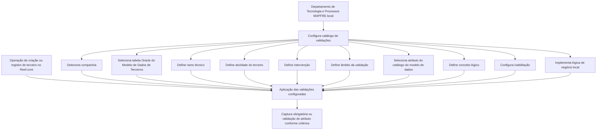

# Definição dos Campos Obrigatórios no Registro de Informações de Terceiros por Atividade do Terceiro

## 1. Metadados do Documento
- **Arquivo de Origem:** Não identificado no conteúdo fornecido
- **Tipo de Documento:** Especificação Funcional
- **Domínio / Sistema:** Reef.core / Gestão de Terceiros / MAPFRE
- **Público-Alvo:** Tecnologia e Processos da entidade MAPFRE local; desenvolvedores; analistas funcionais; equipes operacionais
- **Data/Versão Identificada:** Não identificada

---

## 2. Resumo Executivo & Contexto de Negócio

O documento descreve a configuração de validações para tornar obrigatório o registro de informações de terceiros no sistema **Reef.core**. A configuração permite particularizar o comportamento das operações de criação de terceiros conforme critérios relacionados à companhia, ao catálogo do modelo de dados, ao ramo técnico, à atividade do terceiro, à intervenção e ao âmbito de aplicação.

A responsabilidade pela configuração do catálogo é atribuída ao Departamento de Tecnologia e Processos da entidade MAPFRE local. A configuração deve considerar os processos efetivamente usados para registrar terceiros no sistema, pois as tabelas envolvidas podem variar dependendo de o registro ser centralizado por uma rotina de terceiros ou realizado diretamente dentro do processo de emissão.

O mecanismo de validação é baseado em atributos de tabelas Oracle pertencentes ao modelo de dados de terceiros. Para cada atributo, a configuração pode determinar se a validação deve ser executada, se a captura é obrigatória e se o atributo deve ser considerado segundo lógicas de negócio desenvolvidas localmente.

O documento também destaca a coexistência de modelo de dados de terceiros antigo e novo. A identificação correta dos atributos depende do modelo empregado na instalação. Além disso, o campo de conceito lógico existe para desambiguar atributos com o mesmo nome presentes em contextos distintos, como o atributo `PRS_PCE` em acionistas e representantes legais.

---

## 3. Arquitetura, Componentes & Tecnologias Envolvidas

### Componentes e conceitos identificados

| Componente / Tecnologia | Função descrita no documento |
| :--- | :--- |
| **Reef.core** | Sistema cujo comportamento nas operações de criação de terceiros pode ser particularizado por validações configuráveis. |
| **Catálogo de configuração** | Estrutura usada para configurar validações sobre informações e atributos de terceiros. |
| **Modelo de Dados de Terceiros** | Modelo que contém as tabelas e atributos utilizados na configuração de validações. O documento menciona a existência de modelo antigo e novo. |
| **Tabela Oracle** | Tabela do modelo de dados de terceiros sobre a qual é configurada a validação de atributos. |
| **Direção / Departamento de Tecnologia e Processos local** | Área responsável pela configuração do catálogo e pelo desenvolvimento de lógica de negócio local relacionada à obrigatoriedade e à inabilitação. |
| **Processo de Emissão** | Processo que pode permitir o registro direto de terceiros pelos usuários, influenciando as tabelas envolvidas. |
| **Rotina de Terceiros** | Rotina que pode centralizar o registro de terceiros no sistema. |
| **Conceito Lógico** | Código que contextualiza um atributo do modelo de dados e evita ambiguidades entre campos de mesmo nome. |

### Fluxo de configuração e validação



> **Nota de Análise:** O documento não detalha métodos HTTP, contratos JSON, interfaces de usuário, estrutura física das tabelas Oracle, algoritmos de validação ou fluxos de erro do Reef.core.

---

## 4. Regras de Negócio, Especificações Funcionais & Processos

### 4.1 Objetivo funcional

O núcleo do sistema permite particularizar o comportamento do Reef.core nas operações de criação de terceiros. Essa particularização é feita pela configuração de validações sobre dados das estruturas de informação de terceiros, tornando imperativo o registro de determinadas informações.

### 4.2 Responsabilidade pela configuração

A configuração do catálogo é responsabilidade do Departamento de Tecnologia e Processos da entidade MAPFRE local.

### 4.3 Critérios de segmentação da validação

A validação de um atributo de terceiro pode ser configurada segundo os seguintes critérios:

1. **Companhia**
   - Determina o código da companhia para a qual a definição da validação de informação de terceiro está sendo realizada.

2. **Catálogo do Modelo de Dados de Terceiros**
   - Determina o código da tabela Oracle sobre a qual ocorre a configuração da validação de atributos de terceiros.

3. **Ramo Técnico**
   - Contém o código do ramo técnico sobre o qual a configuração de registro é realizada.
   - O código genérico `999` permite validar o terceiro para todos os ramos existentes.
   - Um código específico de ramo técnico permite validar o terceiro apenas para aquele ramo.

4. **Código de Atividade do Terceiro**
   - Contém a classificação da atividade da pessoa física ou jurídica para a qual a validação é configurada.
   - O código genérico `999` permite validar o terceiro para todas as atividades de terceiros.
   - Um código específico de atividade permite validar o terceiro apenas para aquela atividade.

5. **Intervenção**
   - Determina como uma pessoa física ou jurídica participa de uma apólice ou aplicação.
   - Os exemplos fornecidos são: tomador, segurado, condutor e beneficiário.
   - O código genérico `ZZ` permite validar o terceiro para todas as intervenções associadas à atividade do terceiro.
   - Um código específico de intervenção permite validar o terceiro apenas para determinada atividade e intervenção.

6. **Âmbito da Validação**
   - Distingue se a validação é aplicável ao registro de informação de uma pessoa física, de uma pessoa jurídica ou de ambas.
   - O documento informa o uso do código genérico `ZZ` e reproduz a regra textual de validação para todas as intervenções associadas à atividade ou para uma intervenção específica.
   - **Nota de Análise:** O texto fornecido não especifica os códigos concretos correspondentes a pessoa física, pessoa jurídica ou ambas, além do código genérico `ZZ`.

7. **Atributo do Catálogo do Modelo de Dados**
   - Determina o código de um atributo da tabela Oracle sobre a qual a validação da informação do terceiro é configurada.
   - A nomeação correta dos atributos depende de a instalação utilizar o modelo de dados antigo ou novo.

8. **Inabilitação**
   - Determina se a validação sobre o campo deve ou não ser executada.

9. **Lógica de Negócio — Obrigatoriedade**
   - Pode ser desenvolvida pela Direção de Tecnologia local.
   - Determina se um atributo do catálogo do modelo de dados deve ser capturado obrigatoriamente, conforme critérios complementares definidos pela entidade.

10. **Lógica de Negócio — Inabilitação**
    - Pode ser implementada pela Direção de Tecnologia local como componente de software ou lógica de negócio.
    - Determina se o atributo do catálogo do modelo de dados deve ou não ser considerado e, consequentemente, validado, conforme regras definidas pela entidade.

11. **Conceito Lógico**
    - Contém o código do conceito lógico ao qual o atributo do catálogo do modelo de dados pertence.
    - É necessário porque podem existir campos com o mesmo nome em conceitos lógicos diferentes.
    - O documento exemplifica o atributo `PRS_PCE` nos contextos de acionistas e representantes legais.
    - Exemplos de conceitos lógicos citados: `PRS` (Pessoa), `LGR` (Representantes), `CNT` (Contatos) e `ADR` (Endereços).

### 4.4 Consideração operacional para registro de terceiros

A definição do catálogo deve considerar os procedimentos adotados localmente para registrar terceiros no sistema:

- Registro centralizado de terceiros, utilizando a rotina de terceiros.
- Registro de terceiros diretamente pelos usuários a partir do processo de emissão.

As tabelas envolvidas podem variar de acordo com o procedimento de registro utilizado.

---

## 5. Tabelas de Parâmetros, Ambientes e Estruturas de Dados

### 5.1 Atividades de terceiros e catálogo do modelo de dados

| Atividade do Terceiro | Catálogo do Modelo de Dados |
| :--- | :--- |
| Assegurado | `X1000802` |
| Agente | `A1001332` |
| Terceiro Genérico | `A1001300` |
| Supervisor | `A1001338` |
| Tramitador | `A1001339` |
| Asseguradora | `A1000600` |
| Resseguradora | `G2000157` |
| Broker | `G2000155` |
| Empregado de Agente | `A1001337` |
| Companhia | `A1000900` |
| Entidade Bancária | `A5020900` |
| Agência Bancária | `A5020910` |
| Primeiro Nível da Estrutura Comercial | `A1000700` |
| Segundo Nível da Estrutura Comercial | `A1000701` |
| Terceiro Nível da Estrutura Comercial | `A1000702` |

### 5.2 Parâmetros de configuração da validação

| Item / Parâmetro | Descrição / Função | Tipo / Valores / Formato | Ambiente / Observações |
| :--- | :--- | :--- | :--- |
| Companhia | Identifica a companhia para a qual a validação de informação de terceiro é definida. | Código de companhia | Aplicável à configuração local. |
| Catálogo do Modelo de Dados de Terceiros | Identifica a tabela Oracle sobre a qual a validação de atributos será configurada. | Código de tabela Oracle | Deve corresponder ao modelo de dados de terceiros utilizado. |
| Ramo Técnico | Identifica o ramo técnico da configuração de registro. | Código de ramo; `999` para todos os ramos | Código específico restringe a validação a um ramo. |
| Código de Atividade do Terceiro | Identifica a classificação da atividade de pessoa física ou jurídica. | Código de atividade; `999` para todas as atividades | Código específico restringe a validação à atividade indicada. |
| Intervenção | Identifica a participação da pessoa em uma apólice ou aplicação. | Código de intervenção; `ZZ` para todas as intervenções associadas à atividade | Exemplos: tomador, segurado, condutor e beneficiário. |
| Âmbito da Validação | Distingue a aplicação para pessoa física, pessoa jurídica ou ambas. | Código; `ZZ` citado como valor genérico | Os códigos específicos para os tipos de pessoa não são informados. |
| Atributo do Catálogo do Modelo de Dados | Identifica o atributo da tabela Oracle cuja informação será validada. | Código de atributo | A identificação depende do uso de modelo antigo ou novo. |
| Inabilitação | Define se a validação do campo deve ser efetuada. | Indicador não detalhado | A codificação do indicador não é informada. |
| Lógica de Negócio — Obrigatoriedade | Define se o atributo deve ser capturado obrigatoriamente. | Componente de software ou lógica de negócio local | Critérios complementares definidos pela entidade. |
| Lógica de Negócio — Inabilitação | Define se o atributo deve ser contemplado e validado. | Componente de software ou lógica de negócio local | Regras definidas pela entidade. |
| Conceito Lógico | Contextualiza o atributo dentro do modelo de dados. | Código de conceito lógico | Exemplos: `PRS`, `LGR`, `CNT`, `ADR`. |

---

## 6. Bateria de Perguntas & Respostas para RAG (FAQ Sintético)

### P1: Qual é o objetivo do catálogo de campos obrigatórios de terceiros no Reef.core?
**R:** O catálogo permite particularizar o comportamento do Reef.core nas operações de criação de terceiros. A configuração aplica validações aos dados das estruturas de informação de terceiros para tornar imperativo o registro de determinados atributos.

### P2: Quem é responsável pela configuração desse catálogo de validações?
**R:** A responsabilidade pela configuração do catálogo recai sobre o Departamento de Tecnologia e Processos da entidade MAPFRE local.

### P3: Como configurar uma validação para todos os ramos técnicos?
**R:** Deve-se utilizar o valor genérico `999` no atributo de ramo técnico. Esse código permite realizar a validação do terceiro para todos os ramos existentes. Para restringir a validação a um único ramo, deve-se utilizar o código específico do ramo técnico desejado.

### P4: Como configurar uma validação para todas as atividades de terceiros?
**R:** Deve-se utilizar o código genérico `999` no atributo Código de Atividade do Terceiro. Esse valor aplica a validação a todas as atividades de terceiros. Um código de atividade específico limita a validação à atividade correspondente.

### P5: O que significa o código `ZZ` no atributo Intervenção?
**R:** No atributo Intervenção, o código genérico `ZZ` permite realizar a validação do terceiro para todas as intervenções associadas à atividade do terceiro. Quando um código específico de intervenção é utilizado, a validação fica limitada à combinação da atividade e da intervenção selecionadas.

### P6: Quais exemplos de intervenção de terceiros são apresentados no documento?
**R:** O documento cita tomador, segurado, condutor e beneficiário como exemplos de maneiras pelas quais uma pessoa física ou jurídica pode intervir em uma apólice ou aplicação.

### P7: Por que o conceito lógico é necessário na configuração?
**R:** O conceito lógico é necessário para desambiguar atributos que possuem o mesmo nome em diferentes contextos do modelo de dados. O documento exemplifica `PRS_PCE`, que pode existir em acionistas e representantes legais. São citados os conceitos `PRS` para Pessoa, `LGR` para Representantes, `CNT` para Contatos e `ADR` para Endereços.

### P8: O que deve ser considerado ao selecionar atributos do catálogo do modelo de dados?
**R:** Deve-se considerar se a instalação utiliza o modelo de dados de terceiros antigo ou novo. Essa distinção é fundamental para nomear corretamente os atributos usados na configuração de validação.

### P9: Qual é a função da propriedade Inabilitação?
**R:** A propriedade Inabilitação informa ao Reef.core se a validação sobre determinado campo deve ou não ser efetuada.

### P10: O que pode ser definido pela lógica de negócio de obrigatoriedade?
**R:** A lógica de negócio de obrigatoriedade, desenvolvida pela Direção de Tecnologia local, pode determinar se um atributo do catálogo do modelo de dados deve ser capturado obrigatoriamente segundo critérios complementares definidos pela entidade.

### P11: Como a lógica de negócio de inabilitação afeta a validação de um atributo?
**R:** A lógica de negócio de inabilitação pode determinar se um atributo deve ser contemplado e, consequentemente, validado conforme as regras definidas pela entidade. Essa lógica pode ser implementada pela Direção de Tecnologia local como componente de software ou lógica de negócio.

### P12: Qual recomendação operacional deve ser considerada antes de configurar o catálogo?
**R:** Deve-se identificar quais procedimentos são usados para registrar terceiros no sistema. É necessário considerar se o registro é centralizado pela rotina de terceiros ou se usuários registram terceiros diretamente no processo de emissão, porque as tabelas envolvidas podem variar.

---

## 7. Glossário de Termos, Siglas & Conceitos-Chave

- **Reef.core:** Sistema cujo comportamento nas operações de criação de terceiros pode ser particularizado por configurações de validação.
- **Terceiro:** Pessoa física ou jurídica cuja informação é registrada e validada no sistema.
- **Catálogo do Modelo de Dados de Terceiros:** Referência à tabela Oracle do modelo de dados sobre a qual são configuradas validações de atributos de terceiros.
- **Ramo Técnico:** Código que identifica o ramo sobre o qual a configuração de registro é aplicada.
- **Intervenção:** Forma de participação de uma pessoa física ou jurídica em uma apólice ou aplicação.
- **Âmbito da Validação:** Critério que distingue a aplicabilidade da validação para pessoa física, pessoa jurídica ou ambas.
- **Inabilitação:** Propriedade que determina se a validação de um campo deve ser efetuada.
- **Conceito Lógico:** Código que identifica o contexto semântico de um atributo dentro do modelo de dados.
- **PRS:** Conceito lógico citado como Pessoa.
- **LGR:** Conceito lógico citado como Representantes.
- **CNT:** Conceito lógico citado como Contatos.
- **ADR:** Conceito lógico citado como Endereços.
- **`PRS_PCE`:** Exemplo de atributo com mesmo nome em conceitos lógicos diferentes, citado nos contextos de acionistas e representantes legais.
- **`999`:** Código genérico usado para aplicar validações a todos os ramos técnicos ou a todas as atividades de terceiros, conforme o atributo.
- **`ZZ`:** Código genérico citado para aplicar validações a todas as intervenções associadas à atividade do terceiro e também mencionado no âmbito da validação.

---

## 8. Notas Críticas, Riscos & Limitações

- O documento exige atenção ao modelo de dados de terceiros usado na instalação, pois há referência a modelo antigo e novo, e isso influencia a nomeação correta dos atributos.
- As tabelas envolvidas podem variar segundo o procedimento de registro de terceiros: rotina centralizada de terceiros ou registro direto a partir do processo de emissão.
- A configuração depende de responsabilidades e regras locais da entidade MAPFRE, incluindo desenvolvimento local de lógica de negócio para obrigatoriedade e inabilitação.
- O documento não apresenta os códigos específicos para pessoa física, pessoa jurídica ou ambas no atributo Âmbito da Validação.
- O documento não detalha a estrutura das tabelas Oracle, os valores técnicos da propriedade Inabilitação, os contratos de integração, métodos de acesso, telas, permissões ou mecanismos de erro.
- O texto do atributo Âmbito da Validação reproduz a descrição de uso do código `ZZ` associada a intervenções; não há detalhamento adicional que permita inferir outro comportamento.

---

## 9. Conteúdo Bruto Estruturado (Referência Fiel)

```text
--- [PÁGINA 1 DE 5] ---

DEFINICIÓN de los Campos Obligatorios en el
Registro de la Información de los Terceros, por
Actividad del Tercero
Objetivo
Funcionalmente, el núcleo del Sistema cuenta con la posibilidad de particularizar el comportamiento
de Reef.core en las Operaciones de Creación de los Terceros, configurando validaciones sobre los
datos de las estructuras de información de los Terceros para que su registro sea imperativo.
La responsabilidad de la configuración de este catálogo recae en el Departamento de
Tecnología y Procesos de la Entidad MAPFRE local.
Compañía
Esta propiedad le indica al sistema el código de la compañía sobre la que se está realizando la
definición de la validación de la información del Tercero.
Catálogo del Modelo de Datos de Terceros
Esta propiedad le indica al sistema el código de la Tabla Oracle sobre la que se está realizando la
configuración de la validación sobre los atributos del Tercero:
Ejemplos de validaciones de información
 /
 CF
Home Solutions APIs Documentation Zeus
EN


--- [PÁGINA 2 DE 5] ---

ACTIVIDAD CATÁLOGO DEL MODELO DE DATOS
ASEGURADO X1000802
AGENTE A1001332
TERCERO GENÉRICO A1001300
SUPERVISOR A1001338
TRAMITADOR A1001339
ASEGURADORA A1000600
REASEGURADORA G2000157
BROKER G2000155
EMPLEADO DE AGENTE A1001337
COMPAÑÍA A1000900
ENTIDAD BANCARIA A5020900
OFICINA BANCARIA A5020910
PRIMER NIVEL ESTRUCTURA COMERCIAL A1000700
SEGUNDO NIVEL ESTRUCTURA COMERCIAL A1000701
TERCER NIVEL ESTRUCTURA COMERCIAL A1000702
Ramo Técnico
Esta propiedad contiene el código del ramo técnico sobre el que se está realizando la configuración
del registro.


--- [PÁGINA 3 DE 5] ---

Utilizando el valor genérico en este atributo (código 999) el sistema permite realizar la validación
del Tercero para todos los Ramos existentes o bien al utilizar el código de un Ramo Técnico de los
n existentes realizar la validación del Tercero únicamente para ese Ramo.
Código de Actividad del Tercero
Esta propiedad contiene la clasificación de la actividad de la persona física o jurídica (tercero) para la
que se está configurando la validación.
Utilizando el valor genérico en este atributo (código 999) el sistema permite realizar la validación
del Tercero para todas las Actividades de los Terceros o bien al utilizar el código de una Actividad
de las n existentes realizar la validación del Tercero únicamente para esa Actividad.
Intervención
Este atributo determina la manera en la que interviene una persona, física o jurídica, en una póliza o
aplicación (Tomador, Asegurado, Conductor, Beneficiario,..)
Utilizando el valor genérico en este atributo (código 'ZZ') el sistema permite realizar la validación
del Tercero para todas las Intervenciones asociadas a la Actividad del Tercero o bien al utilizar el
código de una Intervención en particular de las n existentes realizar la validación del Tercero
únicamente para esa Actividad e Intervención.
Ámbito de la Validación
Este Atributo distingue si la validación es de aplicación cuando el registro de la información del
Tercero corresponde a una persona física, a una persona jurídica o indistintamente sobre ambas
formas.
Utilizando el valor genérico en este atributo (código 'ZZ') el sistema permite realizar la validación
del Tercero para todas las Intervenciones asociadas a la Actividad del Tercero o bien al utilizar el
código de una Intervención en particular de las n existentes realizar la validación del Tercero
únicamente para esa Actividad e Intervención.
Consejo:
Consejo:
Consejo:
Consejo:


--- [PÁGINA 4 DE 5] ---

Atributo del Catálogo del Modelo de Datos
Esta propiedad le indica al sistema el código de uno de los Atributos de la Tabla Oracle sobre la que
se está realizando la configuración de la validación sobre la información del Tercero.
Es fundamental contemplar qué Modelo de Datos de Terceros se emplea en la Instalación (si el
antiguo o el nuevo Modelo) para nombrar correctamente los Atributos.
Inhabilitación
Esta propiedad le indica a Reef.core si la validación sobre el campo se tiene o no que efectuar.
Lógica de Negocio - Obligatoriedad
Mediante el desarrollo por parte de la Dirección de Tecnología local de este componente software, se
puede determinar si un Atributo del Catálogo del Modelo de Datos se tiene o no que capturar
obligatoriamente de acuerdo con los criterios complementarios que determine la Entidad.
Lógica de Negocio - Inhabilitación
Mediante el desarrollo por parte de la Dirección de Tecnología local de este componente software ó
lógica de negocio, se puede determinar si el el Atributo del Catálogo del Modelo de Datos se tiene o
no que contemplar, y por tanto, validar de acuerdo con las reglas que determine la Entidad.
Concepto Lógico
Este Atributo contiene el código del concepto lógico al que pertenece el Atributo del Catálogo del
Modelo de Datos.
Se ha incluido este Atributo en la Tabla de configuración debido a que hay campos con el mismo
nombre para distintos conceptos lógicos como, por ejemplo, PRS_PCE en accionistas y
representantes legales (Los conceptos lógicos pueden ser PRS (Persona), LGR (Representantes),
CNT (Contactos), ADR (direcciones), ...)
Vínculos
Relación de Directrices y Documentos funcionales cuya lectura recomendada para evitar que la
interpretación aislada del presente documento pueda conducir a error.
Ejemplos de Reglas de Negocio
Consejo:


--- [PÁGINA 5 DE 5] ---

Actividades de Terceros
Preguntas frecuentes
1 ¿Existe alguna recomendación operativa que deba ser tomada en consideración localmente en la
configuración de este catálogo?
Se debe considerar cual o cuales son los procedimientos por los que se registran los Terceros en
el Sistema para una correcta definición (Si el registro del Tercero se realiza de manera centralizada y
utilizando la rutina de terceros, si se permite a los usuarios registrar a los Terceros directamente
desde el propio Proceso de Emisión) puesto que las tablas involucradas pueden variar.
```
