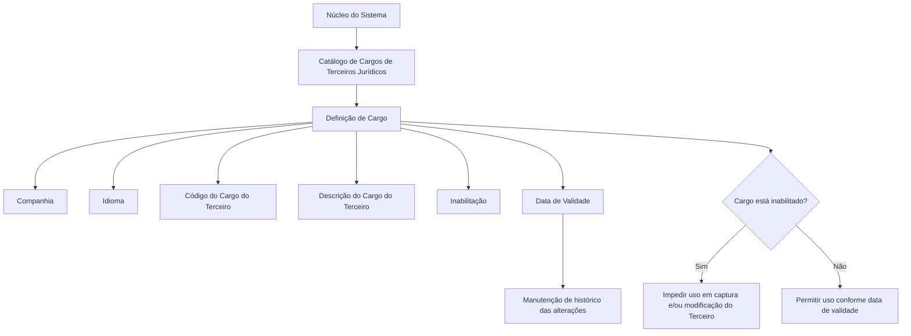

# Definição de Cargos em Pessoas Jurídicas no Sistema

## 1. Metadados do Documento
- **Arquivo de Origem:** `Não informado`
- **Tipo de Documento:** `Especificação Técnica / Funcional`
- **Domínio / Sistema:** `Gestão de Terceiros Jurídicos — Catálogo de Cargos`
- **Público-Alvo:** `Analistas funcionais, operação e equipes responsáveis pela manutenção de cadastros de terceiros`
- **Data/Versão Identificada:** `Não identificada`

---

## 2. Resumo Executivo & Contexto de Negócio

O documento descreve a funcionalidade de definição e codificação de cargos associados a terceiros jurídicos no núcleo do Sistema. A funcionalidade disponibiliza um catálogo específico para identificar, cadastrar e administrar os diferentes cargos que podem ser atribuídos a pessoas jurídicas.

O catálogo de cargos é entregue inicialmente vazio às instalações. Portanto, a organização responsável pela instalação deve cadastrar os cargos necessários para a sua operação, incluindo código, descrição, companhia, idioma, condição de inabilitação e data de validade.

A definição de cargo é contextualizada por companhia e idioma. A companhia informa o código organizacional sobre o qual a definição está sendo realizada, enquanto o idioma determina o idioma utilizado para descrever o cargo. Como exemplo de cargos e descrições em espanhol, o documento apresenta CEO como “Consejero Delegado” e CFO como “Chief Financial Officer”.

A funcionalidade também prevê controles operacionais. Um cargo pode ser marcado como inabilitado, impedindo seu uso em operações de captura e/ou modificação de terceiros. Adicionalmente, a data de validade determina a partir de quando um cargo se torna plenamente operacional, permitindo a manutenção de histórico das alterações realizadas nas definições de cargos.

O documento esclarece que não existe preferência ou recomendação corporativa para padronizar a codificação dos cargos no Sistema. Também referencia a diretriz funcional relacionada a cargos em Pessoas Politicamente Expostas (P.E.P's), cuja leitura é recomendada para evitar interpretações isoladas.

---

## 3. Arquitetura, Componentes & Tecnologias Envolvidas

O documento não descreve tecnologias, microsserviços, URLs, protocolos, bancos de dados, métodos HTTP, contratos JSON ou ambientes técnicos. A arquitetura funcional explicitamente identificável é composta pelo núcleo do Sistema, pelo catálogo de cargos de terceiros jurídicos e pelas operações de captura e modificação de terceiros.

### Componentes funcionais identificados

| Componente / Entidade | Função descrita |
| :--- | :--- |
| Núcleo do Sistema | Possui a capacidade de identificar e codificar cargos de terceiros jurídicos. |
| Catálogo de Cargos de Terceiros Jurídicos | Repositório funcional específico para as definições de cargos; é entregue inicialmente vazio. |
| Definição de Cargo | Registro que associa companhia, idioma, código, descrição, inabilitação e data de validade. |
| Operações de captura de Terceiro | Operações que não podem utilizar cargos inabilitados. |
| Operações de modificação de Terceiro | Operações que não podem utilizar cargos inabilitados. |
| Diretriz “Cargos em Pessoas Politicamente Expostas (P.E.P's)” | Documento funcional vinculado, recomendado para leitura complementar. |



> **Nota de Análise:** O documento não detalha a persistência do catálogo, a interface de cadastro, os perfis autorizados, os métodos de integração ou os contratos técnicos utilizados pelo Sistema.

---

## 4. Regras de Negócio, Especificações Funcionais & Processos

### 4.1 Cadastro e identificação de cargos

1. O núcleo do Sistema permite identificar e codificar os diferentes cargos de terceiros jurídicos.
2. Os cargos são administrados em um catálogo de informação específico.
3. O catálogo de cargos é entregue inicialmente vazio de conteúdo às instalações.
4. A definição de um cargo de pessoa jurídica deve considerar a companhia na qual a definição está sendo realizada.
5. A definição de um cargo de pessoa jurídica deve considerar o idioma utilizado para a descrição do cargo.
6. O código do cargo identifica o cargo de pessoa jurídica no Sistema.
7. A descrição do cargo corresponde à denominação do cargo, de acordo com o idioma utilizado na definição.

### 4.2 Propriedades gerais da definição de cargo

- **Companhia:** informa ao Sistema o código da companhia para a qual a definição do cargo de pessoa jurídica está sendo realizada.
- **Idioma:** informa ao Sistema o idioma empregado na definição do cargo de pessoa jurídica.
- **Código do Cargo do Terceiro:** informa o código do cargo de pessoa jurídica no Sistema.
- **Descrição do Cargo do Terceiro:** informa a denominação ou descrição do cargo, respeitando o idioma usado na definição.

### 4.3 Inabilitação de cargos

1. Um cargo de pessoa jurídica pode possuir a propriedade de inabilitação.
2. Quando um cargo estiver inabilitado, o Sistema não deve permitir seu uso nas operações de captura de terceiros.
3. Quando um cargo estiver inabilitado, o Sistema não deve permitir seu uso nas operações de modificação de terceiros.

### 4.4 Data de validade e histórico

1. A data de validade informa ao Sistema a data a partir da qual o cargo do terceiro está plenamente operativo.
2. O uso correto da data de validade permite manter um histórico das alterações efetuadas nas definições dos cargos.
3. O documento não detalha o formato da data, as regras de atualização, o comportamento para datas futuras nem o tratamento de cargos sem data de validade.

### 4.5 Política corporativa de codificação

1. Não existe preferência corporativa para estabelecer ou padronizar a codificação dos cargos no Sistema.
2. Não existe recomendação corporativa para padronizar localmente a codificação, o uso ou a definição dos cargos de terceiros jurídicos.
3. A ausência de padronização corporativa não elimina a necessidade de cada instalação manter seu catálogo de cargos conforme suas necessidades operacionais.

### 4.6 Documentação vinculada

A leitura da diretriz funcional **“Cargos em Personas Políticamente Expuestas (P.E.P's)”** é recomendada. O objetivo declarado é evitar que a interpretação isolada deste documento conduza a erro.

---

## 5. Tabelas de Parâmetros, Ambientes e Estruturas de Dados

### 5.1 Propriedades do catálogo de cargos

| Item / Parâmetro | Descrição / Função | Tipo / Valores / Formato | Ambiente / Observações |
| :--- | :--- | :--- | :--- |
| Companhia | Indica o código da companhia sobre a qual é realizada a definição do cargo de pessoa jurídica. | Código de companhia; formato não detalhado. | Aplicável à definição do cargo. |
| Idioma | Indica o idioma empregado na definição do cargo de pessoa jurídica. | Idioma; formato ou códigos permitidos não detalhados. | A descrição do cargo deve respeitar o idioma definido. |
| Código do Cargo do Terceiro | Identifica o código do cargo de pessoa jurídica no Sistema. | Código; formato e regra de unicidade não detalhados. | Não existe padronização corporativa de codificação descrita. |
| Descrição do Cargo do Terceiro | Indica a denominação ou descrição do cargo. | Texto; idioma associado à definição. | Exemplo apresentado em espanhol. |
| Inabilitação | Indica que o cargo não pode ser utilizado em operações de captura e/ou modificação do terceiro. | Indicador de estado; valores não detalhados. | Restringe o uso operacional do cargo. |
| Data de Validade | Determina a data a partir da qual o cargo está plenamente operativo no Sistema. | Data; formato não detalhado. | Permite manter histórico das alterações de definição. |

### 5.2 Exemplos de cargos apresentados

| Código do Cargo | Descrição | Idioma / Observação |
| :--- | :--- | :--- |
| CEO | Consejero Delegado | Exemplo apresentado para definição em espanhol. |
| CFO | Chief Financial Officer | Exemplo apresentado na tabela do documento. |
| CMO | Chief Marketing Officer | Exemplo apresentado na tabela do documento. |
| CIO | Chief Information Officer | Exemplo apresentado na tabela do documento. |

### 5.3 Restrições e referências

| Item / Parâmetro | Descrição / Função | Tipo / Valores / Formato | Ambiente / Observações |
| :--- | :--- | :--- | :--- |
| Padronização corporativa de códigos | O documento informa que não há preferência ou recomendação corporativa para padronizar a codificação dos cargos. | Não aplicável. | Cada instalação deve definir sua própria codificação conforme necessário. |
| Documento vinculado | “Cargos em Personas Políticamente Expuestas (P.E.P's)”. | Diretriz ou documento funcional. | Leitura recomendada para evitar interpretação isolada. |
| Catálogo inicial | O catálogo específico de cargos é entregue inicialmente sem conteúdo. | Estado inicial do catálogo. | Requer preenchimento local. |

---

## 6. Bateria de Perguntas & Respostas para RAG (FAQ Sintético)

### P1: Qual é a finalidade do catálogo de cargos de terceiros jurídicos?
**R:** O catálogo de cargos permite ao núcleo do Sistema identificar e codificar os diferentes cargos associados a terceiros jurídicos. O catálogo é um repositório específico de informação para registrar as definições de cargos de pessoas jurídicas.

### P2: O catálogo de cargos já vem preenchido quando o Sistema é instalado?
**R:** Não. O documento informa que o catálogo específico de cargos é entregue inicialmente vazio de conteúdo às instalações. O preenchimento dos cargos necessários deve ocorrer localmente.

### P3: Quais informações compõem a definição de um cargo de pessoa jurídica?
**R:** A definição de cargo inclui, conforme descrito no documento, companhia, idioma, código do cargo do terceiro, descrição do cargo do terceiro, inabilitação e data de validade.

### P4: Qual é a função da propriedade Companhia na definição de cargo?
**R:** A propriedade Companhia informa ao Sistema o código da companhia sobre a qual está sendo realizada a definição do cargo da pessoa jurídica.

### P5: Como o idioma interfere na descrição do cargo do terceiro?
**R:** O idioma informa ao Sistema a língua empregada na definição do cargo. A descrição ou denominação do cargo deve estar de acordo com o idioma utilizado na definição. O documento apresenta como exemplo, em espanhol, o código CEO com a descrição “Consejero Delegado”.

### P6: Um cargo inabilitado pode ser utilizado no cadastro de um terceiro?
**R:** Não. A propriedade de inabilitação indica que o cargo da pessoa jurídica está impedido de ser utilizado nas operações de captura e/ou modificação do terceiro.

### P7: Para que serve a data de validade de um cargo?
**R:** A data de validade informa a partir de qual data o cargo do terceiro está plenamente operativo no Sistema. Segundo o documento, seu uso correto permite manter um histórico das mudanças efetuadas nas definições dos cargos.

### P8: Existe um padrão corporativo obrigatório para os códigos dos cargos?
**R:** Não. O documento afirma explicitamente que não existe preferência ou recomendação corporativa para estabelecer ou padronizar a codificação dos cargos no Sistema.

### P9: O documento determina o formato técnico do código de cargo?
**R:** Não. O texto informa que existe um código para identificar o cargo de pessoa jurídica, mas não especifica formato, tamanho, caracteres permitidos, regra de unicidade ou mecanismo de geração do código.

### P10: Quais exemplos de cargos são apresentados no documento?
**R:** O documento apresenta CEO — “Consejero Delegado”, CFO — “Chief Financial Officer”, CMO — “Chief Marketing Officer” e CIO — “Chief Information Officer”.

### P11: Qual documentação complementar deve ser consultada?
**R:** O documento recomenda a leitura da diretriz funcional “Cargos em Personas Políticamente Expuestas (P.E.P's)”. A recomendação existe para evitar que uma interpretação isolada do documento atual leve a erro.

### P12: O documento especifica APIs, serviços ou integrações técnicas para o catálogo de cargos?
**R:** Não. O documento descreve propriedades e regras funcionais do catálogo de cargos, mas não detalha APIs, microsserviços, métodos HTTP, contratos JSON, banco de dados, URLs, ambientes ou mecanismos de integração.

---

## 7. Glossário de Termos, Siglas & Conceitos-Chave

- **Terceiro Jurídico:** Pessoa jurídica para a qual o Sistema permite definir e utilizar cargos em operações de captura e modificação.
- **Cargo do Terceiro:** Função ou denominação associada a um terceiro jurídico, identificada por código e descrição.
- **Catálogo de Cargos:** Catálogo de informação específico que armazena as definições de cargos de terceiros jurídicos.
- **Companhia:** Código da companhia para a qual a definição de cargo está sendo realizada.
- **Idioma:** Língua empregada na definição e na descrição do cargo do terceiro.
- **Inabilitação:** Propriedade que impede a utilização de um cargo nas operações de captura e/ou modificação do terceiro.
- **Data de Validade:** Data a partir da qual um cargo está plenamente operativo no Sistema.
- **CEO:** Código exemplificado no documento com a descrição “Consejero Delegado”.
- **CFO:** Código exemplificado no documento com a descrição “Chief Financial Officer”.
- **CMO:** Código exemplificado no documento com a descrição “Chief Marketing Officer”.
- **CIO:** Código exemplificado no documento com a descrição “Chief Information Officer”.
- **P.E.P's:** Sigla apresentada no documento para “Personas Políticamente Expuestas”.

---

## 8. Notas Críticas, Riscos & Limitações

- O catálogo de cargos é entregue vazio, criando uma dependência operacional de cadastramento local antes que a funcionalidade possa ser utilizada com conteúdo de negócio.
- Não há recomendação ou padronização corporativa para a codificação dos cargos. Essa ausência pode causar divergências de códigos e nomenclaturas entre instalações ou companhias.
- O documento não especifica critérios de unicidade para o código do cargo, nem esclarece se a unicidade deve ser global, por companhia, por idioma ou por outra dimensão.
- O documento não detalha formato, obrigatoriedade, precisão temporal ou regras de atualização da data de validade.
- O documento não informa como o Sistema deve tratar cargos inabilitados que já estejam associados a terceiros existentes.
- Não são descritos perfis de acesso, trilha de auditoria, controles de aprovação, APIs, integrações, persistência de dados ou interfaces de usuário.
- A interpretação isolada do documento pode ser insuficiente; o próprio conteúdo recomenda a leitura da diretriz “Cargos em Personas Políticamente Expuestas (P.E.P's)”.
- **Nota de Análise:** O documento lista propriedades funcionais, mas não fornece detalhamento adicional sobre validações técnicas, fluxos de erro ou contratos de integração.

---

## 9. Conteúdo Bruto Estruturado (Referência Fiel)

```text
--- [PÁGINA 1 DE 2] ---

DEFINICIÓN de Cargos en Personas Jurídicas
Propiedades Generales
Funcionalmente, el núcleo del Sistema cuenta con la posibilidad de identificar y codificar los
diferentes Cargos de los Terceros Jurídicos en un catálogo de información específico que se
entrega inicialmente a las instalaciones vacío de contenido.
Compañía
Esta propiedad le indica al sistema el código de la compañía sobre la que se está realizando la
definición del Cargo de la Persona Jurídica.
Idioma
Esta propiedad le indica al sistema el Idioma empleado en la definición del Cargo de la Persona
Jurídica.
Código del Cargo del Tercero
Esta propiedad indicará en el sistema el código del Cargo de la Persona Jurídica.
Descripción del Cargo del Tercero
Esta propiedad le indica al sistema cual es la denominación o descripción del Cargo del Tercero, de
acuerdo con el idioma utilizado en la definición.
A modo de ejemplo y si el Idioma utilizado en la definición es el español:
 /
 CF
Home Solutions APIs Documentation Zeus
EN


--- [PÁGINA 2 DE 2] ---

CÓDIGO CARGO DESCRIPCIÓN
CEO Consejero Delegado
CFO Chief Financial Officer
CMO Chief Marketing Officer
CIO Chief Information Officer
... ...
Otras Propiedades
Inhabilitación
Esta propiedad le indica al Sistema que el Cargo de la Persona Jurídica está inhabilitado para poder
ser utilizada en las operaciones de captura y/o modificación del Tercero.
Fecha de Validez
Esta propiedad le indica al Sistema la fecha a partir de la cual el cargo del Tercero está plenamente
operativo en el sistema por lo que su correcto uso permite tener un histórico de los cambios
efectuados en las definiciones de los cargos.
Vínculos
Relación de Directrices y Documentos funcionales cuya lectura recomendada para evitar que la
interpretación aislada del presente documento pueda conducir a error.
Cargos en Personas Políticamente Expuestas (P.E.P's)
Preguntas frecuentes
(1) ¿Existe alguna recomendación operativa que deba ser tomada en consideración localmente en la
codificación, uso y definición de los Cargos de los Terceros Jurídicos en el Sistema?
No existe Corporativamente una preferencia o recomendación para establecer o estandarizar en el
sistema su codificación.
```
