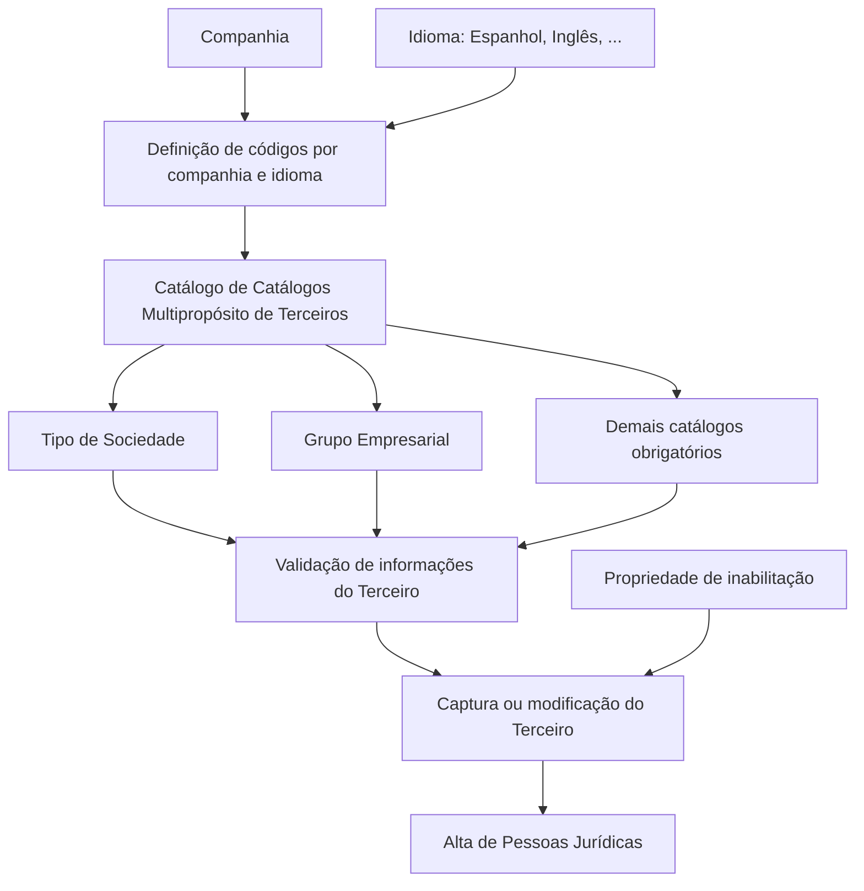

# Catálogo de Catálogos Multipropósito de Terceiros — Definição Funcional

## 1. Metadados do Documento
- **Arquivo de Origem:** `Não identificado — texto bruto fornecido na solicitação`
- **Tipo de Documento:** Especificação Funcional
- **Domínio / Sistema:** REEF Core / Cadastro de Terceiros / MAPFRE
- **Público-Alvo:** Negócio, Analistas Funcionais, Desenvolvedores e Operação
- **Data/Versão Identificada:** Não identificada

---

## 2. Resumo Executivo & Contexto de Negócio

O documento descreve a funcionalidade de um **Catálogo de Catálogos Multipropósito de Terceiros** no núcleo do sistema REEF Core. Essa funcionalidade permite definir e codificar dados de naturezas e condições distintas em catálogos que possuem conteúdo inicialmente pré-configurado na instalação.

O Catálogo de Catálogos suporta validações realizadas durante a captura de informações de um Terceiro. Sete códigos de catálogo são obrigatórios para que o REEF Core reconheça os valores sobre os quais determinadas validações devem ser aplicadas: Tipo de Sociedade, Grupo Empresarial, Titulação, Zonas Horárias, Segmentação de Clientes, Dispositivo e Canal.

A definição dos códigos associados a cada catálogo ocorre por companhia e por idioma, incluindo Espanhol e Inglês. Cada código pode receber uma denominação ou texto descritivo individual, permitindo identificação funcional adequada ao contexto de cada companhia.

Como exemplo funcional, o documento apresenta a codificação conjunta dos Tipos de Sociedade e dos Grupos Empresariais para validar informações capturadas no processo de alta de Pessoas Jurídicas. Também existe uma propriedade de inabilitação para impedir a utilização de determinados registros de catálogo em operações de captura e/ou alteração de Terceiros.

O documento não determina uma padronização operacional obrigatória para a codificação dos catálogos. Contudo, indica que a entidade MAPFRE deve avaliar a conveniência de utilizar esse catálogo de informação transversalmente nos processos corporativos, visando sua correta exploração posterior.

---

## 3. Arquitetura, Componentes & Tecnologias Envolvidas

| Componente / Conceito | Papel identificado |
| :--- | :--- |
| REEF Core | Núcleo do sistema que utiliza códigos de catálogos para reconhecer valores e executar validações. |
| Catálogo de Catálogos Multipropósito de Terceiros | Estrutura funcional para definir e codificar dados de diferentes naturezas e condições. |
| Catálogo | Conjunto de códigos e descrições configuráveis por companhia e idioma. |
| Terceiro | Entidade cujas informações são capturadas, modificadas e validadas pelo sistema. |
| Pessoa Jurídica | Tipo de Terceiro citado no exemplo de validação por Tipo de Sociedade e Grupo Empresarial. |
| MAPFRE | Entidade que deve analisar a conveniência de uso transversal do catálogo nos processos corporativos. |
| Atividades de Terceiros | Documento funcional relacionado, recomendado como leitura complementar. |
| Home Solutions APIs Documentation Zeus | Texto presente na extração original; o documento não explica seu papel funcional ou técnico. |



**Nota de Análise:** O texto não detalha arquitetura técnica de implantação, APIs, métodos HTTP, contratos JSON, banco de dados, tecnologias de infraestrutura ou mecanismos internos de validação do REEF Core.

---

## 4. Regras de Negócio, Especificações Funcionais & Processos

### 4.1 Finalidade funcional

1. O núcleo do sistema possui uma facilidade para definir e codificar dados de natureza e condição distintas.
2. Os dados são estruturados em um Catálogo de Catálogos Multipropósito de Terceiros.
3. O sistema é entregue inicialmente com conteúdo pré-fixado para esse Catálogo de Catálogos.
4. Os catálogos são utilizados pelo REEF Core para identificar valores que devem ser submetidos a determinadas validações durante a captura de informações de um Terceiro.

### 4.2 Catálogos com códigos obrigatórios

Os seguintes códigos de catálogo devem ser obrigatoriamente respeitados porque o REEF Core os utiliza para reconhecer quais valores exigem validação:

1. Tipo de Sociedade.
2. Grupo Empresarial.
3. Titulação.
4. Zonas Horárias.
5. Segmentação de Clientes.
6. Dispositivo.
7. Canal.

### 4.3 Configuração por companhia e idioma

1. A definição dos códigos associados a cada catálogo é realizada por companhia.
2. A definição dos códigos associados a cada catálogo é realizada por idioma.
3. Os idiomas exemplificados são Espanhol e Inglês.
4. Cada código pode ser denominado e identificado individualmente mediante uma denominação ou texto descritivo.

### 4.4 Validação de Pessoas Jurídicas

1. O sistema permite configurar conjuntamente códigos de Tipos de Sociedade e códigos de Grupos Empresariais.
2. Essa configuração é utilizada para validar informações capturadas no processo de alta de Pessoas Jurídicas.
3. O documento apresenta exemplos de códigos de Tipos de Sociedade e Grupos Empresariais, mas não descreve critérios de validação, mensagens de erro, obrigatoriedade de campos ou regras de associação entre códigos específicos.

### 4.5 Inabilitação de registros de catálogo

1. A propriedade de **Inhabilitación** informa ao sistema se um registro de catálogo está inabilitado.
2. Um registro inabilitado não pode ser utilizado nas operações de captura de Terceiros.
3. Um registro inabilitado não pode ser utilizado nas operações de modificação de Terceiros.

### 4.6 Orientação operacional corporativa

1. O documento não estabelece preferência ou recomendação para padronizar a codificação no sistema.
2. A entidade MAPFRE deve analisar a conveniência de usar transversalmente o Catálogo de Catálogos nos processos corporativos.
3. O objetivo dessa análise é permitir a correta exploração posterior das informações catalogadas.

---

## 5. Tabelas de Parâmetros, Ambientes e Estruturas de Dados

### 5.1 Catálogos obrigatórios reconhecidos pelo REEF Core

| Item / Parâmetro | Descrição / Função | Tipo / Valores / Formato | Ambiente / Observações |
| :--- | :--- | :--- | :--- |
| Tipo de Sociedade | Catálogo utilizado em validações relacionadas a Terceiros, incluindo o processo de alta de Pessoas Jurídicas. | Código de catálogo obrigatório. | Deve ser respeitado pelo REEF Core. |
| Grupo Empresarial | Catálogo utilizado em validações relacionadas a Terceiros, incluindo o processo de alta de Pessoas Jurídicas. | Código de catálogo obrigatório. | Deve ser respeitado pelo REEF Core. |
| Titulação | Catálogo identificado como obrigatório para validações de Terceiros. | Código de catálogo obrigatório. | Não há detalhamento funcional adicional. |
| Zonas Horárias | Catálogo identificado como obrigatório para validações de Terceiros. | Código de catálogo obrigatório. | Não há detalhamento funcional adicional. |
| Segmentação de Clientes | Catálogo identificado como obrigatório para validações de Terceiros. | Código de catálogo obrigatório. | Não há detalhamento funcional adicional. |
| Dispositivo | Catálogo identificado como obrigatório para validações de Terceiros. | Código de catálogo obrigatório. | Não há detalhamento funcional adicional. |
| Canal | Catálogo identificado como obrigatório para validações de Terceiros. | Código de catálogo obrigatório. | Não há detalhamento funcional adicional. |

### 5.2 Exemplos de Tipos de Sociedade

| Item / Parâmetro | Descrição / Função | Tipo / Valores / Formato | Ambiente / Observações |
| :--- | :--- | :--- | :--- |
| 001 | Sociedad Anónima | Código de Tipo de Sociedade. | Exemplo fornecido no documento. |
| 002 | Sociedad Limitada | Código de Tipo de Sociedade. | Exemplo fornecido no documento. |
| 003 | Sociedad Comanditaria | Código de Tipo de Sociedade. | Exemplo fornecido no documento. |

### 5.3 Exemplos de Grupos Empresariais

| Item / Parâmetro | Descrição / Função | Tipo / Valores / Formato | Ambiente / Observações |
| :--- | :--- | :--- | :--- |
| AAA | Banco SANTANDER | Código de Grupo Empresarial. | Exemplo fornecido no documento. |
| BBB | VOLKSWAGEN AG. | Código de Grupo Empresarial. | Exemplo fornecido no documento. |
| CCC | ABERTIS S.A. | Código de Grupo Empresarial. | Exemplo fornecido no documento. |
| DDD | GRUPO CARSO | Código de Grupo Empresarial. | Exemplo fornecido no documento. |
| 10F | GRUPO FALABELLA | Código de Grupo Empresarial. | Exemplo fornecido no documento. |

### 5.4 Propriedades de configuração e uso

| Item / Parâmetro | Descrição / Função | Tipo / Valores / Formato | Ambiente / Observações |
| :--- | :--- | :--- | :--- |
| Companhia | Escopo em que os códigos de catálogo são definidos. | Identificação de companhia. | A definição é realizada por companhia. |
| Idioma | Escopo linguístico para definição e identificação dos códigos. | Espanhol, Inglês, outros não especificados. | A definição é realizada por idioma. |
| Denominação / texto descritivo | Identificação individual de cada código de catálogo. | Texto descritivo. | Pode variar por companhia e idioma. |
| Inabilitação | Indica se o registro de catálogo está indisponível para uso. | Propriedade de estado; valores não detalhados. | Bloqueia uso em captura e/ou modificação do Terceiro. |

---

## 6. Bateria de Perguntas & Respostas para RAG (FAQ Sintético)

### P1: Qual é a finalidade do Catálogo de Catálogos Multipropósito de Terceiros no REEF Core?
**R:** O Catálogo de Catálogos Multipropósito de Terceiros permite ao núcleo do REEF Core definir e codificar dados de diferentes naturezas e condições. Esses códigos são utilizados pelo sistema para reconhecer valores que devem ser submetidos a validações durante a captura de informações de um Terceiro.

### P2: Quais códigos de catálogo devem ser obrigatoriamente respeitados no REEF Core?
**R:** Os códigos obrigatórios são: Tipo de Sociedade, Grupo Empresarial, Titulação, Zonas Horárias, Segmentação de Clientes, Dispositivo e Canal. O documento afirma que esses códigos devem ser respeitados porque o REEF Core os utiliza para reconhecer os valores sobre os quais determinadas validações serão aplicadas.

### P3: Como os códigos de catálogo são definidos no sistema?
**R:** Os códigos associados a cada catálogo são definidos por companhia e por idioma. O documento cita Espanhol e Inglês como exemplos de idiomas e informa que cada código pode ser individualmente denominado e identificado por uma denominação ou texto descritivo.

### P4: Para que servem os catálogos Tipo de Sociedade e Grupo Empresarial?
**R:** O documento apresenta os catálogos Tipo de Sociedade e Grupo Empresarial como exemplos de codificação conjunta usada para validar as informações capturadas durante o processo de alta de Pessoas Jurídicas.

### P5: O que acontece quando um registro de catálogo está inabilitado?
**R:** A propriedade de inabilitação informa ao sistema que o registro de catálogo não está disponível para utilização. Um registro inabilitado não pode ser usado nas operações de captura e/ou modificação das informações de um Terceiro.

### P6: O documento exige uma padronização corporativa para os códigos do Catálogo de Catálogos?
**R:** Não. O documento declara que não existe preferência nem recomendação para estabelecer ou padronizar a codificação no sistema. Entretanto, a entidade MAPFRE deve analisar a conveniência de utilizar transversalmente esse catálogo de informações nos processos da companhia.

### P7: Quais exemplos de Tipos de Sociedade são apresentados?
**R:** O documento apresenta os seguintes exemplos: código `001` para Sociedad Anónima, código `002` para Sociedad Limitada e código `003` para Sociedad Comanditaria. A lista é apresentada como exemplo e contém indicação de continuidade por reticências.

### P8: Quais exemplos de Grupos Empresariais são apresentados?
**R:** Os exemplos apresentados são `AAA` para Banco SANTANDER, `BBB` para VOLKSWAGEN AG., `CCC` para ABERTIS S.A., `DDD` para GRUPO CARSO e `10F` para GRUPO FALABELLA. O documento indica que existem outros códigos além dos listados.

### P9: O documento descreve APIs, métodos HTTP ou contratos de integração do Catálogo de Catálogos?
**R:** Não. O texto menciona “Home Solutions APIs Documentation Zeus”, mas não fornece detalhes sobre APIs, endpoints, métodos HTTP, contratos JSON, autenticação, tecnologias de integração ou fluxos técnicos de comunicação.

### P10: Qual documento funcional relacionado é recomendado para complementar a interpretação?
**R:** O documento menciona “Actividades de Terceros” como uma relação de diretrizes e documentos funcionais cuja leitura é recomendada. O objetivo é complementar a interpretação e evitar conclusões incorretas decorrentes da leitura isolada do documento atual.

---

## 7. Glossário de Termos, Siglas & Conceitos-Chave

- **REEF Core:** Núcleo do sistema mencionado como responsável por reconhecer códigos de catálogo e realizar determinadas validações sobre informações de Terceiros.
- **Catálogo de Catálogos:** Estrutura funcional para definir e codificar dados de diferentes naturezas e condições.
- **Terceiro:** Entidade cujas informações podem ser capturadas, modificadas e validadas no sistema.
- **Pessoa Jurídica:** Tipo de Terceiro citado no processo de alta validado por códigos de Tipo de Sociedade e Grupo Empresarial.
- **Tipo de Sociedade:** Catálogo obrigatório que contém códigos representando tipos societários.
- **Grupo Empresarial:** Catálogo obrigatório que contém códigos representando grupos empresariais.
- **Inhabilitación / Inabilitação:** Propriedade que impede o uso de um registro de catálogo nas operações de captura e/ou modificação de Terceiros.
- **MAPFRE:** Entidade mencionada como responsável por analisar a conveniência de uso transversal do catálogo nos processos da companhia.
- **Actividades de Terceros:** Documento funcional relacionado, recomendado como leitura complementar.
- **Home Solutions APIs Documentation Zeus:** Texto presente na extração original, sem definição ou contexto adicional no documento.

---

## 8. Notas Críticas, Riscos & Limitações

- O documento não identifica versão, data, autor, responsável técnico ou nome do arquivo de origem.
- O texto não descreve os critérios específicos de validação executados pelo REEF Core para cada catálogo obrigatório.
- Não há detalhamento de modelos de dados, persistência, APIs, métodos HTTP, contratos JSON, autenticação, permissões ou trilhas de auditoria.
- Os exemplos de Tipos de Sociedade e Grupos Empresariais são incompletos, pois a extração utiliza reticências para indicar a existência de outros registros.
- O estado de inabilitação é descrito funcionalmente, mas os valores possíveis, o processo de ativação/inativação e os impactos sobre dados já cadastrados não são informados.
- Não há recomendação mandatória para padronização da codificação. A adoção transversal depende de análise da entidade MAPFRE.
- **Nota de Análise:** O documento lista sete catálogos obrigatórios, mas somente detalha exemplos para Tipo de Sociedade e Grupo Empresarial.

---

## 9. Conteúdo Bruto Estruturado (Referência Fiel)

```text
--- [PÁGINA 1 DE 3] ---

DEFINICIÓN del Catálogo de Catálogos
Multipropósito de Terceros
Propiedades Generales
Funcionalmente, el núcleo del Sistema cuenta con la facilidad de definir y codificar datos de distinta
naturaleza y condición en un Catálogo de Catálogos que se entrega inicialmente en las instalaciones
con contenido prefijado
Los códigos de los Catálogos que Reef.core utiliza para reconocer sobre qué valores se han de
realizar determinadas validaciones al capturar la información de un Tercero y por tanto se deben
respetar obligatoriamente son:
1 - Tipo de Sociedad 2 - Grupo Empresarial 3 - Titulación 4 - Zonas Horarias 5 - Segmentación
Clientes 6 - Dispositivo y 7 - Canal
La definición de los códigos asociados de cada uno de los Catálogos de esta Tabla se realiza por
compañía e idioma (Español , Inglés, ...) pudiendo denominar e identificar individualmente cada una
de ellos mediante una denominación o texto descriptivo.
A modo de ejemplo, esta funcionalidad del sistema permite codificar conjuntamente los Códigos de
los Tipos de Sociedad y los Códigos de los Grupos Empresariales que tienen que configurarse
en el sistema para validar la información capturada en el proceso de Alta de las personas Jurídicas.
Códigos de los Tipos de Sociedad:
 /
 CF
Home Solutions APIs Documentation Zeus
EN


--- [PÁGINA 2 DE 3] ---

SOCIEDADES MERCANTILES DESCRIPCIÓN
001 Sociedad Anónima
002 Sociedad Limitada
003 Sociedad Comanditaria
... ...
Códigos de los Grupos Empresariales:
GRUPOS EMPRESARIALES DESCRIPCIÓN
AAA Banco SANTANDER
BBB VOLKSWAGEN AG.
CCC ABERTIS S.A.
DDD GRUPO CARSO
10F GRUPO FALABELLA
... ...
Otras Propiedades
Inhabilitación
Esta propiedad le indica al Sistema si el registro del Catálogo está inhabilitado para poder ser
utilizada en las operaciones de captura y/o modificación del Tercero.
Vínculos
Relación de Directrices y Documentos funcionales cuya lectura es recomendada para complementar
o evitar que la interpretación aislada del presente documento pueda conducir a error.
Actividades de Terceros


--- [PÁGINA 3 DE 3] ---

Preguntas frecuentes
(1) ¿Existe alguna recomendación operativa que deba ser tomada en consideración localmente en la
codificación, uso y definición del Catálogo de Catálogos en el Sistema?
No existe una preferencia ni recomendación para establecer o estandarizar en el sistema su
codificación si bien la entidad MAPFRE debe analizar la conveniencia de utilizar transversalmente en
los procesos de la compañía este catálogo de información para su correcta y posterior explotación.
```
