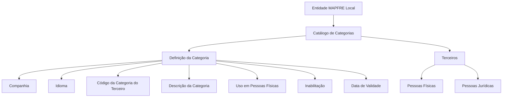

# Definição e Gestão de Categorias de Terceiros no Sistema Reef.core

## 1. Metadados do Documento
- **Arquivo de Origem:** `Não identificado`
- **Tipo de Documento:** `Especificação Técnica`
- **Domínio / Sistema:** `Reef.core — catálogo de Categorias de Terceiros`
- **Público-Alvo:** `Negócio, Operação, Desenvolvedores e Arquitetos`
- **Data/Versão Identificada:** `Não identificada`

---

## 2. Resumo Executivo & Contexto de Negócio

O documento define o conceito e as propriedades do catálogo de Categorias de Terceiros no sistema Reef.core. Uma categoria é apresentada como uma classe, tipo, condição ou divisão usada para classificar terceiros.

No contexto de pessoas físicas, a categorização permite formar grupos segundo capacidades, responsabilidades, antiguidade no cargo, atividades profissionais e grupo social. Para pessoas jurídicas, a categorização permite agrupar entidades pela personalidade jurídica ou por classificações aplicáveis à Administração Pública, conforme o direito público ou privado que as ampara.

O núcleo do sistema mantém códigos de categoria em um catálogo de informação específico, inicialmente entregue sem conteúdo às entidades. A entidade MAPFRE Local pode utilizar o atributo para estabelecer classificações próprias e específicas para seus terceiros.

A definição de uma categoria inclui companhia, idioma, código, descrição, tipologia de uso para pessoa física ou jurídica, estado de inabilitação e data de validade. A data de validade é relevante para manter o histórico das alterações realizadas nas definições de categorias.

---

## 3. Arquitetura, Componentes & Tecnologias Envolvidas

Os elementos identificados são:

- **Reef.core:** sistema cujo núcleo disponibiliza o catálogo de códigos de categorias.
- **Catálogo de Categorias:** estrutura de informação que armazena a definição dos códigos de categorias de terceiros.
- **Entidade MAPFRE Local:** entidade que pode utilizar o catálogo para classificações próprias.
- **Terceiros:** pessoas físicas ou pessoas jurídicas classificadas por categorias.
- **Companhia:** propriedade que identifica a companhia para a qual a categoria está sendo definida.
- **Idioma:** propriedade usada para definir a descrição da categoria no idioma correspondente.



**Nota de Análise:** o documento não detalha arquitetura de implantação, interfaces, métodos HTTP, contratos JSON, bancos de dados, integrações entre microsserviços ou tecnologias de infraestrutura.

---

## 4. Regras de Negócio, Especificações Funcionais & Processos

### Conceito de categoria

Uma categoria pode representar uma classe, um tipo, uma condição ou uma divisão de algo.

No âmbito das pessoas físicas, a categoria pode ser usada para conformar grupos de pessoas conforme:

- Capacidades;
- Responsabilidades;
- Antiguidade no cargo;
- Atividades profissionais;
- Grupo social ao qual a pessoa pertence.

No âmbito das pessoas jurídicas, a categoria pode agrupar entidades de acordo com:

- Personalidade jurídica;
- Classificações de pessoas jurídicas na Administração Pública;
- Tipo de direito público ou privado que ampara a entidade.

### Catálogo de categorias

O núcleo do sistema permite identificar e codificar os Códigos de Categorias em um catálogo de informação específico. Esse catálogo é entregue inicialmente às entidades sem conteúdo.

A entidade MAPFRE Local pode definir e explorar o catálogo para realizar uma classificação própria e específica de terceiros. O documento estabelece que não existe uma preferência ou recomendação para padronizar a codificação no sistema.

Entretanto, a entidade MAPFRE deve analisar a conveniência de usar o catálogo de informação transversalmente nos processos da companhia, considerando a correta definição das categorias e sua exploração posterior.

### Definição de categoria

A definição de uma categoria deve considerar:

1. A companhia sobre a qual a definição está sendo realizada.
2. O idioma utilizado na definição no catálogo.
3. O código da categoria do terceiro.
4. A descrição ou denominação da categoria no idioma definido.
5. A tipologia de utilização para pessoas físicas, pessoas jurídicas ou ambas.
6. A condição de inabilitação da categoria para operações de captura e/ou modificação do terceiro.
7. A data a partir da qual a categoria fica plenamente operativa no sistema.

### Uso em pessoas físicas e jurídicas

O atributo **Uso em Pessoas Físicas** determina se a tipologia de categorização do terceiro é usada:

- Para pessoas físicas;
- Para pessoas jurídicas;
- Indistintamente para pessoas físicas e pessoas jurídicas.

Quando o código de categoria puder ser utilizado indistintamente para pessoas físicas e pessoas jurídicas, o atributo deve ser deixado sem valor ou em branco na definição.

### Inabilitação

A propriedade **Inabilitação** informa ao sistema se a categoria está inabilitada para uso em operações de captura e/ou modificação de terceiros.

### Data de validade e histórico

A propriedade **Fecha de Validez** informa a data a partir da qual a categoria do terceiro está plenamente operativa no sistema. O uso correto dessa data permite manter um histórico das alterações realizadas nas definições de categorias.

---

## 5. Tabelas de Parâmetros, Ambientes e Estruturas de Dados

| Item / Parâmetro | Descrição / Função | Tipo / Valores / Formato | Ambiente / Observações |
| :--- | :--- | :--- | :--- |
| Companhia | Indica o código da companhia sobre a qual é realizada a definição da categoria do terceiro. | Código de companhia; formato não detalhado. | Aplicável à definição da categoria. |
| Idioma | Indica o idioma usado na definição da categoria no catálogo. | Exemplos citados: espanhol, inglês. | Determina o idioma da descrição da categoria. |
| Código da Categoria do Terceiro | Identifica no sistema o código da categoria do terceiro. | Código; formato não detalhado. | Exemplos: `01`, `02`, `03`. |
| Descrição da Categoria do Terceiro | Informa a denominação ou descrição da categoria conforme o idioma usado na definição. | Texto. | Exemplos em espanhol: `Categoría 1`, `Categoría 2`, `Categoría 3`. |
| Uso em Pessoas Físicas | Determina a aplicabilidade da tipologia de categorização do terceiro. | Pessoas físicas, pessoas jurídicas ou ambas. | Deve permanecer em branco quando a categoria for aplicável indistintamente a pessoas físicas e jurídicas. |
| Inabilitação | Indica se a categoria está inabilitada para operações de captura e/ou modificação do terceiro. | Estado de inabilitação; valores não detalhados. | Afeta o uso operacional da categoria. |
| Data de Validade | Define a data a partir da qual a categoria está plenamente operativa. | Data; formato não detalhado. | Permite manter histórico de alterações nas definições de categorias. |
| Catálogo de Categorias | Catálogo específico para identificação e codificação de códigos de categorias. | Estrutura de catálogo; detalhes técnicos não informados. | Entregue inicialmente às entidades sem conteúdo. |
| MAPFRE Local | Entidade que pode usar o catálogo para classificação própria e específica dos terceiros. | Entidade organizacional. | Deve avaliar o uso transversal do catálogo nos processos da companhia. |

---

## 6. Bateria de Perguntas & Respostas para RAG (FAQ Sintético)

### P1: Qual é a finalidade do catálogo de Categorias de Terceiros no Reef.core?
**R:** O catálogo de Categorias de Terceiros permite identificar e codificar códigos de categorias em uma estrutura de informação específica. A entidade MAPFRE Local pode utilizar essa estrutura para realizar classificações próprias e específicas de seus terceiros.

### P2: Como as categorias podem ser usadas para pessoas físicas?
**R:** Para pessoas físicas, a categorização pode formar grupos de acordo com capacidades, responsabilidades, antiguidade no cargo, atividades profissionais e grupo social ao qual a pessoa pertence.

### P3: Como as categorias podem ser usadas para pessoas jurídicas?
**R:** Para pessoas jurídicas, as categorias podem agrupar entidades segundo sua personalidade jurídica ou segundo classificações aplicáveis à Administração Pública, considerando o tipo de direito público ou privado que as ampara.

### P4: O catálogo de Categorias é entregue preenchido para as entidades?
**R:** Não. O documento informa que o catálogo de informação específico é entregue inicialmente às entidades vazio de conteúdo.

### P5: Quais propriedades fazem parte da definição de uma categoria?
**R:** A definição inclui companhia, idioma, código da categoria do terceiro, descrição da categoria do terceiro, uso em pessoas físicas, inabilitação e data de validade.

### P6: Quando o atributo Uso em Pessoas Físicas deve ficar em branco?
**R:** O atributo deve permanecer sem valor ou em branco quando o código da categoria puder ser utilizado indistintamente para pessoas físicas e pessoas jurídicas.

### P7: Qual é a função da propriedade Companhia?
**R:** A propriedade Companhia informa ao sistema o código da companhia sobre a qual está sendo realizada a definição da categoria do terceiro.

### P8: Qual é a função do idioma na categoria de terceiro?
**R:** O idioma identifica a língua usada na definição da categoria no catálogo e determina o idioma da denominação ou descrição correspondente, como espanhol ou inglês.

### P9: O que significa inabilitar uma categoria?
**R:** A inabilitação informa ao sistema que a categoria não está habilitada para ser usada nas operações de captura e/ou modificação do terceiro.

### P10: Como a Data de Validade contribui para a gestão das categorias?
**R:** A Data de Validade determina a partir de quando a categoria está plenamente operativa no sistema. Seu uso correto permite manter o histórico dos cambios efetuados nas definições de categorias.

### P11: Existe um padrão obrigatório para codificar as categorias no sistema?
**R:** Não. O documento declara que não existe preferência nem recomendação para estabelecer ou padronizar a codificação das categorias no sistema.

### P12: Qual recomendação é feita à entidade MAPFRE para usar o catálogo?
**R:** A entidade MAPFRE deve analisar a conveniência de utilizar transversalmente o catálogo de informação nos processos da companhia, garantindo sua correta definição e contemplando sua exploração posterior.

---

## 7. Glossário de Termos, Siglas & Conceitos-Chave

- **Reef.core:** sistema cujo núcleo possui a capacidade de identificar e codificar códigos de categorias em um catálogo específico.
- **Categoria:** classe, tipo, condição ou divisão usada para classificar terceiros.
- **Categoria do Terceiro:** código e descrição utilizados para categorizar um terceiro no sistema.
- **Catálogo de Categorias:** catálogo de informação específico que armazena as definições dos códigos de categorias.
- **Terceiro:** pessoa física ou pessoa jurídica sujeita à classificação por categorias.
- **MAPFRE Local:** entidade que pode utilizar o catálogo para classificações próprias e específicas de terceiros.
- **Pessoa Física:** indivíduo que pode ser categorizado conforme capacidades, responsabilidades, antiguidade, atividades profissionais ou grupo social.
- **Pessoa Jurídica:** entidade que pode ser categorizada conforme personalidade jurídica ou classificações relacionadas à Administração Pública.
- **Inabilitação:** condição que impede o uso da categoria em operações de captura e/ou modificação do terceiro.
- **Data de Validade:** data a partir da qual a categoria está plenamente operativa no sistema.

---

## 8. Notas Críticas, Riscos & Limitações

- O documento não define formatos técnicos, tamanhos, obrigatoriedade, domínios de valores ou validações de campo para companhia, idioma, código, descrição, inabilitação ou data de validade.
- O documento não informa os valores possíveis para o estado de inabilitação.
- O documento não especifica como o sistema diferencia, tecnicamente, categorias aplicáveis apenas a pessoas físicas, apenas a pessoas jurídicas ou a ambas.
- Não são detalhados métodos de manutenção do catálogo, perfis de acesso, matriz de permissões, trilha de auditoria, integrações ou contratos de interface.
- A ausência de recomendação de padronização para a codificação pode gerar classificações heterogêneas entre entidades caso não exista governança local.
- O uso transversal do catálogo nos processos da companhia depende de análise de conveniência pela entidade MAPFRE.
- A leitura isolada do documento pode conduzir a interpretações incorretas; o documento recomenda consultar “Actividades de Terceros” e “Preguntas frecuentes”.

---

## 9. Conteúdo Bruto Estruturado (Referência Fiel)

```text
--- [PÁGINA 1 DE 3] ---

DEFINICIÓN de Categorías
Contexto
Se denomina categoría a una clase, un tipo, una condición o una división de algo.
Conceptualmente en Reef.core y en el ámbito de las personas Físicas, su categorización permite
conformar grupos de personas de acuerdo a sus capacidades, responsabilidades, antigüedad en el
puesto, actividades profesionales, grupo social al que pertenece, mientras que en el ámbito de las
personas jurídicas permite aglutinar entidades de acuerdo a su personalidad jurídica, o bien referidas
a las clasificaciones de las personas jurídicas en la Administración Pública, de acuerdo al tipo de
derecho público o privado que las amparan,...
Propiedades Generales
Funcionalmente, el núcleo del Sistema cuenta con la posibilidad de identificar y codificar los Códigos
de Categorías en un catálogo de información específico que se entrega a las entidades inicialmente
vacío de contenido.
... De esta manera la entidad MAPFRE Local podrá emplear este atributo para efectuar una
clasificación de uso propio y específico con los Terceros de la entidad.
Compañía
Esta propiedad le indica al sistema el código de la compañía sobre la que se está realizando la
definición de la Categoría del Tercero.
 / 
 CF
Home Solutions APIs Documentation Zeus
EN

--- [PÁGINA 2 DE 3] ---

Idioma
Esta propiedad le indica al sistema el Idioma empleado en la definición de la Categoría en el
Catálogo, como por ejemplo: español, inglés,...
Código de la Categoría del Tercero
Esta propiedad indicará en el sistema el código de la Categoría del Tercero.
Descripción de la Categoría del Tercero
Esta propiedad le indica al sistema cual es la denominación o descripción de la Categoría del
Tercero, de acuerdo con el idioma utilizado en la definición.
A modo de ejemplo y si el Idioma utilizado en la definición es el español:
CATEGORÍA DESCRIPCIÓN
01 Categoría 1.
02 Categoría 2
03 Categoría 3
... ...
Propiedades Operativas
Uso en Personas Físicas
Este atributo indica si la Tipología de la categorización del Tercero se usa para personas Físicas,
para personas Jurídicas o indistintamente para unas u otras.
NOTA: En el supuesto que el código de la Categoría se pueda utilizar indistintamente tanto para
personas físicas como para personas jurídicas, este atributo debe dejarse sin valor/en blanco en su
definición.
Otras Propiedades
Inhabilitación
Esta propiedad le indica al Sistema si la calidad está inhabilitada para poder ser utilizada en las
operaciones de captura y/o modificación del Tercero.

--- [PÁGINA 3 DE 3] ---

Fecha de Validez
Esta propiedad le indica al Sistema la fecha a partir de la cual la clase del Tercero está plenamente
operativa en el sistema por lo que su correcto uso permite tener un histórico de los cambios
efectuados en las definiciones de los categorías.
Vínculos
Relación de Directrices y Documentos funcionales cuya lectura recomendada para evitar que la
interpretación aislada del presente documento pueda conducir a error.
Actividades de Terceros
Preguntas frecuentes
(1) ¿Existe alguna recomendación operativa que deba ser tomada en consideración localmente en la
codificación, uso y definición del catálogo de Categorías en el Sistema?
No existe una preferencia ni recomendación para establecer o estandarizar en el sistema su
codificación si bien la entidad MAPFRE debe analizar la conveniencia de utilizar transversalmente en
los procesos de la compañía este catálogo de información para su correcta definición contemplando
su posterior explotación.
```
