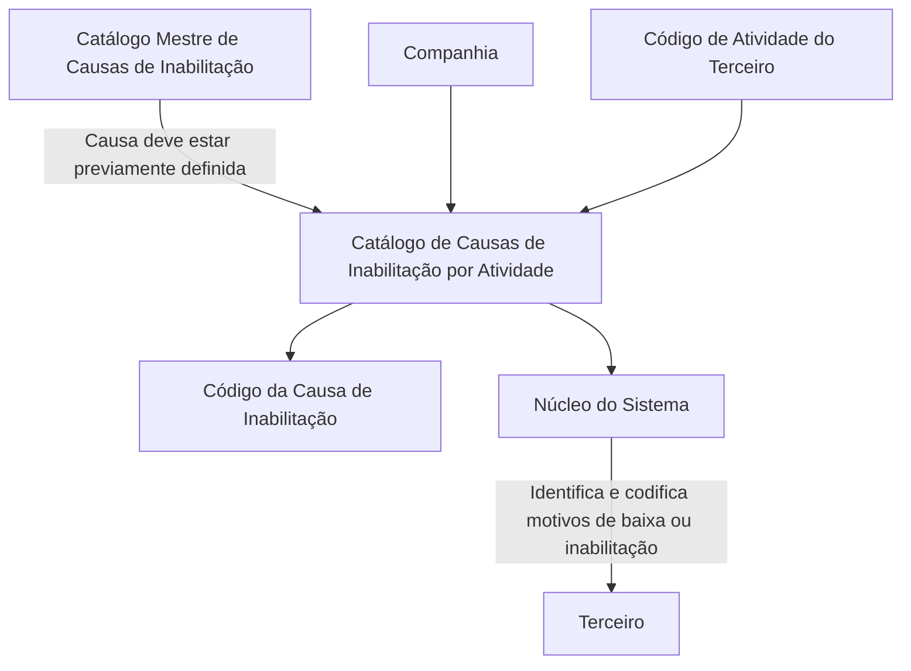

# Definição das Causas de Inabilitação por Atividade do Terceiro

## 1. Metadados do Documento
- **Arquivo de Origem:** `Não identificado no conteúdo fornecido`
- **Tipo de Documento:** `Especificação Técnica / Funcional`
- **Domínio / Sistema:** `Sistema de gestão de Terceiros; Causas de Inabilitação por Atividade`
- **Público-Alvo:** `Analistas funcionais, operação, administradores do sistema e equipes de negócio`
- **Data/Versão Identificada:** `Não identificada`

---

## 2. Resumo Executivo & Contexto de Negócio

O documento descreve a definição das **Causas de Inabilitação por Atividade do Terceiro** no núcleo do sistema. A funcionalidade permite identificar e codificar motivos que podem provocar a baixa ou a inabilitação de Terceiros de acordo com os respectivos códigos de Atividade.

A definição é realizada em um catálogo de informação específico, entregue às entidades sem conteúdo inicial. O catálogo associa uma Companhia, um Código de Atividade do Terceiro e um Código da Causa de Inabilitação.

A causa de inabilitação utilizada na associação deve estar previamente definida no **Catálogo Mestre de Causas de Inabilitação**. Portanto, o cadastro por atividade depende da existência anterior do motivo corporativo no catálogo mestre.

O documento também registra que não existe preferência ou recomendação corporativa para estabelecer ou padronizar a codificação dos Motivos de Inabilitação no sistema. A definição da codificação deve, assim, ser tratada sem uma diretriz corporativa explícita de padronização apresentada no conteúdo.

---

## 3. Arquitetura, Componentes & Tecnologias Envolvidas

Os componentes funcionais identificados são:

- **Núcleo do Sistema:** possui a capacidade de identificar e codificar motivos operacionais de baixa ou inabilitação de Terceiros.
- **Catálogo específico de Causas de Inabilitação por Atividade:** armazena a relação entre Companhia, Atividade do Terceiro e Causa de Inabilitação.
- **Catálogo Mestre de Causas de Inabilitação:** contém previamente as causas que podem ser referenciadas pela definição por atividade.
- **Entidades:** recebem o catálogo específico sem conteúdo inicial.
- **Terceiro:** entidade sujeita à baixa ou inabilitação conforme seu código de Atividade e a causa associada.



**Nota de Análise:** O documento não detalha tecnologias, interfaces, métodos HTTP, contratos JSON, banco de dados, ambientes, permissões ou mecanismos automáticos de execução da inabilitação.

---

## 4. Regras de Negócio, Especificações Funcionais & Processos

1. O núcleo do sistema pode identificar e codificar diferentes Motivos que, operacionalmente, podem provocar a baixa ou inabilitação dos Terceiros.
2. A identificação ou codificação de Motivos de Inabilitação deve considerar os códigos de Atividade dos Terceiros.
3. A informação deve ser mantida em um catálogo específico destinado à definição das Causas de Inabilitação por Atividade do Terceiro.
4. O catálogo específico é entregue às entidades sem conteúdo.
5. Cada definição de motivo de inabilitação por atividade possui a propriedade **Companhia**.
6. A propriedade Companhia indica o código da companhia sobre a qual está sendo realizada a definição do motivo de Inabilitação do Terceiro.
7. Cada definição possui a propriedade **Código de Atividade do Terceiro**.
8. A propriedade Código de Atividade do Terceiro indica o código da Atividade do Terceiro.
9. Cada definição possui a propriedade **Código da Causa de Inabilitação**.
10. O Código da Causa de Inabilitação indica, conforme o código de atividade do Terceiro, o código do Motivo de Inabilitação do Terceiro no sistema.
11. O Código da Causa de Inabilitação deve estar previamente definido no **Catálogo Mestre de Causas de Inabilitação**.
12. Não existe preferência ou recomendação corporativa para estabelecer ou padronizar a codificação dos Motivos de Inabilitação no sistema.

---

## 5. Tabelas de Parâmetros, Ambientes e Estruturas de Dados

| Item / Parâmetro | Descrição / Função | Tipo / Valores / Formato | Ambiente / Observações |
| :--- | :--- | :--- | :--- |
| Companhia | Indica o código da companhia sobre a qual é realizada a definição do motivo de Inabilitação do Terceiro. | Código de companhia; formato não detalhado. | Propriedade do catálogo específico. |
| Código de Atividade do Terceiro | Indica o código da Atividade do Terceiro. | Código de atividade; formato não detalhado. | Utilizado para relacionar a atividade ao motivo de inabilitação. |
| Código da Causa de Inabilitação | Indica, conforme o código de atividade do Terceiro, o código do Motivo de Inabilitação do Terceiro no sistema. | Código de causa; formato não detalhado. | Deve estar definido previamente no Catálogo Mestre de Causas de Inabilitação. |
| Catálogo específico | Catálogo de informação usado para definir causas de inabilitação por atividade do Terceiro. | Catálogo funcional. | Entregue às entidades sem conteúdo inicial. |
| Catálogo Mestre de Causas de Inabilitação | Catálogo que deve conter previamente os códigos de causa utilizados na definição por atividade. | Catálogo mestre funcional. | Dependência obrigatória para o Código da Causa de Inabilitação. |
| Codificação dos Motivos de Inabilitação | Forma de definir códigos para motivos de inabilitação. | Não especificado. | Não há preferência ou recomendação corporativa de padronização. |

---

## 6. Bateria de Perguntas & Respostas para RAG (FAQ Sintético)

### P1: Qual é o objetivo da definição de Causas de Inabilitação por Atividade do Terceiro?
**R:** O objetivo é permitir que o núcleo do sistema identifique e codifique diferentes Motivos que operacionalmente podem provocar a baixa ou a inabilitação de Terceiros, considerando os respectivos códigos de Atividade.

### P2: Quais propriedades compõem a definição de uma Causa de Inabilitação por Atividade?
**R:** A definição apresenta as propriedades Companhia, Código de Atividade do Terceiro e Código da Causa de Inabilitação.

### P3: O que a propriedade Companhia representa nesse catálogo?
**R:** A propriedade Companhia indica o código da companhia sobre a qual está sendo realizada a definição do motivo de Inabilitação do Terceiro.

### P4: Como o Código de Atividade do Terceiro é utilizado?
**R:** O Código de Atividade do Terceiro indica o código da atividade do Terceiro e é o critério pelo qual o sistema relaciona uma causa ou motivo de inabilitação ao Terceiro.

### P5: O que representa o Código da Causa de Inabilitação?
**R:** O Código da Causa de Inabilitação representa, de acordo com o código de atividade do Terceiro, o código do Motivo de Inabilitação do Terceiro no sistema.

### P6: É possível utilizar qualquer Código da Causa de Inabilitação no catálogo por atividade?
**R:** Não. O Código da Causa de Inabilitação deve estar previamente definido no Catálogo Mestre de Causas de Inabilitação.

### P7: O catálogo específico é entregue com dados preenchidos?
**R:** Não. O documento informa que o catálogo específico de informação é entregue às entidades sem conteúdo.

### P8: Existe um padrão corporativo obrigatório para a codificação dos Motivos de Inabilitação?
**R:** Não. O documento informa expressamente que não existe preferência ou recomendação corporativa para estabelecer ou padronizar a codificação dos Motivos de Inabilitação no sistema.

### P9: O documento especifica como a inabilitação é executada tecnicamente?
**R:** Não. O conteúdo descreve a capacidade funcional de identificar e codificar motivos de baixa ou inabilitação, mas não detalha métodos técnicos, contratos, interfaces, integrações ou processamento automático.

### P10: Quais documentos funcionais são recomendados para leitura relacionada?
**R:** O documento recomenda a leitura de **Atividades de Terceiros** e **Causas de Inabilitação**, para evitar que a interpretação isolada do conteúdo conduza a erro.

---

## 7. Glossário de Termos, Siglas & Conceitos-Chave

- **Terceiro:** entidade sujeita à baixa ou inabilitação no sistema conforme sua atividade e o motivo associado.
- **Atividade do Terceiro:** classificação identificada pelo Código de Atividade do Terceiro.
- **Causa de Inabilitação:** causa ou motivo utilizado pelo sistema para representar a inabilitação de um Terceiro.
- **Motivo de Inabilitação:** motivo que operacionalmente pode provocar a baixa ou inabilitação de um Terceiro.
- **Catálogo Mestre de Causas de Inabilitação:** catálogo no qual o Código da Causa de Inabilitação deve existir previamente.
- **Catálogo específico:** catálogo de informação destinado à associação entre Companhia, Código de Atividade do Terceiro e Código da Causa de Inabilitação.
- **Baixa:** evento operacional mencionado como possível consequência de Motivos relacionados à atividade de Terceiros.

---

## 8. Notas Críticas, Riscos & Limitações

- O catálogo específico é entregue sem conteúdo, exigindo definição e carga pelas entidades.
- Existe dependência funcional do Catálogo Mestre de Causas de Inabilitação: uma causa não previamente definida nesse catálogo não atende à regra documentada para uso na definição por atividade.
- A ausência de recomendação corporativa para codificação dos Motivos de Inabilitação pode resultar em variações locais de códigos entre entidades.
- O documento não apresenta detalhamento sobre formatos de códigos, campos obrigatórios, validações de unicidade, permissões, trilha de auditoria, telas, APIs, integrações ou processamento da baixa/inabilitação.
- **Nota de Análise:** O documento lista a relação entre atividade e causa de inabilitação, porém não detalha o comportamento do sistema após a identificação dessa relação.

---

## 9. Conteúdo Bruto Estruturado (Referência Fiel)

```text
--- [PÁGINA 1 DE 2] ---

DEFINICIÓN de las Causas de Inhabilitación
por Actividad del Tercero
Propiedades Generales
Funcionalmente, el núcleo del Sistema cuenta con la posibilidad de identificar y codificar los
diferentes Motivos que operativamente pueden provocar la baja o inhabilitación de los Terceros de
acuerdo a sus códigos de Actividad, en un catálogo de información específico que se entrega a las
entidades sin contenido:
Compañía
Esta propiedad le indica al sistema el código de la compañía sobre la que se está realizando la
definición del motivo de Inhabilitación del Tercero.
Código de Actividad del Tercero
Esta propiedad indicará el código de la Actividad del Tercero.
Código de la Causa de Inhabilitación
Esta propiedad indicará, de acuerdo al código de actividad del Tercero, el código del Motivo de la
Inhabilitación del Tercero en el sistema.
NOTA: El Código de la Causa de Inhabilitación ha de estar definida previamente en el Catálogo
Maestro de Causas de Inhabilitación
 / 
 CF
Home Solutions APIs Documentation Zeus
EN


--- [PÁGINA 2 DE 2] ---

Vínculos
Relación de Directrices y Documentos funcionales cuya lectura recomendada para evitar que la
interpretación aislada del presente documento pueda conducir a error.
Actividades de Terceros
Causas de Inhabilitación
Preguntas frecuentes
(1) ¿Existe alguna recomendación operativa que deba ser tomada en consideración localmente en la
codificación y uso de las Causas de Inhabilitación de Terceros por Actividad en el Sistema?
No existe Corporativamente una preferencia o recomendación para establecer o estandarizar en el
sistema la codificación de los Motivos de Inhabilitación.
```
