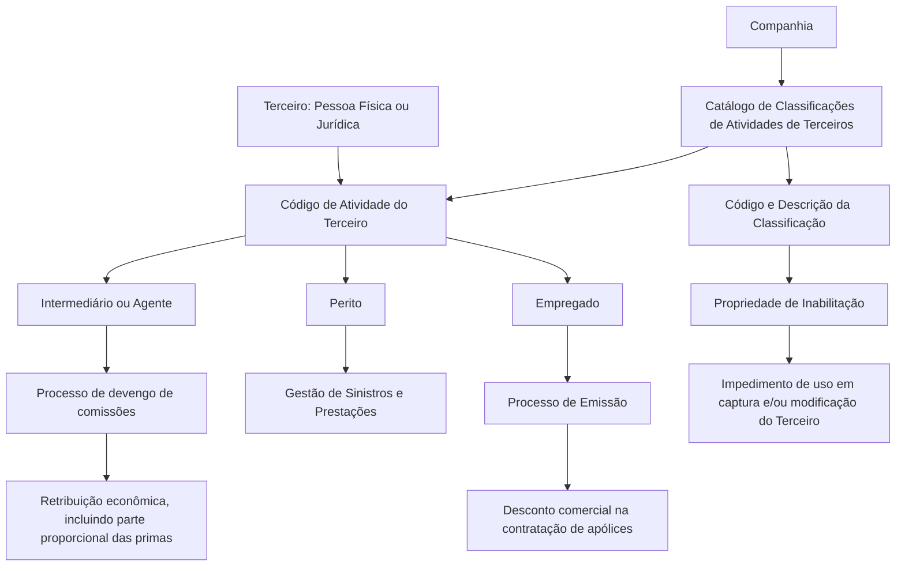

# Definição das Classificações das Atividades de Terceiros no Sistema

## 1. Metadados do Documento
- **Arquivo de Origem:** `Não identificado no conteúdo fornecido`
- **Tipo de Documento:** Especificação Funcional
- **Domínio / Sistema:** Classificações de Atividades de Terceiros — entidades seguradoras / MAPFRE
- **Público-Alvo:** Operação, negócio e equipes responsáveis pela configuração funcional do Sistema
- **Data/Versão Identificada:** Não identificada

---

## 2. Resumo Executivo & Contexto de Negócio

O documento descreve a funcionalidade de classificação das atividades atribuídas a Terceiros, sejam pessoas físicas ou jurídicas, no núcleo do Sistema. As atividades permitem identificar inequivocamente os processos, procedimentos e fluxos operacionais nos quais cada Terceiro atua ou pode atuar.

A codificação da atividade de um Terceiro possui efeitos operacionais diretos. Uma pessoa física identificada como Intermediário ou Agente pode entrar automaticamente no processo de devengo de comissões da entidade MAPFRE e receber remuneração econômica, incluindo uma parte proporcional das primas obtidas em sua atividade comercial direta, por intervenção ou por colaboração.

A mesma pessoa, quando identificada com uma atividade diferente — como Perito ou Empregado — pode participar de processos distintos. Um Perito pode estar envolvido em tarefas de atribuição e perícia no processo de Gestão de Sinistros e Prestações. Um Empregado pode beneficiar-se automaticamente de um desconto comercial ao contratar apólices no processo de Emissão.

Além da codificação intrínseca das atividades de Terceiros, o Sistema permite que entidades seguradoras classifiquem essas atividades segundo critérios localmente definidos. As classificações são definidas por companhia, associadas a um código de atividade de Terceiro e identificadas por código e descrição.

---

## 3. Arquitetura, Componentes & Tecnologias Envolvidas

O documento não descreve tecnologias de infraestrutura, protocolos, APIs, bancos de dados, servidores ou ambientes técnicos. A arquitetura funcional identificável envolve o núcleo do Sistema, o catálogo de classificações, a companhia, a atividade do Terceiro e os processos corporativos impactados pela atividade atribuída.

### Componentes e entidades funcionais identificados

| Componente / Entidade | Papel identificado |
| :--- | :--- |
| Núcleo do Sistema | Possui a funcionalidade de identificar e codificar classificações das atividades de Terceiros. |
| Catálogo específico de informação | Repositório funcional para identificação e codificação das classificações das atividades de Terceiros. |
| Companhia | Escopo no qual a definição da classificação é realizada. |
| Terceiro | Pessoa física ou jurídica à qual uma atividade e uma classificação podem ser associadas. |
| Atividade do Terceiro | Código que identifica a atuação do Terceiro e pode determinar processos operacionais aplicáveis. |
| Classificação | Código associado à atividade do Terceiro, definido por companhia. |
| Processo de devengo de comissões | Processo aplicável, como exemplo, a Terceiros identificados com atividade de Intermediário ou Agente. |
| Gestão de Sinistros e Prestações | Processo no qual um Terceiro identificado como Perito pode atuar em tarefas de atribuição e perícia. |
| Emissão | Processo no qual um Empregado pode receber automaticamente desconto comercial na contratação de apólices. |
| MAPFRE | Entidade mencionada no exemplo do processo de devengo de comissões. |



> **Nota de Análise:** O documento descreve relações funcionais entre atividades de Terceiros e processos corporativos, mas não detalha interfaces, métodos HTTP, contratos JSON, persistência de dados, regras de cálculo de comissões ou critérios técnicos de integração.

---

## 4. Regras de Negócio, Especificações Funcionais & Processos

### 4.1 Identificação das atividades de Terceiros

1. As atividades atribuídas a Terceiros físicos ou jurídicos identificam inequivocamente os processos, procedimentos e fluxos operacionais do Sistema nos quais esses Terceiros intervêm ou podem intervir.
2. A codificação das atividades de Terceiros é uma tarefa intrínseca à funcionalidade do núcleo da aplicação.
3. O Sistema permite identificar e codificar diferentes classificações das atividades de Terceiros em um catálogo de informação específico.
4. As classificações podem ser aplicadas a Terceiros que sejam pessoas físicas ou pessoas jurídicas.

### 4.2 Definição da classificação por companhia

1. A definição das classificações de Terceiros é realizada no nível de companhia.
2. Cada classificação pode ser denominada e identificada individualmente por uma denominação ou texto descritivo.
3. A definição funcional relaciona, no mínimo:
   - o código da companhia;
   - o código da atividade do Terceiro;
   - o código da classificação;
   - a descrição da classificação.

### 4.3 Efeitos funcionais da atividade atribuída

| Atividade / Identificação do Terceiro | Efeito ou processo descrito |
| :--- | :--- |
| Intermediário ou Agente | Permite entrada automática no processo de devengo de comissões da entidade MAPFRE. |
| Intermediário ou Agente | Pode gerar remuneração econômica, incluindo parte proporcional das primas obtidas em atividade comercial direta, intervenção ou colaboração. |
| Perito | Pode envolver o Terceiro em tarefas específicas de atribuição e perícia dentro da Gestão de Sinistros e Prestações. |
| Empregado | Pode conceder automaticamente desconto comercial na contratação de apólices, dentro do processo de Emissão. |

### 4.4 Regra de inabilitação

1. A propriedade **Inhabilitación** informa ao Sistema que a classificação da atividade do Terceiro está inabilitada.
2. Uma classificação inabilitada não pode ser utilizada em operações de captura do Terceiro.
3. Uma classificação inabilitada não pode ser utilizada em operações de modificação do Terceiro.

### 4.5 Diretriz corporativa de codificação

Não existe preferência ou recomendação corporativa para estabelecer ou padronizar a codificação das Classificações das Atividades de Terceiros no Sistema. A codificação pode, portanto, ser definida localmente pelas entidades seguradoras de acordo com os critérios relevantes que desejem utilizar.

---

## 5. Tabelas de Parâmetros, Ambientes e Estruturas de Dados

### 5.1 Propriedades gerais da classificação

| Item / Parâmetro | Descrição / Função | Tipo / Valores / Formato | Ambiente / Observações |
| :--- | :--- | :--- | :--- |
| Companhia | Indica o código da companhia sobre a qual está sendo realizada a definição da classificação dentro da atividade do Terceiro. | Código de companhia | A definição é realizada no nível de companhia. |
| Código de Atividade do Terceiro | Indica o código da atividade atribuída ao Terceiro no Sistema. | Código de atividade | A atividade identifica processos, procedimentos e fluxos operacionais aplicáveis ao Terceiro. |
| Classificação | Indica o código da classificação associada à atividade do Terceiro. | Código de classificação | Associada a uma atividade do Terceiro e definida para uma companhia. |
| Descrição da Classificação | Indica a denominação ou descrição da classificação do Terceiro. | Texto descritivo | Permite denominar e identificar individualmente cada classificação. |
| Inhabilitación | Indica que a classificação da atividade do Terceiro está inabilitada para uso. | Propriedade de estado; valores não detalhados | Bloqueia o uso da classificação em captura e/ou modificação do Terceiro. |

### 5.2 Exemplos de classificações apresentados

| Código de Classificação | Descrição da Classificação | Ambiente / Observações |
| :--- | :--- | :--- |
| 01 | Clasificación 1. | Exemplo apresentado no documento. |
| 02 | Clasificación 2 | Exemplo apresentado no documento. |
| 03 | Clasificación 3 | Exemplo apresentado no documento. |
| ... | ... | O documento indica continuidade de classificações, sem detalhar outros códigos. |

### 5.3 Processos e impactos associados a atividades

| Item / Parâmetro | Descrição / Função | Tipo / Valores / Formato | Ambiente / Observações |
| :--- | :--- | :--- | :--- |
| Intermediário ou Agente | Identificação de atividade que permite participação automática no processo de devengo de comissões. | Atividade de Terceiro | Exemplo relacionado à entidade MAPFRE. |
| Retribuição econômica | Remuneração que pode ser percebida pelo Intermediário ou Agente. | Conceito econômico | Inclui, entre outros conceitos, parte proporcional das primas obtidas. |
| Perito | Identificação de atividade associada a tarefas de atribuição e perícia. | Atividade de Terceiro | Relacionada à Gestão de Sinistros e Prestações. |
| Empregado | Identificação de atividade que pode permitir desconto comercial. | Atividade de Terceiro | Relacionada à contratação de apólices no processo de Emissão. |
| Captura do Terceiro | Operação em que classificações inabilitadas não podem ser utilizadas. | Operação funcional | Não há detalhamento do canal ou interface de captura. |
| Modificação do Terceiro | Operação em que classificações inabilitadas não podem ser utilizadas. | Operação funcional | Não há detalhamento do canal ou interface de modificação. |

---

## 6. Bateria de Perguntas & Respostas para RAG (FAQ Sintético)

### P1: Qual é o objetivo das classificações das atividades de Terceiros no Sistema?
**R:** As classificações permitem identificar e codificar, em um catálogo específico, critérios aplicáveis às atividades de Terceiros físicos ou jurídicos. As atividades dos Terceiros identificam inequivocamente os processos, procedimentos e fluxos operacionais do Sistema nos quais esses Terceiros intervêm ou podem intervir.

### P2: Em qual nível organizacional uma classificação de Terceiro é definida?
**R:** A definição das Classificações de Terceiros é realizada no nível de companhia. A propriedade Companhia informa o código da companhia para a qual está sendo definida a classificação dentro da atividade do Terceiro.

### P3: Quais propriedades compõem a definição de uma classificação de atividade de Terceiro?
**R:** O documento identifica as propriedades Companhia, Código de Atividade do Terceiro, Classificação e Descrição da Classificação. Também descreve a propriedade Inhabilitación, utilizada para indicar que uma classificação não pode ser usada em determinadas operações.

### P4: O que acontece quando uma pessoa é identificada como Intermediário ou Agente?
**R:** Como exemplo, quando uma pessoa física é identificada com a atividade associada a Intermediário ou Agente, o código de atividade permite sua entrada automática no processo de devengo de comissões da entidade MAPFRE. O Terceiro pode receber remuneração econômica, incluindo parte proporcional das primas obtidas por atividade comercial direta, intervenção ou colaboração.

### P5: Qual é o impacto de identificar um Terceiro como Perito?
**R:** Um Terceiro identificado como Perito possui um código de atividade diferente do código de Intermediário citado no exemplo. Esse Terceiro pode estar envolvido em tarefas específicas de atribuição e perícia dentro do processo de Gestão de Sinistros e Prestações.

### P6: Qual benefício é citado para um Terceiro identificado como Empregado?
**R:** Um Terceiro identificado como Empregado possui código de atividade diferente do código de Intermediário e pode beneficiar-se automaticamente de um desconto comercial na contratação de suas apólices, dentro do processo de Emissão.

### P7: O que significa a propriedade Inhabilitación em uma classificação de Terceiro?
**R:** A propriedade Inhabilitación indica ao Sistema que a Classificação da Atividade do Terceiro está inabilitada. Uma classificação inabilitada não pode ser utilizada nas operações de captura e/ou modificação do Terceiro.

### P8: Existe um padrão corporativo obrigatório para codificar as classificações das atividades de Terceiros?
**R:** Não. O documento afirma expressamente que não existe preferência ou recomendação corporativa para estabelecer ou padronizar a codificação das Classificações das Atividades de Terceiros no Sistema.

### P9: As classificações podem ser aplicadas apenas a pessoas físicas?
**R:** Não. O núcleo do Sistema permite identificar e codificar classificações das atividades de Terceiros que sejam pessoas físicas ou jurídicas.

### P10: O documento especifica métodos HTTP, contratos de API ou formatos de integração para as classificações?
**R:** Não. O conteúdo fornecido é funcional e não detalha métodos HTTP, APIs, contratos JSON, endpoints, tecnologias de integração, bancos de dados ou formatos de mensagens.

---

## 7. Glossário de Termos, Siglas & Conceitos-Chave

- **Atividade do Terceiro:** Código atribuído a um Terceiro que identifica processos, procedimentos e fluxos operacionais nos quais o Terceiro intervém ou pode intervir.
- **Classificação:** Código associado à atividade do Terceiro, definido no contexto de uma companhia e identificado também por uma descrição.
- **Companhia:** Entidade cujo código determina o escopo da definição da classificação da atividade do Terceiro.
- **Devengo de comissões:** Processo no qual um Intermediário ou Agente pode entrar automaticamente e perceber remuneração econômica.
- **Emissão:** Processo citado como o contexto em que um Empregado pode beneficiar-se automaticamente de desconto comercial na contratação de apólices.
- **Gestão de Sinistros e Prestações:** Processo citado como o contexto para tarefas específicas de atribuição e perícia executadas por um Perito.
- **Inhabilitación:** Propriedade que marca uma classificação da atividade do Terceiro como inabilitada para operações de captura e/ou modificação.
- **Intermediário ou Agente:** Atividade de Terceiro citada como exemplo de participação automática no processo de devengo de comissões.
- **MAPFRE:** Entidade mencionada no exemplo do processo de devengo de comissões.
- **Perito:** Atividade de Terceiro associada a tarefas específicas de atribuição e perícia.
- **Terceiro:** Pessoa física ou jurídica cujas atividades podem ser codificadas e classificadas no Sistema.

---

## 8. Notas Críticas, Riscos & Limitações

- O documento não apresenta detalhamento técnico de APIs, interfaces, integrações, persistência, segurança, perfis de acesso, auditoria ou modelo físico de dados.
- O documento não define os valores possíveis, formato, comportamento de alteração ou mecanismo de persistência da propriedade **Inhabilitación**.
- Não são descritos os critérios de cálculo da remuneração econômica, das comissões ou da parte proporcional das primas.
- Não são fornecidos critérios para associação entre uma atividade de Terceiro e uma classificação específica.
- Não há recomendação corporativa para padronização da codificação das classificações; essa liberdade local pode produzir códigos divergentes entre companhias.
- A seção de vínculos recomenda a leitura do documento funcional **Actividades de Terceros** para evitar interpretações isoladas incorretas.
- Não há detalhamento adicional sobre o item **Otras Propiedades**.
- O texto extraído contém a sequência ` / CF Home Solutions APIs Documentation Zeus EN`, sem contexto funcional suficiente para estabelecer uma relação confiável com as classificações de Terceiros.

---

## 9. Conteúdo Bruto Estruturado (Referência Fiel)

```text
--- [PÁGINA 1 DE 3] ---

DEFINICIÓN de las Clasificaciones de Terceros
Contexto
Las actividades que los Terceros Físicos o Jurídicos tienen asignadas, identifican inequívocamente
los procesos, procedimientos y flujos operativos en el sistema en los que intervienen o pueden
intervenir, como por ejemplo:
Si se captura en el sistema la información de una persona física y se identifica en el sistema con
la actividad asociada a un Intermediario o Agente, este código de actividad le permitirá entrar de
manera automática en el proceso de devengo de comisiones de la entidad MAPFRE, proceso
por el que percibirá una retribución económica consistente, entre otros conceptos, por una parte
proporcional de las primas conseguidas en su labor comercial directa o a través de su
intervención o colaboración.
En cambio, si la misma persona se hubiera identificado en el sistema como un Perito o como un
Empleado tendría asignados códigos diferentes de actividad al código de actividad de
Intermediario del ejemplo anterior y por ello esta persona podría respectivamente estar
involucrada en tareas específicas de asignación y peritaje dentro del proceso de Gestión de
Siniestros y Prestaciones o beneficiarse automáticamente de un descuento comercial en la
contratación de sus pólizas en el proceso de Emisión.
Además de la tarea de codificación de las actividades de los Terceros, la cual es una tarea
intrínseca a la funcionalidad del núcleo de la aplicación, el sistema permite ir un paso más allá y
clasificar estas actividades de acuerdo con los criterios más relevantes que tengan a bien definir y
emplear localmente las entidades aseguradoras.
 / 
 CF
Home Solutions APIs Documentation Zeus
EN


--- [PÁGINA 2 DE 3] ---

Propiedades Generales
Funcionalmente, el núcleo del Sistema cuenta con la posibilidad de identificar y codificar las
diferentes Clasificaciones de las Actividades de los Terceros, sean estos personas Físicas o
Jurídicas, en un catálogo de información específico.
La definición de las Clasificaciones de Terceros en el Sistema se realiza a nivel de compañía
pudiendo denominar e identificar individualmente cada una de ellas mediante una denominación o
texto descriptivo.
Compañía
Esta propiedad le indica al sistema el código de la compañía sobre la que se está realizando la
definición de la clasificación dentro de la actividad del Tercero.
Código de Actividad del Tercero
Esta propiedad indica en el sistema el código de la Actividad del Tercero.
Clasificación
Esta propiedad indicará en el sistema el código de la Clasificación asociada a la actividad del
Tercero.
Descripción de la Clasificación
Esta propiedad le indica al sistema cual es la denominación o descripción de la clasificación del
Tercero
CLASIFICACIÓN DESCRIPCIÓN
01 Clasificación 1.
02 Clasificación 2
03 Clasificación 3
... ...
Otras Propiedades
Ejemplo:


--- [PÁGINA 3 DE 3] ---

Inhabilitación
Esta propiedad le indica al Sistema que la Clasificación de la Actividad del Tercero está inhabilitada
para poder ser utilizada en las operaciones de captura y/o modificación del Tercero.
Vínculos
Relación de Directrices y Documentos funcionales cuya lectura recomendada para evitar que la
interpretación aislada del presente documento pueda conducir a error.
Actividades de Terceros
Preguntas frecuentes
(1) ¿Existe alguna recomendación operativa que deba ser tomada en consideración localmente en la
codificación, uso y definición de las Clasificaciones de las Actividades de los Terceros en el Sistema?
No existe Corporativamente una preferencia o recomendación para establecer o estandarizar en el
sistema su codificación.
```
