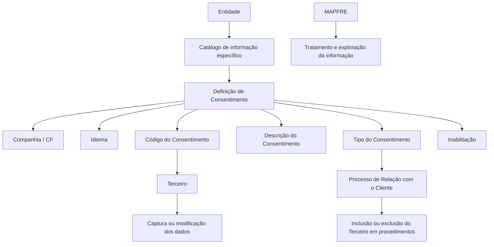
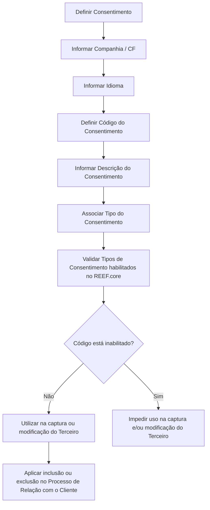

# Definição dos Consentimentos dos Segurados no REEF.core

## 1. Metadados do Documento
- **Arquivo de Origem:** Não identificado
- **Tipo de Documento:** Especificação Técnica / Funcional
- **Domínio / Sistema:** REEF.core; gestão de Consentimentos de Terceiros; MAPFRE
- **Público-Alvo:** Negócio, analistas funcionais, desenvolvedores e operação
- **Data/Versão Identificada:** Não identificada

---

## 2. Resumo Executivo & Contexto de Negócio

O documento define o conceito e as propriedades funcionais dos consentimentos associados a Terceiros no sistema REEF.core. Consentimento é caracterizado como uma manifestação de vontade livre, inequívoca, específica e informada pela qual o interessado aceita, por declaração ou ação afirmativa clara, o tratamento de dados pessoais que lhe dizem respeito.

Funcionalmente, o REEF.core permite identificar e definir diferentes Consentimentos em um catálogo de informação específico. Esse catálogo é entregue às entidades sem conteúdo predefinido, permitindo que cada entidade registre os Consentimentos aplicáveis ao seu contexto.

Os Consentimentos podem ser associados aos Terceiros durante a captura ou a modificação dos dados cadastrais. A definição inclui propriedades gerais, operativas e outras propriedades que controlam identificação, idioma, descrição, tipo e disponibilidade operacional de cada Código de Consentimento.

A entidade MAPFRE poderá tratar e explorar as informações de Consentimento conforme necessidades específicas. O documento também estabelece que os valores dos Tipos de Consentimento habilitados e configurados no REEF.core devem ser obrigatoriamente respeitados.

---

## 3. Arquitetura, Componentes & Tecnologias Envolvidas

Os componentes e conceitos explicitamente citados são:

- **REEF.core:** sistema que disponibiliza o catálogo e a definição de Consentimentos.
- **Catálogo de informação específico:** estrutura destinada à definição dos Consentimentos aplicáveis às entidades.
- **Entidades:** destinatárias do catálogo inicialmente sem conteúdo.
- **Terceiro:** pessoa ou registro cuja informação pode receber associação de Consentimentos.
- **Código do Consentimento:** chave de identificação da definição de Consentimento.
- **Tipo do Consentimento:** atributo associado ao Código do Consentimento e indiretamente ao Terceiro.
- **Processo de Relação com o Cliente:** processo no qual o Tipo do Consentimento permite incluir ou excluir o Terceiro de determinados procedimentos.
- **MAPFRE:** entidade mencionada como capaz de tratar e explorar a informação segundo necessidades específicas.
- **Home Solutions APIs Documentation Zeus:** referência apresentada no conteúdo bruto, sem detalhamento sobre função, integração ou interface.



> **Nota de Análise:** O documento não detalha métodos HTTP, contratos JSON, persistência, integrações técnicas, tecnologias de implementação, URLs, ambientes ou interfaces associadas ao REEF.core ou à referência “Home Solutions APIs Documentation Zeus”.

---

## 4. Regras de Negócio, Especificações Funcionais & Processos

### Definição de Consentimento

1. O Consentimento corresponde a uma manifestação de vontade que deve ser:
   - Livre;
   - Inequívoca;
   - Específica;
   - Informada.
2. O interessado aceita o tratamento de dados pessoais por meio de:
   - Declaração; ou
   - Ação afirmativa clara.
3. O REEF.core permite identificar e definir os Consentimentos em um catálogo de informação específico.
4. O catálogo é entregue às entidades sem conteúdo predefinido.
5. Os Consentimentos podem ser associados aos Terceiros:
   - Na captura dos dados do Terceiro;
   - Na modificação dos dados do Terceiro.
6. Um mesmo Código do Consentimento pode determinar diferentes Tipos de Consentimento.
7. O Tipo do Consentimento está associado ao Código do Consentimento e, indiretamente, ao Terceiro.
8. No Processo de Relação com o Cliente, o Tipo do Consentimento define em quais procedimentos o Terceiro poderá ser incluído ou excluído, em conformidade com seu mandato.
9. A Inabilitação impede que a definição do Código do Consentimento seja utilizada em operações de captura e/ou modificação do Terceiro.
10. É obrigatório respeitar os valores dos Tipos de Consentimento habilitados e configurados no REEF.core.

### Fluxo funcional identificado



---

## 5. Tabelas de Parâmetros, Ambientes e Estruturas de Dados

| Item / Parâmetro | Descrição / Função | Tipo / Valores / Formato | Ambiente / Observações |
| :--- | :--- | :--- | :--- |
| Consentimento | Manifestação de vontade para aceitação do tratamento de dados pessoais. | Livre, inequívoca, específica e informada; declaração ou ação afirmativa clara. | Associável ao Terceiro. |
| Companhia / CF | Indica o código da companhia sobre a qual é realizada a definição do Consentimento do Terceiro. | Código da companhia. | Propriedade geral. O significado de “CF” não é definido no documento. |
| Idioma | Indica o idioma usado na definição do Código do Consentimento. | Exemplos citados: espanhol, inglês. | Propriedade geral. |
| Código do Consentimento | Chave do Consentimento definida no sistema. | Código ou chave de identificação. | Um mesmo código pode possuir distintos Tipos de Consentimento. |
| Descrição do Consentimento | Denominação ou nome do Consentimento definido. | Texto descritivo. | Propriedade geral. |
| Tipo do Consentimento | Atributo associado ao Código do Consentimento e indiretamente ao Terceiro. | Valores habilitados e configurados no REEF.core. | Controla inclusão ou exclusão do Terceiro em procedimentos do Processo de Relação com o Cliente. |
| Inabilitação | Indica que a definição do Código do Consentimento não pode ser utilizada. | Estado de inabilitação. | Bloqueia uso em captura e/ou modificação do Terceiro. |
| Catálogo de informação específico | Catálogo usado para identificar e definir Consentimentos. | Estrutura de catálogo. | Entregue às entidades sem conteúdo predefinido. |
| Terceiro | Entidade cuja informação pode receber associação de Consentimentos. | Não especificado. | Participa de captura e modificação de dados. |
| MAPFRE | Entidade mencionada para tratamento e exploração das informações. | Não especificado. | Pode explorar a informação conforme necessidades específicas. |
| Home Solutions APIs Documentation Zeus | Referência textual apresentada no documento. | Não especificado. | Não há explicação sobre seu papel, arquitetura ou integração. |

---

## 6. Bateria de Perguntas & Respostas para RAG (FAQ Sintético)

### P1: O que é considerado Consentimento no contexto do REEF.core?
**R:** Consentimento é toda manifestação de vontade livre, inequívoca, específica e informada pela qual o interessado aceita o tratamento dos seus dados pessoais. Essa aceitação pode ocorrer por declaração ou por uma ação afirmativa clara.

### P2: Qual é a finalidade do catálogo de Consentimentos no REEF.core?
**R:** O REEF.core disponibiliza um catálogo de informação específico para identificar e definir os diferentes Consentimentos que podem ser associados aos Terceiros. O catálogo é entregue às entidades sem conteúdo predefinido.

### P3: Em quais operações um Consentimento pode ser associado a um Terceiro?
**R:** Um Consentimento pode ser associado a um Terceiro durante a captura dos dados ou durante a modificação dos dados desse Terceiro.

### P4: Qual informação é representada pela propriedade Companhia / CF?
**R:** A propriedade Companhia / CF indica o código da companhia sobre a qual está sendo realizada a definição do Consentimento do Terceiro. O documento não define o significado da sigla “CF”.

### P5: Para que serve a propriedade Idioma na definição de um Consentimento?
**R:** A propriedade Idioma informa o idioma utilizado na definição do Código do Consentimento. O documento apresenta espanhol e inglês como exemplos de idiomas.

### P6: Um Código do Consentimento pode possuir mais de um Tipo do Consentimento?
**R:** Sim. O Código do Consentimento é a chave do Consentimento definida no sistema e pode determinar distintos Tipos de Consentimento sob um mesmo código.

### P7: Qual é o papel do Tipo do Consentimento no Processo de Relação com o Cliente?
**R:** O Tipo do Consentimento está associado ao Código do Consentimento e indiretamente ao Terceiro. No Processo de Relação com o Cliente, esse atributo determina em quais procedimentos o Terceiro poderá ser incluído ou excluído, em conformidade com seu mandato.

### P8: O que acontece quando um Código do Consentimento está inabilitado?
**R:** Quando a definição do Código do Consentimento está inabilitada, ela não pode ser utilizada nas operações de captura e/ou modificação dos dados do Terceiro.

### P9: Existe uma regra obrigatória sobre os Tipos de Consentimento?
**R:** Sim. É obrigatório respeitar os valores dos Tipos de Consentimento que estejam habilitados e configurados no REEF.core.

### P10: O documento descreve APIs, métodos HTTP ou contratos JSON para Consentimentos?
**R:** Não. Embora o conteúdo mencione “Home Solutions APIs Documentation Zeus”, o documento não detalha APIs, métodos HTTP, contratos JSON, endpoints, autenticação, versões ou integrações técnicas.

### P11: Qual é o uso esperado das informações de Consentimento pela MAPFRE?
**R:** O documento informa que a entidade MAPFRE estará em condição de tratar e explorar adequadamente as informações de Consentimento segundo suas necessidades específicas, sem detalhar processos, regras de exploração ou mecanismos técnicos.

---

## 7. Glossário de Termos, Siglas & Conceitos-Chave

- **CF:** Sigla apresentada junto da propriedade Companhia (“Companhia / CF”). O significado não é definido no documento.
- **Código do Consentimento:** Chave que identifica o Consentimento definido no sistema.
- **Consentimento:** Manifestação de vontade livre, inequívoca, específica e informada para aceitação do tratamento de dados pessoais.
- **Entidade:** Destinatária do catálogo de informação específico disponibilizado sem conteúdo predefinido.
- **Inabilitação:** Estado que impede o uso da definição do Código do Consentimento nas operações de captura e/ou modificação do Terceiro.
- **MAPFRE:** Entidade citada como apta a tratar e explorar a informação segundo necessidades específicas.
- **Processo de Relação com o Cliente:** Processo em que o Tipo do Consentimento pode permitir a inclusão ou exclusão de um Terceiro em procedimentos.
- **REEF.core:** Sistema que permite identificar e definir Consentimentos em um catálogo específico.
- **Terceiro:** Registro ou interessado ao qual os Consentimentos podem ser associados.
- **Tipo do Consentimento:** Atributo associado ao Código do Consentimento que influencia a inclusão ou exclusão do Terceiro em procedimentos.

---

## 8. Notas Críticas, Riscos & Limitações

- O documento não identifica arquivo de origem, autor, data, versão, ambiente ou responsável pela definição.
- Não há detalhamento de APIs, contratos de integração, persistência, modelos de dados, endpoints, controles de acesso, auditoria ou trilha de alterações.
- A sigla **CF** é apresentada, mas não é expandida ou explicada.
- O documento menciona “Home Solutions APIs Documentation Zeus”, porém não descreve sua relação com o REEF.core ou com a gestão de Consentimentos.
- Não são informados os valores concretos dos Tipos de Consentimento habilitados no REEF.core.
- Não há regras detalhadas para criação, alteração, exclusão, reabilitação ou governança de Códigos de Consentimento.
- O respeito aos Tipos de Consentimento habilitados é obrigatório; configurações incorretas ou uso de tipos não habilitados representam risco operacional e funcional.
- A Inabilitação deve ser considerada na captura e modificação de Terceiros, pois impede o uso do respectivo Código do Consentimento.

---

## 9. Conteúdo Bruto Estruturado (Referência Fiel)

```text
--- [PÁGINA 1 DE 3] ---

DEFINICIÓN de los Consentimientos de los
Asegurados

Contexto

Se entiende por consentimiento «toda manifestación de voluntad, libre, inequívoca, específica e
informada, mediante la que el interesado acepta, ya sea mediante una declaración o una clara acción
afirmativa, el tratamiento de datos personales que le conciernen».

Objetivo

Funcionalmente Reef.core cuenta con la posibilidad de identificar y definir en un catálogo de
información específico que se entrega a las entidades vacío de contenido, los diferentes
Consentimientos que se pueden asociar a los Terceros en la captura o en la modificación de sus
datos.

... De esta manera la entidad MAPFRE estará en disposición de tratar y explotar adecuadamente
esta información de acuerdo a sus necesidades específicas.

Propiedades Generales
Propiedades Operativas
Otras Propiedades

Propiedades Generales

Compañía
 /
 CF

Home Solutions APIs Documentation Zeus
EN


--- [PÁGINA 2 DE 3] ---

Esta propiedad le indica al sistema el código de la compañía sobre la que se está realizando la
definición del Consentimiento del Tercero.

Idioma

Esta propiedad le indica al sistema el Idioma empleado en la definición del Código del
Consentimiento como por ejemplo: español, inglés,...

Código del Consentimiento

Esta propiedad indicará la clave del Consentimiento que se está definiendo en el Sistema pudiendo
determinar bajo un mismo código de consentimiento distintos Tipos de Consentimiento.

Descripción del Consentimiento

Esta propiedad le indica al sistema la denominación o nombre del Consentimiento que se está
definiendo.

Propiedades Operativas

Tipo del Consentimiento

Este Atributo que está asociado al Código del Consentimiento e indirectamente al Tercero como parte
de su información, indica en el Proceso de Relación con el Cliente sobre qué procedimiento/s se
podrá incluir o excluir al Tercero cumpliendo así con su mandato.

Otras Propiedades

Inhabilitación

Esta propiedad le indica al Sistema que la definición del Código del Consentimiento está inhabilitada
para poder ser utilizada en las operaciones de captura y/o modificación del Tercero.

Vínculos

Relación de Directrices y Documentos funcionales cuya lectura recomendada para evitar que la
interpretación aislada del presente documento pueda conducir a error.

Actividades de Terceros
Preguntas frecuentes
Ejemplo:


--- [PÁGINA 3 DE 3] ---

(1) ¿Existe alguna recomendación operativa que deba ser tomada en consideración localmente en la
codificación, uso y definición de los Códigos de Consentimiento de los Terceros en el Sistema?

Es obligatorio respetar los valores de los Tipos de Consentimientos habilitados y conformados en
Reef.core.
```
