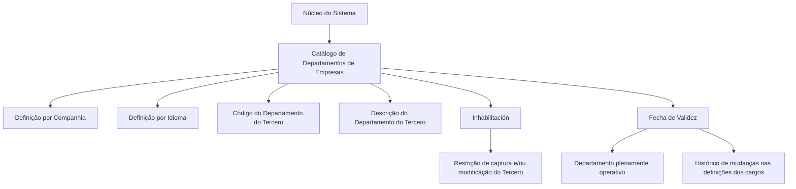

# Definição de Departamentos de Empresas — Catálogo de Departamentos de Terceiros Jurídicos

## 1. Metadados do Documento
- **Arquivo de Origem:** Não identificado no conteúdo fornecido
- **Tipo de Documento:** Especificação Técnica / Documento Funcional
- **Domínio / Sistema:** Sistema corporativo de cadastro de Terceiros Jurídicos; catálogo de Departamentos de Empresas
- **Público-Alvo:** Analistas funcionais, desenvolvedores, operação e equipes responsáveis por cadastros corporativos
- **Data/Versão Identificada:** Não identificada

---

## 2. Resumo Executivo & Contexto de Negócio

O documento descreve a definição funcional de **Departamentos de Empresas** no núcleo do Sistema. O Sistema disponibiliza um catálogo específico para identificar e codificar os diferentes departamentos vinculados às empresas. Esse catálogo é entregue inicialmente sem conteúdo, exigindo que os departamentos sejam definidos no contexto de cada instalação.

A definição de um Departamento de Empresa considera a companhia à qual o cadastro pertence, o idioma utilizado para a definição, o código do departamento do terceiro e a descrição associada ao código. A descrição deve ser compatível com o idioma selecionado, permitindo que a denominação do departamento seja mantida de acordo com a língua de definição.

O catálogo inclui mecanismos de controle operacional. A propriedade de inabilitação determina que um Departamento de Empresa não pode ser utilizado em operações de captura e/ou modificação de Terceiros. A propriedade de data de validade determina a data a partir da qual o departamento está plenamente operativo no Sistema.

A data de validade também permite manter histórico de mudanças nas definições dos cargos, conforme descrito pelo documento. O material recomenda a leitura do documento funcional **Actividades de Terceros**, pois a interpretação isolada da definição de Departamentos de Empresas pode conduzir a erro.

O documento não estabelece uma codificação corporativa padronizada para Departamentos de Terceiros Jurídicos. A seção de perguntas frequentes afirma explicitamente que não existe preferência ou recomendação corporativa para estabelecer ou padronizar essa codificação no Sistema.

---

## 3. Arquitetura, Componentes & Tecnologias Envolvidas

O conteúdo fornecido não descreve arquitetura de software, integrações, microsserviços, tecnologias, APIs, URLs, ambientes, servidores ou contratos de dados. O único componente funcional explicitamente identificado é o catálogo de Departamentos de Empresas no núcleo do Sistema.

| Componente / Conceito | Função descrita | Tecnologias / Interfaces |
| :--- | :--- | :--- |
| Núcleo do Sistema | Permite identificar e codificar diferentes Departamentos de Empresas. | Não detalhadas |
| Catálogo de informação de Departamentos | Armazena a definição específica dos departamentos de empresas. É entregue inicialmente vazio. | Não detalhadas |
| Cadastro de Terceiros Jurídicos | Contexto operacional em que os Departamentos de Empresas podem ser utilizados em captura e modificação. | Não detalhadas |
| Documento funcional “Actividades de Terceros” | Documento relacionado cuja leitura é recomendada para evitar interpretação isolada incorreta. | Não detalhadas |



> **Nota de Análise:** O documento não detalha interfaces de usuário, métodos HTTP, contratos JSON, persistência de dados, mecanismos de autenticação, permissões ou integrações técnicas.

---

## 4. Regras de Negócio, Especificações Funcionais & Processos

### 4.1 Disponibilização do catálogo

1. O núcleo do Sistema possui a capacidade de identificar e codificar os diferentes Departamentos de Empresas.
2. A identificação e a codificação são realizadas em um catálogo de informação específico.
3. O catálogo de informação é entregue inicialmente às instalações sem conteúdo.

### 4.2 Definição de um Departamento de Empresa

A definição de um Departamento de Empresa utiliza as seguintes propriedades funcionais:

1. **Compañía:** informa ao Sistema o código da companhia para a qual está sendo realizada a definição do Departamento da Empresa.
2. **Idioma:** informa o idioma empregado na definição do Departamento no catálogo, com exemplos de espanhol e inglês.
3. **Código del Departamento del Tercero:** informa o código do Departamento do Terceiro.
4. **Descripción del Departamento del Tercero:** informa a denominação ou a descrição do Departamento do Terceiro, de acordo com o idioma utilizado na definição.

### 4.3 Regra de descrição por idioma

A descrição do Departamento do Terceiro deve ser definida conforme o idioma escolhido para o cadastro no catálogo. O documento apresenta exemplos de departamentos quando o idioma utilizado é espanhol:

- `MKT` — Departamento de Marketing
- `COM` — Departamento Comercial
- `ADM` — Departamento de Administración
- `RRHH` — Departamento de Capital Humano

### 4.4 Regra de inabilitação

A propriedade **Inhabilitación** informa ao Sistema que o Departamento da Empresa está inabilitado para uso nas operações de:

- captura do Terceiro;
- modificação do Terceiro.

O documento não detalha condições adicionais para inabilitação, processo de aprovação, perfil autorizado, efeito sobre registros históricos ou possibilidade de reabilitação.

### 4.5 Regra de data de validade

A propriedade **Fecha de Validez** informa ao Sistema a data a partir da qual o Departamento do Terceiro está plenamente operativo.

O uso correto da data de validade permite manter um histórico dos cambios efetuados nas definições dos cargos. O documento não define formato da data, regras de retroatividade, tratamento de datas futuras ou comportamento para data ausente.

### 4.6 Regra de codificação corporativa

Não existe, corporativamente, preferência ou recomendação para estabelecer ou padronizar a codificação utilizada no Sistema para Departamentos de Terceiros Jurídicos.

### 4.7 Dependência documental

A leitura de **Actividades de Terceros** é recomendada. A finalidade declarada é evitar que a interpretação isolada do documento de definição de Departamentos de Empresas conduza a erro.

---

## 5. Tabelas de Parâmetros, Ambientes e Estruturas de Dados

| Item / Parâmetro | Descrição / Função | Tipo / Valores / Formato | Ambiente / Observações |
| :--- | :--- | :--- | :--- |
| Catálogo de Departamentos de Empresas | Catálogo específico para identificar e codificar os diferentes Departamentos de Empresas. | Catálogo de informação | Entregue inicialmente vazio às instalações. |
| Compañía | Indica o código da companhia sobre a qual está sendo realizada a definição do Departamento da Empresa. | Código de companhia | Formato não detalhado. |
| Idioma | Indica o idioma empregado na definição do Departamento no catálogo. | Idioma; exemplos: español, inglés | A descrição do departamento deve respeitar o idioma definido. |
| Código del Departamento del Tercero | Indica o código do Departamento do Terceiro no Sistema. | Código | Não há padronização corporativa recomendada. |
| Descripción del Departamento del Tercero | Indica a denominação ou descrição do Departamento do Terceiro. | Texto descritivo | Deve corresponder ao idioma utilizado na definição. |
| Inhabilitación | Indica que o Departamento da Empresa está inabilitado. | Estado de inabilitação; valores não detalhados | Impede uso nas operações de captura e/ou modificação do Terceiro. |
| Fecha de Validez | Indica a data a partir da qual o Departamento do Terceiro está plenamente operativo. | Data; formato não detalhado | Permite manter histórico de alterações nas definições dos cargos. |
| MKT | Código exemplificativo de departamento. | Código | Descrição em espanhol: Departamento de Marketing. |
| COM | Código exemplificativo de departamento. | Código | Descrição em espanhol: Departamento Comercial. |
| ADM | Código exemplificativo de departamento. | Código | Descrição em espanhol: Departamento de Administración. |
| RRHH | Código exemplificativo de departamento. | Código | Descrição em espanhol: Departamento de Capital Humano. |
| Actividades de Terceros | Documento funcional relacionado. | Referência documental | Leitura recomendada para evitar interpretação isolada incorreta. |

---

## 6. Bateria de Perguntas & Respostas para RAG (FAQ Sintético)

### P1: Qual é a finalidade do catálogo de Departamentos de Empresas?
**R:** O catálogo de Departamentos de Empresas permite ao núcleo do Sistema identificar e codificar os diferentes departamentos das empresas. O catálogo é específico para esse propósito e é entregue inicialmente às instalações sem conteúdo.

### P2: Quais propriedades são utilizadas para definir um Departamento de Empresa?
**R:** O documento identifica as propriedades Compañía, Idioma, Código del Departamento del Tercero, Descripción del Departamento del Tercero, Inhabilitación e Fecha de Validez.

### P3: O que representa a propriedade Compañía na definição de um departamento?
**R:** A propriedade Compañía informa ao Sistema o código da companhia sobre a qual está sendo realizada a definição do Departamento da Empresa.

### P4: Como o campo Idioma influencia a descrição de um Departamento do Terceiro?
**R:** O campo Idioma indica a língua utilizada na definição do Departamento no catálogo. A Descripción del Departamento del Tercero deve corresponder ao idioma utilizado nessa definição, como espanhol ou inglês.

### P5: Qual é a diferença entre Código del Departamento del Tercero e Descripción del Departamento del Tercero?
**R:** O Código del Departamento del Tercero identifica o departamento por meio de um código. A Descripción del Departamento del Tercero registra sua denominação ou descrição de acordo com o idioma usado na definição.

### P6: O que acontece quando um Departamento de Empresa está marcado com Inhabilitación?
**R:** Quando um Departamento de Empresa está inabilitado, ele não pode ser utilizado nas operações de captura e/ou modificação do Terceiro.

### P7: Qual é a função da Fecha de Validez de um Departamento do Terceiro?
**R:** A Fecha de Validez informa ao Sistema a data a partir da qual o Departamento do Terceiro está plenamente operativo. O uso correto dessa propriedade permite manter histórico dos cambios efetuados nas definições dos cargos.

### P8: Existe uma convenção corporativa obrigatória para os códigos de Departamentos de Terceiros Jurídicos?
**R:** Não. O documento declara que não existe corporativamente uma preferência ou recomendação para estabelecer ou padronizar a codificação dos Departamentos de Terceiros Jurídicos no Sistema.

### P9: Quais exemplos de códigos de departamentos são apresentados para definições em espanhol?
**R:** O documento apresenta `MKT` para Departamento de Marketing, `COM` para Departamento Comercial, `ADM` para Departamento de Administración e `RRHH` para Departamento de Capital Humano.

### P10: O catálogo de Departamentos de Empresas já vem preenchido na instalação inicial?
**R:** Não. O documento informa que o catálogo específico de Departamentos de Empresas é entregue inicialmente às instalações vazio de conteúdo.

### P11: Qual documento funcional deve ser consultado em conjunto com a definição de Departamentos de Empresas?
**R:** O documento recomenda a leitura de **Actividades de Terceros**, pois a interpretação isolada do documento de Departamentos de Empresas pode conduzir a erro.

### P12: O documento define o formato técnico do código de departamento ou da data de validade?
**R:** Não. O documento menciona o Código del Departamento del Tercero e a Fecha de Validez, mas não especifica tamanho, padrão alfanumérico, formato de data, validações técnicas ou regras de preenchimento obrigatório.

---

## 7. Glossário de Termos, Siglas & Conceitos-Chave

- **ADM:** Código exemplificativo associado a “Departamento de Administración”.
- **Actividades de Terceros:** Documento funcional relacionado cuja leitura é recomendada.
- **Catálogo:** Repositório específico de informação utilizado para definir Departamentos de Empresas.
- **Código del Departamento del Tercero:** Código que identifica o Departamento do Terceiro no Sistema.
- **COM:** Código exemplificativo associado a “Departamento Comercial”.
- **Compañía:** Propriedade que indica o código da companhia à qual a definição do departamento se refere.
- **Departamento de Empresa:** Departamento identificado e codificado no catálogo específico do Sistema.
- **Departamento del Tercero:** Departamento associado ao Terceiro, definido por código, descrição, idioma e demais propriedades descritas.
- **Descripción del Departamento del Tercero:** Denominação ou descrição do Departamento do Terceiro conforme o idioma de definição.
- **Fecha de Validez:** Data a partir da qual o Departamento do Terceiro está plenamente operativo no Sistema.
- **Idioma:** Língua utilizada na definição do Departamento no catálogo.
- **Inhabilitación:** Propriedade que torna o Departamento da Empresa indisponível para captura e/ou modificação do Terceiro.
- **MKT:** Código exemplificativo associado a “Departamento de Marketing”.
- **RRHH:** Código exemplificativo associado a “Departamento de Capital Humano”.
- **Tercero / Terceiro:** Entidade cujo cadastro pode ser capturado ou modificado utilizando Departamentos de Empresas, conforme o documento.

---

## 8. Notas Críticas, Riscos & Limitações

- O catálogo de Departamentos de Empresas é entregue inicialmente vazio; o documento não define responsabilidade, processo, aprovação ou carga inicial para seu preenchimento.
- Não existe recomendação corporativa para padronização da codificação dos Departamentos de Terceiros Jurídicos. Essa ausência pode resultar em codificações distintas entre instalações.
- A propriedade Inhabilitación bloqueia o uso do departamento em captura e/ou modificação do Terceiro, mas o documento não detalha regras para registros existentes, reativação ou histórico de inabilitação.
- A Fecha de Validez permite manter histórico de mudanças nas definições dos cargos, porém não há detalhamento sobre formato de data, obrigatoriedade, datas futuras, datas retroativas ou critérios de sobreposição.
- O documento não apresenta detalhes técnicos de implementação, integrações, APIs, permissões, ambientes, logs, bases de dados ou contratos de dados.
- A leitura de **Actividades de Terceros** é explicitamente recomendada; interpretar este documento de forma isolada pode conduzir a erro.
- **Nota de Análise:** O conteúdo fornecido contém as marcas “CF”, “Home Solutions APIs Documentation Zeus” e “EN”, mas não explica seu significado ou vínculo funcional com o catálogo de Departamentos de Empresas.

---

## 9. Conteúdo Bruto Estruturado (Referência Fiel)

```text
--- [PÁGINA 1 DE 2] ---

DEFINICIÓN de Departamentos de Empresas
Propiedades Generales
Funcionalmente, el núcleo del Sistema cuenta con la posibilidad de identificar y codificar los
diferentes Departamentos de las Empresas en un catálogo de información específico que se entrega
inicialmente a las instalaciones vacío de contenido.
Compañía
Esta propiedad le indica al sistema el código de la compañía sobre la que se está realizando la
definición del Departamento de la Empresa.
Idioma
Esta propiedad le indica al sistema el Idioma empleado en la definición del Departamento en el
Catálogo, como por ejemplo: español, inglés,...
Código del Departamento del Tercero
Esta propiedad indicará en el sistema el código del Departamento del Tercero.
Descripción del Departamento del Tercero
Esta propiedad le indica al sistema cual es la denominación o descripción del Departamento del
Tercero, de acuerdo con el idioma utilizado en la definición.
A modo de ejemplo y si el Idioma utilizado en la definición es el español:
 /
 CF
Home Solutions APIs Documentation Zeus
EN


--- [PÁGINA 2 DE 2] ---

Código Departamento Descripción
MKT Departamento de Marketing
COM Departamento Comercial
ADM Departamento de Administración
RRHH Departamento de Capital Humano
... ...
Otras Propiedades
Inhabilitación
Esta propiedad le indica al Sistema que el Departamento de la Empresa está inhabilitado para poder
ser utilizada en las operaciones de captura y/o modificación del Tercero.
Fecha de Validez
Esta propiedad le indica al Sistema la fecha a partir de la cual el Departamento del Tercero está
plenamente operativo en el sistema por lo que su correcto uso permite tener un histórico de los
cambios efectuados en las definiciones de los cargos.
Vínculos
Relación de Directrices y Documentos funcionales cuya lectura recomendada para evitar que la
interpretación aislada del presente documento pueda conducir a error.
Actividades de Terceros
Preguntas frecuentes
(1) ¿Existe alguna recomendación operativa que deba ser tomada en consideración localmente en la
codificación, uso y definición de los Departamentos de los Terceros Jurídicos en el Sistema?
No existe Corporativamente una preferencia o recomendación para establecer o estandarizar en el
sistema su codificación.
```
