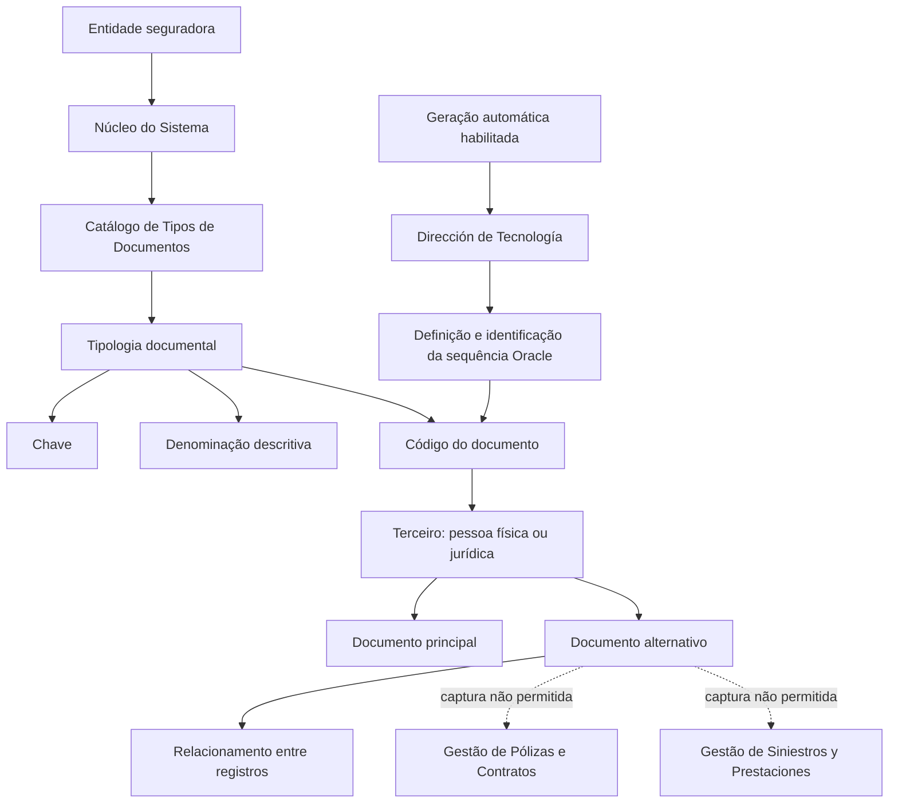

# Definição de Tipos de Documentos Identificadores de Terceiros

## 1. Metadados do Documento
- **Arquivo de Origem:** Não identificado
- **Tipo de Documento:** Especificação Técnica
- **Domínio / Sistema:** Identificação e codificação de terceiros em entidade seguradora
- **Público-Alvo:** Não identificado
- **Data/Versão Identificada:** Não identificada

---

## 2. Resumo Executivo & Contexto de Negócio

O documento define o uso de tipos de documentos identificadores para pessoas físicas e jurídicas que interagem com uma entidade seguradora. Cada terceiro pode ser identificado por um tipo de documento e por um código associado.

O núcleo do sistema disponibiliza um catálogo específico, inicialmente vazio, para registrar e codificar as tipologias de documentos identificadores de terceiros. A definição é realizada no nível da companhia, por meio de uma chave e uma denominação ou texto descritivo para cada tipo documental.

A especificação estabelece propriedades operacionais para controlar a aplicabilidade de cada tipo de documento a pessoas físicas, pessoas jurídicas ou ambas. Também define se uma tipologia representa um documento real, se pode funcionar como documento alternativo e se o código associado deve ser gerado automaticamente.

Documentos alternativos permitem relacionar diferentes identificadores do mesmo terceiro. Contudo, a captura desses documentos alternativos é proibida nos processos de Gestão de Pólizas e Contratos e de Gestão de Siniestros y Prestaciones.

Não existe recomendação ou preferência corporativa para padronizar a codificação dos tipos de documentos identificadores no sistema. Quando houver geração automática de código documental, a Dirección de Tecnología deve definir e identificar a sequência Oracle utilizada.

---

## 3. Arquitetura, Componentes & Tecnologias Envolvidas

| Componente / Conceito | Papel descrito no documento |
| :--- | :--- |
| Núcleo do Sistema | Mantém um catálogo específico para identificar e codificar tipos de documentos de terceiros. |
| Catálogo de Tipos de Documentos | Catálogo entregue às entidades sem conteúdo inicial; registra chave e denominação descritiva de cada tipo documental. |
| Terceiro | Pessoa física ou jurídica identificada por tipo de documento e código associado. |
| Documento principal | Identificador mais adequado para o terceiro no exemplo apresentado, como o NIF de Juan Pérez Pérez. |
| Documento alternativo | Identificador adicional relacionado ao documento principal do mesmo terceiro. |
| Gestão de Pólizas e Contratos | Processo no qual a captura de documentos alternativos não é permitida. |
| Gestão de Siniestros y Prestaciones | Processo no qual a captura de documentos alternativos não é permitida. |
| Dirección de Tecnología | Área responsável por definir e identificar a sequência Oracle quando a geração automática estiver habilitada. |
| Oracle | Tecnologia citada exclusivamente no contexto da sequência usada para geração automática de códigos documentais. |



**Nota de Análise:** O documento cita o núcleo do sistema, processos de negócio e Oracle, mas não detalha interfaces, métodos HTTP, contratos JSON, banco de dados, versão de Oracle, nomes de sequências ou topologia de implantação.

---

## 4. Regras de Negócio, Especificações Funcionais & Processos

### 4.1 Identificação de terceiros

1. Os processos da atividade de uma entidade seguradora exigem a identificação inequívoca de pessoas físicas e/ou jurídicas que interagem com a entidade.
2. A identificação de cada terceiro pode ser realizada por meio de:
   - Um tipo de documento identificador.
   - Um código associado ao tipo de documento.
3. As tipologias documentais são definidas no nível da companhia.
4. Cada tipologia documental pode ser definida individualmente por uma chave e por uma denominação ou texto descritivo.
5. O catálogo de tipos de documentos é fornecido às entidades sem conteúdo inicial.

### 4.2 Uso em pessoas físicas e jurídicas

1. O atributo **Uso en Personas Físicas** indica se uma tipologia documental é usada:
   - Para pessoas físicas.
   - Para pessoas jurídicas.
   - Indistintamente para pessoas físicas e jurídicas.
2. Quando a tipologia documental puder ser usada indistintamente para pessoas físicas e jurídicas, o atributo deve permanecer sem valor ou vazio.

### 4.3 Documento real

1. O atributo **Real** indica se a tipologia do documento identificador é ou não um tipo de documento real.
2. O documento não apresenta valores permitidos, regras adicionais de validação ou critérios para classificar um documento como real.

### 4.4 Documento alternativo

1. O atributo **Documento Alternativo** informa se uma tipologia documental é usada para identificar o terceiro de forma alternativa.
2. Documentos alternativos podem coexistir com um documento principal para o mesmo terceiro.
3. No exemplo fornecido, o terceiro Juan Pérez Pérez possui:
   - NIF com código `50818773A`.
   - NUU — NUUMA com código `JUANPE`.
   - TEC — TeCuidamos com código `57732-05-2022`.
4. O documento considera mais adequado identificar Juan Pérez Pérez pelo tipo documental `NIF` e pelo código `50818773A`.
5. Os documentos `NUU` e `TEC` podem identificar alternativamente a mesma pessoa física quando definidos como documentos alternativos.
6. O relacionamento entre os três registros permite conhecer o NIF de Juan Pérez Pérez a partir da chave do Número único de MAPFRE ou da chave de TeCuidamos.
7. A captura de documentos alternativos não é permitida e não deve ser permitida nos processos:
   - Gestão de Pólizas e Contratos.
   - Gestão de Siniestros y Prestaciones.

### 4.5 Geração automática de código documental

1. A propriedade **Generación Automática** indica se o código associado à tipologia documental será gerado automaticamente durante o processo de captura de informação do terceiro.
2. Caso a geração automática seja definida, a Dirección de Tecnología deve:
   - Definir a sequência Oracle a ser utilizada.
   - Identificar o nome da sequência Oracle a ser utilizada.
3. O documento não especifica o algoritmo de geração, o formato do código, a sequência Oracle concreta nem o processo de manutenção da sequência.

### 4.6 Codificação corporativa

1. Não existe preferência ou recomendação corporativa para estabelecer ou padronizar a codificação dos tipos de documentos identificadores no sistema.
2. A definição da codificação documental é, portanto, apresentada sem um padrão corporativo obrigatório no conteúdo fornecido.

---

## 5. Tabelas de Parâmetros, Ambientes e Estruturas de Dados

### 5.1 Exemplos de tipos de documentos identificadores

| Item / Parâmetro | Descrição / Função | Tipo / Valores / Formato | Ambiente / Observações |
| :--- | :--- | :--- | :--- |
| NIF - España | Número de Identificação Fiscal | Tipo de documento identificador | Espanha |
| DNI - España | Documento Nacional de Identidade | Tipo de documento identificador | Espanha |
| RFC - México | Registro Federal de Contribuyentes | Tipo de documento identificador | México |
| RUT - Chile | Rol Único Tributario | Tipo de documento identificador | Chile |
| RUT - Colombia | Registro único Tributario | Tipo de documento identificador | Colômbia |
| TIN - Malta | Tax Identification Number | Tipo de documento identificador | Malta |

### 5.2 Propriedades operativas de uma tipologia documental

| Item / Parâmetro | Descrição / Função | Tipo / Valores / Formato | Ambiente / Observações |
| :--- | :--- | :--- | :--- |
| Tipo e nome do documento | Define a tipologia documental por chave e denominação ou texto descritivo. | Chave e texto descritivo | Definição realizada no nível da companhia. |
| Uso en Personas Físicas | Indica se o tipo de documento é aplicável a pessoas físicas, jurídicas ou ambas. | Pessoa física; pessoa jurídica; vazio | Deve ficar vazio quando o uso for indistinto para pessoas físicas e jurídicas. |
| Real | Indica se a tipologia representa um documento real. | Não detalhado | O documento não define valores ou critérios adicionais. |
| Documento Alternativo | Indica se a tipologia é usada para identificação alternativa do terceiro. | Não detalhado | Captura proibida em Gestão de Pólizas e Contratos e Gestão de Siniestros y Prestaciones. |
| Generación Automática | Indica se o código documental é gerado automaticamente na captura de informação do terceiro. | Habilitado ou não habilitado, sem valores literais especificados | Requer definição e identificação da sequência Oracle pela Dirección de Tecnología quando habilitada. |
| Sequência Oracle | Sequência usada para gerar automaticamente o código associado à tipologia. | Nome da sequência Oracle | Nome não informado; responsabilidade atribuída à Dirección de Tecnología. |

### 5.3 Exemplo de documentos associados a Juan Pérez Pérez

| Item / Parâmetro | Descrição / Função | Tipo / Valores / Formato | Ambiente / Observações |
| :--- | :--- | :--- | :--- |
| NIF - Nro. Id. Fiscal | Documento considerado mais adequado para identificar Juan Pérez Pérez. | `50818773A` | Documento principal no exemplo. |
| NUU - NUUMA | Documento alternativo de Juan Pérez Pérez. | `JUANPE` | Relacionado ao NIF e ao documento TEC. |
| TEC - TeCuidamos | Documento alternativo de Juan Pérez Pérez. | `57732-05-2022` | Relacionado ao NIF e ao documento NUU. |
| Número único de MAPFRE | Chave que pode permitir conhecer o NIF de Juan Pérez Pérez. | Não detalhado | Mencionado no contexto de registros relacionados. |
| Chave de TeCuidamos | Chave que pode permitir conhecer o NIF de Juan Pérez Pérez. | Não detalhado | Mencionada no contexto de registros relacionados. |

### 5.4 Restrições por processo

| Item / Parâmetro | Descrição / Função | Tipo / Valores / Formato | Ambiente / Observações |
| :--- | :--- | :--- | :--- |
| Captura de documentos alternativos | Registro de documentos alternativos para terceiros. | Não permitida | Gestão de Pólizas e Contratos. |
| Captura de documentos alternativos | Registro de documentos alternativos para terceiros. | Não permitida | Gestão de Siniestros y Prestaciones. |
| Codificação de tipos de documentos | Definição ou padronização corporativa da codificação. | Sem preferência ou recomendação corporativa | Aplicável ao sistema, segundo a resposta de perguntas frequentes. |

---

## 6. Bateria de Perguntas & Respostas para RAG (FAQ Sintético)

### P1: Qual é a finalidade dos tipos de documentos identificadores de terceiros no sistema?
**R:** Os tipos de documentos identificadores permitem identificar de forma inequívoca as pessoas físicas e jurídicas que interagem com a entidade seguradora. Cada identificação é composta por um tipo de documento e por um código associado.

### P2: Onde são cadastradas as tipologias de documentos identificadores?
**R:** As tipologias são mantidas em um catálogo específico do núcleo do sistema. Esse catálogo é entregue às entidades sem conteúdo inicial e permite registrar os tipos documentais usados para pessoas físicas e jurídicas.

### P3: Como uma tipologia de documento é definida no nível da companhia?
**R:** Cada tipologia documental pode ser definida individualmente por uma chave e por uma denominação ou texto descritivo. O documento não determina uma convenção corporativa obrigatória para a codificação dessas chaves.

### P4: Como indicar que um tipo de documento pode ser usado tanto para pessoa física quanto para pessoa jurídica?
**R:** Quando uma tipologia documental for aplicável indistintamente a pessoas físicas e jurídicas, o atributo de uso em pessoas físicas deve permanecer sem valor ou vazio.

### P5: O que significa a propriedade “Real” de uma tipologia documental?
**R:** A propriedade “Real” informa se a tipologia do documento identificador é ou não um tipo de documento real. O documento não apresenta critérios adicionais, valores possíveis ou regras de validação para essa propriedade.

### P6: O que é um documento alternativo de um terceiro?
**R:** Um documento alternativo é uma tipologia usada para identificar um terceiro de maneira alternativa ao seu documento principal. Os registros relacionados permitem recuperar o documento principal a partir de identificadores alternativos, como ocorre no exemplo de Juan Pérez Pérez.

### P7: Qual documento é considerado mais adequado para identificar Juan Pérez Pérez no exemplo?
**R:** O documento considera o tipo `NIF - Nro. Id. Fiscal`, com o código `50818773A`, como a identificação mais adequada para Juan Pérez Pérez. Os documentos `NUU - NUUMA` e `TEC - TeCuidamos` são apresentados como identificadores alternativos.

### P8: É permitido capturar documentos alternativos em Gestão de Pólizas e Contratos?
**R:** Não. A captura de documentos alternativos não está permitida e não deve ser permitida no processo de Gestão de Pólizas e Contratos.

### P9: É permitido capturar documentos alternativos em Gestão de Siniestros y Prestaciones?
**R:** Não. A captura de documentos alternativos não está permitida e não deve ser permitida no processo de Gestão de Siniestros y Prestaciones.

### P10: O que ocorre quando a geração automática do código documental é habilitada?
**R:** Quando o código associado à tipologia documental deve ser gerado automaticamente durante a captura de informação do terceiro, a Dirección de Tecnología precisa definir e identificar o nome da sequência Oracle que será utilizada.

### P11: O documento informa o nome da sequência Oracle para geração automática?
**R:** Não. O documento atribui à Dirección de Tecnología a responsabilidade de definir e identificar a sequência Oracle, mas não informa o nome de nenhuma sequência específica.

### P12: Existe um padrão corporativo obrigatório para codificação dos tipos de documentos identificadores?
**R:** Não. O documento afirma que corporativamente não existe preferência ou recomendação para estabelecer ou padronizar no sistema a codificação dos tipos de documentos identificadores.

---

## 7. Glossário de Termos, Siglas & Conceitos-Chave

- **Catálogo de Tipos de Documentos:** Catálogo específico do núcleo do sistema para identificar e codificar tipologias documentais de terceiros.
- **Código do Documento:** Código associado a uma tipologia documental para identificar um terceiro.
- **Dirección de Tecnología:** Área que deve definir e identificar o nome da sequência Oracle quando a geração automática estiver habilitada.
- **DNI:** Documento Nacional de Identidad, apresentado como tipo de documento da Espanha.
- **Documento Alternativo:** Tipo documental usado para identificar um terceiro de maneira alternativa e relacionado ao documento principal do mesmo terceiro.
- **Documento Real:** Propriedade que indica se uma tipologia documental é ou não um tipo de documento real.
- **Gestão de Pólizas e Contratos:** Processo no qual a captura de documentos alternativos não é permitida.
- **Gestão de Siniestros y Prestaciones:** Processo no qual a captura de documentos alternativos não é permitida.
- **MAPFRE:** Organização mencionada no termo “Número único de MAPFRE”; o documento não detalha seu significado ou funcionamento.
- **NIF:** Número de Identificação Fiscal; apresentado como tipo documental da Espanha.
- **NUU:** NUUMA; apresentado como documento alternativo no exemplo de Juan Pérez Pérez.
- **Oracle:** Tecnologia citada para a sequência usada na geração automática de códigos documentais.
- **RFC:** Registro Federal de Contribuyentes; apresentado como tipo documental do México.
- **RUT:** Rol Único Tributario, no contexto do Chile; e Registro único Tributario, no contexto da Colômbia.
- **TEC:** TeCuidamos; apresentado como documento alternativo no exemplo de Juan Pérez Pérez.
- **TIN:** Tax Identification Number; apresentado como tipo documental de Malta.
- **Terceiro:** Pessoa física ou jurídica que interage com a entidade seguradora e é identificada no sistema.

---

## 8. Notas Críticas, Riscos & Limitações

- O catálogo de tipos de documentos é fornecido vazio, exigindo definição local das tipologias utilizadas.
- Não há preferência ou recomendação corporativa para padronizar a codificação dos tipos de documentos identificadores, o que pode resultar em convenções distintas entre entidades.
- A propriedade **Real** é citada, mas não possui regras, critérios ou valores detalhados no documento.
- A propriedade **Documento Alternativo** é descrita funcionalmente, mas não apresenta modelo de relacionamento, estrutura de dados ou mecanismo técnico de consulta.
- A captura de documentos alternativos é explicitamente proibida em Gestão de Pólizas e Contratos e em Gestão de Siniestros y Prestaciones.
- A geração automática depende da Dirección de Tecnología para definição e identificação da sequência Oracle.
- O documento não informa o nome de sequências Oracle, formatos de códigos gerados, políticas de unicidade, tratamento de colisões ou regras de auditoria.
- O termo “Home Solutions APIs Documentation Zeus EN” aparece no conteúdo extraído, sem relação explicada com o restante do documento. Não há detalhamento adicional sobre esse termo.
- Os vínculos mencionam “Actividades de Terceros” e “Preguntas frecuentes”, mas o conteúdo fornecido não inclui os documentos relacionados nem detalha seus vínculos.

---

## 9. Conteúdo Bruto Estruturado (Referência Fiel)

```text
--- [PÁGINA 1 DE 4] ---

DEFINICIÓN de Tipos de Documentos
Identificativos de Terceros
Contexto
En los diferentes procesos que se circunscriben en la actividad propia de una Entidad Aseguradora
es necesario identificar inequívocamente a las distintas personas físicas y/o jurídicas que de una u
otra forma interactúan con la entidad, siendo así que para cada una de ellas la identificación se
puede realizar mediante el uso de un Tipo de Documento, y un Código asociado a este.
Propiedades Generales
Funcionalmente, el núcleo del Sistema cuenta con la posibilidad de identificar y codificar los distintos
Tipos de Documentos Identificadores de los Terceros, sean estos de uso en personas Físicas o
Jurídicas, en un catálogo de información específico que se entrega a las entidades vacío de
contenido.
Tipo y Nombre del documento
La definición de las Tipologías de los Documentos que identificarán a los Terceros en el sistema se
realiza a nivel de la compañía pudiendo definir y denominar individualmente cada uno de ellos
mediante una clave y una denominación o texto descriptivo, e.g:
 /
 CF
Home Solutions APIs Documentation Zeus
EN


--- [PÁGINA 2 DE 4] ---

TIPO DE DOCUMENTO DESCRIPCIÓN
NIF - España Número de Identificación Fiscal
DNI - España Documento Nacional de Identidad
RFC - México Registro Federal de Contribuyentes
RUT - Chile Rol Único Tributario
RUT - Colombia Registro único Tributario
TIN - Malta Tax Identification Number
Propiedades Operativas
Uso en Personas Físicas
Este atributo indica si la Tipología del Documento identificador se usa para personas Físicas, para
personas Jurídicas o indistintamente para unas u otras.
En el supuesto que la Tipología del Documento se utilice indistintamente para personas físicas y
jurídicas este atributo debe dejarse sin valor/vacío en su definición.
Real
Este atributo indica si la Tipología del Documento identificador es o no un tipo de documento real.
Documento Alternativo
Este atributo indica si la Tipología del Documento identificador es usado para identificar al Tercero de
manera alternativa.
Teniendo como ejemplo los siguientes documentos que identifican a Juan Pérez Pérez...
Tipo de Documento Valor
NIF - Nro. Id. Fiscal 50818773A
Consejo:


--- [PÁGINA 3 DE 4] ---

Tipo de Documento Valor
NUU - NUUMA 'JUANPE'
TEC - TeCuidamos 57732-05-2022
... Lo más adecuado sería identificar al Tercero con el tipo de documento ‘NIF’ y por tanto con el
código 50818773A, ahora bien, el sistema también permite identificar alternativamente a esta
persona física con los otros dos tipos de documentos definidos en el ejemplo como documentos
alternativos: NUU y TEC.
De esta manera podremos llegar a conocer el NIF de Juan Pérez Pérez partiendo de la Clave del
Número único de MAPFRE o de la clave de TeCuidamos por estar los tres registros relacionados
entre sí.
La captura de los documentos Alternativos no está permitida ni debe permitirse en los procesos
de Gestión de Pólizas y Contratos y Gestión de Siniestros y Prestaciones.
Generación Automática
Esta propiedad le indica al sistema si el código del documento asociado a la tipología definida se
generará o no de forma automática en el proceso de captura de información del Tercero.
En el supuesto que se haya definido que el código del documento se ha de generar
automáticamente, es necesario que la Dirección de Tecnología defina e identifique el nombre de la
secuencia Oracle a ser utilizada.
Otras Propiedades
Vínculos
Relación de Directrices y Documentos funcionales cuya lectura recomendada para evitar que la
interpretación aislada del presente documento pueda conducir a error.
Actividades de Terceros
Preguntas frecuentes
(1) ¿Existe alguna recomendación operativa que deba ser tomada en consideración localmente en la
codificación, uso y definición de las tipologías de documentos en el Sistema?


--- [PÁGINA 4 DE 4] ---

Corporativamente no existe una preferencia ni recomendación para establecer o estandarizar en el
sistema la codificación de los Tipos de Documentos Identificadores.
```
