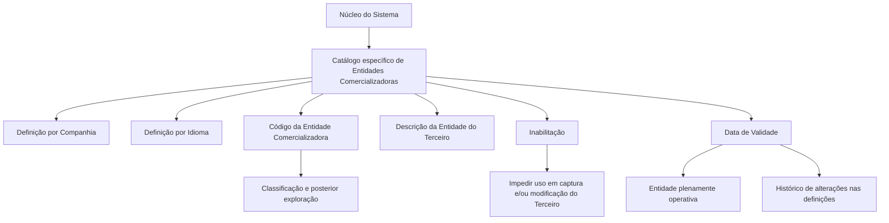

# Definição das Entidades Comercializadoras dos Meios de Cobrança e Pagamento de Terceiros

## 1. Metadados do Documento
- **Arquivo de Origem:** Não identificado no conteúdo fornecido
- **Tipo de Documento:** Especificação Funcional
- **Domínio / Sistema:** Sistema de gestão de Meios de Cobrança e Pagamento de Terceiros
- **Público-Alvo:** Analistas funcionais, desenvolvedores, operação e equipes responsáveis por cadastros corporativos
- **Data/Versão Identificada:** Não identificada

---

## 2. Resumo Executivo & Contexto de Negócio

O documento descreve a definição e a classificação de Entidades Comercializadoras associadas aos Meios de Cobrança e Pagamento de Terceiros no núcleo do Sistema. Essas entidades são mantidas em um catálogo de informação específico, inicialmente entregue vazio nas instalações do Sistema.

A funcionalidade permite definir Entidades de Cobrança e Pagamento por companhia e idioma. Cada Entidade Comercializadora pode ser identificada individualmente por um código e por uma denominação ou descrição textual, permitindo que a informação seja apresentada em idiomas como espanhol ou inglês.

A classificação das Entidades Comercializadoras permite a posterior exploração dessas informações pelo Sistema. Como exemplos de classificação, o documento apresenta Entidade Bancária, Entidade Emissora de Cartões de Crédito e Entidade FINTECH.

O documento também estabelece propriedades operacionais para inabilitação e validade. A inabilitação impede o uso da entidade em operações de captura e/ou modificação do Terceiro. A data de validade determina a partir de quando a entidade está plenamente operacional e permite manter histórico das mudanças realizadas nas definições.

Não existe recomendação corporativa para padronizar ou estabelecer uma codificação específica para as Entidades de Cobrança e Pagamento. A definição da codificação deve, portanto, ser conduzida sem uma preferência corporativa explícita registrada no conteúdo fornecido.

---

## 3. Arquitetura, Componentes & Tecnologias Envolvidas

O conteúdo não descreve tecnologias, protocolos, APIs, bancos de dados, servidores, URLs, ambientes ou microsserviços. O documento apresenta uma estrutura funcional composta pelo núcleo do Sistema, por um catálogo de Entidades Comercializadoras e pelas operações de captura e modificação do Terceiro.

### Componentes e conceitos identificados

| Componente / Conceito | Papel descrito no documento |
| :--- | :--- |
| Núcleo do Sistema | Permite identificar e classificar Entidades Comercializadoras dos Meios de Cobrança e Pagamento de Terceiros. |
| Catálogo de informação específico | Repositório funcional para as Entidades Comercializadoras; é inicialmente entregue vazio nas instalações. |
| Entidade Comercializadora | Entidade associada aos Meios de Cobrança e Pagamento de Terceiros, definida por companhia e idioma. |
| Companhia | Propriedade que indica o código da companhia sobre a qual a definição da Entidade Comercializadora está sendo realizada. |
| Idioma | Propriedade que identifica o idioma empregado na definição da Entidade Comercializadora. |
| Código da Entidade Comercializadora | Propriedade usada para classificar a entidade no Sistema e permitir sua exploração posterior. |
| Descrição da Entidade | Denominação ou texto descritivo associado à Entidade do Terceiro. |
| Operações de captura e/ou modificação do Terceiro | Operações nas quais uma Entidade de Cobrança e Pagamento inabilitada não pode ser utilizada. |



> **Nota de Análise:** O documento não detalha a implementação técnica do catálogo, os métodos de manutenção, contratos de integração, persistência de dados ou permissões de acesso.

---

## 4. Regras de Negócio, Especificações Funcionais & Processos

### 4.1 Cadastro inicial das Entidades Comercializadoras

1. O núcleo do Sistema deve permitir identificar e classificar as diferentes Entidades Comercializadoras dos Meios de Cobrança e Pagamento de Terceiros.
2. As Entidades Comercializadoras devem ser registradas em um catálogo de informação específico.
3. O catálogo de informação específico é entregue inicialmente às instalações sem conteúdo.
4. A definição de Entidades de Cobrança e Pagamento deve ser realizada por companhia.
5. A definição de Entidades de Cobrança e Pagamento deve ser realizada por idioma.
6. Cada Entidade Comercializadora pode receber uma denominação ou descrição individual.

### 4.2 Classificação por código

1. O Código da Entidade Comercializadora permite classificar no Sistema as Entidades Comercializadoras dos Meios de Cobrança e Pagamento do Terceiro.
2. A classificação viabiliza a posterior exploração das Entidades Comercializadoras pelo Sistema.
3. O documento fornece exemplos de códigos e descrições, mas não determina um padrão corporativo obrigatório para codificação.
4. Não existe preferência ou recomendação corporativa para estabelecer ou padronizar a codificação das Entidades de Cobrança e Pagamento.

### 4.3 Descrição da entidade

1. A Descrição da Entidade do Meio de Cobrança e Pagamento indica a denominação ou a descrição da Entidade do Terceiro.
2. A descrição deve considerar o idioma utilizado na definição.
3. O documento apresenta exemplos em idioma espanhol: Entidade Bancária, Entidade Emissora de Cartões de Crédito e Entidade FINTECH.

### 4.4 Inabilitação

1. A propriedade de Inabilitação informa ao Sistema que uma Entidade de Cobrança e Pagamento está inabilitada.
2. Uma Entidade de Cobrança e Pagamento inabilitada não pode ser utilizada nas operações de captura do Terceiro.
3. Uma Entidade de Cobrança e Pagamento inabilitada não pode ser utilizada nas operações de modificação do Terceiro.

### 4.5 Data de validade

1. A Data de Validade informa ao Sistema a data a partir da qual a Entidade de Cobrança e Pagamento está plenamente operativa.
2. O uso correto da Data de Validade permite manter histórico das mudanças efetuadas nas definições das entidades.
3. O documento não detalha formato da data, comportamento para datas futuras, tratamento de datas expiradas ou regras de atualização.

### 4.6 Documentação relacionada

O documento recomenda a leitura de diretrizes e documentos funcionais relacionados para evitar interpretações isoladas que possam conduzir a erro. O vínculo explicitamente citado é:

- **Medios de Cobro y Pago**

> **Nota de Análise:** O conteúdo não apresenta o procedimento detalhado para criação, alteração, consulta ou exclusão de Entidades Comercializadoras.

---

## 5. Tabelas de Parâmetros, Ambientes e Estruturas de Dados

### 5.1 Propriedades da Entidade Comercializadora

| Item / Parâmetro | Descrição / Função | Tipo / Valores / Formato | Ambiente / Observações |
| :--- | :--- | :--- | :--- |
| Companhia | Indica o código da companhia sobre a qual está sendo realizada a definição da Entidade Comercializadora. | Código de companhia; formato não informado. | Aplicável à definição da entidade. |
| Idioma | Indica o idioma empregado na definição da Entidade Comercializadora do Meio de Cobrança/Pagamento. | Exemplos: espanhol, inglês. | A definição é realizada por companhia e idioma. |
| Código da Entidade Comercializadora | Permite classificar as Entidades Comercializadoras dos Meios de Cobrança/Pagamento do Terceiro. | Código; formato não informado. | Permite posterior exploração no Sistema. Não há recomendação corporativa de padronização. |
| Descrição da Entidade do Meio de Cobrança e Pagamento | Indica a denominação ou descrição da Entidade do Terceiro. | Texto descritivo; formato não informado. | Pode variar conforme o idioma da definição. |
| Inabilitação | Indica que a Entidade de Cobrança e Pagamento não pode ser utilizada. | Estado de inabilitação; valores não informados. | Bloqueia uso em captura e/ou modificação do Terceiro. |
| Data de Validade | Indica a data a partir da qual a entidade está plenamente operativa no Sistema. | Data; formato não informado. | Permite manter histórico de alterações das definições. |

### 5.2 Exemplos de classificação apresentados

| Código da Entidade | Descrição apresentada | Idioma mencionado | Observações |
| :--- | :--- | :--- | :--- |
| 1 | Entidad Bancaria | Espanhol | Exemplo apresentado no documento. |
| 10 | Entidad Emisora de Tarjetas de Crédito | Espanhol | Exemplo apresentado no documento. |
| 100 | Entidad FINTECH | Espanhol | Exemplo apresentado no documento. |
| ... | ... | Espanhol | O documento indica a possibilidade de outras classificações, sem detalhá-las. |

### 5.3 Ambientes, infraestrutura e logs

| Item / Parâmetro | Descrição / Função | Tipo / Valores / Formato | Ambiente / Observações |
| :--- | :--- | :--- | :--- |
| Ambientes | Não informado. | Não informado. | O documento não cita desenvolvimento, homologação, produção ou outros ambientes. |
| Servidores | Não informado. | Não informado. | Não há mapeamento de servidores. |
| URLs | Não informado. | Não informado. | Não há URLs funcionais ou técnicas. |
| Logs | Não informado. | Não informado. | Não há rotas, níveis ou parâmetros de log. |

---

## 6. Bateria de Perguntas & Respostas para RAG (FAQ Sintético)

### P1: Qual é a finalidade do catálogo de Entidades Comercializadoras no Sistema?
**R:** O catálogo específico permite ao núcleo do Sistema identificar e classificar as diferentes Entidades Comercializadoras dos Meios de Cobrança e Pagamento de Terceiros. O catálogo é entregue inicialmente vazio e deve ser preenchido pelas definições realizadas por companhia e idioma.

### P2: Quais são as dimensões usadas para definir uma Entidade de Cobrança e Pagamento?
**R:** A definição de uma Entidade de Cobrança e Pagamento é realizada por companhia e idioma. A companhia identifica o código da organização sobre a qual a definição é feita, enquanto o idioma identifica o idioma empregado na definição, como espanhol ou inglês.

### P3: Para que serve o Código da Entidade Comercializadora?
**R:** O Código da Entidade Comercializadora permite classificar no Sistema as Entidades Comercializadoras dos Meios de Cobrança e Pagamento do Terceiro. Essa classificação permite a posterior exploração dessas entidades pelo Sistema.

### P4: Existe um padrão corporativo obrigatório para codificação das Entidades de Cobrança e Pagamento?
**R:** Não. O documento declara explicitamente que não existe corporativamente uma preferência ou recomendação para estabelecer ou padronizar no Sistema a codificação das Entidades de Cobrança e Pagamento.

### P5: O que representa a Descrição da Entidade do Meio de Cobrança e Pagamento?
**R:** A Descrição da Entidade do Meio de Cobrança e Pagamento representa a denominação ou a descrição da Entidade do Terceiro. O documento fornece como exemplos em espanhol as descrições “Entidad Bancaria”, “Entidad Emisora de Tarjetas de Crédito” e “Entidad FINTECH”.

### P6: O que acontece quando uma Entidade de Cobrança e Pagamento está inabilitada?
**R:** Quando a propriedade de Inabilitação indica que a Entidade de Cobrança e Pagamento está inabilitada, a entidade não pode ser utilizada nas operações de captura e/ou modificação do Terceiro.

### P7: Qual é a função da Data de Validade de uma Entidade de Cobrança e Pagamento?
**R:** A Data de Validade informa ao Sistema a data a partir da qual a Entidade de Cobrança e Pagamento está plenamente operativa. O uso correto dessa data também permite manter histórico das mudanças efetuadas nas definições da entidade.

### P8: Quais exemplos de códigos de Entidade Comercializadora são apresentados?
**R:** O documento apresenta os exemplos: código 1 para “Entidad Bancaria”, código 10 para “Entidad Emisora de Tarjetas de Crédito” e código 100 para “Entidad FINTECH”. Esses exemplos são apresentados em idioma espanhol.

### P9: O documento define o formato técnico do código da entidade?
**R:** Não. O documento informa que o código permite classificar as Entidades Comercializadoras, mas não detalha tamanho, máscara, obrigatoriedade, unicidade ou outro formato técnico para o campo.

### P10: O documento especifica como cadastrar ou modificar Entidades Comercializadoras?
**R:** Não. O documento menciona que entidades inabilitadas não podem ser utilizadas em operações de captura e/ou modificação do Terceiro, mas não descreve interfaces, etapas, permissões ou procedimentos para cadastrar, alterar ou consultar entidades.

### P11: Quais documentos relacionados devem ser considerados na interpretação do conteúdo?
**R:** O documento recomenda consultar as diretrizes e documentos funcionais relacionados para evitar interpretações isoladas. O vínculo explicitamente citado é “Medios de Cobro y Pago”.

### P12: O documento informa ambientes, APIs, URLs ou integrações técnicas?
**R:** Não. O conteúdo fornecido não apresenta APIs, métodos HTTP, contratos de dados, URLs, servidores, ambientes, logs, tecnologias ou integrações técnicas.

---

## 7. Glossário de Termos, Siglas & Conceitos-Chave

- **Entidade Comercializadora:** Entidade vinculada aos Meios de Cobrança e Pagamento de Terceiros, identificada e classificada no catálogo específico do Sistema.
- **Entidade de Cobrança e Pagamento:** Termo utilizado no documento para a entidade que pode ser definida por companhia e idioma e utilizada nas operações relacionadas ao Terceiro.
- **Meios de Cobrança e Pagamento:** Domínio funcional citado como associado às Entidades Comercializadoras de Terceiros.
- **Terceiro:** Entidade referenciada nas operações de captura e/ou modificação e nos Meios de Cobrança e Pagamento. O documento não apresenta definição adicional.
- **Companhia:** Código da companhia sobre a qual é realizada a definição da Entidade Comercializadora.
- **Idioma:** Idioma empregado na definição da Entidade Comercializadora, com exemplos de espanhol e inglês.
- **Inabilitação:** Propriedade que impede o uso da Entidade de Cobrança e Pagamento nas operações de captura e/ou modificação do Terceiro.
- **Data de Validade:** Data a partir da qual a Entidade de Cobrança e Pagamento está plenamente operativa no Sistema.
- **FINTECH:** Termo apresentado como exemplo de descrição de uma Entidade Comercializadora. O documento não fornece expansão ou definição adicional.
- **CF:** Sigla exibida no conteúdo bruto junto a “Home Solutions APIs Documentation Zeus”. Não há significado ou contexto funcional detalhado no documento.
- **Zeus:** Termo exibido no conteúdo bruto junto a “Home Solutions APIs Documentation”. Não há significado ou relação técnica detalhada no documento.

---

## 8. Notas Críticas, Riscos & Limitações

- O catálogo de Entidades Comercializadoras é entregue inicialmente vazio; a disponibilidade de classificações depende do preenchimento das definições.
- Não existe recomendação corporativa para padronização da codificação das entidades. Essa ausência pode gerar divergências de codificação entre implementações ou instalações, caso não existam diretrizes locais complementares.
- O documento não detalha regras de unicidade, obrigatoriedade, tamanho, formato ou validação para o Código da Entidade Comercializadora.
- O documento não informa formato, fuso horário, comportamento para datas futuras, atualização ou expiração da Data de Validade.
- O documento não explica como a Inabilitação é tecnicamente representada nem como o Sistema valida esse estado durante captura ou modificação do Terceiro.
- Não são descritos fluxos de cadastro, alteração, consulta, exclusão, aprovação ou auditoria das Entidades Comercializadoras.
- Não há informação sobre permissões, matrizes de acesso, APIs, integrações, logs, ambientes, infraestrutura, servidores ou persistência de dados.
- A interpretação isolada do documento pode conduzir a erro; o próprio documento recomenda a consulta das diretrizes e documentos funcionais vinculados a “Medios de Cobro y Pago”.
- **Nota de Análise:** O documento lista “Home Solutions APIs Documentation Zeus”, “CF” e “EN” no conteúdo extraído, mas não fornece contexto suficiente para vinculá-los à especificação funcional apresentada.

---

## 9. Conteúdo Bruto Estruturado (Referência Fiel)

```text
--- [PÁGINA 1 DE 3] ---

DEFINICIÓN de las ENTIDADES
COMERCIALIZADORAS de los Medios de
Cobro y Pago de los Terceros
Propiedades Generales
Funcionalmente, el núcleo del Sistema cuenta con la posibilidad de identificar y clasificar las
diferentes Entidades Comercializadoras de los Medios de Cobro y Pago de los Terceros en un
catálogo de información específico que se entrega inicialmente a las instalaciones vacío de
contenido.
La definición de estas Entidades de Cobro y Pago en el Sistema se realiza por compañía e idioma
(Español , Inglés, ...) pudiendo denominar e identificar individualmente cada una de ellas mediante
una denominación o texto descriptivo.
Compañía
Esta propiedad le indica al sistema el código de la compañía sobre la que se está realizando la
definición de la Entidad Comercializadora.
Idioma
Esta propiedad le indica al sistema el Idioma empleado en la definición de la Entidad
Comercializadora del Medio de Cobro/Pago, como por ejemplo: español, inglés,...
Código de la Entidad Comercializadora
 / 
 CF
Home Solutions APIs Documentation Zeus
EN


--- [PÁGINA 2 DE 3] ---

Esta propiedad permite clasificar en el sistema las Entidades Comercializadoras de los Medios de
Cobro/Pago del Tercero, lo que permite su posterior explotación.
Descripción de la Entidad del Medio de Cobro y Pago
Esta propiedad le indica al sistema cual es la denominación o descripción de la Entidad del Tercero.
A modo de ejemplo en idioma español:
CÓDIGO ENTIDAD DESCRIPCIÓN
1 Entidad Bancaria
10 Entidad Emisora de Tarjetas de Crédito
100 Entidad FINTECH
... ...
Otras Propiedades
Inhabilitación
Esta propiedad le indica al Sistema que la Entidad de Cobro y Pago está inhabilitada para poder ser
utilizada en las operaciones de captura y/o modificación del Tercero.
Fecha de Validez
Esta propiedad le indica al Sistema la fecha a partir de la cual la Entidad de Cobro y Pago está
plenamente operativa en el sistema por lo que su correcto uso permite tener un histórico de los
cambios efectuados en sus definiciones.
Vínculos
Relación de Directrices y Documentos funcionales cuya lectura recomendada para evitar que la
interpretación aislada del presente documento pueda conducir a error.
Medios de Cobro y Pago
Preguntas frecuentes
(1) ¿Existe alguna recomendación operativa que deba ser tomada en consideración localmente en la
codificación, uso y definición de las Entidades de Cobro y Pago que pueden ser utilizadas en el


--- [PÁGINA 3 DE 3] ---

Sistema?
No existe Corporativamente una preferencia o recomendación para establecer o estandarizar en el
sistema su codificación.
```
