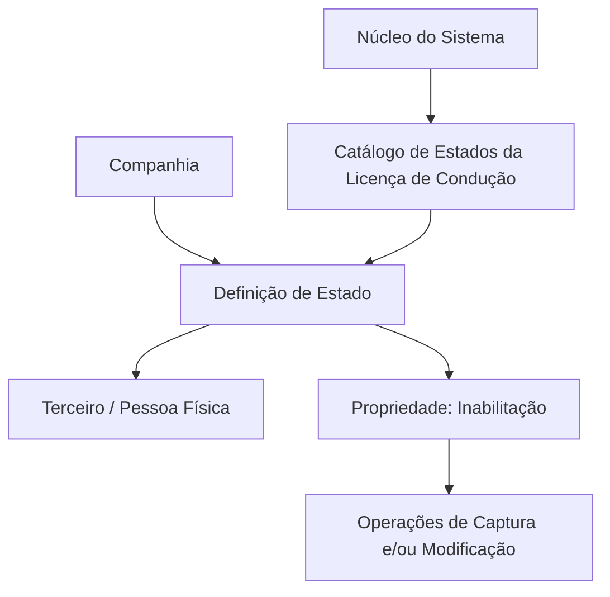

# Definição dos Estados da Licença de Condução de Pessoas Físicas

## 1. Metadados do Documento
- **Arquivo de Origem:** Não identificado no conteúdo fornecido
- **Tipo de Documento:** Especificação Funcional
- **Domínio / Sistema:** Catálogo de estados de licença ou permissão de condução de Terceiros — Pessoas Físicas
- **Público-Alvo:** Analistas funcionais, desenvolvedores, operação e equipes responsáveis pelo cadastro de Terceiros
- **Data/Versão Identificada:** Não identificada

---

## 2. Resumo Executivo & Contexto de Negócio

O documento descreve um catálogo de informação destinado a identificar e codificar os diferentes estados ou situações possíveis das licenças e permissões de condução de Pessoas Físicas. O catálogo é fornecido às entidades sem conteúdo inicial, cabendo a cada entidade definir os estados aplicáveis ao seu contexto.

A definição de cada estado de licença de condução inclui a companhia associada, um código de estado, uma descrição, uma abreviatura e a indicação de inabilitação. A propriedade de inabilitação determina se determinado código de estado pode ou não ser utilizado nas operações de captura e/ou modificação de uma Pessoa Física.

O documento enfatiza que o catálogo de estados da licença de condução não deve ser confundido com os estados do processo de tramitação da licença ou permissão. Portanto, o catálogo representa a situação atribuída ao documento de condução do Terceiro, e não as etapas operacionais do processo de emissão, renovação ou gestão da licença.

Não existe recomendação corporativa para padronizar a codificação local dos estados de licença de condução. As entidades possuem autonomia para estabelecer a codificação e o uso dos estados no sistema.

---

## 3. Arquitetura, Componentes & Tecnologias Envolvidas

Os componentes funcionais identificados são:

- **Sistema:** Núcleo funcional capaz de identificar e codificar estados de licenças ou permissões de condução.
- **Catálogo de estados:** Repositório de informação específica para os estados do documento de condução.
- **Entidades:** Destinatárias do catálogo, que é entregue inicialmente sem conteúdo.
- **Terceiro / Pessoa Física:** Entidade cadastral à qual a licença ou permissão de condução está associada.
- **Companhia:** Código da companhia para a qual ocorre a definição do estado da licença.
- **Operações de captura e modificação:** Operações que podem ser restringidas quando um código de estado estiver inabilitado.
- **Documento funcional relacionado:** “Actividades de Terceros”.



**Nota de Análise:** O documento não descreve tecnologias, protocolos, APIs, bancos de dados, métodos HTTP, contratos JSON ou ambientes técnicos.

---

## 4. Regras de Negócio, Especificações Funcionais & Processos

1. O núcleo do sistema permite identificar e codificar diferentes estados ou situações de licenças e permissões de condução de Pessoas Físicas.

2. Os estados são registrados em um catálogo de informação específico para estados de licenças ou permissões de condução.

3. O catálogo é entregue às entidades sem conteúdo inicial.

4. A propriedade **Companhia** indica o código da companhia para a qual está sendo definida a situação ou o status da licença de condução do Terceiro.

5. A propriedade **Código de Estado** identifica o código relacionado ao estado da licença de condução. O texto original afirma que esta propriedade informa ao sistema se a informação do Terceiro associada à atividade contempla ou não a existência e a geração de um código interno do Terceiro.

6. O documento apresenta, como exemplos de estados:
   - `001` — `En Vigor`
   - `CAD` — `Caducado`
   - `04A` — `Suspendido`

7. A propriedade **Descrição do Estado da Licença de Condução** informa a denominação ou descrição do status da licença de condução.

8. A propriedade **Abreviatura do Estado da Licença de Condução** informa a abreviatura do estado da licença de condução.

9. A propriedade **Inabilitação** indica que um código de estado de licença de condução está inabilitado para uso em operações de captura e/ou modificação da Pessoa Física.

10. O catálogo de estados da licença de condução não representa os estados do processo de tramitação da licença ou permissão de condução. Esses dois conceitos devem ser tratados separadamente.

11. Não existe preferência ou recomendação corporativa para estabelecer ou padronizar localmente a codificação dos possíveis estados da licença de condução no sistema.

---

## 5. Tabelas de Parâmetros, Ambientes e Estruturas de Dados

| Item / Parâmetro | Descrição / Função | Tipo / Valores / Formato | Ambiente / Observações |
| :--- | :--- | :--- | :--- |
| Catálogo de estados | Armazena os possíveis estados ou situações de licenças e permissões de condução de Pessoas Físicas. | Catálogo de informação específico | Entregue às entidades sem conteúdo inicial. |
| Companhia | Indica o código da companhia sobre a qual é realizada a definição do status da licença de condução do Terceiro. | Código de companhia | Não há formato especificado. |
| Código de Estado | Código associado ao estado da licença de condução. | Exemplos: `001`, `CAD`, `04A` | O texto também o relaciona à existência e geração de código interno do Terceiro. |
| Descrição do Estado | Denominação ou descrição do status da licença de condução. | Texto | Exemplos: `En Vigor`, `Caducado`, `Suspendido`. |
| Abreviatura do Estado | Abreviatura do estado da licença de condução. | Texto abreviado | Não há exemplos específicos de abreviaturas separados dos códigos. |
| Inabilitação | Indica que o código de estado não pode ser empregado em operações de captura e/ou modificação da Pessoa Física. | Indicador de inabilitação | Não há valores ou formato especificados. |
| Estado `001` | Estado de licença de condução em vigor. | Código `001` | Exemplo apresentado no documento. |
| Estado `CAD` | Estado de licença de condução caducado. | Código `CAD` | Exemplo apresentado no documento. |
| Estado `04A` | Estado de licença de condução suspenso. | Código `04A` | Exemplo apresentado no documento. |
| Documento relacionado | Documento funcional cuja leitura é recomendada para evitar interpretações isoladas incorretas. | `Actividades de Terceros` | Referência funcional indicada na seção de vínculos. |

---

## 6. Bateria de Perguntas & Respostas para RAG (FAQ Sintético)

### P1: Qual é a finalidade do catálogo de estados da licença de condução?
**R:** O catálogo tem a finalidade de identificar e codificar as diferentes situações ou estados em que podem se encontrar as licenças ou permissões de condução das Pessoas Físicas.

### P2: O catálogo de estados de licença de condução já é entregue preenchido às entidades?
**R:** Não. O documento informa que o catálogo específico é entregue às entidades vazio de conteúdo.

### P3: O que a propriedade Companhia representa na definição de um estado de licença de condução?
**R:** A propriedade Companhia indica o código da companhia para a qual está sendo realizada a definição do status da licença de condução do Terceiro.

### P4: Quais exemplos de códigos de estado de licença de condução são apresentados?
**R:** O documento apresenta os exemplos `001` para `En Vigor`, `CAD` para `Caducado` e `04A` para `Suspendido`.

### P5: Qual é a diferença entre o catálogo de estados da licença e o processo de tramitação da licença?
**R:** O catálogo define os possíveis estados do documento de condução do Terceiro. O documento determina expressamente que esse catálogo não deve ser confundido com os estados pelos quais passa o processo de tramitação da licença ou permissão de condução.

### P6: Para que serve a descrição do estado da licença de condução?
**R:** A descrição do estado informa ao sistema a denominação ou a descrição do status da licença de condução.

### P7: Para que serve a abreviatura do estado da licença de condução?
**R:** A abreviatura informa ao sistema a forma abreviada do estado da licença de condução.

### P8: O que acontece quando um código de estado está inabilitado?
**R:** Quando um código de estado da licença de condução está inabilitado, ele não pode ser empregado nas operações de captura e/ou modificação da Pessoa Física.

### P9: Existe uma padronização corporativa obrigatória para os códigos de estado?
**R:** Não. O documento informa que não existe preferência ou recomendação corporativa para estabelecer ou padronizar localmente a codificação e o uso dos possíveis estados da licença de condução no sistema.

### P10: Qual documento funcional é recomendado como leitura complementar?
**R:** O documento recomenda a leitura de `Actividades de Terceros`, pois a interpretação isolada da especificação atual pode conduzir a erro.

---

## 7. Glossário de Termos, Siglas & Conceitos-Chave

- **Pessoa Física:** Tipo de Terceiro ao qual se associam licenças ou permissões de condução.
- **Terceiro:** Entidade cadastral cuja informação de licença de condução é tratada pelo sistema.
- **Catálogo de Estados:** Catálogo de informação que registra os possíveis estados ou situações das licenças e permissões de condução.
- **Companhia:** Código da organização para a qual é definida a situação da licença de condução do Terceiro.
- **Código de Estado:** Código associado a um estado da licença de condução.
- **En Vigor:** Estado de licença de condução em vigor.
- **Caducado:** Estado de licença de condução caducado.
- **Suspendido:** Estado de licença de condução suspenso.
- **Inabilitação:** Propriedade que impede o emprego de um código de estado em operações de captura e/ou modificação de Pessoas Físicas.
- **Captura:** Operação mencionada no documento para uso de informações da Pessoa Física; não há detalhamento adicional.
- **Modificação:** Operação mencionada no documento para alteração de informações da Pessoa Física; não há detalhamento adicional.
- **Actividades de Terceros:** Documento funcional relacionado cuja leitura é recomendada.

---

## 8. Notas Críticas, Riscos & Limitações

- O catálogo é entregue sem conteúdo, mas o documento não descreve o processo operacional de carga, aprovação, manutenção ou governança dos estados.
- Não há padronização corporativa para a codificação local dos estados. Essa autonomia pode gerar códigos diferentes entre entidades.
- O documento exige que o catálogo de estados da licença não seja confundido com o processo de tramitação da licença. Essa distinção representa um risco de interpretação funcional incorreta.
- A propriedade **Código de Estado** possui uma descrição que menciona a existência e geração de código interno do Terceiro, sem detalhar claramente a relação dessa regra com o status da licença de condução.
- Não são detalhados valores permitidos, formato, obrigatoriedade, persistência ou comportamento técnico da propriedade **Inabilitação**.
- O documento referencia `Actividades de Terceros`, mas o conteúdo desse documento complementar não foi fornecido.
- A terceira página contém apenas a indicação de página em branco ou elementos visuais/imagem; não há conteúdo textual adicional recuperável.

---

## 9. Conteúdo Bruto Estruturado (Referência Fiel)

```text
--- [PÁGINA 1 DE 3] ---

DEFINICIÓN de los Estados del Permiso de
Conducir
Propiedades Generales
Funcionalmente, el núcleo del Sistema cuenta con la posibilidad de identificar y codificar las
diferentes estados o situaciones en los que se pueden encontrar las licencias o permisos de
conducción de las Personas Físicas en un catálogo de información específico que se entrega a las
entidades vacío de contenido.
Compañía
Esta propiedad le indica al sistema el código de la compañía sobre la que se está realizando la
definición del status del carnet de conducir del Tercero.
Código de Estado
Esta propiedad le indica al Sistema si la información del Tercero asociado a la actividad contempla o
no la existencia y generación de un código interno del Tercero.
A modo de ejemplo,
STATUS DESCRIPCIÓN
001 En Vigor
 /
 CF
Home Solutions APIs Documentation Zeus
EN


--- [PÁGINA 2 DE 3] ---

STATUS DESCRIPCIÓN
CAD Caducado
04A Suspendido
... ...
IMPORTANTE: No confundir la definición de este catálogo que contempla los posibles estados del
carnet de conducir del Tercero, con los estados por los que pasa el proceso de tramitación del
carnet o licencia de conducir.
Descripción del Estado de la Licencia de conducir
Esta propiedad le indica al sistema cual es la denominación o descripción del status del carnet de
conducir.
Abreviatura del Estado de la Licencia de conducir
Esta propiedad le indica al sistema cual es la abreviatura del estado del carnet de conducir.
Otras Propiedades
Inhabilitación
Esta propiedad le indica al sistema que el Código de Estado del Carnet de Conducir está inhabilitado
para poder ser empleado en las operaciones de captura y/o modificación de la persona física.
Vínculos
Relación de Directrices y Documentos funcionales cuya lectura recomendada para evitar que la
interpretación aislada del presente documento pueda conducir a error.
Actividades de Terceros
Preguntas frecuentes
(1) ¿Existe alguna recomendación operativa que deba ser tomada en consideración localmente en la
codificación y uso de los posibles estados del Carnet de Conducir de las personas físicas en el
Sistema?
No existe Corporativamente una preferencia o recomendación para establecer o estandarizar en el
sistema su codificación en el sistema.


--- [PÁGINA 3 DE 3] ---

[Página em branco ou apenas elementos visuais/imagem]
```
