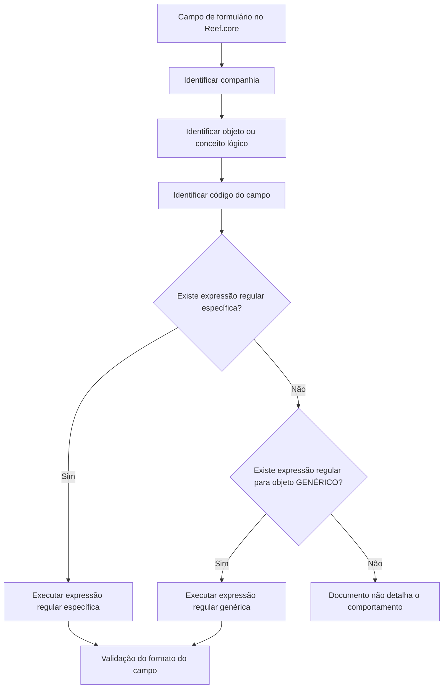

# Definição de Expressões Regulares por Propriedade no Reef.core

## 1. Metadados do Documento
- **Arquivo de Origem:** Não identificado
- **Tipo de Documento:** Especificação Técnica
- **Domínio / Sistema:** Reef.core
- **Público-Alvo:** Desenvolvedores, Arquitetos, Operação e Negócio
- **Data/Versão Identificada:** Não identificada

---

## 2. Resumo Executivo & Contexto de Negócio

O documento descreve a funcionalidade do Reef.core para configurar e associar expressões regulares aos campos de formulários da aplicação. As expressões regulares são executadas sobre os campos configurados, com o objetivo de validar o formato das informações registradas ou modificadas.

A configuração é realizada em um catálogo inicialmente entregue às instalações com informações pré-carregadas. A estrutura de definição associa uma expressão regular a uma combinação de companhia, objeto ou conceito lógico e campo.

O Reef.core disponibiliza o valor de objeto **GENÉRICO** para permitir o reaproveitamento de validações entre propriedades presentes em vários conceitos lógicos. Quando não existe uma expressão regular específica para o atributo validado, o sistema utiliza a definição genérica, se disponível.

O catálogo também prevê propriedades operacionais para inabilitação, vigência e observações. A data de validade permite manter histórico das alterações nas definições de validação; a inabilitação impede que uma expressão regular seja utilizada em operações de registro e/ou modificação de dados de pessoas físicas ou jurídicas.

O documento recomenda preservar as expressões regulares do Reef.core pré-carregadas no catálogo, denominadas *out-of-the-box*. Não são fornecidos exemplos de padrões regex, interfaces de configuração, contratos técnicos ou mensagens de erro resultantes das validações.

---

## 3. Arquitetura, Componentes & Tecnologias Envolvidas

### Componentes e conceitos identificados

| Componente / Conceito | Descrição sustentada pelo documento |
| :--- | :--- |
| Reef.core | Sistema que permite configurar e associar expressões regulares aos campos de formulários da aplicação. |
| Catálogo de expressões regulares por propriedade | Catálogo utilizado para armazenar a configuração e associação das expressões regulares aos campos. É entregue inicialmente às instalações com informações pré-carregadas. |
| Formulários da aplicação | Elementos da aplicação cujos campos podem executar expressões regulares configuradas. |
| Companhia | Código da companhia para a qual é realizada a definição da expressão regular. |
| Objeto / conceito lógico | Código do objeto ou conceito lógico ao qual pertence o campo validado. |
| Campo | Código do campo do objeto ou conceito lógico sobre o qual a expressão regular é executada. |
| Objeto `GENÉRICO` | Valor de objeto usado como definição de fallback quando não há expressão regular encontrada para o atributo do conceito lógico validado. |
| Expressão regular | Validação de formato associada a um campo de um objeto ou conceito lógico. |
| Operações de registro e modificação | Operações em que uma expressão regular inabilitada não pode ser utilizada para informações de pessoa física ou jurídica. |



> **Nota de Análise:** O documento descreve a lógica de busca de uma expressão específica e o uso da definição `GENÉRICO` como alternativa. O comportamento do Reef.core quando não há nem expressão específica nem expressão genérica não é detalhado.

---

## 4. Regras de Negócio, Especificações Funcionais & Processos

### Configuração de expressões regulares por propriedade

1. O Reef.core permite configurar e associar uma ou mais expressões regulares aos campos dos formulários da aplicação.
2. As expressões regulares configuradas devem ser executadas sobre os campos aos quais foram associadas.
3. A configuração ocorre em um catálogo inicialmente entregue às instalações com informação pré-carregada.
4. A definição da validação identifica a companhia, o objeto ou conceito lógico, o campo e o código da expressão regular.
5. O atributo **Observações** pode registrar informações relevantes sobre a validação, incluindo:
   - finalidade da configuração;
   - objetivo da expressão regular;
   - área beneficiada pela definição;
   - demais informações relevantes sobre a validação da informação.

### Regra de busca específica e genérica

1. O catálogo suporta o valor de objeto **GENÉRICO**.
2. Para o atributo do conceito lógico que está sendo validado, o Reef.core busca uma expressão regular a utilizar.
3. Se o Reef.core não encontrar uma expressão regular aplicável ao atributo do conceito lógico, o Reef.core utiliza a expressão regular definida como genérica.
4. A definição `GENÉRICO` permite usar, por padrão, a mesma validação de formato para propriedades existentes em vários conceitos lógicos.
5. Uma propriedade pode ter comportamento particularizado quando necessário por meio de uma definição específica.

### Regras de inabilitação e validade

1. A propriedade **Inhabilitación** informa ao sistema que a expressão regular está inabilitada.
2. Uma expressão regular inabilitada não deve ser utilizada em operações de registro e/ou modificação de informações de pessoa física ou jurídica.
3. A propriedade **Fecha de Validez** indica a data a partir da qual a expressão regular está plenamente operativa no Reef.core.
4. O uso correto da data de validade permite manter histórico das alterações realizadas nas definições das validações.

### Recomendação operacional explícita

1. As expressões regulares do Reef.core fornecidas *out-of-the-box* e pré-carregadas no catálogo devem ser respeitadas.
2. O documento não detalha o processo de alteração, substituição, exclusão ou governança dessas expressões pré-carregadas.

---

## 5. Tabelas de Parâmetros, Ambientes e Estruturas de Dados

| Item / Parâmetro | Descrição / Função | Tipo / Valores / Formato | Ambiente / Observações |
| :--- | :--- | :--- | :--- |
| Companhia | Determina o código da companhia para a qual a definição da expressão regular é realizada. | Código de companhia; formato não detalhado. | Aplicável à definição da expressão regular. |
| Objeto | Determina o código do objeto ou conceito lógico no qual o campo está inscrito e sobre o qual a expressão regular é definida. | Código de objeto ou conceito lógico. | Aceita o valor `GENÉRICO`, conforme regra de fallback. |
| `GENÉRICO` | Permite utilizar uma expressão regular genérica caso não seja encontrada uma expressão para o atributo do conceito lógico validado. | Valor do atributo Objeto. | Permite reutilizar validação de formato em propriedades existentes em vários conceitos lógicos. |
| Campo | Determina o código do campo do objeto ou conceito lógico sobre o qual a expressão regular será executada. | Código de campo; formato não detalhado. | Campo de formulário da aplicação. |
| Código da Expressão Regular | Determina o código da expressão regular associada ao campo do objeto. | Código de expressão regular; padrão regex não detalhado. | Não há catálogo de códigos apresentado no texto. |
| Observações | Registra texto esclarecedor sobre a definição da expressão regular. | Texto livre. | Pode documentar finalidade, objetivo, área beneficiada e informações relevantes. |
| Inhabilitación | Indica que a expressão regular está inabilitada para uso. | Estado de inabilitação; valores não detalhados. | Afeta operações de registro e/ou modificação de pessoa física ou jurídica. |
| Fecha de Validez | Indica a data a partir da qual a expressão regular se torna plenamente operativa. | Data; formato não detalhado. | Seu uso correto permite histórico de alterações nas definições de validação. |
| Catálogo de expressões regulares por propriedade | Repositório de configuração e associação de expressões regulares aos campos. | Catálogo pré-carregado inicialmente. | As expressões *out-of-the-box* pré-carregadas devem ser respeitadas. |
| Vínculos | Relação de diretrizes e documentos funcionais recomendados para leitura. | Referência documental. | A leitura é recomendada para evitar interpretação isolada incorreta do documento. |

---

## 6. Bateria de Perguntas & Respostas para RAG (FAQ Sintético)

### P1: Qual é a finalidade do catálogo de expressões regulares por propriedade no Reef.core?
**R:** O catálogo permite configurar e associar expressões regulares aos campos dos formulários da aplicação Reef.core. Essas expressões regulares são executadas sobre os campos associados para validar o formato das informações.

### P2: Quais atributos identificam uma configuração de expressão regular por propriedade?
**R:** A configuração identifica a companhia, o objeto ou conceito lógico, o campo e o código da expressão regular. O catálogo também contempla observações, inabilitação e data de validade.

### P3: O que representa a propriedade Companhia na definição de uma expressão regular?
**R:** A propriedade Companhia determina o código da companhia para a qual a definição da expressão regular está sendo realizada.

### P4: Para que serve o objeto `GENÉRICO` no Reef.core?
**R:** O valor `GENÉRICO` permite que o Reef.core utilize uma expressão regular genérica quando não encontra uma expressão regular para o atributo do conceito lógico que está sendo validado. Essa capacidade possibilita aplicar, por padrão, a mesma validação de formato a propriedades existentes em vários conceitos lógicos.

### P5: Quando uma expressão regular específica deve prevalecer sobre uma expressão regular genérica?
**R:** O documento informa que o Reef.core busca uma expressão regular para o atributo do conceito lógico validado e utiliza a definida como genérica se não a encontrar. Portanto, a definição específica é utilizada quando encontrada, enquanto a genérica atua como alternativa de fallback.

### P6: O que acontece quando uma expressão regular está inabilitada?
**R:** Uma expressão regular inabilitada não deve ser utilizada nas operações de registro e/ou modificação das informações de pessoa física ou jurídica.

### P7: Qual é a finalidade da data de validade de uma expressão regular?
**R:** A data de validade indica a partir de qual data a expressão regular está plenamente operativa no Reef.core. O uso correto dessa data permite manter um histórico das alterações efetuadas nas definições das validações.

### P8: Que informações podem ser registradas no campo Observações?
**R:** O campo Observações permite registrar um texto explicativo sobre a definição da expressão regular, incluindo para que a validação é configurada, o que se pretende com ela, qual área é beneficiada e qualquer outra informação relevante para a validação dos dados.

### P9: Existe alguma recomendação operacional para o uso do catálogo de expressões regulares?
**R:** Sim. O documento determina que as expressões regulares do Reef.core fornecidas *out-of-the-box* e pré-carregadas no catálogo devem ser respeitadas.

### P10: O documento informa quais padrões regex estão pré-carregados no Reef.core?
**R:** Não. O documento informa que existem expressões regulares *out-of-the-box* pré-carregadas no catálogo, mas não lista seus códigos, padrões, sintaxe ou finalidades específicas.

### P11: O documento descreve métodos HTTP, APIs ou contratos JSON para configurar as expressões regulares?
**R:** Não. O documento descreve propriedades funcionais da configuração no catálogo do Reef.core, mas não detalha métodos HTTP, APIs, contratos JSON, interfaces de usuário ou mecanismos técnicos de persistência.

### P12: O que deve ser consultado para evitar uma interpretação isolada incorreta do documento?
**R:** Devem ser consultadas as diretrizes e os documentos funcionais relacionados na seção Vínculos, pois a leitura dessas referências é recomendada para evitar erros de interpretação isolada.

---

## 7. Glossário de Termos, Siglas & Conceitos-Chave

- **Reef.core:** Sistema que permite configurar e associar expressões regulares a campos de formulários da aplicação.
- **Expressão Regular:** Validação associada a um campo para verificar o formato da informação.
- **Catálogo:** Estrutura de configuração em que as expressões regulares por propriedade são definidas e associadas.
- **Companhia:** Código da companhia para a qual uma definição de expressão regular é realizada.
- **Objeto:** Código do objeto ou conceito lógico que contém o campo sujeito à validação.
- **Conceito lógico:** Elemento lógico no qual um campo está inscrito, conforme a terminologia utilizada no documento.
- **Campo:** Código do campo de um objeto ou conceito lógico sobre o qual a expressão regular é executada.
- **GENÉRICO:** Valor de objeto que representa uma definição de expressão regular reutilizável como fallback.
- **Inhabilitación:** Propriedade que indica que uma expressão regular não pode ser usada em operações de registro e/ou modificação.
- **Fecha de Validez:** Propriedade que indica a data a partir da qual uma expressão regular está plenamente operativa.
- **Out-of-the-box:** Termo usado para as expressões regulares fornecidas pré-carregadas no catálogo do Reef.core.
- **Vínculos:** Relação de diretrizes e documentos funcionais recomendados para complementar a interpretação do documento.

---

## 8. Notas Críticas, Riscos & Limitações

- O documento não identifica o nome do arquivo, data, versão, autor ou responsáveis pelo conteúdo.
- Não há exemplos concretos de expressões regulares, códigos de expressão regular ou formatos de campos.
- Não são detalhados os valores permitidos para a propriedade de inabilitação.
- Não é especificado o formato de data aceito pela propriedade **Fecha de Validez**.
- O comportamento do Reef.core não é descrito para o cenário em que não exista expressão regular específica nem expressão regular `GENÉRICO`.
- Não são detalhados métodos HTTP, APIs, contratos JSON, banco de dados, interfaces de configuração, logs ou mensagens de erro.
- O documento recomenda respeitar as expressões *out-of-the-box*, mas não descreve procedimentos de governança, alteração ou restauração dessas configurações.
- A interpretação isolada do documento pode conduzir a erro; a leitura das diretrizes e documentos funcionais vinculados é recomendada.

---

## 9. Conteúdo Bruto Estruturado (Referência Fiel)

```text
--- [PÁGINA 1 DE 3] ---

DEFINICIÓN de las EXPRESIONES
REGULARES por Propiedad
Propiedades Generales
Funcionalmente, Reef.core cuenta con la posibilidad de configurar y asociar en los campos de los
formularios de la aplicación la/s expresiones regulares que se tienen que ejecutar sobre ellos (lo cual
se realiza en un catálogo que se entrega inicialmente a las instalaciones con información pre-
cargada).
Compañía
Esta propiedad determina el código de la compañía para la que se está realizando la definición de la
Expresión Regular.
Objeto
Este atributo determina el código del objeto o concepto lógico en el que se inscribe el campo y sobre
el que se define la expresión regular.
 /
CF
Home Solutions APIs Documentation Zeus
EN


--- [PÁGINA 2 DE 3] ---

Reef.core contempla en la configuración de este catálogo el valor del objeto "GENÉRICO" que
permite buscar para el atributo del concepto lógico que se está validando una expresión regular a
utilizar y si no la encontrara utilizar la definida como genérica.
De esta manera se puede utilizar por defecto la misma validación de formato en todas aquellas
propiedades existentes en varios conceptos lógicos pudiendo particularizar el comportamiento
para alguna de ellas si así fuera necesario.
Campo
Este atributo determina el código del campo, del objeto o concepto lógico, sobre el que se va a
realizar la ejecución de la expresión regular.
Código de la Expresión Regular
Este atributo determina el código de la expresión regular que sea asocia al campo del objeto.
Observaciones
Esta propiedad permite registrar un texto aclaratorio sobre la definición de la expresión regular: para
qué se configura, qué se pretende con ella, qué área se beneficia de su definición,... es decir,
cualquier información relevante sobre la validación de la información.
Otras Propiedades
Inhabilitación
Esta propiedad le indica al sistema que la expresión regular se encuentra inhabilitada para ser
utilizada en las operaciones de registro y/o modificación de la información de la persona física o
jurídica.
Fecha de Validez
Esta propiedad indica en Reef.core la fecha a partir de la cual la expresión regular está plenamente
operativa en el sistema por lo que su correcto uso permite tener un histórico de los cambios
efectuados en las definiciones de las validaciones.
Vínculos
Relación de Directrices y Documentos funcionales cuya lectura recomendada para evitar que la
interpretación aislada del presente documento pueda conducir a error.
Expresiones Regulares
Consejo:


--- [PÁGINA 3 DE 3] ---

Preguntas frecuentes
(1) ¿Existe alguna recomendación operativa que deba ser tomada en consideración en el empleo y
configuración de la tabla de expresiones regulares por propiedad en el Sistema?
Se tienen que respetar las expresiones regulares de Reef.core que vienen out-of-the-box pre-
cargadas en el catálogo.
```
