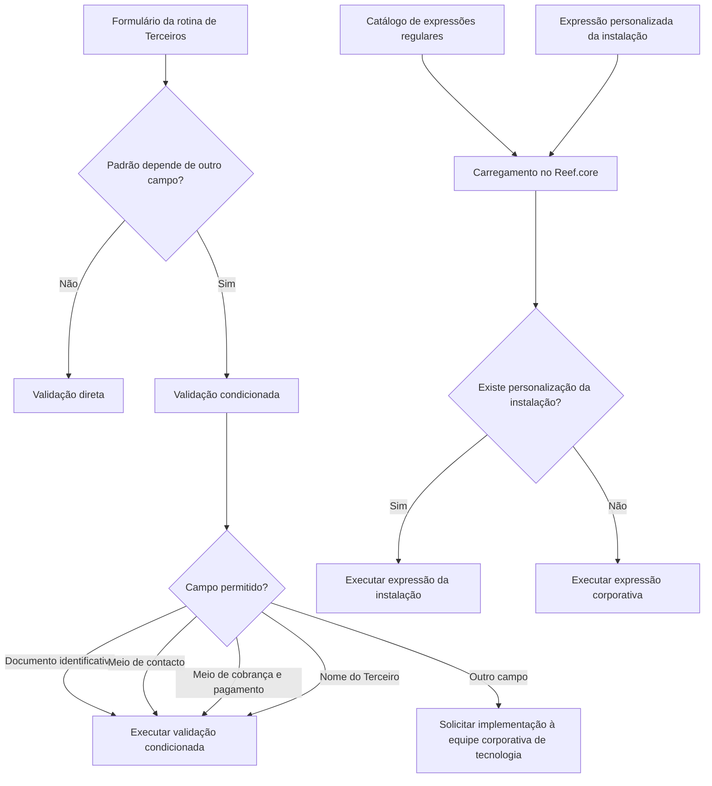

# Definição e Gestão de Expressões Regulares no Reef.core

## 1. Metadados do Documento
- **Arquivo de Origem:** Não identificado
- **Tipo de Documento:** Especificação Técnica
- **Domínio / Sistema:** Reef.core — rotina de Terceiros
- **Público-Alvo:** Desenvolvedores, Arquitetos, Operação e Negócio
- **Data/Versão Identificada:** Não identificada

---

## 2. Resumo Executivo & Contexto de Negócio

O documento descreve a definição, configuração e utilização de expressões regulares no sistema Reef.core. As expressões regulares permitem buscar, validar, capturar ou substituir texto por meio de padrões determinados, sendo utilizadas para validar informações capturadas em formulários da aplicação.

No contexto do Reef.core, as expressões regulares são identificadas e codificadas em um catálogo disponibilizado inicialmente às instalações com informações pré-configuradas. O catálogo suporta validações aplicáveis à rotina de Terceiros, incluindo pessoas físicas ou jurídicas registradas ou modificadas no sistema.

O documento diferencia validações diretas de validações condicionadas. Validações diretas são aplicadas quando o padrão não depende do valor de outro campo. Validações condicionadas são aplicadas quando o formato da expressão regular depende do valor existente em outro campo da tela.

A configuração prevê uma expressão regular corporativa e, opcionalmente, uma personalização por instalação. Durante a carga das expressões regulares, o Reef.core prioriza a expressão regular personalizada pela instalação; na ausência dessa personalização, utiliza a expressão regular corporativa.

---

## 3. Arquitetura, Componentes & Tecnologias Envolvidas

Os componentes e conceitos identificados são:

- **Reef.core:** Sistema no qual ocorre a definição, carga e execução das expressões regulares.
- **Catálogo de expressões regulares:** Repositório de definições pré-configuradas e potencialmente personalizadas por instalação.
- **Rotina de Terceiros:** Contexto funcional no qual são executadas validações de informações de terceiros.
- **Instalação:** Unidade que pode definir uma expressão regular personalizada.
- **Equipe corporativa de tecnologia:** Equipe que deve ser acionada para implementar validações condicionadas adicionais sobre campos não previstos.
- **MAPFRE:** Entidade mencionada na recomendação operacional referente ao catálogo de Agrupamentos de Terceiros.
- **Home Solutions APIs Documentation Zeus:** Termos exibidos no conteúdo bruto, sem descrição adicional de relacionamento técnico com Reef.core.



> **Nota de Análise:** O documento não detalha tecnologias de implementação, linguagens de programação, endpoints, contratos JSON, banco de dados, métodos HTTP ou mecanismos de persistência do catálogo.

---

## 4. Regras de Negócio, Especificações Funcionais & Processos

### 4.1 Classificação das validações

1. **Validação direta**
   - Deve ser utilizada quando a validação do padrão não depende do valor de outro campo.
   - A validação é definida por uma expressão regular aplicável de forma independente.

2. **Validação condicionada**
   - Deve ser utilizada quando o formato da expressão regular depende do valor de outro campo exibido na tela.
   - É permitida exclusivamente para:
     - Documento identificativo do Terceiro.
     - Meios de contacto de um Terceiro.
     - Meios de cobrança e pagamento.
     - Nome do Terceiro.
   - A criação de uma validação condicionada para qualquer outro campo exige solicitação obrigatória à equipe corporativa de tecnologia para implementação.

### 4.2 Precedência de configuração durante a carga

1. O Reef.core realiza a carga das expressões regulares.
2. O sistema verifica se existe uma expressão regular personalizada pela instalação.
3. Quando existir personalização da instalação, o Reef.core executa a expressão regular da instalação.
4. Quando não existir personalização da instalação, o Reef.core executa a expressão regular corporativa.

### 4.3 Regras de operação e histórico

- Uma expressão regular pode ser marcada como inabilitada.
- Uma expressão regular inabilitada não deve ser utilizada nas operações de registro e/ou modificação das informações de pessoa física ou jurídica.
- A data de validade determina a data a partir da qual a expressão regular está plenamente operativa no Reef.core.
- O uso correto da data de validade permite manter histórico das alterações realizadas nas definições de validação.
- O campo de observações deve registrar informações relevantes sobre a finalidade da validação, o objetivo da configuração e a área beneficiada.

### 4.4 Vínculos documentais

O documento indica a existência de uma relação de diretrizes e documentos funcionais cuja leitura é recomendada. A finalidade é evitar interpretações incorretas decorrentes da leitura isolada deste documento. É mencionado o documento funcional **“Expresiones Regulares por Propiedad”**.

---

## 5. Tabelas de Parâmetros, Ambientes e Estruturas de Dados

| Item / Parâmetro | Descrição / Função | Tipo / Valores / Formato | Ambiente / Observações |
| :--- | :--- | :--- | :--- |
| Companhia | Determina o código da companhia para a qual é realizada a definição da expressão regular. | Código de companhia | Aplicável à definição da expressão regular. |
| Código da Expressão Regular | Determina o código da expressão regular configurada. | Código | Identificador da configuração. |
| Descrição da Expressão Regular | Permite identificar a expressão regular em linguagem natural. | Texto descritivo | Deve facilitar a identificação funcional da expressão. |
| Valores Possíveis | Contém a máscara do formato da expressão regular. | Máscara de formato | O documento não especifica sintaxe ou exemplos de máscaras. |
| Expressão Regular | Determina a sintaxe específica, incluindo caracteres especiais e regras de construção. | Expressão regular | Utilizada para validar informações. |
| Expressão Regular da Instalação | Determina a expressão regular personalizada pela instalação. | Expressão regular personalizada | Possui precedência sobre a expressão regular corporativa durante a carga. |
| Observações | Registra texto esclarecedor sobre a definição da expressão regular. | Texto livre | Pode informar finalidade, objetivo, área beneficiada e demais informações relevantes. |
| Inabilitação | Indica que a expressão regular não está disponível para uso. | Estado de inabilitação | Impede utilização em registro e/ou modificação de pessoa física ou jurídica. |
| Data de Validade | Indica a data a partir da qual a expressão regular está plenamente operativa. | Data | Permite histórico das alterações nas definições de validação. |
| Validação direta | Valida um padrão que não depende do valor de outro campo. | Tipo de validação | Aplicável à rotina de Terceiros. |
| Validação condicionada | Valida um padrão dependente do valor de outro campo da tela. | Tipo de validação | Restrita aos quatro grupos de campos explicitamente listados. |
| Documento identificativo do Terceiro | Campo elegível para validação condicionada. | Campo da rotina de Terceiros | Não há detalhamento de formato documental. |
| Meios de contacto de um Terceiro | Campo elegível para validação condicionada. | Campo da rotina de Terceiros | Não há detalhamento dos meios de contacto. |
| Meios de cobrança e pagamento | Campo elegível para validação condicionada. | Campo da rotina de Terceiros | Não há detalhamento de formatos. |
| Nome do Terceiro | Campo elegível para validação condicionada. | Campo da rotina de Terceiros | Não há detalhamento de regras de nomeação. |

---

## 6. Bateria de Perguntas & Respostas para RAG (FAQ Sintético)

### P1: Qual é a finalidade das expressões regulares no Reef.core?
**R:** No Reef.core, as expressões regulares permitem buscar, validar, capturar ou substituir texto por meio de padrões determinados. No contexto apresentado, elas são utilizadas para validar informações capturadas nos diferentes formulários da aplicação, especialmente na rotina de Terceiros.

### P2: O que diferencia uma validação direta de uma validação condicionada?
**R:** A validação direta é utilizada quando o padrão da expressão regular não depende do valor de outro campo. A validação condicionada é utilizada quando o formato da expressão regular depende do valor que outro campo possui na tela.

### P3: Quais campos podem receber validações condicionadas na rotina de Terceiros?
**R:** As validações condicionadas são utilizadas exclusivamente para o documento identificativo do Terceiro, os meios de contacto de um Terceiro, os meios de cobrança e pagamento e o nome do Terceiro.

### P4: Posso criar uma validação condicionada para um campo diferente dos campos previstos?
**R:** Não diretamente. Caso seja necessário criar uma validação condicionada adicional sobre outro campo, é obrigatório solicitar a implementação à equipe corporativa de tecnologia.

### P5: Qual expressão regular é executada quando existe uma personalização da instalação?
**R:** Quando existe uma expressão regular personalizada pela instalação, o Reef.core executa essa expressão regular da instalação durante a carga das expressões regulares.

### P6: O que ocorre quando não existe uma expressão regular personalizada pela instalação?
**R:** Quando não existe uma personalização realizada pela instalação, o Reef.core executa a expressão regular corporativa.

### P7: Qual é a finalidade da data de validade de uma expressão regular?
**R:** A data de validade indica a data a partir da qual a expressão regular está plenamente operativa no Reef.core. Seu uso correto permite manter histórico das alterações efetuadas nas definições das validações.

### P8: O que acontece com uma expressão regular marcada como inabilitada?
**R:** Uma expressão regular inabilitada não pode ser utilizada nas operações de registro e/ou modificação das informações de pessoa física ou jurídica.

### P9: Quais informações devem ser registradas no campo Observações?
**R:** O campo Observações pode registrar texto esclarecedor sobre a definição da expressão regular, incluindo para que ela foi configurada, o que se pretende alcançar com ela, qual área se beneficia da definição e qualquer outra informação relevante para a validação da informação.

### P10: Qual informação é definida pelo atributo Companhia?
**R:** O atributo Companhia determina o código da companhia para a qual está sendo realizada a definição da expressão regular.

### P11: O que representa o campo Valores Possíveis?
**R:** O campo Valores Possíveis contém a máscara do formato da expressão regular. O documento não fornece exemplos de máscaras ou sintaxes específicas.

### P12: Existe uma padronização obrigatória para a codificação de Agrupamentos de Terceiros?
**R:** O documento informa que não existe preferência ou recomendação para estabelecer ou padronizar a codificação dos Agrupamentos de Terceiros. Entretanto, a entidade MAPFRE deve analisar a conveniência de utilizar transversalmente esse catálogo nos processos da companhia, permitindo sua correta definição e posterior exploração.

---

## 7. Glossário de Termos, Siglas & Conceitos-Chave

- **Reef.core:** Sistema no qual são definidas, carregadas e utilizadas expressões regulares para validação de informações.
- **Expressão Regular / RegExp / RegEx:** Sistema de padrões utilizado para buscar, validar, capturar ou substituir texto.
- **Validação direta:** Validação cujo padrão não depende do valor de outro campo.
- **Validação condicionada:** Validação cujo padrão depende do valor presente em outro campo da tela.
- **Terceiro:** Entidade cujas informações podem ser registradas ou modificadas na rotina de Terceiros; o documento menciona pessoa física ou jurídica.
- **Instalação:** Contexto que pode possuir uma expressão regular personalizada, com precedência sobre a expressão corporativa.
- **Expressão regular corporativa:** Definição utilizada pelo sistema quando não há expressão regular personalizada pela instalação.
- **Máscara:** Formato armazenado no campo Valores Possíveis para a expressão regular.
- **MAPFRE:** Entidade citada em relação à análise do uso transversal do catálogo de Agrupamentos de Terceiros.
- **Home Solutions APIs Documentation Zeus:** Termos presentes na extração bruta, sem explicação funcional ou técnica adicional.

---

## 8. Notas Críticas, Riscos & Limitações

- O documento não apresenta exemplos concretos de expressões regulares, máscaras, valores possíveis ou configurações de campos.
- O documento não detalha métodos HTTP, APIs, contratos JSON, arquitetura de infraestrutura, persistência de dados ou interfaces de administração do catálogo.
- A criação de validações condicionadas fora dos campos previstos depende obrigatoriamente da equipe corporativa de tecnologia, constituindo uma dependência operacional e de governança.
- A prioridade da personalização por instalação pode gerar comportamentos diferentes entre instalações, pois a expressão da instalação substitui a expressão corporativa durante a carga.
- A inabilitação impede o uso da expressão regular em operações de registro e/ou modificação de pessoa física ou jurídica; configurações indevidas podem afetar a validação operacional.
- A gestão inadequada da data de validade pode comprometer a rastreabilidade histórica das mudanças nas regras de validação.
- A pergunta frequente menciona “Agrupamientos de Terceros”, embora o documento seja focado em expressões regulares. O conteúdo fornecido não esclarece a relação funcional entre Agrupamentos de Terceiros e o catálogo de expressões regulares.
- **Nota de Análise:** O documento lista “Expresiones Regulares por Propiedad” como vínculo recomendado, mas não inclui seu conteúdo.

---

## 9. Conteúdo Bruto Estruturado (Referência Fiel)

```text
--- [PÁGINA 1 DE 3] ---

DEFINICIÓN de las EXPRESIONES
REGULARES
Contexto
Sucintamente, las expresiones regulares (a menudo llamadas RegExp o RegEx) son un sistema que
permite buscar, validar, capturar o reemplazar texto utilizando patrones determinados.
Propiedades Generales
Funcionalmente, Reef.core cuenta con la posibilidad de identificar y codificar aquellas expresiones
regulares que permiten validar la información capturada en los diferentes formularios de la aplicación
en un catálogo que se entrega inicialmente a las instalaciones con información pre-configurada.
Existen dos tipos de validaciones que se ejecutan mediante expresiones regulares en la rutina de
Terceros:
Cuando la validación del patrón no depende del valor de otro campo, se utilizan las validaciones
directas.
En cambio, si el formato de una expresión regular depende del valor que tenga otro campo de la
pantalla, se ejecutan las validaciones condicionadas.
 /
 CF
Home Solutions APIs Documentation Zeus
EN


--- [PÁGINA 2 DE 3] ---

Las validaciones condicionadas se utilizan únicamente sobre los siguientes campos:
El documento identificativo del Tercero.
Los medios de contacto de un Tercero.
Los medios de cobro y pago.
El nombre del Tercero.
Si se necesitara crear alguna validación condicionada adicional sobre otro campo, es obligatorio
solicitarlo al equipo corporativo de tecnología para sus implementación.
Compañía
Esta propiedad determina el código de la compañía para la que se está realizando la definición de la
Expresión Regular.
Código de la Expresión Regular
Este atributo determina el código de la expresión regular que se está configurando.
Descripción de la Expresión Regular
Este atributo contiene la descripción por la cual se puede identificar, con lenguaje natural, la
expresión regular.
Valores Posibles
Este campo contiene la máscara del formato de la expresión regular.
Expresión Regular
Este atributo determina la sintaxis específica, es decir, los caracteres especiales y las reglas de
construcción de la expresión regular.
Expresión Regular de la Instalación
Este atributo determina la expresión regular personalizada por la instalación.
Cuando el sistema realiza la 'carga' de las expresiones regulares si existiera una personalización
realizada por la instalación se ejecutaría ésta, mientras que en caso contrario se ejecutaría la
expresión regular corporativa.
Ejemplos:


--- [PÁGINA 3 DE 3] ---

Observaciones
Esta propiedad permite registrar un texto aclaratorio sobre la definición de la expresión regular: para
qué se configura, qué se pretende con ella, qué área se beneficia de su definición,... es decir,
cualquier información relevante sobre la validación de la información.
Otras Propiedades
Inhabilitación
Esta propiedad le indica al sistema que la expresión regular se encuentra inhabilitada para ser
utilizada en las operaciones de registro y/o modificación de la información de la persona física o
jurídica.
Fecha de Validez
Esta propiedad indica en Reef.core la fecha a partir de la cual la expresión regular está plenamente
operativa en el sistema por lo que su correcto uso permite tener un histórico de los cambios
efectuados en las definiciones de las validaciones.
Vínculos
Relación de Directrices y Documentos funcionales cuya lectura recomendada para evitar que la
interpretación aislada del presente documento pueda conducir a error.
Expresiones Regulares por Propiedad
Preguntas frecuentes
(1) ¿Existe alguna recomendación operativa que deba ser tomada en consideración localmente en la
codificación, uso y definición de la tabla de Agrupamientos de Terceros en el Sistema?
No existe una preferencia ni recomendación para establecer o estandarizar la codificación de las
Agrupaciones de los Terceros en el sistema, si bien la entidad MAPFRE debe analizar la
conveniencia de utilizar transversalmente en los procesos de la compañía este catálogo de
información para su correcta definición permitiendo así su posterior explotación.
```
