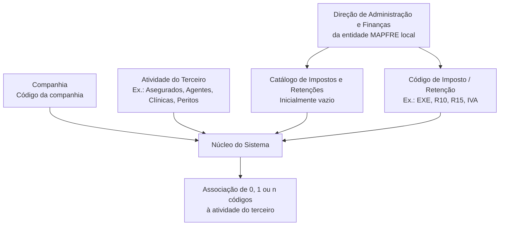

# Definição de Impostos e Retenções por Atividade de Terceiros

## 1. Metadados do Documento
- **Arquivo de Origem:** Não identificado no conteúdo fornecido
- **Tipo de Documento:** Especificação Técnica / Documento Funcional
- **Domínio / Sistema:** Catálogo de Impostos e Retenções de Terceiros; Tesouraria; entidades MAPFRE
- **Público-Alvo:** Administração e Finanças, analistas funcionais, operação local e equipes responsáveis pela parametrização do sistema
- **Data/Versão Identificada:** Não identificada

---

## 2. Resumo Executivo & Contexto de Negócio

O documento descreve a definição e a associação de impostos e retenções às atividades de terceiros no núcleo do sistema. O contexto apresentado estabelece que entidades seguradoras devem reter ou efetuar ingresso em conta quando pagam ou abonam rendas sujeitas a retenção ou ingresso em conta.

As rendas sujeitas incluem rendimentos decorrentes de atividades profissionais e outras rendas enquadradas nas disposições aplicáveis do imposto sobre a renda de pessoas físicas ou jurídicas, conforme a legislação local. O documento não especifica artigos legais, percentuais normativos adicionais ou países abrangidos.

Funcionalmente, o núcleo do sistema permite identificar e associar, para cada atividade de terceiro, zero, um ou múltiplos códigos possíveis de impostos ou retenções. O catálogo de informações é entregue inicialmente às entidades sem conteúdo.

A parametrização depende da companhia, do código de atividade do terceiro e do código de imposto ou retenção aplicável. A responsabilidade pela nomenclatura e pela definição desses códigos pertence à Direção de Administração e Finanças da entidade MAPFRE local.

---

## 3. Arquitetura, Componentes & Tecnologias Envolvidas

O documento menciona os seguintes elementos funcionais:

- **Núcleo do Sistema:** componente que identifica e associa códigos de impostos ou retenções às atividades de terceiros.
- **Catálogo de Impostos e Retenções de Terceiros:** catálogo inicialmente vazio entregue às entidades para definição local.
- **Companhia:** propriedade que identifica o código da companhia para a qual a associação é realizada.
- **Atividade do Terceiro:** classificação do terceiro, com exemplos como segurados, agentes, clínicas e peritos.
- **Código de Imposto / Retenção do Terceiro:** código associado à atividade do terceiro.
- **Direção de Administração e Finanças da entidade MAPFRE local:** área responsável pela nomenclatura e pela definição dos códigos.



**Nota de Análise:** o documento não detalha interfaces, tecnologias de implementação, métodos HTTP, contratos JSON, banco de dados, autenticação, ambientes, URLs ou rotas de integração.

---

## 4. Regras de Negócio, Especificações Funcionais & Processos

1. Entidades seguradoras são obrigadas a reter ou realizar ingresso em conta ao satisfazerem ou abonarem rendas sujeitas a retenção ou ingresso em conta.
2. O enquadramento abrange rendimentos derivados de atividades profissionais e rendas sujeitas a retenção nos termos aplicáveis ao imposto sobre a renda de pessoas físicas ou jurídicas.
3. A aplicação deve respeitar a legislação local.
4. O núcleo do sistema permite associar a cada atividade de terceiro:
   - nenhum código de imposto ou retenção;
   - um código de imposto ou retenção;
   - múltiplos códigos de impostos ou retenções.
5. O catálogo de informações é entregue inicialmente vazio às entidades.
6. A associação é realizada considerando o código da companhia.
7. A atividade do terceiro é identificada por código. O documento apresenta como exemplos: segurados, agentes, clínicas e peritos.
8. O código de imposto ou retenção identifica o imposto ou a retenção vinculada a uma atividade de terceiro.
9. Para a atividade `1 - Asegurados`, o documento exemplifica os códigos `EXE`, `R10`, `R15` e `IVA`.
10. A Direção de Administração e Finanças da entidade MAPFRE local é responsável pela nomenclatura e definição dos códigos de retenção e impostos.
11. A leitura recomendada para evitar interpretação isolada e potencialmente incorreta inclui os documentos ou diretrizes:
    - Atividades de Terceiros;
    - Códigos de Impostos e Retenções - Tesouraria.

---

## 5. Tabelas de Parâmetros, Ambientes e Estruturas de Dados

| Item / Parâmetro | Descrição / Função | Tipo / Valores / Formato | Ambiente / Observações |
| :--- | :--- | :--- | :--- |
| Companhia | Indica o código da companhia sobre a qual é realizada a associação entre imposto ou retenção e atividade do terceiro. | Código de companhia; formato não especificado. | Aplicável à associação no sistema. |
| Código de Atividade do Terceiro | Indica o código da atividade do terceiro. | Código de atividade; exemplos: Asegurados, Agentes, Clínicas, Peritos. | O documento não informa formato, domínio completo ou catálogo de valores. |
| Código do Imposto / Retenção do Terceiro | Indica o código do imposto ou retenção associado à atividade do terceiro. | Código de imposto ou retenção. | Uma atividade pode ter 0, 1 ou n códigos associados. |
| Catálogo de Impostos e Retenções | Catálogo usado para identificar e associar códigos de impostos ou retenções às atividades dos terceiros. | Catálogo de informação; estrutura não especificada. | Entregue inicialmente vazio às entidades. |
| EXE | Identifica terceiro isento. | Código. | Exemplo apresentado para atividade `1 - Asegurados`. |
| R10 | Identifica retenção de 10%. | Código. | Exemplo apresentado para atividade `1 - Asegurados`. |
| R15 | Identifica retenção de 15%. | Código. | Exemplo apresentado para atividade `1 - Asegurados`. |
| IVA | Identifica IVA. | Código. | Exemplo apresentado para atividade `1 - Asegurados`. |
| Direção de Administração e Finanças local | Responsável pela nomenclatura e definição dos códigos de retenção e impostos. | Área organizacional. | Responsabilidade da entidade MAPFRE local. |

---

## 6. Bateria de Perguntas & Respostas para RAG (FAQ Sintético)

### P1: Qual é a finalidade do catálogo de impostos e retenções de terceiros?
**R:** O catálogo permite ao núcleo do sistema identificar e associar códigos de impostos ou retenções às atividades dos terceiros. O catálogo é entregue inicialmente sem conteúdo, para que a entidade realize a definição aplicável ao seu contexto local.

### P2: Quantos códigos de imposto ou retenção podem ser associados a uma atividade de terceiro?
**R:** Cada atividade de terceiro pode possuir zero, um ou múltiplos códigos de impostos ou retenções associados.

### P3: Quais informações são necessárias para realizar a associação de imposto ou retenção à atividade de um terceiro?
**R:** O documento identifica três propriedades: o código da companhia, o código da atividade do terceiro e o código do imposto ou retenção do terceiro.

### P4: Qual é o papel da propriedade Companhia?
**R:** A propriedade Companhia informa ao sistema o código da companhia para a qual está sendo realizada a associação entre o imposto ou a retenção e a atividade do terceiro.

### P5: Quais atividades de terceiros são citadas como exemplos?
**R:** O documento cita como exemplos de atividades de terceiros: segurados, agentes, clínicas e peritos. Não é fornecida uma lista completa de atividades ou seus códigos.

### P6: Quais códigos de imposto ou retenção são exemplificados para a atividade 1 - Asegurados?
**R:** Para a atividade `1 - Asegurados`, o documento apresenta: `EXE` para terceiro isento, `R10` para retenção de 10%, `R15` para retenção de 15% e `IVA` para IVA.

### P7: Quem é responsável pela nomenclatura e definição dos códigos de retenção e impostos?
**R:** A responsabilidade pela nomenclatura e definição dos códigos de retenção e impostos corresponde à Direção de Administração e Finanças da entidade MAPFRE local.

### P8: Qual obrigação das entidades seguradoras contextualiza o uso de retenções e impostos?
**R:** As entidades seguradoras são obrigadas a reter ou realizar ingresso em conta quando satisfazem ou abonam rendas sujeitas a retenção ou ingresso em conta, incluindo rendimentos derivados de atividades profissionais ou outras rendas sujeitas às regras aplicáveis de imposto sobre a renda de pessoas físicas ou jurídicas, de acordo com a legislação local.

### P9: O documento define métodos HTTP, contratos JSON ou tecnologias usadas pelo sistema?
**R:** Não. O documento descreve regras e propriedades funcionais para associação de impostos e retenções, mas não detalha métodos HTTP, contratos JSON, tecnologias, ambientes, URLs, banco de dados ou interfaces de integração.

### P10: Quais documentos relacionados devem ser consultados para evitar interpretação isolada?
**R:** O documento recomenda a leitura de **Atividades de Terceiros** e **Códigos de Impostos e Retenções - Tesouraria**, pois a interpretação isolada do material pode conduzir a erro.

---

## 7. Glossário de Termos, Siglas & Conceitos-Chave

- **Atividade do Terceiro:** classificação ou atividade associada a um terceiro no sistema; o documento cita segurados, agentes, clínicas e peritos como exemplos.
- **Catálogo de Impostos e Retenções:** catálogo de informação que permite associar impostos ou retenções a atividades de terceiros.
- **Código de Imposto / Retenção:** identificador do imposto ou retenção associado a uma atividade de terceiro.
- **Companhia:** código da entidade sobre a qual a associação de imposto ou retenção é efetuada.
- **EXE:** código cujo significado é “Tercero Exento”.
- **IVA:** código identificado no documento como IVA; a expansão da sigla não é detalhada no conteúdo fornecido.
- **MAPFRE:** organização mencionada no contexto da Direção de Administração e Finanças local; o documento não expande a sigla ou nome.
- **R10:** código cujo significado é retenção de 10%.
- **R15:** código cujo significado é retenção de 15%.
- **Terceiro:** entidade ou pessoa cuja atividade pode receber associação de códigos de impostos ou retenções.

---

## 8. Notas Críticas, Riscos & Limitações

- O catálogo é entregue inicialmente vazio; a configuração local dos códigos é necessária para seu uso funcional.
- A nomenclatura e a definição dos códigos são responsabilidade da Direção de Administração e Finanças da entidade MAPFRE local, criando dependência da governança e das decisões de cada entidade local.
- O documento orienta que sua interpretação isolada pode conduzir a erro e recomenda a leitura de documentos funcionais relacionados.
- Não há detalhamento de regras de precedência caso múltiplos códigos sejam associados à mesma atividade de terceiro.
- Não há descrição de validações de cadastro, vigência, regras de cálculo, tratamento de exceções, trilha de auditoria ou processo de aprovação.
- Não são fornecidos ambientes, servidores, URLs, interfaces, contratos de integração, tecnologias ou dados de versão.
- **Nota de Análise:** o documento apresenta códigos de exemplo, mas não define o catálogo completo de atividades, impostos ou retenções.

---

## 9. Conteúdo Bruto Estruturado (Referência Fiel)

```text
--- [PÁGINA 1 DE 2] ---

DEFINICIÓN de Impuestos y Retenciones por
Actividad
Contexto
Las entidades Aseguradoras están obligadas a retener o ingresar a cuenta cuando satisfagan o
abonen rentas sujetas a retención o ingreso a cuenta, por los rendimientos derivados de actividades
profesionales o por tratarse de rentas sujetas a retención en los términos establecidos en los
Artículos del Impuesto de la Renta de las personas físicas o Jurídicas y de acuerdo a la Legislación
Local.
Funcionalmente, el núcleo del Sistema cuenta con la posibilidad de identificar y asociar a las
Actividades de los Terceros 0, 1 o n posibles Códigos de Impuestos o Retenciones en un catálogo de
información que se entrega a las entidades inicialmente vacío de contenido.
Compañía
Esta propiedad le indica al sistema el código de la compañía sobre la que se está realizando la
asociación del impuesto o Retención a la actividad del Tercero.
Código de Actividad del Tercero
Esta propiedad indica en el sistema el código de la Actividad del Tercero como por ejemplo
Asegurados, Agentes, Clínicas, Peritos, ...
Código del Impuesto / Retención del Tercero
 / 
 CF
Home Solutions APIs Documentation Zeus
EN


--- [PÁGINA 2 DE 2] ---

Esta propiedad indica en el sistema el código del Impuesto o Retención asociado a la actividad del
Tercero. Como ejemplo y para la actividad 1 - Asegurados:
Impuesto / Retención Significado
EXE Tercero Exento
R10 Retención 10%
R15 Retención 15%
IVA IVA
... ...
Vínculos
Relación de Directrices y Documentos funcionales cuya lectura recomendada para evitar que la
interpretación aislada del presente documento pueda conducir a error.
Actividades de Terceros
Códigos de Impuestos y Retenciones - Tesorería
Preguntas frecuentes
(1) ¿Existe alguna recomendación operativa que deba ser tomada en consideración localmente en la
codificación, uso y definición del Catálogo de Impuestos y Retenciones de Terceros en el Sistema?
La responsabilidad en la nomenclatura y definición de los códigos de retención e impuestos
corresponde a la Dirección de Administración y Finanzas de la entidad MAPFRE local.
```
