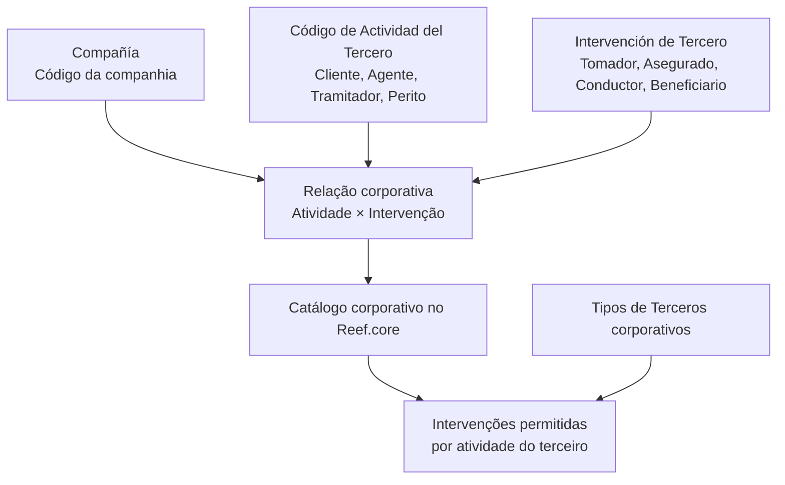
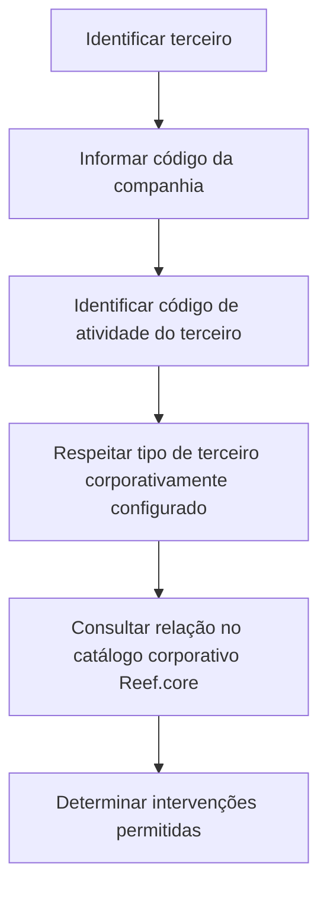

# Definición de las Intervenciones Permitidas por Código de Actividad de los Terceros

## 1. Metadados do Documento
- **Arquivo de Origem:** Não identificado
- **Tipo de Documento:** Especificação Técnica / Funcional
- **Domínio / Sistema:** Reef.core; Atividades e Intervenções de Terceiros
- **Público-Alvo:** Negócio, Analistas Funcionais, Desenvolvedores e Equipes de Configuração
- **Data/Versão Identificada:** Não identificada

---

## 2. Resumo Executivo & Contexto de Negócio

O documento define o tratamento funcional das **Intervenções Permitidas por Código de Atividade dos Terceiros** no sistema corporativo **Reef.core**. O objetivo declarado é identificar e estabelecer, em um catálogo corporativo, quais intervenções são permitidas conforme a atividade atribuída a um terceiro.

A configuração relaciona três elementos principais: a companhia, a intervenção de terceiro e o código de atividade do terceiro. A companhia delimita o código da organização sobre a qual a relação entre atividades e intervenções é estabelecida.

A intervenção de terceiro representa a forma como uma pessoa física ou jurídica participa de uma apólice ou aplicação. O documento exemplifica intervenções como Tomador, Asegurado, Conductor e Beneficiario. O código de atividade identifica a função do terceiro no sistema, com exemplos como Cliente, Agente, Tramitador e Perito.

O documento também estabelece uma restrição corporativa explícita: os códigos de atividade e os tipos de terceiros configurados corporativamente no Reef.core devem ser obrigatoriamente respeitados em codificações e usos locais.

---

## 3. Arquitetura, Componentes & Tecnologias Envolvidas

### Componentes e conceitos identificados

| Componente / Conceito | Papel descrito no documento |
| :--- | :--- |
| **Reef.core** | Sistema que identifica e estabelece, em catálogo corporativo, as intervenções permitidas de acordo com a atividade do terceiro. |
| **Catálogo corporativo** | Repositório lógico no qual a relação entre atividades de terceiros e intervenções permitidas é definida. |
| **Compañía** | Propriedade que informa o código da companhia para a qual é estabelecida a relação entre atividades e intervenções. |
| **Intervención de Tercero** | Atributo que determina como uma pessoa física ou jurídica intervém em uma apólice ou aplicação. |
| **Código de Actividad del Tercero** | Propriedade que informa o código da atividade do terceiro no sistema. |
| **Tipos de Terceros** | Configurações corporativas que devem ser obrigatoriamente respeitadas. |
| **Home Solutions APIs Documentation Zeus** | Referência listada na seção de vínculos do documento, sem detalhamento adicional. |
| **CF** | Referência listada na seção de vínculos do documento, sem detalhamento adicional. |



> **Nota de Análise:** O documento não detalha interfaces, APIs, métodos HTTP, contratos JSON, modelo físico de dados, tecnologias de infraestrutura ou mecanismos de persistência do Reef.core.

---

## 4. Regras de Negócio, Especificações Funcionais & Processos

1. O Reef.core deve identificar e estabelecer, em um catálogo corporativo, as intervenções permitidas conforme a atividade de um terceiro.
2. A relação entre atividades e intervenções deve ser estabelecida para uma companhia identificada por seu código de companhia.
3. A intervenção de terceiro deve representar a maneira pela qual uma pessoa física ou jurídica participa de uma apólice ou aplicação.
4. O código de atividade do terceiro deve representar a atividade do terceiro no sistema.
5. Devem ser respeitados obrigatoriamente os códigos de atividade configurados corporativamente no Reef.core.
6. Devem ser respeitados obrigatoriamente os tipos de terceiros configurados corporativamente no Reef.core.
7. A codificação e o uso local das atividades de terceiros não podem desconsiderar as configurações corporativas de códigos de atividade e tipos de terceiros.
8. A leitura de diretrizes e documentos funcionais vinculados é recomendada para evitar interpretações isoladas e incorretas do documento.

### Fluxo funcional identificado



> **Nota de Análise:** O documento não informa o comportamento do sistema quando uma combinação entre companhia, atividade, tipo de terceiro e intervenção não estiver configurada no catálogo corporativo.

---

## 5. Tabelas de Parâmetros, Ambientes e Estruturas de Dados

| Item / Parâmetro | Descrição / Função | Tipo / Valores / Formato | Ambiente / Observações |
| :--- | :--- | :--- | :--- |
| Companhia | Indica o código da companhia sobre a qual é estabelecida a relação entre atividades e intervenções. | Código de companhia; formato não detalhado. | Aplicável à relação de atividades e intervenções. |
| Intervenção de Terceiro | Determina como uma pessoa física ou jurídica intervém em uma apólice ou aplicação. | Exemplos: Tomador, Asegurado, Conductor, Beneficiario. | O conjunto completo de intervenções não é detalhado. |
| Código de Atividade do Terceiro | Indica o código da atividade do terceiro no sistema. | Exemplos: Cliente, Agente, Tramitador, Perito. | Os códigos corporativos devem ser obrigatoriamente respeitados. |
| Tipo de Terceiro | Configuração corporativa associada ao uso das atividades de terceiros. | Valores não detalhados. | Deve ser obrigatoriamente respeitado no Reef.core. |
| Catálogo corporativo | Estabelece as intervenções permitidas conforme a atividade do terceiro. | Estrutura e tecnologia não detalhadas. | Gerenciado funcionalmente pelo Reef.core. |
| Home Solutions APIs Documentation Zeus | Documento ou referência vinculada. | Não detalhado. | Leitura recomendada pelo documento. |
| CF | Documento ou referência vinculada. | Não detalhado. | Leitura recomendada pelo documento. |

---

## 6. Bateria de Perguntas & Respostas para RAG (FAQ Sintético)

### P1: Qual é o objetivo da definição de intervenções permitidas por código de atividade dos terceiros?
**R:** O objetivo é permitir que o Reef.core identifique e estabeleça, em um catálogo corporativo, quais intervenções são permitidas de acordo com a atividade atribuída a um terceiro.

### P2: Qual sistema administra funcionalmente as intervenções permitidas por atividade de terceiros?
**R:** O documento atribui essa função ao Reef.core, que identifica e estabelece em um catálogo corporativo as intervenções permitidas conforme a atividade do terceiro.

### P3: O que representa a propriedade Compañía?
**R:** A propriedade Compañía informa o código da companhia sobre a qual é estabelecida a relação entre as atividades dos terceiros e suas intervenções.

### P4: O que é uma Intervención de Tercero no contexto do Reef.core?
**R:** A Intervención de Tercero é o atributo que determina como uma pessoa física ou jurídica intervém em uma apólice ou aplicação. O documento cita Tomador, Asegurado, Conductor e Beneficiario como exemplos.

### P5: O que informa o Código de Actividad del Tercero?
**R:** O Código de Actividad del Tercero informa no sistema o código da atividade do terceiro. O documento apresenta Cliente, Agente, Tramitador e Perito como exemplos de atividades.

### P6: Quais configurações corporativas devem ser respeitadas no uso local das atividades de terceiros?
**R:** Devem ser obrigatoriamente respeitados tanto os códigos de atividade quanto os tipos de terceiros configurados corporativamente no Reef.core.

### P7: É permitido criar ou utilizar localmente códigos de atividade diferentes dos configurados corporativamente?
**R:** O documento estabelece que os códigos de atividade configurados corporativamente no Reef.core devem ser obrigatoriamente respeitados. Portanto, a codificação e o uso local devem observar essa configuração corporativa.

### P8: Quais são os exemplos de intervenções de terceiro apresentados?
**R:** Os exemplos apresentados são Tomador, Asegurado, Conductor e Beneficiario. O documento não afirma que a lista seja exaustiva.

### P9: Quais são os exemplos de atividades de terceiros apresentados?
**R:** Os exemplos apresentados são Cliente, Agente, Tramitador e Perito. O documento não detalha todos os códigos de atividade existentes.

### P10: O documento especifica APIs ou contratos de integração do Reef.core?
**R:** Não. Embora “Home Solutions APIs Documentation Zeus” seja mencionado como vínculo, o documento não especifica APIs, métodos HTTP, URLs, contratos JSON ou detalhes de integração.

### P11: Por que a leitura dos vínculos documentais é recomendada?
**R:** A leitura de diretrizes e documentos funcionais vinculados é recomendada para evitar que uma interpretação isolada deste documento conduza a erro.

---

## 7. Glossário de Termos, Siglas & Conceitos-Chave

- **Reef.core:** Sistema que identifica e estabelece, em catálogo corporativo, as intervenções permitidas conforme a atividade do terceiro.
- **Compañía:** Propriedade que informa o código da companhia para a qual a relação entre atividades e intervenções é definida.
- **Intervención de Tercero:** Atributo que determina como uma pessoa física ou jurídica intervém em uma apólice ou aplicação.
- **Código de Actividad del Tercero:** Propriedade que informa o código da atividade desempenhada pelo terceiro no sistema.
- **Tipos de Terceros:** Configurações corporativas que devem ser respeitadas no uso das atividades de terceiros.
- **Tomador:** Exemplo de intervenção de terceiro citado no documento.
- **Asegurado:** Exemplo de intervenção de terceiro citado no documento.
- **Conductor:** Exemplo de intervenção de terceiro citado no documento.
- **Beneficiario:** Exemplo de intervenção de terceiro citado no documento.
- **Cliente:** Exemplo de atividade de terceiro citado no documento.
- **Agente:** Exemplo de atividade de terceiro citado no documento.
- **Tramitador:** Exemplo de atividade de terceiro citado no documento.
- **Perito:** Exemplo de atividade de terceiro citado no documento.
- **CF:** Referência vinculada mencionada no documento, sem expansão ou definição apresentada.
- **Home Solutions APIs Documentation Zeus:** Referência vinculada mencionada no documento, sem detalhamento apresentado.

---

## 8. Notas Críticas, Riscos & Limitações

- O documento não identifica arquivo de origem, autor, data, versão ou responsável pela manutenção.
- O documento não apresenta uma matriz completa de combinações permitidas entre companhia, atividade, tipo de terceiro e intervenção.
- O documento não detalha o comportamento para combinações inválidas, inexistentes ou não configuradas.
- O documento não especifica métodos de manutenção do catálogo corporativo, aprovações, perfis de acesso ou trilhas de auditoria.
- O documento não define tecnologias, endpoints, contratos, modelos de dados ou integrações do Reef.core.
- A interpretação isolada do conteúdo pode conduzir a erro; o próprio documento recomenda a leitura das diretrizes e documentos funcionais vinculados.
- **Risco operacional:** codificações locais que não respeitem os códigos de atividade ou os tipos de terceiros corporativamente configurados no Reef.core violam a regra explícita do documento.

---

## 9. Conteúdo Bruto Estruturado (Referência Fiel)

```text
--- [PÁGINA 1 DE 2] ---

DEFINICIÓN de las Intervenciones Permitidas
por Código de Actividad de los Terceros
Objetivo
Funcionalmente, Reef.core identifica y establece en un catálogo corporativo las Intervenciones que
están permitidas de acuerdo con la Actividad del Tercero.
Compañía
Esta propiedad le indica al sistema el código de la compañía sobre la que se establece la relación de
las Actividades y sus Intervenciones
Intervención de Tercero
Este atributo determina la manera en la que interviene una persona, física o jurídica, en una póliza o
aplicación (Tomador, Asegurado, Conductor, Beneficiario,..)
Código de Actividad del Tercero
Esta propiedad indica en el sistema el código de la Actividad del Tercero (Cliente, Agente,Tramitador,
Perito,...)
Vínculos
Relación de Directrices y Documentos funcionales cuya lectura recomendada para evitar que la
interpretación aislada del presente documento pueda conducir a error.
 / 
 CF
Home Solutions APIs Documentation Zeus
EN


--- [PÁGINA 2 DE 2] ---

Actividades de los Terceros
Preguntas frecuentes
1 ¿Existe alguna recomendación que deba ser tomada en consideración localmente en la
codificación y uso de las Actividades de Terceros en el Sistema?
Se tienen que respetar obligatoriamente tanto los códigos de actividad commo los Tipos de
Terceros configurados corporativamente en Reef.core.
```
