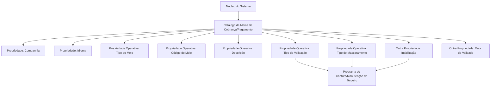

# Definição das Classificações dos Meios de Cobrança/Pagamento

## 1. Metadados do Documento
- **Arquivo de Origem:** Não identificado; conteúdo bruto fornecido com 4 páginas.
- **Tipo de Documento:** Especificação Técnica / Manual Funcional.
- **Domínio / Sistema:** Catálogo de classificação dos meios de cobrança e pagamento de terceiros.
- **Público-Alvo:** Desenvolvedores, analistas funcionais, operação e equipes responsáveis pela configuração do sistema.
- **Data/Versão Identificada:** Não identificada.

---

## 2. Resumo Executivo & Contexto de Negócio

O documento descreve a definição e a classificação dos meios de cobrança e pagamento utilizados por terceiros no sistema. O núcleo do sistema disponibiliza um catálogo específico para codificar e classificar esses meios, inicialmente entregue sem conteúdo nas instalações.

A classificação de um meio de cobrança/pagamento é composta por propriedades gerais, propriedades operacionais e outras propriedades. As propriedades gerais contextualizam a definição por companhia e idioma; as operacionais determinam o tipo, código, descrição, validação e mascaramento do meio; e as demais propriedades controlam inabilitação e vigência.

O catálogo permite associar um ou mais códigos a um mesmo tipo de meio de cobrança/pagamento. Os exemplos apresentados incluem contas bancárias, pagamentos móveis/celulares e cartões bancários, com códigos como `001`, `AAA` e `AA1`.

O processo de captura ou manutenção de terceiros deve respeitar os tipos de meios de cobrança/pagamento, os tipos de validação e os tipos de mascaramento previamente definidos e habilitados pelo núcleo do sistema. Essa obrigatoriedade visa manter coerência operacional e impedir o uso de configurações não suportadas.

---

## 3. Arquitetura, Componentes & Tecnologias Envolvidas

O documento não descreve tecnologias, servidores, protocolos, APIs, microsserviços ou ambientes técnicos. A arquitetura funcional identificável é composta pelo núcleo do sistema, pelo catálogo de classificação de meios de cobrança/pagamento e pelos programas de captura/manutenção de terceiros.



**Nota de Análise:** o documento menciona o núcleo do sistema e o programa de captura/manutenção do terceiro, mas não detalha nomes de aplicações, tecnologias, contratos de integração, métodos HTTP, bases de dados ou rotas técnicas.

---

## 4. Regras de Negócio, Especificações Funcionais & Processos

1. O núcleo do sistema permite codificar e classificar os meios de cobrança e pagamento de terceiros em um catálogo de informação específico.
2. O catálogo de classificação é inicialmente entregue às instalações sem conteúdo.
3. A propriedade **Companhia** identifica o código da companhia para a qual está sendo definida a classificação do meio de cobrança ou pagamento.
4. A propriedade **Idioma** identifica o idioma utilizado na definição do registro, com exemplos de espanhol, inglês e turco.
5. O **Tipo do Meio de Cobrança/Pagamento** indica o tipo associado à classificação do meio.
6. O **Código do Meio de Cobrança/Pagamento** identifica o meio definido no sistema.
7. Um mesmo tipo de meio de cobrança/pagamento pode possuir um ou vários códigos.
8. A **Descrição do Meio de Cobrança/Pagamento** representa a denominação do meio no idioma utilizado na definição do registro.
9. O **Tipo de Validação** deve indicar o método que será utilizado pelo programa de captura/manutenção do terceiro para validar o dado informado.
10. O tipo de validação deve ser definido de acordo com o tipo de meio de cobrança/pagamento associado ao código do meio.
11. O **Tipo de Mascaramento** deve indicar o método usado pelo programa de captura/manutenção do terceiro para visualizar o dado informado.
12. O tipo de mascaramento deve ser definido de acordo com o tipo de meio de cobrança/pagamento associado ao código do meio.
13. A propriedade **Inabilitação** informa ao sistema que o meio de cobrança/pagamento não pode ser utilizado em operações de captura e/ou modificação do terceiro.
14. A propriedade **Data de Validade** informa a data a partir da qual o meio de cobrança/pagamento está plenamente operativo no sistema.
15. A data de validade permite manter um histórico das alterações realizadas nas definições dos meios.
16. É obrigatório respeitar os valores dos tipos de meios de cobrança/pagamento, tipos de validação e tipos de mascaramento definidos e habilitados pelo núcleo do sistema.
17. A leitura da diretriz ou documento funcional sobre **Entidades Comercializadoras dos Meios de Cobrança/Pagamento** é recomendada para evitar interpretações isoladas e incorretas do presente documento.

---

## 5. Tabelas de Parâmetros, Ambientes e Estruturas de Dados

| Item / Parâmetro | Descrição / Função | Tipo / Valores / Formato | Ambiente / Observações |
| :--- | :--- | :--- | :--- |
| Companhia | Indica o código da companhia para a qual a classificação do meio de cobrança/pagamento está sendo definida. | Código de companhia. | Não detalhado. |
| Idioma | Indica o idioma empregado na definição do registro. | Exemplos: espanhol, inglês, turco. | Não detalhado. |
| Tipo do Meio de Cobrança/Pagamento | Indica o tipo associado à classificação do meio de cobrança/pagamento. | Tipos definidos corporativamente no sistema. | Deve respeitar valores habilitados pelo núcleo do sistema. |
| Código do Meio de Cobrança/Pagamento | Identifica o meio de cobrança/pagamento definido no sistema. | Um ou vários códigos podem existir para um mesmo tipo de meio. | Não detalhado. |
| Descrição do Meio de Cobrança/Pagamento | Define a denominação ou descrição do meio conforme o idioma do registro. | Texto descritivo. | Associada ao idioma da definição. |
| Tipo de Validação | Define o método empregado para validar o dado informado no programa de captura/manutenção do terceiro. | Método de validação. | Deve ser coerente com o tipo do meio e estar habilitado pelo núcleo. |
| Tipo de Mascaramento | Define o método empregado para visualizar o dado informado no programa de captura/manutenção do terceiro. | Método de mascaramento. | Deve ser coerente com o tipo do meio e estar habilitado pelo núcleo. |
| Inabilitação | Indica que o meio de cobrança/pagamento não pode ser usado na captura e/ou modificação do terceiro. | Indicador de inabilitação. | Não detalhado. |
| Data de Validade | Indica a data a partir da qual o meio está plenamente operativo. | Data. | Permite histórico de alterações nas definições. |

| Código do Meio | Tipo do Meio | Descrição |
| :--- | :--- | :--- |
| `001` | Conta Bancária | Conta Corrente |
| `002` | Conta Bancária | Conta de Valores |
| `003` | Conta Bancária | Conta Poupança |
| `004` | Conta Bancária | Conta On-Line |
| `AAA` | Pagamento Móvel/Celular | Apple Pay |
| `AAB` | Pagamento Móvel/Celular | Samsung Pay |
| `AAC` | Pagamento Móvel/Celular | Google Pay |
| `AA1` | Cartão Bancário | Crédito |
| `AA2` | Cartão Bancário | Débito |
| `AA3` | Cartão Bancário | Revolving |
| `AA4` | Cartão Bancário | Pré-pago / Carteira |

**Nota de Análise:** o documento não informa formatos técnicos para códigos, datas, tipos de validação ou tipos de mascaramento. Também não especifica ambientes, URLs, logs, APIs ou estruturas persistentes.

---

## 6. Bateria de Perguntas & Respostas para RAG (FAQ Sintético)

### P1: Qual é a finalidade do catálogo de meios de cobrança e pagamento de terceiros?
**R:** O catálogo permite que o núcleo do sistema codifique e classifique os meios de cobrança e pagamento utilizados por terceiros. O catálogo é específico para essas informações e é inicialmente entregue às instalações sem conteúdo.

### P2: Quais propriedades gerais devem ser definidas para uma classificação de meio de cobrança ou pagamento?
**R:** As propriedades gerais identificadas são Companhia e Idioma. Companhia indica o código da companhia para a qual a classificação está sendo definida, enquanto Idioma identifica o idioma empregado na definição do registro.

### P3: Um mesmo tipo de meio de cobrança/pagamento pode possuir mais de um código?
**R:** Sim. O documento estabelece que, para um mesmo tipo de meio de cobrança/pagamento, podem ser definidos um ou vários códigos.

### P4: Para que serve o tipo de validação de um meio de cobrança/pagamento?
**R:** O tipo de validação determina o método que o programa de captura/manutenção do terceiro utilizará para validar o dado informado. O método deve ser escolhido de acordo com o tipo de meio de cobrança/pagamento associado ao respectivo código.

### P5: Para que serve o tipo de mascaramento de um meio de cobrança/pagamento?
**R:** O tipo de mascaramento indica o método que o programa de captura/manutenção do terceiro utilizará para visualizar o dado informado. O mascaramento deve estar relacionado ao tipo de meio de cobrança/pagamento associado ao código.

### P6: O que acontece quando um meio de cobrança/pagamento é marcado como inabilitado?
**R:** Um meio marcado como inabilitado não pode ser utilizado nas operações de captura e/ou modificação do terceiro.

### P7: Qual é a função da data de validade na definição de um meio de cobrança/pagamento?
**R:** A data de validade informa a partir de qual data o meio de cobrança/pagamento está plenamente operativo no sistema. O uso dessa data também permite manter o histórico de mudanças efetuadas nas definições dos meios.

### P8: Quais configurações devem obrigatoriamente respeitar os valores habilitados pelo núcleo do sistema?
**R:** É obrigatório respeitar os valores dos tipos de meios de cobrança/pagamento, dos tipos de validação e dos tipos de mascaramento definidos e habilitados pelo núcleo do sistema.

### P9: Quais exemplos de códigos existem para o tipo Conta Bancária?
**R:** Os exemplos apresentados são `001` para Conta Corrente, `002` para Conta de Valores, `003` para Conta Poupança e `004` para Conta On-Line.

### P10: Quais exemplos de meios de pagamento móvel/celular são apresentados?
**R:** O documento apresenta `AAA` para Apple Pay, `AAB` para Samsung Pay e `AAC` para Google Pay, todos classificados como Pagamento Móvel/Celular.

### P11: Quais exemplos de modalidades de cartão bancário são apresentados?
**R:** Os exemplos são `AA1` para Crédito, `AA2` para Débito, `AA3` para Revolving e `AA4` para Pré-pago / Carteira.

### P12: O documento detalha os formatos dos dados, APIs ou tecnologias utilizadas pelo sistema?
**R:** Não. O documento descreve propriedades funcionais do catálogo e regras de uso, mas não detalha formatos técnicos de dados, APIs, tecnologias, ambientes, servidores, URLs ou mecanismos de persistência.

---

## 7. Glossário de Termos, Siglas & Conceitos-Chave

- **Meio de Cobrança/Pagamento:** instrumento ou modalidade classificada no sistema para operações de cobrança ou pagamento de terceiros.
- **Terceiro:** entidade cujos dados de meios de cobrança/pagamento são capturados ou modificados no sistema.
- **Catálogo:** estrutura específica disponibilizada pelo núcleo do sistema para codificar e classificar meios de cobrança/pagamento.
- **Companhia:** código da companhia sobre a qual é realizada a definição da classificação.
- **Tipo do Meio:** categoria associada a um código de meio de cobrança/pagamento.
- **Código do Meio:** identificador do meio de cobrança/pagamento definido no sistema.
- **Tipo de Validação:** método usado para validar o dado informado no programa de captura/manutenção do terceiro.
- **Tipo de Mascaramento:** método usado para visualizar o dado informado no programa de captura/manutenção do terceiro.
- **Inabilitação:** condição que impede o uso do meio de cobrança/pagamento em operações de captura e/ou modificação.
- **Data de Validade:** data a partir da qual um meio de cobrança/pagamento está plenamente operativo.
- **Revolving:** descrição apresentada para o código `AA3` do tipo Cartão Bancário; o documento não fornece detalhamento adicional.
- **Apple Pay / Samsung Pay / Google Pay:** descrições apresentadas para códigos do tipo Pagamento Móvel/Celular.

---

## 8. Notas Críticas, Riscos & Limitações

- O catálogo é inicialmente entregue vazio; portanto, a configuração inicial dos meios de cobrança/pagamento é necessária para sua utilização.
- O documento exige que tipos de meios, validações e mascaramentos respeitem exclusivamente valores definidos e habilitados pelo núcleo do sistema.
- Um meio inabilitado não pode ser utilizado em operações de captura e/ou modificação do terceiro.
- A ausência ou uso incorreto da data de validade pode comprometer o histórico das alterações de definições dos meios.
- A interpretação isolada do documento pode conduzir a erro; é recomendada a leitura do documento funcional relacionado a Entidades Comercializadoras dos Meios de Cobrança/Pagamento.
- O documento não detalha métodos de validação, máscaras, formatos de dados, tipos de campos, contratos de integração, APIs, versões, responsáveis, ambientes ou procedimentos de implantação.
- **Nota de Análise:** os exemplos de códigos apresentados não devem ser interpretados como catálogo completo ou como valores obrigatórios universais; o texto os apresenta como exemplos.

---

## 9. Conteúdo Bruto Estruturado (Referência Fiel)

```text
--- [PÁGINA 1 DE 4] ---

DEFINICIÓN de las Clasificaciones de los
Medios de Cobro/Pago
Propiedades Generales
Propiedades Operativas
Otras Propiedades
Propiedades Generales
Funcionalmente, el núcleo del Sistema cuenta con la posibilidad de Codificar y Clasificar los medios
de Cobro y Pago de los Terceros en un catálogo de información específico que se entrega
inicialmente a las instalaciones vacío de contenido.
Compañía
Esta propiedad le indica al sistema el código de la compañía sobre la que se está realizando la
definición de la Clasificación. del Medio del Cobro o Pago.
Idioma
Esta propiedad le indica al sistema el Idioma empleado en la definición como por ejemplo: español,
inglés, turco, ...
Propiedades Operativas
Tipo del Medio de Cobro/Pago
 /
 CF
Home Solutions APIs Documentation Zeus
EN


--- [PÁGINA 2 DE 4] ---

Este Atributo indica el Tipo del Medio de Cobro/Pago que va a tener asociada la Clasificación del
Medio de Cobro/Pago.
Código del Medio de Cobro/Pago
Esta propiedad indicará el código del Medio de Cobro/Pago que se está definiendo en el Sistema
pudiendo definir para un mismo Tipo de Medio de Cobro/Pago uno o varios Códigos.
Descripción del Medio de Cobro/Pago
Esta propiedad indica la denominación o descripción de acuerdo con el idioma en el que se está
definiendo el registro en el Sistema.
A modo de ejemplo, en español y de acuerdo con los tipos de los medios de cobro/pago configurados
corporativamente en el sistema y asociados a los códigos podríamos tener...
CÓDIGO MEDIO COBRO/PAGO. TIPO MEDIO Descripción
001 Cuenta Bancaria Cuenta Corriente
002 Cuenta Bancaria Cuenta de Valores
003 Cuenta Bancaria Cuenta Ahorro
004 Cuenta Bancaria Cuenta On-Line
... ... ...
AAA Pago Móvil/Celular Apple Pay
AAB Pago Móvil/Celular Samsung Pay
AAC Pago Móvil/Celular Google Pay
... ... ...
AA1 Tarjeta Bancaria Crédito
AA2 Tarjeta Bancaria Débito
AA3 Tarjeta Bancaria Revolving


--- [PÁGINA 3 DE 4] ---

CÓDIGO MEDIO COBRO/PAGO. TIPO MEDIO Descripción
AA4 Tarjeta Bancaria Pre pago / Monedero
... ... ...
Tipo de Validación de los Medios de Cobro o Pago
De acuerdo con el Tipo del Medio de Cobro/Pago que tenga asociado el código del Medio de
Cobro/Pago, el valor de este Atributo debe indicar el método de validación que se va a utilizar en el
programa de captura/mantenimiento del Tercero para validar el dato introducido.
Tipo de Enmascaramiento de los Medios de Cobro o Pago
De igual manera, de acuerdo con el Tipo del Medio de Cobro/Pago que tenga asociado el código
del Medio de Cobro/Pago el valor de este Atributo indicará el método de enmascaramiento que se va
a emplear en el programa de captura/mantenimiento del Tercero para visualizar el dato introducido.
Otras Propiedades
Inhabilitación
Esta propiedad le indica al Sistema que el Medio de Cobro/Pago está inhabilitado para poder ser
utilizado en las operaciones de captura y/o modificación del Tercero.
Fecha de Validez
Esta propiedad le indica al Sistema la fecha a partir de la cual el Medio de Cobro o Pago está
plenamente operativo en el sistema por lo que su correcto uso permite tener un histórico de los
cambios efectuados en las definiciones de los medios.
Vínculos
Relación de Directrices y Documentos funcionales cuya lectura recomendada para evitar que la
interpretación aislada del presente documento pueda conducir a error.
Entidades Comercializadoras de los Medios de Cobro/Pago
Preguntas frecuentes
(1) ¿Existe alguna recomendación operativa que deba ser tomada en consideración localmente en la
codificación, uso y definición de los Códigos de Medios de Cobro/Pago de los Terceros en el
Sistema?


--- [PÁGINA 4 DE 4] ---

Es obligatorio  respetar los valores de los Tipos del Medio de Cobro/Pago, Tipos de
Validaciones y Tipos de Enmascaramientos definidos y habilitados por el núcleo del Sistema.
```
