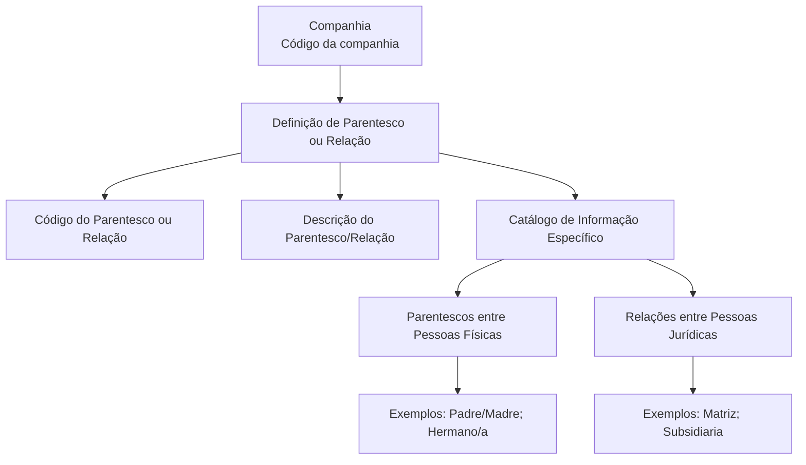

# Definição de Parentescos e Relações entre Terceiros — Catálogo de Informações

## 1. Metadados do Documento
- **Arquivo de Origem:** Não identificado; conteúdo bruto fornecido na solicitação.
- **Tipo de Documento:** Especificação Funcional.
- **Domínio / Sistema:** Sistema corporativo de Terceiros; contexto mencionado: MAPFRE.
- **Público-Alvo:** Negócio, analistas funcionais, desenvolvedores e operação.
- **Data/Versão Identificada:** Não identificada.

---

## 2. Resumo Executivo & Contexto de Negócio

O documento descreve a definição de parentescos entre pessoas físicas e de relações entre pessoas jurídicas no núcleo do Sistema. Essas classificações são mantidas em um catálogo de informação específico, fornecido inicialmente sem conteúdo para as entidades.

A funcionalidade permite que cada entidade codifique os tipos de parentesco ou relação aplicáveis aos seus Terceiros. O cadastro é associado a uma companhia e contém, no mínimo, um código e uma descrição para cada parentesco ou relação definido.

Os exemplos apresentados incluem relações de pessoas físicas, como `Padre/Madre` e `Hermano/a`, e relações corporativas entre pessoas jurídicas, como `Matriz` e `Subsidiaria`. O documento não apresenta detalhamento sobre telas, APIs, mecanismos de persistência, fluxos de aprovação ou regras técnicas de validação.

O material também indica a necessidade de consultar documentos funcionais relacionados, incluindo “Actividades de Terceros” e “Preguntas frecuentes”, para evitar interpretações isoladas incorretas. Não existe recomendação operacional para padronizar a codificação das relações ou parentescos; entretanto, a entidade MAPFRE deve avaliar a conveniência de utilizar esse catálogo de forma transversal nos processos da companhia.

---

## 3. Arquitetura, Componentes & Tecnologias Envolvidas

Os componentes funcionais explicitamente identificados são:

| Componente / Conceito | Função descrita |
| :--- | :--- |
| Núcleo do Sistema | Permite identificar e codificar parentescos entre pessoas físicas e relações entre pessoas jurídicas. |
| Catálogo de Informação | Repositório específico para os possíveis parentescos e relações entre Terceiros. É entregue inicialmente vazio às entidades. |
| Companhia | Propriedade que identifica o código da companhia para a qual está sendo definida a relação ou o parentesco. |
| Terceiro | Entidade para a qual os parentescos e relações são classificados. |
| MAPFRE | Entidade que deve analisar a conveniência de uso transversal do catálogo nos processos da companhia. |
| Actividades de Terceros | Documento funcional relacionado, recomendado para leitura. |
| Preguntas frecuentes | Documento relacionado, recomendado para leitura. |



> **Nota de Análise:** O documento não detalha tecnologias de implementação, bancos de dados, serviços, métodos HTTP, contratos JSON, ambientes, URLs, rotas de log ou mecanismos de integração.

---

## 4. Regras de Negócio, Especificações Funcionais & Processos

1. O núcleo do Sistema possui capacidade de identificar e codificar possíveis parentescos entre pessoas físicas.
2. O núcleo do Sistema possui capacidade de identificar e codificar relações entre pessoas jurídicas.
3. Os parentescos e relações são registrados em um catálogo de informação específico.
4. O catálogo de informação específico é entregue às entidades inicialmente vazio de conteúdo.
5. A propriedade **Compañía** informa o código da companhia sobre a qual está sendo realizada a definição do parentesco ou relação entre Terceiros.
6. A propriedade **Código del Parentesco o Relación del Tercero** informa o código do parentesco ou relação que está sendo definido no Sistema.
7. A propriedade **Descripción del Parentesco/Relación del Tercero** informa a denominação ou descrição da agrupação do Terceiro.
8. O catálogo pode conter classificações de parentesco entre pessoas físicas, como:
   - `01` — `Padre/Madre`;
   - `02` — `Hermano/a`.
9. O catálogo pode conter classificações de relação entre pessoas jurídicas, como:
   - `AA` — `Matriz`;
   - `AB` — `Subsidiaria`.
10. Não existe preferência ou recomendação para estabelecer ou padronizar a codificação das relações ou parentescos de Terceiros no Sistema.
11. A entidade MAPFRE deve analisar a conveniência de usar transversalmente esse catálogo de informação nos processos da companhia.
12. A interpretação do documento deve considerar a leitura dos documentos funcionais relacionados, pois uma interpretação isolada pode conduzir a erro.

> **Nota de Análise:** O documento não especifica obrigatoriedade dos campos, unicidade dos códigos, tamanho ou formato dos valores, regras de inclusão, alteração, exclusão, aprovação ou vigência dos registros.

---

## 5. Tabelas de Parâmetros, Ambientes e Estruturas de Dados

| Item / Parâmetro | Descrição / Função | Tipo / Valores / Formato | Ambiente / Observações |
| :--- | :--- | :--- | :--- |
| Compañía | Indica o código da companhia para a qual é realizada a definição do parentesco ou relação entre Terceiros. | Código de companhia; formato não detalhado. | Não detalhado. |
| Código del Parentesco o Relación del Tercero | Indica o código do parentesco ou relação do Terceiro que está sendo definido. | Exemplos: `01`, `02`, `AA`, `AB`. | Não há padronização recomendada pelo documento. |
| Descripción del Parentesco/Relación del Tercero | Indica a denominação ou descrição da agrupação do Terceiro. | Texto; formato não detalhado. | Não detalhado. |
| `01` | Pai/Mãe. | Relação / Parentesco. | Exemplo de pessoa física. |
| `02` | Irmão/Irmã. | Relação / Parentesco. | Exemplo de pessoa física. |
| `AA` | Matriz. | Relação / Parentesco. | Exemplo de pessoa jurídica. |
| `AB` | Subsidiária. | Relação / Parentesco. | Exemplo de pessoa jurídica. |
| Catálogo de Informação | Catálogo específico para parentescos entre pessoas físicas e relações entre pessoas jurídicas. | Inicialmente vazio. | Entregue às entidades. |
| Actividades de Terceros | Documento funcional de leitura recomendada. | Referência documental. | Visa evitar interpretação isolada incorreta. |
| Preguntas frecuentes | Documento de leitura recomendada. | Referência documental. | Visa evitar interpretação isolada incorreta. |

---

## 6. Bateria de Perguntas & Respostas para RAG (FAQ Sintético)

### P1: Qual é a finalidade do catálogo de parentescos e relações entre Terceiros?
**R:** O catálogo de informação específico permite ao núcleo do Sistema identificar e codificar possíveis parentescos entre pessoas físicas e relações entre pessoas jurídicas associadas a Terceiros.

### P2: O catálogo de parentescos e relações já vem preenchido para as entidades?
**R:** Não. O documento informa que o catálogo de informação específico é entregue às entidades inicialmente vazio de conteúdo.

### P3: Para que serve a propriedade Compañía na definição de parentesco ou relação?
**R:** A propriedade Compañía indica o código da companhia sobre a qual está sendo realizada a definição do parentesco ou da relação entre Terceiros.

### P4: O que representa o Código del Parentesco o Relación del Tercero?
**R:** Esse campo representa o código do parentesco ou da relação do Terceiro que está sendo definido no Sistema. O documento apresenta exemplos como `01`, `02`, `AA` e `AB`.

### P5: Qual é a função da Descripción del Parentesco/Relación del Tercero?
**R:** A descrição informa a denominação ou a descrição da agrupação do Terceiro associada ao código de parentesco ou relação.

### P6: Quais exemplos de parentescos entre pessoas físicas são apresentados?
**R:** O documento apresenta `01` para `Padre/Madre` e `02` para `Hermano/a` como exemplos de relações ou parentescos entre pessoas físicas.

### P7: Quais exemplos de relações entre pessoas jurídicas são apresentados?
**R:** O documento apresenta `AA` para `Matriz` e `AB` para `Subsidiaria` como exemplos de relações entre pessoas jurídicas.

### P8: Existe uma codificação obrigatória ou recomendada para parentescos e relações de Terceiros?
**R:** Não. O documento declara que não existe preferência nem recomendação para estabelecer ou padronizar no Sistema a codificação das relações ou parentescos de Terceiros.

### P9: Qual decisão cabe à entidade MAPFRE sobre esse catálogo?
**R:** A entidade MAPFRE deve analisar a conveniência de utilizar transversalmente, nos processos da companhia, o catálogo de relações e parentescos de Terceiros.

### P10: Quais documentos devem ser consultados junto com esta definição funcional?
**R:** O documento recomenda consultar “Actividades de Terceros” e “Preguntas frecuentes”, pois a interpretação isolada do material pode conduzir a erro.

### P11: O documento define APIs, métodos HTTP ou contratos de integração para o catálogo?
**R:** Não. O conteúdo fornecido não detalha APIs, métodos HTTP, contratos JSON, tecnologias, integrações ou mecanismos técnicos de persistência.

### P12: O documento especifica regras de validação para os códigos ou descrições do catálogo?
**R:** Não. O conteúdo identifica os campos Companhia, código e descrição, mas não especifica validações, obrigatoriedade, tamanho, unicidade ou formato técnico desses valores.

---

## 7. Glossário de Termos, Siglas & Conceitos-Chave

- **Terceiro:** Entidade para a qual o Sistema pode definir e codificar parentescos ou relações.
- **Parentesco:** Vínculo entre pessoas físicas, exemplificado por `Padre/Madre` e `Hermano/a`.
- **Relação:** Vínculo entre pessoas jurídicas, exemplificado por `Matriz` e `Subsidiaria`.
- **Catálogo de Informação:** Repositório específico entregue inicialmente vazio às entidades para registrar parentescos e relações.
- **Compañía:** Propriedade que identifica o código da companhia relacionada à definição de parentesco ou relação.
- **Matriz:** Exemplo de relação entre pessoas jurídicas associado ao código `AA`.
- **Subsidiaria:** Exemplo de relação entre pessoas jurídicas associado ao código `AB`.
- **MAPFRE:** Entidade mencionada como responsável por analisar a conveniência do uso transversal do catálogo nos processos da companhia.

---

## 8. Notas Críticas, Riscos & Limitações

- O catálogo é entregue inicialmente vazio; portanto, a qualidade, abrangência e consistência das classificações dependem da definição realizada pelas entidades.
- Não há padronização ou recomendação de codificação para relações e parentescos. Essa ausência pode permitir divergências de códigos entre processos ou companhias caso não exista governança transversal.
- O documento recomenda a leitura de “Actividades de Terceros” e “Preguntas frecuentes”; interpretar somente este material pode conduzir a erro.
- O conteúdo não apresenta modelo de dados completo, obrigatoriedade de campos, regras de unicidade, fluxos de manutenção, perfis de acesso ou rastreabilidade.
- O conteúdo não detalha APIs, contratos técnicos, integrações, tecnologias, servidores, ambientes, URLs ou logs.
- **Nota de Análise:** O documento lista funcionalidades e exemplos de códigos, mas não detalha procedimentos operacionais para cadastrar, revisar, aprovar ou descontinuar classificações de parentesco e relação.

---

## 9. Conteúdo Bruto Estruturado (Referência Fiel)

```text
--- [PÁGINA 1 DE 2] ---

DEFINICIÓN de Parentescos y Relaciones entre
Terceros
Propiedades Generales
Funcionalmente, el núcleo del Sistema cuenta con la posibilidad de identificar y codificar los posibles
parentescos que se pueden dar entre personas físicas así como las relaciones entre las personas
jurídicas en un catálogo de información específico que se entrega a las entidades inicialmente vacío
de contenido.
Compañía
Esta propiedad le indica al sistema el código de la compañía sobre la que se está realizando la
definición del Parentesco o Relación entre Terceros.
Código del Parentesco o Relación del Tercero
Esta propiedad indica en el sistema el código del Parentesco o Relación del Tercero que se está
definiendo.
Descripción del Parentesco/Relación del Tercero
Esta propiedad le indica al sistema cual es la denominación o descripción de la Agrupación del
Tercero.
A modo de ejemplo:
 /
 CF
Home Solutions APIs Documentation Zeus
EN


--- [PÁGINA 2 DE 2] ---

RELACIÓN / PARENTESCO DESCRIPCIÓN
01 Padre/Madre
02 Hermano/a
... ...
AA Matriz
AB Subsidiaria
... ...
Vínculos
Relación de Directrices y Documentos funcionales cuya lectura recomendada para evitar que la
interpretación aislada del presente documento pueda conducir a error.
Actividades de Terceros
Preguntas frecuentes
(1) ¿Existe alguna recomendación operativa que deba ser tomada en consideración localmente en la
codificación, uso y definición de la tabla de Relaciones/Parentescos en el sistema?
No existe una preferencia ni recomendación para establecer o estandarizar en el sistema la
codificación de las Relaciones o Parentescos de los Terceros en el sistema, si bien la entidad
MAPFRE debe analizar la conveniencia de utilizar transversalmente en los procesos de la compañía
este catálogo de información.
```
